# Marin 32B Retrospective

> Total tokens trained in final artifact: ≈6.437T
> Phase 1: 2.679T
> Phase 3/QK‑Norm: 2.684T
> Phase 4/Mantis cooldown: 1.074T; excludes diagnostic restarts and the abandoned Bison cooldown attempt.

<!--

- [Introduction](#introduction)
- [Baseline Configuration](#baseline-configuration)
  - [Architecture](#architecture)
  - [Optimizer & Schedule](#optimizer--schedule)
  - [Data Mix & Batch Schedule](#data-mix--batch-schedule)
- [Training Phases](#training-phases)
  - [Phase 1: Loss Spikes in `exp1295_32b`](#phase-1-loss-spikes-in-exp1295_32b)
  - [Phase 2: Recovery Without Architecture Changes](#phase-2-recovery-without-architecture-changes)
    - ["Necromancy" Restart (`exp1390_32b_necro`)](#necromancy-restart-exp1390_32b_necro)
    - [Alternative Optimizers (`exp1388`, `exp1380`)](#alternative-optimizers-exp1388-exp1380)
  - [Phase 3: Switch to QK-Norm (`exp1395_qwen3_32b`)](#phase-3-switch-to-qk-norm-exp1395_qwen3_32b)
  - [Phase 4: Midtraining Runs](#phase-4-midtraining-runs)
    - [Attempt 1 — Bison Cooldown (`exp1529_32b_bison_cooldown`)](#attempt-1--bison-cooldown-exp1529_32b_bison_cooldown)
    - [Attempt 2 — Mantis Cooldown (`exp1529_32b_mantis_cooldown`)](#attempt-2--mantis-cooldown-exp1529_32b_mantis_cooldown)
- [Lessons Learned](#lessons-learned)
- [Glossary](#glossary) -->

## Introduction

This is a retrospective on Marin 32B, which is largely a scale-up of the [8B recipe](./marin-8b-retro.md). As with the 8B,
we followed the “Tootsie Roll” playbook: start training, instrument heavily, and make evidence-driven changes mid-flight.
The intent here is to document what worked, what failed, and the mechanics of why and how we made changes so that others can learn from our process beyond the final result.

We deliberately reused the [Nemotron-CC](https://arxiv.org/abs/2412.02595)-centric pretraining mixture and the
AdamW-based schedule that behaved well at 8B. That mostly transferred.
The notable exception was a loss-instability episode around 70k–80k steps in `exp1295_32b` that we ultimately resolved by introducing QK-Norm via a switch to the Qwen3 32B backbone.
Later, during cooldown, we uncovered GSM8k contamination (from a cached Dolmino bundle) and shuffling pathologies from a linear congruential-driven permutation. Both issues were addressed in the "Mantis" cooldown with a Feistel-based shuffle and a cleaner math mix.

(If you’re not already reading this on ReadTheDocs, we recommend [viewing it there](https://marin.readthedocs.io/en/latest/reports/marin-32b-retro/) for the right-hand ToC and better navigation.)

## Training Phase Overview

We break the run into four phases:

| Phase | Steps      | Tokens (T) | Key Changes                                        | Notes                                            |
|-------|------------|------------|----------------------------------------------------|--------------------------------------------------|
| 1     | 0 → 80,000 | 2.679      | Baseline Llama 32B                                 | Very spiky loss; attempted mitigations failed    |
| 2     | 80,000 → ≈82,000† | ≈0.02†   | Recovery attempts (necromancy, alt optimizers)     | Diagnostic restarts; suspected structural instability   |
| 3     | 80,000 → 160,000 | 2.684      | Switch to Qwen3 32B (QK-Norm)                      | Loss stabilized; training recovered               |
| 4     | 160,000 → 192,000 | 1.074      | Mantis cooldown (Feistel shuffle, better math mix) | Strong results; resolved anomalies from Bison    |

† Approximate; Phase 2 comprised short diagnostic bursts that were later discarded, so they are excluded from cumulative token totals.

## Baseline Configuration

### Hardware

We initially started the 32B run on 4 preemptible TPU v5p-512 slices coordinated with multislice, moving to 3 slices
at 18,500 steps as spare capacity dried up, and eventually moving to a reserved v4-2048 once the preemptible v5p were no longer
reliably available (21,010 steps). It remained on the v4-2048 slice for the rest of the run.

### Architecture

- Initial backbone: Llama 32B (Llama‑3–style settings)
- Gradient checkpointing: offload carries to fit large global batches on a v4‑2048 slice

#### Llama-3-style 32B (Phase 1–2) parameters:

| **Parameter**          | **Value** |
|------------------------|-------|
| `seq_len`              | 4096  |
| `hidden_dim`           | 5120  |
| `intermediate_dim`     | 27648 |
| `num_heads`            | 40    |
| `num_kv_heads`         | 8     |
| `num_layers`           | 64    |
| `activation_function`  | `silu`|

These dimensions were selected to be the same as those used in OLMo 2 32B.

#### Qwen3-style 32B (Phase 3+) parameters:

(These are the same except for the addition of QK-Norm in attention.)

| **Parameter**          | **Value** |
|------------------------|-------|
| `seq_len`              | 4096  |
| `hidden_dim`           | 5120  |
| `intermediate_dim`     | 27648 |
| `num_heads`            | 40    |
| `num_kv_heads`         | 8     |
| `num_layers`           | 64    |
| `attention`            | QK‑Norm |
| `activation_function`  | `silu`|

### Optimizer & Schedule

Baseline (exp1295_32b) hyperparameters:

| **Hyperparameter**     | **Value**                                                     |
|------------------------|---------------------------------------------------------------|
| Optimizer              | AdamW                                                         |
| Peak LR                | 7e‑4                                                          |
| LR schedule            | linear warmup → hold → decay (WSD‑style)                      |
| Warmup                 | 1% of steps                                                   |
| Decay                  | 40% of steps                                                  |
| Weight decay           | 0.05                                                          |
| Max grad norm          | initially 1.0, then 0.2 from 56.4K steps                      |
| Clip update norm       | on (σ=2.0, rolling=128); added at 72233, briefly off ~74k–80k |
| EMA beta               | 0.995                                                         |
| z-loss                 | 1e-4                                                          |
| Skip bad steps         | true (σ=2.0, rolling=128)                                     |

Some of these were activated mid-run due to loss spikes. These include the tightened max grad norm,
the "clip update norm" and the "skip bad steps" flag. We discuss these below when we discuss the loss spikes.

Overall this is the same optimizer and schedule as used in the 8B run, with a scaled LR peak.

### Data Mix & Batch Schedule

For pretraining, we followed the same recipe as our [8B Phoenix phase](./marin-8b-retro.md#phase-4-phoenix-reheated):
[Nemotron-CC](https://arxiv.org/abs/2412.02595), [StarCoder Data](https://huggingface.co/datasets/bigcode/starcoderdata),
and [Proofpile 2](https://huggingface.co/datasets/EleutherAI/proof-pile-2).

Pretraining mixture (normalized share):

| Dataset                     | Percentage |
|----------------------------|------------|
| nemotron_cc/medium         | 30.69%     |
| nemotron_cc/hq_synth       | 24.70%     |
| nemotron_cc/medium_low     | 13.98%     |
| nemotron_cc/hq_actual      | 8.30%      |
| nemotron_cc/medium_high    | 7.49%      |
| nemotron_cc/low_actual     | 6.37%      |
| nemotron_cc/low_synth      | 5.70%      |
| starcoderdata              | 2.27%      |
| proofpile_2                | 0.50%      |

## Batch schedule

| Start step | Global batch size | Tokens per batch |
|------------|-------------------|------------------|
| 0          | 8192              | 32Mi             |
| 18,500     | 7680              | 30Mi             |
| 21,010     | 8192              | 32Mi             |

The change in global batch size was driven by changing hardware: when we had the 4 v5p-512s we used 8192,
shifting down to 7680 for divisibility by 3 when we had 3 v5p-512s, and finally changing back to 8192
when we moved to the v4 slice.

As with the 8b run, we used a sequence length of 4096 tokens.

## Training Phases

### Phase 1: Scaling up our existing recipe

For ~70k steps training behaved as expected though we had many more loss spikes than we had seen at 8b (and in 70b trials).
We got a lot of feedback from the community on these spikes, with some folks telling us we were doomed,
others a bit more hedgey, and some folks telling us they looked acceptable. (Yay for open development!)

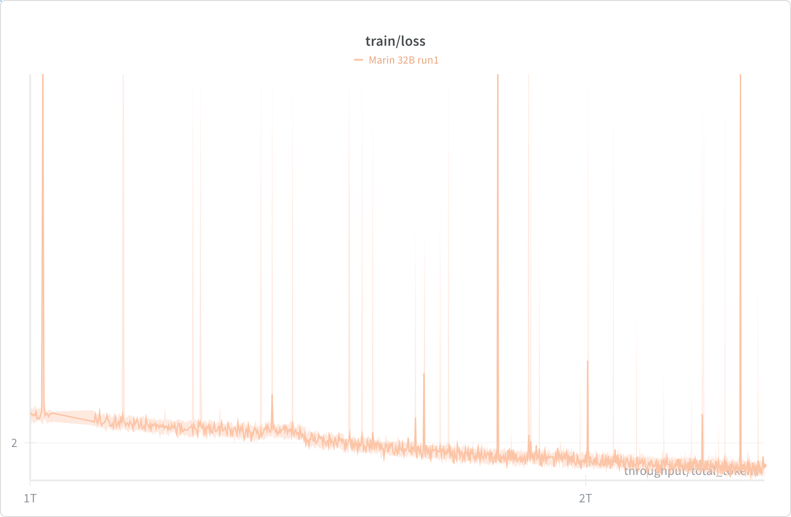

Ideally, there wouldn't be spikes of course. But many of the people we talked to (and our own experience) suggested that if the model recovered quickly and it didn't really change the trajectory, it was fine.

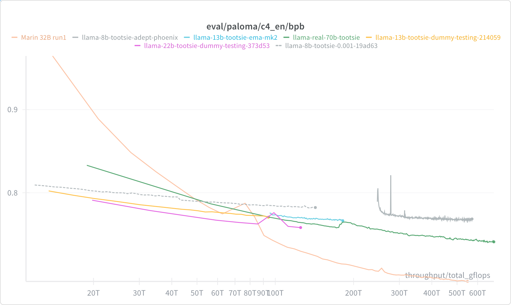

Nevertheless, we were a bit worried, so we added a bunch of instrumentation and a few interventions.

Specifically, we looked at the following mitigations (documented in [#1368](https://github.com/marin-community/marin/issues/1368))

#### 1. Tightened max grad norm clipping
Following standard practice, by default we have clipped our grad norm to a maximum of 1.0.
We observed that loss spikes typically occurred after steps with a large grad norm, but that typically our grad norms were in the range of about 0.2, and norms significantly higher than that often foretold a loss spike.
Therefore, at around 56.4K steps, we tightened the max grad norm to 0.2 to prevent large gradient steps from destabilizing training.

#### 2. Clip Update Norm
When that didn't work, we added a "clip update norm" filter at around 72.2K steps. Like grad norm spikes, update norm spikes always preceded grad norm spikes, and we thought these would be a more direct way of preventing the model from taking too large of a step. This filter computes a rolling average and standard deviation of the optimizer update norms (i.e. after Adam's scaling is applied), and clips updates that exceed the average by a certain threshold (2 stddevs in our case). We hoped that this would reduce the impact of outlier updates that could lead to loss spikes. Ultimately, it also didn't seem to prevent loss spikes, but it may have reduced their severity. We inadvertently turned this off for a few thousand steps around 74K–80K, which may have contributed to the more significant instability we saw then.

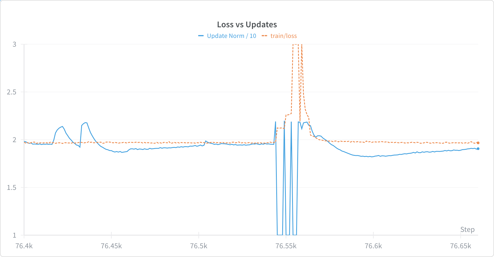

#### 3. Skipping Bad Steps
Based on a tip from Luca Soldaini, we [added a "skip bad steps" flag](https://github.com/stanford-crfm/levanter/blob/9fde0781a1737e088535c392cf239aba5e1143e2/src/levanter/optim/skipstep.py#L65) (modeled on [the version in OLMo](https://github.com/allenai/OLMo-core/blob/main/src/olmo_core/optim/skip_step_optimizer.py)) that skips parameter updates when the update norm exceeds a rolling average by a threshold (2 stddevs in our case).

> Tokens trained: ≈2.679T tokens (80,000 steps; 4096 seq len; batch schedule 0–18,499: 8192, 18,500–21,009: 7680, 21,010–79,999: 8192).

**What we learned:** Gradient clipping and step-skipping heuristics softened the spikes but never removed them; instrumentation alone could not replace an architectural fix at this scale.

### Phase 2: Recovery Without Architecture Changes

Unfortunately, at 80k steps we began to see spikes that were unavoidable even with all the update clipping that we had added. This launched a bit of a fire-drill to see how and whether we could salvage this run!

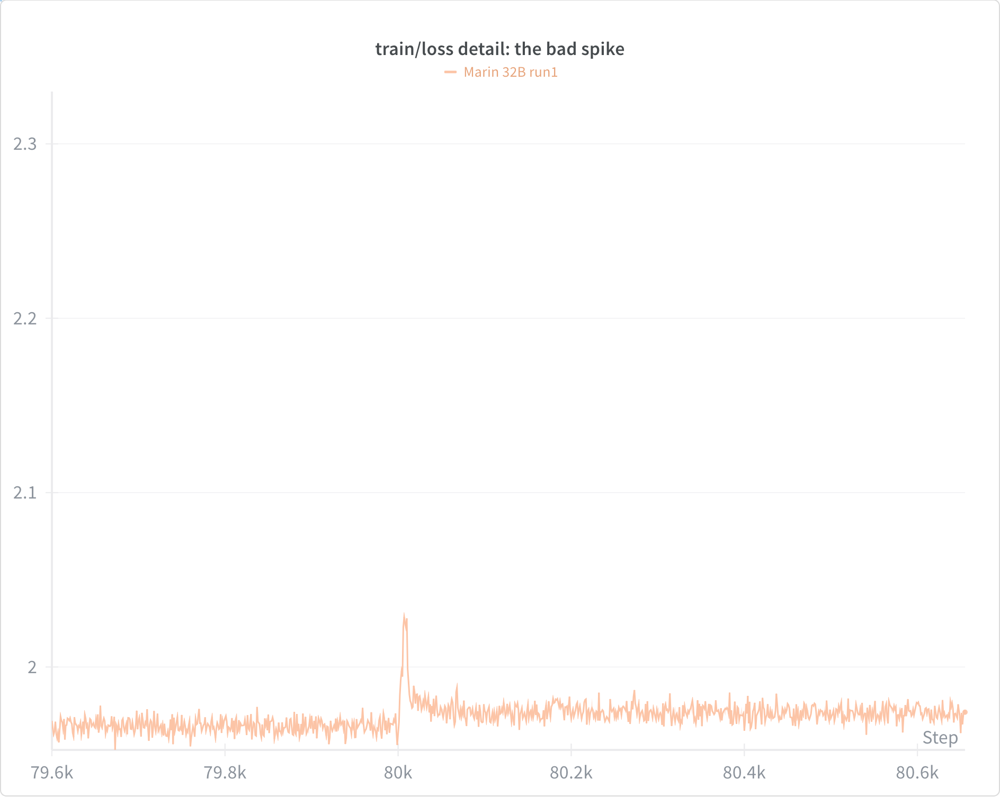

We treated the 80k checkpoint as salvageable and attempted to coax the run back while keeping the Llama backbone.

#### "Necromancy" Restart (`exp1390_32b_necro`)

Github Issue: [#1390](https://github.com/marin-community/marin/issues/1390)

We rebuilt optimizer state offline, seeding the warm‑start with update‑history tensors from the last good checkpoint so the clip‑update‑norm filter would have valid rolling statistics. This stabilized gradients for a few thousand steps, but the run relapsed into spikes—a sign the causes of spikes was more core to the model state.

#### Alternative Optimizers (`exp1388`, `exp1380`)

We next swapped optimizers without touching weights! There's been lots of recent work on better conditioned optimizers, including our own empirical validations in our ["Fantastic Optimizers"](https://arxiv.org/abs/2509.02046) paper.
We specifically tried [Muon](https://kellerjordan.github.io/posts/muon/), which is and was all the rage at the time.

In [`exp1380_muon32b`](https://github.com/marin-community/marin/issues/1380), we used Muon with a higher effective LR = 2e‑3, but we retained the Adam‑style LR schedule to avoid a full retune.

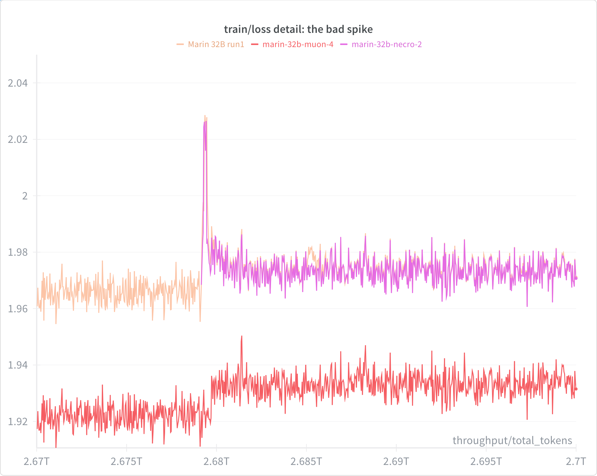

Aside: The Muon run was still warming up its Adam params here so the loss was lower. The Muon run technically spiked a little later, which might be worth investigating.

We actually let it keep going a little longer, but it decided to turn into gradient ascents after a while. So we abandoned it.
We probably need more time to properly tune Muon for this setting.

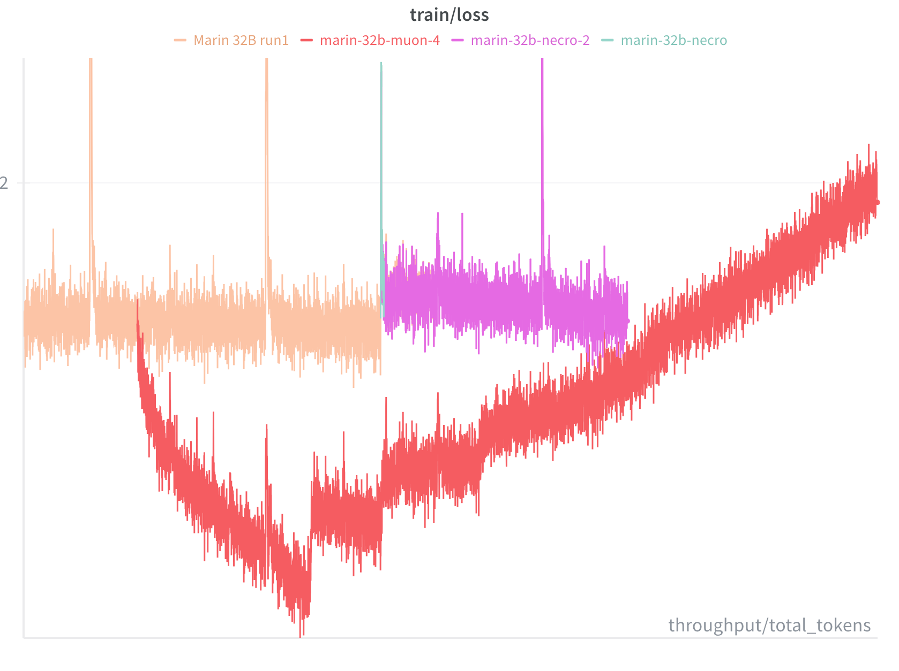

- Tokens trained: Diagnostic restarts only (short runs of a few thousand steps); excluded from cumulative phase totals due to restart to 80k Llama checkpoint for Phase 3.

**What we learned:** Restart tricks and optimizer swaps stabilized gradients briefly but not sustainably, reinforcing that the instability was rooted in the model’s attention stack rather than in optimizer state.

### Phase 3: Switch to QK-Norm (`exp1395_qwen3_32b`)

Github Issue: [#1395](https://github.com/marin-community/marin/issues/1395)

At this point we concluded that stabilizing a 32B Llama without architectural help wasn’t feasible under our constraints. We switched to Qwen3 32B, which adds QK‑Norm in attention, and warm‑started from the 80k Llama weights. This preserved useful signal in embeddings and MLPs while letting the normalized attention heads relearn.

- Prior reports—from [the OLMo team](https://arxiv.org/abs/2501.00656) and [Google DeepMind](https://arxiv.org/abs/2309.14322) among others—suggest QK‑Norm provides substantial headroom against loss spikes in large models.
You might reasonably ask "Why not use QK-norm to begin with?" While we thought about it, we had some hubris from our 8B experience (stable without QK‑Norm) as well as an earlier trial 70B run (also stable without QK-norm).
It is worth noting that the Llama 3 team seems to have trained much larger models without QK-Norm, so it seems possible it is not necessary given the right tuning of underlying hyperparameters, which we continue to explore.

The switch to QK-norm imposed a one‑time loss penalty, but the training loss recovered in about 10B tokens. What's more, the loss spikes disappeared entirely.

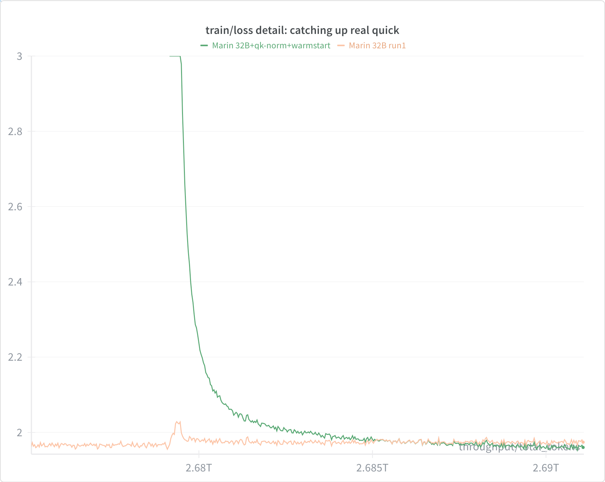

Warm‑start + rewarm parameters (`exp1395_32b`):

| **Setting**            | **Value**               |
|------------------------|-------------------------|
| Warm start checkpoint  | step‑80,000 (Llama 32B) |
| Cycles                 | [80k, 1,000,000,000]    |
| Re‑warmup              | 1,000 steps             |

- Tokens trained: ≈2.684T tokens (80,000 steps from 80k → 160k at 4096 seq len, global batch 8192).

**What we learned:** QK-Norm delivered the headroom we needed. Warm-starting preserved earlier progress while eliminating loss spikes after a short re-warmup.

### Phase 4: Midtraining Runs

With stability restored, we trained until we completed 1 epoch over the Nemotron data and then resumed the 8B playbook.
The first attempt (*Bison*) mirrored our [Starling](./marin-8b-retro.md#phase-5-starling-second-cooldown)-style cooldown and exposed two issues; the second (*Mantis*) fixed them.

#### Attempt 1 — Bison Cooldown

- Issue: [#1529](https://github.com/marin-community/marin/issues/1529)
- Experiment File: [`exp1529_32b_bison_cooldown`](https://github.com/marin-community/marin/blob/main/experiments/tootsie/exp1529_32b_bison_cooldown.py)

Based on the success of our Starling cooldown at 8B, we attempted a similar cooldown at 32B.
Starting from the 160k qk-norm-enabled checkpoint, we ran a 32k-step cooldown with a 70/30 Nemotron/Starling mixture.

### Cooldown mixture (normalized share):

In detail, the cooldown used the same Nemotron-CC mixture as before, supplemented with a mix drawn from Dolmino, Finemath-3-Plus, Arxiv Markdownified, StackExchange Custom, and others.

| Dataset                     | Percentage |
|----------------------------|------------|
| nemotron_cc/medium         | 21.49%     |
| nemotron_cc/hq_synth       | 17.29%     |
| nemotron_cc/medium_low     | 9.79%      |
| nemotron_cc/hq_actual      | 5.81%      |
| nemotron_cc/medium_high    | 5.24%      |
| nemotron_cc/low_actual     | 4.46%      |
| nemotron_cc/low_synth      | 3.99%      |
| arxiv_markdownified        | 7.41%      |
| dolmino/pes2o              | 7.41%      |
| finemath-3-plus            | 4.33%      |
| dolmino/flan               | 4.33%      |
| stackexchange_custom       | 2.18%      |
| dolmino/stackexchange      | 2.18%      |
| starcoderdata              | 1.59%      |
| all_math                   | 1.08%      |
| proofpile_2                | 0.35%      |
| wikipedia_markdown         | 0.47%      |
| dolmino/wiki               | 0.47%      |
| medu_science_qa            | 0.15%      |

Within the 70/30 split, each data source was weighted approximately equal to its token size, but we upsampled FLAN (10x)
and the math from Dolmino (2x). Again, this is the same as the starling cooldown at 8B.

### Training Parameters

We used the following optimizer schedule:

| Setting           | Value |
|-------------------|-------|
| Warmup            | 0     |
| Decay window      | 160k → 192k (≈16.7% of total) |
| LR schedule       | linear |
| AdamC             | enabled during decay |

**Cooldown specifics (changes vs 8B):**

1. Z‑loss throughout. We previously observed late‑decay divergences at low LR in 8B; adding a small z‑loss stopped `lm_head` norm growth during cooldown.
2. [AdamC](https://arxiv.org/abs/2506.02285) during decay. We opted to include this because in the 8b we observed the same gradient growth that it purpoted to fix.
We used the adjusted weight‑decay formulation only in decay phases to reduce gradient growth without retuning the entire schedule.

### Outcome

#### Contamination anomaly — GSM8k.

The run was broadly strong versus OLMo 2 32B, with one extreme exception: GSM8k.
Under the standard LM Eval Harness prompt, the model was ~22 points worse than the weakest baseline.
Under [OLMes](https://github.com/allenai/olmes)‑style prompts, performance looked much more reasonable, but the extreme prompt fragility made us investigate further.

We determined the root cause to be contamination. That is, we (accidentally) cheated but we cheated badly.
Our [Dolmino](https://huggingface.co/datasets/allenai/dolmino-mix-1124/tree/main/data/math) math bundle included GSM8k test items in a `test.json`.
Although we later updated preprocessing to drop `test.json`, the dataset had already been cached on the cluster, introducing contamination for GSM8K on the Bison cooldown.

Dolmino’s GSM8k uses OLMes formatting, not LM Eval’s default.
Therefore, rather than the expected improvement in results from training on the test,
contamination made our model have dramatically increased surprisal on the original prompts structured tags (e.g., `16-8=<<16-7=9>>9`) that don’t appear in the contaminated data.
This high surprisal seemed to cause our model to perform much worse than it did on the same questions with those tags removed.

That said, our MATH performance was also quite poor, and we have no reason to believe it was contaminated.
So, our generally poor performance on math may have other causes.

#### Shuffling anomaly

Near 190k steps, training loss phase‑shifted while validation remained stable.
This is normally observed when we change the underlying training data mix, but in this case we hadn't!
We had separately begun to wonder whether our pseudo-random shuffle, which finds a co-prime step size across data indices, was leading to a somewhat unlucky shuffle where batches came from correlated data. This phase shift in cooldown increased our confidence this was happening!

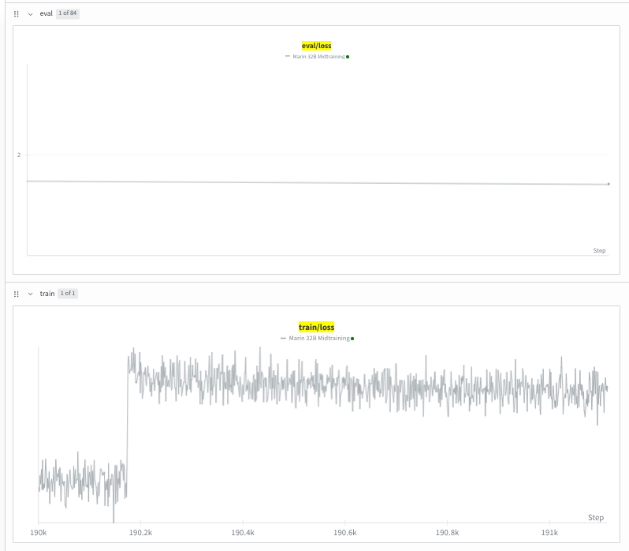

As you can see, this "spike" ended up being a phase shift in training loss that never recovered.
But, eval losses were unaffected.
This strongly indicated that the underlying data had shifted, rather than any model instability.

Why did we use such a bad shuffle? Because it is cheap and stateless! We can compute the index of any data point on the fly without storing large permutation tables.
In addition, our training stack Levanter samples from each mixture component directly, meaning that we always have a stable proportion of tokens from each dataset.
This has historically mitigated the risk of poor shuffles, but in this case it seems to have failed us.

- Tokens trained: ≈1.074T tokens (32,000 steps from 160k → 192k at 4096 seq len, global batch 8192).

#### Attempt 2 — Mantis Cooldown (`exp1529_32b_mantis_cooldown`)

We restarted from 160k with two major changes:

- Feistel shuffle. Switched from linear permutation to a more robust Feistel‑based shuffle.
- Cleaner math mix. Replaced Dolmino math with [MegaMath](https://arxiv.org/abs/2504.02807) splits and later added [Common Pile](https://arxiv.org/abs/2506.05209)'s [Stack V2 EDU](https://huggingface.co/datasets/common-pile/stackv2_edu_filtered) Python (around 174k), redistributing the HQ budget accordingly.

Cooldown mixture (normalized share):

| Dataset                     | Percentage |
|----------------------------|------------|
| nemotron_cc/medium         | 21.49%     |
| nemotron_cc/hq_synth       | 17.29%     |
| nemotron_cc/medium_low     | 9.79%      |
| nemotron_cc/hq_actual      | 5.81%      |
| nemotron_cc/medium_high    | 5.24%      |
| nemotron_cc/low_actual     | 4.46%      |
| nemotron_cc/low_synth      | 3.99%      |
| megamath/web               | 5.57%      |
| arxiv_markdownified        | 4.54%      |
| megamath/text_code_block   | 4.24%      |
| dolmino/pes2o              | 4.54%      |
| megamath/web_pro           | 1.27%      |
| megamath/translated_code   | 0.61%      |
| megamath/qa                | 0.59%      |
| finemath-3-plus            | 2.66%      |
| dolmino/flan               | 2.66%      |
| stackexchange_custom       | 1.34%      |
| dolmino/stackexchange      | 1.34%      |
| starcoderdata              | 1.59%      |
| proofpile_2                | 0.35%      |
| wikipedia_markdown         | 0.29%      |
| dolmino/wiki               | 0.29%      |
| medu_science_qa            | 0.09%      |

Notes:
- At ~174k steps, we introduced `common_pile_stackv2_edu_filtered_python` and re‑normalized the HQ portion accordingly.
- Sampling permutation switched to Feistel.

We kept the optimizer schedule identical to Bison. With better shuffling and clean math, both failure modes disappeared.

- Tokens trained: ≈1.074T tokens (32,000 steps from 160k → 192k at 4096 seq len, global batch 8192).

#### Shuffling: Linear vs. Feistel

Within each batch, we want examples that are as i.i.d. as possible from the full training distribution.
This reduces within‑batch correlation and avoids long, correlated stretches that can bias updates or create non‑stationary “phases” in the loss curve. This also reduces gradient variance from batch to batch, which recent [NanoGPT speedruns](https://www.lesswrong.com/posts/j3gp8tebQiFJqzBgg/how-the-nanogpt-speedrun-wr-dropped-by-20-in-3-months) have found beneficial.

To achieve this in a reproducible way at runtime, we compute pseudo-random permutations over training data blocks inside of the data loader. We previously used an affine/LCG permutation, choosing integers `a` and `b` with `gcd(a, N) = 1` for dataset length `N`, and mapping indices by `p(x) = (a * x + b) % N`. This is a valid permutation (every index appears exactly once), cheap, and stateless.

The issue is that if our step size is very small (or very large) and the data is not pre-shuffled, there can be clear phases in our training data!

In Mantis, we switched to a Feistel‑network permutation, another pseudo‑random permutation (PRP) over the index domain. Conceptually, Feistel splits the bit representation into halves and applies several mixing rounds with per‑round keys, yielding a bijection with much better mixing properties than an affine map. Empirically, this resolved the phase shift effect we had seen earlier.

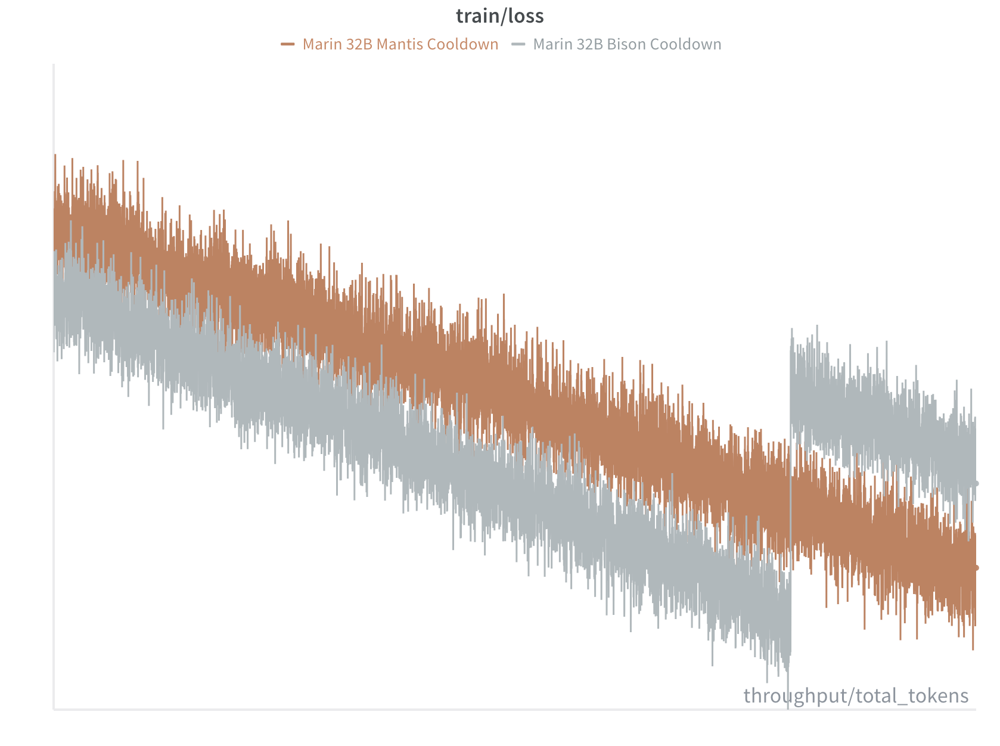

In addition, our validation losses looked better across the board (not just code!)

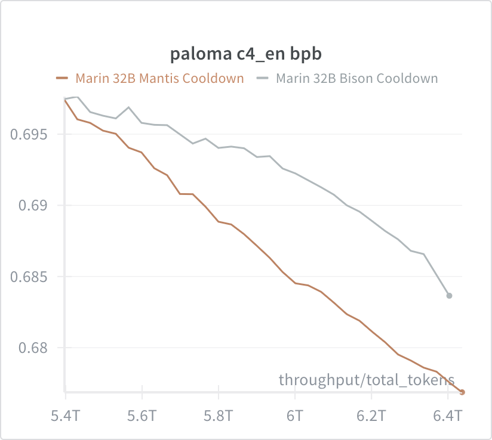

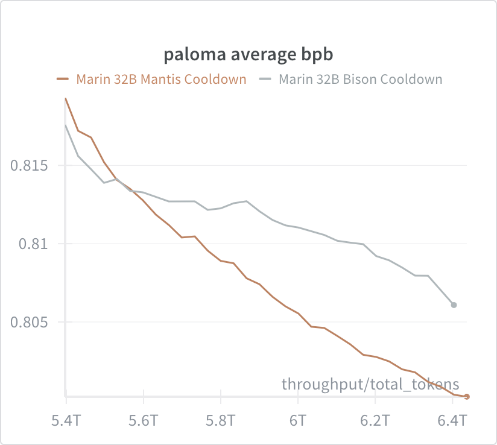

Needless to say, we'll be using Feistel going forward!

**What we learned:** Shuffle quality matters even given perfect per-domain shuffling.

## Base Model Results

We evaluate with Eleuther's [LM Eval Harness](https://github.com/EleutherAI/lm-evaluation-harness) defaults across a standard suite. Numbers may differ from model cards or
other evaluation harnesses (e.g. OLMES) due to prompt/format differences. “Average” is a simple mean over shown tasks.

| Model                                | Average | AGI Eval LSAT-AR | ARC Easy | ARC Challenge | BoolQ | CommonSense QA | COPA | HellaSwag | lambada_openai | OpenBookQA |  PIQA | WinoGrande |   WSC |  MMLU |  GPQA |   BBH | MMLU Pro | HumanEval | GSM8K |  MATH |
| :----------------------------------- | ------: | ---------------: | -------: | ------------: | ----: | -------------: | ---: | --------: | -------------: | ---------: | ----: | ---------: | ----: | ----: | ----: | ----: | -------: | --------: | ----: | ----: |
| **Marin 32B (Bison)**                |    63.0 |             23.4 |     87.8 |          65.8 |  88.9 |           82.3 | 94.0 |      86.6 |           77.4 |       46.6 |  86.1 |      78.61 | 82.42 |  72.9 | 32.13 |  55.2 |     41.9 |     29.27 | 54.71 | 10.35 |
| **Marin 32B (Mantis)**               |    65.2 |             24.8 |     88.0 |          65.7 |  89.4 |           82.8 | 93.0 |      86.9 |           77.2 |       46.4 |  85.9 |       79.3 |  79.5 |  74.7 |  34.0 |  59.6 |     45.1 |      42.7 |  69.1 |  15.3 |
| **OLMo 2 32B Base**                  |    63.2 |             22.6 |     85.9 |         61.86 |  83.0 |           78.6 | 93.0 |      85.9 |           78.3 |       47.2 | 83.08 |      78.85 | 86.81 | 71.85 | 32.21 | 56.07 |     42.0 |     23.78 | 76.35 | 12.69 |
| **Qwen 2.5 32B Base**                |    68.1 |            30.43 |    80.81 |         55.89 | 87.65 |          88.45 | 87.0 |     84.11 |          77.62 |       44.4 |  82.4 |       75.7 | 80.95 | 80.83 | 39.01 | 67.35 |     57.9 |     48.78 | 89.31 | 36.25 |
| **Gemma 3 27B PT**                   |    65.1 |            22.17 |    88.17 |         65.44 | 87.09 |          73.38 | 93.0 |     83.02 |          78.07 |       45.0 | 84.06 |      79.01 | 91.94 | 75.33 | 35.74 | 61.36 |    49.44 |      17.6 | 82.03 | 25.83 |
| **NVIDIA Nemotron Nano 12B v2 Base** |    68.6 |             28.7 |    83.59 |         60.58 | 84.83 |          76.09 | 85.0 |     81.42 |          72.93 |       45.8 | 82.81 |      74.35 | 85.35 |  77.9 | 36.58 | 62.02 |    53.13 |     59.15 | 84.08 | 68.28 |

The newer Mantis cooldown is better in almost every respect compared to Bison. COPA, PIQA and WSC see slight degradations, but, as expected, the coding evaluation HumanEval and math evals GSM8K and MATH
see marked improvements.

In terms of mean rank, Marin fares quite well among other open weights base models:

| Model                                | Mean Rank | Mean Reciprocal Rank |
| :----------------------------------- | ---------:|---------------------:|
| **Marin 32B (Bison)**                |      3.68 |                 0.39 |
| **Marin 32B (Mantis)**               |      3.05 |                 0.44 |
| **OLMo 2 32B Base**                  |      3.89 |                 0.34 |
| **Qwen 2.5 32B Base**                |      3.16 |                 0.54 |
| **Gemma 3 27B PT**                   |      3.37 |                 0.39 |
| **NVIDIA Nemotron Nano 12B v2 Base** |      3.68 |                 0.38 |

Overall, the Mantis 32B model does quite well! In terms of mean rank, it is the best of these models (lower is better).
That said, Qwen 2.5 32B Base has a higher mean reciprocal rank.

In terms of average accuracy, it manages to surpass OLMo 32B (+2.0, better on 14 of 19), the previous best open source base model,
and is more or less on par with Gemma 3 27B PT (+0.1, better on 9 of 19).
It is a bit behind Qwen 2.5 32B Base (-2.8, better on 8/19) and NVIDIA Nemotron Nano 12B v2 Base (-3.4, better on 10/19).
(Nemotron Nano has particularly strong math and code performance, likely due to its training mixture.)

### An Aside on Terminology

When we say "open weights," we mean that the model weights are publicly available for download without restrictive licenses.
These models do not necessarily have open training code or data. When we say "open source," we mean that the model weights,
training code, and training data are all publicly available without restrictive licenses.
All open source models are open weights, but not all open weights models are open source.
Qwen, Gemma 3, and Nemotron Nano are open weight, but not open source. Marin and OLMo are open source.
Note that this is a spectrum: to their credit, NVIDIA released significant details about [Nemotron Nano's training process and data](https://huggingface.co/nvidia/NVIDIA-Nemotron-Nano-12B-v2#training-datasets).

"Base" here means that these models have not undergone instruction tuning or RLHF, though increasingly
the line is blurred as Marin, OLMo, and Nemotron Nano include instruction, reasoning, or task data in their pretraining mixtures.
(We don't know the details of Qwen or Gemma's pretraining mixtures!)
We have not yet produced or evaluated instruction tuned or RLHF versions of Marin 32B. This is planned.

### Caveats

As ever, several caveats are in order:

* These results are from Eleuther's LM Eval Harness with default prompts; other prompt styles (e.g. OLMes) may yield different results.
  Eleuther tends to be a bit stricter than other frameworks, and it doesn't allow any prompt engineering. Your mileage may vary!
* These results are for base models without any instruction tuning or RLHF.
* Gemma 3 supports images, and the open weights models support more natural languages than English; these results are only for English text tasks.
* These are 19 tasks out of many possible tasks; other tasks may yield different relative results.

## Limitations

While we believe Marin 32B is a strong open source base model, it has some limitations:

- It is only a base model! While we believe it is a good base model, it lacks instruction tuning or RLHF that would make it more useful for end users.
- It is still relatively large at 32B parameters, which may make it difficult to deploy for some users.
- It has not undergone long context extension training, which may limit its performance on long context tasks.
- As stated, our model is only trained on English text (as well as programming languages), limiting its performance on other languages.

We welcome community contributions to address these and other limitations!

## Lessons Learned

- **Pride goeth before a fall.** Our initial hubris in thinking we could scale our recipe to 32B without QK‑Norm cost us time and compute. We should have tested QK‑Norm earlier.
- **Midflight changes can work.** The Tootsie Roll process of starting training early and making evidence‑driven changes mid‑flight worked well here, as it did in 8B. While we aspire to a clean run, we anticipate that our first release at each scale will often involve changes mid-run.
- **Data shuffling matters.** The phase shift we observed during Bison cooldown highlighted the importance of good shuffling, as others (including OLMo) have noted. The Feistel shuffle we adopted in Mantis seems to have resolved this.
- **Double check your configs.** We should have caught the GSM8k contamination earlier. While we did eventually identify and fix it, this underscores the importance of verifying dataset contents and preprocessing steps, especially when using cached data. We now have checks in place to prevent similar issues in future runs.
- **Instrument heavily.** Our ability to diagnose and address issues mid-flight was greatly aided by extensive logging and monitoring. We recommend others invest in good instrumentation from the start.

## Acknowledgments

We would like to acknowledge:

* Google, especially Google TPU Research Cloud for providing the compute;
* The datasets and evals produced by AI2, Eleuther, Hugging Face, LLM360, NVIDIA, among others;
* Advice from Elie Bakouch, Lucas Nestler, Omead Pooladzandi, Alec Radford, Luca Soldaini, and Evan Walters on loss spikes (as well as many people privately);
* and our Discord community!

## Glossary

- **AdamC** — An adjusted weight‑decay computation used during LR decay to reduce gradient growth.
- **Cooldown** — A training phase with gradually decreased LR, often paired with a higher‑quality, more structured data mix.
- **EMA (Exponential Moving Average)** — Weight averaging used for evaluation to reduce variance from hot parameters.
- **Feistel shuffle** — A deterministic, epoch‑wise re‑randomization scheme that avoids the autocorrelation of simple linear permutations.
- **QK‑Norm** — Normalization of query/key vectors in attention; improves headroom against spikes at large scales.
- **Tootsie Roll process** — Marin’s pragmatic strategy: start quickly, keep training, fold in changes mid‑flight as evidence accumulates.
- **Z-loss** — A small penalty on the logit norm to prevent `lm_head` explosions during deep cooldowns.
