# Marin 8B Retrospective

<!--

Turns out mkdocs does a ToC

- [Introduction](#introduction)
- [The "Tootsie Roll" process](#the-tootsie-roll-process)
- [Model Basics](#model-basics)
- [Training Phases](#training-phases)
  - [Phase 1: Kestrel (DCLM WSD-S Phase)](#phase-1-kestrel-dclm-wsd-s-phase)
  - [Phase 2: Ocelot (DCLM EMA Phase)](#phase-2-ocelot-dclm-ema-phase)
  - [Interlude: microannealing](#interlude-micro-annealing)
  - [Phase 3: Jellyfish (First Cooldown)](#phase-3-jellyfish-first-cooldown)
  - [Interlude: "Dessert" Runs](#interlude-dessert-runs)
  - [Phase 4: Phoenix (Reheated)](#phase-4-phoenix-reheated)
  - [Interlude: Deeper Cooldowns](#interlude-deeper-cooldowns)
  - [Phase 5: Starling (Second Cooldown)](#phase-5-starling-second-cooldown)
  - [Bonus: Deeper Starling (Dessert)](#bonus-deeper-starling-dessert)
- [Base Model Results](#base-model-results)
- [Supervised Fine-Tuning](#supervised-fine-tuning)
- [Conclusion](#conclusion) -->

## Introduction

This is a retrospective on the first-generation Marin 8B run.

We cover the data mix, hyperparameters, and other training details, along with observations from the run itself—mistakes included. Our goal is to document what worked, what didn’t, and what we learned along the way.

Reproducibility is a core principle of Marin. While this write-up was created post-run and may contain minor inaccuracies, we’ve done our best to be accurate. If you’re looking for more detail, you can also find supporting material here:

- [Marin Data Browser](https://marin.community/data-browser/experiment/?path=gs%3A//marin-us-central2/experiments/exp600_tootsie-9126ea.json)
- [Experiment Pipeline Script](https://github.com/marin-community/marin/blob/main/experiments/tootsie/exp600_tootsie.py)
- [GitHub issue thread](https://github.com/marin-community/marin/issues/600)
- [WandB report](https://wandb.ai/stanford-mercury/marin/reports/Tootsie-8B---VmlldzoxMTY3MzU3OA)

If you’re not already reading this on [ReadTheDocs](https://marin.readthedocs.io/en/latest/reports/marin-8b-retro.html), we recommend viewing it there—there’s a table of contents on the right to help you navigate.

## The "Tootsie Roll" Process

A core premise of the Marin 8B run was that we didn't fully know the best recipe—
so we just started training with what we had, and planned to adapt along the way.
Internally, we referred to this as the "Tootsie" process, a reference to
[Tootsie Rolls, which use a "graining" process](https://en.wikipedia.org/wiki/Tootsie_Roll) where each day's batch
contains a bit of the previous day's, seeding crystallization or something. (We are not food scientists.)
This is admittedly a bit of a strained metaphor, but the idea was that we'd keep folding in new data, training techniques, and whatever else as the training process went on.
(As it would turn out, dear reader, we would often change more than the data...)

## Model Basics

### Model Size

We decided to build a roughly 7-8 billion parameter model mostly out of pragmatism: we initially only had reserved capacity
to train a model of that size for long enough.

### Architecture

We settled on the [Llama architecture](https://arxiv.org/abs/2302.13971) for the usual reasons: it has been shown to work well,
easier to plug into existing inference stacks, no one ever got fired for buying IBM, etc.

We used the same settings as Llama 3.1 8B. More specifically:

| **Parameter**         | **Value**   |
|-----------------------|-------------|
| `hidden_dim`          | 4096        |
| `intermediate_dim`    | 14336       |
| `num_heads`           | 32          |
| `num_kv_heads`        | 8           |
| `num_layers`          | 32          |
| `activation_function` | `silu`      |

We used [Levanter](https://github.com/stanford-crfm/levanter)'s implementation of the Llama architecture.
We trained with a sequence length of 4096 tokens per sample.
We used JAX's TPU Splash Attention kernel.

We used mixed float32/bfloat16 precision, with parameters and optimizer states in float32 and compute in bfloat16
(except for the final softmax over the vocabulary.)
We used the [AdamW](https://arxiv.org/abs/1711.05101) optimizer. We do not weight decay input embeddings or layer norm parameters.

### Tokenizer

In Marin, we also standardized on the Llama 3 tokenizer, after [an experiment](https://github.com/marin-community/marin/issues/524) showing it outperformed both Llama 2 and NeoX in terms of bits-per-byte (bpb).

### Batch Schedule

We used a varying batch schedule, ranging from 1024 × 4096 = 4Mi tokens, to 3072 × 4096 = 12Mi [^Mi] tokens, and up to 4096 × 4096 = 16Mi tokens per step.

[^Mi]: Note: `Mi` refers to mebibytes, not megabytes—i.e., powers of 2.

As with many aspects of the run, this schedule wasn't part of our original plan. We adapted it opportunistically as the run progressed.

### Checkpointing Policy

We saved permanent full checkpoints every 20,000 steps (which, due to the varying batch schedule, could be a varying number of tokens). "Temporary" checkpoints were saved much more frequently, but were deleted as new checkpoints were saved.

### Hardware

The TPU hardware varied between two different TPU clusters, generously provided by Google's [TPU Research Cloud](https://sites.research.google/trc/about/):

- 2x v5e-256, configured using [multislice](https://cloud.google.com/tpu/docs/multislice-introduction)
- 1x v4-2048

The first phase was run on the 2x v5e-256, while subsequent phases were run on the v4-2048.

## Training Phases

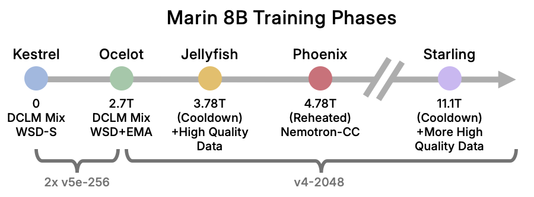

Retrospectively, we can partition the 8B run into several distinct phases—each nicknamed after an animal:

- *Kestrel (DCLM WSD-S Phase)*: In the first phase, we used the "DCLM mix" and [WSD-S](https://arxiv.org/abs/2410.05192) for about 2.7T tokens. We used 2x TPU v5e-256 coordinated with multislice for this. (0→2.7T tokens)
- *Ocelot (DCLM WSD Phase)*: We were given access to a v4-2048 slice and moved to that. To better utilize the hardware, we increased our batch size 50%. We also switched from WSD-S to WSD. We kept the learning rate high through 3.78T tokens.
- *Jellyfish (First Cooldown)*: It was time to cooldown as we were starting to run low on DCLM. Following recent work on midtraining (e.g. [Olmo 2](https://arxiv.org/abs/2501.00656)), we decided to fold in higher quality data during cooldown. (3.78T→4.78T tokens)
- *Phoenix (Reheated)*: We had more time for training, so we rapidly rewarmed the model and transitioned our mixture to [Nemotron-CC](https://arxiv.org/abs/2412.02595) (plus [StarCoder Data](https://huggingface.co/datasets/bigcode/starcoderdata)). (4.78T→11.1T tokens)
- *Starling (Second Cooldown)*: Now we were running low on time, so we started another cooldown. We followed a similar process to the first cooldown, but added a few new datasets that we had created and also some that had dropped since our previous attempt. (11.1T→12.75T tokens)

These phases were not planned in advance. Decisions were made reactively based on changing timelines and data availability.

While the final Marin 8B model came from a single linear run, we also explored a number of side paths. Some of these were by design—for example, short microannealing experiments
(inspired by [Olmo 2](https://arxiv.org/abs/2501.00656), [Yi](https://arxiv.org/html/2403.04652v1), [DBRX](https://www.databricks.com/blog/introducing-dbrx-new-state-art-open-llm)) that informed our cooldown mix.
Others tested "deeper cooldown" strategies or addressed issues like "SFT-ability." We summarize these later, but you can find more detail in:

**Annealing Experiments:**
* [GH#784](https://github.com/marin-community/marin/issues/784): High Quality Data Annealing Experiments on Dolma/Dolmino
* [GH#820](https://github.com/marin-community/marin/issues/820): Evaluate High Quality Datasets for Cooldown Mix
* [GH#934](https://github.com/marin-community/marin/issues/934): Comparing Cooldowns on Pretraining Data v.s. HQ Data

**SFT-ability:**
* [GH#898](https://github.com/marin-community/marin/issues/898): Raccoon: Try deepening the cooldown of "jellyfish" to see if it improves SFT
* [GH#916](https://github.com/marin-community/marin/issues/916): Spoonbill: not-quite-so-deep cooldown

## Phase 1: Kestrel (WSD-S Phase)

In the first phase, we trained from scratch using what was, at the time, the best publicly available dataset (according
to standard benchmarks like MMLU):
[DCLM Baseline](https://huggingface.co/datasets/mlfoundations/dclm-baseline-1.0), from the [DCLM paper](https://arxiv.org/abs/2406.11794).
We adopted their “best mixture”: DCLM Baseline, [StarCoder Data](https://huggingface.co/datasets/bigcode/starcoderdata), and [Proofpile 2](https://huggingface.co/datasets/EleutherAI/proof-pile-2).

The DCLM paper used a curriculum, mixing in StarCoder and Proofpile only near the end of training.
We did **not** start with a curriculum—though we ended up adding quite a bit of one later.
(We intended to add new datasets as we trained, but they were still being produced.)

### Hardware

We started with a reserved 2x TPU v5e-256 slice, which was the largest TPU slice available to us at the time. We used [multislice](https://cloud.google.com/tpu/docs/multislice-introduction) to coordinate the two slices.

### Data Mix

At the beginning, we decided to use the DCLM 7B mix in
ratios roughly proportional to token count. (DCLM 7B was, at the time, the best open source model.)

Specifically, this meant:

| Dataset                                                                          | Percentage |
|----------------------------------------------------------------------------------|------------|
| [DCLM Baseline](https://huggingface.co/datasets/mlfoundations/dclm-baseline-1.0) | 92.6%      |
| [StarCoder Data](https://huggingface.co/datasets/bigcode/starcoderdata)          | 6.1%       |
| [Proofpile 2](https://huggingface.co/datasets/EleutherAI/proof-pile-2)           | 1.3%       |

We planned on adding new datasets as we (and others!) developed them.
For evaluation, we initially tracked a large subset of Paloma (with a particular focus on the `c4en` subset) during training.

### WSD-S

Based on the success of [our work understanding cyclic warmup-stable-decay schedules (WSD-S)](https://arxiv.org/abs/2410.05192), we decided to use a
WSD-S learning rate schedule.
WSD-S is essentially a cyclic warmup–stable–decay schedule, where you warm up, hold a long plateau at peak learning rate, and then decay—repeating the stable and decay phases.
The decay phases allow you to measure how the model is performing.

WSD-S has a number of appealing properties:

- You can run at a very high learning rate for as long as you want, without needing to pre-register cooldowns.
- We could periodically do a rapid cooldown to get a sense of model performance without (completely) "wasting" FLOPs.
- WSD-S was shown to converge just as well as the more standard cosine schedule at any given point, meaning we could potentially use the checkpoints as fodder for scaling law analysis.

For the first 200K steps, we did a decay cycle every 10k steps for 1k steps.
However, I (@dlwh) got worried that we weren't seeing significant improvement in evaluation losses.
We then moved to a decay cycle every 20k steps for 2k steps, which led to a significant improvement in some eval losses,
but not all. (See below.)

We ended up moving away from WSD-S after this phase, for reasons to be detailed later.

### Other hyperparameters

We used a sequence length of 4096 and a batch size of 1024 * 4096 = 4Mi tokens.

The [DCLM paper](https://arxiv.org/abs/2406.11794) also showed that you could run fairly "hot", and we followed their example.
At 1e-3, our LR was roughly 3x higher than [Olmo 2 7B](https://arxiv.org/abs/2501.00656)'s 3e-4, and, with WSD-S, we were running at peak LR for 90% of steps.
We used a weight decay of 0.05. These are roughly consistent with Table 12 of the [DCLM paper](https://arxiv.org/abs/2406.11794).
(They recommend 2e-3, but we encountered instability at that rate.)

We initially opted to not use Z-loss because we didn't have problems with LR=1e-3 and wanted to keep things as simple
as possible. In retrospect, we should have used it and have since made it the default for future Marin runs.

### Specification

The specification for the first phase is available on [GitHub](https://github.com/marin-community/marin/blob/1e713371b25b0d2a1fc90b917e954e460ebd6c2c/experiments/tootsie/exp600_tootsie.py#L55-L81).

### Notes

#### Stability

Training was fairly stable with very few spikes.

#### WSD Cycle Change

At step 200k, we had a hypothesis that longer cooldowns would show more progress in terms of eval losses.
We had been doing a decay every 10k steps for 1k steps, and we switched to a decay every 20k steps for 2k steps.
That is, we still spent 10% of our steps in a decay phase, but each decay phase was twice as long, giving the model more
time to consolidate its progress.

Visually, the schedule now looked like this:

As expected, this led to a drop in eval losses that most looked like our training data. In the below, the orange line is
eval loss (Paloma's c4en), while the blue line is training loss.
There is a noticeable drop in both the eval loss and the training loss during the decay phase.

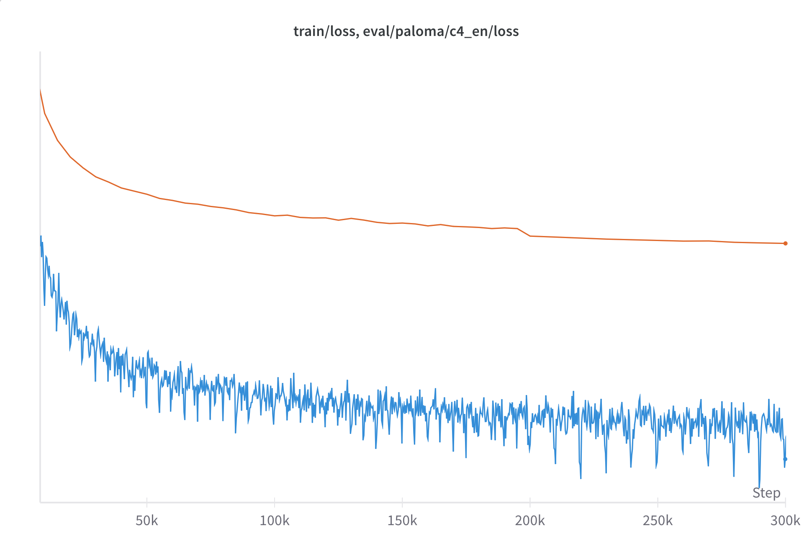

Interestingly, not all eval losses dropped.  In fact, for some domains, the eval loss increased.
We saw decreases in `mc4`, `c4en`, `m2d2 wikipedia`, `m2d2 s2orc`, and `refined web`, but marked increases in `100_subreddits`, `twitterAAE_HELM_fixed`, `manosphere`, `4chan`, among a few others.
Interestingly, after the initial spike, most of those domains began trending downward as well.
Subsequent analysis revealed that this was due to structural differences in preprocessing between the domains: some Paloma domains had texts that obligatorily ended with a space character (which we did not strip), which was not how our training data was formatted.
The deeper cooldown allowed the model to "dislike" these final spaces more clearly.
We investigated this behavior further in [this analysis](https://github.com/marin-community/marin/issues/826#issuecomment-2696496271).

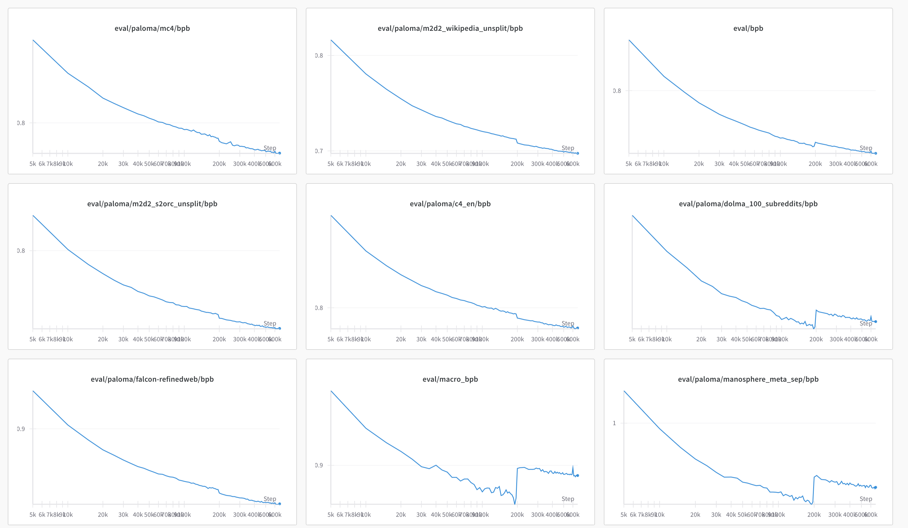

## Phase 2: Ocelot (EMA Phase)

At around 2.7e12 tokens, we gained access to a v4-2048 reservation and immediately transitioned over.
All subsequent phases were run on that hardware.

### Adjusted Hyperparameters

To better utilize the hardware, we increased our batch size by 3x, to 12Mi tokens at around 2.77e12 tokens.
Following [this blog post by Sadhika Malladi](https://www.cs.princeton.edu/~smalladi/blog/2024/01/22/SDEs-ScalingRules/), we increased the learning rate to 1.7e-3,
which is approximately the old learning rate multiplied by $`\sqrt{3}`$ (the square root of the batch size increase).

We also switched from WSD-S to WSD, using the exponential moving averaging (EMA) of weights for monitoring evaluation performance. We did this following the [Deepseek V3 paper](https://arxiv.org/pdf/2412.19437v1). We used a $`\beta`$ of 0.995.
Initially, I inadvertently got the direction of the EMA wrong, so early evals were not substantially different from the "hot" model. Oh well.

We did not reset the optimizer state or do a rewarmup in this or any transition.

To my continued embarrassment, I also realized we were still using Llama 2’s rotary embedding settings. We switched to Llama 3-style at this point.

### Specification

The specification for the second phase of training is [here](https://github.com/marin-community/marin/blob/852c53f9741b233549daf9f1649fe88c9c5a170c/experiments/tootsie/exp600_tootsie.py#L81-L116).

### Notes

#### Stability

Despite the changes, training was still fairly stable with very few spikes.
We saw a brief spike near the beginning which we attribute to the change in rotary embeddings, though we did not investigate this further.

#### The EMA Gap

One of the most interesting things we saw during this phase was what we call the "EMA gap."
The EMA gap is the difference between the eval loss of the EMA model and the eval loss of the hot model. As expected, the EMA loss was better.
Surprisingly, the gap was fairly stable over time, changing only with changes to the learning rate (or different datasets). For c4en, with the hot learning rate, the gap was consistently around 0.015 bits-per-byte (bpb). A stable gap of 0.017 was observed in the subsequent Phoenix phase. The EMA gap would of course shrink as the learning rate was cooled down (since, in the limit, the model freezes).

That’s not to say the gap never shifted, but it didn’t appear to trend upward or downward over time, which surprised us.

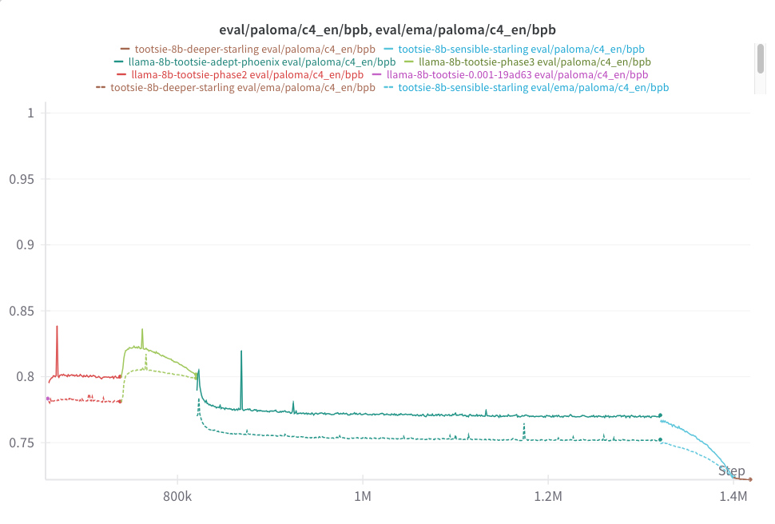

### Interlude: Microannealing

Following recent work on midtraining (e.g. [Olmo 2](https://arxiv.org/abs/2501.00656), [Yi](https://arxiv.org/html/2403.04652v1), [DBRX](https://www.databricks.com/blog/introducing-dbrx-new-state-art-open-llm)), we knew we would need to mix in higher quality data during our cooldowns. But what actually constitutes higher quality data?

Llama 3 and Olmo 2 used small experiments (what Olmo calls "microannealing") to test the effect of different data sources. The basic idea is to take a model that has already been mostly trained, and then do a short cooldown with ~70% original data and ~30% a test high quality data source. (Olmo 2 uses 50/50.) We ran a series of microannealing runs to test the effect of different data sources.

See [GH#784](https://github.com/marin-community/marin/issues/784) and [GH#820](https://github.com/marin-community/marin/issues/820) for the experiments and more details on our approach.

The most important takeaway was that, in microannealing experiments, naively oversampling “High Quality” (HQ) data did not improve task performance.
It did, however, consistently improve loss on HQ validation sets (e.g., Paloma’s various subsets)—which isn’t surprising, since those eval sets often came from the same or similar domains as the HQ training data.

We believe this is because typical "high quality" data sources (e.g. ArXiv, Wikipedia) don't have as much fewshot-learning-inducing data (e.g. multiple choice questions) as the broader web does. When you replace such a large fraction of the Pretraining (PT) mix with a HQ source, you lose out on this data and task performance suffers.

In fact, we found that nothing led to improved task performance in microannealing experiments compared to the control (of 100% PT mix)... until we mixed in FLAN into all microannealing runs. FLAN was designed to improve fewshot-learning performance, and so it was a perfect fit for our microannealing experiments. Instead of the 70% PT / 30% HQ recommended in the Llama 3 paper, we found that 70% PT/ 15% FLAN/15% HQ led to the best results for our experiment budget.

By doing this, we were able to improve both the loss and the task performance of most microannealing runs. Ironically, notwithstanding the above, only 70% PT/30% FLAN underperformed the 100% PT control.

We also found that a microannealing experiment with all HQ sources resulted in average performance compared to the other microannealing runs; in this setting, there was no advantage in having a variety of data.

In summary:

- Naively oversampling "high-quality" (HQ) sources improved loss on HQ eval sets, but degraded general task performance.
- HQ data often lacks formats useful for few-shot learning (e.g., multiple-choice Q&A).
- Mixing in FLAN counteracted this by reintroducing task-like structure, improving task performance.
- The best results came from 70% PT / 15% FLAN / 15% HQ — not from HQ alone.
- Mixing all HQ sources together performed about at the average of the specific HQ sources.
- Including FLAN alone (i.e. 70% PT / 30% FLAN) underperformed the PT baseline.

So: FLAN helps in moderation. HQ alone didn't.

## Phase 3: Jellyfish (First Cooldown)

At around 3.7T tokens, we were running low on DCLM tokens, which meant we needed to change something. We decided to try a cooldown.

### Data Mix

Based on the above, we decided to mix in a mixture of 70% high quality "web" (i.e. Dolmino's DCLM HQ and [StarCoder](https://huggingface.co/datasets/bigcode/starcoderdata)) and 30% of a combination of modified Dolmino and [FineMath-3+](https://huggingface.co/datasets/HuggingFaceTB/finemath).

Specifically, we included all sources from our ablations that outperformed the 100% PT control, which is everything we tried at this phase except Dolmino FLAN.

| Dataset               | Percentage |
|-----------------------|------------|
| Dolmino DCLM HQ       | 67.8%      |
| Dolma peS2o           | 10.8%      |
| FineMath 3+           | 6.3%       |
| Dolma Arxiv           | 5.2%       |
| Dolma StackExchange   | 3.2%       |
| StarCoder             | 2.2%       |
| Dolma Algebraic Stack | 2.1%       |
| Dolma Open Web Math   | 0.9%       |
| Dolma Megawika        | 0.8%       |
| Dolma Wikipedia       | 0.7%       |

The HQ sources were weighted roughly proportional to token count and then upweighted to be 30% of the total.

The main deviations from the Dolmino mixture were:

- We included datasets that [Olmo 2](https://arxiv.org/abs/2501.00656) used in its Phase 1 (e.g. wikipedia) that we did not.
- We did not include [FLAN](https://arxiv.org/abs/2109.01652). (We were suspicious of its fairly repetitive templating.)
- We did not include the other synthetic math datasets in Dolmino. (Similarly, but this was a mistake.)
- We added [FineMath-3+](https://huggingface.co/datasets/HuggingFaceTB/finemath).

### Learning rate schedule

We decayed the learning rate from 1.7e-3 to 1.7e-4 over 1e12 tokens (79500 steps at 12Mi tokens/step). We used a linear decay schedule.

### Results

Results for this model are pretty good for "base model" tasks, though predictably not great for math and instruction following.

| Task                        | Score (%) |
|-----------------------------|-----------|
| MMLU (5-shot)               | 65.3      |
| MMLU (0-shot)               | 62.5      |
| GSM8K (8-shot)              | 50.9      |
| HumanEval (pass@1)          | 24.4      |
| MATH (4-shot)               | 18.5      |
| IFEval (prompt-level loose) | 9.2       |

A 5-shot MMLU of 65.3 was better than both Olmo 2 7B (63.9) and DCLM (64.4), and not too far behind Llama 3.1 8B (66.4).[^MMLU scores] But we can do better.

[^MMLU scores]: These scores are from [our evaluations](#base-model-results), except for DCLM, for which we use their published score.

### Notes

#### C4 EN Perplexity

Interestingly, this mix led to a large increase in Paloma c4en loss:

We haven't investigated this, but our hypothesis is that there are more structural differences in the formatting between DCLM HQ and c4en than there were between DCLM Baseline and c4en.

It is worth noting that we did not observe this increase in our largely similar final cooldown (which used Nemotron CC instead of Dolmino's DCLM HQ).

## Interlude: "Dessert" Runs

While our "mainline" run continued in the Phoenix phase, we ran a number of short ablations
consisting of what we termed "dessert" runs.
Dessert coasted at the same already-low, learning rate with the goal of patching a few gaps in capabilities: we added the synthetic math datasets from Dolmino that we had excluded from our main run and added FLAN. See [this comment in GH#600](https://github.com/marin-community/marin/issues/600#issuecomment-2704462502) as well as [this one](https://github.com/marin-community/marin/issues/600#issuecomment-2704521062) for more details.
(Dessert runs are called "dessert" because they come at the end and originally, at least, added FLAN.)

- Adding the math datasets improved GSM8K and MATH somewhat. GSM8K went from 0.509 to 0.611, and MATH went from 0.184 to 0.211. Not enough to get excited about, but a positive sign for later.
- FLAN didn't help final MMLU 5-shot (.653->.651) or other tasks, at least not in this regime.

So "Dessert" was seemingly a failure, though we revisit this in the final phase.

## Phase 4: Phoenix (Reheated)

The specification for this phase is available [here](https://github.com/marin-community/marin/blob/852c53f9741b233549daf9f1649fe88c9c5a170c/experiments/tootsie/exp600_tootsie.py#L465-L522).

After the cooldown, at around 4.7T tokens, we had more time for training, so we decided to keep going. We rapidly rewarmed the model and transitioned our mixture to [Nemotron-CC](https://arxiv.org/abs/2412.02595) (plus some code and math).

### Data

Because we were running out of DCLM, we transitioned the data from our phase 1 and 2 mixture (DCLM+StarCoder+ProofPile 2) to a new mixture that was [Nemotron-CC](https://arxiv.org/abs/2412.02595) and [StarCoder](https://huggingface.co/datasets/bigcode/starcoderdata).
(We didn't worry too much about epoching StarCoder.)

The target mixture was Nemotron-CC (with each subset weighted approximately proportionally to token count) and StarCoder,
also weighted by token count. As a transition, we weighted all components
(DCLM, StarCoder, Proofpile, and Nemotron's subcomponents) approximately proportional to token count, which we used for 2,000 steps (about 25.2e9 tokens), after which we switched to the target mixture.

### Learning Rate Schedule

We rewarmed the learning rate linearly from 1.7e-4 to 1.7e-3 over those same 2,000 steps and
held the learning rate fixed at 1.7e-3 for the remainder of this phase.

### Notes

The most interesting thing about this phase was that the transition went very smoothly. We expected a substantial loss spike, but didn't see one. The loss did jump, but returns to a slightly lower level than where the run was before the cooldown.

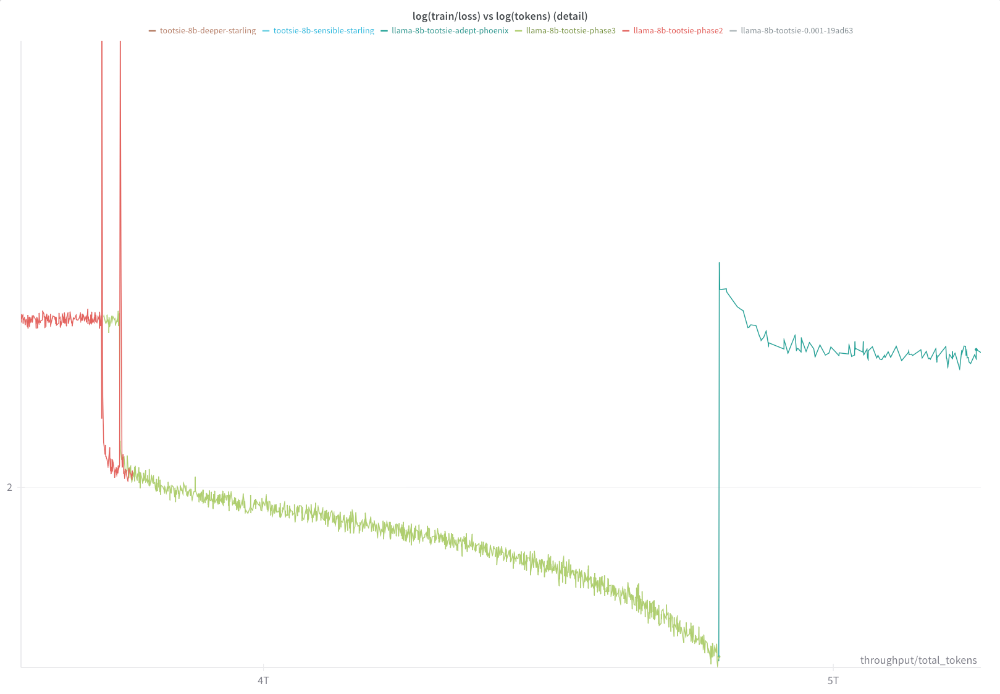

Another point of small interest is that the steady state c4en loss for Phoenix was considerably lower
than DCLM. This need not mean anything other than structural similarities in the preprocessing.
We have not investigated this further.

## Interlude: Deeper Cooldowns

While Phoenix was running, we also ran a series of "deeper" cooldowns, trying to improve the model's amenability to supervised fine tuning ("SFT-ability"). This led to the [Raccoon](https://github.com/marin-community/marin/issues/898) and [Spoonbill](https://github.com/marin-community/marin/issues/916) series of runs.

### Raccoon: Debugging SFT-ability

The genesis of Raccoon was that we were having trouble getting our model to perform well after supervised fine tuning (SFT). While our nascent SFT pipeline would exhibit an "epoch cliff" (i.e. loss would jump down on each repeated epoch) for Llama 3.1 8B and Olmo 2 7B, [it didn't do that for our model](https://github.com/marin-community/marin/issues/897), and indeed didn't perform that well. We hypothesized that this was because our "cooled down" LR was still quite high: 1.7e-4, which was closer to Olmo 2's peak LR than their final LR.
We thought this might have something to do with our struggles with SFT-ability.

Starting from the jellyfish cooldown, we further cooled down the model from 1.7e-4 to 1.7e-5 over about 100B tokens. ([WandB report here](https://wandb.ai/stanford-mercury/marin/reports/898-Tootsie-Soft-Raccoon--VmlldzoxMTk3NjUwNg?accessToken=06f87pmmvhdulczenkg3349jxk7e1pwbd4pdci2i8wvyxg9289122gfnckr9ymwc))
Things looked good at first, but as the cool down deepened the training loss started slowly creeping up?!?
We could understand if there was a divergence but we couldn't understand a slow increase in training loss.

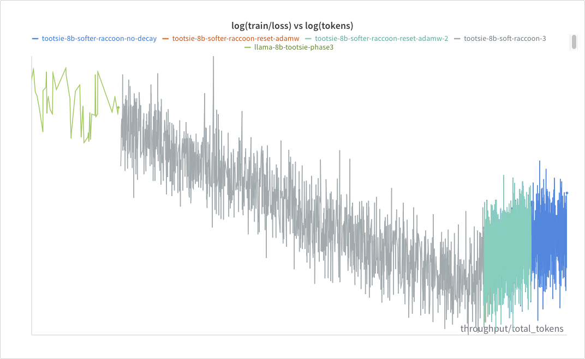

We tried a number of things to debug this:

- Resetting the optimizer state (maybe something was wonky?)
- Removing weight decay (maybe the gradient signal was too weak?)

Nothing solved the problem.

What?

(That said, SFT performance did get better, so that was good!)

### Spoonbill: Z-loss to the rescue

[WandB report here](https://wandb.ai/stanford-mercury/marin/reports/916-Tootsie-Hypnotic-Spoonbill--VmlldzoxMjA1NjU2Nw)

With [Spoonbill](https://github.com/marin-community/marin/issues/916), we tried decaying to 3e-5 rather than 1.7e-5. (3e-5 was Olmo 2's final LR, and in Raccoon we were still seeing decreases at 3e-5.) We also threw in some [Tulu v3 data](https://arxiv.org/abs/2411.15124) (.3% of the data) and FLAN (1%) to adjust the data schedule and generally improve SFT-ability.

Alas, the training loss still crept up.

What?

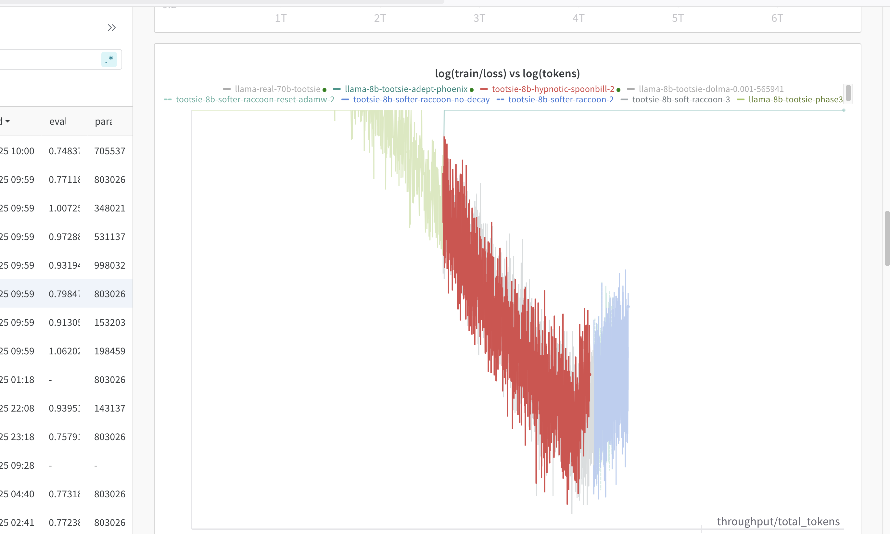

We reran with extensive norm tracking and finally isolated the problem: the `lm_head` was exploding:

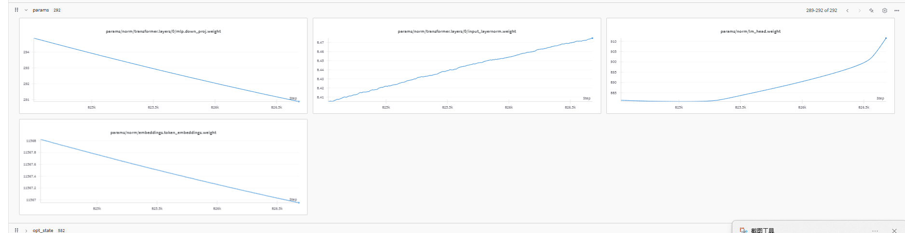

We fixed this by adding a z-loss penalty of 1e-4 on the final logits.

And it worked!

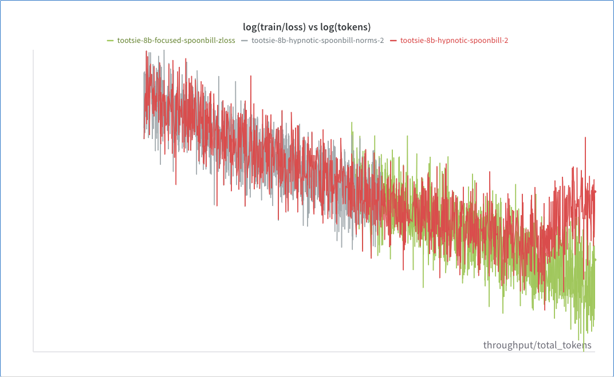

Interestingly, [subsequent experiments](https://wandb.ai/marin-community/marin/reports/ZLoss-vs-Not-1-4B--VmlldzoxMjEzMzA1NA) showed that, when starting from scratch, z-loss **increases** the norm of the lm_head, while it decreases the scale on the final layer norm.
(In retrospect, this makes sense, for two reasons. First, the final layer norm has a disproportionate impact on the scale of the logits compared
to any one component in the lm_head. Second, layer norms are typically not weight decayed, so z-loss is the only regularization pressure on it.)

So, z-loss, it's not just for avoiding explosions.

## Phase 5: Starling (Second Cooldown)

At around 11.1e12 tokens, we decided to start another cooldown. Building on lessons from our previous cooldowns, we made the following changes:

- We deepened the cooldown to 1.7e-5, rather than 1.7e-4.
- We added a small z-loss penalty of 1e-4.
- We increased the batch size to 16Mi tokens rather than 12Mi.

This cooldown ran for 1.34T tokens.

### Data

We switched to a mix that was 70% [Nemotron-CC](https://arxiv.org/abs/2412.02595) and 30% high-quality sources, including some new sources we created.
Nemotron-CC's components were weighted according to compressed bytes (which is roughly proportional to token count).
Within the high quality datasets, we weighted them roughly proportional to token counts multiplied by an oversampling ratio we set more or less arbitrarily.

We included the following datasets:

| Dataset                           | Proportion | Oversampling |
|-----------------------------------|------------|--------------|
| NemoTron CC Medium                | 22.1% | 1x |
| NemoTron CC HQ Synth              | 17.8% | 1x |
| NemoTron CC Medium Low            | 10.1% | 1x |
| NemoTron CC HQ Actual             | 6.0% | 1x |
| NemoTron CC Medium High           | 5.4% | 1x |
| NemoTron CC Low Actual            | 4.6% | 1x |
| NemoTron CC Low Synth             | 4.1% | 1x |
| Marin Arxiv Markdown         | 5.2% | 5x |
| Dolmino peS2o                     | 5.2% | 5x |
| StarCoder Data                    | 4.5% | 1x |
| Proofpile 2                       | 4.5% | 1x |
| Finemath (3+)                     | 3.0% | 5x |
| Dolmino FLAN                      | 3.0% | 10x |
| Dolmino StackExchange             | 1.5% | 5x |
| Marin StackExchange Markdown | 1.5% | 5x |
| Dolmino Math                      | 0.8% | 10x |
| Marin Wikipedia Markdown     | 0.3% | 5x |
| Dolmino Wiki                      | 0.3% | 5x |
| [Marin Datashop Science QA](https://huggingface.co/datasets/marin-community/datashop-science-qa) | 0.1% | 5x |

Here "Dolmino Math" refers to most of the mathy components of Dolmino:

- [CodeSearchNet](https://arxiv.org/abs/1909.09436) (with OWM Filter)
- [GSM8K](https://arxiv.org/pdf/2110.14168v1)
- [MetaMath](https://arxiv.org/abs/2309.12284)
- [Dolmino SynthMath](https://arxiv.org/abs/2501.00656)
- [MathCoder2 Synthetic](https://arxiv.org/abs/2310.03731)
- [Dolmino TinyGSM-MIND](https://arxiv.org/abs/2501.00656)
- [Dolmino Tulu Math](https://arxiv.org/abs/2501.00656)

About the new datasets:

#### Marin Datashop Science QA

[Marin Datashop Science QA](https://huggingface.co/datasets/marin-community/datashop-science-qa) is a new dataset of 12.6B mostly science questions generated by rephrasing science-related web content using Marin Datashop. The pipeline first annotates a small subset of data using an LLM, trains a quality filter model on those annotations, then applies the filter to score and select high-quality examples from the full corpus.

##### Marin Markdown Corpora

More details on the Markdown corpora are available in [our report on the datasets](../reports/markdownified-datasets.md).

We create three new datasets by Markdownifying a few different "high-quality sources."  The motivation behind these datasets was two-fold. First, we wanted to create high-fidelity conversions of high-quality sources that preserve important structure and formatting (e.g., tables and LaTeX). Second, Markdown has increasingly become the default format for many LLM applications, so training on Markdown-style inputs may improve downstream usability. (Also, we noticed in [our visualization experiments](https://github.com/marin-community/marin/issues/826) the prior checkpoint was qualitatively worse at Markdown than Llama 8B.)

- Marin Arxiv Markdown (available as two datasets: [ar5iv-no-warning-markdown](https://huggingface.co/datasets/marin-community/ar5iv-no-problem-markdown) and [ar5iv-warning-markdown](https://huggingface.co/datasets/marin-community/ar5iv-warning-markdown)) is a new dataset of [Arxiv](https://arxiv.org/) papers that have been markdownified from their HTML5-formatted versions from the [Ar5iv](https://ar5iv.labs.arxiv.org/) project. (The warning/no-problems distinction is from the conversion from LaTeX to Markdown.)
- [Marin StackExchange Markdown](https://huggingface.co/datasets/marin-community/stackexchange-markdown) similarly is a version of StackExchange markdownified from HTML5-formatted versions.
- [Marin Wikipedia Markdown](https://huggingface.co/datasets/marin-community/wikipedia-markdown) is a new dataset of [Wikipedia](https://wikipedia.org/) articles that have been markdownified from their HTML5-formatted versions, which are available through the now deprecated [Wikipedia Enterprise HTML Dumps](https://dumps.wikimedia.org/other/enterprise_html/).

These datasets are licensed under the original licenses of the individual documents.[^license]

[^license]: Please refer to [StackExchange](https://stackoverflow.com/help/licensing),
[Wikipedia](https://en.wikipedia.org/wiki/Wikipedia:Database_download),
and [arXiv](https://arxiv.org/help/license) for more information.

### Learning Rate Schedule and Other Hyperparameters

We linearly cooled down the learning rate schedule from 1.7e-3 to 1.7e-5 (sic) over approximately 1.34e12 tokens
(80,000 steps).

Based on our findings in the "Raccoon" and "Spoonbill" deep cooldowns (where we observed steady loss increases at low
learning rate), we imposed a z-loss penalty of 1e-4 on the final logits.

We also increased our batch size to 16Mi tokens. This change was to further reduce gradient variance and better utilize the hardware (i.e. slightly more MFU).

### Bonus: Deeper Starling (Dessert)

Because we were still seeing steady log-linear loss decreases (in c4en and elsewhere) even at this very low LR, we decided to
coast a little longer. We ran a dessert run from 12.4e12 to 12.7e12 tokens, with the learning rate fixed at 1.7e-5
and otherwise using the same hyperparameters as Starling.

### Notes

#### C4 EN Perplexity

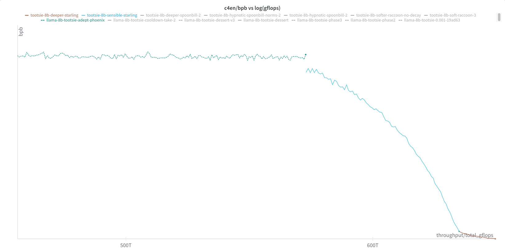

Interestingly, c4en perplexity decreased a lot during this cooldown, when in the previous cooldown it had increased.
Again, we attribute this to structural differences in the preprocessing of Dolmino's DCLM HQ and Nemotron CC.

#### WSD-S Hill / River decomposition

Separately, the slope of the loss flattened dramatically during the dessert phase.
This is consistent with the theory around [WSD-S](https://arxiv.org/abs/2410.05192), which decomposes the loss into a "river" and "hill" component, where the hill is the loss due to flucuations due to the learning rate (and stochasticity in SGD).

As the learning rate is decayed, the hill component diminishes. Once we stop decaying the learning rate, there is no further decrease in the hill component, so progress slows down.

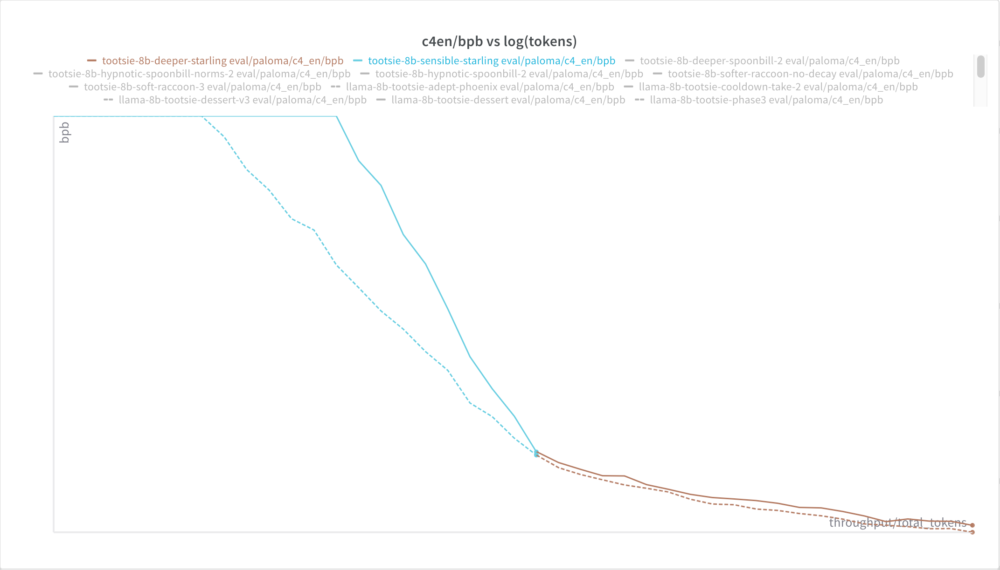

## Base Model Results

We ran a suite of standard benchmarks to compare our model with Llama 3.1 8B, Olmo 2, and a few other open source 7-8B models.
For all benchmarks, we used [LM Eval Harness](https://github.com/EleutherAI/lm-evaluation-harness) with the default setup for each task. These numbers differ from reported results in the literature due to differences in the setup. LM Eval Harness is usually considerably more strict than other harnesses.
For other evaluations, you can see [Olmo 2's technical report](https://allenai.org/blog/olmo2) which includes results using [OLMES](https://github.com/allenai/olmes).

|                                      | Average  | AGI Eval LSAT-AR | ARC Easy | ARC Challenge | BBH      | BoolQ    | CommonSense QA | COPA     | GPQA     | HellaSwag 0-shot | HellaSwag 10-shot | lambada_openai | MMLU 5-shot | MMLU 0-shot | MMLU Pro | OpenBookQA | PIQA     | WinoGrande | WSC      | GSM8K |
|--------------------------------------|----------|------------------|----------|---------------|----------|----------|----------------|----------|----------|------------------|-------------------|----------------|-------------|-------------|----------|------------|----------|------------|----------|-------|
| Marin 8B Base  (Deeper Starling) | **66.6** | 20.9             | **86.5** | **63.1**      | **50.6** | **85.9** | 79.1           | **92.0** | 30.3     | **82.3**         | **83.6**          | **74.7**       | **67.6**    | **65.9**    | **36.5** | 44.2       | **84.4** | **74.5**   | 82.1     | 61.3  |
| Llama 3.1 Base                       | 65.3     | 20.4             | 85.8     | 58.9          | 46.4     | 84.2     | 75.2           | **92.0** | **32.3** | 79.4             | 81.9              | **74.7**       | 66.4        | 65.5        | 33.3     | 45.8       | 82.9     | 74.4       | 83.5     | 56.8  |
| OLMo 2 Base                          | 64.9     | 17.4             | 85.0     | 60.7          | 44.4     | 85.5     | 75.4           | 89.0     | 26.8     | 80.5             | 81.7              | 73.1           | 63.9        | 61.9        | 30.6     | **46.2**   | 82.5     | 74.3       | **86.1** | 67.6  |
| MAP NEO 7B                           | 59.5     | **23.0**         | 81.1     | 52.0          | 42.4     | 84.7     | **81.7**       | 82.0     | 27.8     | 72.5             | 73.3              | 64.6           | 58.2        | 56.4        | 25.2     | 39.4       | 79.0     | 66.1       | 73.3     | 48.0  |
| Amber 7B                             | 48.1     | 19.1             | 74.7     | 41.6          | 41.6     | 68.8     | 20.6           | 87.0     | 26.3     | 72.4             | 73.9              | 66.8           | 26.6        | 26.7        | 11.6     | 39.2       | 79.8     | 65.3       | 76.9     | 4.4   |

Marin 8B Base (Deeper Starling) is the best performing 7-8B model on the majority of tasks. We can't claim any particular standout performance on any one task (though MMLU Pro is nice), just a general improvement.

However, all these results come with an asterisk. It is well known that many of these tasks are highly contaminated, with
questions found in the pretraining sets. They can be found in DCLM, Dolmino (created for and used by Olmo 2), Nemotron-CC,
and others. We are tracking this in [GH#1321](https://github.com/marin-community/marin/issues/1321) to get a full picture of the contamination.
Llama 3 is likewise contaminated. See Section 5.1.4 in the [Llama 3.1 paper](https://arxiv.org/pdf/2407.21783) for more details.

## Supervised Fine-Tuning

We're still improving our instruction tuning pipeline, but we are also releasing our current best checkpoint.

### SFT Data

- [TIGER-Lab/AceCode-89K](https://huggingface.co/datasets/TIGER-Lab/AceCode-89K)
- [bespokelabs/Bespoke-Stratos-17k](https://huggingface.co/datasets/bespokelabs/Bespoke-Stratos-17k)
- [cognitivecomputations/dolphin-r1](https://huggingface.co/datasets/cognitivecomputations/dolphin-r1) (includes both nonreasoning and reasoning subsets)
- [tuenguyen/dolphin_r1_reasoning](https://huggingface.co/datasets/tuenguyen/dolphin_r1_reasoning)
- [facebook/natural_reasoning](https://huggingface.co/datasets/facebook/natural_reasoning)
- [open-r1/OpenThoughts-114k-math](https://huggingface.co/datasets/open-r1/OpenThoughts-114k-math)
- [HuggingFaceTB/smoltalk](https://huggingface.co/datasets/HuggingFaceTB/smoltalk)
- [allenai/tulu-3-sft-mixture](https://huggingface.co/datasets/allenai/tulu-3-sft-mixture)
- [PrimeIntellect/verifiable-math-problems](https://huggingface.co/datasets/PrimeIntellect/verifiable-math-problems)

### SFT Details

We used a batch size of 512Ki tokens and a learning rate of 1.7e-4. We started from the final checkpoint of the Deeper Starling run.
We train for about 5Gi tokens, 10,227 steps.

### SFT Evals

In order to avoid bias in our benchmark selection, we follow established evaluation suites to ensure unbiased assessment of model capabilities.

Our benchmarks come primarily from the Open LLM Leaderboard's hard evaluation set, which includes [IFEval](https://huggingface.co/datasets/google/IFEval), [BigBenchHard (BBH)](https://arxiv.org/abs/2210.09261), [MATH](https://huggingface.co/datasets/hendrycks/math) (the Hard subset that LM Eval Harness uses), [GPQA](https://arxiv.org/abs/2311.12022), [MuSR](https://arxiv.org/abs/2310.16049), and [MMLU-Pro](https://huggingface.co/datasets/TIGER-Lab/MMLU-Pro) - tasks specifically designed to avoid data contamination while measuring reasoning and instruction.

We also incorporate key benchmarks from the OLMo 2 technical report for instruction tuned models, which includes [GSM8K-CoT](https://github.com/EleutherAI/lm-evaluation-harness/blob/main/lm_eval/tasks/gsm8k/gsm8k-cot.yaml), [MMLU](https://huggingface.co/datasets/cais/mmlu), and [AlpacaEval](https://github.com/tatsu-lab/alpaca_eval). We exclude [DROP](https://huggingface.co/datasets/ucinlp/drop) from our evaluations due to [recently identified issues in the benchmark by HuggingFace](https://huggingface.co/blog/open-llm-leaderboard-drop).

For code generation, we use [HumanEval](https://github.com/openai/human-eval) - which continues to be the standard benchmark for simpler non-agentic coding validation.

For all tasks aside from AlpacaEval, we utilize the [EleutherAI LM Evaluation Harness](https://github.com/EleutherAI/lm-evaluation-harness) with chat templates turned -- a standardized evaluation harness from an independent party from all models evaluated.
For AlpacaEval, we use the [AlpacaEval](https://github.com/tatsu-lab/alpaca_eval) harness.

As we noted earlier, LM Eval Harness can be quite strict, leading to extremely low performance due to systematic failures to follow the strict templates.
In this case, Olmo 2 SFT suffered on MATH, and Llama 3.1 Instruct suffered on HumanEval.
Therefore, we report both the average score and the average score excluding those two tasks.

| Model | Average | Average w/o   outliers | AlpacaEval | IFEval | Gsm8k_cot | BigBenchHard | MMLU | GPQA | MMLU-Pro | MuSR | MATH Hard | HumanEval |
|-------|---------|---------------------|------------|--------|------------|---------------|-------|------|-----------|------|-----------|-----------|
| OLMo 2 SFT | 37.7 | 41.4 | 10.2 | 63.6 | 69.4 | 42.0 | 59.6 | 25.8 | 22.7 | 37.7 | 7.2 | 38.4 |
| OLMo 2 Instruct | 38.7 | 44.6 | 29.1 | 69.5 | 79.0 | 42.6 | 59.7 | 24.2 | 17.6 | 34.7 | 14.0 | 17.1 |
| Llama 3.1 Instruct | 39.8 | 46.8 | 23.6 | 84.5 | 82.6 | 36.9 | **63.2** | 29.2 | 15.9 | 38.1 | 23.1 | 0.6 |
| Llama 3.1 Tulu | **50.0** | **51.9** | **34.9** | **87.5** | **88.1** | 43.9 | 60.7 | 28.7 | 29.4 | **42.2** | **24.7** | **60.4** |
| Marin 8B SFT | 43.8 | 46.2 | 18.3 | 78.3 | 68.9 | **46.0** | 61.6 | **29.5** | **31.2** | 35.9 | 21.2 | 47.0 |

We see an unfortunate degradation in "base model" tasks like MMLU, not dissimilar to [what Olmo 2 reported in their own results](https://arxiv.org/abs/2501.00656).
We are working to mitigate this (e.g. by mixing in pretraining data and FLAN into SFT). Please see [this detailed report](https://github.com/marin-community/marin/issues/702)
on how mixing in pretraining data into later stages is important for retaining performance.

If we look at ranks:

| Model              | Average Rank | Average Rank w/o outliers |
|--------------------|--------------|-------------------------------|
| OLMo 2 SFT         | 4.1          | 4.125                         |
| OLMo 2 Instruct    | 3.8          | 3.75                          |
| Llama 3.1 Instruct | 2.9          | 2.75                          |
| Llama 3.1 Tulu     | 1.6          | 1.75                          |
| Marin 8B SFT       | 2.6          | 2.625                         |

So we still haven't surpassed Llama 3.1 Tulu, but performance is not bad.
We will continue to improve our SFT pipeline and will release a new checkpoint when we have one.

# Conclusion

## Main Takeaways

- **Tootsie means never having to say you're sorry.** We made several dramatic changes to the data mix, optimizer, and other hyperparameters during the run. We cooled down, rewarmed up, changed the mixture, etc. without any major issues. Highly recommend.
- **Z-loss isn't just for avoiding explosions.** While we didn't need z-loss to stabilize the training, we found it actually pretty necessary during very deep cooldowns.
- **So-called "high quality" data doesn't have everything.** High quality data seems to often lack data that leads to good few-shot performance. Mixing in FLAN or other datasets seems to help.
- **Format diversity is useful.**  While not necessarily showing up in non-loss evals, the high sensitivity of c4en perplexity (and that of other datasets) to the data mix suggests that formatting diversity is useful. We will pursue this further in future runs.
- **Exponential moving averages are nice, but maybe not all that useful with WSD.** The stability of the EMA gap suggests that there isn't that much information in monitoring EMA model evals: we know from WSD that there is some easy performance to be had whenever we want it (by cooling down and removing the hill component). That said, even at very low LR there is still *some* gap, so that's a tiny bit of free performance. The harm is also small, since the EMA can be held in CPU memory rather than HBM.
- **Tootsie means having to say you're sorry kind of a lot.** We made many, many mistakes during the run. Some of the changes were actually unintentional, or were fixes to initial mistakes (e.g. the rotary embedding hyperparameters). Nevertheless, the end result was a model that performed well on a wide variety of tasks.

## Future Work

Future work will focus on:

- **Bigger models.** We have a [32B model](https://wandb.ai/marin-community/marin/runs/llama-32b-tootsie-2/workspace?nw=nwuserdlwh) that is performing quite well at 1.3T tokens.
- **SFT/RL.** We're still improving our Instruct model. In addition to making the model generally better, we would like to reduce degradation on tasks like MMLU.
- **Format diversity.** We will continue to pursue formatting diversity as a way to improve performance on tasks like MMLU.
- **Improved filtering and synthetic data.** Marin Datashop was our project that aimed to find and create high-quality datasets for LLMs.

## Glossary

- **WSD**: Warmup-Stable-Decay, a learning rate schedule that warms up, remains stable, and then decays at the end (typically ~10-20% of the total training budget).
- **WSD-S**: A learning rate schedule that includes cyclic long flat phases and short cooldowns to probe model performance. Read more in [our paper](https://arxiv.org/abs/2410.05192).
- **Cooldown**: A phase in training where the learning rate is gradually decreased, often accompanied by a shift to higher-quality or more structured data.
- **FLAN**: A [large instruction-tuned dataset from Google](https://arxiv.org/abs/2109.01652) designed to improve few-shot and instruction-following abilities.
- **EMA (Exponential Moving Average)**: A moving average over model weights used to evaluate model performance without being affected by short-term parameter fluctuations.
- **Z-loss**: A regularization term that penalizes the logit norm, helping to stabilize the `lm_head` by keeping its output distribution from getting too large.
- **PT Mix**: Pretraining mixture — the standard data blend used during the initial training phases.
- **Mi tokens**: Mebibyte-equivalent tokens, where 1 Mi = 1024², as opposed to a million (10⁶).
- **Microannealing**: A mid-training experiment that mixes in new data to test effects on loss and task performance, typically in a short cooldown-like window.
- **SFT-ability**: A model's amenability to supervised fine-tuning. Poor SFT-ability may manifest as unstable loss or poor generalization after SFT.
- **Dessert Run**: A short continuation of training, typically at low learning rates, aimed at patching specific weaknesses (e.g., math, instruction following).
