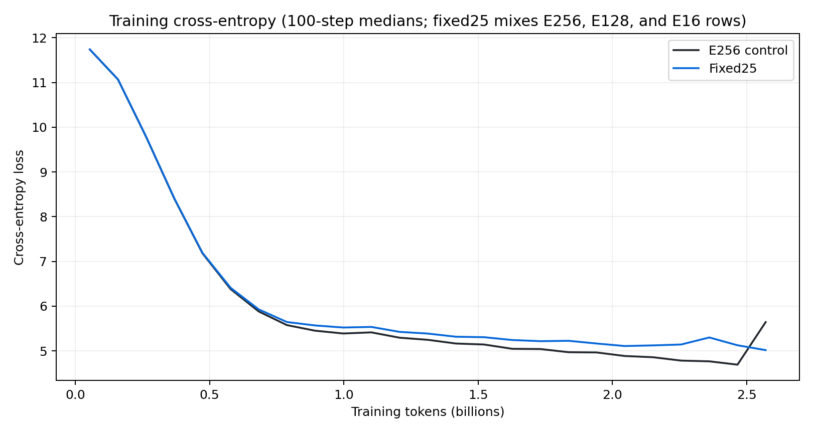
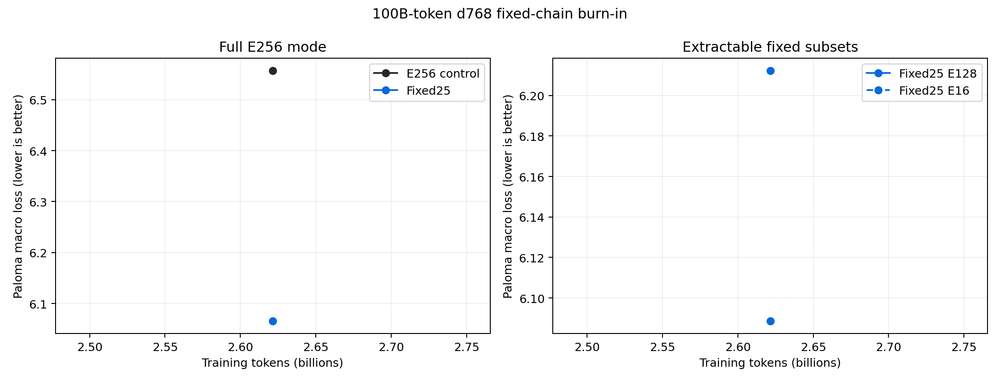
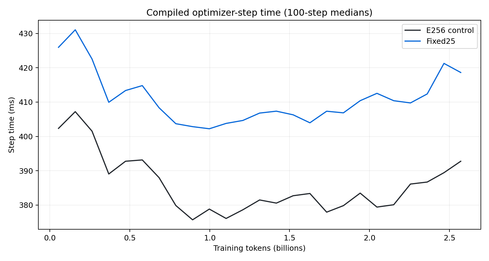

# Nested MoE 100B-token burn-in: first gate

## TL;DR

The fixed25 nested-expert treatment adds `7.10%` to compiled optimizer-step
time in the 64-GB200, batch-128 cell. The first full-mode Paloma evaluation is
`0.49173` nats better than the E256 control, but fixed25 becomes non-finite
three updates later. That isolated quality point does not support promotion.

A replacement fixed25 run keeps the model, optimizer, seed, data order, batch,
and 100B-token horizon fixed while deferring the first full/E128/E16
evaluation from update 2,500 to update 10,000. It passed update 2,503 with
finite loss and zero overflow. The original failure therefore depends on the
multi-mode evaluation boundary, restored state, or their interaction rather
than the uninterrupted nested training trajectory.

## Setup

| Setting | Value |
|---|---:|
| Transformer | d768, 8 layers, 6 query heads, 1 KV head |
| MoE | 256 experts, top-4 routing, capacity factor 1.25 |
| Sequence length | 8,192 |
| Global batch | 128 sequences / 1,048,576 tokens |
| Training horizon | 95,367 updates / 99.9995B tokens |
| Hardware per arm | 64 GB200s |
| Mesh | replica 4, data 16, expert 1 |
| Optimizer | MuonH/AdamH `0.00488646`, Adam `0.00112764` |
| Momentum | beta1 `0.9062`, beta2 `0.992028` |
| Schedule | 1% warmup, linear decay, min LR ratio 0.05 |
| Gradient clipping | none |
| Data | canonical Datakit mixture from CoreWeave S3 |
| Attention | reference |

The E256 control routes every sequence over all 256 experts. fixed25 uses full
E256 routing for 75% of each batch; 12.5% routes within experts 0--127 and
12.5% routes within experts 0--15. Every update therefore trains the full
model and both extractable expert prefixes.

Both arms start from the same seed and data order. The treatment changes only
expert eligibility. W&B configuration comparison confirms identical
architecture, data, optimizer, precision, and trainer settings outside the
three nested-routing fields.

## First matched gate

| Metric at update 2,500 | E256 | fixed25 | Delta |
|---|---:|---:|---:|
| Full-mode Paloma macro loss | 6.557286 | 6.065558 | -0.491728 |
| Full-mode Paloma micro loss | 6.252114 | 5.739881 | -0.512233 |
| E128 Paloma macro loss | — | 6.088614 | +0.023056 vs fixed25 full |
| E16 Paloma macro loss | — | 6.212317 | +0.146758 vs fixed25 full |
| Median compiled step | 381.952 ms | 409.075 ms | +7.10% |
| Evaluation hook | 26.14 s | 77.42 s | +51.28 s |
| Routing overflow | 0% | 0% | 0 pp |

fixed25 is better on 15 of 16 Paloma domains at this gate. The median domain
delta is `-0.54083` nats. PTB is the only regression at `+0.07650`.

The quality result is exploratory. Control training loss rises sharply between
updates 2,460 and 2,500 before recovering; fixed25 avoids that excursion and
then produces a non-finite loss at state step 2,503. The optimizer is near an
unstable boundary, so one evaluation cannot distinguish durable
regularization from a transient oscillation.

## Runtime model

The timing estimate uses 1,478 matched compiled updates and excludes
evaluation callbacks, loading stalls, checkpoint pauses, compilation, and
failed-attempt replay.

| 100B-token projection | E256 | fixed25 | Increment |
|---|---:|---:|---:|
| Optimizer time | 10.118 h | 10.837 h | 0.719 h |
| GB200-hours | 647.57 | 693.55 | 45.98 |
| GB200-hours / 1B tokens | 6.476 | 6.936 | 0.460 |

The fixed25 surcharge is below the preregistered 10% promotion threshold and
well below the 50% cost of approaching a second training run. The estimate is
conditional on numerical stability.

The expert matmuls do not explain the surcharge. Both arms activate four
experts of the same width for every token. fixed25 additionally constructs a
per-sequence eligibility mask and computes QB routing thresholds for three
eligibility groups (E256, E128, and E16) in every MoE layer; the control
computes one E256 group. Each group includes a top-k threshold calculation and
a reduction over the batch mesh. The two extra group reductions per layer are
the leading candidate for the 27.1 ms absolute gap on 64 devices; this run was
not kernel-profiled. A larger model may amortize that fixed router cost against
larger expert matmuls, but a larger data-parallel mesh can make the reductions
more expensive. The current measurement does not resolve that scaling
balance.

The preceding 16-device, batch-32 burn-in measured a `0.75%` fixed25
surcharge, compared with `7.10%` here. Its absolute gap was 2.76 ms per update;
the current gap is 27.12 ms. Model shape, sequence length, and active experts
are unchanged. The device count, batch, replica axis, and optimizer horizon
changed together, so this comparison identifies a topology sensitivity
without assigning it to one variable. A 300B--700B cost forecast needs at
least one production-like expert/data-parallel topology gate.

The evaluation hook measures three modes for fixed25 and one for E256. At the
original 2,500-update cadence, 38 gates project to 0.276 hours of control
evaluation and 0.817 hours of treatment evaluation. This adds 0.541 wall
hours, or 34.6 GB200-hours, to the treatment. Evaluating all nested modes every
10,000 updates reduces this research-only cost without changing co-training.

## Failure and recovery

The original fixed25 gang restored twice after XLA coordination-service
connection failures. Its third attempt reached the post-evaluation training
boundary and reported a non-finite loss at state step 2,503. The E256 control
remained finite past update 3,300.

The failed fixed25 retry loop was stopped. The replacement uses a fresh run
identity and moves the first nested evaluation to update 10,000. It preserves
the original optimizer and 100B-token schedule. Its first 290 losses reproduce
the failed arm with a maximum absolute difference of `0.00076` nats, and it is
finite at update 2,537. This rules out the uninterrupted trajectory as the
cause of the step-2,503 failure.

The next diagnostic boundary is the replacement's update-10,000 full/E128/E16
evaluation. Failure immediately afterward implicates the multi-mode callback.
Survival implicates checkpoint recovery or prior gang state. The replacement
continues toward the 100B-token endpoint in either case unless it becomes
non-finite.

## Runs

- [E256 control](https://wandb.ai/marin-community/marin/runs/nest-burn-002-e256-d768-s8192-e256-c4p14e18-100b-b128-r5)
- [fixed25 failed arm](https://wandb.ai/marin-community/marin/runs/nest-burn-002-fixed25-d768-s8192-e256-c4p14e18-100b-b128-r4)
- [fixed25 deferred-evaluation diagnostic](https://wandb.ai/marin-community/marin/runs/nest-burn-002-fixed25-d768-s8192-e256-c4p14e18-100b-b128-r6-noeval2500)
