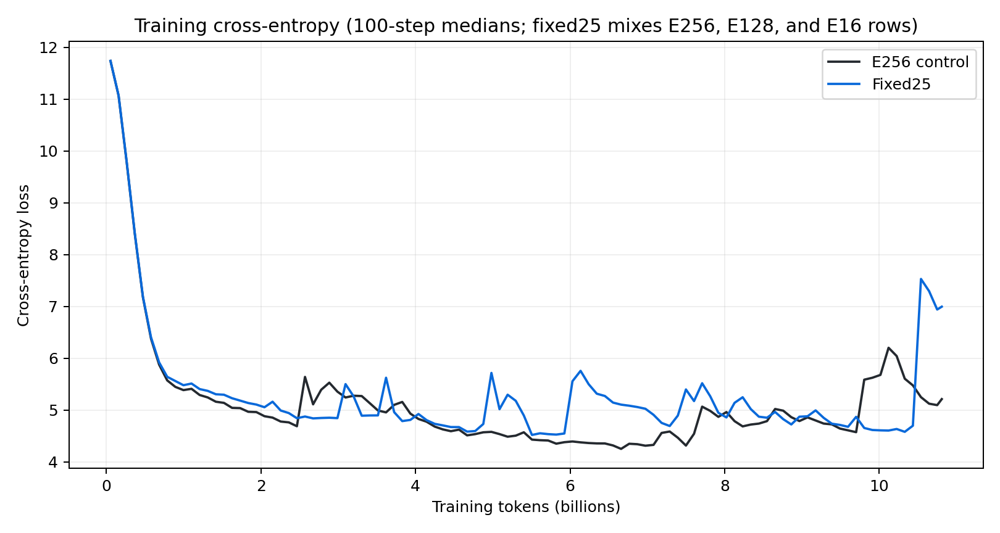
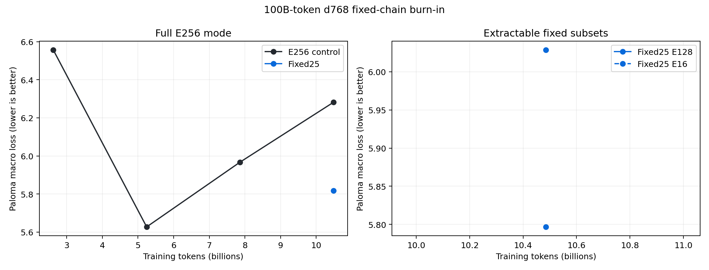
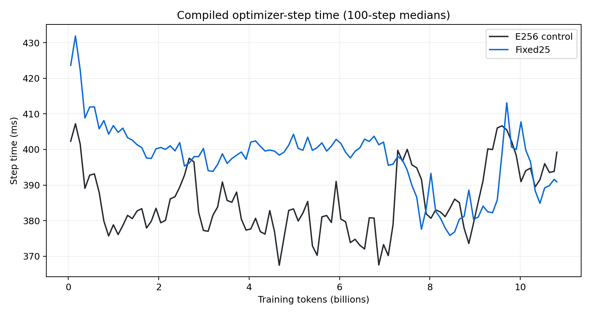

# Nested MoE 100B-token burn-in: interim gates

## TL;DR

The clean fixed25 replacement adds `3.45%` to compiled optimizer-step time
through 10.8B tokens in the 64-GB200, batch-128 cell. At the first clean
matched gate, 10.49B tokens, its full-mode Paloma loss is `0.46390` nats
better than E256. E128 is `0.02128` nats better than fixed25 full mode and E16
is `0.21075` worse.

The replacement passed the original update-2,503 failure point and completed
full/E128/E16 evaluation at update 10,000 without a NaN. Its median training
loss then jumped from `4.69` over updates 9,900--9,999 to `7.53` over
10,001--10,100. The nested callback is therefore implicated even though the
clean gang did not fail outright. Training was stopped before its clean
update-9,936 temporary checkpoint could be overwritten, then resumed from
that checkpoint with periodic evaluation disabled. An 8-GPU capacity fallback
crossed update 10,000 at losses near `4.9` rather than `7.5`, isolating the
callback as the cause. It saved a clean update-10,114 checkpoint. Two
same-checkpoint, same-8-GPU continuations then supplied the exact
counterfactual: the arm that evaluated full/E128/E16 became non-finite at
state step 10,123, while the arm without evaluation remained finite through
global step 10,137. The 64-GPU continuation is queued from the clean
checkpoint with periodic evaluation disabled.

This is still an interim result. Control Paloma and training loss oscillate
over multi-billion-token intervals, and fixed25 has only one clean matched
Paloma gate. Both arms continue toward 100B tokens.

## Setup

| Setting | Value |
|---|---:|
| Transformer | d768, 8 layers, 6 query heads, 1 KV head |
| MoE | 256 experts, top-4 routing, capacity factor 1.25 |
| Sequence length | 8,192 |
| Global batch | 128 sequences / 1,048,576 tokens |
| Training horizon | 95,367 updates / 99.9995B tokens |
| Hardware per arm | 64 GB200s |
| Mesh | replica 4, data 16, expert 1 |
| Optimizer | MuonH/AdamH `0.00488646`, Adam `0.00112764` |
| Momentum | beta1 `0.9062`, beta2 `0.992028` |
| Schedule | 1% warmup, linear decay, min LR ratio 0.05 |
| Gradient clipping | none |
| Data | canonical Datakit mixture from CoreWeave S3 |
| Attention | reference |

The E256 control routes every sequence over all 256 experts. fixed25 uses full
E256 routing for 75% of each batch; 12.5% routes within experts 0--127 and
12.5% routes within experts 0--15. Every update therefore trains the full
model and both extractable expert prefixes.

Both arms start from the same seed and data order. The treatment changes only
expert eligibility. W&B configuration comparison confirms identical
architecture, data, optimizer, precision, and trainer settings outside the
three nested-routing fields.

## First matched gate

| Metric at update 2,500 | E256 | fixed25 | Delta |
|---|---:|---:|---:|
| Full-mode Paloma macro loss | 6.557286 | 6.065558 | -0.491728 |
| Full-mode Paloma micro loss | 6.252114 | 5.739881 | -0.512233 |
| E128 Paloma macro loss | — | 6.088614 | +0.023056 vs fixed25 full |
| E16 Paloma macro loss | — | 6.212317 | +0.146758 vs fixed25 full |
| Median compiled step | 381.952 ms | 409.075 ms | +7.10% |
| Evaluation hook | 26.14 s | 77.42 s | +51.28 s |
| Routing overflow | 0% | 0% | 0 pp |

fixed25 is better on 15 of 16 Paloma domains at this gate. The median domain
delta is `-0.54083` nats. PTB is the only regression at `+0.07650`.

The quality result is exploratory. Control training loss rises sharply between
updates 2,460 and 2,500 before recovering; fixed25 avoids that excursion and
then produces a non-finite loss at state step 2,503. The optimizer is near an
unstable boundary, so one evaluation cannot distinguish durable
regularization from a transient oscillation.

## Clean 10.49B-token gate

| Metric at update 10,000 | E256 | fixed25 | Delta |
|---|---:|---:|---:|
| Full-mode Paloma macro loss | 6.281861 | 5.817962 | -0.463899 |
| Full-mode Paloma micro loss | 5.994786 | 5.459576 | -0.535210 |
| E128 Paloma macro loss | — | 5.796685 | -0.021277 vs fixed25 full |
| E16 Paloma macro loss | — | 6.028710 | +0.210749 vs fixed25 full |
| Median compiled step | 384.600 ms | 397.876 ms | +3.45% |
| Evaluation hook | 15.54 s | 62.87 s | +47.34 s |
| Routing overflow | 0% | 0% | 0 pp |

fixed25 is better on all 16 Paloma domains. The mean domain delta is
`-0.46390` nats and the median is `-0.46068`. This is a clean, preregistered
comparison, but it is only one paired gate. The control's 10,000-update value
is also near a local loss maximum. The evaluation itself occurs after these
metrics are computed, so the gate remains a valid pre-perturbation comparison.

## Runtime model

The current timing estimate uses 9,291 matched post-warmup updates and excludes
evaluation callbacks, loading stalls, checkpoint pauses, compilation, and
failed-attempt replay.

| 100B-token projection | E256 | fixed25 | Increment |
|---|---:|---:|---:|
| Optimizer time | 10.188 h | 10.540 h | 0.352 h |
| GB200-hours | 652.06 | 674.56 | 22.51 |
| GB200-hours / 1B tokens | 6.521 | 6.746 | 0.225 |

The fixed25 surcharge is below the preregistered 10% promotion threshold and
well below the 50% cost of approaching a second training run. The estimate
will be recomputed at the 100B endpoint.

The expert matmuls do not explain the surcharge. Both arms activate four
experts of the same width for every token. fixed25 additionally constructs a
per-sequence eligibility mask and computes QB routing thresholds for three
eligibility groups (E256, E128, and E16) in every MoE layer; the control
computes one E256 group. Each group includes a top-k threshold calculation and
a reduction over the batch mesh. The two extra group reductions per layer are
a candidate for the gap on 64 devices. A matched ten-update XPlane capture
could not test that mechanism: the two profiling gangs landed on different
leafgroups and control all-gather time was about eight times treatment
all-gather time. That placement variance overwhelmed the architecture signal,
so the profiles are retained for debugging and excluded from cost
attribution. A larger model may amortize fixed router work against larger
expert matmuls, but a larger data-parallel mesh can also make reductions more
expensive. The current measurement does not resolve that scaling balance.

The preceding 16-device, batch-32 burn-in measured a `0.75%` fixed25
surcharge. The clean 64-device estimate is currently `3.45%`: an absolute gap
of 13.28 ms per update, compared with 2.76 ms on 16 devices. Model shape,
sequence length, and active experts are unchanged. The device count, batch,
replica axis, and optimizer horizon changed together, so this comparison
identifies topology sensitivity without assigning it to one variable. A
300B--700B cost forecast needs at least one production-like
expert/data-parallel topology gate.

The evaluation hook measures three modes for fixed25 and one for E256. The
current median costs are 62.87 seconds and 15.54 seconds. At their respective
10,000- and 2,500-update cadences, the 100B run projects to about 0.157 and
0.164 hours of evaluation. This research-only instrumentation is excluded from
compiled-step cost.

## Baseline loss behavior

The E256 Paloma curve is not monotonic:

| Update | Tokens | Paloma macro | Median training loss over prior 200 updates |
|---:|---:|---:|---:|
| 2,500 | 2.62B | 6.557286 | 4.811574 |
| 5,000 | 5.24B | 5.627037 | 4.518203 |
| 7,500 | 7.86B | 5.967525 | 5.013913 |
| 10,000 | 10.49B | 6.281861 | 5.542285 |
| 12,500 | 13.11B | 5.978082 | 4.929281 |

Paloma rises and falls with the surrounding training loss, so this is not
just a stale or inverted evaluator series. The 100B-derived MuonH and AdamH
learning rates, beta values, warmup, and linear schedule match the configured
heuristic. This schedule is nevertheless a long overtraining experiment, not
the original 4.42B-token compute-optimal cooldown: at update 10,000 its MuonH
rate is still about `0.0044`.

Routing is concentrated and router z-loss is large, but the router metrics do
not track the Paloma regression monotonically. Mean routing entropy is `2.51`
at update 5,000, `2.50` at 7,500, `3.30` at 10,000, and `3.32` at 12,500.
The corresponding maximum for 256 experts is about `5.55`. Router auxiliary
losses are diagnostic-only in this configuration because dynamic router bias
handles load balancing. These observations make optimizer/data-order
nonstationarity and routing health both useful follow-ups, but they do not
identify one as the cause. Architecture conclusions remain paired against the
live E256 control rather than against an expected absolute Paloma target.

## Failure and recovery

The original fixed25 gang restored twice after XLA coordination-service
connection failures. Its third attempt reached the post-evaluation training
boundary and reported a non-finite loss at state step 2,503. The E256 control
remained finite past update 3,300.

The failed fixed25 retry loop was stopped. The replacement uses a fresh run
identity and moves the first nested evaluation to update 10,000. It preserves
the original optimizer and 100B-token schedule. Its first 290 losses reproduce
the failed arm with a maximum absolute difference of `0.00076` nats, and it is
finite at update 2,537. This rules out the uninterrupted trajectory as the
cause of the step-2,503 failure.

The replacement completed its update-10,000 full/E128/E16 evaluation without
an immediate NaN, but the following 100-update median loss rose from `4.69` to
`7.53`; the next two medians were `7.31` and `6.95`. Control loss declined
across its own one-mode evaluation. Together with r4's step-2,503 NaN, this
implicates the treatment's nested evaluation path even though the exact
failure severity depends on prior gang or optimizer state.

The last temporary checkpoint before evaluation was update 9,936. The
treatment was stopped before the next checkpoint and resubmitted under the
same run identity and artifact version with the evaluation interval beyond
the training horizon. Cluster fragmentation left only two GB200 nodes free,
so a bounded 8-GPU diagnostic restored update 9,936 and crossed the suspect
boundary. Loss stayed between about `4.86` and `5.08` through update 10,100;
the contaminated run was between `6.95` and `7.53`. This counterfactual
isolates nested evaluation as the perturbation.

The diagnostic saved a clean update-10,114 checkpoint and was stopped. A
64-GPU continuation is queued from that checkpoint. Its 178 updates on a
different reduction topology will be excluded from cost measurement and
reported as a quality caveat. A forced terminal evaluation still runs after
the final optimizer update, when it can no longer affect training.

To remove the remaining topology confound, the clean state-step-10,114
checkpoint was copied into two new run identities on identical two-node,
8-GB200 meshes. The arms used the same global batch, optimizer state, data
offset, model, and CUDA/JAX stack. Their losses through global steps
10,114--10,119 matched within `0.00866` nats maximum absolute error.

| Global step | With nested evaluation | Without evaluation |
|---:|---:|---:|
| 10,119 | 5.051605 | 5.042948 |
| 10,120 | 5.121791 | 5.107379 |
| 10,121 | 5.530506 | 5.522368 |
| 10,122 | non-finite before logging | 5.054758 |
| 10,123 | — | 4.832399 |
| 10,137 | — | 5.135144 |

The evaluation arm ran full/E128/E16 evaluation after global step 10,119 and
raised `FloatingPointError: Non-finite loss at step 10123` on the third
subsequent optimizer update. The no-evaluation arm crossed the same data and
optimizer steps without a loss excursion. This establishes the callback, or
state left by the callback, as the cause rather than the nested-training
trajectory or reduction topology. Router z-loss reached `10,668.9` on the
first post-callback row versus `3,595.1` without evaluation, but the
no-evaluation arm later reached `10,937.4` and remained finite. That scalar is
therefore not a sufficient mechanism.

## Runs

- [E256 control](https://wandb.ai/marin-community/marin/runs/nest-burn-002-e256-d768-s8192-e256-c4p14e18-100b-b128-r5)
- [fixed25 failed arm](https://wandb.ai/marin-community/marin/runs/nest-burn-002-fixed25-d768-s8192-e256-c4p14e18-100b-b128-r4)
- [fixed25 deferred-evaluation diagnostic](https://wandb.ai/marin-community/marin/runs/nest-burn-002-fixed25-d768-s8192-e256-c4p14e18-100b-b128-r6-noeval2500)
- [same-topology evaluation arm](https://wandb.ai/marin-community/marin/runs/nest-burn-002-fixed25-d768-s8192-e256-c4p14e18-100b-b128-r7-evaldiag8g)
- [same-topology no-evaluation arm](https://wandb.ai/marin-community/marin/runs/nest-burn-002-fixed25-d768-s8192-e256-c4p14e18-100b-b128-r8-noevaldiag8g)
- [nested-evaluation bug](https://github.com/marin-community/marin/issues/7712)
