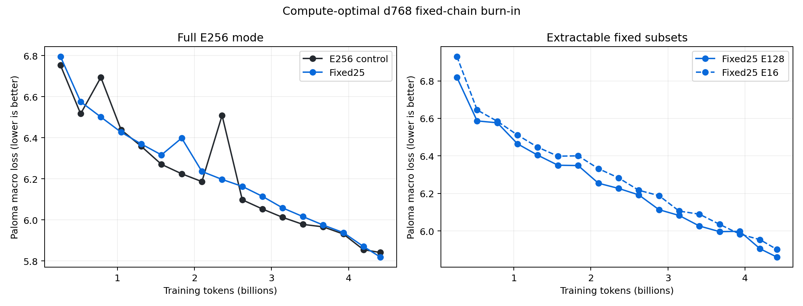
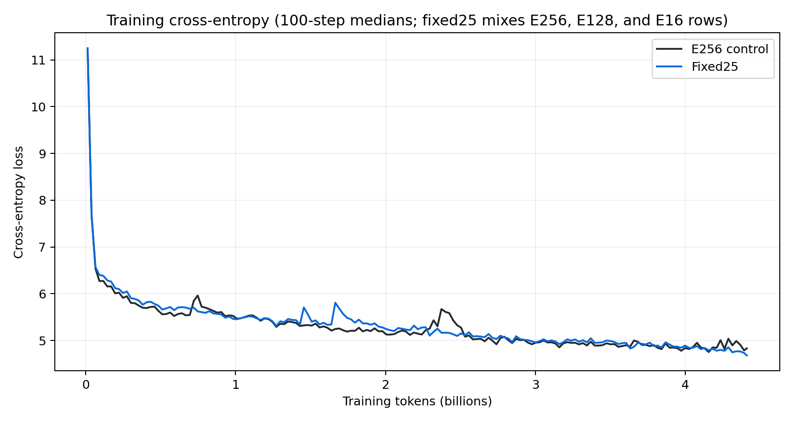
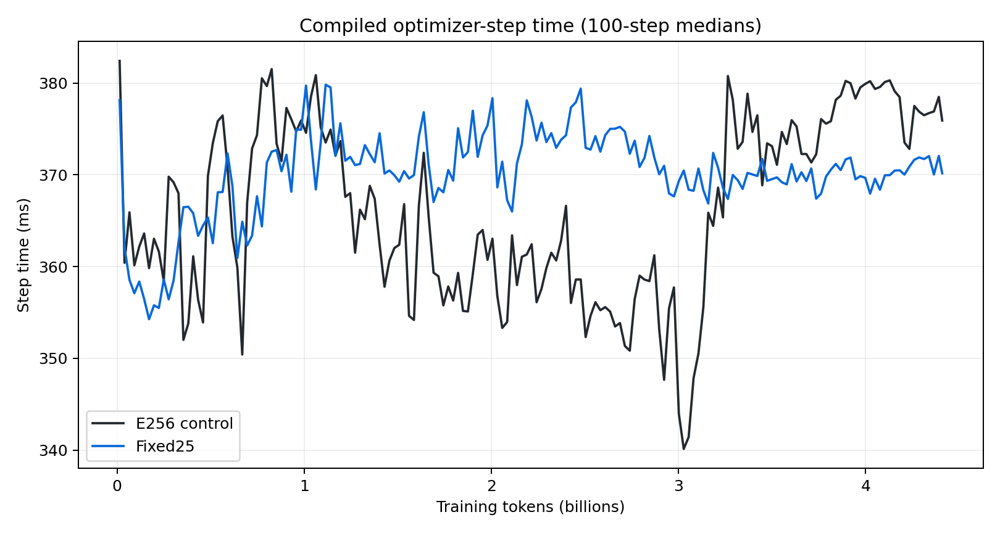
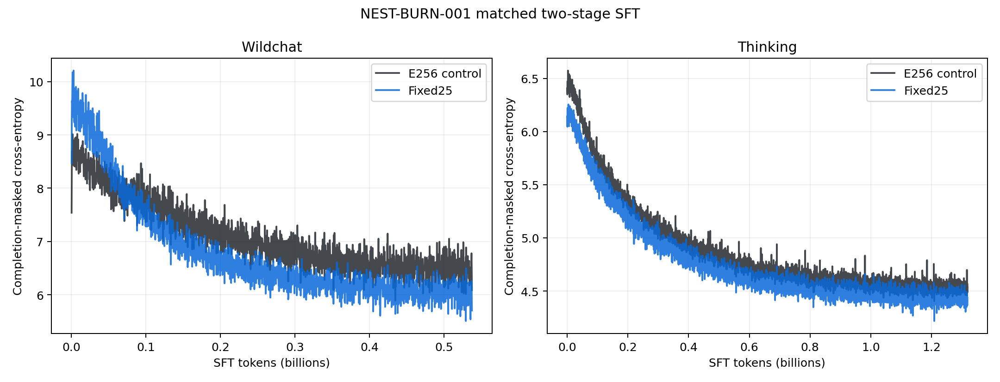

# Fixed nested experts at the d768 compute-optimal point

Date: 2026-07-28

Status: complete.

## Decision

This matched burn tests whether one E256 pretraining run can continuously train
useful fixed E128 and E16 submodels. The fixed25 treatment restricts 25% of
training rows to one literal hierarchy, E16 experts 0--15 inside E128 experts
0--127 inside all 256 experts. The remaining 75% of rows train the full model.

At the 4.414B-token endpoint, fixed25 full-mode Paloma loss is `0.02252` nats
better than the E256 control. E128 and E16 are only `0.01906` and `0.06005`
behind the control. Uncheatable macro loss shows the same ordering: `5.329`
for control, `5.307` for fixed25 full, `5.357` for E128, and `5.381` for E16.
The treatment is therefore non-inferior at this scale and emits two usable
smaller checkpoints. It is not evidence for a regularization gain: this is one
seed, fixed evaluation slices, and an oscillatory curve.

Across the full common post-warmup horizon, fixed restriction adds a 0.75%
median optimizer-step surcharge. Production-style optimizer cost projects to
`62.44` versus `62.91` GPU-hours per 10B tokens. The charged research run was
23.4% longer because fixed25 evaluated three modes at every gate; that is
instrumentation cost, not co-training cost. The supported pretraining result
is that fixed expert nesting is technically and economically viable enough for
a larger replicated gate.

The advantage survives matched two-stage SFT when both checkpoints return to
ordinary full-E256 routing. fixed25 lowers completion-masked training
cross-entropy by `0.36009` nats on WildChat and `0.11944` nats on the thinking
stage, averaged over the post-warmup horizon. It wins 90.1% and 99.98% of
paired batches, respectively, with no optimizer-step surcharge or routing
overflow. This is evidence that nested pretraining does not damage full-model
post-training trainability. It is not an agentic-quality result: no held-out
behavioral benchmark or inference export was completed.

## Question and prior variants

The broader study asks whether a 300B--700B MoE training process can emit
smaller checkpoints without paying for a separate pretraining run. The earlier
[nested MoE power-ladder report](nested-model-training-final.md) tested:

- a fixed E128 subset;
- rotating E128, E32, E8, and E1 subsets on 25% and 50% of rows;
- fixed E16 inside E128 inside E256 on 25% and 50% of rows.

Rotating subsets regularized the full bank but undertrained every exact
extractable submodel. Fixed50 caused either concentrated routing overflow or
quality loss depending on the controller. Fixed25 with
eligibility-conditioned routing was the only architecture promoted to this
compute-optimal burn.

## Architecture

The control and treatment share the same E256 top-4 model. For every treatment
row, the router receives one of three eligibility masks:

| Mode | Eligible experts | Fraction of treatment rows |
|---|---:|---:|
| Full | 0--255 | 75% |
| E128 | 0--127 | 12.5% |
| E16 | 0--15 | 12.5% |

Restricted rows alternate between E128 and E16. The selection is fixed across
updates and layers, so E16 is a true submodel of E128 and E128 is a true
submodel of E256. Eligibility-QB keeps routing balance state for each mode.
Extraction copies the selected experts and their corresponding router state
into ordinary compact checkpoints. The extracted checkpoints contain
approximately 1.13B parameters for E128 and 0.34B for E16, versus 2.039B for
E256.

Under ideal balanced routing, the schedule changes routed-update density in a
simple way:

| Expert IDs | Relative updates per expert | Source |
|---|---:|---|
| 0--15 | 3.00x | full, E128, and E16 rows |
| 16--127 | 1.00x | full and E128 rows |
| 128--255 | 0.75x | full rows only |

Shared attention, embeddings, norms, and the shared MLP still train on every
row. The scheme therefore overtrains the E16 core, leaves the rest of E128 at
control update density, and charges the full model through a 25% update deficit
on the tail experts. It permits the tail to specialize around concepts the
core does not cover, but it does not explicitly enforce conceptual
orthogonality.

The restriction is applied inside the normal forward pass. It does not add a
second loss, backward pass, or optimizer update. This is why the architecture
can be free in optimizer-step time even though the research run pays extra to
evaluate all three modes.

## Experimental setup

| Property | Value |
|---|---:|
| Hidden dimension | 768 |
| Layers | 8 |
| Query / KV heads | 6 / 1 |
| Total / active experts | 256 / 4 |
| Expert / shared width | 384 / 768 |
| Total parameters | 2.039B |
| Analytic FLOPs per token | 509.61M |
| Sequence length | 8,192 |
| Global batch | 32 |
| Tokens per update | 262,144 |
| Updates | 16,840 |
| Training tokens | 4.41449B |
| Compute budget | 4.14e18 model FLOPs |
| Devices per arm | 16 GB200 |
| Parallelism | full FSDP; expert axis 1 |
| Capacity factor | 1.25 |
| Parameters / compute | fp32 / bf16 |
| Data | canonical datakit cache `8ac06c74` on CoreWeave S3 |
| Seed | 0, with matched sampled sequences |

The optimizer is the d768 MoeHeuristic cell: MuonH and AdamH learning rate
`0.00837984`, plain-Adam learning rate `0.00193381`, beta1 `0.9062`, beta2
`0.998001`, epsilon `1.25564e-15`, 1% warmup, and linear decay to a 0.05
minimum ratio. Gradient clipping is disabled. The first 80% of tokens uses the
datakit phase-0 mixture and the final 20% uses phase 1.

Both promoted arms use reference attention. FA4 THD compiled but repeatedly
froze on the first distributed dispatch; CuTe produced non-finite backward
gradients; cuDNN found no valid execution plan at sequence length 8,192. The
reference fallback passed a matched two-update numerical smoke. It preserves
the quality comparison and co-training overhead estimate, but its absolute
throughput is not a production-kernel forecast.

Runs:

- [E256 control](https://wandb.ai/marin-community/marin/runs/nest-burn-001-e256-d768-s8192-e256-c4p14e18-reference-r26)
- [fixed25 treatment](https://wandb.ai/marin-community/marin/runs/nest-burn-001-fixed25-d768-s8192-e256-c4p14e18-reference-r26)

## Evaluation procedure

Every 1,000 updates, both arms evaluate full-mode Paloma and the uncheatable
validation suite. Fixed25 also evaluates its exact E128 and E16 subsets.
Evaluation uses four batches of 256 sequences per dataset and reuses the same
deterministic slices at every checkpoint. This small fixed sample is suitable
for paired gates and curves, not a frontier-quality benchmark.

The preregistered main-phase stop conditions are:

- fixed25 full-mode loss more than 0.10 nats behind control at two consecutive
  aligned evaluations;
- sustained routing overflow above 5%;
- optimizer-step overhead above 25%;
- non-finite loss or gradients.

Timing excludes compilation, checkpointing, data loading, and evaluation
hooks. It reports compiled optimizer-step duration after warmup, with a
contiguous-block bootstrap interval. The study has one seed per arm; steps and
tokens are not treated as independent model replicates.

## Pretraining results

### Held-out loss

| Update | Tokens | E256 full | fixed25 full | Delta | fixed25 E128 | fixed25 E16 |
|---:|---:|---:|---:|---:|---:|---:|
| 1,000 | 0.262B | 6.75297 | 6.79520 | +0.04223 | 6.81861 | 6.92992 |
| 2,000 | 0.524B | 6.51654 | 6.57503 | +0.05849 | 6.58653 | 6.64494 |
| 3,000 | 0.786B | 6.69368 | 6.50075 | -0.19293 | 6.57656 | 6.58443 |
| 4,000 | 1.049B | 6.43895 | 6.42697 | -0.01198 | 6.46428 | 6.51132 |
| 5,000 | 1.311B | 6.35802 | 6.36944 | +0.01142 | 6.40366 | 6.44631 |
| 6,000 | 1.573B | 6.27025 | 6.31632 | +0.04607 | 6.35032 | 6.39850 |
| 7,000 | 1.835B | 6.22438 | 6.39813 | +0.17376 | 6.34849 | 6.40042 |
| 8,000 | 2.097B | 6.18636 | 6.23577 | +0.04940 | 6.25447 | 6.33219 |
| 9,000 | 2.359B | 6.50845 | 6.19699 | -0.31146 | 6.22660 | 6.28275 |
| 10,000 | 2.621B | 6.09773 | 6.16299 | +0.06525 | 6.19220 | 6.21675 |
| 11,000 | 2.884B | 6.05287 | 6.11434 | +0.06147 | 6.11333 | 6.18826 |
| 12,000 | 3.146B | 6.01219 | 6.05811 | +0.04593 | 6.08236 | 6.10579 |
| 13,000 | 3.408B | 5.97804 | 6.01603 | +0.03798 | 6.02619 | 6.08942 |
| 14,000 | 3.670B | 5.96616 | 5.97498 | +0.00882 | 5.99624 | 6.03511 |
| 15,000 | 3.932B | 5.93123 | 5.93806 | +0.00683 | 5.99787 | 5.98299 |
| 16,000 | 4.194B | 5.85485 | 5.87024 | +0.01539 | 5.90510 | 5.95349 |
| 16,839 | 4.415B | 5.84113 | 5.81861 | -0.02252 | 5.86019 | 5.90119 |

All modes finish finite with zero mean capacity overflow. Across the 17
aligned gates, fixed25 wins four. Mean paired full-mode delta is `+0.00495`
and median delta is `+0.03798`. fixed25 crossed the `+0.10` regression
boundary only at update 7,000 and recovered at the next gate, so the
preregistered two-consecutive-gate stop rule never fired.

At the endpoint, fixed25 full mode is better on 10 of 16 Paloma domains. Mean
domain delta is `-0.02252` and median is `-0.00850`. The largest improvement
is programming languages at `-0.15844`; the largest regression is PTB at
`+0.09106`. Endpoint uncheatable macro loss is `5.329` for control, `5.307`
for fixed25 full, `5.357` for E128, and `5.381` for E16.

The evaluator reuses fixed slices, so the update-3,000 and update-9,000 control
increases and update-7,000 treatment increase are optimization oscillations
rather than sampling noise. None persisted at the next available checkpoint.
The endpoint result supports non-inferiority, not a regularization gain.
fixed25 is usually slightly behind control, and both its large update-9,000
win and the control's update-3,000 win are transient.

The historical d768 compute-optimal run reached Paloma macro loss `3.22727`
at 4.424B tokens. The current curve is much worse in both loss and
bytes-normalized BPB, so token-count scaling alone cannot explain the gap. A
live decode of Datakit cache row zero produced coherent English and valid
token IDs. The Marin tokenizer has the same Llama-3 vocabulary as the
historical Meta-Llama-3.1 tokenizer, so obvious cache or tokenizer corruption
is also unlikely.

The historical value is still not a matched acceptance threshold. That run
used the Nemotron CC, ProofPile, and StarCoder mixture; sequence length 4,096;
global batch 64; PKO on for long layers; partial half-RoPE on every layer; and
no final-logit z-loss. This burn uses the Datakit mixture, sequence length
8,192, global batch 32, reference attention, NoPE on long layers, and
final-logit z-loss `1e-4`. It also evaluates newer pinned Paloma caches with
half as many batches. The final report retains the old curve as an absolute
quality warning while using the matched E256 arm for the architecture claim.

### Runtime and cost

| Arm | Median compiled step | 95% block-bootstrap interval | p90 step | Median throughput | Optimizer GPUh / 10B tokens | Surcharge |
|---|---:|---:|---:|---:|---:|---:|
| E256 | 368.296 ms | 362.111--372.514 ms | 384.170 ms | 711,776 tok/s | 62.44 | baseline |
| fixed25 | 371.060 ms | 370.038--371.453 ms | 389.680 ms | 706,474 tok/s | 62.91 | +0.75% |

These values use 15,816 post-warmup samples per arm across the full common
horizon. The intervals overlap. At the sustained medians, 10B tokens project
to 3.903 optimizer hours for E256 versus 3.932 hours for fixed25.

The median evaluation hook is 76.11 seconds for control and 233.11 seconds for
fixed25. This approximately threefold treatment cost is expected: the
treatment deliberately runs three separate evaluation modes. It is not a cost
of co-training and can be made sparse or moved off the training gang in a
production run.

| Arm | Iris child duration | W&B charged GPUh | Evaluation modes per gate | Logged evaluation time | Charged premium |
|---|---:|---:|---:|---:|---:|
| E256 | 2h57m | 47.01 | 1 | 1,338 s | baseline |
| fixed25 | 3h38m | 58.02 | 3 | 3,835 s | +23.42% |

The 11.01-GPU-hour research premium is almost entirely explained by the
additional evaluation modes. If all three modes were evaluated only at the
endpoint, charged cost would approach the compiled-step ratio. The control also
incurred two S3 loader stalls totaling 175.0 seconds; fixed25 incurred none.
Loader and evaluation pauses are excluded from compiled-step timing and
reported separately from the architecture surcharge.

## Scale-up model

For a fixed token budget and hardware topology, the measured incremental
pretraining cost is

`nested cost / control cost = median nested step / median control step`.

The endpoint sustained estimate is `1.0075`. If it remains below 1.10 under
production expert parallelism, one 300B--700B nested run is economically
distinct from training a second smaller model. A 1.50 ratio would erase most
of that advantage.

Holding the d768 shape, 16-device topology, and median compiled-step ratio
fixed gives the following optimizer-only extrapolation:

| Training tokens | E256 GPUh | fixed25 GPUh | Incremental GPUh |
|---:|---:|---:|---:|
| 10B | 62.44 | 62.91 | 0.47 |
| 20B | 124.88 | 125.82 | 0.94 |
| 100B | 624.42 | 629.10 | 4.69 |
| 1T | 6,244.16 | 6,291.02 | 46.86 |

The ratio is more transferable than the absolute GB200 throughput because
both arms execute the same kernels, shapes, top-4 dispatch, and analytic FLOPs.
That last point is also a limitation: E128 and E16 remove dormant expert
weights, but still activate four experts of the same width per token. They
reduce checkpoint memory and total parameters, not active model FLOPs by the
same ratio. A 300B/700B program that also needs a lower-latency small model
should combine fixed expert-count nesting with nested expert width or depth;
this experiment isolates only the expert-bank dimension.

The d768 parameter decomposition is approximately 10.8% shared weights and
89.2% expert-bank weights. If that ratio holds, E128 extracted from a 700B
E256 model is about 388B, not 300B. The production prefix does not need to be a
power of two: E96 projects to about 310B and E92 to about 300B. E96 is likely
the better systems target because it admits more clean expert-parallel
factorizations. The present E128 arm tests the mechanism; a 700B/300B launch
should select the expert count from the desired parameter budget.

The principal scale risk is routing concentration: E16 must be distributed
across the production expert-parallel topology without making most ranks idle
or overflowing the ranks that own the prefix. The present full-FSDP proxy
removes that systems risk; an EP scale-up needs a topology-specific gate before
quality training.

The next arms should be narrow:

1. Decay the restricted-row fraction from 25% to zero during the final
   pretraining phase. This preserves the overtrained core while returning the
   tail experts to full-row updates during cooldown.
2. Test a 12.5% fixed schedule. Its balanced-routing allocation is 2.0x updates
   for experts 0--15, 1.0x for experts 16--127, and 0.875x for experts
   128--255. It should trade slower E16 improvement for a smaller full-model
   tax.
3. Run the winner with production expert parallelism and a prefix-to-rank
   mapping that keeps every restricted mode collective-compatible. This is a
   systems gate, not another quality sweep.
4. Only then test a tail-specific learning-rate correction. A nominal
   `1 / 0.75` multiplier matches the missing tail update density, but changes
   optimization dynamics and is less conservative than scheduling the row
   fraction.

Simultaneously evaluating several nested losses during every update is not a
promoted arm: it adds extra forward and backward work and moves the cost toward
training a second model. The fixed-row schedule is interesting precisely
because it preserves one forward, one backward, and one optimizer update.

## Post-training

Both permanent pretraining endpoints received the same two-stage SFT sequence.
The first stage is one packed epoch of WildChat; the second is one packed epoch
of the canonical Nemotron science-thinking cache. Both caches were already in
CoreWeave S3. At sequence length 8,192 and batch 32, they resolve to 2,051 and
5,029 updates, or 1.856B packed optimizer tokens in total. Each arm therefore
consumed 6.270B source tokens across pretraining and SFT.

SFT uses AdamH and Adam at learning rate `5e-5`, beta1 `0.9`, beta2 `0.95`,
epsilon `1e-8`, gradient clipping at 1.0, 3% warmup, and cosine decay to a 0.1
minimum ratio. It remains full FSDP over 16 GB200 GPUs. Completion tokens
contribute to loss; prompt tokens do not.

fixed25 disables restricted routing during SFT. Both arms train the same full
E256 shape and differ only in their pretraining checkpoint. This tests whether
the nested-pretrained full model transfers into ordinary post-training. It
does not test SFT of the extracted E128 or E16 checkpoints.

| Stage | Arm | Updates | Post-warmup mean CE | Last-100 mean CE | Final CE | Median step | Optimizer GPUh | Charged GPUh | Overflow |
|---|---|---:|---:|---:|---:|---:|---:|---:|---:|
| WildChat | E256 | 2,051 | 7.02026 | 6.48841 | 6.08597 | 319.683 ms | 2.914 | 6.655 | 0% |
| WildChat | fixed25 | 2,051 | 6.66017 | 6.03965 | 5.70542 | 319.458 ms | 2.912 | 6.611 | 0% |
| Thinking | E256 | 5,029 | 4.86472 | 4.53162 | 4.56282 | 321.850 ms | 7.194 | 12.616 | 0% |
| Thinking | fixed25 | 5,029 | 4.74528 | 4.42544 | 4.43604 | 317.169 ms | 7.089 | 11.861 | 0% |

WildChat's paired post-warmup delta is `-0.36009` nats, with fixed25 lower on
1,758 of 1,951 batches (90.1%). The thinking-stage delta is `-0.11944` nats,
with fixed25 lower on 4,928 of 4,929 batches (99.98%). Paired medians are
`-0.41617` and `-0.11191` nats. The last-100-batch differences remain
`-0.44876` and `-0.10618`, so the result is not caused by one favorable
terminal batch.

The median SFT step differs by `-0.07%` on WildChat and `-1.45%` on thinking.
Since restricted routing is disabled and both arms execute the same graph,
these small speedups are run-to-run hardware variation, not a treatment
benefit. The combined optimizer estimate is 10.108 GPU-hours for E256 and
10.001 for fixed25. Charged SFT time is 19.272 versus 18.472 GPU-hours; its
larger difference includes compilation, startup, and checkpoint timing and
should not be used as an architecture cost estimate.

Runs:

- [E256 WildChat](https://wandb.ai/marin-community/marin_moe_sft/runs/nest-burn-001-sft-e256-wildchat-d768-s8192-final-r1)
- [fixed25 WildChat](https://wandb.ai/marin-community/marin_moe_sft/runs/nest-burn-001-sft-fixed25-wildchat-d768-s8192-final-r1)
- [E256 thinking](https://wandb.ai/marin-community/marin_moe_sft/runs/nest-burn-001-sft-e256-thinking-d768-s8192-final-r1)
- [fixed25 thinking](https://wandb.ai/marin-community/marin_moe_sft/runs/nest-burn-001-sft-fixed25-thinking-d768-s8192-final-r1)

Permanent endpoints:

- `s3://marin-us-east-02a/marin/users/power/experiments/nested-moe-burnin-sft/nest-burn-001-sft-e256-thinking-d768-s8192-final-r1/dev/checkpoints/step-5029`
- `s3://marin-us-east-02a/marin/users/power/experiments/nested-moe-burnin-sft/nest-burn-001-sft-fixed25-thinking-d768-s8192-final-r1/dev/checkpoints/step-5029`

These are training-fit curves, not held-out agentic evaluations. They show that
the full fixed25 checkpoint remains easier to fit through two relevant
post-training stages, but do not establish instruction-following, reasoning,
tool use, or extracted-submodel behavior. Those claims require a compatible
export/serve path and held-out agentic benchmark.
