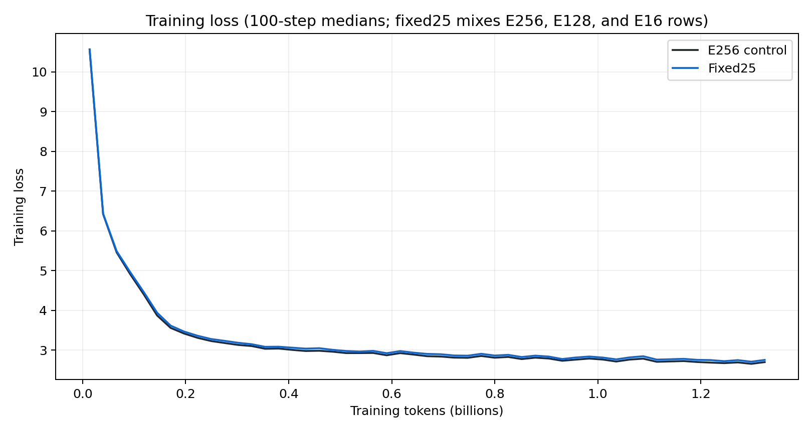
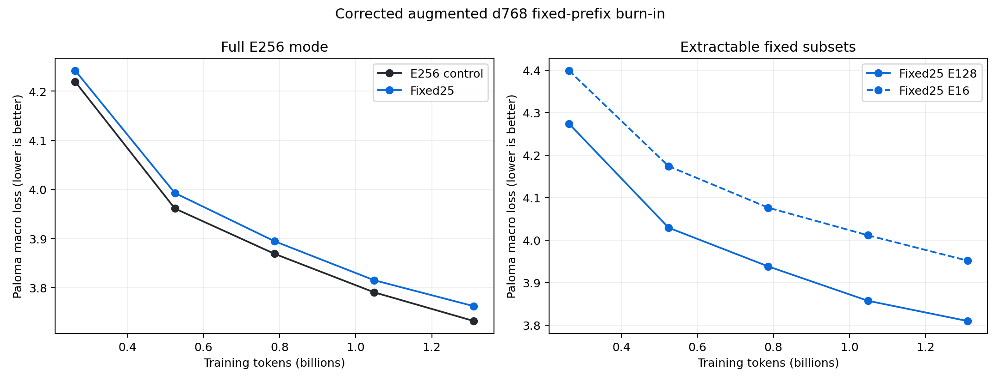
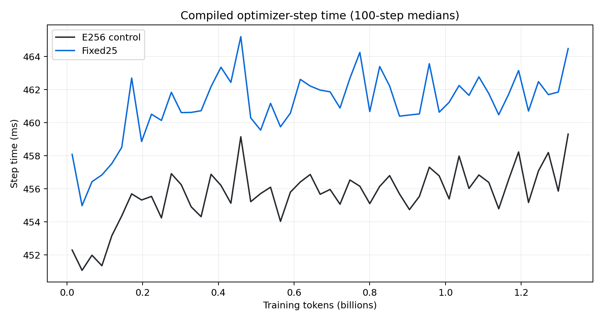

# Corrected fixed-prefix nested experts

Date: 2026-07-29

Status: running.

## Decision

The corrected `aug-dk` control reproduces the historical training run through
update 1,000. The matched fixed25 treatment remains within the preregistered
10% optimizer-step overhead gate, but its full-model held-out loss is worse at
the first two evaluation gates. Both arms are continuing to the 4.414B-token
endpoint before a promotion decision.

This report replaces the invalidated
[first d768 burn](nested-model-training-burnin.md). Final loss curves, runtime
tables, cost projections, checkpoint transfer results, and scale-up guidance
will be added when the running pretraining and SFT jobs complete.

## Control reconstruction

The reference run is
[`aug-dk-d768-ev-sw2k-g4-nomtp-noconv-f1`](https://wandb.ai/marin-community/marin_moe/runs/aug-dk-d768-ev-sw2k-g4-nomtp-noconv-f1).
Its immutable source bundle has SHA-256
`adc2aad8a60b45f4a105d4d6e4134cb7fff350caa77d7e56ab23fbe66bd3479b`.
The exact-source
[`nest-burn-control-augdk-repro1000-r1`](https://wandb.ai/marin-community/marin_moe/runs/nest-burn-control-augdk-repro1000-r1)
reproduction changed only run identity and output paths.

Across updates 2--1,000, the median absolute pointwise training-loss
difference was `0.002285` nat and the 95th percentile was `0.013817` nat.
Learning rates matched exactly. At update 1,000, Paloma macro loss was
`4.224867` for the reproduction and `4.221188` for the reference, a
`+0.003679` nat difference. The preregistered control gate passed.

## Experimental setup

| Property | Value |
|---|---:|
| Hidden dimension | 768 |
| Layers | 8 |
| Query / KV heads | 6 / 1 |
| Total / active experts | 256 / 4 |
| Shared experts | 1 |
| Sliding window | 2,048 |
| Global-attention cadence | every fourth layer |
| Sequence length | 8,192 |
| Global batch | 32 |
| Tokens per update | 262,144 |
| Updates | 16,840 |
| Nominal training tokens | 4.4145B |
| Compute budget | 4.14e18 model FLOPs |
| Devices per arm | 8 H100 |
| Parallelism | full FSDP; expert axis 1 |
| Data | `aug-dk` Datakit mixture from CoreWeave S3 |

The optimizer is the d768 MoeHeuristic cell: MuonH learning rate `0.00838`,
AdamH learning rate `0.00838`, plain-Adam learning rate `0.00193`, beta1
`0.9062`, beta2 approximately `0.998`, epsilon approximately `1.03e-15`, 1%
warmup, linear decay to a 0.05 minimum ratio, and no gradient clipping.

The control routes every sequence across all 256 experts. Fixed25 routes 75%
of sequences across all experts, 12.5% only across experts 0--127, and 12.5%
only across experts 0--15. The subsets are literal fixed prefixes at every
layer and update. E256, E128, and E16 keep independent eligibility-conditioned
QB router state.

Measurement runs:

- [E256 control](https://wandb.ai/marin-community/marin_moe/runs/nest-augdk-e256-4b-r2)
- [fixed25 treatment](https://wandb.ai/marin-community/marin_moe/runs/nest-augdk-fixed25-4b-r2)

Checkpoint replicas:

- [E256 checkpoint replica](https://wandb.ai/marin-community/marin_moe/runs/nest-augdk-e256-4b-ckpt-r1)
- [fixed25 checkpoint replica](https://wandb.ai/marin-community/marin_moe/runs/nest-augdk-fixed25-4b-ckpt-r1)

## Preregistered gates

The architecture is stopped or rejected if:

- full-mode Paloma is more than 0.10 nat worse than control at two consecutive
  aligned gates;
- router capacity overflow remains above 5%;
- compiled optimizer-step overhead exceeds 10% for promotion or 25% for
  immediate termination;
- loss or gradients become non-finite.

The measurement pair evaluates every 1,000 updates. Fixed25 evaluates full,
E128, and E16 modes; the control evaluates full mode. Timing excludes
compilation, data loading, checkpointing, and evaluation hooks. A separate
no-evaluation replica pair writes final checkpoints for matched SFT.

## Interim results

| Update | Tokens | E256 full Paloma | fixed25 full | Delta | fixed25 E128 | fixed25 E16 |
|---:|---:|---:|---:|---:|---:|---:|
| 1,000 | 0.262B | 4.219130 | 4.241795 | +0.022665 | 4.274152 | 4.399118 |
| 2,000 | 0.524B | 3.961045 | 3.992682 | +0.031638 | 4.029015 | 4.173859 |
| 3,000 | 0.786B | 3.868898 | 3.894513 | +0.025615 | 3.937864 | 4.076207 |
| 4,000 | 1.049B | 3.790510 | 3.815166 | +0.024656 | 3.856960 | 4.011194 |
| 5,000 | 1.311B | 3.732107 | 3.762341 | +0.030234 | 3.809299 | 3.951459 |

Through common update 5,100, fixed25 adds 1.19% to median compiled
optimizer-step time: 456.276 ms for control and 461.684 ms for fixed25.
Across the five aligned evaluation gates, the median full-mode Paloma delta is
`+0.025615` nat.
Fixed25's three-mode evaluation takes longer than the control's one-mode
evaluation; that instrumentation cost is excluded from the architecture
surcharge.

## Remaining work

The promotion decision waits for the full 4.414B-token curve. The final report
will include aligned Paloma and uncheatable results, per-domain comparisons,
step-time distributions and charged runtime, 10B--1T cost projections, a
matched SFT transfer check, and an explicit assessment of which conclusions
can transfer to a 300B--700B expert-parallel topology.
