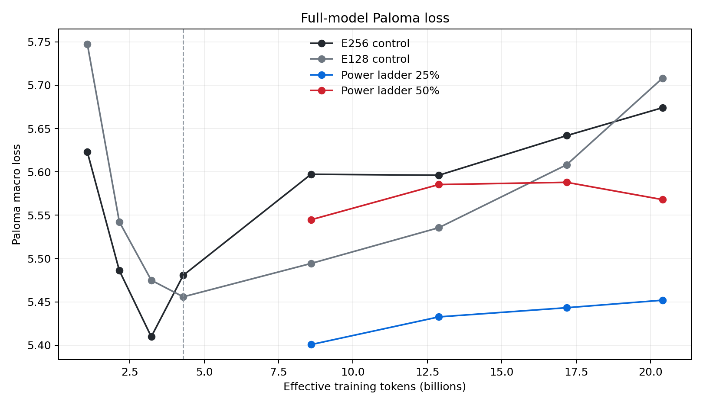
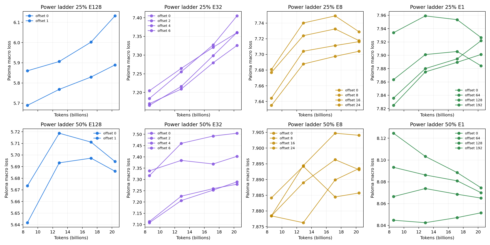
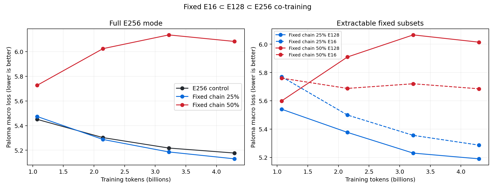
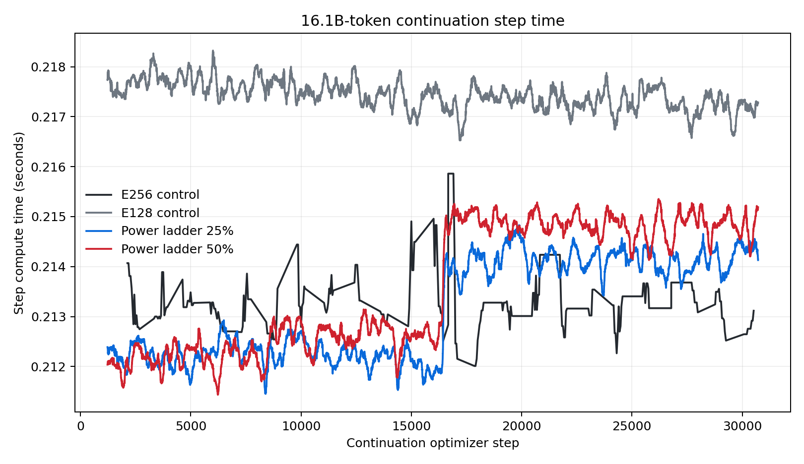
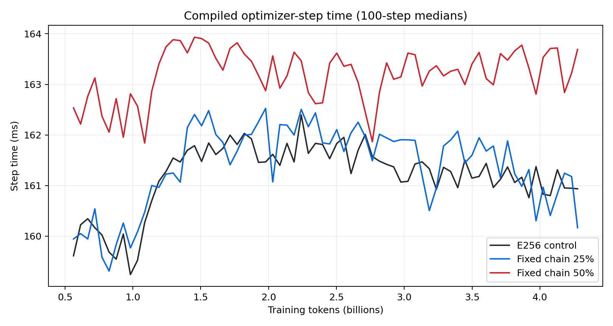

# Nested MoE power ladders: final report

Date: 2026-07-27

Status: complete.

## Decision

The experiment asks whether one MoE pretraining process can preserve a large
model while continuously training useful smaller expert-bank checkpoints. The
answer has two parts:

1. Expert-bank restriction is effectively free at training time because it
   changes router eligibility inside the existing forward and backward pass.
2. Rotating every miniature size across every expert coset is a promising
   full-model regularizer, but the 4.3B-token checkpoint did not give any one
   extracted E128, E32, E8, or E1 subset enough continuous training.

The rotating 20.4B-token endpoint rejects arbitrary-coset extraction: the
miniatures worsen because each exact subset receives too little continuous
training. The fixed25 chain is the leading design at 4.3B tokens: its full
model beats E256 on 12 of 16 Paloma domains, both nested checkpoints improve,
and its measured overhead is `0.17%`. The fixed50 chain fails broadly despite
zero overflow. Fixed E16 ⊂ E128 ⊂ E256 co-training is viable enough to scale
to a longer, replicated proxy; the 25% schedule is not yet evidence enough to
modify a 300B--700B production run.

## Research context

The strongest direct precedent is Google's MatFormer work. It jointly trains
nested feed-forward widths, and Google used the method to train the Gemma 3n
E2B checkpoint inside E4B and release both extracted models. This establishes
that nested co-training can work in a production language model.

Meta's LayerSkip is the strongest depth-specific precedent: layer dropout and
early-exit losses make intermediate depths useful and enable self-speculative
decoding. NVIDIA's Flextron is the lower-risk post-hoc alternative; it converts
a pretrained model into an elastic family using 7.63% of the original
pretraining tokens. Google DeepMind's Mixture of Nested Experts demonstrates
nested expert widths in vision, while sparse upcycling supports the reverse
schedule of training the small model first and expanding it.

These results support the general approach. None establishes that rotating
expert-count subsets in a frontier-scale language MoE preserve both models.

Primary sources:

- [Gemma 3n developer guide](https://developers.googleblog.com/en/introducing-gemma-3n-developer-guide/)
- [MatFormer](https://arxiv.org/abs/2310.07707)
- [LayerSkip](https://ai.meta.com/research/publications/layerskip-enabling-early-exit-inference-and-self-speculative-decoding/)
- [Flextron](https://research.nvidia.com/labs/lpr/publication/cai2024flextron/)
- [Mixture of Nested Experts](https://deepmind.google/research/publications/108549/)
- [Sparse Upcycling](https://arxiv.org/abs/2212.05055)

## Hypotheses and gates

The primary economic hypothesis was that expert restriction would retain at
least 90% of E256 throughput and cost less than 10% over the large control.
The primary quality hypothesis was that the full model and an extracted E128
checkpoint would remain competitive with independently trained E256 and E128
controls.

The study used gates instead of a broad sweep:

1. Numerical contracts and extraction tests.
2. Short four-arm rack smokes for stability, routing, and throughput.
3. A common-token four-arm comparison.
4. Breakout cooldown and matched SFT only after the pretraining gate.
5. A longer paired cost and power-ladder study only after the mechanism was
   cheap enough to justify it.

Preemption and common-mode infrastructure failures were retried without
changing the scientific configuration. Invalid attempts were excluded before
their metrics were inspected as evidence.

## Architecture variations

### Fixed E128 subset

The first proxy assigned an entire packed sequence either to all 256 experts or
to a fixed, evenly interleaved E128 subset. The branch stayed fixed through
every layer. Restricted and unrestricted rows shared one normal top-4 MoE
forward, loss, and backward.

At 262M tokens, the 25%-restricted model was within the preregistered full-model
margin, its extracted E128 beat the standalone E128 control, and a 10%-FLOP
direct cooldown improved it further. The 50%-restricted schedule degraded the
full model. This phase established feasibility and arbitrary-checkpoint
breakout, but it was too short to estimate long-run cost or stability.

### Rotating expert power ladder

The long-run follow-up retained the E256 and E128 controls and introduced two
E256 ladders:

- ladder25 restricts 25% of batch rows;
- ladder50 restricts 50% of batch rows.

Restricted rows cycle through E128, E32, E8, and E1 eligibility masks. Each
size also rotates through all of its cosets in the 256-expert bank. The
requested sequence is therefore E256 → E128 → E32 → E8 → E1, with a different
subset selected on each restricted update.

E1 uses one semantic route plus three balanced, zero-weight dummy dispatch
slots. This preserves the controls' top-4 tensor shapes and expert FLOPs during
training while allowing an extracted E1 model to use top-1 inference.

Rotation spreads structured-dropout pressure over the full bank and prevents a
single E1 rank from becoming a routing hot spot. It also dilutes the curriculum
for any one extractable subset.

### Fixed E16 ⊂ E128 ⊂ E256 chain

The final architecture arm keeps one exact expert hierarchy: E16 is always the
same subset of E128, and E128 is always the same subset of E256. Restricted
rows alternate between E128 and E16; unrestricted rows use E256. Extraction
compacts the interleaved physical experts into conventional contiguous E16 and
E128 checkpoints.

This design exposed a systems constraint that rotation hides. With a 64-way
expert axis, fixed E16 occupies only 16 expert ranks. The fixed50 attempt
reached 8.7% assignment overflow because those ranks received concentrated
traffic. It was stopped before its first quality gate. The corrected topology
uses a 16-way expert axis, so every expert rank owns one E16 expert, eight E128
experts, and sixteen E256 experts. A concurrent E256 arm on the same topology
is the cost and quality control.

True nesting also invalidated QB's original uniform assignment target. An E16
core expert is legitimately eligible on E256, E128, and E16 rows, while an
outer expert is eligible only on E256 rows. Targeting the same assignment count
for both made fixed50 router biases grow by two orders of magnitude. An
eligibility-weighted QB prototype failed during first-step distributed
compilation/runtime on four attempts and was not promoted. Disabling balancing
then caused 50.1%, 16.8%, and 1.9% overflow in E256, fixed25, and fixed50.

The promoted controller uses an auxiliary load-balance loss conditioned on
each row's eligible expert set. It computes independent balance losses for
E256, E128, and E16 rows, then combines them by token count. A frozen
coefficient gate bracketed the stable region: `0.01` was finite but fixed25
ended at 1.24% overflow; `0.02` held E256 and fixed50 below 0.14% but made
fixed25 non-finite at update 3; `0.015` kept fixed25 finite through peak
learning rate and ended at 0.072% overflow.

The 8,192-step schedule invalidated that short gate. Its learning rate remains
near peak after update 512, while the 600-step pilot cooled immediately.
Overflow reached 14.2%--14.5% in all three coefficient-0.015 arms by update
1,219, so they were stopped. The final controller keeps separate QB bias state
for E256, E128, and E16. Each routing mode now balances only its own eligible
experts; extraction carries the matching bias row into the compact checkpoint.

## Experimental setup

The rotating long-run arms execute concurrently on 256 GB200 GPUs on
`cw-us-east-08a`, using 64 GPUs per arm. The fixed-chain experiment uses three
concurrent 64-GPU arms: E256, fixed25, and fixed50.

| Property | Value |
|---|---:|
| Hidden dimension | 768 |
| Layers | 8 |
| Approximate E256 / E128 parameters | 2.0B / 1.1B |
| Sequence length | 2,048 |
| Global batch | 256 |
| Tokens per update | 524,288 |
| Initial updates | 8,192 |
| Initial tokens | 4.295B |
| Continuation updates | 30,720 |
| Continuation tokens | 16.106B |
| Effective final tokens | 20.401B |
| Total / active routed experts | 256 / 4 |
| Expert-parallel axis | rotating: 64; fixed: 16 |
| Capacity factor | 1.25 |
| Precision | fp32 |
| Attention | reference |
| Data | SlimPajama-6B, Llama 3.1 tokenizer |
| Validation | 16-domain Paloma macro and micro loss |

The first 8,192 updates used the original pretraining optimizer schedule. The
extension loads each step-8,192 model's weights, resets optimizer and data
state, warms a fresh optimizer for 512 updates, and uses 10% of the original
peak learning rate. Curves are spliced with an 8,192-step offset, but the
second phase is not described as a seamless full-state continuation.

Two invalid resume attempts motivated this amendment. Rebuilding the total
schedule first caused a 16x learning-rate discontinuity. Preserving the
schedule then exposed a separate non-finite full-state optimizer restore.
Both failures were common to controls and ladders and are excluded from
architecture evidence.

The rotating continuation is a paired sensitivity analysis, not an absolute
pretraining curve. It resets MuonH and Adam moments, restarts the finite
SlimPajama stream, and creates a new LR cycle. At its first 8,192-step gate,
MuonH LR was `0.000298781`, 1.52x the original terminal LR. The original proxy
also used a five-step warmup rather than the heuristic's documented 1%
warmup.

The primary fixed-chain comparison avoids those issues. It starts all three
arms from scratch, trains 8,192 updates or 4.295B tokens before corpus replay,
and uses the heuristic peak rates with a 512-update warmup. An 82-update
warmup, the rounded 1% recipe value, made fixed50 non-finite at update 3. The
first 512-step warmup gate remained finite but exposed the invalid uniform QB
target through diverging router biases. The active fixed-chain comparison uses
the matched eligibility-specific QB controller in all three arms. Its first
1,600 updates are a sustained-peak routing gate before quality results are
accepted.

## Evaluation

Training reports loss, compiled step duration, tokens/s, callback and loading
time, router overflow, routing entropy, parameter norms, and gradient norms.
Levanter mirrors the series to both W&B and telltale/finelog. Iris child-task
durations provide charged GPU-hours.

Paloma evaluates every 2,048 updates in the first phase and every 8,192 updates
in the continuation. Full E256 mode is evaluated in every E256 arm. Ladder
checkpoints also evaluate:

| Extracted size | Evaluated offsets |
|---|---|
| E128 | 0, 1 |
| E32 | 0, 2, 4, 6 |
| E8 | 0, 8, 16, 24 |
| E1 | 0, 64, 128, 192 |

The timing analysis excludes the first 1,024 continuation updates and reports
the median compiled step with a contiguous-block bootstrap interval. It does
not treat individual tokens or steps as model-seed replications. The single
seed per arm is a deadline tradeoff.

Each Paloma checkpoint uses one batch of 256 sequences per domain. The
evaluator reuses the same fixed slices at every checkpoint, so checkpoint
differences are not random resampling noise. Coverage is nevertheless too
small to treat the macro average as a frontier-quality benchmark; paired
per-domain deltas are reported alongside it.

## Results

### 4.3B-token gate

| Arm | Full Paloma macro | E128 extraction | E32 | E8 | E1 |
|---|---:|---:|---:|---:|---:|
| E256 | 5.48064 | — | — | — | — |
| E128 | 5.45585 | — | — | — | — |
| ladder25 | 5.33288 | 5.67983 | 6.98241 | 7.53716 | 7.78265 |
| ladder50 | 5.45159 | 5.53466 | 6.74550 | 7.63139 | 7.84325 |

Ladder25 improved full-mode Paloma by 0.14775 versus E256, while its
offset-zero E128 was 0.22398 worse than the standalone E128. Ladder50 improved
full mode by 0.02905 and missed standalone E128 by 0.07881. E32, E8, and E1
generally worsened with additional tokens.

The restricted exposure of one fixed extractable coset is:

| Size | ladder25 | ladder50 |
|---|---:|---:|
| E128 | 3.125% | 6.250% |
| E32 | 0.781% | 1.563% |
| E8 | 0.195% | 0.391% |
| E1 | 0.024% | 0.049% |

Ladder25's E1 value is roughly one sequence in 4,096; ladder50's is one in
2,048. The result is consistent with full-bank regularization plus
stable-submodel undertraining.

### 20.4B-token quality

| Arm | Full Paloma macro | Delta versus E256 | E128 offset 0 |
|---|---:|---:|---:|
| E256 | ~5.674 | — | — |
| E128 | 5.70816 | +0.0341 | — |
| ladder25 | 5.45195 | -0.2221 | 6.13170 |
| ladder50 | 5.56803 | -0.1060 | 5.68603 |

The E256 W&B uploader stopped during the continuation. Its final evaluator log
reports macro `5.674` and micro `5.661`; the exact final scalar did not reach
W&B or telltale. Exact treatment deltas above use the mean `5.67406` recovered
from the 16 three-decimal domain values in the evaluator log.

At the first continuation gate, the untreated E256 control increased from
`5.48064` to `5.59726`, and E128 increased from `5.45585` to `5.49434`.
E128 worsened on 11 of 16 Paloma domains, with median domain delta `+0.03259`.
The absolute regression is therefore shared by controls and is not evidence
against nested routing. It is consistent with the fresh optimizer, LR-cycle
change, and replayed data; this continuation is not used for absolute
quality extrapolation. At the same gate, ladder25 and ladder50 full-mode loss
was `5.40074` and `5.54477`, preserving their paired advantage over E256.

The E256 control separates optimizer stability from distributional
generalization:

| Effective tokens | SlimPajama validation | Paloma macro | Paloma micro |
|---:|---:|---:|---:|
| 8.59B | 4.69321 | 5.59726 | 5.57194 |
| 12.89B | 4.66644 | 5.59614 | 5.57506 |
| 17.18B | 4.64010 | 5.64185 | 5.62366 |
| 20.40B | ~4.602 | ~5.674 | ~5.661 |

The in-distribution validation loss improves monotonically while both Paloma
aggregates eventually regress. This is not optimizer divergence. It is
consistent with continued specialization to the restarted finite SlimPajama
stream and weaker out-of-distribution generalization.

The optimizer audit does not support a Muon misconfiguration as the primary
cause. The original and fixed-chain scratch arms use the heuristic MuonH peak
rate `0.00393923`, Adam peak rate `0.000909053`, global batch 256, and 524,288
tokens per update. The rotating continuation deliberately uses 10% of those
rates with a 512-update warmup. Its first evaluation occurs at MuonH
`0.000298781`, which is 1.52 times the original terminal rate but only 7.6% of
the original peak. The original proxy's five-update warmup is incorrect for
optimizer-quality attribution; the active fixed-chain experiment uses 512
updates in every arm.

The corrected r47 E256 control reached Paloma `5.45031` at 1.074B tokens,
versus `5.62286` for the original five-update-warmup control at the same token
count. The `-0.17255` difference is not a pure warmup ablation because r47 also
uses EP16 and eligibility-specific QB, but it confirms that the original
absolute curve is not an optimizer-quality baseline.

The original E256 curve was already non-monotonic: `5.62286`, `5.48619`,
`5.40981`, then `5.48064` at 1.07B, 2.15B, 3.22B, and 4.29B tokens. The final
increase was not broad: 7 of 16 domains worsened and the median domain delta
was `-0.04029`; the macro increase was dominated by four small fixed slices.
This makes the one-batch-per-domain macro too noisy for interpreting a single
checkpoint. The continuation control regression is more concerning because
E128 worsened on 11 domains, but it occurs after an optimizer reset, data-stream
restart, and LR-cycle reset.

At 12.89B effective tokens, E256 was nearly flat at `5.59614`. E128 increased
to `5.53563`; the second interval worsened on 9 of 16 domains, with median
delta only `+0.00560`. Ladder25 retained a material paired advantage at
`5.43270`, or `-0.16344` versus E256. Ladder50 reached `5.58540`, narrowing its
advantage to `-0.01074`.

At 17.18B effective tokens, E256, E128, ladder25, and ladder50 reached
`5.64185`, `5.60826`, `5.44328`, and `5.58798`. The apparent ladder25
advantage was `-0.19857`, but it was not broad: 8 of 16 domains improved and
the median domain delta was `+0.01882`. Programming languages (`-1.921`), gab
(`-0.946`), and TwitterAAE (`-0.781`) accounted for the large macro gain.
Ladder50 improved on 5 of 16 domains and had median delta `+0.20203`. E128 was
the broadest treatment at this checkpoint, improving on 10 of 16 domains with
median delta `-0.01635`.

At 20.40B effective tokens, E128 improved on 9 of 16 domains with median delta
`-0.00461`, despite its macro being `0.0341` worse. Ladder25 improved on 7 of
16 with median delta `+0.01741`; programming languages (`-1.736`), gab
(`-1.146`), and TwitterAAE (`-0.800`) again explain its macro advantage.
Ladder50 improved on 6 of 16 with median delta `+0.16814`. Its largest gains
were the same three slices. The endpoint therefore strengthens the
specialization interpretation.

The rotating miniatures did not become viable with more tokens. Ladder25's
offset-zero E128 moved from `5.67983` at 4.3B to `6.13170` at 20.4B;
ladder50's moved from `5.53466` to `5.68603`. Final E32 values were at least
`7.27884`, E8 at least `7.70406`, and E1 at least `7.88418`.

The rotating ladder therefore produces a repeatable specialization shift, not
evidence of a general full-model quality improvement. Macro and micro loss
remain useful paired measurements only when accompanied by domain breadth.

### Fixed-chain quality

The eligibility-specific QB controller passed its sustained-high-LR routing
gate. Over updates 512--1,600:

| Arm | Median step (block 95% CI) | Cost versus E256 (95% CI) | Maximum overflow |
|---|---:|---:|---:|
| E256 | 159.94 ms (159.67--160.28) | — | 0.0480% |
| fixed25 | 159.80 ms (159.67--160.00) | -0.084% (-0.30--0.15%) | 0.0367% |
| fixed50 | 162.50 ms (162.27--162.73) | +1.60% (+1.36--1.85%) | 0.0489% |

All losses and gradient norms remained finite. E256 had one earlier update at
1.063% overflow, technically missing the strict all-step threshold by 0.063
percentage points; neither treatment crossed 1%, and all three stayed below
0.05% after warmup.

At the first quality gate:

| Tokens | Arm | Full E256 | Delta versus E256 | Fixed E128 | Fixed E16 |
|---:|---|---:|---:|---:|---:|
| 1.074B | E256 | 5.45031 | — | — | — |
| 1.074B | fixed25 | 5.47354 | +0.02323 | 5.54035 | 5.77017 |
| 1.074B | fixed50 | 5.72693 | +0.27662 | 5.59894 | 5.75990 |
| 2.147B | E256 | 5.30234 | — | — | — |
| 2.147B | fixed25 | 5.28739 | -0.01496 | 5.37677 | 5.49938 |
| 2.147B | fixed50 | 6.02401 | +0.72167 | 5.90928 | 5.68742 |
| 3.221B | E256 | 5.21788 | — | — | — |
| 3.221B | fixed25 | 5.18625 | -0.03163 | 5.23026 | 5.35568 |
| 3.221B | fixed50 | 6.13546 | +0.91759 | 6.06548 | 5.72020 |
| 4.295B | E256 | 5.17725 | — | — | — |
| 4.295B | fixed25 | 5.13033 | -0.04692 | 5.18978 | 5.28666 |
| 4.295B | fixed50 | 6.08237 | +0.90512 | 6.01412 | 5.68469 |

Fixed25 is the leading branch. It crosses from a small early penalty to a small
full-model advantage while both nested checkpoints improve. Fixed50 degrades
despite zero current overflow; the failure is optimization or capacity
allocation from restricting half the sequences, not router capacity.

The third gate separates a Paloma artifact from an optimization failure.
SlimPajama validation was `4.73528` for E256, `4.71905` for fixed25, and
`5.55067` for fixed50. Fixed50 worsens both in-distribution and
out-of-distribution evaluation, on every Paloma domain at the preceding gate.
Its loss and gradients remain finite and overflow remains zero. The common
MuonH/Adam schedule is therefore stable for E256 and fixed25, while the 50%
multitask mixture is too aggressive under the matched recipe. This experiment
does not distinguish an intrinsic fixed50 limit from a fixable lower-LR or
mode-conditioned-optimizer interaction.

At the endpoint, fixed25 improves on 12 of 16 Paloma domains with median
delta `-0.04158`; its macro gain is broad rather than concentrated in a few
slices. Fixed50 loses on all 16 domains with median delta `+0.72534`.
SlimPajama validation is `4.64909`, `4.60884`, and `5.45717` for E256,
fixed25, and fixed50. The final fixed25 result is therefore a paired
in-distribution and out-of-distribution gain.

### Training loss and stability

All four rotating arms completed with finite loss. Their logged training
objectives are intentionally not comparable in height: ladder rows include
restricted routing modes that are harder than full E256 rows. The curves are
used to detect divergence and changes in slope, not to rank final models.

### Runtime and cost

| Arm | Median step (95% block CI) | Cost versus E256 | 16.1B continuation GPU-hours |
|---|---:|---:|---:|
| E256 | 213.18 ms (213.01--213.27) | — | 116.43 |
| E128 | 217.44 ms (217.38--217.50) | +2.00% | 118.75 |
| ladder25 | 213.44 ms (212.44--213.87) | +0.12% | 116.57 |
| ladder50 | 214.05 ms (212.78--214.65) | +0.41% | 116.90 |

The rotating co-training surcharge is below 0.5%. The fixed-chain sustained
gate likewise finds no measurable fixed25 surcharge and a 1.60% fixed50
surcharge. A separately trained E128 model takes approximately another full
active-top-4 run: its measured step is 2.00% slower than E256 in this topology.
Fixed25 therefore replaces roughly 102% additional optimizer compute with a
cost consistent with zero in this proxy.

The full 4.3B-token fixed-chain timing estimate is:

| Arm | Median step (95% block CI) | Cost versus E256 | GPU-hours / 1B tokens |
|---|---:|---:|---:|
| E256 | 161.23 ms (161.13--161.47) | — | 5.467 |
| fixed25 | 161.50 ms (161.09--161.89) | +0.17% | 5.476 |
| fixed50 | 163.26 ms (163.09--163.49) | +1.26% | 5.536 |

The point estimate charges fixed25 `0.0091` additional GPU-hours per billion
tokens. This is operationally negligible relative to a separate small-model
run.

The analytic model FLOPs of both ladder arms match E256: masking changes router
eligibility but does not add another model forward. The measured step-time
ratio is the primary co-training surcharge. Evaluation callbacks are reported
separately because multi-offset research evaluation is not a production
training cost.

### Routing and overflow

At 4.3B tokens, mean assignment overflow was 0.119% for E256, 0.276% for E128,
0.289% for ladder25, and 0.231% for ladder50. Terminal overflow was 0.177%,
0.524%, 0.124%, and 0.067%. All pass the 1% terminal routing gate.

Across the 16.1B continuation, mean overflow was 0.092% for E256, 0.154% for
E128, 0.157% for ladder25, and 0.190% for ladder50. Terminal values were
0.361%, 0.135%, 0.231%, and 0.169%. All remained below the 1% gate.

An earlier rack canary briefly showed roughly 5% overflow. The untreated
control exhibited the same cold-router transient, and the rate fell as the
router learned. It was therefore a common fixed-capacity routing inefficiency,
not evidence against nested architecture. The architecture comparison remains
at common capacity factor 1.25.

This distinction matters for scale-up. A transient shared overflow does not
contaminate the question of whether co-training works, but a persistent
method-specific capacity requirement would be part of its cost. The final
report therefore shows both the common-capacity comparison and the production
capacity caveat.

## SFT and agentic transfer

The earlier fixed-subset gate used the repository's pinned WildChat 385.7k
pipeline with the Llama 3.1 instruct template, assistant-token-only loss,
packed 2,048-token sequences, and identical data order. Eight corrected updates
compared E256, E128, nested25 full, and a cooled E128 breakout.

| Initialization | Mean loss, updates 2–7 | Final loss |
|---|---:|---:|
| E256 control | 7.08179 | 7.10610 |
| E128 control | 7.15806 | 7.17838 |
| nested25 full | 7.08169 | 7.10641 |
| cooled E128 breakout | 7.03852 | 7.05814 |

The nested full checkpoint tracked E256, and the breakout remained below E128.
All four loaded, optimized, and saved. Mean overflow was 10.8%–12.8% after the
abrupt distribution shift, so this was a trainability check rather than a
loss-safe post-training result. Eight updates on an undertrained proxy do not
support an agentic capability claim, and no agentic benchmark is reported.

The rotating-ladder extension does not repeat SFT because its purpose is the
long-run pretraining cost and multi-offset extraction question; the matched
post-training path was already exercised in the promoted fixed-subset gate.

## Numerical extrapolation

Runtime extrapolation uses measured median step duration:

`optimizer hours = target tokens / 524,288 × median step seconds / 3,600`.

This separates the architecture's steady-state charge from fixed compilation,
checkpoint, and evaluation costs. No absolute quality scaling law is fit to
the weights-only continuation because its optimizer reset, LR cycle, and
replayed data violate the assumptions of a continuous token curve.

| Target tokens | E256 GPU-hours | fixed25 GPU-hours | fixed50 GPU-hours | E256 + separate E128 |
|---:|---:|---:|---:|---:|
| 10B | 54.67 | 54.76 | 55.36 | 110.43 |
| 100B | 546.71 | 547.62 | 553.58 | 1,104.34 |
| 1T | 5,467.08 | 5,476.17 | 5,535.79 | 11,043.45 |

The separate-E128 column applies its measured `+2.00%` step cost to a second
run. It is a compute comparison, not a claim that the extracted E128 matches
an independently compute-optimal E128.

A descriptive fit of paired Paloma delta against log training tokens across
the four fixed-chain gates is

`fixed25 - E256 = 0.02580 - 0.05010 × ln(tokens in billions)`.

It projects deltas of `-0.0896` at 10B and `-0.1243` at 20B. These numbers are
not a quality forecast: the fit has one seed, four fixed evaluation slices,
and extrapolates beyond the completed LR schedule. The defensible conclusion
is directional—fixed25's paired delta improved at every measured gate
(`+0.0232`, `-0.0150`, `-0.0316`, `-0.0469`)—and requires a longer
no-replay replication before production use.

## Viability at 300B–700B

Expert-count nesting primarily reduces stored parameters. With unchanged
top-k, expert width, dense backbone, and depth, it does not make the extracted
model proportionally cheaper per token. A 300B expert-bank subset inside a
700B MoE can therefore save checkpoint and serving memory without delivering a
2.3x decode speedup.

The current method is viable for a hero run only if:

1. a longer, replicated fixed25 full model remains competitive with E256;
2. an extracted subset plus bounded direct cooldown is competitive with E128;
3. measured training overhead, including any method-specific capacity charge,
   remains below 10%; and
4. the intended expert-per-rank topology supports the concentrated small path.

The proxy has four experts per expert-parallel rank and capacity factor 1.25.
A production layout with one expert per rank may need replicated canonical
experts, collocated small and outer experts, a ragged/dropless dispatcher, or
extra capacity. If nesting uniquely requires capacity 1.25 while the control
runs safely at 1.0, that systems charge can dominate the sub-1% mask overhead.

The promotion decision is:

1. Promote fixed25 to a longer multi-seed proxy with no data replay, the
   production expert-per-rank layout, and an in-process E128 breakout
   cooldown. Its `0.17%` measured surcharge is viable at 300B--700B and is
   roughly 102 percentage points cheaper than a separate active-top-4 run.
2. Do not promote fixed50 without a lower-LR or mode-conditioned optimizer
   ablation. Its `1.26%` systems cost is cheap, but its quality failure is
   broad.
3. Treat rotating ladder25 only as a structured full-model regularizer. Its
   arbitrary cosets are not shippable checkpoints.
4. Use MatFormer-style expert-width nesting instead when the smaller model
   must reduce active inference FLOPs rather than only parameter memory.

Width, depth, top-k, and expert-count nesting should not be combined in the
first scaled replication. Independently sampling several axes makes each exact
submodel too rare and makes failures difficult to attribute.

## Reproducibility

Implementation and launchers:

- [`experiments/grug/moe/model.py`](https://github.com/marin-community/marin/blob/main/experiments/grug/moe/model.py)
- [`experiments/grug/moe/train.py`](https://github.com/marin-community/marin/blob/main/experiments/grug/moe/train.py)
- [`experiments/grug/moe/launch_nested_experts.py`](https://github.com/marin-community/marin/blob/main/experiments/grug/moe/launch_nested_experts.py)
- [`experiments/grug/moe/launch_nested_sft.py`](https://github.com/marin-community/marin/blob/main/experiments/grug/moe/launch_nested_sft.py)
- [`scripts/training/analyze_nested_moe_continuation.py`](https://github.com/marin-community/marin/blob/main/scripts/training/analyze_nested_moe_continuation.py)
- [`scripts/training/analyze_nested_moe_fixed.py`](https://github.com/marin-community/marin/blob/main/scripts/training/analyze_nested_moe_fixed.py)

Continuation W&B runs:

- [E256 control](https://wandb.ai/marin-community/marin_moe/runs/nest-moe-001-full-d768-s2048-e256-extend16b-r31)
- [E128 control](https://wandb.ai/marin-community/marin_moe/runs/nest-moe-002-full-d768-s2048-e128-extend16b-r31)
- [ladder25](https://wandb.ai/marin-community/marin_moe/runs/nest-moe-006-full-d768-s2048-e256-extend16b-r31)
- [ladder50](https://wandb.ai/marin-community/marin_moe/runs/nest-moe-007-full-d768-s2048-e256-extend16b-r31)

Fixed-chain W&B runs:

- [E256 control](https://wandb.ai/marin-community/marin_moe/runs/nest-moe-001-full-d768-s2048-e256-fixedep16-eqb-w512-cost-r47)
- [fixed25](https://wandb.ai/marin-community/marin_moe/runs/nest-moe-008-full-d768-s2048-e256-fixedep16-eqb-w512-cost-r47)
- [fixed50](https://wandb.ai/marin-community/marin_moe/runs/nest-moe-009-full-d768-s2048-e256-fixedep16-eqb-w512-cost-r47)

Machine-readable results:

- [final result JSON](assets/nested-model-training-final-results.json)
- [fixed-chain result JSON](assets/nested-model-training-fixed-results.json)
