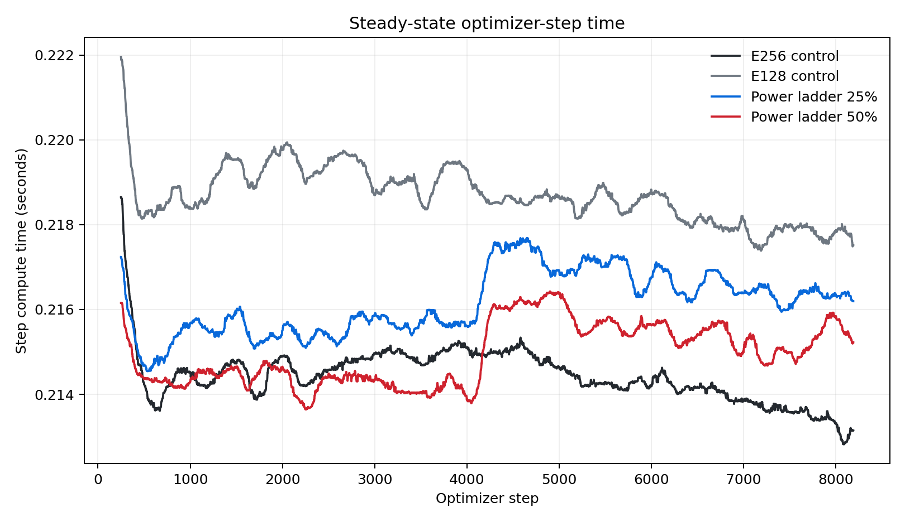
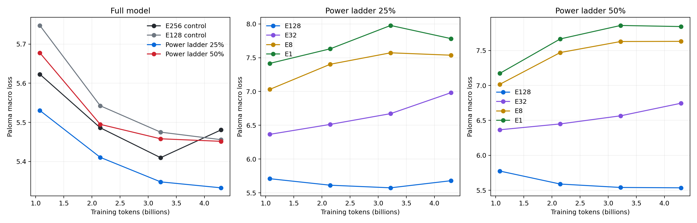
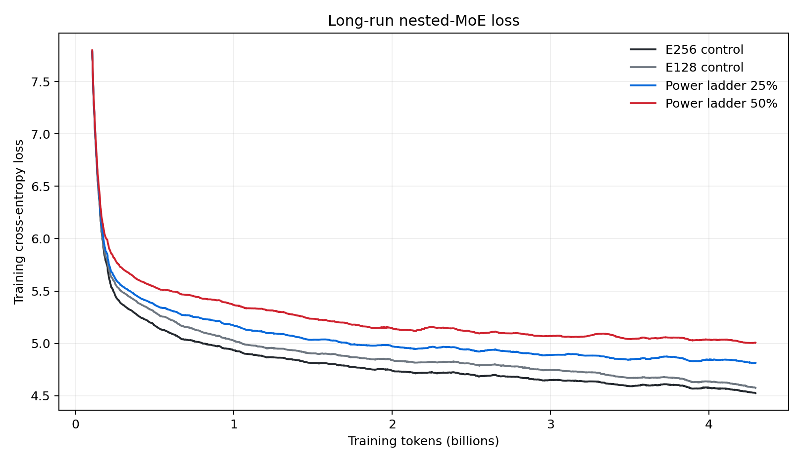

# Nested MoE power ladders: 4.3B-token interim result

Date: 2026-07-27

Status: interim; a 16.1B-token continuation is planned from these checkpoints.

## Decision

Rotating expert-subset training is cheap enough to scale. It is not yet a
working menu of breakout checkpoints.

At 4.295B common training tokens, a 25%-restricted E256 model took 0.83% longer
per optimizer step than the E256 control and improved full-mode Paloma macro
loss by 0.14775. Its fixed offset-zero E128 extraction was 0.22398 worse than
the standalone E128 control. E32, E8, and E1 extractions degraded as training
continued.

The result separates two hypotheses:

1. Rotating eligibility is a promising structured regularizer for the full
   expert bank.
2. Spreading small-mode examples over every expert coset does not give any one
   extracted subset a continuous enough curriculum.

The cost hypothesis passes. The breakout-quality hypothesis fails for the
single representative subsets evaluated so far. The next phase will continue
all four train states for 16.1B additional tokens and evaluate multiple cosets
at each miniature size.

## Experimental setup

All four arms trained concurrently on 256 GB200 GPUs on
`cw-us-east-08a`, using 64 GPUs per arm:

| Property | Value |
|---|---:|
| Hidden dimension | 768 |
| Layers | 8 |
| Sequence length | 2,048 |
| Global batch | 256 |
| Tokens per update | 524,288 |
| Updates | 8,192 |
| Training tokens | 4,294,967,296 |
| Total / active routed experts | 256 / 4 |
| Expert-parallel axis | 64 |
| Capacity factor | 1.25 |
| Precision | fp32 |
| Attention | reference |
| Data | SlimPajama-6B, Llama 3.1 tokenizer |
| Validation | 16-domain Paloma macro and micro loss |

The four arms were E256 and E128 controls, plus E256 power ladders with
25% or 50% of batch rows restricted. Restricted rows cycle through eligible
banks of E128, E32, E8, and E1. Within each size, the eligible coset also
rotates across the E256 bank.

E1 uses one semantic route. Three balanced, zero-weight dummy dispatch slots
preserve the same top-4 tensor shapes and expert FLOPs as the controls. The
experiment therefore compares architecture objectives at matched train-step
compute; an extracted E1 model can use top-1 inference.

## Cost

`throughput/duration` measures the compiled train step and excludes callbacks.
The confidence intervals below are contiguous-block bootstrap intervals over
post-warmup step medians.

| Arm | Median step | 95% CI | Tokens/s | Step overhead | W&B runtime | GPU-hours |
|---|---:|---:|---:|---:|---:|---:|
| E256 | 214.502 ms | 214.225–214.732 | 2.444M | — | 48.76 min | 52.01 |
| E128 | 218.752 ms | 218.409–218.931 | 2.397M | +1.98% | 47.87 min | 51.06 |
| ladder25 | 216.286 ms | 215.735–216.457 | 2.424M | +0.83% | 49.59 min | 52.89 |
| ladder50 | 215.093 ms | 214.458–215.418 | 2.437M | +0.28% | 49.07 min | 52.34 |

For ladder25, the measured surcharge is 1.784 ms per update, or 14.6 seconds
over 8,192 updates. End-to-end runtime was 49.6 seconds longer than E256, but
that includes four research evaluations of five operating modes. After the
first compilation, one full Paloma pass cost about 2.4 seconds and a
full-plus-four-submodel ladder pass cost about 8.0 seconds.

All arms passed the terminal routing gate:

| Arm | Mean overflow | Terminal overflow |
|---|---:|---:|
| E256 | 0.119% | 0.177% |
| E128 | 0.276% | 0.524% |
| ladder25 | 0.289% | 0.124% |
| ladder50 | 0.231% | 0.067% |

The highest instantaneous overflow occurred during early training and was
4.79% in E256, 4.27% in E128, 3.85% in ladder25, and 3.05% in ladder50. This
did not persist. The architecture comparison is at common capacity factor
1.25; it does not remove the production capacity caveat for a
one-expert-per-rank layout.

## Quality

### Full model and extracted checkpoints

| Arm | Full Paloma macro | Full micro | Δ macro vs E256 | E128 extraction | Δ E128 vs standalone | E32 | E8 | E1 |
|---|---:|---:|---:|---:|---:|---:|---:|---:|
| E256 | 5.48064 | 5.46001 | — | — | — | — | — | — |
| E128 | 5.45585 | 5.42588 | -0.02478 | — | — | — | — | — |
| ladder25 | 5.33288 | 5.30307 | **-0.14775** | 5.67983 | +0.22398 | 6.98241 | 7.53716 | 7.78265 |
| ladder50 | 5.45159 | 5.41035 | -0.02905 | 5.53466 | +0.07881 | 6.74550 | 7.63139 | 7.84325 |

Ladder25's full-mode gain is not only a single macro aggregate at the final
checkpoint: it wins 8 of 16 Paloma domains, with median paired delta -0.00455
and micro-loss delta -0.15694. The mean remains influenced by large gains on a
small number of domains, so replication is still required. Ladder50 wins 4 of
16 domains and has median paired delta +0.16919 despite its favorable macro.

The E128 result is much less ambiguous. Ladder25's E128 wins only 2 of 16
domains against standalone E128; its median paired delta is +0.34013.
Ladder50's E128 also wins 2 domains, with median delta +0.19212.

### Curves

| Tokens | E256 | E128 | ladder25 full | ladder25 E128 | ladder50 full | ladder50 E128 |
|---:|---:|---:|---:|---:|---:|---:|
| 1.074B | 5.62286 | 5.74745 | 5.53035 | 5.70948 | 5.67749 | 5.77439 |
| 2.147B | 5.48619 | 5.54241 | 5.41071 | 5.61320 | 5.49492 | 5.58854 |
| 3.221B | 5.40981 | 5.47503 | 5.34806 | 5.57471 | 5.45806 | 5.53965 |
| 4.295B | 5.48064 | 5.45585 | 5.33288 | 5.67983 | 5.45159 | 5.53466 |

The full ladder25 model beats E256 at every checkpoint. Its E128 is competitive
early, then falls behind. E32, E8, and E1 generally worsen with additional
training. This is the signature expected when full-bank updates overwrite
intermittent small-mode specialization.

The mixed-objective training loss is not directly comparable to the control
loss because ladder rows sometimes solve a harder restricted-expert problem.
It is still useful as a stability check: every arm remains finite and continues
to improve.

## Why rotation helps one goal and hurts the other

At ladder25, the restricted share is divided across four sizes and then across
all cosets. A specific subset therefore receives the following fraction of all
training sequences in its restricted mode:

| Extracted size | Cosets | Restricted exposure per coset |
|---|---:|---:|
| E128 | 2 | 3.125% |
| E32 | 8 | 0.781% |
| E8 | 32 | 0.195% |
| E1 | 256 | 0.024% |

Rotation prevents E1 traffic from overloading a single expert rank and gives
the full bank balanced structured-dropout pressure. It also means the
offset-zero E1 path sees only about one restricted sequence in 4,096. This is
not enough to behave like a separately trained E1 model.

The result suggests three next architectures:

1. Keep rotation as full-model regularization and stop promising extraction.
2. Train a stable nested chain and solve its rank hot spot by replicating or
   collocating the canonical small experts.
3. Keep rotation during pretraining, then select a promising coset and run a
   direct cooldown before breakout.

## Extrapolation

The observed throughput implies 16.1B additional tokens take about 1.85 hours
of pure optimizer steps per arm. Recompilation, four evaluation points, and
checkpoint commits put the expected end-to-end continuation at roughly
2.5–3.0 hours with all four arms running in parallel.

Late-run training-loss fits are useful only as a sensitivity analysis:

| Arm | 16B power-law loss | 16B log-linear loss | Held-out RMSE range |
|---|---:|---:|---:|
| E256 | 4.300 | 4.240 | 0.015–0.019 |
| E128 | 4.356 | 4.329 | 0.042–0.044 |
| ladder25 | 4.693 | 4.513 | 0.015–0.021 |
| ladder50 | 4.935 | 4.669 | 0.014–0.029 |

These are mixed-objective training losses, not full-mode Paloma projections.
They disagree enough that the requested continuation is more informative than
extrapolating the 4.3B-token curves.

## Scale-up view

The runtime result is viable for a 300B–700B run: a measured surcharge below
1% is far inside the 10% threshold and far cheaper than training a second
model. The mask construction and semantic top-k reduction do not add another
forward or backward pass.

Quality does not transfer automatically. The proxy has four experts per
expert-parallel rank and uses capacity factor 1.25. A frontier layout with one
expert per rank cannot concentrate a stable E1 or E8 path without replicated
experts, a ragged dispatcher, or extra capacity. Rotation avoids that systems
problem but, in this experiment, sacrifices stable breakout quality.

The present recommendation is to preserve ladder25 as a scale candidate for
full-model regularization, while requiring multi-offset replication and a
cooldown result before claiming that one pretraining run yields both the large
model and a production-quality small checkpoint.

## Continuation

The extension will resume the full model and optimizer state at step 8,192,
train through step 38,912, and add 16.106B tokens per arm. It retains E256,
E128, ladder25, and ladder50 so the long curve remains paired.

Evaluation will occur every 8,192 global steps. Ladder runs will evaluate all
two E128 cosets and four evenly spaced offsets at E32, E8, and E1. This tests
whether the poor offset-zero result is typical of each miniature size or an
unlucky subset.

Machine-readable results are in
[`nested-model-training-cost-results.json`](assets/nested-model-training-cost-results.json)
and the flat timing table is in
[`nested-model-training-cost-summary.csv`](assets/nested-model-training-cost-summary.csv).
