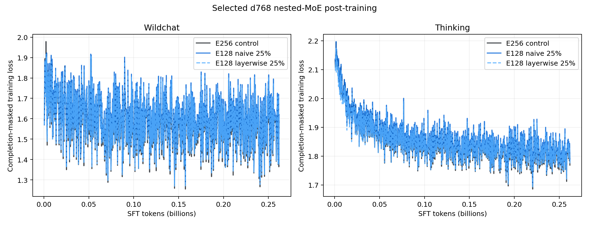
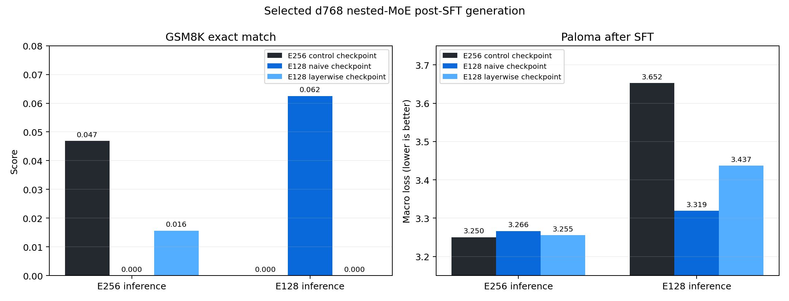

# Single-prefix nested experts at 10B tokens

Date: 2026-07-30

Status: draft; five-arm pretraining complete, standalone and post-training
controls in progress.

## Question

The first corrected fixed-prefix burn trained E128 and E16 modes together on
25% of sequences. It was mechanically cheap but required an estimated 11.9%
more wall time to reach the control's full-model Paloma loss. This experiment
asks two narrower questions:

1. How much of that quality tax comes from E128 versus E16 restriction?
2. Can restricting only a rotating subset of layers preserve useful prefix
   training while reducing the full-model tax?

The primary hypothesis is that E128-only nesting costs less than E16-only
nesting because it concentrates routed-expert updates much less. The
enhancement hypothesis is that exact rotating layerwise restriction improves
the full-model-versus-prefix Pareto frontier relative to restricting every
layer.

## Prior evidence

The strongest demonstrated precedent is Google's MatFormer work. It jointly
trains nested feed-forward widths, and Google subsequently used the method to
train and release Gemma 3n E2B inside E4B. Meta's LayerSkip demonstrates a
related depth-nesting objective and usable early exits. NVIDIA's Flextron is a
post-hoc alternative that converts a pretrained model into an elastic family
with bounded continued training. Google DeepMind's Mixture of Nested Experts
demonstrates nested expert widths in vision, while sparse upcycling validates
the reverse small-to-large schedule.

Primary sources:

- [Gemma 3n developer guide](https://developers.googleblog.com/en/introducing-gemma-3n-developer-guide/)
- [MatFormer](https://arxiv.org/abs/2310.07707)
- [LayerSkip](https://ai.meta.com/research/publications/layerskip-enabling-early-exit-inference-and-self-speculative-decoding/)
- [Flextron](https://research.nvidia.com/labs/lpr/publication/cai2024flextron/)
- [Mixture of Nested Experts](https://deepmind.google/research/publications/108549/)
- [Sparse Upcycling](https://arxiv.org/abs/2212.05055)

These results establish nested training as a real architecture family. They do
not establish that fixed expert-prefix language-model training is free, that
outer experts learn complementary concepts, or that a one-node proxy transfers
directly to a 300B--700B expert-parallel system.

## Experiment-series context

| Variation | Meaning | Decision |
|---|---|---|
| Rotating ladder25 / ladder50 | E128, E32, E8, and E1 use changing expert cosets | useful regularization test; reject as an extractable model |
| Fixed-chain50 | 25% E128, 25% E16, 50% E256 | reject for broad full-model degradation |
| Corrected combined fixed25 | 12.5% E128, 12.5% E16, 75% E256 | mechanically cheap; `+0.0313` terminal Paloma and `+11.86%` time to equivalent loss |
| Single-prefix naive | 25% one fixed E128 or E16 prefix | current causal-isolation arms |
| Single-prefix layerwise | same sequences, rotating two of eight restricted layers | current low-intensity enhancement arms |

The first Datakit d768 burn used a pack-one loader and changed model/router
source, so it is excluded. The corrected control reproduces the historical
`aug-dk` run through update 1,000 with a `0.002285` median absolute pointwise
training-loss difference and a `+0.003679` Paloma difference.

## Setup

All five arms use the reproduced `aug-dk` training contract:

| Property | Value |
|---|---:|
| Hidden dimension / layers | 768 / 8 |
| Query / KV heads | 6 / 1 |
| Routed / active / shared experts | 256 / 4 / 1 |
| Stored parameters | 2.039B |
| E128 / E16 prefix parameters | 1.133B / 0.340B |
| Active parameter-equivalent per token | 0.255B |
| Sequence length / global batch | 8,192 / 32 |
| Tokens per update | 262,144 |
| Updates / nominal tokens | 38,147 / 9.9997B |
| Devices | 8 H100 |
| Parallelism | full FSDP; expert axis 1 |
| Data | augmented Datakit mixture from CoreWeave S3 |

The 10B-token `MoeHeuristic` cell uses MuonH learning rate `0.0060668502`,
plain-Adam learning rate `0.0014000424`, beta1 `0.9062`, beta2 `0.998001`,
epsilon `1.8898444e-15`, 1% warmup, linear decay to a 0.05 minimum ratio, and
no gradient clipping. The source is pinned at
[`613e570564`](https://github.com/marin-community/marin/commit/613e570564).

The reproduced Datakit loader densely packs documents while blocking
cross-document attention. Its 168 top-level training components expand to 200
physical CoreWeave S3 caches. The second mixture phase begins at update 29,184
and 7.65B nominal tokens; final plots mark this boundary.

## Arms

| Arm | Restricted sequences | Restricted layers on those sequences | Nested layer-events |
|---|---:|---:|---:|
| E256 control | 0% | 0 / 8 | 0% |
| E128 naive | 25% | 8 / 8 to experts 0--127 | 25% |
| E16 naive | 25% | 8 / 8 to experts 0--15 | 25% |
| E128 layerwise | 25% | rotating 2 / 8 to experts 0--127 | 6.25% |
| E16 layerwise | 25% | rotating 2 / 8 to experts 0--15 | 6.25% |

The layerwise schedule is deterministic rather than eight independent
Bernoulli draws. A Bernoulli 0.25 schedule has the same expectation, but
approximately 10% of selected sequences would restrict no layer at all and
the number of restricted layers would have variance 1.5. The implemented
schedule restricts exactly two layers and rotates among `{0,4}`, `{3,7}`,
`{2,6}`, and `{1,5}`. Every layer therefore receives the same nested exposure
without introducing per-sequence count variance.

Naive restricted rows follow the exact trajectory available after extracting
the prefix. Layerwise rows do not: no training forward restricts all eight
layers simultaneously. Their full-prefix evaluation therefore measures
whether separately trained layer restrictions compose into a usable compact
model, which is why post-SFT generation remains a required gate.

Under balanced routing, the expected assignment frequencies relative to the
E256 control are:

| Arm | Prefix experts | Remaining experts |
|---|---:|---:|
| E128 naive | 1.25x | 0.75x |
| E16 naive | 4.75x | 0.75x |
| E128 layerwise | 1.0625x | 0.9375x |
| E16 layerwise | 1.9375x | 0.9375x |

This difference makes the single-prefix comparison diagnostic. If E16 is the
main source of the earlier penalty, E128-only should approach the control
curve even before changing the schedule.

## Evaluation

Every 1,000 updates, each arm evaluates full E256 mode and its relevant fixed
prefix. The control additionally evaluates E128 and E16 counterfactuals from
the same checkpoint. The primary quality metric is Paloma macro loss;
uncheatable macro loss and paired domain deltas are secondary checks.
Optimizer-step timing excludes compilation, data loading, checkpointing, and
multi-mode evaluation hooks.

The preregistered gates are:

- 1B tokens: finite training, exact routing fractions, less than 5%
  optimizer-step overhead, and full Paloma within 0.10 nat of control;
- 4.4145B tokens: the same full-model bound and a trained prefix better than
  the corresponding untrained control prefix;
- 10B tokens: rank full quality, prefix quality, domain deltas, mechanical
  overhead, and fitted time to equivalent full-model loss;
- post-training: carry the control and at most two non-dominated treatments
  through the fixed WildChat/Nemotron SFT and generation evaluation.

## Other schedules worth testing

The current layerwise arm is the cheapest enhancement because it changes only
eligibility. Several stronger designs are plausible:

1. **Balanced complement routing.** For E128, allocate 25% of rows to
   experts 0--127, 25% to experts 128--255, and 50% to full routing. This
   gives every expert exactly its control assignment rate while retaining
   2.5B E128-prefix tokens in a 10B run. E16 is less accommodating: exact
   balance requires 15 complement events for every E16 event, so 25% E16
   exposure is mathematically incompatible with balanced expert updates.
2. **Compensated full-mode routing.** On unrestricted E128-arm rows, bias the
   router toward the outer bank so full-plus-prefix assignment totals match
   control. The required full-row split is one third inner and two thirds
   outer. E16 at 25% cannot be compensated this way because its restricted
   rows alone already overexpose the inner experts.
3. **Progressive layer closure.** Begin with two restricted layers, increase
   to four, then train all eight during a short terminal phase. This preserves
   most of the layerwise balance advantage while explicitly adapting the
   jointly extracted prefix before breakout.
4. **Frequency-aware expert updates.** Scale inner- and outer-bank expert
   gradients or optimizer updates by their expected sampling frequency. This
   attacks update-magnitude imbalance directly, but it needs careful treatment
   under Muon and does not restore missing outer-expert examples.
5. **Hierarchical expert residuals.** Parameterize full experts as a shared
   E16 or E128 base plus expert-specific residuals. Full-mode tokens then
   train the extractable base without forcing all of their routing into the
   small bank. This is a larger architecture change, but it most directly
   expresses the desired rule that outer capacity should learn residual
   concepts.
6. **Full-to-prefix distillation.** Add a router-logit or expert-output
   distillation loss on nested rows. Router-only distillation is cheap;
   computing full and restricted expert outputs is stronger but adds a partial
   second forward and must earn its systems cost.
7. **Route-conditioned low-rank deltas.** Let nested rows update small
   adapters on prefix experts and shared blocks while full rows use the base
   weights. The adapters can be folded into the extracted checkpoint at
   breakout. This weakens the identical-weights constraint but could isolate
   the compact objective for much less than a second forward.

The first three can be tested without changing the expert parameterization.
Balanced complements are the clearest next E128 gate if the current E128
naive arm shows useful prefix gains but retains a measurable full-model tax.

## Additional E128 controls

Two controls are in progress for the final report:

1. A matched standalone E128 model uses the same d768/L8/top-4 shape, Datakit
   stream, 10B-token horizon, optimizer, batch, and seed. It determines
   whether nested extraction is competitive with training E128 directly,
   rather than merely better than an accidental prefix.
2. The uncompromised E256 control is being pruned after training. The fixed
   first-half chop is already measured at `3.555385` Paloma. Calibration-based
   expert ranking and gated greedy refinement will test whether post-hoc
   selection can produce a better E128 without changing E256 training.

The standalone run is
[tracked in W&B](https://wandb.ai/marin-community/marin_moe/runs/nest-augdk-e128-standalone-10b-r1).
The final comparison will report E128 loss at equal tokens, total compute to
obtain both checkpoints, and the Grug fixed-exponent loss-to-step conversion.

## Post-training plan

The E256 control and at most two non-dominated treatments will use
weights-only initialization with a fresh optimizer. Each model receives 1,000
updates on WildChat followed by 1,000 updates on the canonical Nemotron
science-reasoning mixture at sequence length 8,192 and batch 32. SFT uses a
`5e-5` MuonH/Adam learning rate, cosine decay, 3% warmup, no weight decay, and
gradient norm 1.0. Treatment checkpoints preserve their pretraining
eligibility schedule unless an explicitly labeled full-routing SFT is run.

The bounded native evaluation measures full and prefix Paloma and
uncheatable loss, greedy exact match on 64 GSM8K prompts, and eight
format-following instruction cases. These small generation sets are smoke
tests for agentic usability, not benchmark-grade capability estimates.
Post-training source and model-shape validation are pinned at
[`9e9a44a4fb`](https://github.com/marin-community/marin/commit/9e9a44a4fb).

All six selected SFT stages completed. The nesting tax remains ordered the
same way as in pretraining:

| Stage | Arm | Final loss | Last-100 mean | Delta vs E256 | Median step overhead |
|---|---|---:|---:|---:|---:|
| WildChat | E256 control | 1.592187 | 1.553136 | -- | -- |
| WildChat | E128 naive | 1.619924 | 1.581573 | +0.028437 | +0.72% |
| WildChat | E128 layerwise | 1.601771 | 1.563769 | +0.010634 | +0.63% |
| Thinking | E256 control | 1.768562 | 1.796940 | -- | -- |
| Thinking | E128 naive | 1.784547 | 1.813757 | +0.016817 | +1.24% |
| Thinking | E128 layerwise | 1.771570 | 1.801431 | +0.004491 | +1.14% |

The layerwise treatment recovers 63% of the naive WildChat loss penalty and
73% of the naive thinking-stage penalty. The total job runtimes include
checkpoint and scheduler variance; median compiled steps are the relevant
architecture-cost comparison.

The bounded generation smoke completed, but it is too small to rank the arms:

| Checkpoint | Inference mode | Paloma | Uncheatable | GSM8K exact match | Format pass |
|---|---|---:|---:|---:|---:|
| E256 control | E256 | 3.250328 | 2.636555 | 3 / 64 | 0 / 8 |
| E256 control | E128 | 3.652324 | 3.099758 | 0 / 64 | 0 / 8 |
| E128 naive | E256 | 3.266357 | 2.650313 | 0 / 64 | 0 / 8 |
| E128 naive | E128 | 3.319110 | 2.705699 | 4 / 64 | 0 / 8 |
| E128 layerwise | E256 | 3.255244 | 2.637289 | 1 / 64 | 0 / 8 |
| E128 layerwise | E128 | 3.436837 | 2.832995 | 0 / 64 | 0 / 8 |

The two SFT stages increase Paloma by a nearly arm-independent
`0.103--0.105` nat, consistent with narrow-mixture forgetting rather than a
nested-specific regression. The E128 ordering survives post-training: naive
remains best at extraction, layerwise remains intermediate, and chopping the
control remains worst. Three or four correct GSM8K answers out of 64 and zero
format passes do not establish agentic quality; this d768 proxy and 524M SFT
tokens provide a pipeline smoke, not a capability result.

## Results

All arms pass the preregistered 1B-token gate:

| Arm | Full E256 Paloma | Full delta | Trained prefix | Prefix Paloma | Prefix gain vs control |
|---|---:|---:|---|---:|---:|
| E256 control | 3.772742 | -- | E128 | 4.023812 | -- |
| E256 control | 3.772742 | -- | E16 | 4.751665 | -- |
| E128 naive | 3.782698 | +0.009955 | E128 | 3.815397 | -0.208415 |
| E16 naive | 3.805686 | +0.032944 | E16 | 3.958464 | -0.793201 |
| E128 layerwise | 3.776149 | +0.003407 | E128 | 3.911731 | -0.112081 |
| E16 layerwise | 3.773253 | +0.000511 | E16 | 4.394279 | -0.357386 |

These values are at update 4,000 and 1.049B tokens. E128-only is gentler than
E16-only, and layerwise restriction substantially reduces the full-model
penalty while retaining part of the prefix gain. Across the four aligned
evaluations, median full-mode penalties are `+0.010667` for E128 naive,
`+0.032957` for E16 naive, `+0.004664` for E128 layerwise, and `+0.005327` for
E16 layerwise. No arm is near the `+0.10` stopping bound.

All arms also pass Gate 2 at update 17,000 and 4.456B tokens:

| Arm | Full Paloma delta | Full uncheatable delta | Prefix Paloma gain | Time to equivalent Paloma |
|---|---:|---:|---:|---:|
| E128 naive | +0.015783 | +0.017628 | -0.256294 | +8.00% |
| E16 naive | +0.037078 | +0.040146 | -0.893008 | +18.59% |
| E128 layerwise | +0.006652 | +0.004921 | -0.151111 | +3.49% |
| E16 layerwise | +0.009429 | +0.005452 | -0.385389 | +4.81% |

Every treatment improves its intended prefix at all 17 aligned gates. Median
full Paloma penalties through Gate 2 are `+0.0130` for E128 naive, `+0.0347`
for E16 naive, `+0.0034` for E128 layerwise, and `+0.0042` for E16 layerwise.
Layerwise restriction beats the corresponding naive schedule on full Paloma
at every gate, by a median `0.0094` for E128 and `0.0308` for E16.

The isolation persists relative to the completed combined fixed25 arm:
E128-only is consistently gentler than E16-only, while E16-only's
`+0.0347` median full penalty is close to the combined arm's `+0.0313`
terminal penalty. The cross-study comparison is supporting evidence rather
than an exact causal contrast because the completed run used a 4.414B
heuristic learning-rate horizon and this sweep uses the 10B horizon.

Gate 2 separates mechanical from quality cost. Median compiled-step overhead
is only `+0.49%` for E128 naive, `+0.35%` for E16 naive, `+0.47%` for E128
layerwise, and `+0.43%` for E16 layerwise. E128 naive remains inside the 10%
viability line at this gate; E16 naive does not. Both layerwise arms remain
well inside it. These are tail-slope estimates, not final endpoints.

All five arms reached the preregistered 10B-token endpoint:

| Arm | Full Paloma | Full delta | Full uncheatable delta | Prefix Paloma | Prefix gain | Grug-equivalent wall cost |
|---|---:|---:|---:|---:|---:|---:|
| E256 control | 3.143487 | -- | -- | E128: 3.555385 | -- | -- |
| E256 control | 3.143487 | -- | -- | E16: 4.590494 | -- | -- |
| E128 naive | 3.163708 | +0.020221 | +0.018201 | 3.215226 | -0.340158 | +15.38% |
| E16 naive | 3.180326 | +0.036839 | +0.037782 | 3.395360 | -1.195134 | +28.76% |
| E128 layerwise | 3.150735 | +0.007248 | +0.004206 | 3.331763 | -0.223621 | +5.33% |
| E16 layerwise | 3.154569 | +0.011082 | +0.009424 | 3.973680 | -0.616815 | +8.11% |

Every intended prefix beats the corresponding control prefix at all 39
aligned evaluations. E128 naive delivers the strongest E128 prefix. E128
layerwise gives up 0.1165 nat of that prefix gain in exchange for recovering
0.0130 nat of full-model quality and reducing Grug-equivalent wall cost by
10.05 percentage points. Both are non-dominated and proceed to post-training.

The E16 isolation confirms the mechanism more strongly. Naive E16 has a
`+0.0368` full-model penalty, while restricting only two rotating layers cuts
that to `+0.0111`. The layerwise schedule recovers 70% of the full-model
penalty but retains 52% of the naive prefix gain. E16 remains a routing stress
test rather than a production candidate.

The primary endpoint conversion follows the Grug guide. It recenters the
fixed-exponent scaling law
`loss(C) = 1.6 + A * C^(-0.0941)` through each observed endpoint, inverts it
at the control loss, and applies the mean token-throughput ratio over the last
100 updates. This gives the following standardized step and wall-time
equivalents:

| Arm | Mean terminal tok/s | Extra compute | Equivalent updates | Extra updates | Extra wall time |
|---|---:|---:|---:|---:|---:|
| E256 control | 556,653 | -- | 38,147 | -- | -- |
| E128 naive | 553,997 | +14.83% | 43,806 | +5,659 | +15.38% |
| E16 naive | 555,481 | +28.49% | 49,014 | +10,867 | +28.76% |
| E128 layerwise | 555,469 | +5.10% | 40,094 | +1,947 | +5.33% |
| E16 layerwise | 555,591 | +7.90% | 41,160 | +3,013 | +8.11% |

The fixed-exponent conversion is the preregistered Grug comparison and is the
primary cost number. The empirical ten-point tail fits shown in the rolling
chart are less conservative: they estimate `+4.88%`, `+8.03%`, `+2.03%`, and
`+2.81%` for the same four arms. Their fitted slopes vary by arm over a short
10B horizon, so they are retained as a sensitivity analysis rather than used
for the scale decision.

The control evaluates three routing modes and has a 76-second median
evaluation hook. Each treatment evaluates two modes and has a 52--53-second
median hook. This research instrumentation is excluded from the architecture
cost.

## Cost versus control

Every arm computes router logits over E256 and dispatches top-4 experts. The
nested eligibility mask therefore does not reduce model FLOPs; it changes
which experts receive those FLOPs. The standardized optimizer-only forecast
is:

| Arm | Median step | 10B optimizer hours | 10B H100-hours | Surcharge |
|---|---:|---:|---:|---:|
| E256 control | 465.128 ms | 4.929 | 39.43 | -- |
| E128 naive | 467.391 ms | 4.953 | 39.62 | +0.49% |
| E16 naive | 467.030 ms | 4.949 | 39.59 | +0.41% |
| E128 layerwise | 467.429 ms | 4.953 | 39.62 | +0.49% |
| E16 layerwise | 467.127 ms | 4.950 | 39.60 | +0.43% |

This result is already precise enough to reject a material same-topology
kernel surcharge. Quality-adjusted cost remains the deciding measurement.

The two-checkpoint baseline is much more expensive. Analytic model FLOPs are
approximately 357.7M per token for E256 and 356.2M for standalone E128, so
training both independently costs about 1.996x one E256 run. At 10B tokens,
the Grug quality-adjusted estimates are 1.154x for E128 naive and 1.053x for
E128 layerwise. This is not yet an
apples-to-apples replacement claim: the current control provides an untrained
same-checkpoint prefix, not an independently compute-optimal E128 run.

## Scaling interpretation

E128 is the closer proxy for nesting a roughly 300B-class expert bank inside a
700B-class bank. It reduces stored routed-expert capacity but preserves the
attention backbone, shared expert, expert width, and top-k. The extracted
model therefore saves parameter memory and can use a smaller
expert-parallel footprint; it does not receive a proportional reduction in
per-token FLOPs. Nesting hidden width, depth, or top-k would be required for a
compute-smaller extraction.

The d768 parameter decomposition is approximately 0.227B shared parameters
plus 7.08M parameters per routed expert. Preserving that ratio at 700B maps an
E128 prefix to about 389B and an E92 prefix to about 301B. A
topology-friendlier E96 prefix would be about 311B. The production analogue is
therefore likely E96 inside E256; E128 is a conservative half-bank proxy and
E16 a routing stress test. At 25% sequence restriction, E96 naive would expose
prefix experts at 1.417x control frequency; the two-of-eight-layer schedule
would reduce that to 1.104x.

The one-node result does not validate the production dispatcher. Under ideal
balance, E128 naive requires about 1.25x control capacity on prefix experts
and E128 layerwise 1.0625x. E16 naive requires 4.75x and E16 layerwise 1.9375x.
At 300B--700B scale, the prefix must be striped across enough expert-parallel
ranks or replicated; placing E16 on one sixteenth of ranks would otherwise
turn a promising quality curve into capacity overflow and all-to-all
imbalance.

An architecture is economically viable if its final quality-adjusted cost is
below about 10%. The fixed-exponent Grug conversion puts both layerwise arms
inside that threshold and both naive arms outside it. E128 naive is the better
breakout model; E128 layerwise is the better full model and the only E128 arm
inside the threshold. A production expert-parallel replication and balance
test remains required evidence.

Standalone E128 and post-hoc pruning results will be added after those jobs
complete.

- [E256 control](https://wandb.ai/marin-community/marin_moe/runs/nest-augdk-e256-10b-r1)
- [E128 naive](https://wandb.ai/marin-community/marin_moe/runs/nest-augdk-e128-naive25-10b-r1)
- [E16 naive](https://wandb.ai/marin-community/marin_moe/runs/nest-augdk-e16-naive25-10b-r1)
- [E128 layerwise](https://wandb.ai/marin-community/marin_moe/runs/nest-augdk-e128-layer25-10b-r1)
- [E16 layerwise](https://wandb.ai/marin-community/marin_moe/runs/nest-augdk-e16-layer25-10b-r1)
