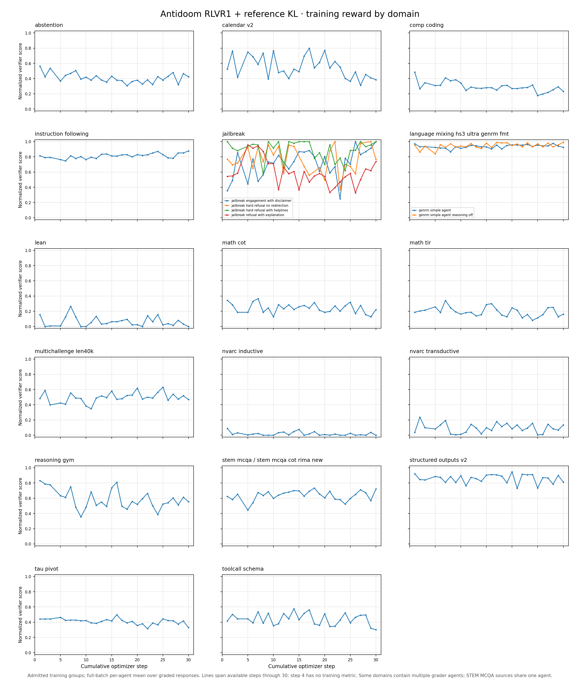

# Snowball broad-domain RLVR: reference/KL training reward by source and verifier

[Download the underlying agent-by-step CSV](data/snowball-rlvr-reference-kl-domain-reward.csv). The figure shows the Antidoom continuation with a frozen reference model and KL-loss coefficient 0.01. It starts from the [public step-12 Antidoom checkpoint](https://huggingface.co/open-athena/Grug-67B-A2B-Antidoom-RLVR1-Step12-2026.10.02). The [public campaign archive](https://huggingface.co/datasets/open-athena/snowball-broad-domain-rlvr-campaign-2026) preserves the run metrics and configs. The [W&B run](https://wandb.ai/nyu-dice-lab/snowball-ultra-rlvr/runs/fpw62eom) and [historical launcher](https://github.com/marin-community/marin/blob/5545baa145/experiments/post_training/configs/glm53_rlvr1_antidoom_reference_kl.yaml) give the training context.

Each point is the trainer's `reward/agent/*/avg_verifier_score`: a normalized 0–1 mean across graded responses in training prompt groups accepted into the policy batch for that agent and optimizer step. The source is the full-batch metric stream. It does not sample retained trajectories selected for errors or loops. An *agent* is the task-specific verifier. Some source domains have multiple verifier agents, drawn separately. The two STEM multiple-choice-question-answering (MCQA) sources share one agent, so that panel is a combined family. The original step-4 training metric was unavailable in the recovered mirror; the resumed attempt begins with step 5.

These are changing training batches, not fixed-prompt holdout scores. The panels share a 0–1 axis for comparison, but varying source sample counts and grader definitions limit cross-domain comparisons. For checkpoint selection, use sealed holdout evaluations; this figure is a diagnostic of the sampled training mix.
