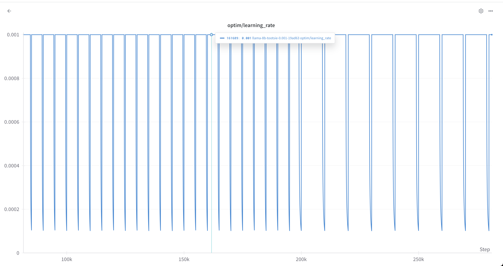
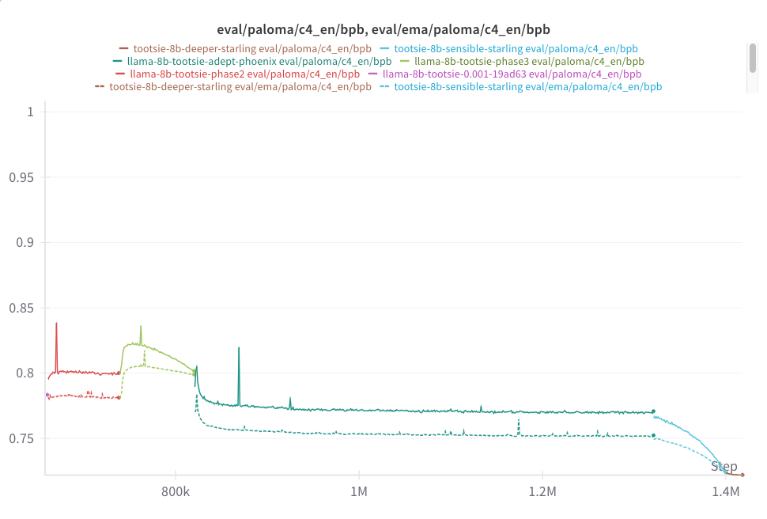

# Tootsie 8B Retrospective

This is a retrospective on the Tootsie 8B run. We include details on the data mix, hyperparameters, and other details. We also include observations during the run and document some of the mistakes we made and lessons learned.

## The Origin of "Tootsie"

A core premise of the Tootsie 8b run was that we didn't fully know what the best recipe was, but rather than let the good be the enemy of the okay, we decided to just start training something with the best information we had.

The name "Tootsie" comes from [Tootsie Rolls, which use a "graining" process](https://en.wikipedia.org/wiki/Tootsie_Roll) whereby a portion of the previous day's batch is folded into the next, seeding the crystallization process or some such. This is admittedly a bit of a tortured metaphor, but the idea was that we would expect to change the data recipe as training progressed. (As it would turn out, dear reader, we would often change more than the data...)

So the idea was that, as new information (data, techniques, etc.) became available, we'd fold it into the training run and just keep chugging.

## Model Basics
### Architecture
We settled on the "Llama architecture" for the usual reasons: it has been shown to work well. No one ever got fired for buying IBM, as they say. We did not tie the lm_head to the word embeddings.

We used Levanter's implementation, which uses JAX's TPU Splash Attention kernel. We used mixed float32/bfloat16 precision, with parameters and optimizer states in float32 and compute in bfloat16 (except for the final softmax over the vocabulary.)

### Tokenizer

In Marin, we also standardized on the Llama 3 tokenizer, after [our experiment](https://github.com/stanford-crfm/marin/issues/524) showing it to be superior to Llama 2 and NeoX in terms of bits-per-byte (bpb).

# Training Phases

Retrospectively, we can partition the 8b run into several different phases:

* *DCLM WSD-S Phase*: In the first phase, we used the "DCLM mix" and [WSD-S](https://arxiv.org/abs/2410.05192)  for about 2.8T tokens. We used 2x TPU v5e-256 coordinated with multislice for this.
* *DCLM EMA Phase*: We were given access to a v4-2048 slice and moved to that. (So fast!) To better utilize the hardware, we increased our batch size 50%. We also switched from WSD-S to WSD, using the exponential moving averaging (EMA) of weights for monitoring evaluation performance. (XXX cite whoever) We kept the learning rate high until 3.7T tokens.
* *First Cooldown: Jellyfish*  It was time to cooldown, as we were starting to run low on DCLM. Following recent work on midtraining (XXX), we decided to fold in higher quality data. Ultimately, after a series of ablations (XXX link) we landed on roughly the Dolmino mixture, with a few tweaks. The checkpoint at the end of this cooldown we call "monumental-jellyfish", and it had some fairly solid results. XXX
* *Reheated: Phoenix* We had more time for training, so we decided to keep going. We rapidly rewarmed the model and transitioned our mixture to [Nemotron-CC ](XXX cite)XXX(plus some code and math). 
*  *Second Cooldown: Starling*: Now we were running low on time, so we started another cooldown. We followed a similar process to the first cooldown, but added a few new datasets that we had created and also some that had dropped since our previous attempt. We call the result of this cooldown "starling."

We emphasize that these phases are retrospective: we didn't know exactly what changes we would make.

Separately, there were other trial [LLama 3 style](XXX) data ablations that helped decide our cooldown mix, as well as attempts at "deeper cooldowns." We detail these below.

## Phase 1: DCLM WSD-S Phase

The specification for the first phase is available on [Github here](https://github.com/stanford-crfm/marin/blob/852c53f9741b233549daf9f1649fe88c9c5a170c/experiments/tootsie/exp600_tootsie.py#L51-L78)

### Hardware

We started with a 2x TPU v5e-256 slice, which was the largest TPU slice available to us at the time. We used multislice to coordinate the two slices. 

### Data Mix

At beginning, we decided to use the DCLM 7b mix (including XXX link DCLM baseline, starcoder and proofpile) in ratios roughly proportional to token count. (DCLM 7b was, at the time, the best open source model.)

Specifically this meant:
* DCLM Baseline: 92.6%
* Starcoder: 6.1%
* Proofpile: 1.3%

We planned on adding new datasets as we (and others!) developed them: this is the origin of the name Tootsie. For evaluation, we tracked a large subset of Paloma (with a particular focus on the c4_en subset) during training.

### WSD-S

Based on the success of [our work understanding cyclic warmup-stable-decay schedules (WSD-S)](https://arxiv.org/abs/2410.05192), we decided to use a WSD-S learning rate schedule. WSD-S is essentially cyclic warmup-(stable-decay)`*`, where you do a warmup, then a long plateau at peak learning rate, and then a decay phase, repeating the stable and decay phase. The decay phases allow you to measure how the model is performing. 

WSD-S has a number of appealing properties:

* You can run at a very high learning rate for as long as you want, without needing to pre-register cooldowns.
* We could periodically do a rapid cooldown to get a sense of model performance without (completely) "wasting" FLOPs.
* WSD-S was shown to converge just as well as Cosine at any given point, meaning we could potentially use the checkpoints as fodder for scaling law analysis.

We ended up moving away from WSD-S midway through the run, for reasons to be detailed later. For the first 200K steps, we did a decay cycle every 10k steps for 1k steps. However, I got worried that we weren't seeing significant improvement in evaluation losses. We then moved to a decay cycle every 20k steps for 2k steps, which led to a significant improvement in some eval losses, but not all. (See below.)

### Other hyperparameters

We used a sequence length of 4096 and a batch size of $`1024 \cdot 4096 \approx 4M`$ tokens. 

The DCLM paper also showed that you could run fairly "hot", and we followed suit. At 1e-3, our LR was roughly 3x higher than Olmo 2 7b's 3e-4, and, with WSD-S, we were running at peak LR for 90% of steps. We used a weight decay of 0.05. These are roughly consistent with Table 12 of the DCLM paper. They recommend 2e-3, but we had divergence at that rate.

We opted to not use z-loss because we had other had no problems with stability, even with the high LR. (However, watch this space.) In retrospect, perhaps this would have allowed us to run at 2e-3.

### Notes

#### Stability

Training was fairly stable with very few spikes. 

#### WSD Cycle Change
At step 200k, we had a hypothesis that longer cooldowns would show more progress. We had been doing a decay every 10k steps for 1k steps, and we switched to a decay every 20k steps for 2k steps. That is, we still spent 10% of our steps in a decay phase, but each decay phase was twice as long, giving the model more time to consolidate its progress. 

Visually, the schedule now looked like this:

As expected, this led to a drop in eval losses that most looked like our training data. In the below, the orange line is eval loss (Paloma's c4en), while the blue line is training loss. There is a noticeable drop in both the eval loss and the training loss during the decay phase.

Interestingly, not all eval losses dropped. In fact, for some domains, the eval loss increased. We saw decreases in mc4, c4en, m2d2 wikipedia, m2d2 s2orc, and refined web, but marked increases in 100_subreddits, twitterAAE_HELM_fixed, manosphere, 4chan, etc. Interestingly, after this initial increase, almost all domains started to decrease again.  Subsequent analysis revealed that this was due to structural differences in preprocessing between the domains: some Paloma domains had texts that obligatorily ended with a space character (which we did not strip), which was not how our training data was formatted. The deeper cooldown allowed the model to dislike these final spaces more. We did a more thorough analysis [here](https://github.com/stanford-crfm/marin/issues/826#issuecomment-2696496271).

## Phase 2: DCLM EMA Phase

At around 2.7e12 tokens, we were given access to a v4-2048 and immediately moved to that.

The specification for the second phase of training is [here](https://github.com/stanford-crfm/marin/blob/852c53f9741b233549daf9f1649fe88c9c5a170c/experiments/tootsie/exp600_tootsie.py#L81-L116).

### Adjusted Hyperparameters

To better utilize the hardware, we increased our batch size by 3x, to 12Mi tokens at around 2.77e12 tokens. Following (XXX cite paper on increasing LR with bs) increased the learning rate to 1.7e-3, which is approximately the old learning rate multiplied by $`\sqrt{3}`$ (the square root of the batch size increase).  XXX double check this

We also switched from WSD-S to WSD, using the exponential moving averaging (EMA) of weights for monitoring evaluation performance (XXX cite whoever). We used a $`\beta`$ of 0.995. Initially, I inadvertently got the direction of the EMA wrong, so early evals were not substantially different from the "hot" model. Oh well.

We did not reset the optimizer state or do a rewarmup.

### Notes

#### Stability

Despite the changes, training was still fairly stable with very few spikes.

#### The EMA Gap

One of the most interesting things we saw during this phase was the "EMA gap." The EMA gap is the difference between the eval loss of the EMA model and the eval loss of the hot model. As expected, the EMA loss was better. Surprisingly (to me), the gap was fairly stable over time, changing only with changes to the learning rate (or different datasets). For c4en, with the hot learning rate, the gap was consistently around 0.015 bits-per-byte (bpb). A stable gap of 0.017 was observed in the subsequent Phoenix phase. The EMA gap would of course shrink as the learning rate was cooled down (since, in the limit, the model freezes).

This was not to say there was no deviation in the gap, but the fact that it did not seem to increase or decrease with time was surprising. 

 

## Phase 3: First Cooldown: Jellyfish

At around 3.7T tokens, we needed to make a change: we were running low on DCLM. We decided it was time to try a cooldown.

###  Data Mix

Following recent work on midtraining (XXX), we decided to fold in higher quality data. Ultimately, after a series of ablations (XXX link) we landed on roughly the [Dolmino mixture](XXX link), with some changes.

We used 70% high quality "web" (Dolmino's DCLM HQ and StarCoder), and 30% a modified Dolmino + FineMath. 
Specifically, we included:

* Dolma DCLM HQ: 67.8%
- Dolma peS2o: 10.8%
- FineMath 3+: 6.3%
- Dolma Arxiv: 5.2%
- Dolma StackExchange: 3.2%
* Starcoder: 2.2%
* Dolma Algebraic Stack: 2.1%
- Dolma Open Web Math: 0.9%
- Dolma Megawika: 0.8%
- Dolma Wikipedia: 0.7%

The main deviations from the Dolmino mixture were:

* We included datasets that Olmo 2 used in its phase 1 (e.g. wikipedia). XXX link
* We did not include FLAN. One of us had had less than stellar experiences with it. XXX more details/links
* We added FineMath 3+ (xxx link).

XXX link to ablations

### Learning rate schedule

We decayed the learning rate from 1.7e-3 to 1.7e-4 over 1e12 tokens (79500 steps at 12Mi tokens). We used a linear decay schedule.

### Results

The checkpoint at the end of this cooldown we call "monumental-jellyfish", and it had some fairly solid results. XXX

XXX

### Notes

#### C4 EN Perplexity

Interestingly, this mix led to a large increase in Paloma c4en loss:

We haven't investigated this yet, but our hypothesis is that there are more structural differences  in the formatting between DCLM HQ and c4en than there were between DCLM Baseline and c4en. 

It is worth noting that we did not observe this increase in our largely similar final cooldown (which used Nemotron).

## Interlude: "Dessert" and Cooldown v2

XXX

## Phase 4: Reheated: Phoenix

The specification for this phase is available [here](https://github.com/stanford-crfm/marin/blob/852c53f9741b233549daf9f1649fe88c9c5a170c/experiments/tootsie/exp600_tootsie.py#L465-L522).

After the cooldown, at around 4.7T tokens, we had more time for training, so we decided to keep going. We rapidly rewarmed the model and transitioned our mixture to [Nemotron-CC ](XXX cite)XXX(plus some code and math).

### Data

We transitioned the data from our phase 1 and 2 mixture (DCLM+Starcoder+Proofpile) to a new mixture that was Nemotron and Starcoder.

The target mixture was Nemotron CC (with each subset weighted proportionally to token count) and Starcoder, also weighted by token count. As a transition, we weighted all components (DCLM, Starcoder, Proofpile, and Nemotron) proportional to token count, which we used for 2000 steps (about 25.2e9 tokens), after which we switched to the target mixture.

### Learning rate schedule

We rewarmed the learning rate linearly from 1.7e-4 to 1.7e-3 over 2000 steps (about 25.2e9 tokens) after which we held the learning rate steady.

XXX

## Phase 5: Second Cooldown: Starling

XXX

# Main Takeaways

* **Tootsie means never having to say you're sorry.** We made several dramatic changes to the data mix, optimizer, and other hyperparameters during the run. We cooled down, rewarmed up, changed the mixture, etc. without any major issues.
* **Tootsie means having to say you're sorry kind of a lot.** We made many, many mistakes during the run. Some of the changes were actually unintentional, or were fixes to initial mistakes (e.g. the rotary embedding hyperparameters). Nevertheless, the end result was a model that performed well on a wide variety of tasks.
* **Z-loss isn't just for avoiding explosions.** While we didn't need z-loss to stabilize the training, we found it actually pretty necessary during very deep cooldowns.

XXX

