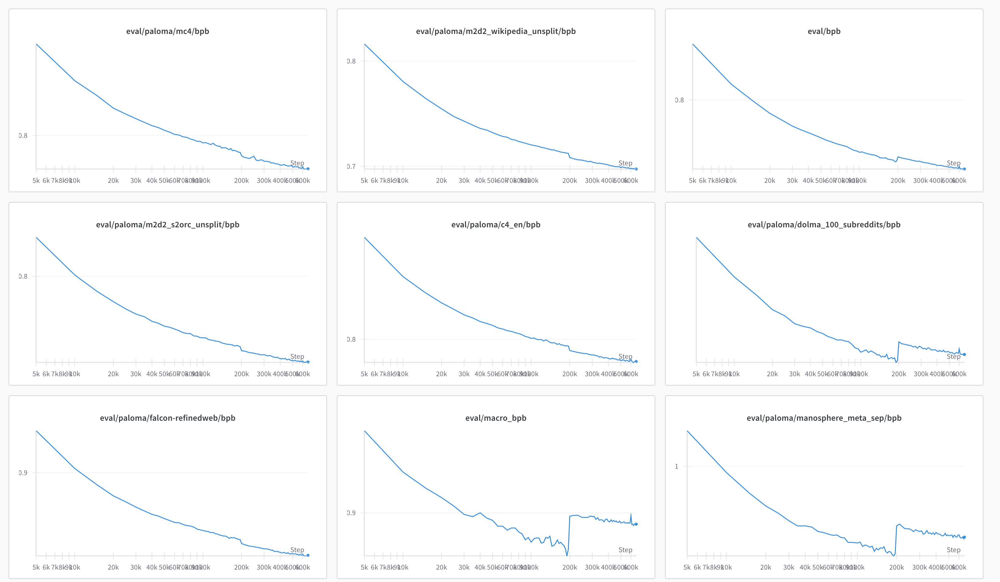

# Tootsie 8B Retrospective

This is a retrospective on our first generation Marin 8B run, codenamed "Tootsie."
We include details on the data mix, hyperparameters, and other details. We also include observations during the run and
document some of the mistakes we made and lessons learned.

This document was not created during the run, but rather after the fact. Some details may be missing or incorrect,
but we have tried to be as accurate as possible.

In addition, the [actual code](https://github.com/marin-community/marin/blob/852c53f9741b233549daf9f1649fe88c9c5a170c/experiments/tootsie/exp600_tootsie.py)
for the run should be treated as more authoritative than this document. See also the [main issue on GitHub](https://github.com/marin-community/marin/issues/600)
or the [WandB report](https://wandb.ai/stanford-mercury/marin/reports/Tootsie-8B---VmlldzoxMTY3MzU3OA)

## The Origin of "Tootsie"

A core premise of the Tootsie 8B run was that we didn't fully know what the best recipe was, so we decided to just start
training something with the best information we had.
As new information (data, techniques, etc.) became available, we'd fold it into the training run and just keep chugging.

The name "Tootsie" comes from [Tootsie Rolls, which use a "graining" process](https://en.wikipedia.org/wiki/Tootsie_Roll) whereby a portion of the previous
day's batch is folded into the next, seeding the crystallization process or some such. This is admittedly a bit of a
tortured metaphor, but the idea was that we would expect to change the data recipe as training progressed.
(As it would turn out, dear reader, we would often change more than the data...)

## Model Basics

### Model Size

We decided to build an ~7-8B class model mostly out of pragmatism: we initially only had reserved capacity
to train a model of that size for long enough.

### Architecture

We settled on the "Llama architecture" for the usual reasons: it has been shown to work well, no one ever got fired
for buying IBM, etc.

We used Levanter's implementation of the Llama architecture.
We trained with a sequence length of 4096 tokens per sample.
We used JAX's TPU Splash Attention kernel.

We used mixed float32/bfloat16 precision, with parameters and optimizer states in float32 and compute in bfloat16
(except for the final softmax over the vocabulary.)
We used the AdamW optimizer.

### Tokenizer

In Marin, we also standardized on the Llama 3 tokenizer, after [an experiment](https://github.com/marin-community/marin/issues/524) showing it to be superior
to both Llama 2 and NeoX in terms of bits-per-byte (bpb).

### Batch Schedule

We used a varying batch schedule, with between 1024 * 4096 = 4Mi tokens, 3072 * 4096 = 12 Mi tokens and 4096 * 4096 = 16 Mi tokens.
(As with most things Tootsie, we did not initially plan for this schedule.)
(Note, we use `Mi` to mean Mebi-, not mega-.)

### Checkpointing Policy

We saved permanent full checkpoints every 20,000 steps (which, due to the varying batch schedule, could be a varying number of tokens.)
To save on egress bandwidth charges, we have not made these available. However, if they are of interest we should be
able to share them.

("Temporary" checkpoints were saved much more frequently.)

# Training Phases

Retrospectively, we can partition the 8b run into several different phases. We have given them animal names as monikers.

* *DCLM WSD-S Phase*: In the first phase, we used the "DCLM mix" and [WSD-S](https://arxiv.org/abs/2410.05192)  for about 2.8T tokens. We used 2x TPU v5e-256 coordinated with multislice for this.
* *DCLM EMA Phase*: We were given access to a v4-2048 slice and moved to that. (So fast!) To better utilize the hardware, we increased our batch size 50%. We also switched from WSD-S to WSD, using the exponential moving averaging (EMA) of weights for monitoring evaluation performance. (XXX cite whoever) We kept the learning rate high until 3.7T tokens.
* *First Cooldown: Jellyfish*  It was time to cooldown, as we were starting to run low on DCLM. Following recent work on midtraining (XXX), we decided to fold in higher quality data. Ultimately, after a series of ablations (XXX link) we landed on roughly the Dolmino mixture, with a few tweaks. The checkpoint at the end of this cooldown we call "monumental-jellyfish", and it had some fairly solid results. XXX
* *Reheated: Phoenix* We had more time for training, so we decided to keep going. We rapidly rewarmed the model and transitioned our mixture to [Nemotron-CC ](XXX cite)XXX(plus some code and math).
* *Second Cooldown: Starling*: Now we were running low on time, so we started another cooldown. We followed a similar process to the first cooldown, but added a few new datasets that we had created and also some that had dropped since our previous attempt. We call the result of this cooldown "starling."

We emphasize that these phases are retrospective: we didn't know exactly what changes we would make.

Moreover, while there is a single straight-line set of phases that produced the final 8b artifact, there were a number
of short branches that did not make it into the final run. Many of these were by design: there were other trial
[LLama 3 style](XXX) data ablations that helped decide our cooldown mix, as well as attempts at "deeper cooldowns."
We detail these [in a separate report](XXX), though provide a summary here.
We also ran some experiments investigating issues with "SFT-ability,"
documented [here](XXX).

## Phase 1: DCLM WSD-S Phase

In the first phase, we trained from scratch using the best publicly available dataset at the time:
[DCLM Baseline](https://huggingface.co/datasets/mlfoundations/dclm-baseline-1.0).
We decided to use [their best mixture](https://arxiv.org/abs/2406.11794): DCLM Baseline, Starcoder, and Proofpile, though we did not use a curriculum.

### Hardware

We started with a reserved 2x TPU v5e-256 slice, which was the largest TPU slice available to us at the time. We used multislice to coordinate the two slices.

### Data Mix

At the beginning, we decided to use the DCLM 7b mix (including XXX link DCLM baseline, starcoder and proofpile) in
ratios roughly proportional to token count. (DCLM 7B was, at the time, the best open source model.)

Specifically this meant:
* DCLM Baseline: 92.6%
* Starcoder: 6.1%
* Proofpile: 1.3%

We planned on adding new datasets as we (and others!) developed them: this is the origin of the name Tootsie.
For evaluation, we initially tracked a large subset of Paloma (with a particular focus on the `c4_en` subset) during training.

### WSD-S

Based on the success of [our work understanding cyclic warmup-stable-decay schedules (WSD-S)](https://arxiv.org/abs/2410.05192), we decided to use a
WSD-S learning rate schedule. WSD-S is essentially cyclic warmup-(stable-decay)`*`, where you do a warmup, then a long
plateau at peak learning rate, and then a decay phase, repeating the stable and decay phase. The decay phases allow you to measure how the model is performing.

WSD-S has a number of appealing properties:

* You can run at a very high learning rate for as long as you want, without needing to pre-register cooldowns.
* We could periodically do a rapid cooldown to get a sense of model performance without (completely) "wasting" FLOPs.
* WSD-S was shown to converge just as well as Cosine at any given point, meaning we could potentially use the checkpoints as fodder for scaling law analysis.

We ended up moving away from WSD-S midway through the run, for reasons to be detailed later.
For the first 200K steps, we did a decay cycle every 10k steps for 1k steps.
However, I (@dlwh) got worried that we weren't seeing significant improvement in evaluation losses.
We then moved to a decay cycle every 20k steps for 2k steps, which led to a significant improvement in some eval losses,
but not all. (See below.)

### Other hyperparameters

We used a sequence length of 4096 and a batch size of 1024 * 4096 = 4Mi tokens.

The DCLM paper also showed that you could run fairly "hot", and we followed their example.
At 1e-3, our LR was roughly 3x higher than Olmo 2 7b's 3e-4, and, with WSD-S, we were running at peak LR for 90% of steps.
We used a weight decay of 0.05. These are roughly consistent with Table 12 of the [DCLM paper](https://arxiv.org/abs/2406.11794).
(They recommend 2e-3, but we encountered instability at that rate.)

We initially opted to not use Z-loss because we didn't have problems with LR=1e-3. In retrospect, we should have used it
and have since made it the default for future Marin runs.

### Specification

The specification for the first phase is available on [Github here](https://github.com/marin-community/marin/blob/852c53f9741b233549daf9f1649fe88c9c5a170c/experiments/tootsie/exp600_tootsie.py#L51-L78).

### Notes

#### Stability

Training was fairly stable with very few spikes.

#### WSD Cycle Change
At step 200k, we had a hypothesis that longer cooldowns would show more progress in terms of eval losses.
We had been doing a decay every 10k steps for 1k steps, and we switched to a decay every 20k steps for 2k steps.
That is, we still spent 10% of our steps in a decay phase, but each decay phase was twice as long, giving the model more
time to consolidate its progress.

Visually, the schedule now looked like this:

As expected, this led to a drop in eval losses that most looked like our training data. In the below, the orange line is
eval loss (Paloma's c4en), while the blue line is training loss.
There is a noticeable drop in both the eval loss and the training loss during the decay phase.

Interestingly, not all eval losses dropped.
In fact, for some domains, the eval loss increased.
We saw decreases in `mc4`, `c4en`, `m2d2 wikipedia`, `m2d2 s2orc`, and `refined web`, but marked increases in `100_subreddits`, `twitterAAE_HELM_fixed`, `manosphere`, `4chan`, among a fwe others.
Interestingly, after this initial increase, almost all domains started to decrease again.
Subsequent analysis revealed that this was due to structural differences in preprocessing between the domains: some Paloma domains had texts that obligatorily ended with a space character (which we did not strip), which was not how our training data was formatted. The deeper cooldown allowed the model to dislike these final spaces more. We did a more thorough analysis [here](https://github.com/marin-community/marin/issues/826#issuecomment-2696496271).

## Phase 2: DCLM EMA Phase

At around 2.7e12 tokens, we were given access to a v4-2048 reservation and immediately moved to that.
All subsequent phases were run on that.

### Adjusted Hyperparameters

To better utilize the hardware, we increased our batch size by 3x, to 12Mi tokens at around 2.77e12 tokens.
Following [this blog post by Sadhika Malladi](https://www.cs.princeton.edu/~smalladi/blog/2024/01/22/SDEs-ScalingRules/), we increased the learning rate to 1.7e-3,
which is approximately the old learning rate multiplied by $`\sqrt{3}`$ (the square root of the batch size increase).

We also switched from WSD-S to WSD, using the exponential moving averaging (EMA) of weights for monitoring evaluation performance (XXX cite whoever). We used a $`\beta`$ of 0.995.
Initially, I inadvertently got the direction of the EMA wrong, so early evals were not substantially different from the "hot" model. Oh well.

We did not reset the optimizer state or do a rewarmup in this or any transition.

To my continued embarrassment, I also realized that we were using Llama 2's settings for Rotary Embeddings rather than Llama 3's settings. We changed to Llama3-style at this point.

### Specification

The specification for the second phase of training is [here](https://github.com/marin-community/marin/blob/852c53f9741b233549daf9f1649fe88c9c5a170c/experiments/tootsie/exp600_tootsie.py#L81-L116).

### Notes

#### Stability

Despite the changes, training was still fairly stable with very few spikes. We saw a brief spike near the beginning
which we attribute to the change in rotary embeddings, though we did not investigate this further.

#### The EMA Gap

One of the most interesting things we saw during this phase was what we call the "EMA gap." The EMA gap is the difference between the eval loss of the EMA model and the eval loss of the hot model. As expected, the EMA loss was better. Surprisingly, the gap was fairly stable over time, changing only with changes to the learning rate (or different datasets). For c4en, with the hot learning rate, the gap was consistently around 0.015 bits-per-byte (bpb). A stable gap of 0.017 was observed in the subsequent Phoenix phase. The EMA gap would of course shrink as the learning rate was cooled down (since, in the limit, the model freezes).

This was not to say there was no deviation in the gap, but the fact that it did not seem to increase or decrease with time was surprising.

## Phase 3: First Cooldown: Jellyfish

At around 3.7T tokens, we were running low on DCLM tokens, which meant we needed to change something. We decided to try a cooldown.

### Data Mix

Following recent work on midtraining (XXX), we decided to fold in higher quality data. Ultimately, after a series of ablations (XXX link) we landed on roughly the [Dolmino mixture](https://arxiv.org/abs/2501.00656), with some changes.

We used 70% high quality "web" (i.e. Dolmino's DCLM HQ and StarCoder), and 30% a modified Dolmino + FineMath.
Specifically, we included:

| Dataset | Percentage |
|---------|------------|
| Dolma DCLM HQ | 67.8% |
| Dolma peS2o | 10.8% |
| FineMath 3+ | 6.3% |
| Dolma Arxiv | 5.2% |
| Dolma StackExchange | 3.2% |
| Starcoder | 2.2% |
| Dolma Algebraic Stack | 2.1% |
| Dolma Open Web Math | 0.9% |
| Dolma Megawika | 0.8% |
| Dolma Wikipedia | 0.7% |

The main deviations from the Dolmino mixture were:

* We included datasets that Olmo 2 used in its phase 1 (e.g. wikipedia) that we did not. XXX link
* We did not include FLAN. One of us had had less than stellar experiences with it. XXX more details/links
* We added FineMath 3+ (xxx link).

XXX link to ablations

### Learning rate schedule

We decayed the learning rate from 1.7e-3 to 1.7e-4 over 1e12 tokens (79500 steps at 12Mi tokens/step). We used a linear decay schedule.

### Results

Results for this model are pretty good. XXX

GSM8K 0.5094768764215315 -> 0.67854
MATH 0.1846 -> 0.3526
HumanEval 0.24390243902439024 -> 0.5731707317
IFEval 0.09242144177449169 -> 0.4953789279
BBH 0.5702657041929043 -> 0.003532483489479343

TODO: MMLU

### Notes

#### C4 EN Perplexity

Interestingly, this mix led to a large increase in Paloma c4en loss:

We haven't investigated this, but our hypothesis is that there are more structural differences in the formatting between DCLM HQ and c4en than there were between DCLM Baseline and c4en.

It is worth noting that we did not observe this increase in our largely similar final cooldown (which used Nemotron CC instead of Dolmino's DCLM HQ).

## Phase 4: Reheated: Phoenix

The specification for this phase is available [here](https://github.com/marin-community/marin/blob/852c53f9741b233549daf9f1649fe88c9c5a170c/experiments/tootsie/exp600_tootsie.py#L465-L522).

After the cooldown, at around 4.7T tokens, we had more time for training, so we decided to keep going. We rapidly rewarmed the model and transitioned our mixture to [Nemotron-CC ](https://arxiv.org/abs/2412.02595)XXX(plus some code. get links).

### Data

Because we were running out of DCLM, we transitioned the data from our phase 1 and 2 mixture (DCLM+Starcoder+ProofPile) to a new mixture that was Nemotron and Starcoder.
(We didn't worry too much about epoching StarCoder.)

The target mixture was Nemotron-CC (with each subset weighted approximately proportionally to token count) and Starcoder,
also weighted by token count. As a transition, we weighted all components
(DCLM, Starcoder, Proofpile, and Nemotron's subcomponents) approximately proportional to token count, which we used for 2000 steps (about 25.2e9 tokens), after which we switched to the target mixture.

### Learning Rate Schedule

We rewarmed the learning rate linearly from 1.7e-4 to 1.7e-3 over those same 2000 steps after which we
held the learning rate fixed.

### Notes

The most interesting thing about this phase was that the transition went very smoothly.

XXX figure

Also of small interest is that the steady state c4en loss for Phoenix was considerably lower
than DCLM. This need not mean anything other than structural similarities in the preprocessing.
We have not investigated this further.

XXX more?

## Interlude: Deeper Cooldowns and "Dessert" Runs

While our "mainline" run continued in the Phoenix phase, we ran a number of short ablations
consisting of "deeper cooldowns" and what we termed "dessert" runs.
Deeper cooldowns were just continued cooldowns to an even lower LR, starting from the end
of the last cooldown. Dessert coasted at the same already low LR, with the goal of patching a few
runs added Dolmino FLAN (excuse the pun) because some ablations (XXX) indicated
that FLAN might in fact be useful.

Our takeaways from these runs were:

* XXX
* Z-loss is important to avoid loss increases at low LRs.

## Phase 5: Second Cooldown: Starling

At around 11.1e12 tokens, we decided to start another cooldown. Building on lessons from our previous cooldowns, we made the following changes:

* We deepened the cooldown to 1.7e-5, rather than 1.7e-4.
* We added a small z-loss penalty of 1e-4.
* We increased the batch size to 16 Mi tokens rather than 12Mi.

### Data

We switched to a mix that was 70% Nemotron-CC and 30% high-quality sources, including some new sources we created.
Nemotron-CC's components were weighted according to compressed bytes (which is roughly proportional to token count).
Within the high quality datasets, we weighted them roughly proportional to token counts multiplied by an oversampling
ratio we set more or less arbitrarily.

We included the following datasets:

| Dataset | Proportion | Oversampling |
|---------|------------|--------------|
| NemoTron CC Medium | 22.1% | 1x |
| NemoTron CC HQ Synth | 17.8% | 1x |
| NemoTron CC Medium Low | 10.1% | 1x |
| NemoTron CC HQ Actual | 6.0% | 1x |
| NemoTron CC Medium High | 5.4% | 1x |
| NemoTron CC Low Actual | 4.6% | 1x |
| NemoTron CC Low Synth | 4.1% | 1x |
| Marin Arxiv Markdownified | 5.2% | 5x |
| Dolmino PES2O | 5.2% | 5x |
| StarcoderData | 4.5% | 1x |
| Proofpile 2 | 4.5% | 1x |
| Finemath-3-Plus | 3.0% | 5x |
| Dolmino FLAN | 3.0% | 10x |
| Dolmino StackExchange | 1.5% | 5x |
| Marin StackExchange Markdownified | 1.5% | 5x |
| Dolmino Math | 0.8% | 10x |
| Marin Wikipedia Markdownified | 0.3% | 5x |
| Dolmino Wiki | 0.3% | 5x |
| Marin Datashop Science QA | 0.1% | 5x |

Here "Dolmino Math" refers to most of the math-y components of DCLM.

XXX Links

- Dolmino Code Search Net (with OWM Filter)
- Dolmino GSM8K XXX
- Dolmino metamath owmfilter
- Dolmino MathCoder2 SynthMath
- TinyGSM MIND
- Dolmino Tulu Math

### Learning Rate Schedule and Other Hyperparameters

We linearly cooled down the learning rate schedule from 1.7e-3 to 1.7e-5 (sic) over approximately 1.34e12 tokens
(80,000 steps).

Based on our findings in the ["racooon" and "spoonbill"](XXX) deep cooldowns (where we observed steady loss increases at low
learning rate), we imposed a z-loss penalty of 1e-4 on the final logits.

We also increased our batch size to 16Mi tokens. This change was to further reduce gradient variance and better utilize the hardware (i.e. slightly more MFU).

### Bonus: Starling Dessert

We also ran a dessert run from 11.1e12 to 12.7e12 tokens. This was a simple coast, with the learning rate fixed at 1.7e-5.

### Notes:

#### C4 EN Perplexity

XXX embed

Interestingly, c4en perplexity decreased a lot during the cooldown, when in the previous cooldown it had increased. Again, we attribute this to structural differences in the preprocessing of Dolmino HQ and Nemotron CC.

### Results

XXX

GSM8K 0.5094768764215315 -> 0.67854
MATH 0.1846 -> 0.3526
HumanEval 0.24390243902439024 -> 0.5731707317
IFEval 0.09242144177449169 -> 0.4953789279
BBH 0.5702657041929043 -> 0.003532483489479343

# Main Takeaways

* **Tootsie means never having to say you're sorry.** We made several dramatic changes to the data mix, optimizer, and other hyperparameters during the run. We cooled down, rewarmed up, changed the mixture, etc. without any major issues.
* **Z-loss isn't just for avoiding explosions.** While we didn't need z-loss to stabilize the training, we found it actually pretty necessary during very deep cooldowns.
* **Format diversity is useful**:  While not necessarily showing up in non-loss evals, the high sensitivity of c4en perplexity to the data mix suggests that format diversity is useful. We will pursue this further in future runs.
* **Tootsie means having to say you're sorry kind of a lot.** We made many, many mistakes during the run. Some of the changes were actually unintentional, or were fixes to initial mistakes (e.g. the rotary embedding hyperparameters). Nevertheless, the end result was a model that performed well on a wide variety of tasks.

XXX

# Future Work

Future work will focus on:

* **Bigger models.** We have a 32B model that is performing quite well at ~750B tokens.
* XXX
