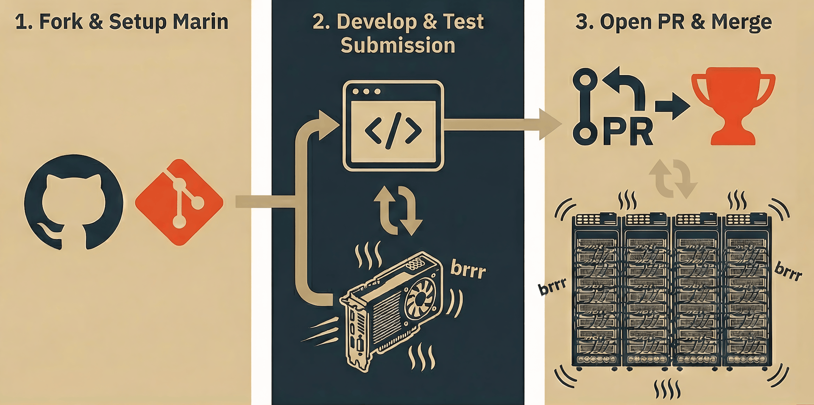

# Submitting to the Marin Speedrun

The Marin Speedrun, inspired by the [nanogpt Speedrun](https://github.com/KellerJordan/modded-nanogpt), is a benchmark aimed at improving the compute efficiency of language model training. This tutorial assumes you are familiar with the core premise of the Marin Speedrun—if not, check out [the overview of Marin Speedrun](../explanations/speedrun.md) for a more detailed explanation. Let's walk through how to submit your first speedrun to the leaderboard.

{width=50%}

## Quickstart (GPU environment with CUDA 12)

**1. Setup**

You can get started by just running:

```bash
curl -LsSf https://raw.githubusercontent.com/marin-community/marin/refs/heads/main/scripts/speedrun/onboarding_setup.sh | bash
```

Note: this clones Marin for local development. When you want to contribute to Marin, you will need to convert to a fork and submit a PR (see Step 3 below). If you have GitHub CLI installed and authenticated, a fork will be created for you.

<details><summary>Manual Setup Steps (alternative)</summary>

Install uv if you haven't already:

```bash
curl -LsSf https://astral.sh/uv/install.sh | sh
```

Inside your fork of Marin:

```bash
uv venv --python 3.11
. .venv/bin/activate
uv sync --all-packages --extra=cuda12
```

Add your HuggingFace and WandB tokens if you haven't already:

```bash
export WANDB_API_KEY='...' # or `uvx wandb login`
export HF_TOKEN='...' # or `uvx hf auth login`
```

Create a subdirectory under <code>experiments/speedrun</code> and copy a starter file there (see <a href="#faq">FAQ</a> below).

</details>

**2. Develop**

You can now work on your speedrun submission! The setup script has prepared the ["hackable transformer"](https://github.com/marin-community/marin/tree/main/experiments/hackable_transformer_starter_template.py) starter file for you. This is a self-contained file that contains the implementation of a transformer-based language model, and configurations for training it at four different sizes (130M, 300M, 520M, 1.2B parameters). Sections that require your attention are marked with TODOs.

You can check your code and your estimated compute cost using a dry run:

```bash
python -m experiments.speedrun.${NAME_OF_YOUR_SUBMISSION}.main --dry_run true --prefix local_store
```

which will show the output of `print_run_info()` without starting training.

<details><summary>Example print_run_info() output (1x A100-80G, training 130m configuration)</summary>

```
----- START OF PRINT RUN INFO -----
Speedrun Configuration:
{
  "author":
  {
    "name": "__SUBMISSION_AUTHOR_NAME__",
    "affiliation": "__SUBMISSION_AUTHOR_AFFILIATION__",
    "url": "__SUBMISSION_AUTHOR_URL__"
  },
  "description": "__SUBMISSION_DESCRIPTION__ (130m)",
  "model_config":
  {
    "cross_entropy_block_size": 4096,
    "seq_len": 4096,
    "hidden_dim": 512,
    "intermediate_dim": 1792,
    "num_layers": 6,
    "num_heads": 8,
    "num_kv_heads": 8,
    "head_dim": null,
    "activation_function": "silu",
    "use_bias": false,
    "use_layer_norm_weight": true,
    "layer_norm_epsilon": 0.00001,
    "tie_word_embeddings": false,
    "input_embedding_norm": false,
    "use_attention_sink": false,
    "upcast_attn": false,
    "attn_backend": "JAX_FLASH",
    "flash_attention_block_size": null,
    "rope":
    {
      "theta": 10000,
      "factor": 1.0
    },
    "qk_norm": null,
    "gradient_checkpointing": true,
    "initializer_range": 0.02,
    "reference_checkpoint": "NousResearch/Llama-2-7b-hf",
    "tokenizer": null
  },
  "train_config":
  {
    "train_batch_size": 128,
    "num_train_steps": 5880,
    "learning_rate": 0.032,
    "data_seed": null,
    "weight_decay": null,
    "beta1": null,
    "beta2": null,
    "epsilon": null,
    "max_grad_norm": null,
    "warmup": null,
    "decay": null,
    "rewarmup": null,
    "lr_schedule": null,
    "min_lr_ratio": null,
    "cycle_length": null,
    "z_loss_weight": null,
    "ema_beta": null,
    "skip_bad_steps": false,
    "steps_per_eval": null,
    "steps_per_export": 10000,
    "steps_per_task_eval": null,
    "steps_per_hf_export": -1,
    "per_device_eval_parallelism": null,
    "max_eval_batches": null,
    "initialize_from_checkpoint_path": null,
    "initialize_from_hf": null,
    "reset_data_loader_on_init": true,
    "allow_partial_checkpoint": false,
    "int8": false,
    "optimizer_config":
    {
      "learning_rate": 0.032,
      "weight_decay": 0.1,
      "min_lr_ratio": 0,
      "warmup": 0,
      "decay": 0.8,
      "rewarmup": 0.0,
      "weight_decay_modules": null,
      "default_weight_decay_mask": null,
      "lr": 0.02,
      "adam_lr": 0.0064,
      "momentum": 0.95,
      "nesterov": true,
      "backend_steps": 5,
      "adam_weight_decay": null,
      "beta1": 0.8,
      "beta2": 0.98,
      "epsilon": 1E-15,
      "muon_epsilon": 0.00001,
      "max_grad_norm": 1,
      "use_kimi_scaling": false
    },
    "watch":
    {
      "watch_targets":
      [
        "grads",
        "params"
      ],
      "include_norms": true,
      "include_per_parameter_norms": true,
      "include_histograms": false,
      "split_scan_layers": true,
      "interval": 10
    },
    "profiler": false,
    "profiler_start_step": 5,
    "profiler_num_steps": 100
  },
  "tokenized_dataset": "ExecutorStep(name='tokenized/subcache/fineweb-edu-10B', fn=<function _actually_download_pretokenized_cache at 0x7c3779c26520>, config=PretokenizedCacheDownloadConfig(cache_path=OutputName(name=None), tokenizer=VersionedValue(value='marin-community/marin-tokenizer'), hf_repo_id=VersionedValue(value='marin-community/fineweb-edu-pretokenized-10B'), hf_revision=VersionedValue(value=None), hf_repo_type_prefix='datasets', hf_token=None, format=TextLmDatasetFormat(text_key='text'), cache_options=None, tags=[]), description=None, override_output_path=None, pip_dependency_groups=None)",
  "resources":
  {
    "gpu_count": 1,
    "accelerator_type": "A100-80G",
    "device_flops_override": null
  }
}
The rough estimated compute (calculated as (total model FLOPs / Assumed MFU)) for your run is probably between:
      * 4.21e+18 FLOPs assuming an MFU of 0.5, and
      * 1.05e+19 FLOPs assuming an MFU of 0.2.

This is calculated based on assumed MFU values and can be used as a rough estimate to guide your config/training setup.
Hardware and Model FLOPS Information:
Number of devices: 1
Number of chips: 1
Device FLOPs: 3.12e+14 FLOP/s
Total peak hardware FLOPs: 3.12e+14 FLOP/s
Model FLOPs: 2.11e+18 FLOP
Model size: 154.15 million parameters
----- END OF PRINT RUN INFO -----
```

</details>

Remove the dry run setting when you are ready and fire off training on your hardware.

**3. Submit**

When you are ready, open a PR and contribute to Marin. We ask that you:

- Give a brief explanation of your approach (model architecture, training strategy, optimizations)
- Include the output of `print_run_info()` in the PR description, and `speedrun_results.json` files
- Leave "Allow edits by maintainers" on so we can help work on your code and scale up your ideas on Marin's clusters

!!! info

If you did not create a fork of Marin on GitHub previously, you need to do it now to be able to submit a PR. You can convert the existing repo into a fork using the following steps:

1. Install the GitHub CLI (see [https://github.com/cli/cli#installation](https://github.com/cli/cli#installation)) and log in to your GitHub account with `gh auth login`.
2. Inside the Marin repo, run `gh repo fork`, and press `y` to add a remote. You should see the following:
```
$ gh repo fork
✓ Created fork {YOUR_GITHUB_USER_NAME}/marin
? Would you like to add a remote for the fork? Yes
✓ Renamed remote origin to upstream
✓ Added remote origin
```

3. Run `git push -u origin HEAD` to push your changes to your fork.
4. Run `gh repo set-default` and select `marin-community/marin` to contribute to.
5. Run `gh pr create --web` to create the PR in your browser. Marin staff will then review your submission.

Once the PR is merged, your submission will appear on the [public leaderboard](https://marin.community/speedrun/).

## FAQ

### How do I create my speedrun submission?

1. Create a new directory for your run:
   ```bash
   mkdir -p experiments/speedrun/${NAME_OF_YOUR_SUBMISSION}
   ```

2. Create your training script in this directory. You can start by copying the "[hackable transformer](https://github.com/marin-community/marin/tree/main/experiments/hackable_transformer_starter_template.py)" starter file, where a generic transformer language model is implemented for you to make changes easily. To see examples of other speedruns and configurations, check out the [speedrun directory](https://github.com/marin-community/marin/tree/main/experiments/speedrun). You can also [add new optimizers](https://github.com/marin-community/marin/blob/main/docs/tutorials/add-optimizer.md), change learning rate schedules, play with hyperparameters, etc.

3. Before running your speedrun, you may find it helpful to call [speedrun_config.print_run_info()](https://github.com/marin-community/marin/blob/main/lib/marin/src/marin/speedrun/speedrun.py#L76) to see the estimated training HW FLOPs, model FLOPs, model size, and your speedrun configs displayed.

### What environment variables do I need to set?

```bash
export WANDB_API_KEY=...
export HF_TOKEN=...
export MARIN_PREFIX=...
export WANDB_ENTITY=...
export WANDB_PROJECT=...
```

- `MARIN_PREFIX` tells Marin where to put artifacts generated during the execution of any steps. For example, training checkpoints usually will be written to `${MARIN_PREFIX}/checkpoints/`. You can set this to an fsspec-recognizable path (e.g., a GCS bucket) or a directory on your machine. See [Understanding `MARIN_PREFIX` and `--prefix`](../explanations/marin-prefix.md) for details.

- `WANDB_ENTITY` and `WANDB_PROJECT` specify the Weights and Biases team/entity and project names. You may use your own organization and project identifiers, but we ask that the run link corresponding to your speedrun is publicly accessible when submitting to the leaderboard.

### How do I run training?

Train your model locally:

```bash
python -m experiments.speedrun.${NAME_OF_YOUR_SUBMISSION}.main --force_run_failed true --prefix local_store
```

If you have a remote Ray cluster set up:

```bash
python marin/run/ray_run.py -- python -m experiments.speedrun.${NAME_OF_YOUR_SUBMISSION}.main --force_run_failed true --prefix local_store
```

### How do I submit my results?

1. Add the resulting `speedrun_results.json` file to your run directory:
   ```bash
   cp ${MARIN_PREFIX}/checkpoints/speedrun/speedrun_results.json experiments/speedrun/${NAME_OF_YOUR_SUBMISSION}/
   ```

2. Create a pull request including:
   - Your run directory (training script and results file)
   - A brief explanation of your approach (model architecture, training strategy, optimizations)

3. Once reviewed and merged, the leaderboard gets updated and your run will appear on the [public leaderboard](https://marin.community/speedrun/).

### How long does training take?

A 50M parameter model trained on 4× A100 GPUs (80GB) takes about 33 minutes to complete 7600 steps, processing approximately 1 billion tokens. This should help you estimate the resources needed for your own speedrun experiments.

## Helpful Resources

- [Hello world submission](https://github.com/marin-community/marin/blob/main/experiments/speedrun/hello_world_gpu_speedrun/hello_world_gpu_speedrun.py) – a minimal example to get started
- [Speedrun directory](https://github.com/marin-community/marin/tree/main/experiments/speedrun) – see other submissions for inspiration
- [Leaderboard](https://marin.community/speedrun) – view current results
- [Speedrun explanation](../explanations/speedrun.md) – understand how metrics are calculated
