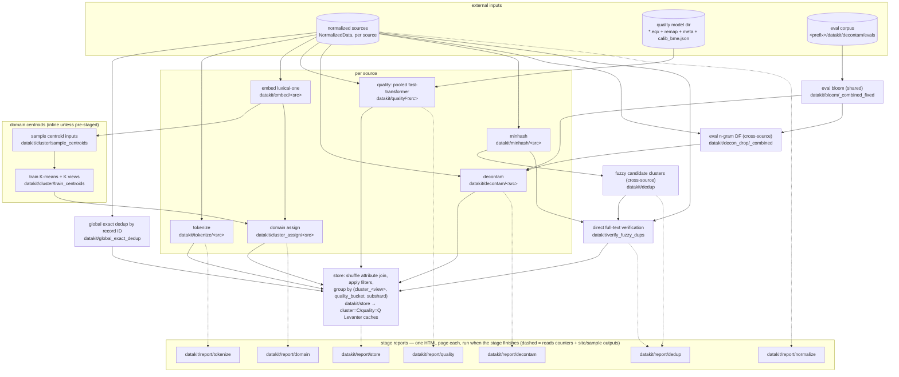

# Datakit reference pipeline

End-to-end DAG from normalized Datakit sources to the per-(cluster, quality)
Levanter store. [`reference_pipeline.py`](reference_pipeline.py) builds the
StepSpec graph and runs it as a single iris job, in one of two modes:

- `--mode full`: sources from `marin.datakit.sources.all_sources`, K=5000.
- `--mode sample`: a pre-built testbed sample registered as already-normalized
  sources (`--sample-prefix`), K=64 — a true end-to-end run on real data.

All worker CPU/RAM is one `PoolConfig` (`n_workers` x `worker`, overridable with
`--pool-workers/--pool-cpu/--pool-ram`) shared across the stages. Each stage runs
its pipeline on its own dedicated Zephyr coordinator + worker fleet (vanilla
`ZephyrContext`), sized by that config; `--max-concurrent` bounds how many stages
the StepRunner walks at once.

Most stages keep one step per source with its own output dir
(`datakit/<stage>/<source>_<hash>/`). Global exact dedup, fuzzy candidate
search, full-text verification, the decontamination DF filter, and the store
combine sources. Steps write their
main output under `outputs/main/` plus, where it makes sense, a small site/sample side output
(`outputs/samples/`, `outputs/flagged_sample/`, …) that the per-stage HTML
reports ([`reports/`](reports/)) read.

Materialized source identities are paths relative to `MARIN_PREFIX`, such as
`datakit/normalize/foo_<hash>/outputs/main`. Datakit models use absolute data
paths at runtime. Artifact result payloads store paths relative to the active
`MARIN_PREFIX`. `read_artifact` restores the active prefix for consumers. The
target prefix must contain the same materialized data after a region change.
Paths outside the active prefix stay absolute. Existing payloads with absolute
paths load without data recomputation. The framework lineage fields
`output_path` and `dep_paths` stay absolute.

Datakit attribute Parquet files use a flat schema. The top-level `id` column
is the join key. Each attribute is another top-level column, such as
`contaminated` or `dup_doc`. Attribute files do not
use a nested `attributes` struct.

Global exact deduplication is one shared step. It selects one canonical record
for each record ID, with source names as the canonical order. The step writes
sparse co-partitioned attributes with `dup_doc=true` for the other
records. Only source shards with duplicates get an attribute file; a missing
file means that the source shard has no exact duplicates. The step does not copy
normalized text.

Fuzzy dedup first writes all members of each non-singleton candidate cluster.
The next job joins these sparse attributes to normalized text and saved MinHash
buckets. It selects the longest document from a bounded cluster head as the
primary anchor. After a rejection, it ranks retained local representatives by
their shared LSH buckets. The reference configuration permits two comparisons
per member and 32 representatives per cluster. It limits local representative
text to 2,000,000 characters per cluster. A local match needs an equal
case-folded token sequence after whitespace normalization. Its line-count ratio
must be at least 0.8. Low-diversity text needs exact normalized token-sequence
containment when its distinct 3-gram ratio is less than 0.9. The job writes
`dup_doc=true` only after a direct full-text match. The final store removes
exact duplicates and verified fuzzy duplicates.

Global exact, fuzzy candidate, and fuzzy verification outputs write
`.source_manifest.json` at the output root. The file maps each `source_NNN`
tag to its source key and its relative `outputs/source_NNN` attribute
directory.

A source-set change gives a new global exact-dedup output and a new store
identity. It does not change the identity of tokenization, embedding, quality,
decontamination, or MinHash steps.

Each `datakit/report/<stage>` step depends only on that stage's steps, so it
runs as soon as the stage finishes — reports are not deferred to the end of the
run, and only `report/store` waits on the store. They are separate steps (not
folded into the data steps) so a report can be regenerated without recomputing
the stage. Global exact dedup, embed, and minhash have no standalone report.



## Testbed samples

Each testbed sample is a tree of already-normalized sources named
`sample_<tokens>_<hash>`. Pass its full root as `--sample-prefix`; the bucket
prefix is not prepended.

`zephyr_benchmark.py` defaults to this GCP-local copy:

| `--sample-prefix` | Approx. size | Region |
| --- | --- | --- |
| `gs://marin-us-central1/datakit/sample_100b_8ae7a94f` | ~100B tokens | GCP `us-central1` |

### Create a regional sample

`experiments.datakit.materialize_zephyr_benchmark_sample` creates a benchmark
sample in the region where it will run. It either copies an existing normalized
sample or rebuilds it from the source Hugging Face datasets. Neither mode is
part of the A/B benchmark workflow.

Copying preserves the normalized Parquet payloads and writes destination-local
`NormalizedData` artifacts. Run the job in the destination region, keep
concurrency bounded, and confirm transfer charges before a cross-region copy.
For the CoreWeave source, pass its credentials; for a GCS-to-GCS copy, omit
them and use GCP credentials that can read the source bucket. Do not use Storage
Transfer Service.

```bash
uv run iris --cluster=marin job run --no-wait \
  --region <DESTINATION_REGION> --memory=8G --disk=5G --cpu=4 --extra=cpu \
  --priority batch \
  -e CW_KEY_ID "$CW_KEY_ID" -e CW_KEY_SECRET "$CW_KEY_SECRET" \
  -- python -m experiments.datakit.materialize_zephyr_benchmark_sample \
    --mode copy \
    --source-prefix s3://marin-us-east-02a/marin/datakit/sample_100b_8ae7a94f \
    --destination-prefix gs://<DESTINATION_BUCKET>/datakit/sample_100b_8ae7a94f \
    --max-concurrent 4
```

The same command supports GCS-to-GCS copies by passing a `gs://` source prefix
and removing the two CoreWeave credential arguments.

Regeneration reads the source names from `--source-prefix`, then runs the source
registry's Hugging Face download and normalization steps before sampling 100B
tokens into the destination. It reads no source Parquet payloads. `--data-prefix`
is the region-local root for raw and normalized intermediate artifacts. The
source prefix must be readable for its artifact metadata; pass CoreWeave
credentials when it is the legacy S3 sample. Regeneration can produce different
bytes as source revisions or normalization code change.

```bash
uv run iris --cluster=marin job run --no-wait \
  --region <DESTINATION_REGION> --memory=8G --disk=5G --cpu=4 --extra=cpu \
  --priority batch \
  -e CW_KEY_ID "$CW_KEY_ID" -e CW_KEY_SECRET "$CW_KEY_SECRET" \
  -- python -m experiments.datakit.materialize_zephyr_benchmark_sample \
    --mode regenerate \
    --source-prefix s3://marin-us-east-02a/marin/datakit/sample_100b_8ae7a94f \
    --data-prefix gs://<DESTINATION_BUCKET> \
    --destination-prefix gs://<DESTINATION_BUCKET>/datakit/sample_100b_8ae7a94f \
    --target-total-tokens-b 100 \
    --max-concurrent 4
```

The original samples remain available under
`s3://marin-us-east-02a/marin/datakit/` in CoreWeave `us-east-02a`:

| `--sample-prefix` | Approx. size |
| --- | --- |
| `s3://marin-us-east-02a/marin/datakit/sample_0.1b_7d7d8fd7` | ~0.1B tokens (default `SAMPLE_PREFIX`) |
| `s3://marin-us-east-02a/marin/datakit/sample_100b_8ae7a94f` | ~100B tokens |
| `s3://marin-us-east-02a/marin/datakit/sample_100b_e273e96d` | ~100B tokens |
| `s3://marin-us-east-02a/marin/datakit/sample_500b_32c52319` | ~500B tokens |
| `s3://marin-us-east-02a/marin/datakit/sample_1t_733c8c5c` | ~1T tokens |

List them with:

```bash
uv run fsutil ls s3://marin-us-east-02a/marin/datakit/
```

## Layout

| Path | What it is |
| --- | --- |
| `reference_pipeline.py` | The DAG builder + CLI (`--mode full\|sample`, `--pool-*`, `--sources`, `--quality-model`) |
| `zephyr_benchmark.py` | GCP-default A/B benchmark over a pre-normalized sample |
| `materialize_zephyr_benchmark_sample.py` | One-time benchmark sample copy or regeneration tool |
| `global_exact_dedup.py` | Sparse co-partitioned exact-duplicate attributes by normalized record ID |
| `cluster/quality/fast_transformer/` | Quality classifier: per-source scoring step + training/calibration |
| `cluster/domain/v0/` | Domain clustering: centroid sampling/training + per-source assignment |
| `embeddings/luxical/` | Luxical-one document embeddings feeding the domain stage |
| `decontam/` | Eval-corpus preparation (the decon step itself lives in `marin.datakit.decon`) |
| `store/datakit_store.py` | Shuffle attribute join → compact per-(cluster, quality) Levanter caches |
| `reports/` | Per-stage single-page HTML reports (`common.py` + one module/template per stage) |
| `scripts/` | Manual source triggering and synchronization, tier-2 dataset reproduction, and tier-1 output validation |
| `testbed/` | Sampled-corpus testbed used by the smoke and decon experiments |

## Running

Submission commands (full and sample mode) live in the `reference_pipeline.py`
module docstring.
