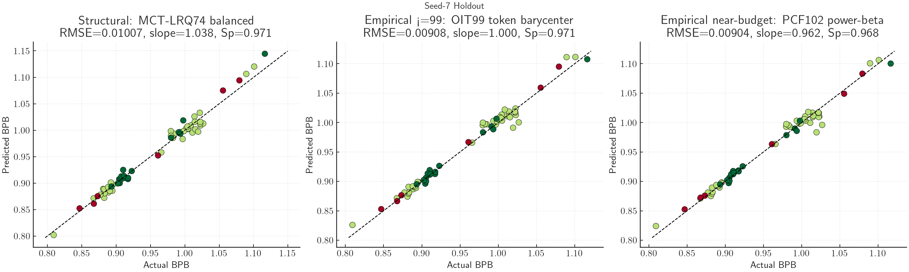
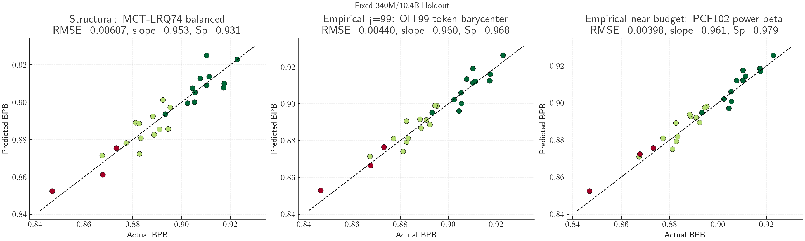
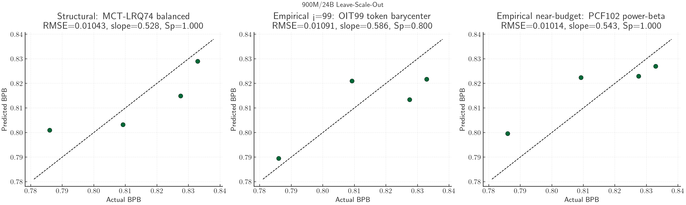
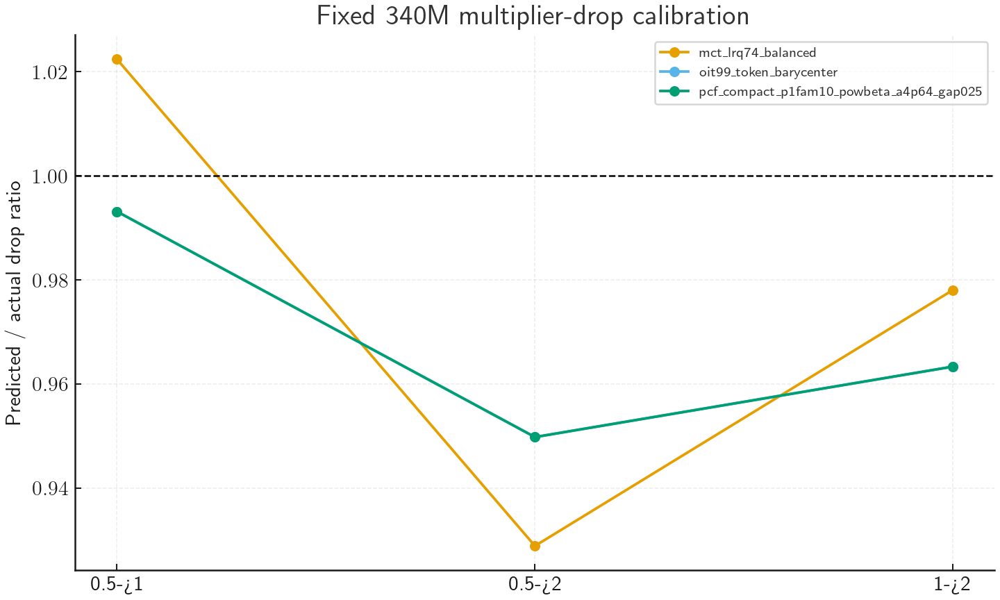
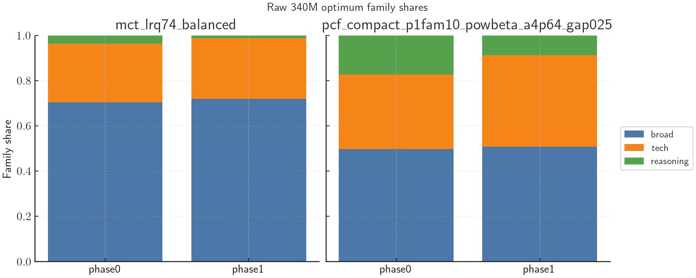

# Current Best Structural and Empirical Models

Date: 2026-04-24

This report summarizes the current best structural and empirical models after validating the Session 12 candidates on the corrected v31 modeling packet.

## TL;DR

The current best structural model is `mct_lrq74_balanced`, a 74-constant monotone LRQ/Chinchilla-style law. It has clean fixed-mixture scaling behavior and zero monotonicity violations in the sampled grid. Its raw optima are sane only with its hand-coded compatibility barrier enabled; a barrier ablation shows that this safety story is not yet a clean law-level result.

The current best strict-under-100 empirical model is `oit99_token_barycenter`, a 99-parameter ordinal token-potential wrapper on top of the 98-parameter power-beta compact model. It improves fixed-340M prediction substantially, but its raw-simplex safety is barrier-dependent and its unbarriered mixture argmin is inherited from the base power-beta model.

If we allow a small parameter-budget overrun, `pcf_compact_p1fam10_powbeta_a4p64_gap025` is the best empirical near-compact reference. It has 102 parameters and the best fixed-340M RMSE in this report.

## Model Choices

| role | selected model | params | why this one |
|:--|:--|--:|:--|
| structural | `mct_lrq74_balanced` | 74 | Best current compact law by corrected local splits. It is monotone in `N` and `D` and uses quality/family structure without post-hoc residual overfit. Raw-optimum sanity depends on its compatibility barrier. |
| empirical, strict under 100 | `oit99_token_barycenter` | 99 | Best practical under-100 wrapper when balancing seed-7, fixed-340M, and 900M. `oit99_midpivot` has slightly lower seed/fixed RMSE, but worse 900M transfer. |
| empirical, near budget | `pcf_compact_p1fam10_powbeta_a4p64_gap025` | 102 | Strongest near-compact empirical reference. It slightly exceeds the preferred 100-parameter budget, but has the best fixed-340M RMSE and strong drop calibration. |

## Structural Form: `mct_lrq74_balanced`

Takeaway: this is the cleanest current model, not the most predictive one.

The top-level form is:

```text
L(w, N, D) = P(w) + E_LRQ(w) + A * u_N + B(w) * u_D + C * u_ND
```

with:

```text
u_N  = (N / N0)^(-alpha) - 1
u_D  = (D / D0)^(-beta) - 1
u_ND = (N / N0)^(-gamma) * (D / D0)^(-delta) - 1
```

For `mct_lrq74_balanced`:

```text
alpha = 0.148968
beta  = 0.209383
gamma = 0.009859
delta = 1.043436
```

The components are:

| component | description |
|:--|:--|
| `P(w)` | Mixture-only compatibility barrier. It discourages raw-optimum geometry failures while staying zero on normal observed regions. |
| `E_LRQ(w)` | Mixture anchor using frozen GRP donor features plus low-rank quality features. It is explicitly quality-split aware. |
| `A` | Constant nonnegative `N` head. |
| `B(w)` | Nonnegative family-share `D` head. |
| `C` | Constant nonnegative high-curvature `N,D` interaction head. |

The quality-aware anchor includes phase-0 and phase-1 features for high/HQ mass, low-quality mass, synthetic mass, curated-technical mass, and family-share square roots. This is the main place where the model compresses many high/low domain pairs into a small number of interpretable parameters.

Parameter accounting:

| block | count |
|:--|--:|
| anchor coefficients including intercept | 47 |
| scale-head coefficients | 9 |
| exponents | 4 |
| frozen GRP donor constants | 9 |
| compatibility-barrier constants | 5 |
| total constants | 74 |

Structural properties:

| property | status |
|:--|:--|
| fixed mixture reduces to a scaling law | Yes. For fixed `w`, only the three power-law scale terms vary. |
| monotone decreasing in `N` and `D` | Yes in sampled grid; positive scale heads and positive exponents. |
| fixed `N,D` reduces to mixture regression | Yes. At fixed scale, prediction is a quality/family-aware mixture regression plus a mixture-only barrier. |
| raw optima | Sane only with the hand-coded compatibility barrier; no-barrier raw optima collapse. |

### How To Interpret `mct_lrq74_balanced`

The model is best read as an anchored extension of Chinchilla Approach 3:

```text
loss = mixture_anchor
     + model_size_return
     + token_return
     + joint_curvature_return
     + geometry_barrier
```

The reference point is corrected `100M/6B`:

```text
N0 = 102,648,576 non-embedding params
D0 = 5,999,951,872 realized train tokens
```

At exactly this reference scale, all three scale terms are zero:

```text
u_N = u_D = u_ND = 0
```

so the prediction reduces to:

```text
L(w, N0, D0) = E_LRQ(w) + P(w)
```

This matters because `E_LRQ(w)` is the model's scale-free mixture regression. It is the part that says whether a mixture is intrinsically good or bad at the anchor scale. The scale terms then move that mixture up or down as `N` and `D` change.

The signs are interpretable:

| situation | effect |
|:--|:--|
| `N > N0` | `u_N < 0`, so the nonnegative `A` head lowers predicted BPB. |
| `D > D0` | `u_D < 0`, so the nonnegative `B(w)` head lowers predicted BPB. |
| `N < N0` or `D < D0` | the relevant `u` term is positive, so predicted BPB rises. |

The three scale heads have different roles:

| head | interpretation |
|:--|:--|
| `A` | Global model-size return. It is a scalar, so all mixtures get the same first-order benefit from increasing `N`. |
| `B(w)` | Mixture-dependent token return. This is a nonnegative linear head over phase/family shares, so different mixture families can have different token efficiency. |
| `C` | Small high-curvature joint return. It captures residual scale curvature that is not explained by separate `N` and `D` terms. In `mct_lrq74_balanced`, this term is small but has a steep `D` exponent. |

The quality split should be interpreted as part of the anchor, not as a separate scale law. The model compresses the many high/low domain pairs into a few phase-level features:

| feature group | what it captures |
|:--|:--|
| `high_or_hq` vs `low_quality` mass | Coarse quality split across CC high/low and HQ sources. |
| `synthetic` mass | Synthetic instruction/math/code/QA/thinking contribution. |
| `curated_technical` mass | Stack, arXiv, Finemath, Wikipedia, STEM-heavy, and related sources. |
| family-share square roots | Broad-text / tech-code / reasoning composition in each phase. |

This is why the model is parameter-efficient: it does not need separate coefficients for every high/low domain pair to see the quality structure. The tradeoff is that scale elasticity is still only family-aware through `B(w)`, not explicitly high-vs-low quality-aware. A later model could try quality-dependent scale heads, but the local post-hoc residual probe suggests that should be fit jointly, not bolted on after the fact.

The compatibility barrier `P(w)` should be read as a geometry prior, not as a prediction mechanism for normal rows. It is zero unless a mixture combines too much phase-0 reasoning with one of several phase-1/simplex pathologies:

```text
P(w) = 5 * relu(p0_reasoning - 0.12)^2
         * [
             relu(p1_tech - 0.55)^2
           + relu(0.45 - p1_broad)^2
           + relu(max_domain - 0.45)^2
           ]
```

In practice this says: do not trust raw optima that push too far toward phase-0 reasoning while also making phase 1 too tech-heavy, too non-broad, or too concentrated. A local ablation found that this term is not important for held-out prediction but is important for raw-optimum safety. Removing it leaves prediction nearly unchanged but makes raw optima collapse onto an observed pathological 60M mixture with phase 1 almost entirely tech.

This makes `P(w)` the least clean part of the structural model. It should be interpreted as an ad hoc geometry prior, not as strong evidence that MCT-LRQ has solved raw simplex optimization. Generic replacements tested locally, including support-TV, broad family concentration, near-family collapse, and family-plus-domain collapse barriers, did not produce a clearly better replacement: they either failed to block the raw optimum or damaged prediction.

The "balanced" suffix means this point was chosen for overall RMSE balance rather than the best long-drop calibration. Its sibling `mct_lrq74_drop` has slightly better `0.5x -> 2.0x` and `1.0x -> 2.0x` drop ratios, while `balanced` has slightly better seed-7, fixed-340M, and all-900M RMSE. The two are close; `balanced` is the better default if we need one current structural representative.

What to trust:

- The fixed-mixture scaling-law property is real and analytic under the current parameterization.
- The monotonicity guarantee is real for the sampled grid because all scale heads are nonnegative and all exponents are positive.
- The quality split is already present in a compact way through the anchor.
- The raw optimum behavior is much healthier than S2-style laws only when the compatibility barrier is enabled.

What not to over-interpret:

- The model is not the predictive frontier. It gives up fixed-340M RMSE versus the empirical power-beta/OIT models.
- The raw-optimum story is barrier-dependent. Without `P(w)`, the same law is still a good predictive structural ablation but not a deployment law.
- The 900M split has only four rows; the current 900M slope is still compressed (`0.528`), so high-scale extrapolation remains underpowered.
- The quality split currently affects the anchor more than the scale elasticity. If high/low quality affects scaling rate, this form only captures that indirectly.

## Empirical Form: `oit99_token_barycenter`

Takeaway: this is the best strict-under-100 empirical wrapper, but its safety story is not as clean as MCT-LRQ.

The form is:

```text
L(w, N, D, mu) =
    L_pcf98(w, N, D, mu)
  + kappa * (psi(D / mu) - psi(D_bar))
  + lambda_tv * relu(nearest_train_TV(w) - r_tv)^2
```

where:

```text
kappa     = 0.0049283609
D_bar     = 8.8399802e9
r_tv      = 0.15
lambda_tv = 0.25
```

The base model `L_pcf98` is `pcf_compact98_p1fam6_powbeta_a3_gap025`, a compact power-beta continuation law:

```text
D_b = D / mu

L_base(w, N, D_b) = F + exp(c + theta^T z_b(w, N, D_b))

h(w, N, D, mu) =
    A(w, N, D_b) * (mu^(-beta(w, N, D_b)) - 1)

L_pcf98 = L_base + h
```

The ordinal token potential `psi` is piecewise-linear in log tokens over canonical token anchors:

```text
1.2B -> 4
2.6B -> 3
6B   -> 2
10.4B -> 1
24B  -> 0
```

This correction is mixture-independent at fixed `D / mu`, so it does not change same-scale mixture ranking except through the support barrier. The support barrier is zero on observed train and seed-7 holdout mixtures, but it does change raw simplex behavior away from the observed support.

Parameter accounting:

| block | count |
|:--|--:|
| base `pcf_compact98` parameters | 98 |
| ordinal token-potential amplitude `kappa` | 1 |
| fixed support-barrier hyperparameters | not counted in reported 99 |
| reported total | 99 |

Structural properties:

| property | status |
|:--|:--|
| fixed mixture reduces to a scaling law | Partially. The base power-beta law is scale-structured, and the token potential is scale-only, but this is less clean than MCT-LRQ. |
| monotone decreasing in `N`, `D`, `mu` | Certified in the sampled OIT grid. |
| fixed `N,D,mu` reduces to mixture regression | Mostly inherited from `pcf98`; the ordinal term is constant over mixtures and the support barrier is geometry-only. |
| raw optima | Barrier-dependent. Unbarriered argmin is identical to base `pcf98`; the support barrier changes raw simplex behavior. |

## Near-Budget Empirical Reference: `pcf_compact_p1fam10_powbeta_a4p64_gap025`

Takeaway: this is the strongest empirical compact reference if 102 parameters is acceptable.

The key modeling change versus older compact forms is the explicit same-mixture continuation head:

```text
h(w, N, D, mu) = A(w, N, D_b) * (mu^(-beta(w, N, D_b)) - 1)
D_b = D / mu
```

The base is a floor-exponential SCalC/GRP-style head:

```text
L_base(w, N, D_b) = F + exp(c + theta^T z_b(w, N, D_b))
L = L_base + h
```

Parameter accounting:

| block | count |
|:--|--:|
| base coefficients | 86 |
| floor-log intercept | 1 |
| amplitude parameters | 9 |
| beta parameters | 6 |
| total | 102 |

This is not the strict-under-100 default, but it should remain the empirical performance bar.

## Eval Metrics

The table below reports the consolidated split metrics for the selected structural model, the strict-under-100 empirical model, and the near-budget empirical reference. `regret_at_1` is computed within each evaluated split as the actual BPB gap between the model-selected best row and the actual best row.

| model                                    | role                |   params | split                  |   n |     rmse |      mae |   bias_pred_minus_actual |   spearman |   slope_pred_on_actual |   std_ratio |   low_tail_rmse |   lower_tail_bias_pred_minus_actual |   regret_at_1 |
|:-----------------------------------------|:--------------------|---------:|:-----------------------|----:|---------:|---------:|-------------------------:|-----------:|-----------------------:|------------:|----------------:|------------------------------------:|--------------:|
| mct_lrq74_balanced                       | structural          |       74 | seed7_holdout          |  61 | 0.010074 | 0.007761 |                 0.001061 |   0.971391 |               1.038405 |    1.047825 |        0.005472 |                            0.000899 |      0.000000 |
| mct_lrq74_balanced                       | structural          |       74 | fixed340_holdout       |  27 | 0.006073 | 0.004945 |                -0.000029 |   0.931013 |               0.953371 |    1.013185 |        0.005432 |                            0.000929 |      0.000000 |
| mct_lrq74_balanced                       | structural          |       74 | random_supplement      |  34 | 0.012361 | 0.009997 |                 0.001927 |   0.869213 |               1.097039 |    1.120033 |        0.011587 |                           -0.001275 |      0.000000 |
| mct_lrq74_balanced                       | structural          |       74 | all900_leave_scale_out |   4 | 0.010434 | 0.009410 |                -0.001962 |   1.000000 |               0.528150 |    0.606958 |        0.014896 |                            0.014896 |      0.000000 |
| oit99_token_barycenter                   | empirical_under100  |       99 | seed7_holdout          |  61 | 0.009079 | 0.006560 |                 0.002024 |   0.970968 |               1.000448 |    1.008656 |        0.007597 |                            0.003571 |      0.000000 |
| oit99_token_barycenter                   | empirical_under100  |       99 | fixed340_holdout       |  27 | 0.004398 | 0.003654 |                 0.000699 |   0.968254 |               0.959582 |    0.990163 |        0.004188 |                            0.002859 |      0.000000 |
| oit99_token_barycenter                   | empirical_under100  |       99 | random_supplement      |  34 | 0.011512 | 0.008867 |                 0.003077 |   0.848128 |               0.956681 |    0.981437 |        0.011785 |                            0.009506 |      0.000000 |
| oit99_token_barycenter                   | empirical_under100  |       99 | all900_leave_scale_out |   4 | 0.010909 | 0.010137 |                -0.002587 |   0.800000 |               0.586247 |    0.711522 |        0.003427 |                            0.003427 |      0.000000 |
| pcf_compact_p1fam10_powbeta_a4p64_gap025 | empirical_reference |      102 | seed7_holdout          |  61 | 0.009044 | 0.006256 |                 0.000076 |   0.968006 |               0.962484 |    0.970665 |        0.006984 |                            0.004077 |      0.000000 |
| pcf_compact_p1fam10_powbeta_a4p64_gap025 | empirical_reference |      102 | fixed340_holdout       |  27 | 0.003980 | 0.003425 |                 0.001422 |   0.979243 |               0.960577 |    0.982879 |        0.004667 |                            0.004599 |      0.000000 |
| pcf_compact_p1fam10_powbeta_a4p64_gap025 | empirical_reference |      102 | random_supplement      |  34 | 0.011584 | 0.008504 |                -0.000993 |   0.825516 |               0.923995 |    0.949713 |        0.010063 |                            0.007027 |      0.000000 |
| pcf_compact_p1fam10_powbeta_a4p64_gap025 | empirical_reference |      102 | all900_leave_scale_out |   4 | 0.010138 | 0.009309 |                 0.003984 |   1.000000 |               0.542715 |    0.586257 |        0.013519 |                            0.013519 |      0.000000 |

Full metric CSVs:

- `csv/current_best_split_metrics.csv`
- `csv/candidate_summary_selected.csv`
- `csv/fixed340_drop_ratios_selected.csv`
- `csv/raw_optimum_family_debug_selected.csv`

## Prediction Plots

### Seed-7 Holdout



### Fixed 340M/10.4B Holdout



### 900M/24B Leave-Scale-Out



## Drop Calibration Debug

Fixed-340M multiplier-drop ratios:

| model                                    | drop   |    ratio |     rmse |
|:-----------------------------------------|:-------|---------:|---------:|
| mct_lrq74_balanced                       | 0.5->1 | 1.022437 | 0.004088 |
| mct_lrq74_balanced                       | 0.5->2 | 0.928873 | 0.003641 |
| mct_lrq74_balanced                       | 1->2   | 0.978074 | 0.000923 |
| oit99_token_barycenter                   | 0.5->1 | 0.993157 | 0.003083 |
| oit99_token_barycenter                   | 0.5->2 | 0.949797 | 0.003093 |
| oit99_token_barycenter                   | 1->2   | 0.963347 | 0.001197 |
| pcf_compact_p1fam10_powbeta_a4p64_gap025 | 0.5->1 | 0.993157 | 0.003083 |
| pcf_compact_p1fam10_powbeta_a4p64_gap025 | 0.5->2 | 0.949797 | 0.003093 |
| pcf_compact_p1fam10_powbeta_a4p64_gap025 | 1->2   | 0.963347 | 0.001197 |



## Raw Optimum And Geometry Debug

Raw 340M family shares:

| model                                    | phase   |    broad |     tech |   reasoning | hard_corner   |   nearest_tv |
|:-----------------------------------------|:--------|---------:|---------:|------------:|:--------------|-------------:|
| mct_lrq74_balanced                       | phase0  | 0.703323 | 0.260900 |    0.035777 | False         |     0.000000 |
| mct_lrq74_balanced                       | phase1  | 0.719069 | 0.268056 |    0.012876 | False         |     0.000000 |
| pcf_compact_p1fam10_powbeta_a4p64_gap025 | phase0  | 0.497311 | 0.329817 |    0.172872 | False         |     0.000000 |
| pcf_compact_p1fam10_powbeta_a4p64_gap025 | phase1  | 0.507559 | 0.404695 |    0.087747 | False         |     0.000000 |



OIT-specific support-barrier note:

| set | n | tv_min | tv_median | tv_max | frac_penalized | penalty_median | penalty_max |
|:--|--:|--:|--:|--:|--:|--:|--:|
| observed_train | 570 | 0.000000 | 0.000000 | 0.000000 | 0.000000 | 0.000000 | 0.000000 |
| seed7_holdout | 61 | 0.000000 | 0.000000 | 0.000000 | 0.000000 | 0.000000 | 0.000000 |
| pure_domain_corners | 1521 | 0.094929 | 0.881504 | 0.929906 | 0.999343 | 0.133775 | 0.152063 |

This is why `oit99_token_barycenter` is useful but not clean: the barrier is inactive on observed rows, but it is the mechanism that changes raw simplex behavior away from observed support.

## Monotonicity / Structural Sanity

MCT-LRQ balanced monotonicity grid:

| model | mixtures checked | N grid steps | D grid steps | N violations | D violations | analytic positive-head monotonicity |
|:--|--:|--:|--:|--:|--:|:--|
| `mct_lrq74_balanced` | 83 | 1660 | 1660 | 0 | 0 | true |

OIT99 token-barycenter monotonicity grid:

| axis | checks | violations | max positive delta | certificate note |
|:--|--:|--:|--:|:--|
| N | 800 | 0 | -0.030323 | unchanged from base because token potential cancels on the `mu` sanity path |
| D | 800 | 0 | -0.000025 | ordinal decrement on canonical token grid |
| mu | 400 | 0 | -0.001347 | unchanged from base because token potential cancels on the `mu` sanity path |

## Interpretation

`mct_lrq74_balanced` is the model I would call the current best structural prediction law, with a caveat. It gives up about `0.0010` seed-7 RMSE and `0.0017-0.0021` fixed-340M RMSE versus the empirical candidates, but it is simpler, monotone, and quality-split aware. Its raw optima are sane only with the compatibility barrier enabled, so raw deployment quality remains unsolved.

`oit99_token_barycenter` is the best strict-under-100 empirical model if we care about predictive quality while staying near the compact budget. Its main weakness is conceptual: it is a wrapper on a power-beta base plus a support barrier, not a clean joint law.

`pcf_compact_p1fam10_powbeta_a4p64_gap025` is the empirical performance bar. It should stay in future packets as the near-budget predictive reference, but not as the compact structural answer because it exceeds 100 parameters and is less theoretically clean than MCT-LRQ.

## Recommended Next Step

The next modeling attempt should not add another post-hoc residual or another hand-coded barrier to MCT-LRQ. The local quality/support residual probe already showed that residuals overfit, and the barrier ablation showed that raw optimum quality is still being enforced by an ad hoc prior. The more promising direction is a jointly fitted model that keeps the MCT-LRQ skeleton but lets quality/family structure enter the nonnegative scale heads directly, under monotonicity and raw-optimum geometry checks.
