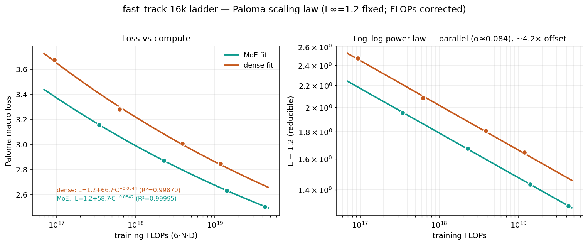

# fast_track — dense vs MoE scaling ladder (H100, 16k BPE)

Self-contained grug variant with 16k vocab size for fast iteration. Dense and MoE baselines shown
below from 9.4e16 to 4.3e19 FLOPs.

## Files

| file | contents |
|------|----------|
| [`launch.py`](launch.py) | ladder rungs, budget resolution (`--match`), Iris/W&B wiring |
| [`model.py`](model.py) | the transformer: attention, GatedNorm, SConv, QB-routed MoE |
| [`train.py`](train.py) | trainer/eval/loss wiring and runtime (XLA) defaults |
| [`optimizer.py`](optimizer.py) | MuonH optimizer config: LR groups + hyperball step |
| [`grugmuon_stacked.py`](grugmuon_stacked.py) | Newton-Schulz orthogonalization (Muon direction) |
| [`adamh.py`](adamh.py) | AdamH scale transform (the `adamh` LR group) |
| [`heuristic.py`](heuristic.py) | compute-scaling LR / beta2 / epsilon fit |
| [`router_metrics.py`](router_metrics.py) | routing-stats telemetry (logging-only) |

## Results

| size | variant | TPP | batch | active | total | steps | tokens | FLOPs | MFU | Paloma loss | Paloma bpb | uncheat bpb | runtime |
|------|---------|----:|------:|-------:|------:|------:|-------:|------:|----:|------------:|-----------:|------------:|--------:|
| d512  | dense | 20 | 128 |  18.1M |  36.8M |    690 | 0.36B | 9.4e16 | 16.6% | 3.676 | 1.520 | 1.243 | 3.7m |
| d768  | dense | 20 | 128 |  53.5M |  82.3M |  2,040 | 1.07B | 6.3e17 | 20.2% | 3.283 | 1.361 | 1.063 | 9.2m |
| d1024 | dense | 20 | 256 | 144.7M | 185.3M |  2,760 | 2.89B | 3.9e18 | 26.7% | 3.006 | 1.248 | 0.945 | 34.8m |
| d1280 | dense | 20 | 256 | 261.5M | 313.6M |  4,988 | 5.23B | 1.2e19 | 28.8% | 2.847 | 1.183 | 0.881 | 1.5 hr |
| d512  | moe   | 60 | 128 |  20.8M |   483M |  2,385 | 1.25B | 3.5e17 |  8.2% | 3.156 | 1.308 | 1.008 | 14.0m |
| d768  | moe   | 60 | 128 |  60.6M |  1.42B |  6,930 | 3.63B | 2.3e18 | 10.3% | 2.872 | 1.193 | 0.888 | 54.4m |
| d1024 | moe   | 60 | 256 | 162.0M |  3.75B |  9,270 | 9.72B | 1.4e19 | 13.9% | 2.633 | 1.096 | 0.793 | 3.8 hr |
| d1280 | moe   | 60 | 256 | 291.3M |  6.81B | 16,669 | 17.5B | 4.3e19 | 15.6% | 2.504 | 1.044 | 0.741 | 10.0 hr |

W&B runs (project `marin-community/marin_moe`) —
dense: [d512](https://wandb.ai/marin-community/marin_moe/runs/fasttrack-dense-d512) ·
[d768](https://wandb.ai/marin-community/marin_moe/runs/fasttrack-dense-d768) ·
[d1024](https://wandb.ai/marin-community/marin_moe/runs/fasttrack-dense-d1024) ·
[d1280](https://wandb.ai/marin-community/marin_moe/runs/fasttrack-dense-d1280) —
moe: [d512](https://wandb.ai/marin-community/marin_moe/runs/fasttrack-moe-d512) ·
[d768](https://wandb.ai/marin-community/marin_moe/runs/fasttrack-moe-d768) ·
[d1024](https://wandb.ai/marin-community/marin_moe/runs/fasttrack-moe-d1024) ·
[d1280](https://wandb.ai/marin-community/marin_moe/runs/fasttrack-moe-d1280)

## Tokenizer impact (16k vs 128k)

Same MoE geometry and token budget, swapping the 16k BPE tokenizer for the 128k Marin (llama3-family)
tokenizer. bpb is byte-normalized so it compares fairly across tokenizers; per-token loss does not
(the 128k tokenizer packs more bytes per token, so higher loss at similar bpb).

| size | tokenizer | Paloma loss | Paloma bpb | uncheat bpb |
|------|-----------|------------:|-----------:|------------:|
| d512 | 16k  | 3.156 | 1.308 | 1.008 |
| d512 | 128k | 3.656 | 1.309 | 0.996 |
| d768 | 16k  | 2.872 | 1.193 | 0.888 |
| d768 | 128k | 3.306 | 1.187 | 0.870 |

Both runs train on the same number of tokens, but the 16k tokenizer compresses ~12% worse than the
128k, so at equal token budget the 16k run covers ~12% fewer bytes of text. Even with that data
disadvantage it lands ~neutral on Paloma bpb (+0.001 at d512, −0.006 at d768) and only slightly behind
on uncheatable bpb (−0.012 / −0.018).

## Scaling law

Fitting `L(C) = L∞ + A·C^(−α)` to Paloma macro loss over the four rungs (C = total training FLOPs), with
the irreducible floor pinned at **L∞ = 1.2**:

| variant | fit | R² | α |
|---------|-----|---:|--:|
| MoE   | `L = 1.2 + 58.67·C^(−0.0842)` | 0.99995 | 0.0842 |
| dense | `L = 1.2 + 66.70·C^(−0.0844)` | 0.99870 | 0.0844 |



**Compute efficiency:** the MoE recipe (60 TPP) reaches the same Paloma loss as the compute-optimal
dense recipe (20 TPP) with **~4.2× less compute**.

## Launch commands

Set `$WANDB_API_KEY` in your shell.

`fast-track` is the single entry point. Run it locally to print the lowered plan for inspection; add
`--submit` to launch it as an 8×H100 Iris job:

```bash
# inspect the plan locally — nothing is submitted
uv run fast-track --run-id dense-d768 --size d768 --dense --version 2026.09.17

# submit it as an Iris H100 job
uv run fast-track --submit --run-id dense-d768 --size d768 --dense --version 2026.09.17
```

`--submit` wraps the launcher in `iris job run … -- python -m …launch … --run` and forwards
`$WANDB_API_KEY` to the job. It targets `$IRIS_CLUSTER` (default `cw-rno2a`); both `cw-rno2a` and
`cw-us-east-02a` are 8×H100 clusters, so `IRIS_CLUSTER=cw-us-east-02a uv run fast-track --submit …`
picks the other.

Pick a size and variant; the budget defaults to **data-matching** that variant's baseline (dense at
20 TPP, MoE at 60 TPP) at the rung's baseline batch (128 for d512/d768, 256 for d1024/d1280). Steps
are derived automatically. Use `--match compute` to FLOP-match instead, `--batch-size` to change the
batch (steps rescale to hold the match), or `--num-steps` to set the count explicitly.

Dense (data-match baseline):

```bash
uv run fast-track --submit --run-id dense-d768 --size d768 --dense --version 2026.09.17
```

MoE (data-match baseline; bump the batch — steps halve to hold tokens):

```bash
uv run fast-track --submit --run-id moe-d768 --size d768 --batch-size 256 --version 2026.09.17
```

MFU probe (any size, quick — explicit short budget):

```bash
uv run fast-track --submit --run-id probe-d1280 --size d1280 --num-steps 20 --no-eval --version 2026.09.17
```

### Useful flags (all on `launch.py`)

| flag | effect |
|------|--------|
| `--run-id` | **required** run identifier for artifact + W&B names |
| `--size` | **required** `d512` / `d768` / `d1024` / `d1280` |
| `--dense` | dense 3×hidden SwiGLU, no MoE (expert=1, normal eval) |
| `--match` | `data` (default) tokens-match or `compute` FLOP-match the variant baseline |
| `--batch-size` | override the rung's baseline batch (steps rescale to hold the match) |
| `--num-steps N` | set the step budget explicitly (ignores `--match`) |
| `--no-eval` | skip eval (clean MFU probes) |
| `--save-checkpoints` | save a permanent final checkpoint to S3 (off by default) |
| `--submit` | submit as an Iris H100 job (`$IRIS_CLUSTER`, default `cw-rno2a`); omit to print the plan locally |

Results land in W&B `marin-community/marin_moe`; eval bpb keys are `eval/paloma/macro_bpb`,
`eval/uncheatable_eval/macro_bpb` (MoE dropless eval logs under the normal `eval/` prefix).
