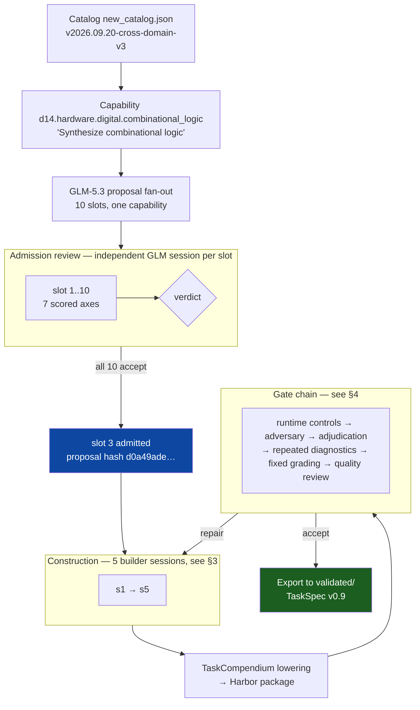
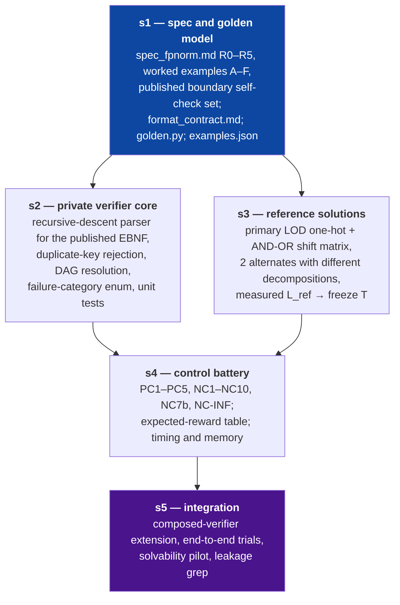
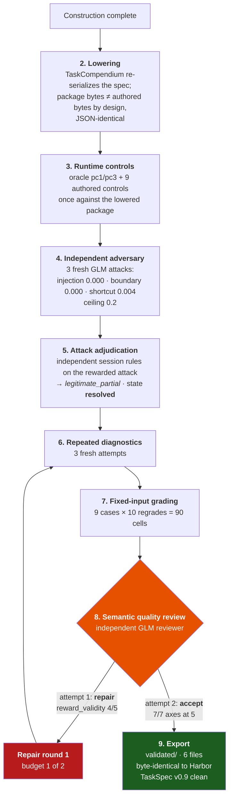

# How `d14-hardware-fpnorm-combinational-0001` was built

The build history of the exported task, reconstructed from the run's own
hash-verified snapshot — not from narration.  Every number below comes from
`data/recipe-v1-slot3-terminal/`.

| | |
| --- | --- |
| run | `/muchanem/cap-recipe-v1-slot3-current-001` |
| stage | `synthesize` (construction **and** every gate in one job) |
| started / finished | 2026-09-22 06:46:34Z → 15:17:21Z |
| elapsed | 30,628 s — **8 h 30 m** |
| concurrency / tier | 1 item, interactive |
| session budget | 28,800 s, up to 8 continuations |
| TaskCompendium revision | `dc6b501c8604bcd2e3c20c1e9947679845fdfef8` |
| snapshot | 13,375 files, **0 omitted**, `complete_snapshot: true` |
| terminal | `exit_code: 0`, `state: complete`, `quality_accepted: 1` |
| durable copy | `s3://marin-us-east-02a/users/muchanem/capability-pipeline/runs/recipe-v1-slot3-current-001` |

This run is the one that closes the caveat on the earlier slot-5 export: the
first export reached `quality_accepted` through a separate
`checkpoint-revalidation` job, whereas here construction, all five builder
sessions, the full gate chain, a reviewer-driven repair and re-validation all
happened **inside a single job**, with fixed-input grading genuinely assessed
rather than skipped.

---

## 1. The whole pipeline



---

## 2. Proposal and admission

One capability, **10 proposals**, deliberately spread across environment
class and verification style rather than ten variations on one idea.  All ten
were admitted; slot 3 was the one built in this run.

| slot | title | environment | verification |
| --- | --- | --- | --- |
| 1 | Minimized trip logic for a sensor interlock | reasoning | code |
| 2 | Memory-mapped address decoder, overlapping regions | reasoning | code |
| **3** | **Combinational floating-point normalization stage** | **reasoning** | **code** |
| 4 | Extended-Hamming SEC-DED decoder | reasoning | simple |
| 5 | Complete the right-of-way decision table | shellsim | simple |
| 6 | NAND-only structural netlist for a 2-bit comparator | shellsim | code |
| 7 | Repair a buggy ALU slice without inferring latches | shellsim | code |
| 8 | Implement, self-verify and synthesize a barrel shifter | container | code |
| 9 | Reverse-engineer a combinational function unit | container | code |
| 10 | Repair a contradictory safety-interlock specification | reasoning | judge |

Environments: 5 reasoning / 3 shellsim / 2 container.
Verification: 7 code / 2 simple / 1 judge.  None returned `null_reason`.

**Slot 3's admission verdict — `accept`:**

| axis | score |
| --- | --- |
| alignment | 5 |
| specificity | 5 |
| realism | 5 |
| environment_fit | 5 |
| reward_validity | 5 |
| source_honesty | 5 |
| diversity | 4 |

Zero critical failures, zero required changes, **three admitted issues** —
recorded as named build conditions (`admitted-review-issue-1/2/3`) that the
final quality review had to re-check by id.  The largest was the grammar
deviation: this task's EBNF admits XOR, constants and hierarchical helpers
where the rest of the portfolio is AND/OR/NOT-only.  Admitted *because* it
was justified in the proposal and published verbatim in the solver's format
contract, and the reviewer confirmed the published grammar equals the
verifier's parser.

The proposal also declared its own data policy up front: everything authored
in-repo, no third-party content, no train/eval split because there is no
learned corpus — the golden model and all controls are deterministic authored
fixtures private to the evaluator.

---

## 3. Construction — the five builder sessions

The `builder_plan` is part of the admitted proposal, so the build's shape was
reviewed *before* any of it ran.  Each session carries its own acceptance
checks and hands off named artifacts.



All five completed.  Two design choices in that DAG are worth naming:

- **s3 depends on s1, not on s2.**  The reference solutions are an
  *independent re-derivation* of R0–R5 from the spec text.  The s4 differential
  test then requires all three references to agree with `golden.py` on all
  4096 vectors — so a misreading in s1 cannot silently propagate into the
  thing that checks s1.
- **T is frozen in s3, not guessed in s1.**  `format_contract.md` shipped from
  s1 carrying the *formula* `T = max(1500, 3 × L_ref)` with the numeric freeze
  deliberately deferred until the reference solutions existed and `L_ref`
  could be measured (190).  The published number and the verifier constant are
  the same value by construction.

The build also caught its own error and kept the correction visible.  The
accepted blueprint recorded "zero=1 on exactly 256 vectors" as a calibration
count; exhaustive enumeration confirmed 256 but showed a previously recorded
**502** was the `lz >= exp` count, not the `sub=1` count (247).  The s1 handoff
carries the correction explicitly for adjudication rather than quietly
overwriting it, and s5's leakage grep checks that none of `247 / 255 / 502`
appears in any solver-visible file.

---

## 4. The gate chain

Nine gates, in order.  Each must pass before export.



### Gate 6 — repeated diagnostics

Three fresh attempts.  The arithmetic is asymmetric on purpose:

| counter | required | observed |
| --- | --- | --- |
| `oracle_passed` | 3 of 3 | **3** |
| `authored_controls_passed` | 3 of 3 | **3** |
| `primary_adversarial_review_bound` | 3 of 3 | **3** |
| `solver_passed` | ≥ 2 of 3 | **3** |
| `independent_attacks_passed` | — | 0 (none should pass) |

State `repeated_runtime_passed`; all four gate booleans true;
`complete_attempt_inventory: true`; no reused sandbox ids.

Only the solver tolerates 2 of 3, because a solver is allowed to have a bad
day; an oracle, a control and a bound adversarial review are not.  The cost of
that strictness is real — one per-attempt infrastructure flake fails the whole
gate — which is exactly why per-attempt robustness is itself a gate
requirement rather than something to retry around.

### Gate 7 — fixed-input grading

A deterministic replay: each of the 9 control responses re-graded 10 times.

`denominator: 90` · `recorded_cells: 90` · `all_cells_retained: true` ·
`planned_matrix_exact: true`

Every case returned `reward_equal: true`, `expectation_met: true`,
`fixed_grading_input_assessment: "verified"` — and the per-cell
`grading_input_sha256` is identical across all ten cells of each case, which
is what makes this a determinism measurement rather than ten fresh rollouts.

This gate is the substantive difference between this run and the first export.
It applies only to tasks whose controls carry a fixed response string; judge
and final-state tasks are *unassessed* here, and unassessed is not failed.
Here it was genuinely assessed: `state: ready`, `unassessed: false`.

Reset diagnostics ran alongside: 5 episodes, zero mismatch cycles, no public
resources.

### What was explicitly not assessed

The run names twelve recipe rows it could not measure, rather than scoring
them green: `provenance_license`, `semantic_alignment`,
`build_reproducibility`, `reset_determinism`, `extraction_taxonomy`,
`code_mutation`, `judge_calibration`, `resource_envelope`,
`split_contamination`, `outcome_failure_injections`,
`full_environment_conformance`, `critical_negative_inventory_completeness`.

The evaluation matrix additionally records `backend_homogeneity:
not_assessed` and `training_admission: not_assessed`, and states its own
measurement limit in the artifact: *"controller elapsed time and artifact
bytes are not sandbox resource measurements."*

### Gate 8 — quality review, and the repair

**Attempt 1 → `repair`.**  608 s, 71 assistant messages, 98 tool calls.
Six axes scored 5; `reward_validity` scored **4**, with one required change:

> Make the grader-internal-error path produce an ungraded infra outcome per
> the outcome taxonomy in `contract/task_contract.md` — either surface
> `internal_error` through a non-numeric channel, or let the exception
> propagate so TaskTrove maps it to `infra_error`.

The grader had been returning reward 0 for its own internal exceptions.  That
is a real defect and the reviewer was right: it records an infrastructure
failure as a semantic score of zero, which silently poisons any downstream
statistic built on the reward distribution.

**Repair round 1** rebuilt against that finding — 1 of 2 budget used, state
`ready_for_validation`, ~170 changed files including a re-run of the full
clean-build, stability, integration and attack-regrade evidence.  The fix is
visible in the exported `grade_answer.py`: on `internal_error` it now writes
no `reward.json`, prints the summary to stderr and exits `EX_SOFTWARE` (70),
so TaskCompendium stores `infra_error` with a null reward.

**Attempt 2 → `accept`.**  672 s, 105 assistant messages, 129 tool calls,
1 compaction.  All seven axes at 5, zero required changes:

| axis | attempt 1 | attempt 2 |
| --- | --- | --- |
| capability_alignment | 5 | 5 |
| grounding_and_rights | 5 | 5 |
| isolation | 5 | 5 |
| public_contract | 5 | 5 |
| realism | 5 | 5 |
| reproducibility | 5 | 5 |
| **reward_validity** | **4** | **5** |

Both reviews recorded their own limitations rather than claiming coverage
they did not have — attempt 1 noted that solver, adversary and adjudication
all used the glm-5.3 family, the same family as construction, so **no
cross-model generalization claim is possible**; attempt 2 noted that no
maintained sandbox was available on the audit host, so it cross-checked
retained Daytona receipts instead of executing the grader itself.

### Gate 9 — export

```
item_state                  quality_accepted
quality_review              accept
export_dir_present          true
export_files                6
export_matches_harbor_bytes true
taskspec_valid              true   (0 schema errors)
complete_snapshot           true   (13,375 files, 0 omitted)
EXPORTED                    true
```

---

## 5. Notes for the next run

- **This run used its own pre-fix controller.**  Five controller defects were
  found and fixed during this cycle; slot 3 ran unaffected by all of them.
  That is independent evidence the fixes corrected shape mismatches rather
  than loosening gates — a loosened gate would have changed this outcome.
- **A green check is not the same as a measured one.**  Twelve recipe rows and
  two matrix fields are recorded `unassessed`.  Reading them as passes is the
  failure mode this pipeline is built to avoid.
- **The binding constraint on width is the Daytona 40-snapshot org quota**,
  which caps construction concurrency at roughly 25–30 tasks.  Raising it is
  an account change.
- **`GradingInfrastructureError` counts against determinism by design.**
  Gate 7 needs all cells clean; at a 0.5% infrastructure flake rate a 210-cell
  matrix passes only ~35% of the time.  Whether to retry infra cells before
  counting them is a deliberate policy question, not a bug — it changes what
  the denominator guarantees.
