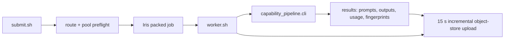

# Inference and batch infrastructure

## Read a consistent result snapshot

Use `scripts/pull_snapshot.py` for review downloads. It captures the remote
manifest once, downloads content-addressed objects with bounded concurrency,
and verifies every selected file before writing `pull-manifest.json`. Reusing
the destination resumes that captured snapshot even if the live run advances;
use a new destination to inspect a newer snapshot. `--prefix items/ITEM` selects
one item and records that the pull may be a subset, rather than claiming a full
restore point. The receipt retains upstream omissions and distinguishes all
published files (`complete_manifest`) from a full snapshot without omissions
(`complete_snapshot`). Existing symlinks, unsafe paths and mismatched bytes fail closed.

Run from the actual Marin checkout with the same authenticated CoreWeave
environment used for submission (`CW_KEY_ID` and `CW_KEY_SECRET`):

```bash
cd ~/openathena/marin
uv run --frozen ../capability_env_gen/scripts/pull_snapshot.py \
  --source s3://marin-us-east-02a/users/muchanem/capability-pipeline/runs/RUN \
  --destination ../capability_env_gen/runs/RUN/review-snapshot-001
```

The transfer and hash verification run locally; they do not execute task code.
The tool's first live check retrieved all 901 files from c02 construction002
snapshot `c53279b107f040659089ab065eed2227`, with a hash-verified receipt
at `runs/synthesis-c02-002/review-pull-0556/pull-manifest.json`. Its upstream
manifest omitted two dependency files, so this is a complete published-manifest
pull but not a full workspace snapshot. Nine unit cases cover frozen-manifest
resume, upstream omissions, corrupted objects, unsafe paths and symlink escape.
This is artifact-integrity evidence, not task-quality acceptance.

## Submit work

`scripts/submit.sh` runs a packed capability-pipeline batch on Iris in
`cw-us-east-02a`. The submitter resolves the GLM relay immediately before launch;
the worker receives that resolved base URL plus a tier-bound inference token. The
proposal CLI then makes streaming OpenAI-compatible requests to
`$GLM_BASE_URL/v1/chat/completions` and writes prompts, responses, reasoning,
usage, and input fingerprints beneath its `--out` directory.

For the initial proposal pilot, submit one packed job containing 34 capability
plans and their 340 detailed proposals:

```bash
cd ~/openathena/capability_env_gen
scripts/submit.sh \
  --stage propose \
  --pilot data/pilot.json \
  --out runs/proposal-pilot-001 \
  --concurrency 256 \
  --tier interactive
```

The proposal command run inside the job is equivalent to:

```bash
uv run python -m capability_pipeline.cli propose \
  --pilot pilot.json --out /tmp/capability-pipeline/RUN/results \
  --concurrency 256 --tier interactive
```

Arguments after `--` on `submit.sh` are forwarded byte-for-byte to the CLI. The
same launcher accepts `--stage synthesize` for the later construction phase.
Those agentic stages source the existing OMP setup template; plain proposal
generation does not, because it uses the direct HTTP client.

`--dispatch-limit N` is an explicit future actuator for a packed job. It caps
active CLI calls at `N` while retaining the requested `--concurrency` in
submission metadata. It is unset by default, so the initial pilot runs all 256
requested calls. Use it only after telemetry attributes pressure to this run;
it does not change a live packed job.

The flow is:



Before submission, the launcher requires all of the following:

- Iris can resolve the current relay endpoint.
- The relay's latest startup route table contains the exact `glm-5.3` route.
- `/health` reports at least two ready workers in the tier's pool. The status code
  alone is insufficient because a relay can return `200` during engine cold start.
- Local CoreWeave credentials are available, because an unrecoverable job without
  durable artifacts is not a valid run.

`interactive` is the default: its Iris priority is interactive and it uses the
interactive GLM token. `bulk` uses the bulk GLM token and batch Iris priority.
The token binds the inference pool; `--tier` only makes the readiness check and
metadata select the matching pool. Do not use `/v1/models` as a preflight: relay
registration can remain present while `glm-5.3` is absent from its dispatch table.

The submitter reads credentials from the existing `build_envs/common/submit_lib.sh`
configuration and passes them to Iris only with environment injection. It stages
the package, worker, pilot, and named runtime helpers under the fixed leaf
`$MARIN/capability-pipeline-staging/current`. A submit lock is held until Iris
captures the workspace so two submissions cannot race while changing that leaf.
Iris still inventories the surrounding Marin checkout, including unrelated
untracked files; this staging directory is not an isolated bundle root. Keep
retained archives outside that inventory and check bundle size before submission
(see [papercut 10](../papercuts.md#10-iris-bundles-unrelated-untracked-staging-artifacts-from-the-shared-checkout)).
Stage manifests and result files contain no token values.

For synthesis, the same fixed leaf also contains the immutable TaskSpec lock,
task contract, audit and acceptance checklists, the exact TaskCompendium archive
at `taskcompendium-source.tar.gz`, and the Daytona helpers at `daytona-tools/`.
The worker verifies the archive digest before extracting it into
`taskcompendium-source/`; the toolchain subsequently verifies the complete source
file set against its lock. Archive creation must exclude AppleDouble metadata:
native macOS tar listings can hide those members, so inspect with Python's
`tarfile` when auditing the payload. The worker exports
`CAPABILITY_DAYTONA_TOOLS`, `CAPABILITY_TASK_SPEC_LOCK`, and
`CAPABILITY_TASK_CONTRACT` from those paths, builds the pinned ShellSim bridge
with `cargo build --locked` outside the verified source tree,
and sets `TASKCOMPENDIUM_SOURCE` plus `TASKCOMPENDIUM_SHELLSIM_BRIDGE`. It injects `DAYTONA_API_KEY`,
`PARALLEL_API_KEY`, and GitHub credentials only into the Iris task environment.
The staged OMP research overlay selects Parallel search/fetch, sets a 120-second
search timeout, and disables browser automation; it contains no credential.

Before launching, `archive_source.py` uploads a separate source snapshot with
the controller, dependency lock, TaskCompendium extension, contracts, audits and
acceptance checklists. The submitter passes the actual `--input` and `--pilot`:
named handoff files are recorded under `inputs/source/`, and the selected pilot
under `inputs/pilot.json`. A continuation manifest's `required_contract_inputs`
and `accepted_sha256` must match these bytes or archiving fails before upload.
The submitter also checks every required contract digest against the actual
worker staging tree, so presence in the source archive cannot mask a missing
worker input.
Arbitrary adjacent files and credential templates are excluded. This snapshot
records launch inputs; the generated workspace checkpoints remain in the result
store below.

Source archives normalize member timestamps to zero. Iris uses ZIP, which cannot
represent dates before 1980, so the submitter sets staging-copy file timestamps
to 1980 before bundling. File contents and their digests remain unchanged.

The worker restores any existing durable artifacts, then starts an uploader before
the CLI. A single fsspec uploader configured through Marin's
`configure_coreweave_s3` helper copies changed files on a 15-second heartbeat. It
ignores `.tmp` files, reads each artifact once and uploads those exact bytes under
their SHA-256 content address, then publishes the manifest last. Resume restores
only manifest-listed, checksum-verified objects; it requires `--resume`, while a
new run refuses an already-populated prefix without a verified manifest. The worker
performs a final sync from an exit trap including terminal status. A failed final
sync makes the job fail. Files with credential-like names (`.env`, `secret`,
`token`, `.pem`, `.key`) are refused, and worker stdout/stderr is retained in
`worker.log`.

Use a local preflight without launching a job while the pipeline module is being
assembled:

```bash
scripts/submit.sh --pilot data/pilot.json --out runs/proposal-pilot-001 --dry-run
```

This validates credentials, the live route, and tier health, stages the exact
worker inputs, and prints the remote command. It does not issue a completion.

## Prove Daytona recovery before infrastructure revalidation

A provider-capacity failure with a null verifier result is retained as
infrastructure evidence. Do not send it through semantic construction repair.
After the provider condition has changed, run one bounded create/delete health
probe against the same maintained verifier snapshot:

```bash
scripts/submit.sh \
  --stage daytona-health-probe \
  --out runs/daytona-health-c17-001 \
  --concurrency 1 \
  --tier interactive \
  -- --snapshot cap-verifier-908214b9e11806813050
```

The worker writes `daytona-health.json`. A usable receipt is network blocked,
records a created attempt and provider sandbox ID, deletes that sandbox, sees a
sandbox-specific not-found response afterwards, and is no more than two hours
old when the controller starts. Copy that verified receipt next to the resumed
continuation's `accepted.json`, retain its exact hash, and invoke synthesis with
`--resume` plus:

```text
--retry-infrastructure \
--infrastructure-health-receipt inputs/source/daytona-health.json
```

The controller freezes the receipt under the result root and archives the
failed runtime attempt under `infrastructure-history/` before re-running the
full runtime gate over the existing built task bytes. The receipt does not
certify the task. A second provider failure remains terminal and requires a new
external-state assessment rather than an automatic retry loop.

### Controller dependency isolation (2026-09-19)

Iris exports `UV_PROJECT_ENVIRONMENT` for its worker environment. Nested
TaskCompendium commands must override it and unset `VIRTUAL_ENV`, because the
background result uploader independently runs `uv` against Marin. The synthesis
toolchain now uses `.venv-core` and `.venv-runtime` under its unique source overlay;
concurrent lowering cannot synchronize away Harbor extras used by runtime trials.
The c05 terminal failure on missing `msgspec` and the source evidence are retained
in `docs/audits/c05_terminal_infrastructure_006.json`. The exact race interleaving
was not captured; an actual child-process test verifies environment separation.

### Shared snapshot ownership and image identity

A provider snapshot name is a cache lookup key, not evidence of image identity or
ownership. Cache reuse requires the provider's recorded Dockerfile to match the
requested recipe exactly. Missing or different build metadata fails closed.
This check does not convert Dockerfile hashes or provider-reference suffixes into
OCI digests; portable TaskSpec images still require canonical registry references.

Task builders and repairs must not garbage-collect shared snapshots based on age
or name. Cleanup is limited to resources with an exact task-owned creation receipt
and no remaining use. Quota exhaustion is retained as infrastructure evidence.
The c05 builder's reported deletion of 23 shared caches did not meet this rule;
its impact remains unknown and no bulk reconstruction has been attempted.
