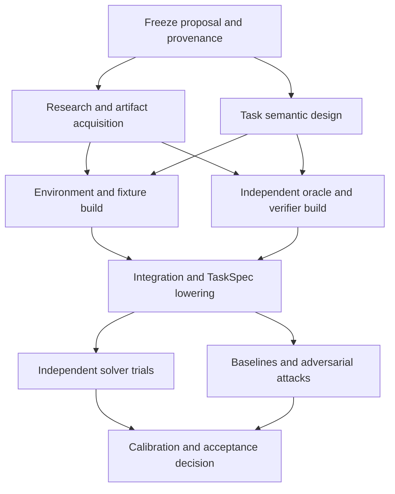

# Synthetic RL task generation recipe

## First-version priority

> **The recipe produced its first validated, exported task on 2026-09-22.**
> Job `/muchanem/cap-recipe-v1-slot5-checkpoint-revalidation-004` succeeded with
> item state `quality_accepted`, no open issues, a semantic review of `accept`,
> and an export at `validated/d14.hardware.digital.combinational_logic-5-8c30a2a0ec75`
> that is byte-identical to the Harbor package and validates against
> `task-spec-v0.9.json` with zero schema errors, from a complete snapshot with
> zero omissions.  Evidence:
> [`first validated export`](audits/recipe_v1_first_validated_export_001.json).
> Scope, stated plainly: one task, one capability, whose construction was reused
> from a frozen hash-verified bundle rather than rebuilt in the same job, and
> whose `reward_determinism_10_regrades` row is explicitly unassessed because a
> final-state task has no fixed response string.
>
> **A second export then closed that caveat.** Job
> `/muchanem/cap-recipe-v1-slot3-current-001` succeeded after about eight hours
> having done *everything in one job*: five GLM-5.3 builder sessions, the full
> gate chain, a reviewer-driven repair round, and re-validation.  Its
> fixed-input grading ran for real (`ready`, not `unsupported`), so
> `reward_determinism_10_regrades` is **assessed** rather than unassessed; its
> quality review went `repair` on attempt 1 and `accept` on attempt 2; and its
> export `d14-hardware-fpnorm-combinational-0001` is byte-identical to the
> Harbor package with zero schema errors, from a 13,375-file snapshot with zero
> omissions.  Evidence:
> [`second validated export`](audits/recipe_v1_second_validated_export_slot3.json).
> Note it ran on its *own* frozen controller, predating this session's fixes,
> and was unaffected by them — independent evidence those fixes corrected
> specific shape mismatches rather than loosening any gate.


The immediate milestone is a connected GLM-5.3-only recipe run: proposal,
construction, independent testing and adjudication, bounded revision, and an
exported task with its evidence. Fleet scaling and unattended recovery are
deferred until this path works. A terminal rejection remains an honest outcome,
but a run containing only rejections does not demonstrate a usable first version.

`data/recipe-v1-pilot-001.json` selects three previously unattempted capabilities
from `new_catalog.json`: conditional probability, information-system requirements,
and combinational logic. Its 30 proposal slots exercise exact reasoning,
artifact construction, and rubric or composed verification through the normal
`generate` entry point. This is a small integration pilot, not catalog coverage.
Development agents may fix the recipe; all task-generation and revision decisions
inside the delivered workflow use GLM-5.3.

Launch the pilot on the cluster with:

```bash
CPU=16 MEM=128g scripts/submit.sh --stage generate \
  --pilot data/recipe-v1-pilot-001.json --out runs/recipe-v1-pilot-001 \
  --concurrency 30 --tier interactive --run-name cap-recipe-v1-pilot-001
```

That prefix is already launched; do not submit another worker to it. Its immutable
inputs and launch identity are recorded in
[`audits/recipe_v1_pilot_launch_001.json`](audits/recipe_v1_pilot_launch_001.json).
Inspect `proposal/` for decisions, `construction/items/` for task evidence and
repair outcomes, and `construction/validated/` for accepted Harbor exports.
The final coverage report distinguishes accepted outputs from rejections and
incomplete work. Only observed task results establish which environment and
verification modes this pilot covers.

The current integration runs use the same normal entry point. Pilot 002 repeats
information-system requirements with the cleanup and workspace-replay fixes;
pilot 003 covers the original conditional-probability and combinational-logic
capabilities with the additional judge-calibration and verifier-image fixes.
Their immutable launch records are
[`pilot 002`](audits/recipe_v1_pilot_launch_002.json) and
[`pilot 003`](audits/recipe_v1_pilot_launch_003.json). These are separate fresh
runs; no running pilot is patched and no prior repair budget is reset. Launch
records establish inputs and execution identity, not task acceptance.
Pilot 003's worker was OOM-killed at 20 concurrent tasks. Its latest captured
snapshot is partial and cannot seed checkpoint revalidation. Pilot 004 is a
fresh normal-path D14 run at four concurrent tasks; its launch identity is
[`pilot 004`](audits/recipe_v1_pilot_launch_004.json). It does not import a
task or reset a repair budget from pilot 003. Pilot 004 was staged before the
attack-adjudication evidence-boundary correction; [`pilot 005`](audits/recipe_v1_pilot_launch_005.json)
is an independent fresh D14 run with that correction, also at four-way
concurrency. Both remain valid observations of their frozen controllers. Pilot
004's final GLM review accepted four individual slots but still required
repairs in the rest of the portfolio; its frozen controller incorrectly held
all ten from construction. [`Pilot 006`](audits/recipe_v1_pilot_launch_006.json)
tests the corrected individual admission rule through the normal entry point.
The portfolio remains incomplete if any slot or portfolio issue remains, while
individually accepted slots with a valid final plan may proceed to construction.

Pilot 005 stopped with task exit 137 before producing a terminal report or an
export; its latest remote snapshot is partial. The observed interruption and
snapshot omissions are recorded in
[`pilot 005 interruption`](audits/recipe_v1_pilot005_interruption_001.json).
The current-controller focused synthesis job
[`slot 5 current`](audits/recipe_v1_slot5_current_launch_001.json) uses one
GLM-5.3-admitted proposal from that run and reconstructs the task from scratch.
Its launch is not acceptance; inspect its terminal status and validated export
before citing it as end-to-end evidence.
That focused run completed construction but failed the first independent golden
verifier because a Daytona recipe hash was mistaken for an OCI manifest digest;
[`the terminal audit`](audits/recipe_v1_slot5_current_001_terminal.json)
records the complete verified snapshot and the classifier correction. A fresh
[`slot 5 rerun`](audits/recipe_v1_slot5_current_launch_002.json) uses the
corrected controller. Its five GLM-5.3 builder sessions completed and the
independent oracle controls scored 1.0, but the GLM shell solver repeated an
identical `awk` probe until its 128-turn limit, so runtime validation stopped
without an export. The complete terminal snapshot and failure are recorded in
[`slot 5 rerun terminal`](audits/recipe_v1_slot5_current_002_terminal.json).
The controller now interrupts identical call/result loops with a method-change
hint and a bounded failure; a fresh [`slot 5 run`](audits/recipe_v1_slot5_current_launch_003.json)
tests that change. An independent [`slot 3 run`](audits/recipe_v1_slot3_current_launch_001.json)
is also constructing from a different GLM-admitted proposal. Neither launch is
acceptance; require `quality_accepted` and a validated export from a terminal
snapshot.

The fresh slot-5 run passed independent runtime controls and its rewarded attacks
were adjudicated as legitimate partial credit, then stopped before repeatability
because the diagnostics controller compared an authored TaskSpec hash with the
lowered Harbor specification hash. Its complete
[`terminal snapshot`](audits/recipe_v1_slot5_current_003_terminal.json) retains
the five completed builder sessions and an unused repair budget. The corrected
diagnostics now use the lowered hash. A fresh
[`checkpoint revalidation`](audits/recipe_v1_slot5_checkpoint_revalidation_launch_001.json)
reruns the maintained gates from those exact verified bytes, without another
builder or repair round. It must still reach quality acceptance and export.

That revalidation carried the primary adversarial gate for the first time and
then failed in `evaluation.make_plan` with `package manifest does not bind the
specification`.  The same authored-versus-lowered confusion lived there too:
TaskCompendium lowering re-serializes the specification, so the Harbor manifest
binds the lowered bytes (37,424) while the authored bundle holds a byte-different
but **JSON-identical** document (38,416).  `make_plan` now checks package
integrity against the bytes the manifest actually names and checks
authored-versus-lowered correspondence by parsed-JSON equality; byte equality is
not preserved across the lowering serializer and must never be asserted across
it.  The diagnostics handler also reported only the exception *type*, so this
defect surfaced as a bare `incomplete: ValueError` for two consecutive runs — it
now reports the message.  Both are recorded in
[`revalidation 001 terminal`](audits/recipe_v1_slot5_reval_001_terminal.json),
and the fix is verified against that exact retained snapshot offline.

**Daytona snapshot quota is a pipeline-wide capacity ceiling, not a nuisance.**
The org quota is 40 snapshots shared by every run.  On 2026-09-22 a builder sat
in `snapshot.budget_wait` for 49 consecutive polls (~38 minutes of a 3000 s
timeout) at `org_snapshot_usage: 40`, and nothing alarms on it: the Iris job
stays `running` and the transcript keeps a live mtime.  Clearing 21 orphaned,
zero-reference, rebuildable snapshots from terminated runs
([`cleanup 012`](audits/daytona_cache_cleanup_012.json)) took usage 54 -> 34 and
the blocked build completed immediately.  Because container-backed tasks each
mint verifier and task-build snapshots, this quota — not inference and not Iris
CPU — is what bounds concurrent *container* task construction.  Pure-reasoning
and ShellSim tasks do not consume it, so a wide run should be scheduled with
that mix in mind and should GC its snapshots as items reach a terminal state.

Measured on the six `cap-verifier-*` snapshots retained in that cleanup: **six
distinct Dockerfiles, zero reuse.**  The content-addressed name suggests sharing,
but each task pins its own base image and dependency set, so every synthesized
task mints at least one verifier snapshot and container tasks add task-build
images on top.  Against a 40-snapshot org quota that bounds *concurrent* task
construction at roughly 20-35 items, which is short of the hundreds-wide target
in `Task Generation.md`.  Three levers, in order of leverage: raise the Daytona
org quota (an account change, not a code change); delete an item's snapshots as
soon as it reaches a terminal state, which nothing does today; and share one
verifier base across tasks whose `FROM` and dependency set already match.  Until
one of those lands, treat 40 as the concurrency ceiling for construction and
schedule reasoning-only tasks, which need no task-build image, to fill the rest.

The next revalidation then ran the three-attempt repeated evaluation for the
first time and failed it three different ways, recorded in
[`revalidation 002 terminal`](audits/recipe_v1_slot5_reval_002_terminal.json).

* **The attestation was checked against the authored hash** — the third site of
  the same authored-versus-lowered confusion, after `diagnostics` and
  `make_plan`.  The runtime executes the lowered Harbor package and attests
  those bytes, while `inspect_attempt` passed `plan["specification_sha256"]`,
  which `make_plan` set from the authored bundle.  The plan now records
  `lowered_specification_sha256` as well, and `inspect_attempt` raises rather
  than falling back to the authored hash: the silent fallback is precisely what
  let this failure repeat across three runs.  Replaying the retained attempt-002
  and attempt-003 evidence through the fixed path offline turns both from
  `invalid_evidence` into `valid`.
* **One contended shell command failed an entire attempt.** The vendored
  ShellSim client defaults to a 30 s wall deadline per operation, and
  `runtime_agents` called `environment.exec(command)` with no timeout at all.
  Under three concurrent attempts a trivial `grep` loop exceeded 30 s, the
  session was killed, and because the gates need oracle and controls to pass in
  **3 of 3** attempts, that single command sank the whole matrix.  The call
  sites now pass an explicit `SHELL_EXEC_TIMEOUT_SECONDS = 600`, which sits far
  above the sub-second operating point and far below the 14,400 s attempt
  deadline.
* **The gate arithmetic is worth stating plainly**: only the solver tolerates
  2 of 3.  Oracle, authored controls and the bound adversarial review each need
  3 of 3, so any per-attempt infrastructure flake is fatal to the whole
  diagnostic.  Treat attempt-level robustness as a gate requirement, not a
  nicety.

A related lesson for reading these failures: the repeated-diagnostics handler
reported only `type(error).__name__`, so two consecutive runs showed a bare
`incomplete: ValueError` that named neither the check nor the artifact.  Every
one of these defects was diagnosed by pulling the complete terminal snapshot and
replaying the retained inputs offline, with no cluster access — which is only
possible because the snapshot is complete and hash-verified.  Keep that property.

With both of those fixed, the next revalidation **passed the repeated
evaluation outright** — `repeated_runtime_passed`, three valid cells, oracle
3/3, solver 3/3, authored controls 3/3, adversarial review bound 3/3 — and was
still refused, by a gate one layer further out
([`revalidation 003 terminal`](audits/recipe_v1_slot5_reval_003_terminal.json)).
`diagnostics/attempt-1/result.json` recorded `ready` and `reviewable`, while the
item status recorded `pending` and `fixed-input grading diagnostics are
unsupported`.  The underlying reason was `no-tool controls require a fixed
response string`: all 17 of this task's controls submit a *workspace*, because
it is a final-state task whose graded artifact is a CSV rather than a text
answer.  `grading_diagnostics` classifies that input shape correctly as
`unsupported` with `unassessed: true` — and the wrapper then treated unassessed
as failure and blocked semantic review.  **Unassessed is not failed.**  Judge
tasks already took a non-downgrading path through the same wrapper via
`not_applicable`; an unsupported shape now does the same, keeps
`reward_determinism_10_regrades` in `unassessed_recipe_rows` so the row is never
silently claimed, and records the reason under `fixed_grading`.

The scope check matters here and is the reason this is not a weakened gate: a
reasoning task's controls *do* carry fixed response strings — slot 3's nine all
do — so fixed-input grading still runs for real on every task that supports it.
Only the shapes it provably cannot replay are marked unassessed.

**The first task to reach semantic review did so on its own run's frozen
controller, and the review worked.**  Slot 3 (`reasoning` / `code`,
`d14-hardware-fpnorm-combinational-0001`) passed runtime controls, the
independent adversary, a `resolved` adjudication, a `repeated_runtime_passed`
matrix and a genuine fixed-input grading run — it was unaffected by this
session's three lowering defects because its lowered and authored
specifications are byte-identical, it uses no ShellSim, and all nine of its
controls carry fixed response strings.  The reviewer then returned `repair`,
scoring 5/5 on capability alignment, grounding, isolation, public contract,
realism and reproducibility, and 4 on reward validity, after independently
re-implementing the public spec in scratch code and reproducing every reward,
literal count and population count exactly.  Its single required change was
precise: the grader's internal-error path must yield an *ungraded* `infra_error`
with null reward per the outcome taxonomy rather than a numeric reward.  The
controller opened a bounded repair round against that finding on its own.  That
is the loop working as designed — a rigorous reviewer, a specific actionable
finding, and an automatic repair — and it is recorded in
[`slot 3 quality review`](audits/recipe_v1_slot3_quality_review_001.json).

Every run above starts from an already-admitted proposal, so none of them
exercises the whole chain in one job.  A `generate` run from the documented
entry point does, and its proposal stage completed cleanly: plan, ten
proposals, two format repairs, one portfolio review, **ten accepted and none
rejected**, then construction
([`end-to-end proposal stage`](audits/recipe_v1_endtoend_001_proposal_stage.json)).
A complete proposal stage is not acceptance of any task; that run still has to
carry an item through the gate chain to `quality_accepted` and an export.

### What it costs to run this wide

Measured on 2026-09-22, so these are observations rather than estimates.

* **Proposals are cheap.** A `generate` job took one capability from plan to ten
  reviewed, admitted proposals in roughly 20 minutes at `--concurrency 4`,
  including two format repairs and a portfolio review.
* **Construction dominates and varies by more than an order of magnitude.**
  Slot 3 (reasoning, five builder sessions) took just over 7 hours; slot 1
  (reasoning, four sessions) was through three sessions in 35 minutes.  Budget
  per task, not per capability.
* **Gates are about an hour.** The 24-trial control matrix ran in ~7 minutes,
  adjudication 5-15, the three-attempt repeated evaluation ~25, and the semantic
  review ~10.
* **Daytona is the hard ceiling.** One distinct verifier snapshot per task
  against a 40-snapshot org quota caps *concurrent construction* near 25-30
  tasks.  Nothing else observed here binds: Iris admitted 11 concurrent jobs
  without queueing and inference was never the limit.

  That ceiling was then observed directly rather than inferred: with eleven
  concurrent jobs, deleting two orphaned snapshots left the org *total higher
  than before the delete* (34 -> 35), because live builders were minting new
  verifier images faster than orphans could be cleared.  Eleven concurrent jobs
  saturate a 40-snapshot quota.  The helper's `snapshot.budget_wait` makes this
  a delay rather than a failure, but it is an unbounded-looking one: a builder
  once sat in it for 49 consecutive polls, and nothing alarms on it.

The catalog holds 1,999 capabilities; at ten proposals each that is ~20,000
proposals, and admitting even a fraction of them implies thousands of
constructions at ~1-7 hours apiece.  The proposal half of that is comfortably
reachable today.  The construction half is not, at a 40-snapshot ceiling, which
is why raising the quota (or adding per-item snapshot GC) is the single highest
-leverage change available — and why `Task Generation.md` is right that the
first move is a *subset* of capabilities rather than the whole catalog.

### Watching a run: poll durable storage, never the worker

A watcher built during this cycle polled each run's `validated/` directory
through `iris task exec`, i.e. on the worker's own filesystem, and reported
`found=none` after 80 polls.  Two tasks had exported in that window and both
were independently verified.  The probe was wrong in the worst possible
direction: a worker disappears the moment its job reaches a terminal state,
which is *exactly* when the export appears, so the probe failed and a
`2>/dev/null` turned that failure into "no export".  Silence read as fine.

Two rules follow, and they are cheap:

* **Poll the durable S3 snapshot manifest, not the worker.** Look for
  `/validated/` keys in `_manifests/latest.json`.  That object outlives the job,
  which is the whole point.
* **A probe that cannot read its input must report an ERROR, not a negative.**
  A watcher that degrades into silence is indistinguishable from a watcher
  reporting good news.

Re-fetch the CoreWeave keys on every iteration of any loop that may outlive
them; an expired key produces an empty listing, which is the same failure in a
different costume.

### The gate chain, in order

Every gate below must pass before a task is exported.  Three of them were
misreported as failures during this cycle, so the list is worth stating once:

1. **Construction** — the builder sessions in the proposal's `builder_plan`.
2. **Lowering** — TaskCompendium writes the Harbor package.  It re-serializes
   the specification, so the package bytes need not equal the authored bytes.
3. **Runtime controls** — oracle, solver and every authored control, executed
   once against the lowered package.
4. **Independent adversary** — fresh GLM attacks against the built task.
5. **Attack adjudication** — an independent GLM session rules on any *rewarded*
   attack; `resolved` means the reward was legitimate partial credit.
6. **Repeated diagnostics** — three fresh attempts.  Oracle, authored controls
   and the bound adversarial review each need **3 of 3**; only the solver
   tolerates 2 of 3.  One per-attempt infrastructure flake therefore fails the
   whole gate, which is why per-attempt robustness is a gate requirement.
7. **Fixed-input grading** — a deterministic 10-regrade replay.  It applies only
   to tasks whose controls carry a fixed response string; judge tasks and
   final-state tasks are explicitly *unassessed* here, and unassessed is not
   failed.
8. **Semantic quality review** — an independent GLM reviewer returning
   `accept`, `repair`, or a rejection.
9. **Export** — on `quality_accepted` the Harbor package is copied to
   `validated/<item>`.  That copy is the deliverable, and it validates against
   `vendor/task_spec/task-spec-v0.9.json`.

A run's `report.json` is terminal accounting only.  The single question that
decides whether the recipe produced a task is whether an item reached
`quality_accepted` **and** named an export under `validated/`.

### First-v1 operator path

Use a fresh output prefix for a normal GLM-5.3 generation run.  The submit
entry point stages the pinned controller and its inputs; it is the normal way to
run proposal, construction, review, repair, and the task gates together.

```bash
CPU=16 MEM=128g scripts/submit.sh --stage generate \
  --pilot data/recipe-v1-pilot-006.json --out runs/first-v1-001 \
  --concurrency 4 --tier interactive --run-name cap-first-v1-001
```

Choose a new `--out` and matching `--run-name`; do not reuse the already
launched pilot prefix above.  The task-building and revision decisions in this
path are made by GLM-5.3.  An operator supplies the normal submission
environment, but does not supply per-task answers, repairs, or image registry
credentials.

For a terminal interrupted run, resume the exact frozen run rather than starting
another worker or changing its input.  Keep the pilot, output prefix,
concurrency, tier, and run name the same and add `--resume`:

```bash
CPU=16 MEM=128g scripts/submit.sh --stage generate \
  --pilot data/recipe-v1-pilot-006.json --out runs/first-v1-001 \
  --concurrency 4 --tier interactive --run-name cap-first-v1-001 --resume
```

`--resume` restores a verified durable snapshot and rejects changed controller
or effective settings.  It is for a stopped worker, never a second submission
while the original worker is live.  A proposal-checkpoint adoption is a separate
migration procedure and is not a normal first-v1 resume.

Read `report.json` for whole-run accounting and
`construction/items/<item>/status.json` for each task.  A task is exportable
only when its item status is `quality_accepted` and names an export beneath
`construction/validated/`.  A completed report is only terminal accounting; it
can contain rejections or unfinished quality work.

To revalidate one completed construction checkpoint under the current controller,
first create its validated, immutable bundle from the verified terminal pull
and the exact controller source used by that run:

```bash
PYTHONPATH=. uv run --project "$MARIN_PROJECT" --frozen \
  scripts/build_checkpoint_revalidation.py \
  --checkpoint "$TERMINAL_PULL" --source-controller "$SOURCE_CONTROLLER" \
  --item "$ITEM_NAME" --output "$CHECKPOINT_BUNDLE"
```

For a standalone `synthesize` snapshot, use `--construction-root .` and point
`--source-controller` at the exact frozen Iris submission directory. The bundle
builder checks its staged accepted input, source locks, complete terminal
snapshot, completed builder handoffs, and retained repair budget. A normal
`generate` snapshot keeps the default `construction` root.

Submit that bundle to a **new** results prefix:

```bash
CPU=16 MEM=128g scripts/submit.sh --stage checkpoint-revalidation \
  --source "$CHECKPOINT_BUNDLE" --out runs/checkpoint-revalidation-001 \
  --concurrency 1 --tier interactive --run-name cap-checkpoint-revalidation-001
```

The submit preflight checks the bundle manifest and request hashes. Its large
checkpoint tree travels as a hash-checked S3 blob; the Iris stage carries only
the small transport receipt. The worker restores the exact tree, records its
own controller provenance, and runs the maintained gates once without a new
builder or repair round. Inspect `checkpoint-revalidation/` and
`controller/new-controller-provenance.json` under the new results prefix. Do
not use `--resume` or reuse an existing prefix for this operation.

The source must be terminal and every file declared in its remote manifest must
be downloaded and verified. An explicit uploader omission is permitted only
inside an unrelated task's evidence directories. Omissions in the selected
task's workspace, sessions, repair history, quality evidence, or shared run
inputs block revalidation. The original omission map remains in the bundle;
this operation does not establish completeness for unrelated tasks.

### Custom-image publication handoff

Pinned public image references already written as `name@sha256:...` need no
image capture or publication.  A task with an authored custom image may stop at
`custom_images.state: "pending_publication"` in its item `status.json`.  That is
an intentional hold, not an export.  The status object supplies the exact
`plan_path`, `workspace`, `capture_tools`, `approval_path`, `capture_paths`, and
`publication_paths` for the frozen attempt.  Use those paths; do not reconstruct
them from a newer task workspace.

Move that frozen handoff to an isolated trusted publisher.  For each role listed
in `custom_images.roles`, the publisher receives the matching capture receipt
and writes the matching publication receipt.  It must use the exact repeated
builder-session IDs in `custom_images.builder_session_ids`, rather than deriving
them from a later workspace.  The publisher retrieves the captured layer
from the receipt's S3 object itself, checks its byte count and SHA-256, and reads
the registry credential only from an explicitly mounted secret file.  A normal
builder environment and its command line never receive that credential.

Use the metadata-only handoff CLI to preserve the exact reviewed bytes while
moving them between hosts. It bundles no captured image layer or publisher
credential:

```bash
uv run --frozen scripts/image_publication_handoff.py export \
  --status "$ITEM_ROOT/status.json" --archive "$HANDOFF_ARCHIVE"
# On the isolated publisher, with the staged controller code:
uv run --frozen scripts/image_publication_handoff.py unpack \
  --archive "$HANDOFF_ARCHIVE" --output "$PACKET"
```

The relocated inputs are `$PACKET/plan.json`, `$PACKET/workspace`,
`$PACKET/tools/capture-tools`, `$PACKET/review/approval.json`, and
`$PACKET/captures/$ROLE.json`. `manifest.json` retains the exact builder session
IDs. After publishing each role, import its returned receipt on the controller:

```bash
uv run --frozen scripts/image_publication_handoff.py import \
  --status "$ITEM_ROOT/status.json" --archive "$HANDOFF_ARCHIVE" \
  --role "$ROLE" --publication "$RETURNED_PUBLICATION_RECEIPT"
```

Import checks the original plan, approval, capture and role before writing the
controller's exact receipt path. Keep the updated construction checkpoint in the
durable run snapshot used for resume. The handoff CLI does not itself submit a
publisher job or upload a new run snapshot.

For a one-off isolated publication, the maintained wrapper prepares an exact
Kubernetes Job and content-addressed input URIs. Run this only after the item
has the `pending_image_publication` status and completed reviewed captures:

```bash
cd "$CONTROLLER_ROOT"
export PYTHONPATH="$CONTROLLER_ROOT" PYTHONSAFEPATH=1
uv run --project "$MARIN_PROJECT" --frozen scripts/image_publication_handoff.py export \
  --status "$ITEM_ROOT/status.json" --archive "$HANDOFF_ARCHIVE"
uv run --project "$MARIN_PROJECT" --frozen scripts/prepare_oneoff_image_publisher.py \
  --handoff "$HANDOFF_ARCHIVE" --output "$PUBLISHER_PREP" --source-root "$CONTROLLER_ROOT" \
  --s3-prefix "$FRESH_PUBLISHER_S3_PREFIX" --job-name "$PUBLISHER_JOB" \
  --registry-secret "$PUBLISHER_JOB" --max-rootfs-bytes 21474836480
(cd "$MARIN_PROJECT" && CW_KEY_ID="$CW_KEY_ID" CW_KEY_SECRET="$CW_KEY_SECRET" \
  uv run --project "$MARIN_PROJECT" --frozen \
  "$CONTROLLER_ROOT/scripts/upload_oneoff_image_publisher.py" \
  --preparation "$PUBLISHER_PREP/preparation.json" --handoff "$HANDOFF_ARCHIVE")
```

Use a fresh S3 prefix and Job name. The preparation CLI only writes local
credential-free artifacts; upload rehashes the exact packet and trusted source
before and after S3 transport. On the trusted controller, fetch the existing
Secret Manager publisher credential into a mode-0600 temporary file, create
the short-lived Kubernetes Secret with key
`capability-registry-publisher.json`, then remove the local file. Do not print
its contents or pass them as an argument. The secret is mounted only in the
publisher container, which makes a private regular-file copy before validation:

```bash
PUBLISHER_CREDENTIAL_FILE="$(mktemp)"
chmod 0600 "$PUBLISHER_CREDENTIAL_FILE"
gcloud secrets versions access 1 --project=hai-gcp-models \
  --secret=capability-registry-publisher > "$PUBLISHER_CREDENTIAL_FILE"
kubectl --context marin-gpu_US-EAST-02A -n envreg create secret generic "$PUBLISHER_JOB" \
  --from-file=capability-registry-publisher.json="$PUBLISHER_CREDENTIAL_FILE"
rm -f "$PUBLISHER_CREDENTIAL_FILE"
kubectl --context marin-gpu_US-EAST-02A -n envreg apply -f "$PUBLISHER_PREP/job.json"
kubectl --context marin-gpu_US-EAST-02A -n envreg wait \
  --for=condition=complete "job/$PUBLISHER_JOB" --timeout=7200s
```

The init container hash-checks both S3 inputs before extracting trusted source.
The publisher downloads each capture layer by receipt, validates privacy and
OCI bytes, and uploads one receipt per role plus a return manifest to the fresh
S3 prefix. Fetch and verify the exact bytes, import each receipt into the
controller's frozen attempt, then clean up only this Job and Secret:

```bash
(cd "$MARIN_PROJECT" && CW_KEY_ID="$CW_KEY_ID" CW_KEY_SECRET="$CW_KEY_SECRET" \
  uv run --project "$MARIN_PROJECT" --frozen \
  "$CONTROLLER_ROOT/scripts/fetch_oneoff_image_publisher.py" \
  --preparation "$PUBLISHER_PREP/preparation.json" --output "$PUBLISHER_PREP/returned")
for role in $(uv run --project "$MARIN_PROJECT" --frozen python3 -c 'import json,sys; print(" ".join(json.load(open(sys.argv[1]))["roles"]))' \
  "$PUBLISHER_PREP/preparation.json"); do
  uv run --project "$MARIN_PROJECT" --frozen scripts/image_publication_handoff.py import \
    --status "$ITEM_ROOT/status.json" --archive "$HANDOFF_ARCHIVE" --role "$role" \
    --publication "$PUBLISHER_PREP/returned/publication-$role.json"
done
uv run --project "$MARIN_PROJECT" --frozen scripts/cleanup_oneoff_image_publisher.py \
  --preparation "$PUBLISHER_PREP/preparation.json" --output "$PUBLISHER_PREP/cleanup.json"
```

Retain `preparation.json`, `job.json`, the returned receipts and `cleanup.json`
with the source checkpoint. Resume the original generation run only after all
required publication receipts have been imported. The wrapper does not watch
tasks or automatically resume them.

```bash
cd "$MARIN_PROJECT"
PYTHONPATH="$CONTROLLER_ROOT" uv run --project "$MARIN_PROJECT" --frozen \
  --prerelease=allow --with daytona==0.200.2 \
  "$CONTROLLER_ROOT/scripts/publish_generic_task_image.py" \
  --plan "$PLAN_PATH" --workspace "$FROZEN_WORKSPACE" \
  --capture-tools "$CAPTURE_TOOLS" --approval "$APPROVAL_PATH" \
  --builder-session-id "$BUILDER_SESSION_ID" \
  --capture-receipt "$CAPTURE_RECEIPT_FOR_ROLE" \
  --download-layer-dir "$PRIVATE_LAYER_DIRECTORY" \
  --max-uncompressed-bytes "$APPROVED_ROOTFS_LIMIT" \
  --credentials-file /run/secrets/capability-registry-publisher.json \
  --execute --output "$PUBLICATION_RECEIPT_FOR_ROLE"
```

Run that command once per role, adding every ID from
`custom_images.builder_session_ids`. The rootfs limit is trusted-publisher
policy; it is not an author-provided override. `--download-layer-dir` is the
remote transport mode. Do not substitute `--layer`, copy a layer into a source
bundle, or put registry credentials in a builder environment.

`CONTROLLER_ROOT` is the exact staged controller source on the isolated remote
publisher; `MARIN_PROJECT` is its pinned Marin checkout, which supplies the S3
dependencies. The publisher also needs its normal CW S3 environment credentials.

Write each receipt to the exact matching `custom_images.publication_paths[role]`
path, then resume the original generation run. The controller consumes those
fixed paths, performs cold pull and exact pointer migration itself, and writes
the cold-pull and migration evidence into the same frozen attempt. Do not choose
an arbitrary migration directory or manually replace task image pointers. The
standalone cold-pull and migration scripts are available for bounded diagnostics,
but the normal handoff is publication receipts followed by `--resume`.

Publication is only one evidence gate.  Before final export, retain evidence of
the independent GLM approval bound to the frozen plan and input manifest, the
complete capture receipt and cleanup check, a publication receipt with
`published_pending_cold_pull` plus matching transport integrity, and a
cold-pull receipt with `passed_pending_task_gates`.  The resumed controller must
then pass its ordinary Harbor runtime controls, repeated diagnostics, independent
semantic review, and any required repair or attack adjudication.  Only its final
`quality_accepted` status creates the validated export.  These instructions
describe the implemented handoff contract; they do not claim a live custom-image
task has completed this end-to-end path.

## Goal and evidence boundary

The pipeline should turn a capability record into a realistic, reproducible RL
task whose reward measures the named capability. Coverage is secondary to task
validity: a recorded rejection is a successful pipeline outcome when the proposed
workflow cannot be grounded, isolated, or graded honestly.

The deliverable is a runnable set of scripts for the entire capability catalog,
using GLM-5.3 for proposal generation, construction, independent adversarial
testing, adjudication, and revision. Sol/Terra agents assist development; they
must not be a dependency of the delivered recipe. The controller must move each
task through those stages, feed measured failures back to fresh GLM sessions,
and continue within explicit budgets without an operator preparing each repair
or continuation. It must preserve failed attempts, resume durable checkpoints,
distinguish infrastructure recovery from semantic repair, and report exhausted
or unsupported items honestly. Fleet scaling and unattended recovery remain
deferred work, not a prerequisite for the first end-to-end v1 proof.

As of 2026-09-21, `new_catalog.json` is the source for future coverage: 1,999
capabilities across 45 curricula, with 19,990 proposal slots at ten per capability.
`data/new-catalog-all-capabilities.json` is its validated full input manifest.
Earlier pilot artifacts retain their original catalog hashes and identities;
they do not establish coverage of the expanded catalog.

This recipe follows `Task Generation.md` and the detailed local
[generated-task contract](task_contract.md), which audits the draft design linked
from [marin PR 9187](https://github.com/marin-community/marin/pull/9187). Synthesis
must pin TaskCompendium schema 0.9 at Marin commit
`dc6b501c8604bcd2e3c20c1e9947679845fdfef8`, Harbor commit
`93147ea9e07b04ec8d2eb5afd2916386f1aacc69`, TaskTrove verifier commit
`b76d03131cd88bd9fc711dba206659027edba3a8`, and ShellSim bridge commit
`5674a9492c35ffe390a0d23b49c0a340b12beb30`. The upstream contract is
still draft, so moving branches are not valid build inputs.
In particular, task semantics, rendering, target binding, launch configuration,
and trace are separate artifacts. Verifier and oracle resources remain private;
model-visible instructions never describe the grader or hidden answer.

The first proposal pilot finished with zero accepted proposals, 228 retained
records needing repair or review, and 112 missing slots. The revised pilot finished
with 20 accepted proposals, 319 needing repair/review and one missing slot.
Refinement 003 filled all 340 slots and accepted 100 proposals. A subsequent
review-only run on those unchanged proposals accepted 200: 80 retained accepts,
120 new accepts and 20 prior accepts no longer accepted. Those 20 are excluded
by two nonaccepting portfolios: 14 still receive individual accept verdicts and
six require repair. These are review outcomes over unchanged proposals, not
evidence that tasks improved. The historical review report still records 200
accepts. Later audits revoked eight exact hashes: two invalid arithmetic premises
and six internally contradictory proposals. An entry-by-entry check through the
normal fail-closed loader leaves 192 structurally loadable review005 entries and
no other loader failures; the dated evidence is
[`audits/proposal_review_005_revocation_status_20260918_r2.json`](audits/proposal_review_005_revocation_status_20260918_r2.json).
No proposal-review count establishes build or runtime quality; see
`docs/experiments.md` and `docs/revocations.md`. A regenerated upstream no-tool example passed
a real pinned Harbor trial with an independent GLM answer and a failing negative
control. A separate native-judge protocol probe passed three credentialed
model-path Harbor trials: one positive scored 1.0, and a factually wrong answer
and instruction injection each scored 0.0. These infrastructure probes are not
generated capability tasks. The current no-tool protocol also passed a distinct
authored-oracle replay, blind solver, fixed controls and three independent attacks
(probe 015). Remote Daytona executable grading passed the revised separate
oracle/solver/control/attack protocol (014). No generated task corpus
or full judge-calibration result has been established. Thresholds below are
admission criteria, not reported results.

## What exists now

The current repository implements proposal and fail-closed synthesis controllers:

1. `catalog.py` strictly ingests the complete expanded 45-curriculum catalog,
   fingerprints every selected source record, and produces either a full input
   manifest or a deterministic per-subject development cohort. It retains the
   historical 34-capability pilot and a fail-closed salvage path for corrupt inputs.
   Incoming learning-progression evidence reaches all proposal-stage prompts;
   capability identities and earlier run evidence remain unchanged.
2. `prompts.py` defines planning, detailed proposal, and independent portfolio
   review contracts for GLM-5.3. Each capability receives ten slots. Proposals must
   distinguish agent-visible inputs from private evaluator data, identify source
   and license research, and express multi-session builder DAGs.
3. `validation.py` rejects structurally incomplete plans, proposals, and reviews.
   It enforces topologically ordered builder sessions and prevents a text-only
   proposal author from claiming that sources were already verified.
4. `inference.py` streams requests with high reasoning and strict JSON-schema
   output by default, records raw events and usage, fingerprints the full request,
   validates cached results again on reuse, and preserves per-item failures without
   discarding successful siblings. An explicit `--structured-output off` mode is
   available only for diagnostic comparisons.
5. `cli.py propose` runs plan, proposal, review, and bounded repair passes. It writes
   accepted, rejected, null, failure, and run-report artifacts. A missing initial
   slot can be regenerated from its frozen slot plan and recorded failure context,
   then enters the same fresh portfolio review as every semantic repair.
6. `synthesis.py synthesize` verifies accepted-proposal hashes and reviews, drives
   resumable OMP sessions with durable handoffs and bounded incremental recovery
   from output-length exhaustion, invokes the exactly pinned
   TaskCompendium decoder/lowering adapter, and accepts only artifact-bound runtime
   evidence. The built-in runner covers no-tool tasks and ShellSim when its pinned
   bridge is staged, and a Daytona adapter provides Docker-to-Harbor execution.
   Full fixed-control and independent-attack probes have passed for ShellSim and
   Daytona/simple verification. The no-tool retry passed all revised protocol gates
   in probe 015; probe 011's truncated attack remains recorded. Private executable
   grading passed the revised protocol in probe 014. The c17 task subsequently
   passed the implemented pilot runtime gates. Other generated-task validations
   remain incomplete. Unit tests use controlled
   fakes; live evidence is documented separately.
7. `judge.py` implements blinded positive and negative controls, repeated grading,
   evidence-quote checks, and threshold reporting. `judge-calibrate-task` runs a
   hash-bound task-private fixture through the pinned TaskCompendium native judge;
   the integration contract is documented in `docs/judge.md`. The bounded live
   protocol proof is recorded in `docs/judge_probe.md`; no task's required
   40-positive/40-negative-group calibration fixture has passed in a recorded run.
8. `quality.py` freezes built artifacts and runs a fresh semantic reviewer. Every
   review axis, planned acceptance check, validation experiment and admitted review
   issue requires hashed evidence. Runtime validation and semantic acceptance are
   distinct; exports require both. The c17 continuation008 is the first accepted
   generated-task quality receipt, with 43 conditions passed; see the
   [artifact-bound audit](audits/c17_acceptance_008.json). This is pilot acceptance,
   not completion of the broader evaluation matrix below. Its expanded evaluation
   subsequently found a rewarded duplicate-key attack; the current version is
   rejected with both repair rounds exhausted. Historical acceptance is preserved
   in [the later disposition](audits/c17_duplicate_member_disposition_003.json).
9. The pinned composite extension combines private executable gates and weighted
   criteria with native model judging, penalties and conditional section caps.
   It preserves the admitted reward contract and rejects unsupported consumers.
   Live probe 006 passed correct, failed-machine-gate, failed-critical-judge and
   weighted-section-cap cases with rewards 1, 0, 0 and 0.25. This includes private
   machine-generated judge context. Each generated task still needs its own
   composed controls, model-path calibration and semantic acceptance.
10. Bounded construction repair keeps original proposals and earlier failures,
    supplies exact-proposal audits to fresh builder sessions, and repeats runtime
    and semantic gates. Rewarded independent attacks receive separate artifact-bound
    adjudication: legitimate correct or partial answers must not be mislabeled as
    exploits, and actual exploits require repair. Neither mechanism substitutes
    for a generated task's final evidence.
11. `scripts/submit.sh` and `scripts/worker.sh` contain the Iris/CoreWeave launch and
   durable-upload path described in `docs/infrastructure.md`.
12. `generate.py` chains proposal generation and construction in one worker, with
    frozen stage receipts and resumable checkpoints. `coverage.py` accounts for
    every capability and proposal slot, distinguishing terminal accounting from
    accepted-task yield. Fresh actionable failures and validated exploits enter
    bounded GLM repair directly. The first 45-subject expanded-catalog run is
    launched; its end-to-end quality remains unproven. See
    [the command contract](unattended_generation.md) and
    [launch evidence](audits/unattended_catalog_launch_001.json).

The [repeated-runtime evaluation CLI](evaluation.md) freezes three fresh full
Harbor attempts for standalone evaluation. In synthesis, repeated diagnostics
bind the previously validated independent attack review and run three fresh
oracle, solver and authored-control measurements without sampling a second set
of unreviewed attacks. Failed solver attempts stay in the denominator, and the
matrix remains separate from task acceptance. The generic cluster dispatcher binds
the full input archive and staged controller. Its first completed live campaign
found a rewarded attack and retained that failure. Complete multi-seed
solver/baseline/adversarial rollouts and training admission remain unimplemented. Daytona candidate
execution and the bounded independent attack suite have live protocol proof;
private executable grading has live protocol proof from probe 014. Generated tasks
still need their own complete evidence.
A generated bundle, schema round trip, lowering, direct control run, or
agent handoff cannot establish runtime validation by itself.

## Lessons from the construction pilot

The following changes follow observed failures, rather than a completed comparison
of recipe variants. They remain subject to fresh generated-task validation.

- Preserve rubric meaning through transport. In c02, cumulative binary predicates
  initially imposed conditions stricter than the original partial-credit anchors.
  Construction now requires an explicit boundary table and distinguishes original
  anchor text from newly proposed intermediate levels. Count actual model requests,
  complete score vectors and native grading attempts separately. See
  [the corrected admission audit](audits/c02_anchor_repair_admission_003.md).
- Test semantic assertions beyond the repair examples. The c05 regex repair fixed
  five historical negatives, but independently rejected quotations and reversed
  conclusions still received full credit. Use the task's admitted structured
  fallback when free-text meaning cannot be verified reliably; preserve partial
  credit and publish the changed score contract. Do not equate positive paraphrase
  success with resistance to contradictory explanations. See
  [the measured grader audit](audits/c05_repaired_grader_003.md).
- Require durable intermediate artifacts during long construction sessions. c22
  produced 32 output-limit stops and no fixture generator across nine zero-exit
  attempts. Continue from written work with incremental checkpoints and stop
  attempts that make no real file progress. Keep the complete task and prior
  transcripts. The [continuation policy](construction_continuation.md) has unit
  coverage, and the first resumed c22 attempt completed its 30-file fixture stage.
  An independent network-blocked replay subsequently reproduced all 30 files
  in three runs and rejected a changed invariant even after manifest hashes were
  recomputed. See [the replay audit](audits/c22_fixture_replay_002.json).
  Full task validation remains pending.
- Retain evidence even when a later stage fails. Consensus probe008's judge timed
  out after a machine check; a later isolation assertion obscured that primary
  error. The adapter now retains completed machine evidence on ungraded outcomes,
  and the probe reports the original infrastructure error before testing
  success-only conditions. Its fresh integration test remains pending; probe007
  proves the earlier consensus implementation. See
  [the failed-run audit](audits/composite_consensus_probe_008.json).
- Isolate controller dependency environments from the worker and uploader. Iris's
  inherited `UV_PROJECT_ENVIRONMENT` coupled TaskCompendium and Marin dependency
  synchronization; c05 ultimately failed on a missing `msgspec` import. Core and
  runtime commands now use separate explicit environments, with a child-process
  regression test. Full task validation must still follow the infrastructure fix.
- Bind cached snapshots to their recorded build recipe, not only their name.
  Existing caches with absent or different provider build metadata fail closed.
  Preserve real OCI manifest identity separately; rebuilding another recipe under
  a familiar cache name cannot establish equivalent image bytes. Shared cache
  deletion requires task ownership and ended use, never an age/name heuristic.

## Design hypotheses

The pilot should answer the following questions with measured evidence:

| ID | Hypothesis | Comparison | Evidence that would falsify it |
| --- | --- | --- | --- |
| H1 | Capability-aware portfolio planning creates more distinct, aligned tasks than independent one-shot prompting. | For a preregistered subset, compare the implemented portfolio planner with ten independent proposal prompts under matched token budgets and blinded review. | Independent prompting has equal or better acceptance and diversity without more semantic duplicates. |
| H2 | A separate skeptical review and repair pass raises build yield without laundering invalid premises. | Randomly assign first-pass proposals to no repair or one repair, then send both to builders and runtime gates. | Repair does not improve build admission, or increases invalid-premise and reward-hacking failures. |
| H3 | Environment and verifier should be chosen from task semantics rather than a forced grid. | Compare proposed modes with modes assigned only to fill cells; build a controlled sample from both. | Forced assignments have equal realism, alignment, build yield, and verifier validity. |
| H4 | Multi-session construction with typed handoffs outperforms a single long builder session for complex tasks. | Matched proposals built by one session versus the DAG below, with the same aggregate token budget. | The DAG does not improve reproducibility or acceptance and adds material cost. |
| H5 | Independent verifier construction and adversarial mutation testing reduce false-positive rewards. | Compare author-built-only graders against independently reviewed graders on hidden mutants and shortcut submissions. | Independent work does not lower false accepts or catch additional invalid tasks. |
| H6 | High concurrency can be used without reducing artifact quality when work is isolated and durably checkpointed. | Step through concurrency levels while measuring service errors, tail latency, incomplete streams, retries, output validity, and durable-write lag. | Higher concurrency causes a sustained, statistically clear quality or infrastructure regression. |

Record the assignment, prompt hash, model route, sampling parameters, source input
hashes, and planned analysis before examining outcomes. A failed or null item stays
in the denominator for the stage that produced it.

## Pilot sampling and experimental strata

The current pilot has 34 capabilities from 34 subjects. The original 20 selections
remain first in stable order; 14 restored-catalog subjects extend it to complete
subject coverage. Each source object and its canonical SHA-256 are embedded in the
pilot, and the catalog audit reports 854 available capabilities with no dropped
records.

The proposal run creates 34 portfolio plans and 340 slots. Do not require each
capability to use every environment or verifier. The planner must explain excluded
combinations, and a substantive `null` is preferable to a contrived task. Across
the pilot, explicitly inspect the nine environment/verifier cells for suitable
proposals. Begin with nine accepted build candidates covering every environment
and verifier, favoring repeated mode coverage and distinct subjects. Do not force
all nine pairings. Expand underrepresented viable cells after that initial build
pilot; record missing or unsound cells and gate evidence instead of inventing a
task to fill them. `select_builds.py` records the deterministic selection policy
and missing modes.

| Environment | Simple verifier | Code verifier | LLM judge |
| --- | --- | --- | --- |
| Reasoning | Exact literal, choice, or numeric answer with tolerance specified before generation. | Structured answer checked by a parser, proof checker, simulator, or executable property checker. | Source-grounded analysis with anchored criteria and private references. |
| ShellSim | Exact visible final value or bounded simulated state predicate. | Behavioral tests over supported files and simulated commands, plus ShellSim compatibility tests. | Operational artifact or diagnosis judged against visible evidence and calibrated anchors. |
| Container | Exact computed value or canonical artifact digest from a pinned runtime. | Unit, integration, state, or protocol tests against a real toolchain or service. | Open-ended professional deliverable with private evidence, anchored rubric, and calibrated judge. |

Stratify the matrix sample further across artifact type, interaction length, source
dependency, deterministic versus stochastic state, and expected build cost. Avoid
counting output-format variants as different tasks. Record rejected cells and
unsupported combinations in the same dataset as accepted candidates.

Run the implemented proposal pilot with:

```bash
scripts/submit.sh \
  --stage propose \
  --pilot data/pilot.json \
  --out runs/proposal-pilot-001 \
  --concurrency 256 \
  --tier interactive
```

This is a small pilot exception to the production-width rule: only 34 portfolio
plans exist, while the proposal phase exposes 340 independent slots. Full-catalog
production has 854 plans and 8,540 proposal slots and should launch at least
hundreds of independent calls concurrently.

## Proposal acceptance before building

Structural validation is necessary but insufficient. Full portfolio acceptance
requires an independent review with no critical failure, every review axis at
least 4/5, and acceptance of the complete ten-task portfolio.

For a bounded construction pilot, `admit` can separately review individually
promising candidates against the full capability record and **all** portfolio
feedback. It uses the same seven-axis thresholds, rejects outstanding required
changes, and freshly reviews any repair. Admission certifies only an individual
construction candidate; the original portfolio remains incomplete. Pending
candidates cannot be passed directly to synthesis.

The controller checks source hashes, schema, review consistency and DAG structure.
Semantic review and subsequent build evidence must establish the remaining
requirements below; a deterministic string check cannot prove them:

- the capability ID and full source hash match the pilot;
- the task request exercises an included behavior and no excluded behavior is
  essential to success;
- agent-visible inputs, deliverables, private verifier data, and oracle data are
  enumerated separately;
- every external source has a research action, license check, revision-pinning
  strategy, and fallback;
- the proposed environment can expose every required operation and reset all
  mutable state;
- observable success can be checked without access to hidden model reasoning;
- the builder DAG names concrete handoffs and executable acceptance checks;
- split grouping covers every derived artifact, source family, and near duplicate;
- risks include an objective abandonment condition.

Failure produces `reject` or `null` with reason codes. It never produces a green
placeholder task.

## Synthesis DAG and remaining experimental gates

The implemented synthesis controller launches one root build per accepted proposal
and executes its declared GLM-5.3 session DAG. Each completed session writes handoff
artifacts and a status manifest. The richer role separation, solver trials,
adversarial evaluation, and admission gates below still require live execution and
evidence. Independent sessions must not read another role's private notes unless
the DAG explicitly names that artifact.

The only valid root input is one entry from `accepted.json`, shaped as
`{"proposal": {...}, "review": {...}, "proposal_hash": "...",
"provenance": {"catalog_source": {...}, "capability_record": {...},
"capability_record_hash": "..."}}`. The provenance block retains the full selected
catalog record and its catalog identity; the proposal hash remains immutable
proposal provenance. Do not synthesize from an unreviewed proposal file or from
prose copied out of a report. The accepted entry can come from `propose` or
`admit`. The latter retains its construction context and must include an
`admission` record with state `accepted`, scope `individual_construction`, the
source proposal hash and fresh review history. Its portfolio and runtime
certification flags remain false.



Each node has a fail-closed gate:

1. **Freeze proposal and provenance.** Write proposal hash, capability hash, prompt
   and model identity, proposed environment/verifier, build seed, and split group.
   Reject changed or missing inputs.
2. **Research and acquisition.** Verify source existence, license, revision, digest,
   intended use, and redistribution constraints. Save an acquisition ledger and
   sanitized source snapshot or a deterministic retrieval recipe. If a required
   source is unavailable or incompatible, use the documented fallback or reject.
3. **Semantic design.** Convert the proposal into a target-independent task contract.
   Define model-visible instructions, intrinsic answer form, environment
   requirements, ordered-step context, resources and visibility, success policy,
   coverage tags, and difficulty estimate. Keep verifier details private.
4. **Environment build.** Build fixtures and reset logic, pin images and packages,
   eliminate ambient network and clock dependencies unless declared, and capture
   build logs and content hashes. Measure startup, reset, disk, memory, and runtime
   instead of trusting proposal estimates.
5. **Oracle and verifier build.** A session independent of the environment author
   constructs reference outcomes, tests, controls, extraction behavior, and error
   taxonomy. It receives the semantic contract and necessary private artifacts,
   not the author's expected implementation details.
6. **Integration and lowering.** Bind the semantic task to NoEnvironment, ShellSim,
   or Docker/Daytona through the pinned Harbor path. Emit the canonical semantic
   specification, renderings, binding, public instructions, agent resources,
   private verifier resources, manifest, and reference execution separately.
7. **Independent solving.** Run an oracle/reference implementation and at least one
   capable solver that did not build the task. Preserve complete prompts, messages,
   tool calls, state transitions, submissions, and verifier outcomes.
8. **Baseline and adversarial evaluation.** Run null, format-only, memorization,
   leakage-probing, shortcut, corrupted-input, and verifier-targeting attempts.
   Mutate hidden tests, fixtures, ordering, names, and irrelevant surface details.
9. **Calibration and admission.** Aggregate semantic outcomes separately from
   infrastructure outcomes, apply the acceptance matrix below, and publish the
   evidence bundle. Repair re-enters at the earliest invalidated node and creates a
   new build revision rather than overwriting prior evidence.

If a proposal needs more work, expand a node into sub-sessions using the same
contract. Examples include separate repository search, document acquisition,
fixture synthesis, domain review, environment implementation, and performance
measurement sessions. A session may request further decomposition; it may not
declare downstream gates passed.

## Task contract and Harbor lowering

The synthesis artifact should use the pinned TaskCompendium `TaskSpec` contract,
or an explicitly versioned adapter if the local implementation differs when this
stage is built. Preserve these boundaries:

- `TaskSpec.id` identifies one fixed semantic instance. Metadata records source
  dataset, source revision, row identity, importer/builder revision, capability
  source hash, and derivation group.
- `steps` contain natural model-visible instructions, intrinsic answer requirements,
  step-local resources, private verifier contracts, and context requirements.
- `requirements` describe semantic filesystem, shell, process, state, and action
  needs. They do not choose ShellSim, Docker, an agent, or a model.
- resources have normalized paths, digests, and explicit `agent`, `verifier`, or
  `oracle` roles. Oracle material cannot also be agent-visible.
- renderings choose assistant-final, file, final-state, or final-action submission
  conventions without weakening the intrinsic answer form.
- the target binding pins runtime implementation, environment identity, workspace,
  exposed tools, and limits. Launch configuration owns model, sampling, retries,
  and allocation.
- the trace preserves semantic spec, rendering, binding, launch, model, environment,
  tool, verifier, and source provenance.

Map proposal environment labels without changing semantics: `reasoning` declares
no environment capability or target environment binding; `shellsim` lowers with
`ShellSimBinding` and may satisfy filesystem and shell, but not process; `container`
lowers with `DockerBinding` and may satisfy filesystem, shell, and process.

The controller currently records `pending_build`, `pending_schema_validation`,
`pending_judge_policy`, `lowered`, `pending_judge_calibration`,
`controls_passed_pending_rollout`, `pending_runtime`,
`runtime_controls_passed_pending_adversary`, `pending_build_acceptance`,
`pending_quality_review`, `failed`, and `quality_accepted`.
`controls_passed_pending_rollout` means direct verifier controls passed
without independent Harbor rollout. The separate `runtime_validated` flag requires
artifact-bound evidence from the trusted runtime-runner boundary; older snapshots
called that state `validated`. Current exports require an independent semantic
review to reach `quality_accepted`. Schema validation, lowering success, direct
controls, and an agent's self-report never imply runtime or semantic acceptance.

Keep `graded`, `extraction_error`, `invalid_task`, and `infra_error` distinct. Only
`graded` has a numeric reward; infrastructure and malformed-task failures never
become model reward zero. Run upstream Harbor conformance tests plus local task
tests before accepting a lowering. The referenced draft's prose calls LLM-as-judge
planned, while its pinned source implements the native grader and Harbor transport.
That source/prose mismatch makes the calibration and live runtime gates below
mandatory before use.
At the pinned revision, Harbor also rejects multi-step `all_required_steps`,
direct-submission environments, `reasoning-gym`, JUnit/GoTest, and `stdio` with a
special judge. Do not route generated tasks through those combinations.

## Environment gates

### Reasoning

- The complete task is reconstructible from the public prompt and declared public
  resources; no undeclared runtime state affects the answer.
- The answer extractor distinguishes missing/malformed output from an incorrect
  but valid answer.
- Gold generation is reproducible from private inputs, with exact arithmetic or
  declared numeric tolerances where applicable.
- Prompt variants preserve semantics and do not expose private references.

### ShellSim

- Every required command and option is supported by the pinned simulator; an
  executable compatibility test covers each operation.
- Initial filesystem, environment variables, locale, time, permissions, and tool
  outputs are deterministic and fully resettable.
- The task cannot escape the simulated surface or require an undeclared process,
  package, device, or network service.
- Final-state inspection observes the intended capability rather than a marker
  file or self-reported claim.

The authored [ShellSim regrade probe](audits/shellsim_regrade_probe_003.json)
verified the production fixed-grading machinery for native and private SCRIPT
verifiers, including ShellSim workspace replay and fresh candidate sessions.
It is an infrastructure fixture. Each generated task still needs its own fixed
submission regrades and the full quality/admission evidence below; the probe
does not admit catalog environments.

### Container/Daytona/Harbor

- Images and dependencies are pinned by digest or lockfile, build from a clean
  cache, and start healthy under the declared resource limits.
- Reset removes all mutable task state, orphaned processes, caches, and per-run
  credentials. Five consecutive reset-and-seed cycles produce the same declared
  initial-state digest.
- Network access is disabled by default and allowlisted only when the semantic task
  requires it. External mutable services are replaced by pinned fixtures when
  feasible.
- The task passes three clean end-to-end launches, including teardown. Startup,
  peak memory, disk growth, runtime, and trace size are measured and stored.

## Verifier construction and calibration

### Simple verifiers

The contract specifies normalization, tolerance, units, accepted representations,
and extraction separately. Test the gold answer, equivalent valid encodings, each
boundary, malformed output, empty output, common wrong answers, and values just
inside and outside tolerance. All declared positives must pass and all declared
negatives must fail. Random guessing is a solver baseline, not a verifier test.

Structured answers also need an explicit duplicate-member policy. Test conflicting
and identical repeated names at the root and inside records, including names made
equal by escaped Unicode. Perform this check before a decoder can discard one
value. Keep distinct-extra-key policy separate: allowing extra fields does not
establish a policy for two values of a graded field. These are prospective
construction checks, prompted by c17's rewarded duplicate-key attack; they do not
retroactively change its frozen contract or turn its failed evaluation into a pass.

### Code verifiers

Prefer behavior and final-state predicates over implementation matching. Run the
reference solution, an independently written solution, minimal and alternate valid
solutions, negative controls, and targeted mutants. All critical mutants must be
killed; at least 90% of the full preregistered mutant suite must be killed, with
survivors reviewed before admission. Repeat identical submissions ten times and
require identical outcome and score. Tests must not reveal expected values, private
fixtures, or useful grader internals through filenames, logs, timing, or errors.

### LLM-as-judge

Treat judge prompts, references, and policies as private verifier resources. Define
anchored criteria with observable evidence, explicit disqualifiers, and a rule for
missing evidence. Build a blinded calibration set containing at least 40 acceptable
and 40 unacceptable semantic variant groups, including fluent
but wrong answers, partial answers,
unsupported claims, copied rubric language, and prompt-injection attempts.

Treat each declared variant group as the statistical sample; paraphrases share a
group, and repeated grading measures stability without increasing the effective
sample size. Exact-reference and
constraint-gate outcomes are reported separately and cannot count toward the 40
positive and 40 negative native model-judge cases. Plausible-wrong controls must
reach the model. Exact candidate deduplication is automatic, while variant grouping
and semantic nonduplication require human audit. The intervals describe this fixed
task's designed cases and do not claim generalization to unseen questions.
Before task admission, require balanced accuracy of at least 0.85, false-accept rate
at most 0.10, and identical pass/fail decisions on at least 90% of duplicate blind
regrades. Report confidence intervals and per-stratum errors; a point estimate alone
does not pass. Judge/reference agreement does not establish truth, so an independent
domain reviewer or executable evidence check must establish calibration labels.
Reject or replace the judge when thresholds fail after one prompt-repair round.
The pinned TaskCompendium revision has a native private judge transport. Supply its
credential only through the Harbor verifier environment, run the exact configured
judge through the hash-bound task calibration fixture, and then require a real
Harbor integration test. Without both gates the task remains `pending_runtime` and
cannot enter the validated corpus.

The base pinned native judge is a reference or equal-weight checklist evaluator;
its Harbor lowering rejects multi-step `all_required_steps`. The user has authorized
extending TaskCompendium to compose machine checks and native judges. Build tasks
with their intended checks, rubric, weights and critical gates, and implement a
versioned extension that faithfully supports them. The base runtime limitation
does not require proposal redesign or weakened rewards. Specify private context
flow and aggregation explicitly, preserve infrastructure errors separately from
semantic failure, and bind source patches into the runtime manifest. Before final
acceptance, exercise the actual composed verifier, including a failed mandatory
check with a passing rubric, and calibrate its resulting reward function.

Native `samples > 1` is arithmetic averaging, not a two-reviewer adjudication
protocol. A task that requires two judgments plus a third on disagreement must
use the composite `two_then_third` consensus contract and retain every raw
verdict, disagreement index, conditional third pass, native grade-attempt count,
complete-vector `judge_vector_count`, and actual model-completion
`judge_call_count`. Encode
ordinal `0/1/2` and `0/1/2/3` rubric items as named groups of monotone binary
threshold criteria. Reject any raw or resolved nonmonotone threshold group.
Define every threshold bN as the complete original anchor-at-least-N predicate;
do not replace an admitted partial anchor with a stricter full-credit condition.
When the source omits an intermediate anchor, label any interpolation as a new
proposal choice and obtain a fresh review instead of claiming preservation.
Machine gate failure reports zero and its machine evidence without invented
judge totals, skips all model calls, and never triggers the consensus third pass.
The live composite probe 006 used one judge sample, so it proves the composition
and aggregation path. The credentialed probe 007 exercised the conditional
third-judge branch: an actual initial disagreement produced exactly one full
adjudicator vector, six model completions, two native grading attempts, median
resolution and retained GLM revision evidence. Its exact evidence SHA-256 is
`a941ed8968039a6016bff5b96da5807d3cf709c5edf4c19901f3c6879c32f34e`.
Those intentionally ambiguous examples prove protocol control flow, not rubric
gold or calibration for a generated task. The current receipt-only
`judge_vector_count` revision still needs an exact-hash live rerun.

The credentialed protocol run `/muchanem/cap-judge-probe-001` establishes that
this transport reaches GLM-5.3 and preserves native model judgments through the
pinned Harbor verifier with `exact_gate=false`. Its three obvious controls are a
protocol check only; they do not satisfy the task-specific calibration thresholds
above. The retained evidence and hashes are in `docs/judge_probe.md`.

## Solver, oracle, baseline, and adversarial roles

Keep roles independent and preserve their identities in the evidence bundle:

- The **oracle** owns a trusted construction or derivation and must pass every
  semantic requirement in three clean launches.
- The **independent capable solver** sees only the public lowering. At least two of
  three seeded attempts must succeed; otherwise the task is unproven solvable and
  returns for diagnosis. This is a pilot gate, not a claim about desired training
  difficulty.
- The **target-model trial** measures empirical difficulty across enough seeds to
  report uncertainty. Do not reject solely for low target success until oracle and
  capable-solver validity are established.
- **Baselines** include empty submission, format-only output, prompt echo, nearest
  public sample-task adaptation, trivial heuristics, and direct use of any leaked
  filenames or metadata. None may receive positive reward unless that behavior is
  intrinsically correct for the task.
- The **adversary** receives public artifacts plus the verifier interface, not
  private resources. It probes extraction ambiguity, stale state, test-order
  dependence, symlinks/path traversal, parser differentials, timing, grader error
  handling, instruction injection in fixtures, and memorized source answers.

Every role writes submissions and traces before seeing another role's result. A
builder cannot certify its own task merely by replaying its own reference path.

## Source, licensing, splits, and contamination

Maintain an append-only source ledger for every repository, document, dataset,
binary, image, and generated derivative. Each entry records canonical URI or query,
retrieval time, immutable revision, content hash, license text and status, allowed
uses and redistribution, acquisition method, transformations, parent hashes, and
the session that verified it. Unknown or incompatible licensing blocks packaging
when the asset is required; the proposal's synthetic or redistributable fallback is
then attempted.

Use synthetic people, organizations, credentials, clinical records, finances, and
communications unless a verified public source is essential. Scan packaged and
trace artifacts for secrets and direct personal identifiers before publication.

Assign splits before task wording and fixture variants are generated. The split
group is the transitive closure of:

- upstream dataset row, document, repository, release, issue, or benchmark family;
- all derivatives, translations, paraphrases, renderings, seeds, and difficulty
  variants;
- shared oracle templates, fixture generators, base scenarios, and answer-bearing
  resources;
- near duplicates found by exact normalized hashes, token shingles, AST or schema
  similarity, and domain-appropriate semantic review.

No group crosses train, validation, or test. Search model-visible artifacts for
gold values, hidden-test literals, judge anchors, private filenames, and task text
from known public benchmarks. Record tool versions and findings. A match is
investigated, removed, or explicitly quarantined; it is never silently waived.

## Acceptance matrix

Each row is a required gate for a built task unless marked mode-specific.

| Gate | Required evidence | Pass criterion |
| --- | --- | --- |
| Identity | Canonical spec, proposal, capability, source, builder, rendering, binding, and environment hashes | All present and mutually consistent |
| Provenance/license | Complete source ledger and redistribution decision | Every required asset verified or replaced; no unresolved required source |
| Semantic alignment | Blind domain review against capability includes/excludes | No critical mismatch; all required behavior observable |
| Build reproducibility | Clean build logs on isolated workers | Three clean builds produce the declared immutable artifacts |
| Reset determinism | Initial-state manifests across reset cycles | Five of five match declared state; no leaked process or credential |
| Oracle correctness | Oracle traces on clean launches | Three of three graded successes |
| Independent solvability | Capable-solver traces on public task only | At least two of three graded successes |
| Extraction | Valid, malformed, missing, and alternate-encoding controls | Correctly separates graded from extraction error in every control |
| Reward determinism | Ten repeated grades per fixed submission | Identical outcome and numeric reward |
| Negative controls | Preregistered wrong, partial, and shortcut submissions | All critical negatives receive no positive reward |
| Code mutation, if used | Hidden targeted mutant suite | 100% critical and at least 90% total mutants killed |
| Judge calibration, if used | At least 40 model-graded semantic variant groups per class plus duplicate regrades | Variant-group 95% balanced-accuracy lower bound >=0.85, false-accept upper bound <=0.10, repeat-agreement lower bound >=0.90 |
| Environment conformance | Mode-specific checks above and pinned Harbor lifecycle | All applicable tests pass without undeclared dependencies |
| Adversarial review | Attack inventory, traces, and dispositions | No unresolved reward exploit or private-data exposure |
| Resource envelope | Measured startup, runtime, peak memory, disk, trace size | Within the preregistered task budget on three launches |
| Split/contamination | Group assignment and exact/near-duplicate reports | No cross-split group or unresolved answer-bearing overlap |
| Outcome taxonomy | Failure-injection traces | Infra/task/extraction failures remain ungraded; only semantic grading has reward |

Admission is conjunctive. Store every failing gate and repair lineage; do not average
a critical failure away. Distinguish the controller's pilot runtime/quality counts
from this broader evaluation and training-admission matrix. A pilot acceptance
does not fill missing repeated-trial, resource-envelope or split evidence.

## Concurrency and durable execution

Proposal generation should use the current 256-way packed job for 340 slots. Full
catalog generation exposes 8,540 proposal slots and should use at least hundreds
of concurrent requests, split across interactive and bulk capacity according to
latency needs. Synthesis similarly launches independent accepted tasks and DAG
nodes at hundreds-wide aggregate concurrency whenever enough ready work exists.
Local catalog parsing, hashing, validation, and scheduling stay on the controller;
they do not justify inference calls.

Do not preemptively throttle. Begin at the highest configured capacity and lower it
only after recording an observed failure regime. A backoff decision must cite a run
window and at least one measured signal: sustained 429/5xx rate, incomplete-stream
rate, p95 queue/first-token latency, worker readiness loss, memory pressure,
checkpoint/upload lag, or output-validity regression against a matched sample.
Record the old and new concurrency, trigger, recovery criterion, and whether quality
changed. Infrastructure holds remain resumable per-item states, not model failures.

Persist request, response, reasoning, usage, status, prompt hash, and artifacts per
work item. Upload incrementally, write terminal state from an exit path, and resume
only when the cached request identity matches and the stored artifact passes the
current validator.

## Empirical iteration sequence

1. Run the 34-capability, 340-slot proposal pilot and inspect null, failure, repair,
   source-honesty, mode, and diversity distributions. Do not infer task quality from
   JSON validity or reviewer agreement alone.
2. Blind-review a stratified sample of first-pass and repaired proposals to test H1
   and H2. Freeze the review set before looking at builder outcomes.
3. Build a stratified set spanning all three environment levels and verifier
   categories where they fit the sampled capabilities. Do not force all nine
   pairings: the user explicitly prioritizes quality over artificial coverage.
   Record omitted cells with concrete workflow reasons. Capture elapsed work,
   number of sessions, artifacts, rejection reason, and every gate result to test
   H3; broaden the sample when a result exposes an untested plausible pairing.
4. Randomize a matched set of complex builds between one-session and multi-session
   DAG construction to test H4.
5. Run author-only versus independent verifier review on a hidden adversarial suite
   to test H5. Use discovered exploits to expand reusable negative-control families,
   then re-evaluate on held-out tasks.
6. Sweep aggregate concurrency upward, beginning with at least 256 ready items, and
   test H6. Back off only on observed failure signals and retry the same immutable
   items after recovery.
7. Revise prompts, schemas, builder handoffs, or gates from measured failure modes.
   Version every change and rerun a fixed sentinel set so apparent gains are not
   caused by changing the evaluation sample.
8. After the pilot gates pass, generate proposals for all 854 recovered capabilities
   at ten slots each, then prioritize builds by accepted quality, matrix gaps,
   capability coverage, and observed training value. Preserve `null` and rejection
   rates as first-class pipeline metrics.

The production decision should report yields at every transition: source record to
plan, slot to valid proposal, proposal to accepted review, accepted proposal to
reproducible build, build to valid verifier, and valid task to training-admitted
rollout. It should also report cost, latency, failure taxonomy, environment/verifier
distribution, and uncertainty on solver and judge measurements. Those reports, not
the intended recipe, establish whether the pipeline is high quality.
