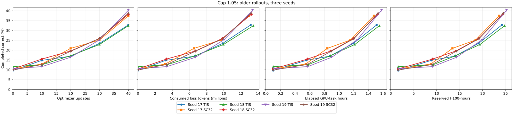
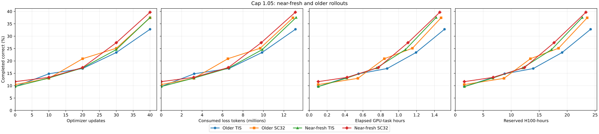
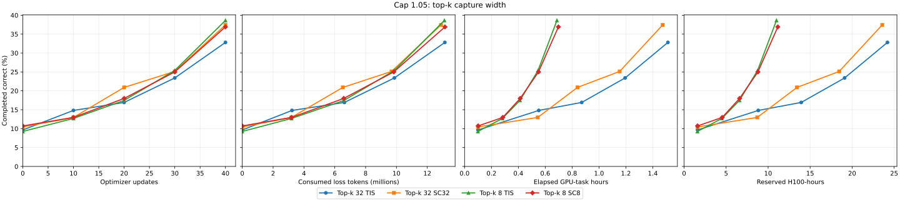
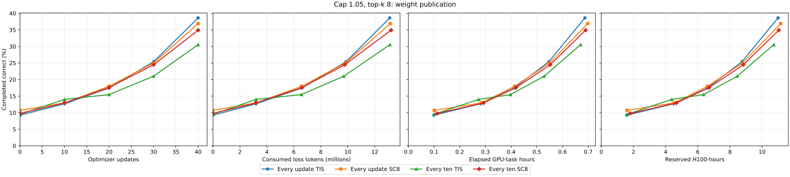
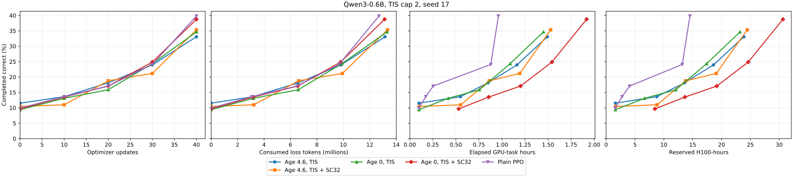
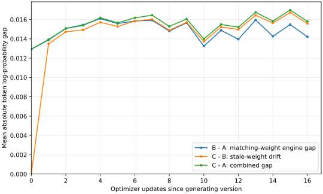
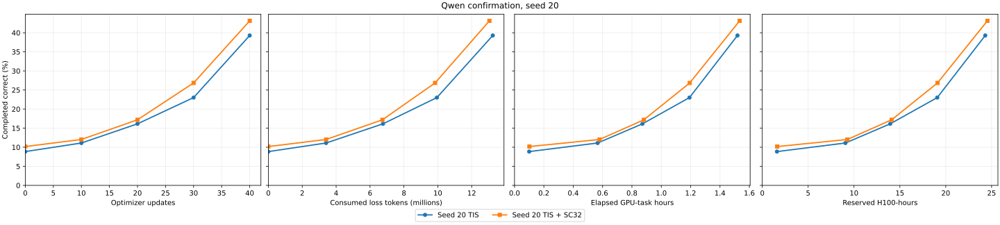
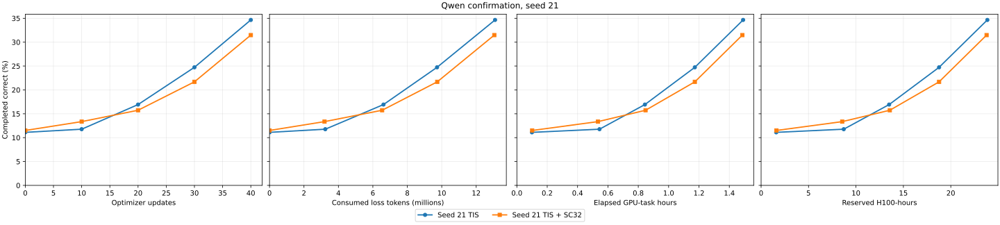
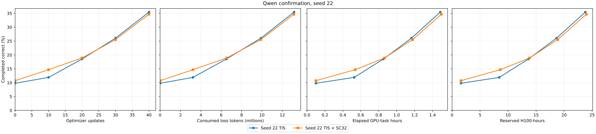

# Score centering in fully asynchronous RL

Study started 2026-09-19. This document records the exact experiment contract and results as
they become available. The question is whether score centering lets the learner use older sampled
tokens without giving up completed-answer quality, and whether that extra tolerance saves time or
GPU work.

## Result and recommendation

The correction runs end to end, but this study does not establish that it makes older
rollouts cheaper at comparable answer quality. At TIS cap 1.05 and top-k 32, three
matched 40-update older-policy seed pairs favored centering by +36.5, +43.5, and
+9.0 completed answers out of 756 when averaging the two evaluations at the same
final weights. The saved final evaluation alone favored it in two of three seeds.
Their average two-pass difference was +29.7 answers; an illustrative 95% Student-t
interval across the three training seeds is -15.6 to +75.0, before uncertainty
about this small-seed interval's assumptions. This is a promising quality signal,
not a reliable improvement estimate.

Three new matched confirmation pairs at the same setting gave +28.5, -23.5,
and -5.5 answers, a mean difference of -0.2 out of 756 (95% paired Student-t
interval -65.8 to +65.4). Adjusting each pair for its step-zero score changed
the mean to -6.8 (interval -64.0 to +50.4). The descriptive mean across all
six seeds is +14.8 (interval -12.6 to +42.1). The original positive signal did
not replicate consistently, and these small intervals do not establish either
a gain or an acceptable bound on quality loss. The matched confirmation arms
consumed almost the same prompts, loss tokens, wall time, and reserved H100 work.

In the near-fresh seed-17 check, centering led by 20 answers across the two final
evaluations but started 15 ahead at step zero. The deliberately delayed top-k-eight
pair consumed tokens at mean age about 8.5 rather than 4.7 updates. Centering led
its matched control by 22 answers across the two final evaluations, but both
delayed arms scored below their every-update-publication counterparts. Delaying
publication shortened median training cycles, yet total time and H100 work through
evaluation remained close to the regular top-k-eight pair. Different generation
timing and repeated-evaluator variation limit these one-seed schedule comparisons.
The aggregate trainer-versus-behavior mean absolute log ratio stayed near 0.015 at
age zero, around 4, and around 8.5 updates. A later matched-weight probe found
that engine and stale-weight differences partly cancel after one update. The
aggregate measurements therefore cannot isolate the source of the gap at older
ages or establish an age-specific centering benefit.

Keep `score_centering_topk=0` as the default. The implementation can support a
controlled follow-up where active TIS and older rollouts are expected, but these
runs do not justify routine adoption or a claim of recovered useful staleness.
Top-k-eight behavior capture cut measured Qwen cost by more than half versus
top-k 32 at the same schedule; its quality effect was inconclusive. The Snowball
pair validated two Megatron optimizer updates with active TIS and finite
correction, but its SC job did not finish terminal export after preemption and
restore failures, so this report makes no Snowball quality claim.
Snowball's mismatch was about 0.034–0.035 with about 9% capped tokens, making a
completed Snowball quality comparison the natural next check. The Qwen result
does not establish the effect in that more active regime.

## Implementation and frozen inputs

- MarinSkyRL branch `goal/score-centering-01a0bb6f`, pinned at
  `a7b51d31d7ed44157219b5852f49ffd69de4038b` by the launcher. Qualification runs r10-r16
  used earlier commit `e3186d29f29bfccddc37bca5c9940231b878761b`; r17 uses
  `c7b4ac4bdd9c57de18f9b01809f082227e2dae06`. The newer commits add tail-mass metrics,
  explicit W&B finish, and an optional delayed weight-publication cadence. The correction applies to the
  regular clipped PPO loss
  with truncated importance sampling (TIS). It uses behavior top-k token probabilities captured by
  the serving engine, plus current and stored-old trainer probabilities for the same token IDs.
  It leaves the sampled-token PPO/TIS term intact and adds a detached, per-token control variate.
  `score_centering_topk=0` disables it.
- Marin launcher branch `goal/score-centering-launcher-01a0bb6f`. Qwen uses one eight-H100
  Megatron learner node and one eight-H100 rollout node with eight independent one-GPU vLLM
  engines. Snowball retains its four learner nodes plus one rollout node.
- The first Qwen qualification uses model artifact
  `models/curriculum-rl-qwen3-0.6b@2026.08.29` and pool artifact
  `documents/curriculum-rl-pool@2026.08.29.1`. The latter has 10,427 training rows and 756
  validation rows, both `reward_spec` and `reward_model`, and a consistent ground truth in each.
  The earlier `2026.08.29` pool lacks `reward_model`, so its AIME rows cannot run in this SkyRL
  environment. The `.1` revision also changed AIME prompt endings to `Answer: <answer>`; later
  matched arms must keep that revision and their evaluation prompt membership fixed.
- The Qwen smoke config has two optimizer updates, 32 prompts per update, four samples per
  prompt, 32 generation workers, an eight-group buffer, and a 1,024-token response cap. It
  disables evaluation to isolate the training path. Qwen's default preset evaluates all 756 held-out
  prompts in batches of 256 every five updates, with one greedy response per prompt. TIS is enabled with cap 2.0.
  The main comparison width is 32; width-8 and width-128 cost controls and capture-only controls
  have completed. All work uses Iris `interactive` priority.

The [resolved run configurations](configs/score_centering/README.md) preserve the exact
materialized Hydra arguments and artifact references for the main Qwen arms and Snowball
smokes. All of these runs pin MarinSkyRL `a7b51d31`. The Marin launcher source bundles were:

| Jobs | Marin commit | Relevant source change |
| --- | --- | --- |
| r19–r23 | `3abefce4f8` | Frozen first 40-update screen |
| r26 | `00d3ce0442` | Same PPO artifact and settings; 256 GB host-memory request for restore |
| r24–r25 | `0674c9300d` | First cap-1.05 pair, 128 GB host-memory request |
| r27–r28 | `d3a120425c` | Second seed, 256 GB host-memory request |
| r29 | `437f37d6d9` | Top-k-one cost control, 256 GB request |
| r30–r31 | `5c43d7bcfb` | Third cap-1.05 seed |
| r32–r33 | `6fbf47d3b8` | Cap-1.05 near-fresh pair; same learner settings as r21–r22 except TIS cap |
| r34–r35 | `16596f4a02` | Cap-1.05 older pair with top-k eight capture and optional SC8 |
| r36–r37 | `09b623bfb8` | Cap-1.05 top-k-eight pair with delayed weight publication |
| Snowball smokes | `6f66ee6c22` | Megatron MoE two-update pair |

For one sampled token, let `q` be the behavior policy that sampled it, `o` the stored trainer
policy at the start of the optimizer update, and `p` the trainer policy being differentiated.
The sampled regular-PPO/TIS score coefficient is `A * min(o/q, cap) * (p/o)` while PPO's
directional clip is inactive, and zero while it is active. The correction adds the behavior
expectation of this coefficient times `log p`, with the coefficient detached. This cancels the
expected sampled score gradient for a constant advantage. With no active clipping or TIS cap,
the coefficient reduces to `p/q`, and exact full-vocabulary centering has zero gradient by the
score identity. The implemented top-k correction uses exact behavior probabilities for the
captured head and models each policy's tail as proportional to `p` while preserving its tail
mass. Every ratio, clip decision, and tail coefficient in the correction is detached; normal
loss masking and distributed token normalization apply to the combined loss.

## Qualification ledger

These are integration probes, not evidence that the correction improves learning. Canceled
failures count toward the campaign's total task cost.

| Probe | Reached GPUs? | Finding |
| --- | --- | --- |
| r1 | No | Role bundles exceeded the declared two-node topology. |
| r2 | Yes | An overly broad exact-evidence preflight rejected the supported single-turn gym path. |
| r3 | Yes | The default W&B entity rejected the campaign credential. |
| r4 | Yes | The credential's login name was not a writable W&B entity. |
| r5 | Yes | vLLM rejected external DP8 for the non-MoE Qwen model. |
| r6 | No | A second topology check still derived eight rollout nodes from eight engines. |
| r7 | Yes | The 2026.08.29 pool lacked AIME's required `reward_model` field. |
| r8 | Yes | The fully async plain-chat HTTP client omitted behavior top-k from request and response. |
| r9 | Yes | Top-k reached Megatron, but selected-logprob gathering assumed padded response positions survived left-padding compaction. |
| r10 | Yes | Two Qwen optimizer updates completed with captured top-k 32, score centering, and exact sampled-token alignment. The terminal HF export is a separate child job. |
| r11 | Yes | Top-k 128 score-centering cost control; two updates trained. Iris later left the second GPU child pending after deleting its pod, so the idle parent was canceled without a terminal export. |
| r12 | Yes | Top-k 32 capture with score centering disabled; succeeded. |
| r13 | Yes | TIS with sampled-token logprobs but no top-k capture; succeeded. |
| r14 | Yes | Full-cap default schedule, TIS plus top-k 32 capture, eight-update age calibration; succeeded with terminal export. |
| r15 | Yes | Full-cap 128-worker, age-limit-eight schedule, TIS plus top-k 32 capture, eight-update age calibration; succeeded with terminal export. |
| r16 | Yes | Top-k 8 score-centering cost control; two updates trained, terminal export not confirmed. |
| r17 | Yes | Explicit W&B finish worked: the primary run reports `finished` and retains step 2. Tail-mass mean telemetry became NaN on padded rows; correction stayed finite. |
| r18 | Yes | Four updates tested finite masked tail-mass telemetry and every-two-step weight publication. |

Iris's `task_attempts` records include every started accelerator attempt, including retries and
killed probes. Summing `(finished_at_ms - started_at_ms) * 8 / 3,600,000` for each eight-H100
child task gives this complete cost ledger through r18. It counts startup, training, in-run
evaluation, terminal export, and failed attempts. CPU-only coordinators contribute no GPU-hours.

| Runs | H100 GPU-hours | Detail |
| --- | ---: | --- |
| r1, r6 | 0.00 | Failed before an accelerator child started. |
| r2–r5, r7–r9 | 9.00 | Failed integration probes, including their retries. |
| r10–r13, r16–r18 | 20.22 | Successful smoke/diagnostic training, plus r11's trained but canceled width-128 control. |
| r14–r15 | 16.31 | Two eight-update full-cap age calibrations. |
| **r1–r18 total** | **45.53** | All completed GPU attempts, regardless of outcome. |

The per-run values, in run order r2–r5 and r7–r18, are 1.244, 0.886, 0.874, 0.954, 1.870,
1.500, 1.673, 3.049, 3.467, 2.936, 2.600, 7.415, 8.892, 2.709, 2.641, and 2.822 GPU-hours.
The raw read-only Iris query was
`SELECT task_id,attempt_id,state,started_at_ms,finished_at_ms FROM task_attempts WHERE task_id LIKE '/romain/score-centering-qwen-%01a0bb6f%' AND task_id LIKE '%/users-%'`.
Only attempts with both timestamps entered the completed ledger; r19–r23 were still running at
this accounting checkpoint.

The r8 retained trajectory archive confirms sampled-token logprobs and exact engine token IDs
reached generation without alignment alerts. It does not contain top-k evidence; the learner
rejected its first batch before an optimizer update. The r8 run is
[tva86i2y](https://wandb.ai/marin-community/marin-async-rl/runs/tva86i2y). Earlier W&B runs
and exact Iris job IDs are retained in the linked Iris parents and artifact records below.

The r10 [Qwen smoke run](https://wandb.ai/marin-community/marin-async-rl/runs/ms580xuq)
trained at token-weighted consumed ages 0 and 1. Its two batches had 116,181 and 122,486
consumed response tokens, 100% sampled-token ID/logprob alignment, no alignment alerts, and
nonzero mean absolute score-centering terms of 1.40e-5 and 1.28e-5 per token. Mean absolute
log(trainer/behavior) was 0.0138 and 0.0160. These small mismatches qualify the mechanics but
do not yet test meaningful older-policy tolerance. The 1,024-token smoke response cap caused
69.5% and 82.8% length stops, so smoke reward cannot be used as the quality comparison. Its
first two measured training cycles took 75.3 and 91.1 seconds, of which weight sync took 24.7
and 30.8 seconds. The cost controls use the same smoke cap and geometry, with [top-k 128 plus
SC](https://wandb.ai/marin-community/marin-async-rl/runs/1pld6uwv) and [top-k 32 capture
only](https://wandb.ai/marin-community/marin-async-rl/runs/iqmow1j2) as separate runs.

Iris reports r10, r12 and r13 successful, with clean checkpoints and exports, but W&B marks
their runs crashed and retains only the first training step. The terminal step is present in
Iris `WANDB_MIRROR` logs. These runs used an older source pin that relied on process teardown to
finish W&B; `c7b4ac4b` explicitly finishes the primary run after fully async trainer teardown.
The Iris mirror and saved evaluation dumps remain the durable measurement sources for the
earlier runs. The r17 top-k 8 smoke verifies the W&B finish fix.

The r17 [W&B run](https://wandb.ai/marin-community/marin-async-rl/runs/ajbwdxcd) reports
`finished` with both optimizer steps after explicit trainer shutdown. Its new tail-mass means are
NaN because padded selected-logprob sentinels entered the telemetry reduction; score-centering
losses and gradients remained finite. Commit `a7b51d31` masks those positions, with a CPU
regression test, and r18 tests it on GPUs.

The first smoke cycle gives a useful collection-cost control at almost equal consumed-token
counts (about 115,000–116,000). TIS without top-k took 21.3 seconds and returned 0.09 MB per
response; top-k 8 with SC took 37.1 seconds and 1.01 MB; top-k 32 capture without SC took
77.0 seconds and 3.49 MB; top-k 32 with SC took 75.3 seconds and 3.50 MB; top-k 128 with SC
took 261.6 seconds and 13.48 MB. These concurrent short runs suggest top-k collection and
transport dominate the correction's incremental learner cost. They do not isolate cluster
contention or predict Snowball throughput. The top-k 8 tail approximation needs a separate
full-vocabulary error measurement before it could replace k32 in a quality run; that measurement
follows here.

`measure_score_centering_tail.py` now compares the implemented proportional-tail coefficient
with an exact full-vocabulary score gradient at the start of a one-pass PPO update (`p=o`). It
uses full Qwen3-0.6B distributions at six positions on each of the first four held-out GSM8K
and Math500 prompts, with the `.08.29` model as behavior `q` and r14's update-8 exported model
as current `p`. On these 48 deterministic contexts, behavior's mean omitted probability was
0.00233 at k8, 0.000297 at k32, and 0.0000748 at k128. The actual checkpoint pair had mean
behavior-weighted absolute log ratio 0.00370 and no behavior mass above the configured TIS cap
2.0. The exact correction gradient and k8/k32/k128 approximation error were zero to numerical
precision in that case. At a diagnostic cap of 1.05, k32's mean L1 gradient error was
4.24e-7, or 0.17% of the mean exact correction L1 norm. This two-checkpoint pair is an offline
test, not the exact behavior/current pair from any one consumed training token.

The training GPU's trainer-versus-behavior absolute log ratio was about 0.016 at measured age
five, so the same script also makes a **synthetic sensitivity check**: it perturbs the real Qwen
full-vocabulary vectors to behavior-weighted absolute log ratios of 0.016 and 0.05, using a
fixed seed per context. At magnitude 0.016 and cap 2.0, k32's mean L1 error was 0.000133,
0.94% of the mean exact correction norm; k8 was 1.46% and k128 0.68%. At cap 1.05, k32's
corresponding error was 0.46%. These are ratios of aggregate means, not per-context maxima.
The synthetic perturbations match only one mismatch statistic and cannot stand in for actual
vLLM/Megatron distribution differences or later generation positions. The
[width-8/32/128 results](results/score_centering_qwen_tail_error_k8_32_128.csv) use r14's
step-zero saved responses; rerun the script against its S3 evaluation root with
`--topk 8 --topk 32 --topk 128` to reproduce them. A rerun against
`qwen-default-set-b2fc0319/2026.09.19.3/exports/dumped_evals/global_step_0_evals`
matched the checked-in CSV byte for byte.

A second run of the same full-vocabulary script added widths one and four and used the first
four response continuations per suite from r19's step-zero evaluation. The eight prompts and
sampled positions match the earlier check, but the generated continuations differ, so their
answer-position distributions differ. At synthetic behavior-weighted mean absolute log ratio
0.016 and TIS cap 1.05, mean L1 gradient error divided by mean exact correction L1 norm was
11.29% at k1, 1.96% at k4, 0.75% at k8, 0.41% at k32, and 0.29% at k128. Mean behavior
tail mass was 0.120, 0.0192, 0.00497, 0.000424, and 0.000116 respectively. On this proxy,
k1 is too coarse for score centering despite being an inexpensive TIS-only collection path;
k8 merits an end-to-end cost and quality check. Its error is still an offline average, not a
guarantee about every training token. The
[width-1/4/8/32/128 results](results/score_centering_qwen_tail_error_k1_4_8_32_128.csv)
use `qwen-default-set-a8761bbb/2026.09.19.6/exports/dumped_evals/global_step_0_evals`
as the evaluation root. Numeric CSV values are rounded to 12 significant digits for the
repository size gate; the summary above was computed before rounding.
These offline errors use float64 and exact omitted-tail sums. The learner instead
uses float32 for ordinary inputs and floors each current, old, and behavior tail
at `1e-6`. In the cap-1.05, calibrated-0.016 rows above, at least one tail is
below that floor in 4, 8, 16, 20, and 23 of 48 contexts at k1, k4, k8, k32,
and k128. Filtering those rows from the checked-in CSV leaves aggregate relative
L1 errors of 13.17%, 2.73%, 1.46%, 0.94%, and 0.77%, respectively. This filter
does not model the floored rows; the CPU small-tail test checks finite float32
behavior against a full-vocabulary gradient there. The reported offline averages
are therefore proxies, not production coefficient errors on near-exhaustive heads.

The full-cap [age-limit-four calibration](https://wandb.ai/marin-community/marin-async-rl/runs/g0iq70y0)
used 64 generation workers. Its token-weighted mean consumed age rose from 0 to 2.72 by update
5 and stayed below age four through update 8, with no stale-group rejection. The
[age-limit-eight calibration](https://wandb.ai/marin-community/marin-async-rl/runs/b61qmnym)
used 128 workers and consumed all update-5 tokens at age four. It took 510 seconds for its first
training cycle, versus 279 seconds for the 64-worker schedule, while using fewer response tokens
in that first batch. Both used TIS and top-k 32 capture without SC and scored 93/756 completed
correct at update 5. At update 8, the age-limit-four run consumed tokens at mean age 2.70 and
scored 85/756 completed correct; the age-limit-eight run consumed tokens at mean age 5.0 and
scored 88/756. Both fell below their update-5 scores, which is why the comparison needs a longer
quality curve. The nominal eight-update step cycles used 3.96 and 5.36 GPU-hours respectively
across 16 allocated H100s, including their in-run evaluations but excluding setup and terminal
export. Iris child-task durations give total accelerator occupancy of 7.42 and 8.89 GPU-hours
respectively, including setup and each eight-GPU terminal export; the parent wall times were
30:55 and 36:38. This establishes age separation but is a scheduling comparison, not an SC
effect estimate.

The resumable checkpoint's `data_consumption_state.pt` identifies consumed prompt UIDs. At
update 5, each calibration had consumed 160 unique prompts, of which 152 were shared
(Jaccard 0.905); the different schedules changed exposure to eight prompts per arm even with
the same seed. `analyze_score_centering_exposure.py` compares such checkpoints at equal steps.
The update-8 terminal checkpoints had already advanced the tracker to a new epoch and cleared
its UID set, so they cannot support an update-8 membership comparison; the script rejects that
empty-set case.

The r18 cadence probe used top-k 8 and SC with a two-update publication interval. Its four
updates published weights after updates 2 and 4; `timing/sync_weights` was zero after updates 1
and 3. Behavior, stored-old, and current top-k tail-mass means were finite, around 0.006–0.008.
Its consumed-token mean age was 0, 1, 2, and 1.53 across the four updates. It qualifies the
implementation of delayed publication; the 1,024-token smoke cap leaves quality uninterpretable.
Iris reports the parent and three accelerator children successful; its total accelerator occupancy
was 2.82 GPU-hours across two eight-GPU training tasks and one eight-GPU export task.

The present one-pass Qwen preset offers little opportunity for SC to change the gradient.
`policy_mini_batch_size=train_batch_size` and `update_epochs_per_batch=1` mean the differentiated
policy `p` equals the stored-old policy `o` during each update. The calibration runs report a
zero `policy/log_ratio_abs_mean`, confirming this on the GPU. Where TIS is uncapped and PPO is
unclipped, the exact score coefficient is `q * (o/q) * (p/o) = p`; its full-vocabulary score
expectation and the implemented head-plus-tail correction have zero gradient. The measured TIS
cap fraction stayed at or below 0.000189 through the eight-update calibrations, including mean
consumed age five. A null effect under this preset would show that the correction is largely
inactive here; it would not establish that SC cannot help when caps or clips are active.
The reported absolute correction *loss value* can still be nonzero from finite-precision
head/tail arithmetic; it is not evidence of a material correction gradient.

## Comparison contract

Each TIS-versus-centering pair held the model, pool, evaluator, optimizer, topology, seed,
generation workers, buffer, weight publication cadence, TIS cap, and top-k capture width fixed.
Separate near-fresh, older, and delayed-publication schedules tested exposure. The cap-2
screen included plain PPO as a current launcher incumbent, though its different behavior
capture means its time and cost comparison is descriptive. The metrics record token-weighted
age from policy-version spans at optimizer consumption, behavior-versus-trainer mismatch,
rejected groups, and correction size. An age limit is an exposure setting, not a measured age.

The primary quality endpoint is a correct answer with an accepted stop reason (`complete`,
`end_turn`, `eos`, or `stop`). Raw reward, completion and length-stop fractions, answer lengths,
and response dumps remain separate. Quality curves use optimizer updates, consumed tokens,
elapsed training time, and full task GPU-hours as distinct axes. Question resampling within one
training seed does not measure between-seed uncertainty.

The logged `completed_stop_score_contribution` is a signed reward contribution, not the binary
completed-correct fraction: Math500 assigns -1 to an incorrect answer. The primary fraction comes
from each dumped response's score and stop reason, after checking that the frozen run does not
reshape correctness rewards. The held-out prompt and ground-truth hash confirms matching
question membership across arms.

The two full-cap calibration runs' step-0 dumps contain 256 GSM8K and 500 Math500 rows each.
Their sorted prompt plus ground-truth SHA-256 is the same,
`448615d2489352d13e1c4e994bfe458485d7503c1076ddf0aa608fd6c637048d`. The age-limit-four
run had 78/756 completed correct (66 GSM8K, 12 Math500); the age-limit-eight run had 76/756
(68 GSM8K, 8 Math500). The accepted stop was `stop` for all completed responses; length stops
were 228 and 236. This step-0 variation occurred before any optimizer update despite the same
model artifact and held-out membership, and should not be mistaken for a training effect.

The Qwen screen led to a two-update Snowball smoke rather than a longer quality comparison.
The schedule and capture changes are reported separately from the correction comparison.
No quality-loss margin or target score was selected, so this study makes no non-inferiority
or time-to-target claim.

The first 40-update screen uses seed 17, an evaluation every ten updates plus step zero and
terminal evaluation, the frozen `.08.29.1` pool and `.08.29` model, and MarinSkyRL
`a7b51d31`. The Iris parent bundles came from Marin commit `3abefce4f8`. All four TIS arms
capture behavior top-k 32, including the SC-disabled controls.
The older schedule uses 128 generation workers, a 32-group buffer, age limit eight, and weight
publication after each update. The near-fresh schedule uses 32 workers, a 16-group buffer, and
age limit zero. The five jobs are:

| Job | Objective | Schedule |
| --- | --- | --- |
| [r19](https://iris.oa.dev/#/job/%2Fromain%2Fscore-centering-qwen-age8-tis-seed17-01a0bb6f-r19) | TIS, SC off | Older |
| [r20](https://iris.oa.dev/#/job/%2Fromain%2Fscore-centering-qwen-age8-sc-seed17-01a0bb6f-r20) | TIS plus SC32 | Older |
| [r21](https://iris.oa.dev/#/job/%2Fromain%2Fscore-centering-qwen-fresh-tis-seed17-01a0bb6f-r21) | TIS, SC off | Near-fresh |
| [r22](https://iris.oa.dev/#/job/%2Fromain%2Fscore-centering-qwen-fresh-sc-seed17-01a0bb6f-r22) | TIS plus SC32 | Near-fresh |
| [r23](https://iris.oa.dev/#/job/%2Fromain%2Fscore-centering-qwen-age8-ppo-seed17-01a0bb6f-r23) | Plain PPO, TIS off | Older |

The async engine's response sampling and GPU scheduling remain nondeterministic, even with a
fixed training seed. The step-zero correct counts in the first four runs differ; comparisons
must include each run's starting point and between-seed uncertainty.

At update 10, the two older-schedule TIS arms each consumed 320 unique prompt UIDs, with exact
set overlap, and both had mean consumed-token age 5.0. Completed correct was 103/756 for TIS
alone (87/756 at step zero) and 83/756 for TIS plus SC32 (79/756 at step zero). Their TIS cap
fractions were near zero through update 10. These are one-seed interim values, with visible
step-zero evaluator variation; they do not establish a quality effect. The near-fresh TIS and
plain-PPO arms also consumed the same first 320 prompt UIDs, despite different realized ages.
At step zero, the older TIS and SC arms used the same 756 held-out prompts and the same starting
model artifact. Their two greedy response dumps agreed on the first eight response characters
for 755 prompts, but only 88 full responses matched exactly and 674 scores agreed. The median
common response prefix was 375 characters. Small generation differences can branch into long,
different solutions; the exact cause of the divergence has not been isolated. A single greedy
pass has visible run-to-run outcome variation here.

The next saved evaluations show 137/756 completed correct for older TIS and 142/756 for older
TIS plus SC32 at update 20; near-fresh TIS had 120/756, and near-fresh SC32 had 102/756 at
update 10 on its retry. Plain PPO had 129/756 at update 20 and 180/756 at update 30. The
older TIS pair's apparent difference changed sign between updates 10 and 20. All five arms
have the same held-out membership hash, but these one-seed curves remain descriptive.

The near-fresh SC arm's first GPU attempt reached update ten, then its checkpoint hit an S3
`OSError` (`errno 16`, "Please reduce your request rate") at 00:03 UTC on September 20. Iris
retried the child, and its second attempt restarted at update zero; the evaluation dump at step
zero was replaced. Attempt number therefore matters when reading the training curve, and total
GPU cost includes both attempts. The plain-PPO arm appeared stalled during its update-30
rank-zero multipart checkpoint upload: part 38 of a 7.15 GB object was the last logged
completion at 00:08:35 UTC, with no logged multipart progress for more than ten minutes.
The full rank-zero shard was actually committed to S3 at 00:18:45 UTC. Iris mirrors show
update 30 completed at 00:19:34 and updates 31–36 by 00:21:04; later log lines report updates
37–38. A preempt request against the federated Iris controller returned success without
changing the child. A direct request to the `cw-rno2a` controller at 00:21 UTC stopped rank
zero and atomically restarted its sibling. This direct preempt interrupted a worker that had
already resumed training. The decision was based on incomplete log visibility and added
avoidable cost; only the step-30 checkpoint was durable, so the later updates were repeated.
Both child tasks entered attempt one. The restart selected that complete checkpoint, then
rank zero was OOM-killed while loading it. A second restore attempt was OOM-killed at the same
point. The peer job was canceled to avoid further repeated GPU use. The Qwen child memory
request was raised from 128 to 256 GB for a continuation with the same artifact address and
settings. The full ledger includes the slow upload, manual interruption, OOM retries, and
continuation.

The continuation [r26](https://iris.oa.dev/#/job/%2Fromain%2Fscore-centering-qwen-age8-ppo-resume-seed17-01a0bb6f-r26)
selected that same step-30 checkpoint and loaded model and optimizer state. Its learner pod
reached 176.9 GB peak cgroup memory during restore, which explains why the 128 GB request failed.
It restored 32 buffered groups, trained updates 31–40, saved the step-40 checkpoint, and dumped
the terminal 756-response evaluation. During shutdown, a trajectory-retention publication
reported a 120-second storage timeout, while the training driver exited with code zero. The
separate terminal model export completed at `exports/global_step_40/policy/model.safetensors`
(1.503 GB), and the Iris parent succeeded. The combined r23+r26 ledger has nine accelerator
attempts, including the export, and 15.366 reserved H100-hours in total.

A second older-schedule pair launched on September 20 with TIS cap 1.05, the same seed and
schedule, and behavior top-k 32 in both arms. This deliberately activates more capped tokens
than the cap-2 screen; it is a distinct objective comparison. The Iris parents are
[r24](https://iris.oa.dev/#/job/%2Fromain%2Fscore-centering-qwen-age8-tis-cap105-seed17-01a0bb6f-r24)
and [r25](https://iris.oa.dev/#/job/%2Fromain%2Fscore-centering-qwen-age8-sc-cap105-seed17-01a0bb6f-r25).
Their children use `iris-interactive` GPU pods.
Their step-zero completed-correct counts were 73/756 for TIS and 79/756 for TIS plus SC32.
At the first learner update, 4.57% and 4.61% of sampled tokens respectively hit the TIS cap,
compared with near-zero cap fractions in the cap-2 screen. The SC arm logged 0.00315 mean
absolute correction loss value. This confirms that the new cap changes the active objective,
but the loss value alone does not quantify the correction gradient or a quality effect.
At update two the cap fractions remained 4.97% and 4.88%, with mean consumed-token age one.
By update eight, both arms consumed tokens at mean age near five, and about 5.6% of sampled
tokens hit the cap. Their step-10 checkpoint UID sets each contained 320 consumed prompts,
with 318 in common (Jaccard 0.988). The first post-training evaluation was 112/756 completed
correct for TIS and 98/756 for TIS plus SC32, versus step-zero counts 73 and 79. A single
early difference does not establish a quality effect or stability.
At update 20, TIS had 128/756 completed correct and TIS plus SC32 had 158/756. Relative to
their own step-zero counts, those arms gained 55 and 79 correct answers. The apparent
SC difference thus changed sign between updates 10 and 20. Their update-20 checkpoints each
recorded 640 consumed prompt UIDs and shared 639 (Jaccard 0.997). Through their first 24–25
updates, both arms consumed tokens at mean age about 4.4 and capped about 5.3% of tokens.
At update 30, their completed-correct counts were 177 and 190. At the prespecified update-40
endpoint, TIS had 248/756 completed correct and TIS plus SC32 had 283/756. Relative to each
arm's own step-zero count, the gains were 175 and 204, a baseline-adjusted difference of 29
answers in this seed. The pair used 24.20 and 23.58 reserved H100-hours, respectively, through
the terminal evaluation, with 1.51 and 1.47 hours since their first GPU tasks; full job costs,
including export, were 25.26 and 24.54 H100-hours. Across all 40 updates their
token-weighted mean consumed ages were both 4.72, and 5.33% and 5.39% of tokens hit the TIS
cap. The difference can still reflect asynchronous sampling and evaluator variation; two
further seed comparisons follow.
The terminal consumed-prompt trackers contain exactly the same 1,280 unique prompt UIDs in
both seed-17 arms (Jaccard 1.0). The top-k-one control r29 consumed that same UID set despite
its faster collection path. Prompt membership therefore does not explain their endpoint
differences, though sampled completions, truncation, and optimizer timing still can.
A second matched seed-18 pair, [r27](https://iris.oa.dev/#/job/%2Fromain%2Fscore-centering-qwen-age8-tis-cap105-seed18-01a0bb6f-r27)
and [r28](https://iris.oa.dev/#/job/%2Fromain%2Fscore-centering-qwen-age8-sc-cap105-seed18-01a0bb6f-r28),
uses the same settings and 256 GB host request. Its step-zero completed-correct counts are
88/756 and 79/756; both have the same held-out membership as seed 17. At update 10, the
counts were 95 and 117, with each arm consuming 320 prompt UIDs and 318 in common. Their
update-20 counts were 130 and 148, and update-30 counts were 173 and 196. At the prespecified
update-40 endpoint, TIS had 245/756 completed correct and TIS plus SC32 had 289/756. Their
step-zero-adjusted gains were 157 and 210, a paired difference of 53 answers. Mean consumed
ages across all 40 updates were 4.70 and 4.71, with 5.38% and 5.50% of tokens hitting the
TIS cap. Both arms consumed about 13.2–13.4 million loss tokens. Through terminal evaluation,
the TIS and SC arms used 24.80 and 24.41 H100-hours, respectively; full jobs, including export,
used 25.64 and 25.50 H100-hours. These two final saved comparisons favor SC; the third pair
below reverses that result. Their terminal
consumed-prompt trackers also match exactly within the seed-18 pair: 1,280 unique UIDs in each.
The two seed-18 arms share only 161 of those UIDs with the seed-17 set, as expected from a
different shuffled training seed. The [terminal exposure comparisons](results/score_centering_terminal_exposure_seed17_18.csv)
include both matched pairs and the top-k-one control. New launches were held
when cluster use rose to 504/512 H100s with zero queued workloads at 00:59 UTC.
A third matched seed-19 pair started after capacity returned to 284/512 H100s with no queued
workloads: [TIS r30](https://iris.oa.dev/#/job/%2Fromain%2Fscore-centering-qwen-age8-tis-cap105-seed19-01a0bb6f-r30)
and [TIS plus SC32 r31](https://iris.oa.dev/#/job/%2Fromain%2Fscore-centering-qwen-age8-sc-cap105-seed19-01a0bb6f-r31).
Both use the same cap-1.05 configuration, 40-update endpoint, frozen model and pool, and
`iris-interactive` accelerator pods. Their step-zero completed-correct counts were 80 and
75. At updates ten and twenty, TIS had 88 and 124 completed correct, while SC32 had 96 and
147. At update thirty, counts were 191 and 196. The final saved update-40 dumps scored TIS
304/756 and SC32 293/756, a raw SC difference of -11 and step-zero-adjusted difference of -6.
Their token-weighted consumed ages were 4.68 and 4.69; 5.44% and 5.49% of sampled tokens hit
the TIS cap. Both arms consumed about 13.2–13.3 million loss tokens. Median inclusive cycles
were 89.71 and 83.71 seconds. Through the final evaluation they used 25.20 and 24.49 reserved
H100-hours, with 1.58 and 1.53 elapsed hours. Their
[terminal prompt UID sets](results/score_centering_terminal_exposure_seed19.csv) also match
exactly: 1,280 unique UIDs in each arm. Both exports succeeded; full-run costs were
26.10 and 25.40 H100-hours.

SkyRL evaluates update 40 twice at the same weights. The first scheduled score remains in
the train mirror; the finalization score is saved with the response dump. The
[repeat-evaluation ledger](results/score_centering_terminal_repeat_evals.csv) checks each
reconstructed final count against the saved responses. All counts below are completed correct
out of the same 756 held-out questions.

| Training seed | Step zero TIS / SC32 | Scheduled update 40 TIS / SC32 | Saved final update 40 TIS / SC32 | Two-pass mean SC32 minus TIS |
| --- | ---: | ---: | ---: | ---: |
| 17 | 73 / 79 | 275 / 313 | 248 / 283 | +36.5 |
| 18 | 88 / 79 | 233 / 276 | 245 / 289 | +43.5 |
| 19 | 80 / 75 | 283 / 312 | 304 / 293 | +9.0 |

The saved final pass favors SC32 in two seeds and TIS in one. Averaging the two same-checkpoint
passes favors SC32 in all three, but the second pass changes a single arm by as many as 30
correct answers among the earlier completed runs and 21 in seed 19. These are only three
training seeds and two evaluator passes per final checkpoint. The paired mean of +29.7
completed answers has a three-seed 95% Student-t interval of −15.6 to +75.0 answers.
The baseline-adjusted mean is +32.3 with an interval of −15.6 to +80.3. These use
the sample mean plus or minus 4.30265 times the sample standard deviation divided
by √3. They describe training-seed variation in only three pairs; the two evaluator
passes within each checkpoint do not count as additional training seeds. The result
is an exploratory signal, not a stable improvement or a benefit caused specifically
by policy age. Resampling held-out questions would measure a different uncertainty
than training-run or evaluator variation.

A near-fresh cap-1.05 pair, [TIS r32](https://iris.oa.dev/#/job/%2Fromain%2Fscore-centering-qwen-fresh-tis-cap105-seed17-01a0bb6f-r32)
and [TIS plus SC32 r33](https://iris.oa.dev/#/job/%2Fromain%2Fscore-centering-qwen-fresh-sc-cap105-seed17-01a0bb6f-r33),
uses the same seed, model, pool, active TIS cap, top-k capture, 40-update horizon, and
evaluation contract as the older seed-17 pair. It sets maximum consumed age zero, 32
generation workers, and a 16-group buffer, matching the cap-2 near-fresh screen. Their GPU
children were admitted at `iris-interactive` priority. This pair tests whether an
apparent SC advantage persists without aged rollouts while keeping the objective fixed
within the pair.
Their step-zero completed-correct counts were 73/756 for TIS and 88/756 for SC32. At update
ten, the counts were 99 and 101; at update 20 they were 130 and 131; and at update 30 they
were 186 and 207. The scheduled update-40 evaluations scored 275 and 299, and the saved
final evaluations scored 284 and 300. The two-pass mean SC lead was 20 answers, or five
after subtracting the 15-answer step-zero lead. Through final evaluation the TIS and SC
arms used 22.70 and 23.35 reserved H100-hours and 1.419 and 1.460 elapsed hours.
Their terminal exports succeeded; full-run costs were 23.49 and 24.10 H100-hours.
The arms consumed exactly the same 1,280 prompt UIDs as each other and as the older seed-17 arms;
the [terminal exposure ledger](results/score_centering_terminal_exposure_seed17_schedules.csv)
contains every cross-schedule comparison. Across all 40 updates, their token-weighted
consumed ages were zero, their TIS cap fractions were 5.21% and 5.23%, and their
behavior-versus-trainer mean absolute log ratios were 0.01497 and 0.01510. Across the
first nine updates,
both arms consumed tokens at measured age zero, while 5.28% and 5.29% of sampled tokens still
hit the active TIS cap. Their behavior-versus-trainer mean absolute log ratios were 0.01532
and 0.01536, essentially the same as 0.01539 and 0.01545 in the older seed-17 arms' first
nine updates despite mean token age 3.66–3.68 there. Across all 40 older updates the mismatch
stayed near 0.0153. Thus the cap also acts on vLLM-versus-learner mismatch at age zero, and
the existing age separation does not establish a comparably large distribution-mismatch
separation. The near-fresh comparison therefore cannot isolate an age-specific SC benefit.

A narrower behavior-capture pair, [TIS r34](https://iris.oa.dev/#/job/%2Fromain%2Fscore-centering-qwen-age8-tis-cap105-topk8-seed17-01a0bb6f-r34)
and [TIS plus SC8 r35](https://iris.oa.dev/#/job/%2Fromain%2Fscore-centering-qwen-age8-sc-cap105-topk8-seed17-01a0bb6f-r35),
keeps the older seed-17 cap-1.05 schedule and changes behavior-logprob capture from top-k 32
to top-k eight in both arms. The SC arm uses the matching correction width eight. It isolates
SC within the narrow-capture pair and measures whether the cheaper capture path preserves the
older pair's quality signal. All four accelerator tasks were admitted at `iris-interactive`
priority. At updates zero, ten, twenty, thirty, and forty, TIS completed-correct counts were
70, 96, 132, 192, and **292**; SC8 counts were 81, 98, 136, 189, and **279**. Both arms consumed
the [same 1,280 prompt UIDs](results/score_centering_terminal_exposure_topk8.csv), also
identical to the seed-17 top-k-32 pair. Yet evaluation variation changes this comparison's
sign at the same final weights: the scheduled step-40 evaluations scored TIS/SC8 **278/292**,
while the finalization evaluations saved to the response dumps scored **292/279**. The final
SC8 difference is -13 raw and -24 after subtracting its 11-answer step-zero lead; the
scheduled difference was +14 raw. This one pair therefore does not identify a quality effect
from a narrower correction. Across its first seven unique learner updates, both arms consumed
tokens at mean age about 3.3 and capped about 5.3% of tokens, with no TIS-skipped batch. Median
inclusive cycles were 41.9 and 39.7 seconds, and bridge responses averaged 2.59 and 2.62 MB.
Across all 40 updates, token-weighted ages were 4.72 in both arms, active-cap fractions were
5.43% and 5.39%, and consumed loss tokens were 13.11 and 13.15 million. Median inclusive
cycles were 37.56 and 39.52 seconds, compared with 86.13 and 81.02 seconds for the seed-17
top-k-32 pair. Through the final evaluation, the top-k-eight arms took 0.687 and 0.698 elapsed
hours and 10.99 and 11.16 reserved H100-hours. The top-k-32 arms took 1.512 and 1.474 hours
and 24.20 and 23.58 H100-hours. Thus narrower behavior capture more than halved measured
time and GPU work in this schedule; its quality comparison remains sensitive to evaluation
variation. Both exports succeeded; full-run costs were 11.77 and 12.03 H100-hours.

The cap-1.05 top-k-eight delayed-publication pair, [TIS r36](https://iris-cw-rno2a.oa.dev/#/job/%2Fromain%2Fusers-romain-checkpoints-async-rl-qwen-default-set-7a08fd68-2026.09.20.5-ecc74beeec58)
and [TIS plus SC8 r37](https://iris-cw-rno2a.oa.dev/#/job/%2Fromain%2Fusers-romain-checkpoints-async-rl-qwen-default-set-c776578e-2026.09.20.5-6e92378f4f0b),
started on September 20 with the same seed, data, 40-update endpoint, 16 H100s per arm, and
`iris-interactive` GPU pods. The [resolved configurations](configs/score_centering/README.md)
differ within the pair only in the SC switch. Relative to r34/r35, the maximum admitted
version age rises from eight to 16 updates, and inference weights are published every ten
updates instead of every update; evaluations at updates ten, twenty, thirty, and forty also
require the latest weights. The purpose is to measure whether the observed learner-versus-
behavior log-probability mismatch rises with deliberate publication delay and whether SC helps
under that larger drift. Initial remote coordinator attempts failed before reaching GPUs
because those pods lacked S3 credentials; the authenticated local launcher submitted the
linked GPU jobs directly.

Both arms reached 40 optimizer updates and saved two terminal evaluations. Their step-zero
completed-correct counts were 72 for TIS and 74 for SC8. At updates ten, twenty, and thirty,
the counts were 106/98, 117/133, and 159/185. The scheduled update-40 pass scored 233/244;
the saved final pass scored 231/264. Thus the raw SC lead was 11 and 33 answers across the
two passes, or 22 on average; subtracting the two-answer step-zero lead gives 20. All eight
seed-17 schedule and capture arms consumed exactly the same 1,280 prompt UIDs. The
[response analysis](results/score_centering_qwen_cap105_evals.csv), [per-update metrics](results/score_centering_qwen_cap105_metrics.csv),
[task costs](results/score_centering_qwen_cap105_cost.csv), and
[terminal repeat ledger](results/score_centering_terminal_repeat_evals.csv) contain the
individual observations. The per-update ledger also retains policy entropy from the
training mirrors for later analysis.

The delayed TIS and SC8 arms consumed tokens at token-weighted mean ages 8.47 and 8.50,
versus 4.72 in both every-update-publication top-k-eight arms. Their behavior-versus-trainer
mean absolute log ratios were 0.01561 and 0.01575, while the every-update controls were
0.01636 and 0.01546. These small and inconsistent differences do not establish a
substantially larger distribution mismatch despite the larger version age. Active TIS caps
covered 5.55% and 5.62% of delayed tokens, versus 5.43% and 5.39% in the controls; neither
schedule rejected stale groups. Median inclusive training cycles fell from 37.56/39.52
seconds in the every-update top-k-eight pair to 22.50/26.30 seconds with delayed
publication. Through final evaluation, however, elapsed time was 0.671/0.690 hours and
reserved work 10.73/11.04 H100-hours, close to 0.687/0.698 hours and 10.99/11.16 H100-hours
with every-update publication. Setup, evaluations, and checkpoints consume part of the job
independent of median training-cycle speed. Both delayed arms finished below their
every-update-publication counterparts at the saved endpoint (231 versus 292 for TIS,
264 versus 279 for SC8), so this one-seed schedule change did not establish a useful
quality-per-cost gain. The delayed SC job's second GPU pod was deleted during teardown
after the terminal response dump was saved. Iris left that task pending; the idle parent
was canceled after confirming the final response and step-40 checkpoint were durable.
The delayed TIS arm completed terminal export and cost 11.45 H100-hours in total. The
delayed SC arm used 11.34 H100-hours through cancellation, without a terminal export;
those full-job totals are not equal deliverables.

`analyze_score_centering.py` reads every dumped evaluation response and the durable Iris
`WANDB_MIRROR` lines. It writes separate CSV files for completion-aware quality and per-update
age, mismatch, consumed tokens, cycle time, and nominal GPU-hours across inclusive step cycles.
When Iris retries a GPU child, a repeated optimizer step uses the later attempt's mirror.
Repeated `--iris-log` inputs in job order also let the PPO analysis select r26's updates
31–40 over r23's interrupted post-checkpoint updates. Identical mirrored lines are
deduplicated. The metrics CSV records both the selected job index and attempt number.
The step-cycle cost includes in-run evaluation and checkpointing but excludes setup, terminal
export, and failed attempts; those require Iris task durations in the total-cost table. The
script checks that prompt and ground-truth membership
match at every evaluation step and across the compared runs.

The evaluation CSV also records the UTC write time of each aggregate dump. The separate
`analyze_score_centering_cost.py` joins those times to a read-only Iris `task_attempts` CSV,
using the exact parent job prefix for each run. For the PPO arm it joins both r23 and r26.
It computes elapsed time from the first GPU task start and reserved H100-hours through each
evaluation. It includes retries and failed attempts, while excluding a later export from an
earlier evaluation's cost. Full-run H100-hours appear only after all matched attempts finish.
The raw Iris query and the eight-GPU-per-child assumption are stated above. This GPU task clock
does not include time spent queued before the first accelerator task started.

At `max_steps`, SkyRL runs both the scheduled step-end evaluation and a finalization evaluation
at the same weights. The latter overwrites the same step-40 response paths. Terminal quality
and cost in this report use the **final saved** response dump after finalization; an interim
read during the first write is not a terminal endpoint. For example, r28's scheduled evaluation
dump at 02:16:21 UTC had 276/756 completed correct, while its finalization dump at 02:17:05
UTC had 289/756, with no intervening optimizer update. This same-checkpoint variation is a
direct reason to avoid interpreting small single-run score differences as training effects.
For this frozen pool, GSM8K rewards are zero or one and Math500 rewards are minus one or one.
`analyze_score_centering_terminal_repeats.py` recovers each suite's completed-correct count
from its completed-stop fraction and signed reward contribution, then checks the final mirror
against the saved responses. Across 18 completed arms, the two evaluations at fixed weights
differed by 14.6 correct answers on average in absolute value, with a maximum difference of 30.
The [paired-evaluation CSV](results/score_centering_terminal_repeat_evals.csv) preserves each
count. The cap-1.05 comparisons show how the choice of terminal pass can change an inference:

| Schedule and seed | Scheduled TIS / SC | Final TIS / SC | SC minus TIS, scheduled / final |
| --- | ---: | ---: | ---: |
| Older, top-k 32, seed 17 | 275 / 313 | 248 / 283 | +38 / +35 |
| Older, top-k 32, seed 18 | 233 / 276 | 245 / 289 | +43 / +44 |
| Older, top-k 32, seed 19 | 283 / 312 | 304 / 293 | +29 / -11 |
| Near-fresh, top-k 32, seed 17 | 275 / 299 | 284 / 300 | +24 / +16 |
| Older, top-k eight, seed 17 | 278 / 292 | 292 / 279 | +14 / -13 |
| Delayed publication, top-k eight, seed 17 | 233 / 244 | 231 / 264 | +11 / +33 |

By contrast, the near-fresh cap-2 pair changed from 289 / 278 in the scheduled pass to
262 / 293 in finalization, reversing the apparent sign. These are repeated evaluator passes,
not independent training seeds. They narrow one source of ambiguity but do not establish a
staleness-specific benefit.

At the cap-2 screen's update-30 checkpoint, the comparable points were:

| Arm | Completed correct / 756 | Hours since first GPU task | Reserved H100-hours through evaluation |
| --- | ---: | ---: | ---: |
| Older TIS, cap 2 (r19) | 181 | 1.16 | 18.60 |
| Older TIS plus SC32, cap 2 (r20) | 160 | 1.19 | 19.09 |
| Near-fresh TIS, cap 2 (r21) | 184 | 1.09 | 17.43 |
| Plain PPO (r23 + r26) | 182 | 0.88 | 13.19 |

The plain-PPO step-30 evaluation was rewritten after its failed restore attempts, so this
reported point includes their elapsed time and GPU cost. It later reached 301/756 completed
correct at update 40 after 0.96 hours and 14.52 reserved H100-hours from the first GPU task.
All five cap-2 arms have update-40 evaluation dumps. Their results are:

| Arm | Completed correct / 756 | Consumed loss tokens (M) | Hours to evaluation | H100-hours to evaluation | Total observed H100-hours |
| --- | ---: | ---: | ---: | ---: | ---: |
| Older TIS, cap 2 (r19) | 250 | 13.150 | 1.49 | 23.87 | 24.22 |
| Older TIS plus SC32, cap 2 (r20) | 267 | 13.342 | 1.53 | 24.45 | 25.32 |
| Near-fresh TIS, cap 2 (r21) | 262 | 13.301 | 1.45 | 23.21 | 24.03 |
| Near-fresh TIS plus SC32, cap 2 (r22) | 293 | 13.125 | 1.92 | 30.65 | 31.82 |
| Plain PPO (r23 + r26) | 301 | 12.700 | 0.96 | 14.52 | 15.37 |

The r19 training pod saved its final response dump, but a peer pod was deleted during
teardown. Iris left that task pending until the idle parent was canceled during the final
campaign audit. Its 24.22 H100-hours include the GPU tasks through that teardown and no
terminal model export. The other four totals include export, so compare the columns through
evaluation for equal deliverables. The r22 ledger includes its failed first attempt and
successful retry. The quality counts
come from the saved response dumps, with the same 756-prompt membership hash in every arm.
The figure below plots the same primary measure against updates, consumed loss tokens, elapsed
GPU-task time, and reserved H100-hours. The underlying [evaluation](results/score_centering_qwen_cap2_evals.csv),
[training metric](results/score_centering_qwen_cap2_metrics.csv), and
[cost](results/score_centering_qwen_cap2_cost.csv) CSVs are checked in beside the analysis code.
The training CSV also retains policy entropy at every update.

The two older TIS arms had mean consumed-token age 4.62 across updates, versus zero for the
near-fresh arms. Their TIS cap fractions averaged about 0.001% and never exceeded 0.011%; the
SC arm's absolute correction loss value averaged about 3e-5. At update 30, older TIS,
near-fresh TIS, and plain PPO had consumed exactly the same 960 prompt UIDs. Older SC shared
959 of its 960 prompts with them (Jaccard 0.998). Thus prompt membership barely differs, but
the generation and optimizer paths still vary across asynchronous runs. The cap-2 TIS control
and SC arm changed order repeatedly along the quality curve; the final 15-answer spread is
not evidence of a meaningful correction gradient under this nearly uncapped objective. The
near-fresh SC arm's terminal 31-answer lead over its near-fresh TIS control is subject to the
same limitation and to its extra retry.

The older-schedule captured TIS arms returned roughly 8.9–9.0 MB per inference-bridge response
and had median inclusive update cycles of 84–91 seconds. Plain PPO returned about 0.21 MB and had a
15.5-second median cycle in its original and resumed training segments. This contrasts the
current TIS-plus-top-k collection path with plain PPO. A narrower top-k-one TIS control,
[r29](https://iris.oa.dev/#/job/%2Fromain%2Fscore-centering-qwen-age8-tis-topk1-seed17-01a0bb6f-r29),
was launched with the same seed, age schedule, TIS cap 2, and 40-update budget as r19. It
changes the requested behavior-logprob width from 32 to one; a later launcher commit also
raised the pod's host-memory request from 128 to 256 GB after a separate checkpoint-restore
failure. Its first nine updates had median inclusive cycles of 20.66 seconds, compared with
84.26 seconds in r19, and mean inference-bridge response sizes of 0.720 MB versus 9.378 MB.
Mean consumed-token age was 3.32 versus 3.29 in those same early updates. Both arms had zero
TIS skipped fraction and zero batches without sampled-token logprobs. Their step-zero
completed-correct counts were both 87/756. At updates 10, 20, 30, and 40, r29 scored 99,
135, 209, and 279/756, versus r19's 103, 137, 181, and 250/756. The top-k-one run reached
its terminal evaluation in 0.63 elapsed GPU-task hours and 10.07 reserved H100-hours, versus
1.49 hours and 23.87 H100-hours for top-k 32. It consumed 13.12 million loss tokens at mean
age 4.78, versus 13.15 million at mean age 4.62 for r19. The changed capture width also changes
asynchronous generation speed and therefore policy-age exposure; these quality counts do not
isolate the effect of width on learning. The near-2.4-fold cost reduction through evaluation,
plus the 13-fold smaller bridge responses, identify wide behavior-logprob capture as a major
cost in this implementation. The r29 job succeeded with terminal export and used 12.23
reserved H100-hours in total. The r19 parent was canceled after its saved final evaluation;
its 24.22 H100-hours exclude export and are not a like-for-like full-job comparison.
`plot_score_centering.py` draws the completed-correct curve
against updates, consumed loss tokens, elapsed task time, and reserved H100-hours from the
three analysis CSVs. These descriptive comparisons do not identify a score-centering quality
effect or prove a plain-PPO advantage across training seeds.

The supported Snowball Megatron recipe permits a separate MoE integration check with the same
SC implementation. A matched two-update TIS and TIS-plus-SC32 smoke pair started in
`cw-us-east-02a` on September 20, each using five eight-H100 nodes at `iris-interactive`
priority, the adopted Snowball SFT export `2026.08.30`, pool `2026.08.29.1`, seed 17,
TIS cap 1.05, top-k 32 behavior capture, and age limit eight. Their Iris parents are
[TIS](https://iris-cw-us-east-02a.oa.dev/#/job/%2Fromain%2Fusers-romain-checkpoints-async-rl-snowball-smoke-set-399c37f1-2026.09.20.1-918d8daf4d8c)
and [TIS plus SC32](https://iris-cw-us-east-02a.oa.dev/#/job/%2Fromain%2Fusers-romain-checkpoints-async-rl-snowball-smoke-set-81e8344e-2026.09.20.1-29e2743294fb).
The [per-update metrics](results/score_centering_snowball_smoke_metrics.csv) preserve the four
W&B history rows, and the [task-attempt cost ledger](results/score_centering_snowball_smoke_cost.csv)
preserves Iris start and finish times for all five nodes and every attempt.
Both arms completed two Megatron updates. The TIS cap was active for 8.98% and 8.92% of sampled
tokens in the control's two updates, and 8.87% and 9.03% in the SC arm; mean absolute
trainer-versus-behavior log ratios stayed near 0.034–0.035. Neither arm skipped TIS or lacked
sampled-token logprobs. The SC arm's mean absolute correction loss values were 0.00253 and
0.00248, and its behavior top-k-32 tail masses averaged 0.00293 and 0.00284. All four raw
gradient norms were finite. The first inclusive update took 426 seconds for TIS and 443 seconds
for TIS plus SC32; the second took 673 and 653 seconds, respectively. The second policy-training
substage took 19.75 and 20.12 seconds. Different sampled lengths and concurrent storage work
prevent a clean incremental-cost estimate from two batches. The 1,024-token smoke response cap
caused 66–72% length stops, so these runs are for wiring, not answer-quality comparison. The
control job succeeded and used 24.02 reserved H100-hours. The SC job completed both optimizer
updates and a durable global-step-two checkpoint before Iris system-preempted its rank-zero pod
(`PodDeleted`); its four siblings were coscheduled for restart. The first restore attempt failed
while downloading policy weights from S3 with `[Errno 16] Please reduce your request rate`.
The next attempt loaded trainer and dataloader state and reached the Megatron optimizer restore,
then ran out of GPU memory while allocating 26 MiB with about 7 MiB free on an H100. We stopped
further retries after that repeatable restore failure. The SC job is therefore a successful
two-update integration check with a failed terminal restore/export, not a completed training job;
its three attempts consumed 50.77 reserved H100-hours. The older curriculum Snowball launcher
uses FSDP2; this fully async experiment launcher uses Megatron and does not require an FSDP2
port.

A separate [model-only recovery job](https://iris-cw-us-east-02a.oa.dev/#/job/%2Fromain%2Fscore-centering-snowball-sc-export-recovery-01a0bb6f)
loaded the saved SC step-two policy without constructing the optimizer and
successfully exported it with MarinSkyRL `78a2fe8f`. The verified HF export at
`s3://marin-us-east-02a/marin/users/romain/checkpoints/async-rl/snowball-smoke-set-81e8344e/2026.09.20.1/exports/global_step_2/policy`
contains 39 weight shards, the index, model configuration, and tokenizer.
All four eight-H100 tasks succeeded with no retry or preemption. Their task
durations total 17.42 reserved H100-hours, including initialization, checkpoint
read, conversion, and upload. This salvages a final model for evaluation, but
does not show that the full optimizer checkpoint can resume training.

A full-optimizer [resume smoke r4](https://iris-cw-us-east-02a.oa.dev/#/job/%2Fromain%2Fscore-centering-snowball-resume-smoke-01a0bb6f-r4)
with MarinSkyRL `cfb407cc` loaded the original step-two policy and optimizer
checkpoint. The restore-only optimizer offload added in that revision took
6.53 seconds, the full checkpoint load took 1,697.19 seconds including S3
download, and optimizer backload took 5.64 seconds. It restored 32 buffered
groups, generated a new 512-response batch, and completed optimizer step
three at 21:20:00 UTC, September 20. This demonstrates an actual resumed
training update after the earlier GPU-memory restore failure. The terminal
step-three save then failed: Ray killed a policy worker when its node used
1,712.42 of the 1,800 GB task memory limit, above Ray's 95% threshold.
The save failure is host-memory pressure, separate from the resolved GPU
restore problem. No step-three checkpoint or terminal export is claimed.
A 2,000 GB retry, r5, was canceled before any GPU task started: Kueue could
not fit five tasks because the free H100 nodes had about 1,999.5 GiB each
after existing memory requests. The [same-source, three-step r6 retry](https://iris-cw-us-east-02a.oa.dev/#/job/%2Fromain%2Fscore-centering-snowball-resume-smoke-01a0bb6f-r6)
used MarinSkyRL `cd040079` and requested 1,980 GB per GPU task. It restored
the full optimizer and completed another update, then reached the new Ray
95% kill threshold of 1,881 GB during the full-optimizer save. The later
DP-local save qualification below addresses that specific failure.

## Matched-weight Qwen mismatch probe

This two-update probe separates the inference-engine gap from one optimizer update of
policy movement. It is a calibration, not a score-centering quality comparison.
The [GPU job](https://iris-cw-rno2a.oa.dev/#/job/%2Fromain%2Fusers-romain-checkpoints-async-rl-qwen-smoke-set-02747901-2026.09.20.6-e9656d108b01)
and its terminal model export succeeded. The [W&B run](https://wandb.ai/marin-community/marin-async-rl/runs/1392zq9e)
holds the per-step training metrics. The durable raw records are
`s3://marin-us-east-02a/marin/users/romain/checkpoints/async-rl/qwen-smoke-set-02747901/2026.09.20.6/exports/mismatch_decomposition/global_step_{1,2}.json.gz`.
The job used MarinSkyRL `e291ade790a7046f77ab18d8c96ecbc7c5185895`,
Qwen3-0.6B artifact `2026.08.29`, pool `2026.08.29.1`, seed 17, 32 prompts and
four responses per update, a 1,024-token response cap, TIS cap 1.05, and top-k-one
sampled-token probability capture. Both KL flags and score centering were off.

For each sampled token, A is its actual vLLM log probability, B is a frozen
Megatron reference actor initialized from the same model as the initial policy,
and C is the consuming Megatron policy actor. The inference sampler used
temperature 1, top-p 1, no top-k or min-p restriction, and repetition penalty 1;
these settings leave the sampled-token probability untransformed. The probe
checks the token IDs against the trainer sequence, response mask, and loss mask,
then applies each token's recorded policy-version span. The initial weight sync
publishes version 0; each later published version equals the number of completed
optimizer updates. Thus a token from version 0 consumed at step 2 has age one.
Only version-0 tokens are compared with this frozen B. Other versions are counted
and excluded from the decomposition. All selected tokens in this short run were
version 0; no response crossed a version boundary.

| Consuming step / age | Tokens | Mean absolute B − A | Mean absolute C − B | Mean absolute C − A | Opposite-sign terms | TIS cap active |
| --- | ---: | ---: | ---: | ---: | ---: | ---: |
| 1 / 0 | 116,076 | 0.01376 | 0 | 0.01376 | 0% | 4.95% |
| 2 / 1 | 119,936 | 0.01609 | 0.01574 | 0.01596 | 61.69% | 5.78% |

The signed means at step 2 are −0.000618 for B − A, +0.000167 for C − B,
and −0.000451 for C − A. On the same tokens, mean canceled absolute magnitude
is 0.01587, about half the sum of the two component mean absolute magnitudes.
The step-2 99th-percentile absolute values are 0.13717 for the engine term,
0.13279 for the stale-weight term, and 0.13641 combined. Signed components
reconstruct the combined gap exactly for every selected token; the recorded
maximum reconstruction residual is zero. Repeating both trainer forwards at
step 1 produced zero maximum log-probability difference, so this measured
one-update drift exceeds the observed repeat-scoring noise floor.

The one-update result corrects the earlier interpretation of the flat aggregate
gap: stale-weight movement can be as large as the engine gap while their sum
barely changes. It does not measure the distribution through the normal four-
to-eight-update age range, identify the cause of the engine gap, or establish
whether score centering improves quality. The two eight-H100 training tasks used
about 2.36 H100-hours. The eight-H100 terminal export added about 0.49 H100-hours.
These figures include setup and checkpoint/export work for the probe.

## Qwen fixed-sampler age calibration

A longer [17-update GPU run](https://iris-cw-rno2a.oa.dev/#/job/%2Fromain%2Fusers-romain-checkpoints-async-rl-qwen-default-set-59b72b7a-2026.09.20.7-a6c25a09ef63)
measured the same A/B/C terms from age zero through age sixteen. This is a
deliberate fixed-sampler stress condition, separate from the normal recipe:
the initial version-0 inference weights remained published for all 17 learner
updates (`weight_sync_interval_steps=100`, `max_staleness_steps=16`). It used
MarinSkyRL `78a2fe8f3baf2e004ade5307535f4de413d2188c`, the same Qwen
model and pool as the short probe, seed 17, 32 prompts times four responses
per update, the full 4,096-token response cap, 128 generation workers, a
32-group buffer, top-k-one sampled-token capture, TIS cap 1.05, and no SC or
held-out evaluation. The [W&B run](https://wandb.ai/marin-community/marin-async-rl/runs/ojddtcjz)
records one optimizer update at every step and the raw gradient norms. All
17 durable records are under
`s3://marin-us-east-02a/marin/users/romain/checkpoints/async-rl/qwen-default-set-59b72b7a/2026.09.20.7/exports/mismatch_decomposition/`.

The [analysis script](analyze_score_centering_mismatch.py) reads these gzip
JSON records and writes the [age and position ledger](results/score_centering_qwen_fixed_sampler_age.csv)
and the figure below. It rejects a wrong policy version, missing reference
score, unexpected age, or failure of the exact A/B/C reconstruction. Every
selected token was version 0, so its frozen Megatron B matches the generating
weights. Across the run, 5,605,282 selected tokens were scored, with no
mixed-version response. The version mapping and alignment checks are the same
as in the short probe. The two repeat trainer forwards at step 1 again had
zero maximum difference in W&B; the observed drift is above that measured
noise floor. This run cannot validate B for a later published version or a
response spanning two versions.

| Token age | Tokens | Mean absolute B − A | Mean absolute C − B | Mean absolute C − A | Stale term absolute p99 | Combined absolute p99 | Raw TIS cap active |
| ---: | ---: | ---: | ---: | ---: | ---: | ---: | ---: |
| 0 | 98,326 | 0.01294 | 0 | 0.01294 | 0 | 0.13046 | 4.56% |
| 1 | 209,009 | 0.01388 | 0.01349 | 0.01393 | 0.12531 | 0.12911 | 5.00% |
| 4 | 371,253 | 0.01610 | 0.01572 | 0.01618 | 0.12956 | 0.13493 | 5.89% |
| 8 | 317,153 | 0.01481 | 0.01490 | 0.01529 | 0.13392 | 0.13895 | 5.51% |
| 12 | 263,431 | 0.01396 | 0.01497 | 0.01521 | 0.14466 | 0.14888 | 5.35% |
| 16 | 331,954 | 0.01422 | 0.01559 | 0.01581 | 0.14936 | 0.15371 | 5.60% |

Across ages one through sixteen, token-weighted mean absolute engine,
stale-weight, and combined gaps were 0.01514, 0.01540, and 0.01574. The
component signs opposed on 60.84% of sampled tokens, canceling 0.01480 mean
absolute log-probability units. The stale-weight *mean* did not grow steadily
with age, but its per-step absolute p99 rose from 0.12531 at age one to
0.14936 at age sixteen. The combined p99 rose from 0.12911 to 0.15371.
Raw sampled-token TIS cap activity across these ages was 5.66% when weighted
by selected tokens; the actual loss's W&B cap fraction, weighted by its
selected-token count, was 5.56%. First and last 256-token windows had smaller mean gaps
than the middle; the ledger keeps each window and their token counts. Those
windows can overlap for responses shorter than 512 tokens and must not be
summed as a partition. Signed components reconstructed C − A exactly in
every record. These are descriptive observations along one evolving learner
and changing prompt batches, not a causal age curve at fixed weights or a
quality result.

The two eight-H100 tasks succeeded without a retry or preemption. Their
14:13 and 14:42 runtimes used 3.86 reserved H100-hours in total, including
setup and the 17 updates. This run did not export a final model or evaluate
quality. It calibrates the magnitude and tails that the matched quality
experiments need to interpret; it does not establish that keeping a sampler
fixed improves throughput or quality.

## Normal-publication Qwen version probe

A separate [three-update probe](https://iris-cw-us-east-02a.oa.dev/#/job/%2Fromain%2Fscore-centering-qwen-mixed-span-01a0bb6f-r3)
used per-update weight publication, 128 generation workers, a 32-group buffer,
4,096-token responses, top-k-one sampled-token capture, and the same model, pool,
seed, and TIS cap as the fixed-sampler calibration. The [per-step analysis](results/score_centering_qwen_normal_publication_3step.csv)
comes from the durable `mismatch_decomposition/global_step_{1,2,3}.json.gz` records
under `s3://marin-us-east-02a/marin/users/romain/checkpoints/async-rl/qwen-mixed-span-01a0bb6f-r3/2026.09.20.1/exports`.
This diagnostic used MarinSkyRL `cfb407cc` and no held-out evaluation.

| Consuming step / age | Selected tokens | Mean absolute B − A | Mean absolute C − B | Mean absolute C − A | Opposite-sign terms | Raw TIS cap active |
| --- | ---: | ---: | ---: | ---: | ---: | ---: |
| 1 / 0 | 99,808 | 0.01264 | 0 | 0.01264 | 0% | 4.49% |
| 2 / 1 | 229,451 | 0.01455 | 0.01411 | 0.01439 | 61.06% | 5.16% |
| 3 / 2 | 355,780 | 0.01475 | 0.01428 | 0.01481 | 61.20% | 5.31% |

Although the launcher allowed publication after each update, all 685,039
selected tokens in these three batches still came from version 0. The active
generation backlog is a likely reason later published weights were not yet
represented among consumed tokens.
No response had multiple version spans. Every selected token had a matching
frozen trainer B score, and the signed A/B/C terms reconstructed C − A with
zero recorded maximum residual. The two eight-H100 tasks succeeded without
retry or preemption, using 2.43 reserved H100-hours including setup and
checkpoint work. This run verifies normal-publication
provenance through age two; it does not establish mixed-span behavior or the
version distribution at later updates.

A [four-update lower-prefetch probe](https://iris-cw-us-east-02a.oa.dev/#/job/%2Fromain%2Fscore-centering-qwen-mixed-span-lowprefetch-01a0bb6f)
kept the model, pool, 4,096-token response cap, top-k-one capture, TIS cap,
and per-update publication, but reduced generation workers from 128 to 32 and
the completed-group buffer from 32 to eight. Its purpose was to observe later
published versions sooner; it is not a matched quality arm. It used SkyRL
`cd040079`, whose raw record also counts selected tokens by generating version
and prioritizes mixed responses in the bounded sample. The
[version-coverage audit](results/score_centering_qwen_lowprefetch_version_coverage.csv)
checks the four durable records under
`s3://marin-us-east-02a/marin/users/romain/checkpoints/async-rl/qwen-mixed-span-lowprefetch-01a0bb6f/2026.09.20.1/exports/mismatch_decomposition/`.

| Consuming step | Selected tokens by version | Tokens with matching B | Mixed-version responses |
| ---: | --- | ---: | ---: |
| 1 | v0: 200,370 | 200,370 | 0 |
| 2 | v0: 389,998 | 389,998 | 0 |
| 3 | v0: 107,604; v1: 232,663 | 107,604 | 0 |
| 4 | v1: 111,903; v2: 210,777 | 0 | 0 |

The diagnostic scored only v0 tokens against the frozen v0 trainer. It
counted the other 555,343 selected tokens but excluded them from A/B/C rather
than using the wrong B weights. On the matched v0 tokens at steps two and
three, mean absolute B − A was 0.01611 and 0.01669; C − B was 0.01565 and
0.01615. Every recorded matched-token decomposition reconstructed C − A
exactly. No completed response crossed a version boundary in this four-step
sample, even though versions mixed across batches. The two eight-H100 tasks
succeeded without retry or preemption and used 2.43 reserved H100-hours.
This bounds what the observed abort-and-resume path demonstrated; the
synthetic mixed-span test checks the scorer's version routing, but this GPU
sample does not validate B for later generated versions or an actual mixed
response.

To check B against later published weights, a separate [four-update Qwen
probe](https://iris-cw-rno2a.oa.dev/#/job/%2Fromain%2Fscore-centering-qwen-fresh-version-01a0bb6f)
set the admission age limit to zero. Its [resolved config](configs/score_centering/qwen_fresh_version.json)
kept the same Qwen model, pool, 4,096-token response cap, top-k-one capture,
TIS cap 1.05, 32 generation workers, eight-group buffer, and per-update
publication. It used MarinSkyRL `cd040079`, seed 17, no SC or held-out
evaluation. The [per-version audit](results/score_centering_qwen_fresh_version_coverage.csv)
checks all four durable raw records. At consuming steps one through four,
selected tokens came entirely from published versions zero through three,
respectively: 294,312, 324,759, 321,323, and 363,215 tokens. Every one of
the 1,303,609 selected tokens had matching generating weights for B. For
versions one through three, the freshly published trainer B is the consuming
trainer C before its next update, so the stale-weight term was exactly zero.
Mean absolute B − A by version was 0.01493, 0.01559, 0.01577, and 0.01511;
the token-weighted mean was 0.01535. Raw TIS capping applied to 5.58% of
selected tokens. The two eight-H100 tasks succeeded without retry and used
2.72 reserved H100-hours. This directly validates the engine-gap measurement
for later published weights at age zero. It does not measure stale-weight
drift for those later versions or an actual mixed-version response; none
occurred in this probe.

The [round-two diagnostic cost ledger](results/score_centering_round2_diagnostic_cost.csv)
records the three Qwen probes, their two failed setup attempts, the Snowball
model-only recovery, six failed Snowball resume attempts, and the successful
r8 full-optimizer resume, DP-local save, terminal HF export, and a stopped
Snowball format probe. It uses
the durations of every GPU task shown by `iris job describe`, multiplied by
eight H100s per task; coscheduled siblings still reserve GPUs until a failed
head task exits. These finished jobs used 9.02 Qwen and 57.86 Snowball reserved
H100-hours before r6. The r6 save failure added 29.46 Snowball H100-hours,
and r7's setup failure added 3.16, bringing the round-two diagnostic total
to 99.50. The 17.42-hour Snowball recovery in this
ledger is the same job described above, so it is counted once. The six completed
Qwen confirmation runs used another 148.82 reserved H100-hours, including
training and terminal export. The successful r8 training and separate HF export
used 31.38 and 18.23 H100-hours, respectively. The invalid-format Snowball
probe added 10.01 H100-hours. Thus the completed round-two diagnostic and
Qwen confirmation tasks total 307.94 H100-hours. These are
reserved task-hours, not a billing estimate.

## Matched Qwen confirmation design

The [current async launcher draft](https://github.com/marin-community/marin/pull/9256)
defines a Qwen default with the same 16-H100 split used here, 64 generation
workers, a 16-group buffer, maximum age four, per-update weight publication,
60 updates, 4,096-token responses, and evaluation every five updates. Its
default has TIS off, so it is a house template rather than a directly matched
TIS-versus-SC result. The completed age-eight, 128-worker, 32-buffer,
per-update-publication TIS cap-1.05 top-k-32 runs above are this study's
**measured incumbent** for the SC comparison. Their actual consumed-token
mean age was about 4.7 updates and their TIS cap was active on about 5.3% of
tokens. The fixed-sampler A/B/C calibration shows why a nearly unchanged
combined gap across that range cannot be read as negligible drift.

Before adding training seeds, the confirmation is fixed as three further
matched pairs, seeds 20, 21, and 22, at the incumbent settings and a 40-update
endpoint. Within each seed, TIS and TIS plus SC32 use the same Qwen model,
frozen training and held-out pools, 32 prompts and four responses per update,
4,096-token cap, optimizer, admission and publication schedule, TIS cap 1.05,
top-k-32 behavior capture, and 16-H100 topology. Only the SC switch changes.
Evaluations remain at updates zero, ten, twenty, thirty, and forty, with the
existing finalization pass providing a second evaluation at the same step-40
weights. The primary pair score is SC minus TIS in the mean completed-correct
count of those two step-40 passes, out of the same 756 held-out prompts.
Step-zero-adjusted differences, each separate terminal pass, and the full
quality curves are sensitivity analyses. The three existing seeds 17–19 remain
exploratory; the new seeds test replication, and a six-pair pooled mean with a
paired 95% Student-t interval describes the combined evidence. No acceptable
quality-loss margin has been selected, so the interval is reported against
zero rather than a non-inferiority threshold.

The [six resolved confirmation configurations](configs/score_centering/README.md)
were read from their durable `resolved-skyrl.json` exports. Each pair's 153
Hydra arguments differ only in the SC width after run-owned paths and names
are removed. Within each arm, only the training seed changes across pairs.
All six jobs use MarinSkyRL `cd040079`. Their Iris parents and W&B runs are:

| Seed | TIS control | TIS plus SC32 |
| ---: | --- | --- |
| 20 | [Iris](https://iris-cw-rno2a.oa.dev/#/job/%2Fromain%2Fscore-centering-qwen-confirm-seed20-tis-01a0bb6f), [W&B](https://wandb.ai/marin-community/marin-async-rl/runs/bxtchku2) | [Iris](https://iris-cw-rno2a.oa.dev/#/job/%2Fromain%2Fscore-centering-qwen-confirm-seed20-sc32-01a0bb6f), [W&B](https://wandb.ai/marin-community/marin-async-rl/runs/gqn80jr9) |
| 21 | [Iris](https://iris-cw-rno2a.oa.dev/#/job/%2Fromain%2Fscore-centering-qwen-confirm-seed21-tis-01a0bb6f), [W&B](https://wandb.ai/marin-community/marin-async-rl/runs/8bjiq142) | [Iris](https://iris-cw-rno2a.oa.dev/#/job/%2Fromain%2Fscore-centering-qwen-confirm-seed21-sc32-01a0bb6f), [W&B](https://wandb.ai/marin-community/marin-async-rl/runs/p31p03qw) |
| 22 | [Iris](https://iris-cw-rno2a.oa.dev/#/job/%2Fromain%2Fscore-centering-qwen-confirm-seed22-tis-01a0bb6f), [W&B](https://wandb.ai/marin-community/marin-async-rl/runs/7y8sbla9) | [Iris](https://iris-cw-rno2a.oa.dev/#/job/%2Fromain%2Fscore-centering-qwen-confirm-seed22-sc32-01a0bb6f), [W&B](https://wandb.ai/marin-community/marin-async-rl/runs/rqhq49gu) |

All six [training jobs](results/score_centering_qwen_confirm_iris_attempts.csv)
and terminal exports finished. The [saved response evaluations](results/score_centering_qwen_confirm_evals.csv)
cover the same 756 held-out prompt IDs in every run and all scheduled steps.
The [raw W&B evaluation history](results/score_centering_qwen_confirm_wandb_evals.jsonl)
retains both step-40 passes; the scheduled pass was overwritten by finalization
in the saved response dump. Its integer correct counts agree with the Iris log
mirrors where those logs remained and the final pass agrees with the saved dump.
The [repeat table](results/score_centering_qwen_confirm_repeats.csv) and
[pair analysis](results/score_centering_qwen_confirm_pairs.csv) give:

| Seed | TIS scheduled / final | SC32 scheduled / final | SC minus TIS, mean of passes | Step-zero-adjusted |
| ---: | ---: | ---: | ---: | ---: |
| 20 | 293 / 297 | 321 / 326 | +28.5 | +18.5 |
| 21 | 279 / 262 | 256 / 238 | -23.5 | -26.5 |
| 22 | 264 / 268 | 259 / 262 | -5.5 | -12.5 |

The [cohort summary](results/score_centering_qwen_confirm_pairs_summary.csv)
reports a confirmation mean of -0.2 answers (95% paired Student-t interval
-65.8 to +65.4), and a six-seed descriptive mean of +14.8 (-12.6 to +42.1).
Within-pair scheduled and final differences have the same sign in each seed.
The step-zero-adjusted confirmation mean is -6.8 (-64.0 to +50.4). These
intervals use training seed as the unit; the two evaluations at one weight are
averaged, not treated as independent training replicates. The three confirmation
seeds were fixed before launching them. There is no selected non-inferiority
margin.

The [W&B training histories](results/score_centering_qwen_confirm_wandb_train.jsonl)
and [derived step metrics](results/score_centering_qwen_confirm_metrics.csv)
show mean consumed-token age 4.60–4.62 updates, 89.0–89.7% of consumed tokens
at age four or older, no stale rejection, mean absolute pooled log ratio
0.0152–0.0154, and TIS caps on 5.3–5.4% of loss tokens. Each arm consumed
13.05–13.24 million loss tokens through step 40. The reported group rejection
rate is zero at every one of the 240 optimizer steps. In the final response
dumps, 69.4–73.5% of answers completed before the token limit, length stops
were 26.5–30.6%, and mean response length was 2,087–2,245 tokens. Aborted
generation around weight publication is reflected in GPU task time but was
not separately counted as discarded tokens. The [checkpoint data trackers](results/score_centering_qwen_confirm_exposure.csv)
show that pairs consumed 1,276–1,280 of the same 1,280 distinct prompt IDs by
step 40; earlier checkpoints also agree to within four prompt IDs. The
[Iris-attempt cost analysis](results/score_centering_qwen_confirm_cost.csv)
includes terminal exports: TIS controls used 74.24 H100-hours total and SC32
used 74.59. Individual runs cost 24.52–25.35 H100-hours and reached the final
response dump 1.49–1.53 hours after their first GPU task started. This matched
setting shows no material compute saving from SC itself. Scheduling changes
toward the house age-four template or more permissive age need a separate
comparison, because their throughput and quality effects cannot be attributed
to SC from these pairs.

## Snowball full-response pilot design

The completed two-update Snowball pair used a 1,024-token response cap and
had 66–72% length stops. The full-optimizer r4 smoke completed a resumed
step-three update but failed during checkpoint save at the 1,800 GB host
memory request. An otherwise identical [r6 retry](https://iris-cw-us-east-02a.oa.dev/#/job/%2Fromain%2Fscore-centering-snowball-resume-smoke-01a0bb6f-r6)
with 1,980 GB per task also restored the original full optimizer and completed
step three. Ray killed a policy worker during checkpoint save when that node
reached 1,881.40 of 1,980.00 GB, just over its 95% memory threshold. The
eight save workers on that node used about 228–243 GB each. Increasing the
request to 2,000 GB could not fit five nodes in the available leafgroup and
used no GPU time. These runs establish that the obstacle is the full optimizer
save, after a successful full optimizer restore and update.

Megatron's existing `dp_reshardable` optimizer checkpoint format writes
DP-local optimizer shards without the CPU gather of the default
`fully_reshardable` format. Its GPU checkpoint tests cover loading a
`fully_reshardable` checkpoint and saving as `dp_reshardable`. The
[r7 qualification attempt](https://iris-cw-us-east-02a.oa.dev/#/job/%2Fromain%2Fscore-centering-snowball-resume-smoke-01a0bb6f-r7)
did not exercise that format: its launch shell omitted the `marin-env` wrapper,
so the job stopped before restore because `WANDB_API_KEY` was absent. The
[r8 retry](https://iris-cw-us-east-02a.oa.dev/#/job/%2Fromain%2Fscore-centering-snowball-resume-smoke-01a0bb6f-r8)
uses the wrapper and the same original step-two full checkpoint, geometry,
model, pool, 1,980 GB request, and code pin, changing only the optimizer
checkpoint sharding type to `dp_reshardable`. It restored the original full
optimizer in 1,698.56 seconds, completed step three, and saved a full checkpoint
in 153.31 seconds. All five Iris GPU tasks succeeded without a retry. The
retained [qualification record](results/score_centering_snowball_r8_qualification.json)
reads the checkpoint's `policy/common.pt` and records `param_state_sharding_type=dp_reshardable`
for both optimizer partitions. This is a successful full-optimizer save. Its
separate [terminal export](https://iris-cw-us-east-02a.oa.dev/#/job/%2Fromain%2Fscore-centering-snowball-resume-smoke-01a0bb6f-r8-export-3)
also succeeded without retry. It published all 39 HF weight shards with the
config, tokenizer, and weight index to the durable policy path in the
qualification record; the exporter verified the model. This clears the
Snowball quality pilot gate. A DP-local checkpoint requires the same tensor,
pipeline, context, and expert
parallel geometry when resumed. The launcher now selects this format for
Snowball and leaves Qwen's checkpoint config unchanged.

The first [full-response TIS control](https://iris-cw-us-east-02a.oa.dev/#/job/%2Fromain%2Fusers-romain-checkpoints-async-rl-snowball-default-set-8a955e17-2026.09.20.14-301f40b95043)
used the smoke's `2026.08.29.1` pool. Its step-zero [saved responses](results/score_centering_snowball_invalid_format_evals.csv)
showed zero rewarded GSM8K answers out of 256. The [format audit](results/score_centering_snowball_format_probe.json)
found that 242 GSM8K responses completed and all 242 placed a boxed number
after the thinking turn; 234 of those numbers exactly matched ground truth,
but none received reward. The old pool requested a `####` answer line. Math500
also requested an `Answer:` line, while some visibly correct answers were
boxed and scored negative. The rule-grading format was therefore unsuitable
for this SFT model. The job was stopped after step-zero evaluation, before any
quality comparison, and used 10.01 reserved H100-hours. Two local setup
attempts before it used no GPUs: the first lacked CoreWeave virtual-host S3
settings, and the second defaulted Marin's output root to local storage.
The launched config is [retained](configs/score_centering/snowball_pilot_tis.json).

The replacement pair uses the existing `2026.09.18` pool, whose system and
user turns explicitly require the grader's final-answer line and forbid
`\boxed{}`. Its 23,265 training rows broaden the old 10,427-row pool, so
quality across those two pool versions is not a controlled comparison.
Its 1,199 validation rows include the same 256 GSM8K and 500 Math500
question, index, and ground-truth identities as the old pool, plus four
other suites. The new TIS and SC32 arms use the same pool and source SFT model.
The core 756 math questions are the primary completed-answer endpoint. The
other suites and 1,199-row aggregate are secondary diagnostics: they mix
binary answer rewards with other reward scales, so an aggregate count of
completed positive scores is not a common answer-accuracy measure.
Step-zero reward-format compliance must be checked before interpreting a
training curve. Use seed 17, the
same 40-H100 Megatron/vLLM topology with 1,980 GB per task, 128 prompts
and four responses per update, 192 generation workers, a 32-group buffer, age limit eight,
per-update publication with abort and resume, top-k-32 behavior capture,
TIS cap 1.05, and the original optimizer. Set the response cap to 4,096
tokens and train for 20 updates. Evaluate the same held-out prompts at
updates zero, ten, and twenty, then repeat the final evaluation at the same
step-twenty weights. The only within-pair training change is SC width zero
versus 32. Compare both terminal passes, the starting score, the curve,
completed-answer quality, response lengths and stops, consumed-token age,
rejected work, elapsed time, and all reserved H100-hours. One training seed
is a pilot, so its pair difference will be descriptive; further Snowball
training depends on its measured signal and cost.

The [replacement TIS control](https://iris-cw-us-east-02a.oa.dev/#/job/%2Fromain%2Fusers-romain-checkpoints-async-rl-snowball-default-set-8a955e17-2026.09.21.1-1df146645f7a)
and [SC32 arm](https://iris-cw-us-east-02a.oa.dev/#/job/%2Fromain%2Fusers-romain-checkpoints-async-rl-snowball-default-set-4ce2cc1a-2026.09.21.1-91a8f7081d4d)
use version `2026.09.21.1` and SkyRL commit `cd04007912`. Their
[TIS resolved config](configs/score_centering/snowball_formatfixed_tis.json)
has 154 Hydra arguments identical to the aborted control's after excluding
run-owned names and output paths. The
[SC32 resolved config](configs/score_centering/snowball_formatfixed_sc32.json)
has the same 154 arguments in order, with only `score_centering_topk` changed
from zero to 32 after excluding run-owned paths and names. The new pool yielded
128 completed rewarded
GSM8K answers and 116 Math500 answers at the TIS step-zero evaluation,
compared with zero rewarded GSM8K answers on the old pool. The
[step-zero GSM8K format audit](results/score_centering_snowball_formatfixed_gsm8k_step0_probe.json)
also found 68 exact boxed answers that still received no reward. This is a
remaining limitation of the format-specific grader, even though the new pool
provides usable reward signal. The SC32 retry's step-zero pass scored 251 of
the 756 core math questions, while TIS scored 244, before either arm trained. The
held-out prompt and ground-truth membership hash is identical across arms
(`1a2e720553aeb0d0a11854355d0d7be84709e2b617c85d03e40d65253b61474b`).
The seven-answer starting gap cannot be a training effect; compare both terminal
passes and the baseline-adjusted difference. The
[SC32 retry GSM8K format audit](results/score_centering_snowball_sc32_attempt1_gsm8k_step0_probe.json)
found 58 completed outputs with an exact boxed ground-truth number but no
reward. A stricter check requires the box to end the final turn. It found 55
unrewarded exact terminal boxes for TIS and 50 for the SC retry. Adding these
to completed rewarded GSM8K answers gives 183/256 and 190/256 at baseline,
respectively, versus 128/256 and 140/256 from the format-specific grader.
The terminal-box count is a high-confidence numeric diagnostic; it does not
replace the training reward or Math500's symbolic grader. The pair comparison
remains within one pool.
An exact-string terminal-box audit also catches some missed Math500 answers:
[TIS](results/score_centering_snowball_formatfixed_math500_step0_probe.json)
has 56 unrewarded exact matches beyond 116 rewarded completed answers, and
[SC retry](results/score_centering_snowball_sc32_attempt1_math500_step0_probe.json)
has 63 beyond 111. These counts exclude LaTeX-equivalent strings written
differently. Adding the strict GSM8K and Math500 counts gives a conservative
format-inclusive starting count of 355/756 for TIS and 364/756 for SC retry,
versus rewarded counts of 244/756 and 251/756. Neither starting gap is a
training effect.

The first SC32 Iris attempt completed two optimizer updates and then failed
during update three. A TransformerEngine fused-attention backward call on
policy actor 26 returned `CUDNN_STATUS_EXECUTION_FAILED_CUDA_DRIVER`. The
[attempt record](results/score_centering_snowball_sc32_attempt0_failure.json)
retains the exact task durations, worker-log hash, and original debug paths;
the five tasks used 26.69 reserved H100-hours. Its
[step-zero responses](results/score_centering_snowball_sc32_attempt0_evals.csv)
and [training history](results/score_centering_snowball_sc32_attempt0_wandb.jsonl)
are retained because Iris retried from the source model before the first
step-ten optimizer checkpoint. That attempt's step-zero core result was 272/756,
28 above TIS; its [GSM8K format audit](results/score_centering_snowball_sc32_attempt0_gsm8k_step0_probe.json)
found 59 unrewarded exact boxed outputs. The failed attempt is not an outcome
comparison. The retry has a distinct W&B run ID, `zxrf462l`, and the new
step-zero baseline reported above. It completed update one, then a different
policy actor (23) failed during update two in the same TransformerEngine
fused-attention backward function. The [second attempt record](results/score_centering_snowball_sc32_attempt1_failure.json)
retains its worker error, debug artifact, and 22.89 reserved H100-hours;
its [one-update training history](results/score_centering_snowball_sc32_attempt1_wandb.jsonl)
is separate from the first attempt. The
cuDNN error included CUDA result `2` on this attempt, versus `1` on the first;
NVIDIA's [CUDA error enum](https://docs.nvidia.com/cuda/archive/12.9.2/cuda-driver-api/group__CUDA__TYPES.html)
names these `OUT_OF_MEMORY` and `INVALID_VALUE`. The log does not establish
why these different results arose. The two attempts used 49.58 H100-hours in
total and produced no trained-quality endpoint.

The TIS control reached update ten and saved its full optimizer checkpoint,
but its evaluation dump received an S3 `SlowDown` error. Iris restarted with
`resume_mode=latest` after the [step-ten checkpoint](results/score_centering_snowball_tis_attempt0_failure.json)
was saved. The first attempt used 61.75 reserved H100-hours. Its W&B run ID
was `fmc3c94l`. The retry (W&B `p4g0xa72`) found trainer and dataloader state
at update ten, then failed while downloading policy shards: S3 returned
`SlowDown` on `GetObject`, before the full optimizer was restored. Its
[failure record](results/score_centering_snowball_tis_attempt1_failure.json)
accounts for another 7.04 H100-hours. The TIS job used 68.79 H100-hours
total, reached ten optimizer updates, and has no step-ten evaluation dump.
These S3 failures are separate from the SC policy-backward failures.
The [attempt cost ledger](results/score_centering_snowball_formatfixed_cost.csv)
counts all four failed and partial fused-attention attempts individually.

SkyRL runtime `26a4b7e1` addresses the observed storage failures: checkpoint
downloads use one file and one large-file range request at a time per node,
with up to eight bounded retries;
evaluation JSONL writes retry the complete object, including close. The
targeted S3/I/O suite passed 46 tests. Future runs use that pinned runtime.
The failed fused-attention TIS control remains an operational observation;
continuing it to update twenty would not provide the control for the new
FlashAttention SC arm.

To test a supported workaround, a new SC32 run keeps the same model, pool,
seed, batch, response length, age allowance, and correction width, but sets
`trainer.flash_attn=true`. MarinSkyRL selects the FlashAttention backend and
disables TransformerEngine fused attention for this setting. The
[FlashAttention SC job](https://iris-cw-us-east-02a.oa.dev/#/job/%2Fromain%2Fusers-romain-checkpoints-async-rl-snowball-default-set-d7f4bce1-2026.09.21.2-370e4cfb7f4b)
uses version `2026.09.21.2` and runtime `cd04007912`. Its quality cannot be
attributed to SC against the earlier fused-attention TIS control: a matched
FlashAttention TIS arm is required. This original-pin SC run qualifies the
backend through the updates at which fused attention failed; a quality pair
must use the same new runtime pin for both arms.
Its [step-zero pass](results/score_centering_snowball_flash_sc32_pilot_step0_evals.csv)
scored 232/756 completed rewarded core math answers and 118/256 rewarded
completed GSM8K answers. Another 64 GSM8K answers were unrewarded but ended
with an exact boxed ground-truth number, for a strict format-inclusive
[182/256](results/score_centering_snowball_flash_sc32_pilot_gsm8k_step0_probe.json).
Its [Math500 audit](results/score_centering_snowball_flash_sc32_pilot_math500_step0_probe.json)
finds another 66 exact-string terminal boxes beyond 114 rewarded completed
answers. The strict format-inclusive core count is therefore 362/756 at this
step-zero pass, versus 232/756 from the reward graders. These are starting
scores before its first update, not evidence of SC's effect.
The [pilot record](results/score_centering_snowball_flash_sc32_pilot_record.json)
and [training metrics](results/score_centering_snowball_flash_sc32_pilot_wandb.jsonl)
show that it completed three updates without a policy-backward failure,
including updates two and three where the fused-attention SC attempts failed.
Mean consumed-token ages were 0, 1, and 1.84 updates; mean absolute SC
corrections were 0.0133, 0.0056, and 0.0083. It was stopped deliberately
after update three, before the first optimizer checkpoint, so the matched
pair could use the same corrected S3 runtime. It used 29.12 reserved
H100-hours. This proves short-run backend feasibility, not a quality effect
or full-run stability.

The new matched pair uses version `2026.09.21.3`, pool `2026.09.18`, seed 17,
and SkyRL runtime `26a4b7e1`. The staged source configurations' SHA-256
prefixes match the launch paths (`bf6cbc8d` for
[TIS](configs/score_centering/snowball_flash_tis.yaml), `85ac5da4` for
[SC32](configs/score_centering/snowball_flash_sc32.yaml)). Their 117 flattened
values differ only in `trainer.algorithm.score_centering_topk` (zero versus
32). Both use
FlashAttention, the same TIS cap 1.05, top-k-32 behavior capture, 4,096-token
response cap, 20 updates, and the same 756 core math questions. The
[TIS arm](https://iris-cw-us-east-02a.oa.dev/#/job/%2Fromain%2Fusers-romain-checkpoints-async-rl-snowball-default-set-6f0ff39c-2026.09.21.3-6902c969a370)
and [SC32 arm](https://iris-cw-us-east-02a.oa.dev/#/job/%2Fromain%2Fusers-romain-checkpoints-async-rl-snowball-default-set-d7f4bce1-2026.09.21.3-992bcb1ba2f1)
were submitted at `interactive` priority after the pilot stopped, with their
starts staggered by about three minutes. Their W&B run IDs are
[`34kgw441`](https://wandb.ai/marin-community/marin-async-rl/runs/34kgw441)
and [`034pny10`](https://wandb.ai/marin-community/marin-async-rl/runs/034pny10),
respectively.
The source YAML SHA-256 values were checked against the files staged on the
running Iris pods, not just against local launch filenames. Their
[step-zero response analysis](results/score_centering_snowball_flash_pair_evals.csv)
has identical core-math held-out membership
(`1a2e720553aeb0d0a11854355d0d7be84709e2b617c85d03e40d65253b61474b`).
At that pre-update pass, TIS and SC32 scored 256/756 and 254/756 completed
rewarded answers. The conservative terminal-box audits count 355/756 for TIS
([GSM8K](results/score_centering_snowball_flash_pair_tis_gsm8k_step0_probe.json),
[Math500](results/score_centering_snowball_flash_pair_tis_math500_step0_probe.json))
and 357/756 for SC32
([GSM8K](results/score_centering_snowball_flash_pair_sc32_gsm8k_step0_probe.json),
[Math500](results/score_centering_snowball_flash_pair_sc32_math500_step0_probe.json)).
The Math500 audit uses exact answer strings, so these remain conservative
format-inclusive counts. The two baselines differ by -2 rewarded or +2
format-inclusive answers (SC32 minus TIS); neither is an effect of training.
The raw attempt-zero step-zero evaluations are preserved separately at
`s3://marin-us-east-02a/marin/users/romain/checkpoints/async-rl/snowball-default-set-6f0ff39c/2026.09.21.3/exports/attempt0_step0_evals`
and
`s3://marin-us-east-02a/marin/users/romain/checkpoints/async-rl/snowball-default-set-d7f4bce1/2026.09.21.3/exports/attempt0_step0_evals`.
Each snapshot has a byte-count and SHA-256 capture manifest; local raw copies
are under `~/data/sources/devbox/score-centering/`. This matters because an
Iris retry can overwrite the live step-zero dump under `dumped_evals`.

The pair's first SC32 attempt completed two updates, then failed during the
third policy backward with a `torch.OutOfMemoryError` on one learner GPU. The
[failure record](results/score_centering_snowball_flash_pair_sc32_attempt0_failure.json)
links the preserved Ray exception: a 2.16 GiB allocation was requested with
2.16 GiB reported free on a 79.18 GiB H100. This is a PyTorch memory
failure, distinct from the earlier TransformerEngine fused-attention error.
The attempt used 26.57 reserved H100-hours. Iris automatically began a
second attempt; there was no optimizer checkpoint before step ten, so it
restarts from the base model. The selected-logprob path held a full float32
vocabulary-logit copy during policy backward, a plausible source of extra
memory pressure but not an allocation attribution proved by the exception.
MarinSkyRL `e1356698` computes selected logprobs from the already available
sampled normalizer and gathered logits; 45 targeted numerical and gradient
tests passed. This new commit is not in either running arm, which still uses
`26a4b7e1`.
The first attempt's [W&B history](results/score_centering_snowball_flash_pair_sc32_attempt0_wandb.jsonl)
preserves its two completed update metrics under run ID `034pny10`.
The automatic retry also completed two updates and reproduced the same failure
during update three: its [record](results/score_centering_snowball_flash_pair_sc32_attempt1_failure.json)
shows a 2.28 GiB request with 1.88 GiB reported free, and its
[W&B history](results/score_centering_snowball_flash_pair_sc32_attempt1_wandb.jsonl)
is run `bwu42gko`. It used another 27.10 reserved H100-hours. This repeat on a
different learner node makes the old-runtime memory limit reproducible.

A replacement SC32 arm uses the same rendered training YAML, seed, pool, and
optimization settings at version `2026.09.21.4`, with runtime `e1356698` as the
only source change from the failed SC attempts. Its
[Iris job](https://iris-cw-us-east-02a.oa.dev/#/job/%2Fromain%2Fusers-romain-checkpoints-async-rl-snowball-default-set-28b80d60-2026.09.21.4-b548196e6619)
and [W&B run](https://wandb.ai/marin-community/marin-async-rl/runs/dlqaxjbl)
are at `interactive` priority. The staged YAML has the same
`85ac5da4de44fc0a5eb051de34679a9b9941d3b2e1303ef5eaa0083358464b11`
SHA-256 as the committed SC configuration. The original TIS arm continues on `26a4b7e1`;
the new runtime changes only the score-centering selected-logprob calculation,
which TIS does not execute.
Its step-zero pass has the same core-math membership as the original pair. It
scored 258/756 completed rewarded answers. The conservative terminal-box
audits count 184 GSM8K answers
([audit](results/score_centering_snowball_flash_pair_sc32_fixed_gsm8k_step0_probe.json))
and 173 Math500 answers
([audit](results/score_centering_snowball_flash_pair_sc32_fixed_math500_step0_probe.json)),
or 357/756 combined. These differ from the original TIS baseline by +2
completed rewarded answers and +2 conservative format-inclusive answers; the
final comparison therefore reports both final counts and baseline-adjusted
changes.
The replacement passed update three, where both old-runtime attempts failed.
Its first three mean consumed-token ages were 0, 1, and 1.94; mean absolute SC
corrections were 0.0135, 0.0065, and 0.0089. Updates two and three emitted
transient 20 MiB expandable-segment mapping warnings on some ranks at their
memory peaks, but both updates completed and the allocator returned to more
than 8 GiB free per GPU on the four learner nodes after update three.
It eventually completed updates one through nine, then failed during update
ten's policy backward before the first scheduled checkpoint. The
[failure record](results/score_centering_snowball_flash_pair_sc32_fixed_attempt0_failure.json)
links the preserved exception: actor 24 requested 1.82 GiB with 1.82 GiB free
on its 79.18 GiB H100. This attempt used 56.20 reserved H100-hours. Its
[W&B history](results/score_centering_snowball_flash_pair_sc32_fixed_attempt0_wandb.jsonl)
retains all nine completed updates. The automatic identical retry was
[canceled](results/score_centering_snowball_flash_pair_sc32_fixed_attempt1_cancelled.json)
after 0.17 reserved H100-hours because no checkpoint existed to advance it.

The TIS control passed its step-ten operational gate on `26a4b7e1`. Its full
DP-reshardable checkpoint has 32 distributed policy shards, 45 files, and
939.44 GB of stored data; the latest-checkpoint marker and the complete
step-ten evaluation dump were both written. Its
[interim response analysis](results/score_centering_snowball_flash_tis_progress_evals.csv)
rose from 256/756 completed rewarded core answers at step zero to 467/756 at
step ten, with the frozen membership hash unchanged. The conservative
step-ten terminal-box audits count 215 GSM8K answers
([audit](results/score_centering_snowball_flash_tis_gsm8k_step10_probe.json))
and 253 Math500 answers
([audit](results/score_centering_snowball_flash_tis_math500_step10_probe.json)),
or 468/756 combined. This is an interim control result and does not compare
SC's effect.

After those artifacts completed, the TIS attempt failed during update eleven's
policy backward with a separate `torch.OutOfMemoryError`: the
[failure record](results/score_centering_snowball_flash_pair_tis_attempt0_failure.json)
reports a 1.82 GiB request with 1.78 GiB free. Its
[W&B history](results/score_centering_snowball_flash_pair_tis_attempt0_wandb.jsonl)
preserves updates one through ten. The attempt used 63.96 reserved H100-hours.
Iris began one automatic retry from the verified step-ten checkpoint. Unlike
the failed SC attempts, this arm has no selected-logprob score-centering copy;
the sampled-logprob backward itself operates in 1,024-position vocabulary
chunks. A smaller chunk would preserve the objective but change runtime from
the frozen comparison, so the existing checkpoint retry was tested first.
The retry is W&B run
[`3skpf0m2`](https://wandb.ai/marin-community/marin-async-rl/runs/3skpf0m2).
It selected `global_step_10` and restored the complete distributed state, but
then failed before update eleven during the initial policy-weight broadcast.
The [failure record](results/score_centering_snowball_flash_pair_tis_attempt1_failure.json)
reports a 32 MiB expert-weight gather with only 13.19 MiB free while the
populated restored optimizer was resident. It used another 21.94 reserved
H100-hours.

MarinSkyRL `22a37adc` temporarily offloads that populated optimizer for the
initial post-restore broadcast, then restores the configured GPU residency;
18 focused checkpoint and async-sync tests pass. A new explicit continuation
from the same step-ten checkpoint uses that runtime and a 512-position policy
logprob chunk. The chunk change is mathematically equivalent but may increase
learner time, so its timing is reported separately from the original arm. The
[continuation job](https://iris-cw-us-east-02a.oa.dev/#/job/%2Fromain%2Fusers-romain-checkpoints-async-rl-snowball-default-set-17ed1d4f-2026.09.21.5-9e06721dbfad)
uses version `2026.09.21.5`; the launcher now validates `from_path` resumes and
places their mode and source checkpoint after the backend's default override.
The continuation restored all optimizer and trainer state, temporarily
offloaded the optimizer, completed the initial policy broadcast, and restored
the configured optimizer residency. This directly exercises the action that
failed in the old-runtime retry. A fresh repeated step-ten pass then scored
476/756 rewarded core-math answers, nine more than the original pass from the
same checkpoint. This is repeated sampling from one checkpoint rather than a
training gain. Before update eleven completed, its policy forward failed in
TransformerEngine's unfused attention softmax while casting probabilities to
bfloat16: a 702 MiB allocation had 589.19 MiB free. The
[failure record](results/score_centering_snowball_flash_pair_tis_continuation_attempt0_failure.json)
and [W&B evaluation row](results/score_centering_snowball_flash_pair_tis_continuation_attempt0_wandb.jsonl)
preserve the evidence. The attempt used 19.24 reserved H100-hours; its
automatic retry was [canceled](results/score_centering_snowball_flash_pair_tis_continuation_attempt1_cancelled.json)
after another 0.29 reserved H100-hours.

The continuation failure happens before vocabulary projection, so the
512-position logprob chunk does not address its peak. Keeping the optimizer
offloaded during rollout, evaluation, and the pretraining policy forward does.
A short version `2026.09.21.6` probe added that setting, then was
[canceled](results/score_centering_snowball_flash_pair_tis_offload_probe_cancelled.json)
after 1.32 reserved H100-hours when the study switched to a clean full matched
pair. This avoids combining different base trajectories, checkpoint histories,
and runtime settings into the causal comparison.

The new full pair uses version `2026.09.21.7`, seed 17, pool `2026.09.18`, and
MarinSkyRL `22a37adc` from the same base model with `resume_mode=none`. Both
arms use 20 updates, evaluation and a full checkpoint every five updates,
maximum token age eight, TIS cap 1.05, 4,096-token responses, FlashAttention,
top-k-32 behavior logprobs, a 512-position policy-logprob chunk, and optimizer
offload through rollout, evaluation, and the pretraining policy forward. The
rendered local and staged-pod YAML SHA-256 values match:
`7430a3f72e3539c2e3ecd63258459ae60d6355b0b6b617c7f605ac62b8a50e42`
for [TIS](https://iris-cw-us-east-02a.oa.dev/#/job/%2Fromain%2Fusers-romain-checkpoints-async-rl-snowball-default-set-e1183dd2-2026.09.21.7-c68eb40f03e2)
and
`f0ba018e072542b8f72773e2aca4012a05ca9e81dc266e1595fe2346cf7e9156`
for [SC32](https://iris-cw-us-east-02a.oa.dev/#/job/%2Fromain%2Fusers-romain-checkpoints-async-rl-snowball-default-set-6379e701-2026.09.21.7-415cae46b3bb).
Flattening the 118 values shows exactly one difference:
`trainer.algorithm.score_centering_topk` is zero for TIS and 32 for SC32.
Their W&B runs are
[`d6js2ztv`](https://wandb.ai/marin-community/marin-async-rl/runs/d6js2ztv)
and [`s0amakmj`](https://wandb.ai/marin-community/marin-async-rl/runs/s0amakmj).
Both completed the initial held-out evaluation with five running Iris tasks
and no retry or failure. The raw response snapshots have per-file byte counts
and SHA-256 manifests under `~/data/sources/devbox/score-centering/`; immutable
copies are also stored under each run's `exports/attempt0_step0_evals` prefix.
The [response analysis](results/score_centering_snowball_full_pair_step0_evals.csv)
confirms identical 756-question core-math membership. TIS received a correct
raw reward for 269/756 answers, while SC32 did so for 262/756; these counts
include correct responses that stopped at the length limit. The completed-only
counts were 266 and 253. Requiring a completed response or
a matching terminal box gives 383/756 for TIS
([GSM8K](results/score_centering_snowball_full_pair_tis_gsm8k_step0_probe.json),
[Math500](results/score_centering_snowball_full_pair_tis_math500_step0_probe.json))
and 376/756 for SC32
([GSM8K](results/score_centering_snowball_full_pair_sc32_gsm8k_step0_probe.json),
[Math500](results/score_centering_snowball_full_pair_sc32_math500_step0_probe.json)).
The final comparison therefore subtracts each arm's own baseline as well as
reporting its endpoint score.

Both arms passed the first operational gate at update five on their first Iris
attempt. Their complete checkpoints contain trainer, dataloader, generation
buffer, and RNG state plus 32 distributed policy shards; the latest-checkpoint
markers point to step five. Stored size is 939.31 GB for TIS and 939.25 GB for
SC32. Across the first five updates, neither arm rejected a trajectory. Mean
consumed-token age was 1.29 updates for TIS and 1.35 for SC32; SC32's mean
absolute centering correction was 0.00967.

The immutable [step-five response analysis](results/score_centering_snowball_full_pair_progress_evals.csv)
keeps the same held-out membership. TIS received a correct raw reward for
416/756 answers, up 147 from its own baseline; SC32 did so for 384/756, up
122. The raw-reward endpoint difference is -32 answers for SC32 and its
baseline-adjusted difference is -25. The completed-only counts are 411 and
380, whose baseline-adjusted difference is -18. The conservative
completed-or-terminal-box audit counts 425/756 for TIS
([GSM8K](results/score_centering_snowball_full_pair_tis_gsm8k_step5_probe.json),
[Math500](results/score_centering_snowball_full_pair_tis_math500_step5_probe.json))
and 399/756 for SC32
([GSM8K](results/score_centering_snowball_full_pair_sc32_gsm8k_step5_probe.json),
[Math500](results/score_centering_snowball_full_pair_sc32_math500_step5_probe.json)).
Those conservative changes are +42 and +23, a baseline-adjusted SC32 minus TIS
difference of -19. This is an interim single-seed checkpoint rather than the
terminal quality result.

The first full attempts then exposed a matched memory boundary. Both arms
finished updates six through nine, but update ten failed during the policy
backward when a worker requested 1.82 GiB with only 1.80--1.81 GiB free. The
preserved exceptions are available for
[TIS](results/score_centering_snowball_full_pair_tis_attempt0_failure.json) and
[SC32](results/score_centering_snowball_full_pair_sc32_attempt0_failure.json).
This was an operational failure shared by the two methods, rather than evidence
about their relative quality. Their redundant automatic retries were stopped
after the exception and Ray artifacts were uploaded.

The matched continuations resume each arm's complete step-five checkpoint. To
create activation-memory margin, they reduce the training response cap from
4,096 to 3,840 tokens while preserving the 4,096-token held-out evaluation
contract. All other scheduling and optimization settings remain matched; the
two [rendered TIS](configs/score_centering/snowball_full_pair_tis_continuation.yaml)
and [SC32](configs/score_centering/snowball_full_pair_sc32_continuation.yaml)
configs differ only in `score_centering_topk` and the checkpoint path appropriate
to that arm. Their first-attempt Iris jobs are
[`041c320c`](https://iris-cw-us-east-02a.oa.dev/#/job/%2Fromain%2Fusers-romain-checkpoints-async-rl-snowball-default-set-041c320c-2026.09.21.8-8b6d1802015f)
and
[`fb6b91f4`](https://iris-cw-us-east-02a.oa.dev/#/job/%2Fromain%2Fusers-romain-checkpoints-async-rl-snowball-default-set-fb6b91f4-2026.09.21.8-b8fda2e76e40).

Both continuations restored the complete distributed state from step five in
about 24 minutes. The initial policy broadcast then completed with the
populated optimizer temporarily offloaded, directly exercising the resume
path that had failed on the older runtime. Their repeated step-five responses
were copied to immutable `attempt0_step5_evals` prefixes before training
continued. The [response analysis](results/score_centering_snowball_full_pair_continuation_step5_evals.csv)
counts 405/756 completed rewarded core-math answers for TIS and 407/756 for
SC32. Those same checkpoints had 411 and 380 completed rewarded answers in
their first pass, so the SC32-minus-TIS difference moved from -31 to +2
without a weight change. Relative to each arm's completed-only step-zero
baseline, the difference moved from -18 to +15. Counting correct raw rewards
at any stop gives 406 and 411 on the repeat, versus 416 and 384 on the first
pass; its baseline-adjusted difference moved from -25 to +12.
The completed-or-terminal-box audit similarly counts 426 for TIS
([GSM8K](results/score_centering_snowball_full_pair_continuation_tis_gsm8k_step5_probe.json),
[Math500](results/score_centering_snowball_full_pair_continuation_tis_math500_step5_probe.json))
and 430 for SC32
([GSM8K](results/score_centering_snowball_full_pair_continuation_sc32_gsm8k_step5_probe.json),
[Math500](results/score_centering_snowball_full_pair_continuation_sc32_math500_step5_probe.json)).
The first-pass counts were 425 and 399, moving the baseline-adjusted
difference from -19 to +11. This observed repeat spread is larger than the
interim method difference and requires repeated terminal evaluation before
interpreting a small Snowball effect.

The 3,840-token cap was still too large for the resumed training state. After
generating update six, the TIS arm failed in its first resumed policy forward
inside TransformerEngine's unfused attention softmax. Its worker requested
1.38 GiB with 167.19 MiB free on a 79.18 GiB H100. The raw
[exception](results/score_centering_snowball_full_pair_tis_continuation_attempt0_failure.json)
is preserved. That attempt used 31.43 reserved H100-hours; its automatic
[retry](results/score_centering_snowball_full_pair_tis_continuation_attempt1_cancelled.json)
was canceled after another 0.95 H100-hours. The SC32 arm had not reached its
first resumed policy update, so it was
[canceled](results/score_centering_snowball_full_pair_sc32_continuation_attempt0_cancelled.json)
after 32.51 H100-hours to keep the comparison matched.

Version `2026.09.21.9` retries the same step-five states with a 3,072-token
training response cap and the unchanged 4,096-token held-out evaluation cap.
The [TIS](configs/score_centering/snowball_full_pair_tis_continuation2.yaml)
and [SC32](configs/score_centering/snowball_full_pair_sc32_continuation2.yaml)
rendered configs have SHA-256 values
`3909b9784f9914b427d83746230cc2a55bb9f0739e23e40c740083577ae55ddc`
and
`69267f73ea8a05852dddbe4d7386a7471a435990f4f850b26be7e1c11243b745`.
Their valid first-attempt jobs are
[`740d61b2`](https://iris-cw-us-east-02a.oa.dev/#/job/%2Fromain%2Fusers-romain-checkpoints-async-rl-snowball-default-set-740d61b2-2026.09.21.9-2423ad7b70ab)
and
[`3ed8a4fb`](https://iris-cw-us-east-02a.oa.dev/#/job/%2Fromain%2Fusers-romain-checkpoints-async-rl-snowball-default-set-3ed8a4fb-2026.09.21.9-cc0f3024e4b0).
An initial pair with the wrong canonical-prefix resume paths was
[canceled](results/score_centering_snowball_full_pair_continuation2_bad_path_cancelled.json)
before restore began. It produced no training evidence and added 1.60 reserved
H100-hours to the campaign audit.

Both valid jobs restored the same complete step-five states and produced a
third immutable evaluation before resumed training. The
[response analysis](results/score_centering_snowball_full_pair_continuation2_step5_evals.csv)
counts 406 completed rewarded answers for TIS and 373 for SC32. The
baseline-adjusted SC32-minus-TIS difference is -20. Correct raw rewards at any
stop were 408 and 374, for a baseline-adjusted difference of -27. The
completed-or-terminal-box audit counts 425 for TIS
([GSM8K](results/score_centering_snowball_full_pair_continuation2_tis_gsm8k_step5_probe.json),
[Math500](results/score_centering_snowball_full_pair_continuation2_tis_math500_step5_probe.json))
and 399 for SC32
([GSM8K](results/score_centering_snowball_full_pair_continuation2_sc32_gsm8k_step5_probe.json),
[Math500](results/score_centering_snowball_full_pair_continuation2_sc32_math500_step5_probe.json)),
returning its baseline-adjusted difference to -19. Across the three passes,
the completed-only SC32-minus-TIS difference ranges from -33 to +2 and the
audited difference ranges from -26 to +4 without any weight change. The
terminal comparison therefore retains both evaluations separately and treats
one training seed as descriptive.
