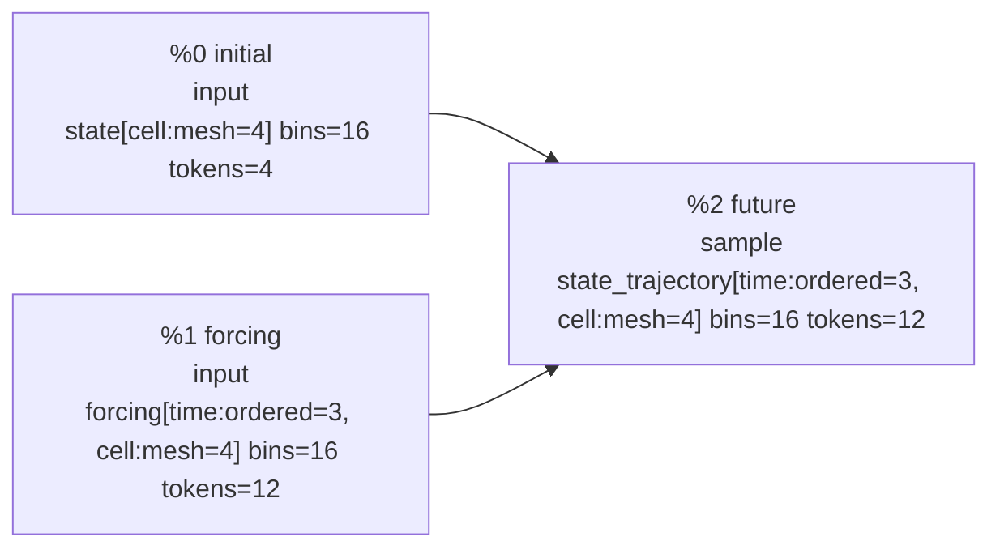
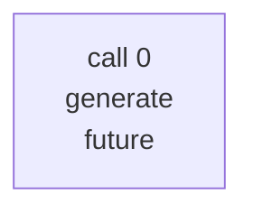
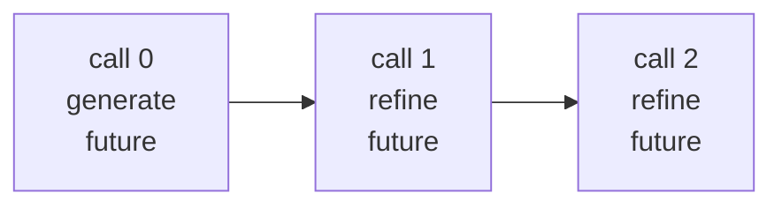

# Synthetic advection debug rendering

The logical field has a four-cell mesh and three ordered future times. `advection_program()` creates one unordered execution document containing 16 observed records and 12 target-query records. Scientific position embeddings identify mesh and time coordinates. `refined_advection_program()` feeds the current trajectory into two later calls.

## 1. Inference Program Values

| ID | Value | Kind | Type | Inputs | Operation/factor | Factor ID | FlowInfo |
| --- | --- | --- | --- | --- | --- | --- | --- |
| %0 | initial | input | state[cell:mesh=4] bins=16 tokens=4 | - | - | - | provenance={synthetic.initial} split_keys={synthetic-train} random_ancestors={} |
| %1 | forcing | input | forcing[time:ordered=3, cell:mesh=4] bins=16 tokens=12 | - | - | - | provenance={synthetic.forcing} split_keys={synthetic-train} random_ancestors={} |
| %2 | future | sample | state_trajectory[time:ordered=3, cell:mesh=4] bins=16 tokens=12 | %0 initial %1 forcing | advection_transition | synthetic_advection:future:2 | provenance={synthetic.forcing, synthetic.initial} split_keys={synthetic-train} random_ancestors={synthetic_advection:future:2} |

## 2. Inference Plan IR

| Property | Value |
| --- | --- |
| program | synthetic_advection |
| external inputs | %0 initial %1 forcing |
| outputs | %2 future |
| factors | synthetic_advection:future:2 |
| budget | model_calls=8, generated_tokens=64 |

| Call | Operator | Iteration | Context | Targets | Depends on | Attention | Positions | Approximation/notes |
| --- | --- | --- | --- | --- | --- | --- | --- | --- |
| 0 | generate | 0 | %0 initial %1 forcing | %2 future | - | full_segment | scientific | factor synthetic_advection:future:2 is approximated as 12 parallel token marginals |

## 3. Transformer Execution IR

| Call | Operator | Depends on | Documents | Supervised tokens | Attention layout | Position mode |
| --- | --- | --- | --- | --- | --- | --- |
| 0 | generate | - | 1 | 12 | full_segment | scientific |

### Call 0 document inventory

| Document | Predicted semantic values | Records | Loss positions |
| --- | --- | --- | --- |
| 0 | synthetic_advection.future[time=0,cell=(0.0,)], synthetic_advection.future[time=0,cell=(0.25,)], synthetic_advection.future[time=0,cell=(0.5,)], synthetic_advection.future[time=0,cell=(0.75,)], synthetic_advection.future[time=1,cell=(0.0,)], synthetic_advection.future[time=1,cell=(0.25,)], synthetic_advection.future[time=1,cell=(0.5,)], synthetic_advection.future[time=1,cell=(0.75,)], synthetic_advection.future[time=2,cell=(0.0,)], synthetic_advection.future[time=2,cell=(0.25,)], synthetic_advection.future[time=2,cell=(0.5,)], synthetic_advection.future[time=2,cell=(0.75,)] | 28 | 12 |

### Call 0, document 0

- Example: `advection-0`
- Physical rotary positions: all 0; RoPE is the identity
- Attention: full_segment within this document's segment; no cross-document attention
- Serialization: complete records may be permuted; outputs follow the same permutation
- Loss: 12 aligned target records

| Physical position | Rotary position | Component | Scientific position embedding | Content token | Model treatment | Predicts | Loss |
| --- | --- | --- | --- | --- | --- | --- | --- |
| 0 | 0 | context record | synthetic_advection.initial[cell=(0.0,)] | 45 value:13 | value token + position policy; no direct loss | - | 0 |
| 1 | 0 | context record | synthetic_advection.initial[cell=(0.25,)] | 42 value:10 | value token + position policy; no direct loss | - | 0 |
| 2 | 0 | context record | synthetic_advection.initial[cell=(0.5,)] | 40 value:8 | value token + position policy; no direct loss | - | 0 |
| 3 | 0 | context record | synthetic_advection.initial[cell=(0.75,)] | 36 value:4 | value token + position policy; no direct loss | - | 0 |
| 4 | 0 | context record | synthetic_advection.forcing[time=0,cell=(0.0,)] | 33 value:1 | value token + position policy; no direct loss | - | 0 |
| 5 | 0 | context record | synthetic_advection.forcing[time=0,cell=(0.25,)] | 32 value:0 | value token + position policy; no direct loss | - | 0 |
| 6 | 0 | context record | synthetic_advection.forcing[time=0,cell=(0.5,)] | 32 value:0 | value token + position policy; no direct loss | - | 0 |
| 7 | 0 | context record | synthetic_advection.forcing[time=0,cell=(0.75,)] | 32 value:0 | value token + position policy; no direct loss | - | 0 |
| 8 | 0 | context record | synthetic_advection.forcing[time=1,cell=(0.0,)] | 32 value:0 | value token + position policy; no direct loss | - | 0 |
| 9 | 0 | context record | synthetic_advection.forcing[time=1,cell=(0.25,)] | 35 value:3 | value token + position policy; no direct loss | - | 0 |
| 10 | 0 | context record | synthetic_advection.forcing[time=1,cell=(0.5,)] | 34 value:2 | value token + position policy; no direct loss | - | 0 |
| 11 | 0 | context record | synthetic_advection.forcing[time=1,cell=(0.75,)] | 35 value:3 | value token + position policy; no direct loss | - | 0 |
| 12 | 0 | context record | synthetic_advection.forcing[time=2,cell=(0.0,)] | 34 value:2 | value token + position policy; no direct loss | - | 0 |
| 13 | 0 | context record | synthetic_advection.forcing[time=2,cell=(0.25,)] | 34 value:2 | value token + position policy; no direct loss | - | 0 |
| 14 | 0 | context record | synthetic_advection.forcing[time=2,cell=(0.5,)] | 35 value:3 | value token + position policy; no direct loss | - | 0 |
| 15 | 0 | context record | synthetic_advection.forcing[time=2,cell=(0.75,)] | 34 value:2 | value token + position policy; no direct loss | - | 0 |
| 16 | 0 | target record | synthetic_advection.future[time=0,cell=(0.0,)] | 1 <query> | query token + position policy; target value is a label, not an input | value:5 | 1 |
| 17 | 0 | target record | synthetic_advection.future[time=0,cell=(0.25,)] | 1 <query> | query token + position policy; target value is a label, not an input | value:13 | 1 |
| 18 | 0 | target record | synthetic_advection.future[time=0,cell=(0.5,)] | 1 <query> | query token + position policy; target value is a label, not an input | value:10 | 1 |
| 19 | 0 | target record | synthetic_advection.future[time=0,cell=(0.75,)] | 1 <query> | query token + position policy; target value is a label, not an input | value:8 | 1 |
| 20 | 0 | target record | synthetic_advection.future[time=1,cell=(0.0,)] | 1 <query> | query token + position policy; target value is a label, not an input | value:8 | 1 |
| 21 | 0 | target record | synthetic_advection.future[time=1,cell=(0.25,)] | 1 <query> | query token + position policy; target value is a label, not an input | value:8 | 1 |
| 22 | 0 | target record | synthetic_advection.future[time=1,cell=(0.5,)] | 1 <query> | query token + position policy; target value is a label, not an input | value:15 | 1 |
| 23 | 0 | target record | synthetic_advection.future[time=1,cell=(0.75,)] | 1 <query> | query token + position policy; target value is a label, not an input | value:13 | 1 |
| 24 | 0 | target record | synthetic_advection.future[time=2,cell=(0.0,)] | 1 <query> | query token + position policy; target value is a label, not an input | value:15 | 1 |
| 25 | 0 | target record | synthetic_advection.future[time=2,cell=(0.25,)] | 1 <query> | query token + position policy; target value is a label, not an input | value:10 | 1 |
| 26 | 0 | target record | synthetic_advection.future[time=2,cell=(0.5,)] | 1 <query> | query token + position policy; target value is a label, not an input | value:11 | 1 |
| 27 | 0 | target record | synthetic_advection.future[time=2,cell=(0.75,)] | 1 <query> | query token + position policy; target value is a label, not an input | value:1 | 1 |

## Alternate Inference Plan IR: fixed-step refinement

| Property | Value |
| --- | --- |
| program | synthetic_advection |
| external inputs | %0 initial %1 forcing |
| outputs | %2 future |
| factors | synthetic_advection:future:2 |
| budget | model_calls=8, generated_tokens=64 |

| Call | Operator | Iteration | Context | Targets | Depends on | Attention | Positions | Approximation/notes |
| --- | --- | --- | --- | --- | --- | --- | --- | --- |
| 0 | generate | 0 | %0 initial %1 forcing | %2 future | - | full_segment | scientific | factor synthetic_advection:future:2 is approximated as 12 parallel token marginals |
| 1 | refine | 1 | %0 initial %1 forcing %2 future | %2 future | 0 | full_segment | scientific | resample_low_confidence_fraction=0.25 |
| 2 | refine | 2 | %0 initial %1 forcing %2 future | %2 future | 1 | full_segment | scientific | resample_low_confidence_fraction=0.25 |

The synthetic execution uses realized `future` values for feedback context. A sampling runtime would replace those values with the proposal produced by the preceding call.

## Alternate Transformer Execution IR: fixed-step refinement

| Call | Operator | Depends on | Documents | Supervised tokens | Attention layout | Position mode |
| --- | --- | --- | --- | --- | --- | --- |
| 0 | generate | - | 1 | 12 | full_segment | scientific |
| 1 | refine | 0 | 1 | 12 | full_segment | scientific |
| 2 | refine | 1 | 1 | 12 | full_segment | scientific |

### Call 0 document inventory

| Document | Predicted semantic values | Records | Loss positions |
| --- | --- | --- | --- |
| 0 | synthetic_advection.future[time=0,cell=(0.0,)], synthetic_advection.future[time=0,cell=(0.25,)], synthetic_advection.future[time=0,cell=(0.5,)], synthetic_advection.future[time=0,cell=(0.75,)], synthetic_advection.future[time=1,cell=(0.0,)], synthetic_advection.future[time=1,cell=(0.25,)], synthetic_advection.future[time=1,cell=(0.5,)], synthetic_advection.future[time=1,cell=(0.75,)], synthetic_advection.future[time=2,cell=(0.0,)], synthetic_advection.future[time=2,cell=(0.25,)], synthetic_advection.future[time=2,cell=(0.5,)], synthetic_advection.future[time=2,cell=(0.75,)] | 28 | 12 |

### Call 0, document 0

- Example: `advection-0`
- Physical rotary positions: all 0; RoPE is the identity
- Attention: full_segment within this document's segment; no cross-document attention
- Serialization: complete records may be permuted; outputs follow the same permutation
- Loss: 12 aligned target records

| Physical position | Rotary position | Component | Scientific position embedding | Content token | Model treatment | Predicts | Loss |
| --- | --- | --- | --- | --- | --- | --- | --- |
| 0 | 0 | context record | synthetic_advection.initial[cell=(0.0,)] | 45 value:13 | value token + position policy; no direct loss | - | 0 |
| 1 | 0 | context record | synthetic_advection.initial[cell=(0.25,)] | 42 value:10 | value token + position policy; no direct loss | - | 0 |
| 2 | 0 | context record | synthetic_advection.initial[cell=(0.5,)] | 40 value:8 | value token + position policy; no direct loss | - | 0 |
| 3 | 0 | context record | synthetic_advection.initial[cell=(0.75,)] | 36 value:4 | value token + position policy; no direct loss | - | 0 |
| 4 | 0 | context record | synthetic_advection.forcing[time=0,cell=(0.0,)] | 33 value:1 | value token + position policy; no direct loss | - | 0 |
| 5 | 0 | context record | synthetic_advection.forcing[time=0,cell=(0.25,)] | 32 value:0 | value token + position policy; no direct loss | - | 0 |
| 6 | 0 | context record | synthetic_advection.forcing[time=0,cell=(0.5,)] | 32 value:0 | value token + position policy; no direct loss | - | 0 |
| 7 | 0 | context record | synthetic_advection.forcing[time=0,cell=(0.75,)] | 32 value:0 | value token + position policy; no direct loss | - | 0 |
| 8 | 0 | context record | synthetic_advection.forcing[time=1,cell=(0.0,)] | 32 value:0 | value token + position policy; no direct loss | - | 0 |
| 9 | 0 | context record | synthetic_advection.forcing[time=1,cell=(0.25,)] | 35 value:3 | value token + position policy; no direct loss | - | 0 |
| 10 | 0 | context record | synthetic_advection.forcing[time=1,cell=(0.5,)] | 34 value:2 | value token + position policy; no direct loss | - | 0 |
| 11 | 0 | context record | synthetic_advection.forcing[time=1,cell=(0.75,)] | 35 value:3 | value token + position policy; no direct loss | - | 0 |
| 12 | 0 | context record | synthetic_advection.forcing[time=2,cell=(0.0,)] | 34 value:2 | value token + position policy; no direct loss | - | 0 |
| 13 | 0 | context record | synthetic_advection.forcing[time=2,cell=(0.25,)] | 34 value:2 | value token + position policy; no direct loss | - | 0 |
| 14 | 0 | context record | synthetic_advection.forcing[time=2,cell=(0.5,)] | 35 value:3 | value token + position policy; no direct loss | - | 0 |
| 15 | 0 | context record | synthetic_advection.forcing[time=2,cell=(0.75,)] | 34 value:2 | value token + position policy; no direct loss | - | 0 |
| 16 | 0 | target record | synthetic_advection.future[time=0,cell=(0.0,)] | 1 <query> | query token + position policy; target value is a label, not an input | value:5 | 1 |
| 17 | 0 | target record | synthetic_advection.future[time=0,cell=(0.25,)] | 1 <query> | query token + position policy; target value is a label, not an input | value:13 | 1 |
| 18 | 0 | target record | synthetic_advection.future[time=0,cell=(0.5,)] | 1 <query> | query token + position policy; target value is a label, not an input | value:10 | 1 |
| 19 | 0 | target record | synthetic_advection.future[time=0,cell=(0.75,)] | 1 <query> | query token + position policy; target value is a label, not an input | value:8 | 1 |
| 20 | 0 | target record | synthetic_advection.future[time=1,cell=(0.0,)] | 1 <query> | query token + position policy; target value is a label, not an input | value:8 | 1 |
| 21 | 0 | target record | synthetic_advection.future[time=1,cell=(0.25,)] | 1 <query> | query token + position policy; target value is a label, not an input | value:8 | 1 |
| 22 | 0 | target record | synthetic_advection.future[time=1,cell=(0.5,)] | 1 <query> | query token + position policy; target value is a label, not an input | value:15 | 1 |
| 23 | 0 | target record | synthetic_advection.future[time=1,cell=(0.75,)] | 1 <query> | query token + position policy; target value is a label, not an input | value:13 | 1 |
| 24 | 0 | target record | synthetic_advection.future[time=2,cell=(0.0,)] | 1 <query> | query token + position policy; target value is a label, not an input | value:15 | 1 |
| 25 | 0 | target record | synthetic_advection.future[time=2,cell=(0.25,)] | 1 <query> | query token + position policy; target value is a label, not an input | value:10 | 1 |
| 26 | 0 | target record | synthetic_advection.future[time=2,cell=(0.5,)] | 1 <query> | query token + position policy; target value is a label, not an input | value:11 | 1 |
| 27 | 0 | target record | synthetic_advection.future[time=2,cell=(0.75,)] | 1 <query> | query token + position policy; target value is a label, not an input | value:1 | 1 |

### Call 1 document inventory

| Document | Predicted semantic values | Records | Loss positions |
| --- | --- | --- | --- |
| 0 | synthetic_advection.future[time=0,cell=(0.0,)], synthetic_advection.future[time=0,cell=(0.25,)], synthetic_advection.future[time=0,cell=(0.5,)], synthetic_advection.future[time=0,cell=(0.75,)], synthetic_advection.future[time=1,cell=(0.0,)], synthetic_advection.future[time=1,cell=(0.25,)], synthetic_advection.future[time=1,cell=(0.5,)], synthetic_advection.future[time=1,cell=(0.75,)], synthetic_advection.future[time=2,cell=(0.0,)], synthetic_advection.future[time=2,cell=(0.25,)], synthetic_advection.future[time=2,cell=(0.5,)], synthetic_advection.future[time=2,cell=(0.75,)] | 40 | 12 |

### Call 1, document 0

- Example: `advection-0`
- Physical rotary positions: all 0; RoPE is the identity
- Attention: full_segment within this document's segment; no cross-document attention
- Serialization: complete records may be permuted; outputs follow the same permutation
- Loss: 12 aligned target records

| Physical position | Rotary position | Component | Scientific position embedding | Content token | Model treatment | Predicts | Loss |
| --- | --- | --- | --- | --- | --- | --- | --- |
| 0 | 0 | context record | synthetic_advection.initial[cell=(0.0,)] | 45 value:13 | value token + position policy; no direct loss | - | 0 |
| 1 | 0 | context record | synthetic_advection.initial[cell=(0.25,)] | 42 value:10 | value token + position policy; no direct loss | - | 0 |
| 2 | 0 | context record | synthetic_advection.initial[cell=(0.5,)] | 40 value:8 | value token + position policy; no direct loss | - | 0 |
| 3 | 0 | context record | synthetic_advection.initial[cell=(0.75,)] | 36 value:4 | value token + position policy; no direct loss | - | 0 |
| 4 | 0 | context record | synthetic_advection.forcing[time=0,cell=(0.0,)] | 33 value:1 | value token + position policy; no direct loss | - | 0 |
| 5 | 0 | context record | synthetic_advection.forcing[time=0,cell=(0.25,)] | 32 value:0 | value token + position policy; no direct loss | - | 0 |
| 6 | 0 | context record | synthetic_advection.forcing[time=0,cell=(0.5,)] | 32 value:0 | value token + position policy; no direct loss | - | 0 |
| 7 | 0 | context record | synthetic_advection.forcing[time=0,cell=(0.75,)] | 32 value:0 | value token + position policy; no direct loss | - | 0 |
| 8 | 0 | context record | synthetic_advection.forcing[time=1,cell=(0.0,)] | 32 value:0 | value token + position policy; no direct loss | - | 0 |
| 9 | 0 | context record | synthetic_advection.forcing[time=1,cell=(0.25,)] | 35 value:3 | value token + position policy; no direct loss | - | 0 |
| 10 | 0 | context record | synthetic_advection.forcing[time=1,cell=(0.5,)] | 34 value:2 | value token + position policy; no direct loss | - | 0 |
| 11 | 0 | context record | synthetic_advection.forcing[time=1,cell=(0.75,)] | 35 value:3 | value token + position policy; no direct loss | - | 0 |
| 12 | 0 | context record | synthetic_advection.forcing[time=2,cell=(0.0,)] | 34 value:2 | value token + position policy; no direct loss | - | 0 |
| 13 | 0 | context record | synthetic_advection.forcing[time=2,cell=(0.25,)] | 34 value:2 | value token + position policy; no direct loss | - | 0 |
| 14 | 0 | context record | synthetic_advection.forcing[time=2,cell=(0.5,)] | 35 value:3 | value token + position policy; no direct loss | - | 0 |
| 15 | 0 | context record | synthetic_advection.forcing[time=2,cell=(0.75,)] | 34 value:2 | value token + position policy; no direct loss | - | 0 |
| 16 | 0 | context record | synthetic_advection.future[time=0,cell=(0.0,)] | 37 value:5 | value token + position policy; no direct loss | - | 0 |
| 17 | 0 | context record | synthetic_advection.future[time=0,cell=(0.25,)] | 45 value:13 | value token + position policy; no direct loss | - | 0 |
| 18 | 0 | context record | synthetic_advection.future[time=0,cell=(0.5,)] | 42 value:10 | value token + position policy; no direct loss | - | 0 |
| 19 | 0 | context record | synthetic_advection.future[time=0,cell=(0.75,)] | 40 value:8 | value token + position policy; no direct loss | - | 0 |
| 20 | 0 | context record | synthetic_advection.future[time=1,cell=(0.0,)] | 40 value:8 | value token + position policy; no direct loss | - | 0 |
| 21 | 0 | context record | synthetic_advection.future[time=1,cell=(0.25,)] | 40 value:8 | value token + position policy; no direct loss | - | 0 |
| 22 | 0 | context record | synthetic_advection.future[time=1,cell=(0.5,)] | 47 value:15 | value token + position policy; no direct loss | - | 0 |
| 23 | 0 | context record | synthetic_advection.future[time=1,cell=(0.75,)] | 45 value:13 | value token + position policy; no direct loss | - | 0 |
| 24 | 0 | context record | synthetic_advection.future[time=2,cell=(0.0,)] | 47 value:15 | value token + position policy; no direct loss | - | 0 |
| 25 | 0 | context record | synthetic_advection.future[time=2,cell=(0.25,)] | 42 value:10 | value token + position policy; no direct loss | - | 0 |
| 26 | 0 | context record | synthetic_advection.future[time=2,cell=(0.5,)] | 43 value:11 | value token + position policy; no direct loss | - | 0 |
| 27 | 0 | context record | synthetic_advection.future[time=2,cell=(0.75,)] | 33 value:1 | value token + position policy; no direct loss | - | 0 |
| 28 | 0 | target record | synthetic_advection.future[time=0,cell=(0.0,)] | 1 <query> | query token + position policy; target value is a label, not an input | value:5 | 1 |
| 29 | 0 | target record | synthetic_advection.future[time=0,cell=(0.25,)] | 1 <query> | query token + position policy; target value is a label, not an input | value:13 | 1 |
| 30 | 0 | target record | synthetic_advection.future[time=0,cell=(0.5,)] | 1 <query> | query token + position policy; target value is a label, not an input | value:10 | 1 |
| 31 | 0 | target record | synthetic_advection.future[time=0,cell=(0.75,)] | 1 <query> | query token + position policy; target value is a label, not an input | value:8 | 1 |
| 32 | 0 | target record | synthetic_advection.future[time=1,cell=(0.0,)] | 1 <query> | query token + position policy; target value is a label, not an input | value:8 | 1 |
| 33 | 0 | target record | synthetic_advection.future[time=1,cell=(0.25,)] | 1 <query> | query token + position policy; target value is a label, not an input | value:8 | 1 |
| 34 | 0 | target record | synthetic_advection.future[time=1,cell=(0.5,)] | 1 <query> | query token + position policy; target value is a label, not an input | value:15 | 1 |
| 35 | 0 | target record | synthetic_advection.future[time=1,cell=(0.75,)] | 1 <query> | query token + position policy; target value is a label, not an input | value:13 | 1 |
| 36 | 0 | target record | synthetic_advection.future[time=2,cell=(0.0,)] | 1 <query> | query token + position policy; target value is a label, not an input | value:15 | 1 |
| 37 | 0 | target record | synthetic_advection.future[time=2,cell=(0.25,)] | 1 <query> | query token + position policy; target value is a label, not an input | value:10 | 1 |
| 38 | 0 | target record | synthetic_advection.future[time=2,cell=(0.5,)] | 1 <query> | query token + position policy; target value is a label, not an input | value:11 | 1 |
| 39 | 0 | target record | synthetic_advection.future[time=2,cell=(0.75,)] | 1 <query> | query token + position policy; target value is a label, not an input | value:1 | 1 |

### Call 2 document inventory

| Document | Predicted semantic values | Records | Loss positions |
| --- | --- | --- | --- |
| 0 | synthetic_advection.future[time=0,cell=(0.0,)], synthetic_advection.future[time=0,cell=(0.25,)], synthetic_advection.future[time=0,cell=(0.5,)], synthetic_advection.future[time=0,cell=(0.75,)], synthetic_advection.future[time=1,cell=(0.0,)], synthetic_advection.future[time=1,cell=(0.25,)], synthetic_advection.future[time=1,cell=(0.5,)], synthetic_advection.future[time=1,cell=(0.75,)], synthetic_advection.future[time=2,cell=(0.0,)], synthetic_advection.future[time=2,cell=(0.25,)], synthetic_advection.future[time=2,cell=(0.5,)], synthetic_advection.future[time=2,cell=(0.75,)] | 40 | 12 |

### Call 2, document 0

- Example: `advection-0`
- Physical rotary positions: all 0; RoPE is the identity
- Attention: full_segment within this document's segment; no cross-document attention
- Serialization: complete records may be permuted; outputs follow the same permutation
- Loss: 12 aligned target records

| Physical position | Rotary position | Component | Scientific position embedding | Content token | Model treatment | Predicts | Loss |
| --- | --- | --- | --- | --- | --- | --- | --- |
| 0 | 0 | context record | synthetic_advection.initial[cell=(0.0,)] | 45 value:13 | value token + position policy; no direct loss | - | 0 |
| 1 | 0 | context record | synthetic_advection.initial[cell=(0.25,)] | 42 value:10 | value token + position policy; no direct loss | - | 0 |
| 2 | 0 | context record | synthetic_advection.initial[cell=(0.5,)] | 40 value:8 | value token + position policy; no direct loss | - | 0 |
| 3 | 0 | context record | synthetic_advection.initial[cell=(0.75,)] | 36 value:4 | value token + position policy; no direct loss | - | 0 |
| 4 | 0 | context record | synthetic_advection.forcing[time=0,cell=(0.0,)] | 33 value:1 | value token + position policy; no direct loss | - | 0 |
| 5 | 0 | context record | synthetic_advection.forcing[time=0,cell=(0.25,)] | 32 value:0 | value token + position policy; no direct loss | - | 0 |
| 6 | 0 | context record | synthetic_advection.forcing[time=0,cell=(0.5,)] | 32 value:0 | value token + position policy; no direct loss | - | 0 |
| 7 | 0 | context record | synthetic_advection.forcing[time=0,cell=(0.75,)] | 32 value:0 | value token + position policy; no direct loss | - | 0 |
| 8 | 0 | context record | synthetic_advection.forcing[time=1,cell=(0.0,)] | 32 value:0 | value token + position policy; no direct loss | - | 0 |
| 9 | 0 | context record | synthetic_advection.forcing[time=1,cell=(0.25,)] | 35 value:3 | value token + position policy; no direct loss | - | 0 |
| 10 | 0 | context record | synthetic_advection.forcing[time=1,cell=(0.5,)] | 34 value:2 | value token + position policy; no direct loss | - | 0 |
| 11 | 0 | context record | synthetic_advection.forcing[time=1,cell=(0.75,)] | 35 value:3 | value token + position policy; no direct loss | - | 0 |
| 12 | 0 | context record | synthetic_advection.forcing[time=2,cell=(0.0,)] | 34 value:2 | value token + position policy; no direct loss | - | 0 |
| 13 | 0 | context record | synthetic_advection.forcing[time=2,cell=(0.25,)] | 34 value:2 | value token + position policy; no direct loss | - | 0 |
| 14 | 0 | context record | synthetic_advection.forcing[time=2,cell=(0.5,)] | 35 value:3 | value token + position policy; no direct loss | - | 0 |
| 15 | 0 | context record | synthetic_advection.forcing[time=2,cell=(0.75,)] | 34 value:2 | value token + position policy; no direct loss | - | 0 |
| 16 | 0 | context record | synthetic_advection.future[time=0,cell=(0.0,)] | 37 value:5 | value token + position policy; no direct loss | - | 0 |
| 17 | 0 | context record | synthetic_advection.future[time=0,cell=(0.25,)] | 45 value:13 | value token + position policy; no direct loss | - | 0 |
| 18 | 0 | context record | synthetic_advection.future[time=0,cell=(0.5,)] | 42 value:10 | value token + position policy; no direct loss | - | 0 |
| 19 | 0 | context record | synthetic_advection.future[time=0,cell=(0.75,)] | 40 value:8 | value token + position policy; no direct loss | - | 0 |
| 20 | 0 | context record | synthetic_advection.future[time=1,cell=(0.0,)] | 40 value:8 | value token + position policy; no direct loss | - | 0 |
| 21 | 0 | context record | synthetic_advection.future[time=1,cell=(0.25,)] | 40 value:8 | value token + position policy; no direct loss | - | 0 |
| 22 | 0 | context record | synthetic_advection.future[time=1,cell=(0.5,)] | 47 value:15 | value token + position policy; no direct loss | - | 0 |
| 23 | 0 | context record | synthetic_advection.future[time=1,cell=(0.75,)] | 45 value:13 | value token + position policy; no direct loss | - | 0 |
| 24 | 0 | context record | synthetic_advection.future[time=2,cell=(0.0,)] | 47 value:15 | value token + position policy; no direct loss | - | 0 |
| 25 | 0 | context record | synthetic_advection.future[time=2,cell=(0.25,)] | 42 value:10 | value token + position policy; no direct loss | - | 0 |
| 26 | 0 | context record | synthetic_advection.future[time=2,cell=(0.5,)] | 43 value:11 | value token + position policy; no direct loss | - | 0 |
| 27 | 0 | context record | synthetic_advection.future[time=2,cell=(0.75,)] | 33 value:1 | value token + position policy; no direct loss | - | 0 |
| 28 | 0 | target record | synthetic_advection.future[time=0,cell=(0.0,)] | 1 <query> | query token + position policy; target value is a label, not an input | value:5 | 1 |
| 29 | 0 | target record | synthetic_advection.future[time=0,cell=(0.25,)] | 1 <query> | query token + position policy; target value is a label, not an input | value:13 | 1 |
| 30 | 0 | target record | synthetic_advection.future[time=0,cell=(0.5,)] | 1 <query> | query token + position policy; target value is a label, not an input | value:10 | 1 |
| 31 | 0 | target record | synthetic_advection.future[time=0,cell=(0.75,)] | 1 <query> | query token + position policy; target value is a label, not an input | value:8 | 1 |
| 32 | 0 | target record | synthetic_advection.future[time=1,cell=(0.0,)] | 1 <query> | query token + position policy; target value is a label, not an input | value:8 | 1 |
| 33 | 0 | target record | synthetic_advection.future[time=1,cell=(0.25,)] | 1 <query> | query token + position policy; target value is a label, not an input | value:8 | 1 |
| 34 | 0 | target record | synthetic_advection.future[time=1,cell=(0.5,)] | 1 <query> | query token + position policy; target value is a label, not an input | value:15 | 1 |
| 35 | 0 | target record | synthetic_advection.future[time=1,cell=(0.75,)] | 1 <query> | query token + position policy; target value is a label, not an input | value:13 | 1 |
| 36 | 0 | target record | synthetic_advection.future[time=2,cell=(0.0,)] | 1 <query> | query token + position policy; target value is a label, not an input | value:15 | 1 |
| 37 | 0 | target record | synthetic_advection.future[time=2,cell=(0.25,)] | 1 <query> | query token + position policy; target value is a label, not an input | value:10 | 1 |
| 38 | 0 | target record | synthetic_advection.future[time=2,cell=(0.5,)] | 1 <query> | query token + position policy; target value is a label, not an input | value:11 | 1 |
| 39 | 0 | target record | synthetic_advection.future[time=2,cell=(0.75,)] | 1 <query> | query token + position policy; target value is a label, not an input | value:1 | 1 |
