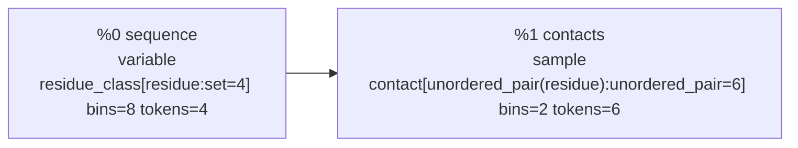
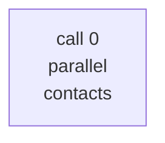

# Synthetic contacts debug rendering

The set axis has four residues. Its unordered-pair axis identifies the six `{left, right}` pairs. The parallel plan creates one unordered document with four observed residue records and six target-query records.

## 1. Probabilistic Dataflow IR

| ID | Value | Kind | Type | Inputs | Operation/factor | Factor ID | FlowInfo |
| --- | --- | --- | --- | --- | --- | --- | --- |
| %0 | sequence | variable | residue_class[residue:set=4] bins=8 tokens=4 | - | - | - | provenance={synthetic.sequence} available_at=0 environments={deployment, training} split_keys={synthetic-train} random_ancestors={} |
| %1 | contacts | sample | contact[unordered_pair(residue):unordered_pair=6] bins=2 tokens=6 | %0 sequence | contact_map | synthetic_contacts:contacts:1 | provenance={synthetic.sequence} available_at=0 environments={deployment, training} split_keys={synthetic-train} random_ancestors={synthetic_contacts:contacts:1} |

## 2. Conditional Query IR

| Property | Value |
| --- | --- |
| program | synthetic_contacts |
| conditioned | %0 sequence |
| targets | %1 contacts |
| required factors | synthetic_contacts:contacts:1 |
| deployment | deployment at t=0 |
| budget | model_calls=8, generated_tokens=64 |

## 3. Inference Plan IR

| Call | Operator | Iteration | Context | Targets | Depends on | Approximation/notes |
| --- | --- | --- | --- | --- | --- | --- |
| 0 | parallel | 0 | %0 sequence | %1 contacts | - | factor synthetic_contacts:contacts:1 is approximated as 6 parallel token marginals |

## 4. Transformer Execution IR

| Call | Operator | Depends on | Documents | Supervised tokens | Attention layout |
| --- | --- | --- | --- | --- | --- |
| 0 | parallel | - | 1 | 6 | full_segment |

### Call 0 document inventory

| Document | Predicted semantic values | Records | Loss positions |
| --- | --- | --- | --- |
| 0 | synthetic_contacts.contacts[residue={0,1}], synthetic_contacts.contacts[residue={0,2}], synthetic_contacts.contacts[residue={0,3}], synthetic_contacts.contacts[residue={1,2}], synthetic_contacts.contacts[residue={1,3}], synthetic_contacts.contacts[residue={2,3}] | 10 | 6 |

### Call 0, document 0

- Example: `contacts-0`
- Physical rotary positions: all 0; RoPE is the identity
- Attention: full within this document's segment; no cross-document attention
- Serialization: complete records may be permuted; outputs follow the same permutation
- Loss: 6 aligned target records

| Physical position | Rotary position | Component | Scientific position embedding | Content token | Model treatment | Predicts | Loss |
| --- | --- | --- | --- | --- | --- | --- | --- |
| 0 | 0 | context record | synthetic_contacts.sequence[residue=0] | 35 value:3 | value token + scientific position embedding; no direct loss | - | 0 |
| 1 | 0 | context record | synthetic_contacts.sequence[residue=1] | 34 value:2 | value token + scientific position embedding; no direct loss | - | 0 |
| 2 | 0 | context record | synthetic_contacts.sequence[residue=2] | 34 value:2 | value token + scientific position embedding; no direct loss | - | 0 |
| 3 | 0 | context record | synthetic_contacts.sequence[residue=3] | 33 value:1 | value token + scientific position embedding; no direct loss | - | 0 |
| 4 | 0 | target record | synthetic_contacts.contacts[residue={0,1}] | 1 <query> | query token + scientific position embedding; target value is a label, not an input | value:0 | 1 |
| 5 | 0 | target record | synthetic_contacts.contacts[residue={0,2}] | 1 <query> | query token + scientific position embedding; target value is a label, not an input | value:0 | 1 |
| 6 | 0 | target record | synthetic_contacts.contacts[residue={0,3}] | 1 <query> | query token + scientific position embedding; target value is a label, not an input | value:0 | 1 |
| 7 | 0 | target record | synthetic_contacts.contacts[residue={1,2}] | 1 <query> | query token + scientific position embedding; target value is a label, not an input | value:1 | 1 |
| 8 | 0 | target record | synthetic_contacts.contacts[residue={1,3}] | 1 <query> | query token + scientific position embedding; target value is a label, not an input | value:0 | 1 |
| 9 | 0 | target record | synthetic_contacts.contacts[residue={2,3}] | 1 <query> | query token + scientific position embedding; target value is a label, not an input | value:0 | 1 |
