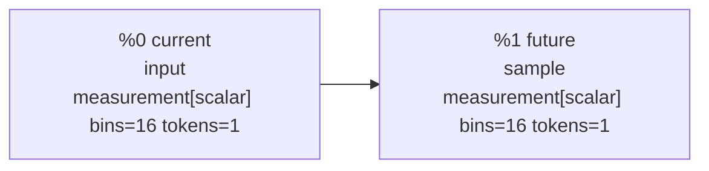
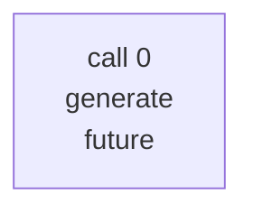

# Scalar forecast debug rendering

The smallest program conditions on one scalar measurement and predicts one scalar measurement. Neither field has an axis, so the staged function creates one context record and one target-query record in a full-attention model call.

## 1. Inference Program Values

| ID | Value | Kind | Type | Inputs | Operation/factor | Factor ID | FlowInfo |
| --- | --- | --- | --- | --- | --- | --- | --- |
| %0 | current | input | measurement[scalar] bins=16 tokens=1 | - | - | - | provenance={synthetic.scalar_current} split_keys={synthetic-train} random_ancestors={} |
| %1 | future | sample | measurement[scalar] bins=16 tokens=1 | %0 current | scalar_transition | scalar_forecast:future:1 | provenance={synthetic.scalar_current} split_keys={synthetic-train} random_ancestors={scalar_forecast:future:1} |

## 2. Inference Plan IR

| Property | Value |
| --- | --- |
| program | scalar_forecast |
| external inputs | %0 current |
| outputs | %1 future |
| factors | scalar_forecast:future:1 |
| budget | model_calls=8, generated_tokens=64 |

| Call | Operator | Iteration | Context | Targets | Depends on | Attention | Positions | Approximation/notes |
| --- | --- | --- | --- | --- | --- | --- | --- | --- |
| 0 | generate | 0 | %0 current | %1 future | - | full_segment | scientific | - |

## 3. Transformer Execution IR

| Call | Operator | Depends on | Documents | Supervised tokens | Attention layout | Position mode |
| --- | --- | --- | --- | --- | --- | --- |
| 0 | generate | - | 1 | 1 | full_segment | scientific |

### Call 0 document inventory

| Document | Predicted semantic values | Records | Loss positions |
| --- | --- | --- | --- |
| 0 | scalar_forecast.future[scalar] | 2 | 1 |

### Call 0, document 0

- Example: `scalar-0`
- Physical rotary positions: all 0; RoPE is the identity
- Attention: full_segment within this document's segment; no cross-document attention
- Serialization: complete records may be permuted; outputs follow the same permutation
- Loss: 1 aligned target records

| Physical position | Rotary position | Component | Scientific position embedding | Content token | Model treatment | Predicts | Loss |
| --- | --- | --- | --- | --- | --- | --- | --- |
| 0 | 0 | context record | scalar_forecast.current[scalar] | 35 value:3 | value token + position policy; no direct loss | - | 0 |
| 1 | 0 | target record | scalar_forecast.future[scalar] | 1 <query> | query token + position policy; target value is a label, not an input | value:5 | 1 |
