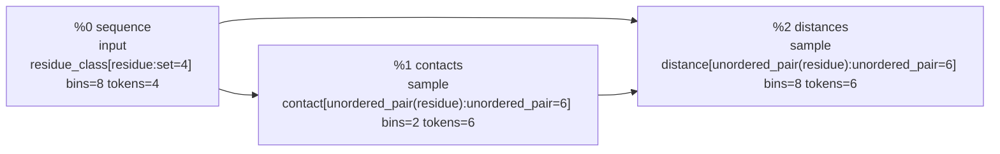
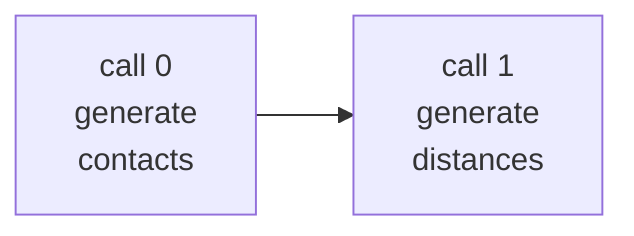

# Factorized structure debug rendering

`structure_program()` generates contacts and then distances. Call 0 generates contacts from sequence. Call 1 receives both sequence and generated contacts before generating distances. The call dependency preserves `p(contacts | sequence) p(distances | sequence, contacts)`. Autoregression is between calls; each call uses full attention over its scientific records.

## 1. Inference Program Values

| ID | Value | Kind | Type | Inputs | Operation/factor | Factor ID | FlowInfo |
| --- | --- | --- | --- | --- | --- | --- | --- |
| %0 | sequence | input | residue_class[residue:set=4] bins=8 tokens=4 | - | - | - | provenance={synthetic.sequence} split_keys={synthetic-train} random_ancestors={} |
| %1 | contacts | sample | contact[unordered_pair(residue):unordered_pair=6] bins=2 tokens=6 | %0 sequence | contact_map | synthetic_structure:contacts:1 | provenance={synthetic.sequence} split_keys={synthetic-train} random_ancestors={synthetic_structure:contacts:1} |
| %2 | distances | sample | distance[unordered_pair(residue):unordered_pair=6] bins=8 tokens=6 | %0 sequence %1 contacts | distance_given_contacts | synthetic_structure:distances:2 | provenance={synthetic.sequence} split_keys={synthetic-train} random_ancestors={synthetic_structure:contacts:1, synthetic_structure:distances:2} |

## 2. Inference Plan IR

| Property | Value |
| --- | --- |
| program | synthetic_structure |
| external inputs | %0 sequence |
| outputs | %1 contacts %2 distances |
| factors | synthetic_structure:contacts:1 synthetic_structure:distances:2 |
| budget | model_calls=16, generated_tokens=128 |

| Call | Operator | Iteration | Context | Targets | Depends on | Attention | Positions | Approximation/notes |
| --- | --- | --- | --- | --- | --- | --- | --- | --- |
| 0 | generate | 0 | %0 sequence | %1 contacts | - | full_segment | scientific | factor synthetic_structure:contacts:1 is approximated as 6 parallel token marginals |
| 1 | generate | 0 | %0 sequence %1 contacts | %2 distances | 0 | full_segment | scientific | factor synthetic_structure:distances:2 is approximated as 6 parallel token marginals |

## 3. Transformer Execution IR

| Call | Operator | Depends on | Documents | Supervised tokens | Attention layout | Position mode |
| --- | --- | --- | --- | --- | --- | --- |
| 0 | generate | - | 1 | 6 | full_segment | scientific |
| 1 | generate | 0 | 1 | 6 | full_segment | scientific |

### Call 0 document inventory

| Document | Predicted semantic values | Records | Loss positions |
| --- | --- | --- | --- |
| 0 | synthetic_structure.contacts[residue={0,1}], synthetic_structure.contacts[residue={0,2}], synthetic_structure.contacts[residue={0,3}], synthetic_structure.contacts[residue={1,2}], synthetic_structure.contacts[residue={1,3}], synthetic_structure.contacts[residue={2,3}] | 10 | 6 |

### Call 0, document 0

- Example: `structure-0`
- Physical rotary positions: all 0; RoPE is the identity
- Attention: full_segment within this document's segment; no cross-document attention
- Serialization: complete records may be permuted; outputs follow the same permutation
- Loss: 6 aligned target records

| Physical position | Rotary position | Component | Scientific position embedding | Content token | Model treatment | Predicts | Loss |
| --- | --- | --- | --- | --- | --- | --- | --- |
| 0 | 0 | context record | synthetic_structure.sequence[residue=0] | 35 value:3 | value token + position policy; no direct loss | - | 0 |
| 1 | 0 | context record | synthetic_structure.sequence[residue=1] | 34 value:2 | value token + position policy; no direct loss | - | 0 |
| 2 | 0 | context record | synthetic_structure.sequence[residue=2] | 34 value:2 | value token + position policy; no direct loss | - | 0 |
| 3 | 0 | context record | synthetic_structure.sequence[residue=3] | 33 value:1 | value token + position policy; no direct loss | - | 0 |
| 4 | 0 | target record | synthetic_structure.contacts[residue={0,1}] | 1 <query> | query token + position policy; target value is a label, not an input | value:0 | 1 |
| 5 | 0 | target record | synthetic_structure.contacts[residue={0,2}] | 1 <query> | query token + position policy; target value is a label, not an input | value:0 | 1 |
| 6 | 0 | target record | synthetic_structure.contacts[residue={0,3}] | 1 <query> | query token + position policy; target value is a label, not an input | value:0 | 1 |
| 7 | 0 | target record | synthetic_structure.contacts[residue={1,2}] | 1 <query> | query token + position policy; target value is a label, not an input | value:1 | 1 |
| 8 | 0 | target record | synthetic_structure.contacts[residue={1,3}] | 1 <query> | query token + position policy; target value is a label, not an input | value:0 | 1 |
| 9 | 0 | target record | synthetic_structure.contacts[residue={2,3}] | 1 <query> | query token + position policy; target value is a label, not an input | value:0 | 1 |

### Call 1 document inventory

| Document | Predicted semantic values | Records | Loss positions |
| --- | --- | --- | --- |
| 0 | synthetic_structure.distances[residue={0,1}], synthetic_structure.distances[residue={0,2}], synthetic_structure.distances[residue={0,3}], synthetic_structure.distances[residue={1,2}], synthetic_structure.distances[residue={1,3}], synthetic_structure.distances[residue={2,3}] | 16 | 6 |

### Call 1, document 0

- Example: `structure-0`
- Physical rotary positions: all 0; RoPE is the identity
- Attention: full_segment within this document's segment; no cross-document attention
- Serialization: complete records may be permuted; outputs follow the same permutation
- Loss: 6 aligned target records

| Physical position | Rotary position | Component | Scientific position embedding | Content token | Model treatment | Predicts | Loss |
| --- | --- | --- | --- | --- | --- | --- | --- |
| 0 | 0 | context record | synthetic_structure.sequence[residue=0] | 35 value:3 | value token + position policy; no direct loss | - | 0 |
| 1 | 0 | context record | synthetic_structure.sequence[residue=1] | 34 value:2 | value token + position policy; no direct loss | - | 0 |
| 2 | 0 | context record | synthetic_structure.sequence[residue=2] | 34 value:2 | value token + position policy; no direct loss | - | 0 |
| 3 | 0 | context record | synthetic_structure.sequence[residue=3] | 33 value:1 | value token + position policy; no direct loss | - | 0 |
| 4 | 0 | context record | synthetic_structure.contacts[residue={0,1}] | 32 value:0 | value token + position policy; no direct loss | - | 0 |
| 5 | 0 | context record | synthetic_structure.contacts[residue={0,2}] | 32 value:0 | value token + position policy; no direct loss | - | 0 |
| 6 | 0 | context record | synthetic_structure.contacts[residue={0,3}] | 32 value:0 | value token + position policy; no direct loss | - | 0 |
| 7 | 0 | context record | synthetic_structure.contacts[residue={1,2}] | 33 value:1 | value token + position policy; no direct loss | - | 0 |
| 8 | 0 | context record | synthetic_structure.contacts[residue={1,3}] | 32 value:0 | value token + position policy; no direct loss | - | 0 |
| 9 | 0 | context record | synthetic_structure.contacts[residue={2,3}] | 32 value:0 | value token + position policy; no direct loss | - | 0 |
| 10 | 0 | target record | synthetic_structure.distances[residue={0,1}] | 1 <query> | query token + position policy; target value is a label, not an input | value:2 | 1 |
| 11 | 0 | target record | synthetic_structure.distances[residue={0,2}] | 1 <query> | query token + position policy; target value is a label, not an input | value:2 | 1 |
| 12 | 0 | target record | synthetic_structure.distances[residue={0,3}] | 1 <query> | query token + position policy; target value is a label, not an input | value:3 | 1 |
| 13 | 0 | target record | synthetic_structure.distances[residue={1,2}] | 1 <query> | query token + position policy; target value is a label, not an input | value:0 | 1 |
| 14 | 0 | target record | synthetic_structure.distances[residue={1,3}] | 1 <query> | query token + position policy; target value is a label, not an input | value:2 | 1 |
| 15 | 0 | target record | synthetic_structure.distances[residue={2,3}] | 1 <query> | query token + position policy; target value is a label, not an input | value:2 | 1 |
