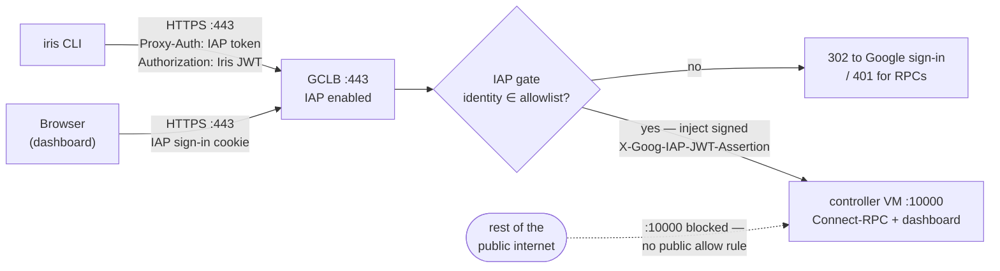
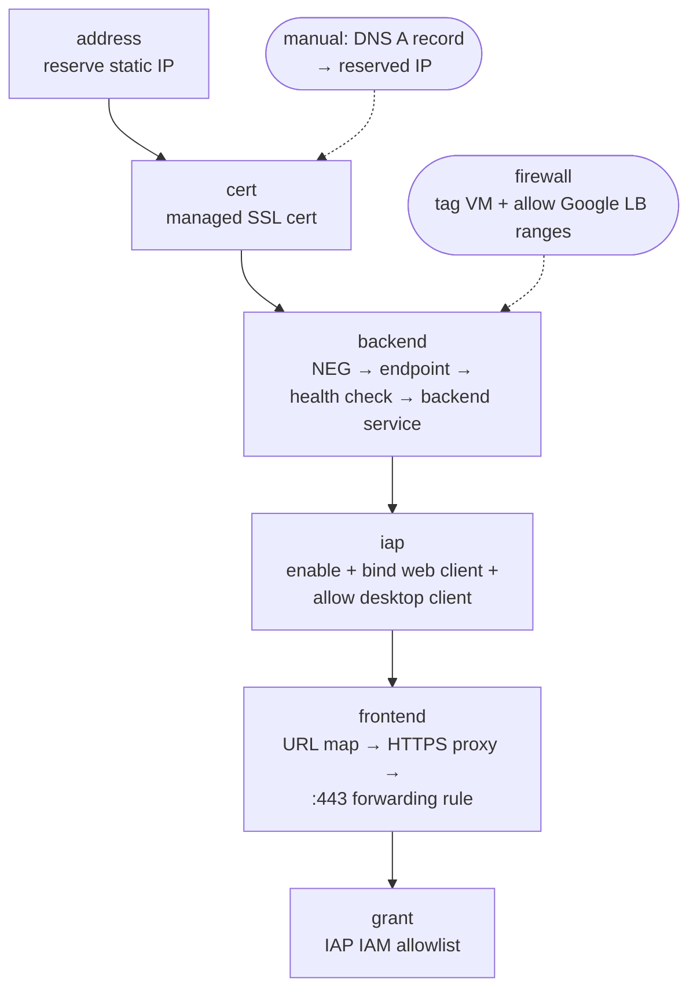
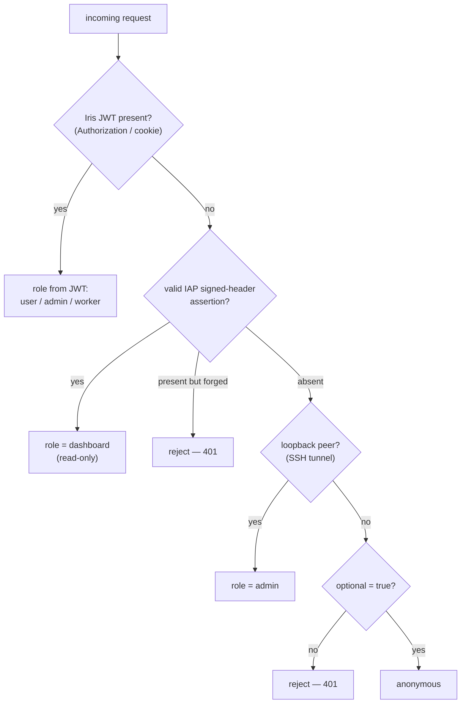
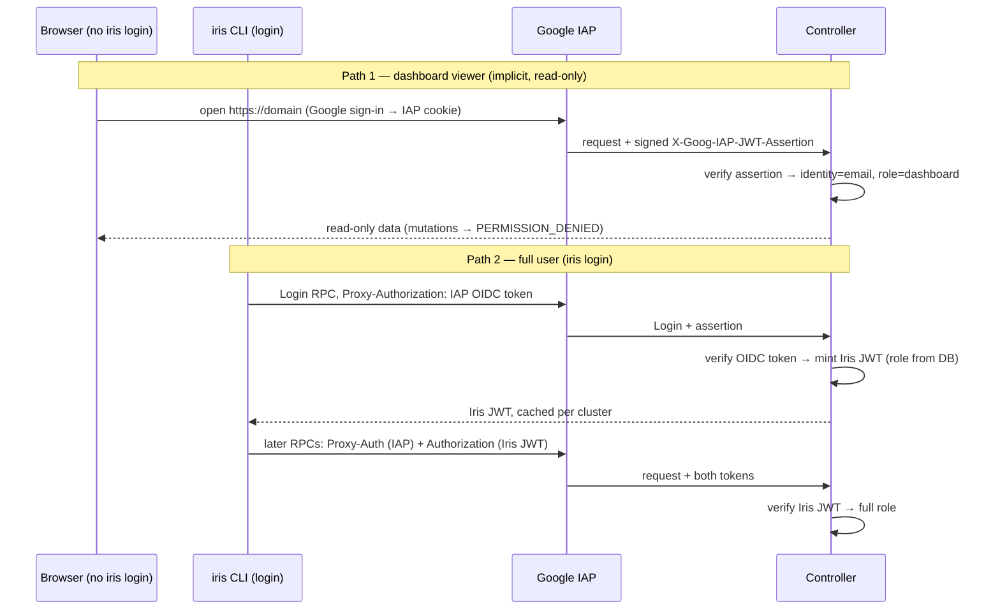

# iris-iap-gclb

An external HTTPS Load Balancer (GCLB) fronting the Iris controller VM, with
Identity-Aware Proxy (IAP) enabled on the backend service. GCLB terminates TLS,
IAP authenticates the caller against an IAM allowlist, and the backend forwards
plain HTTP to the controller VM on port `10000`. The controller's port is
reachable **only** from Google's load-balancer ranges, so every request arrives
pre-authenticated by IAP.



One stack per cluster (`iris-marin`, `iris-marin-dev`, …). The cluster name is
the resource-name prefix (`iris-<cluster>-*`) and the controller VM's GCE label
/ network tag (`iris-<cluster>-controller`).

`iap_gclb.py` does the whole rollout idempotently — every resource is one
`gcloud` create guarded by a `describe` probe, so the full `deploy` or any single
stage is safe to re-run. Run `uv run infra/iris-iap-gclb/iap_gclb.py --help` for
the subcommands.

This supersedes the Cloud Run proxy in `../iris-iap-proxy/`: GCLB reaches the
controller VM directly (one hop instead of two) and has no fixed serverless
request cap, so the controller's long-poll requests are not truncated. As this
rolls out, the Cloud Run proxy is retired.

## OAuth clients (one-time, in the Cloud Console)

The IAP OAuth Admin API is being turned down, so the script does **not** create
OAuth clients. Create two by hand under APIs & Services → Credentials and hand
the script their downloaded JSON secrets files:

- A **Web** client — IAP's anchor (`oauthSettings.clientId`) and the browser
  sign-in page. Add the redirect URI
  `https://iap.googleapis.com/v1/oauth/clientIds/<CLIENT_ID>:handleRedirect`.
- A **Desktop** client — what the `iris` CLI drives for the browser login flow.
  Its id is registered in `oauthSettings.programmaticClients` so IAP admits the
  CLI's bearer ID token (whose `aud` is the desktop client id).

## Deploy

```bash
uv run infra/iris-iap-gclb/iap_gclb.py deploy marin \
    --domain iris-marin.example.com \
    --web-client-secrets web.json \
    --desktop-client-secrets desktop.json \
    --member user:you@example.com
```



`deploy` runs the stages in dependency order and, at the end, prints the
reserved IP, the URL, and the cluster `auth.iap` block to paste (including the
`signed_header_audience`, see *Auth model* below). It discovers the controller
VM's name + internal IP from the `iris-<cluster>-controller` label (override the
IP with `--controller-ip`). Add `--dry-run` to trace every `gcloud` command
without running it.

`deploy` does **not** touch the firewall unless you pass `--with-firewall` (which
runs only the additive allow rule). Two inherently manual steps:

1. Create a **DNS A record** for the domain pointing at the reserved static IP.
   The Google-managed SSL cert stays `PROVISIONING` until that resolves.
2. Run the **`firewall`** stage so the LB health check can reach the controller —
   without it the backend stays `UNHEALTHY`.

## Individual stages

Each stage is a subcommand, runnable on its own and idempotent:

```bash
uv run infra/iris-iap-gclb/iap_gclb.py address  marin           # reserve + print the static IP
uv run infra/iris-iap-gclb/iap_gclb.py cert     marin --domain iris-marin.example.com
uv run infra/iris-iap-gclb/iap_gclb.py firewall marin           # tag VM + allow Google LB ranges
uv run infra/iris-iap-gclb/iap_gclb.py backend  marin           # NEG + endpoint + health check + backend
uv run infra/iris-iap-gclb/iap_gclb.py iap      marin \
    --web-client-secrets web.json --desktop-client-secrets desktop.json
uv run infra/iris-iap-gclb/iap_gclb.py frontend marin           # URL map + HTTPS proxy + forwarding rule
uv run infra/iris-iap-gclb/iap_gclb.py grant    marin --member user:teammate@example.com
uv run infra/iris-iap-gclb/iap_gclb.py status   marin           # what exists + cert state + IP + jwt audience
uv run infra/iris-iap-gclb/iap_gclb.py teardown marin           # delete the LB stack (keeps the static IP)
```

## Auth model

Authentication has two independent layers — IAP at the ingress, and Iris's own
JWT inside the controller — and **three** ways a request resolves to an identity.

### Tokens on the wire

- **IAP OIDC ID token** in `Proxy-Authorization: Bearer <id_token>` — proves
  *who the human/SA is* to IAP. IAP validates it before the request reaches the
  controller. (Sending it in `Proxy-Authorization` rather than `Authorization`
  is the IAP convention that frees `Authorization` for the app.)
- **Iris JWT** in `Authorization: Bearer <iris_jwt>` — the cluster-issued token
  from `iris login`, checked by the controller's own auth layer.

After a successful auth, IAP injects identity headers the controller can trust:

- `X-Goog-IAP-JWT-Assertion` — a JWT **signed by Google** asserting the
  authenticated identity, with `aud` = the backend-service resource path. It is
  unforgeable without Google's key, so verifying it proves the request really
  passed through IAP.
- `X-Goog-Authenticated-User-Email` — `accounts.google.com:user@example.com`
  (unsigned; the controller relies on the signed assertion, not this).

### How the controller resolves identity



The middle branch is the **implicit dashboard** path added for IAP. A browser
that has reached the controller through IAP but has **not** run `iris login`
carries no Iris JWT; the controller verifies IAP's signed assertion and grants
the email a read-only `dashboard` role. So anyone on the IAP allowlist can open
the dashboard and view jobs/workers/state, but cannot submit, cancel, exec, or
manage keys/budgets — those return `PERMISSION_DENIED`. To act, run
`iris login`, which mints an Iris JWT whose role (`user`/`admin`) comes from the
controller's user table (`admin_users` → admin). The read-only set is a
default-deny allowlist (`DASHBOARD_READABLE_RPCS` in `lib/iris/src/iris/rpc/auth.py`):
a newly added mutating RPC is denied to the dashboard role until explicitly listed.

Enable it by setting `auth.iap.signed_header_audience` to the backend-service
audience (`status` and `deploy` print it):

```yaml
auth:
  iap:
    url: https://iris-marin.example.com
    oauth_client_id: <DESKTOP_CLIENT_ID>.apps.googleusercontent.com
    oauth_client_secret: <DESKTOP_CLIENT_SECRET>      # non-confidential, RFC 8252 §8.5
    audiences:
      - <DESKTOP_CLIENT_ID>.apps.googleusercontent.com
    signed_header_audience: /projects/<PROJECT_NUMBER>/global/backendServices/<BACKEND_ID>
  admin_users:
    - you@example.com
  optional: false   # tokenless calls that did NOT pass IAP are still rejected
```

Leave `signed_header_audience` empty to disable the implicit path entirely
(tokenless public requests are then rejected outright).

### The two human flows



See `lib/iris/src/iris/cli/main.py` (`login`) for the JWT-exchange side; the IAP
ID-token side is the GCLB-specific addition this stack enables.

## Access control: who gets in

IAP admits a request only if the authenticated Google identity holds
`roles/iap.httpsResourceAccessor` on the backend service (or inherits it from the
project) — that IAM binding is the allowlist. Grant principals with the `grant`
stage:

- `user:alice@example.com` — one person
- `group:team@example.com` — **recommended**: manage access by group membership
- `domain:example.com` — a whole Workspace org

Authentication (any Google account, via the External consent screen) is not
authorization: an identity not on the allowlist is rejected by IAP with `403`
before the request reaches the controller. The Iris role (`dashboard` vs
`user`/`admin`) is a *second* gate applied after IAP, inside the controller.

## Firewall

`firewall` tags the controller VM (`iris-<cluster>-controller`) and adds an
**allow** rule so only the Google front-end / health-check / IAP ranges
(`130.211.0.0/22`, `35.191.0.0/16`) reach the controller port. This is additive
and required — the LB health check never passes without it.

`firewall --deny-public` *also* adds a blanket `deny 0.0.0.0/0 → :{port}` rule.
This is **not** additive: it sits above `default-allow-internal`, so it also
blocks in-cluster traffic to the controller port. On the marin cluster workers
dial the controller's **internal** IP on `:10000`, so a blanket deny would sever
them — only enable it once internal access is carved out (allow the RFC1918
ranges at a higher priority than the deny) or otherwise confirmed unused.
Without any deny rule the port is still not internet-reachable (no public allow
rule exists); the deny only makes that guarantee explicit.

## Security: only reachable via IAP

The guarantee is that the controller's RPC/dashboard port is reachable **only**
through GCLB → IAP. It rests on two facts, both checkable with `gcloud`:

1. The **only** firewall allow rule for `:10000` is `iris-<cluster>-allow-lb`,
   whose source is the Google LB ranges (`130.211.0.0/22`, `35.191.0.0/16`) and
   whose target is the `iris-<cluster>-controller` tag. No `0.0.0.0/0` rule opens
   `:10000`.
2. Every other broad ingress rule in the project is for a *different* port
   (`22`, `80`, `443`, …), so none expose `:10000` even though the controller VM
   has an external IP.

Verify both — direct access to the controller's public IP on `:10000` times out
(the firewall drops it), while the load-balanced HTTPS endpoint answers with an
IAP challenge:

```bash
# Direct to the VM's external IP:10000 — connection times out (not reachable).
curl --connect-timeout 8 http://<CONTROLLER_EXTERNAL_IP>:10000/health    # → timeout

# Through the load balancer — IAP intercepts before the controller.
curl -i https://iris-marin.example.com/                                   # → 302 to accounts.google.com
#   header: x-goog-iap-generated-response: true
curl -i -X POST https://iris-marin.example.com/iris.cluster.ControllerService/ListJobs \
     -H 'content-type: application/json' -d '{}'                          # → 401 (IAP-generated)

# The only allow rule for :10000 is the Google LB range.
gcloud compute firewall-rules list --filter='allowed.ports:10000' \
  --format='table(name, sourceRanges.list(), targetTags.list())'
```

A `302` (browser) or `401` (RPC) carrying `x-goog-iap-generated-response: true`
means IAP answered — the request never reached the controller. A timeout on the
direct `:10000` probe confirms the port is closed to the public internet.
