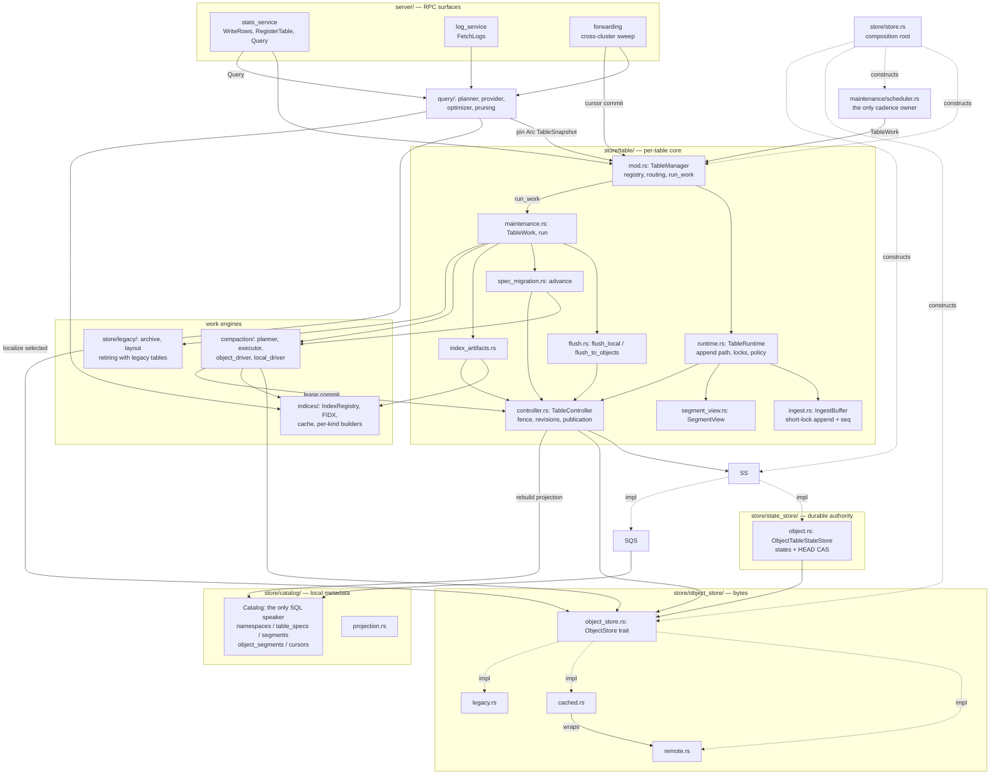
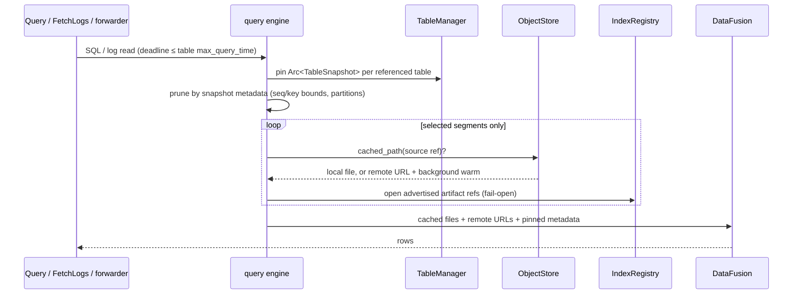
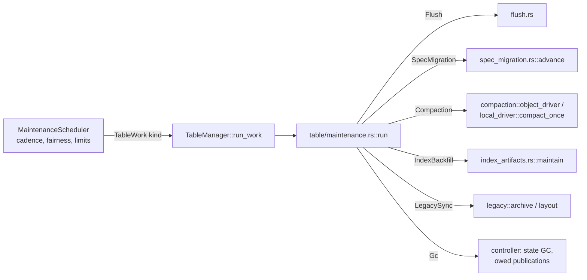
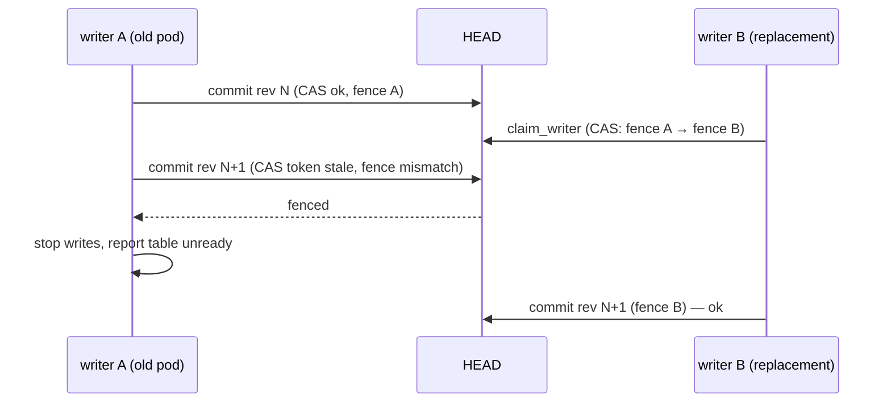
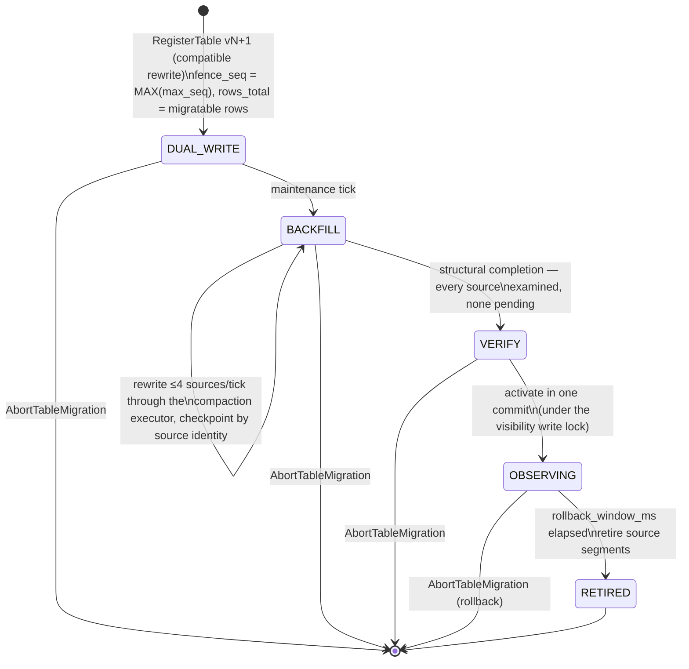

# Finelog architecture: modules, control flow, migration, and rollout

How the Finelog service stores versioned tables as immutable objects, how control flows through the Rust crate (`rust/src/`), how a legacy table migrates to the object-native format, and how changes are validated and rolled out.

## Module map



The ownership rule: `ObjectStore` owns bytes and localization; `TableController` owns liveness and allocates revisions; `ObjectTableStateStore` durably checks fenced revisions; the compaction drivers own transformation; `IndexRegistry` owns derived artifacts; the query engine owns planning; `MaintenanceScheduler` owns all cadence. `TableRuntime` owns one table's concurrency envelope (append fast path, flush serialization, policy cells) while durable transitions stay with the controller; `Store` is the composition root and the service facade the RPC layer calls.

## Durable state

Each object-backed table has one authority: an immutable, complete state document per revision plus a mutable HEAD replaced by compare-and-swap.

```text
<remote>/_finelog/tables/<table>/HEAD.json                    mutable pointer: revision, writer fence, state ref + checksum
<remote>/_finelog/tables/<table>/catalogs/<rev>-<sha8>.json   immutable complete TableState per revision
<remote>/_finelog/tables/<table>/objects/<sha256>.parquet     immutable data segments
<remote>/_finelog/tables/<table>/indices/<sha256>.fidx        immutable index bundles
<remote>/_finelog/tables/<table>/projections/<sha256>.parquet immutable covering-projection artifacts
```

Every durable mutation — flush, compaction, index backfill, registration, activation, abort, retire, forward cursor, tombstone — is a controller commit that allocates the next monotonic `TableRevision` and carries the process's `WriterFence`. SQLite is a rebuildable projection for object-backed tables; for legacy tables it is the single authority, guarded by the data-dir flock rather than a durable state store. Dropping a table publishes a durable tombstone revision; HEAD is never deleted, so a missing HEAD unambiguously means "never published".

The published `persisted_high_water` carries the table's sequence allocator watermark, not just the max seq in published segments: a legacy import excludes archive-only rows and retirement deletes legacy catalog rows, so published segments can top out below sequence numbers the table already issued. Publishes clamp the mark monotone across revisions, and recovery seeds the allocator past it, so a recovered writer never reissues a sequence number.

## Control flow

### Write path

```mermaid
sequenceDiagram
    participant W as WriteRows RPC
    participant TM as TableManager
    participant IB as IngestBuffer
    participant MS as Scheduler
    participant FL as flush.rs
    participant OS as ObjectStore
    participant TC as TableController
    participant SS as ObjectTableStateStore

    W->>TM: append(table, batch)
    TM->>IB: validate, assign seq, append (short lock)
    IB-->>W: persist target seq
    MS->>TM: TableWork::Flush (aged or full buffer)
    TM->>FL: flush_to_objects
    FL->>IB: seal batch
    FL->>OS: upload immutable Parquet (content-addressed)
    FL->>TC: commit(next TableState)
    TC->>SS: fenced CAS commit
    SS-->>TC: new CommitToken
    TC->>TC: publish Arc<TableSnapshot>; rebuild SQLite projection
    TC-->>IB: advance durable watermark
```

The append fast path never waits on durable I/O or the controller. Acknowledgement means object write plus fenced state commit. On an ambiguous CAS (response lost), the controller re-reads HEAD and compares revision, fence, and state hash: the commit is durable, still owed (re-publish the same revision), or fenced — never rolled back.

### Read path



Reads plan from immutable pinned snapshots and touch only what pruning selected. Each selected segment scans from its verified cache file when one exists; otherwise the scan reads the object's remote URL directly (the provider's backend is registered with DataFusion's runtime at store open) while a background fetch warms the cache for the next query — a cold cache never blocks a read. Index artifacts are opened by the content-addressed references the state advertises — never by deriving a sidecar path — and an uncached artifact is warmed in the background while this scan reads the source Parquet. Direct clients (Python/DuckDB) read HEAD and the published projection from object storage without the server.

The cache itself (`cached.rs`): a verified hit (size + SHA-256, corrupt files self-heal) returns the local file and refreshes its recency; a fill downloads under a store-wide concurrency bound and lands the file by atomic rename. Writes are dual-ported — an upload's bytes also seed the cache, streamed uploads spool to the cache file while they transfer — so the flush → query path never re-downloads its own output. With `FINELOG_OBJECT_CACHE_GB` set, maintenance evicts least-recently-used cache files beyond the capacity, unlinking only behind the query-visibility write lock; unset retains everything.

### Maintenance dispatch



The scheduler owns cadence only; it names a `TableWork` kind and one call dispatches into the owning module. While a spec migration is pending it owns the whole cycle, because compaction or eviction would destroy its sources. Compaction runs under a `MaintenanceLease` that pins the definition version and exact inputs and rebases at commit time, so concurrent flushes commit freely; a lost lease leaves outputs as unreferenced objects for GC.

Object GC retains superseded catalog revisions for the longer of `max_query_time` and `rollback_window_ms`, then sweeps unreferenced objects across the `objects/`, `indices/`, and `projections/` prefixes after a 24-hour orphan grace period, and refuses to delete anything from a fenced writer. The reference set keeps every object a retained state names: data source, index bundle, and each projection artifact. A table whose migration was aborted stays on this GC path through its retained HEAD, so the aborted transition's objects age out normally; the intended residue is HEAD plus the current catalog revision.

### Cross-process fencing



A process claims each table's fence at recovery (or at first commit for a runtime-registered table). Every later commit revalidates the fence recorded in HEAD, so a stale pod cannot advance a table a replacement owns.

### Recovery

Recovery is metadata-only: load each table's durable state, claim the fence, rebuild the SQLite projection when it is behind HEAD, and seed the sequence allocator past the published high-water mark — no data objects are downloaded, and cache contents never create visibility. Two states need recognition rather than rebuild:

- A durable state whose active and desired versions are both the legacy version 0 (an aborted first migration) selects the legacy path as authority. Recovery keeps the claimed fence, rebuilds nothing, and the retained HEAD neither blocks the boot nor prevents re-registering the table.
- A version-0 segment entry whose source points into the legacy archive rather than the object layout (an archive-only row retained until retirement) is rollback bookkeeping; cold recovery skips it, because its bytes are not in the object layout.

## Migration: legacy table → object-native

The only trigger is a `RegisterTable` RPC carrying a `TableSpec` (`server/stats_service.rs`). There is no migration service, no activation RPC, and no startup automation. A table opts in via `operating_policy.l0_mode = L0_MODE_OBJECT_STORE`; the default remains `LEGACY_LOCAL`.

Registration classifies the change (`store/table_spec.rs::definition_requires_rewrite`):

- **Metadata-only** (same physical layout, or an empty table): activates in one state commit, carrying existing segments.
- **Compatible rewrite** (layout/sort/partition change over existing rows — including *version 0*, a legacy table with no recorded definition): records a pending transition; background maintenance does the rest.
- **Incompatible logical change** (key change, dropped/retyped column, new required column): rejected up front.



Semantics that make this safe:

- **Local sources only.** A version-0 import operates on rows the table still holds locally. Archive-only (`REMOTE`) rows are excluded from `rows_total` and never read — the legacy archive is never a migration source, so old remote data is never rewritten. A catalog row whose bytes exist neither on disk nor in the archive is dropped as unserveable: no reader can produce its rows and no source can supply them.
- **Structural completion.** The universe can shrink under the backfill (eviction, dropped phantom rows), so it finishes when a tick has examined every remaining source and found each already rewritten, restating the reported row total each tick — not when a count frozen at registration is reached.
- **Single-write-plus-alias.** After the fence, new rows are written once in the target layout and referenced from *both* the source and target query views until activation, so reads never lose data mid-migration and no row is written twice.
- **Fenced backfill.** Only sources with `max_seq ≤ fence_seq` are rewritten; each is checkpointed by a content identity, so a crash resumes exactly where it stopped. `fence_seq` is `MAX(max_seq)` over every segment, archive-only ones included — counting a segment the backfill will not touch can only raise the fence, the safe direction.
- **Reads stay correct throughout.** The table serves from the filesystem path until `active_table_spec_version > 0`; the published state aliases both versions until activation.
- **Rollback window.** The observation window comes from `rollback_window_ms` (default 1 h), independent of `max_query_time`; retired objects are retained for the longer of the two. Abort before retirement restores the source version cleanly, reassigning post-fence writes back to it.
- **Adoption ends.** Retiring a version-0 import sets `table_heads.filesystem_adoption_disabled` durably (and recovery re-establishes it from published state, never lowering it). From then on the legacy directory is never a load source for that table, and `store/legacy/` mechanics stop applying to it.

Separately, `finelog-migrate` (in the image) is the older one-off `telemetry_v1` root-table splitter with its own prepare/verify/publish/retire procedure in `lib/finelog/OPS.md`; it is unrelated to the TableSpec machinery.

## Testing and rollout

### Local

1. **Unit + composed failure scenarios** (no credentials, deterministic): `cargo test` in `lib/finelog/rust` covers the fenced-commit, tombstone, recovery, lease-rebase, and migration contracts pointwise, and `tests/failure_scenarios.rs` drives a real `Store` through the public surface plus the `test-util` seams over a local object directory through crash-during-backfill-with-open-lease, fence-steal-with-ambiguous-CAS, and cold-restart-from-objects-alone, with per-step invariants (monotonic revisions, HEAD consistency, referenced-object existence, gap-free sequences). `FaultInjectingObjectStore` in `test_support` (compiled under the `test-util` feature, never in the served binary) is the reusable fault seam. The Python e2e suite (`uv run pytest tests` in `lib/finelog`) exercises the embedded server end to end.
2. **Shadow mode over a copied store**: copy a real store's *local* directory (catalog SQLite + newest segments + `.fidx` sidecars — not the bucket, which holds no index bundles), then boot `finelog-server --mode shadow --log-dir <copy>`. Shadow runs no maintenance — nothing compacts, evicts, migrates, or publishes — so the copy is a pure read rehearsal. The server refuses shadow with a `gs://`/`s3://` remote or forwarding configured. The benchmark harnesses (`finelog.benchmarks.query_measurement`, `log_query_bench`, `grafana_dashboard_bench`) run result-digest and latency comparisons against such a copy; `--debug-admin` additionally exposes `/debug/maintain`, `/debug/segments`, and `/debug/backdate` for parity harnesses (never in production).
3. **Migration rehearsal on the copy**: boot the copy in *live* mode with `--remote-log-dir` pointing at a disposable prefix (a local directory or a `ttl=1d` GCS path), register the object-backed TableSpec, and let maintenance run the version-0 import end to end — backfill, activation, observation, retirement — comparing row counts, sequence coverage, and order-independent per-column query digests against the shadow baseline before migration, after migration, after compaction, and again from a second server cold-recovering the remote layout into an empty local store.

### marin-dev

`marin-dev` is the natural staging target: its own archive (`gs://marin-us-central2/finelog/marin-dev`), cidr-only auth, no forwarding.

1. Build and publish the image (`ops-docker-images.yaml` or `finelog build-image`).
2. `uv run python lib/finelog/scripts/safe_deploy.py rollout marin-dev` — records the old digest, health-checks (`/health` body: `ok` vs `degraded`), auto-rolls-back on failure.
3. Register **one** table with an object-backed TableSpec; watch the migration phases through `/api/segments` and the stats introspection; verify queries and dashboards against pre-migration digests.
4. Rehearse the escape hatches on that table: `AbortTableMigration` mid-backfill, and rollback during the observation window.
5. Restart the service after activation to prove metadata-only recovery against the real bucket (no eager downloads, sequence continuity).

### Production

1. **Order**: hub before senders (`OPS.md` rule) — `safe_deploy rollout marin` for the GCE hub, then per CoreWeave cluster `finelog deploy sync-secret <cluster>` + `uv run marin-deploy finelog rollout <cluster>` (captures the Deployment revision, `pulumi up`, verifies ingest health, restores the ReplicaSet on failure; `Recreate` strategy keeps the single-writer invariant).
2. **Binary first, migration second.** The new binary serves legacy tables unchanged; nothing migrates until a TableSpec is registered. Roll the fleet, observe, then canary the object-backed spec on one production table.
3. **Canary gates**: the fencing design makes a botched rollout safe by construction — an old pod that comes back cannot advance HEAD once the new pod claims the fence. `retain_orphans` suppresses legacy-archive orphan deletion while a version-0 import is in flight.
4. **Rollback**: `safe_deploy rollback` / `marin-deploy finelog rollback --to-revision N` for the binary; `AbortTableMigration` or the observation-window rollback for a table-level retreat. Binary rollback is safe only before the new binary's first boot applies its ordered catalog schema migrations — an older binary refuses a newer catalog version — so after first boot the binary path is roll-forward. Table-level retreat stays available through each table's observation window either way.

### What retires when

`store/legacy/` (flat-key archive sync, eviction, layout rewriting), filesystem adoption, and the process-wide query-visibility lock all exist for legacy tables only. Each table that completes its version-0 import stops using them; when the last legacy table converts, they are deleted. The deferred engineering work is the fuller journey-test catalog and provider-native multipart streaming for compaction outputs; neither gates the rollout.
