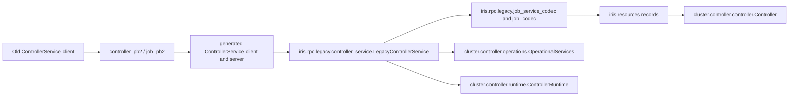
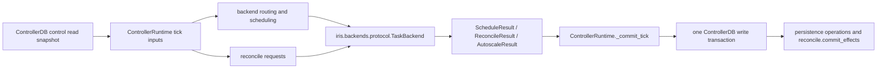
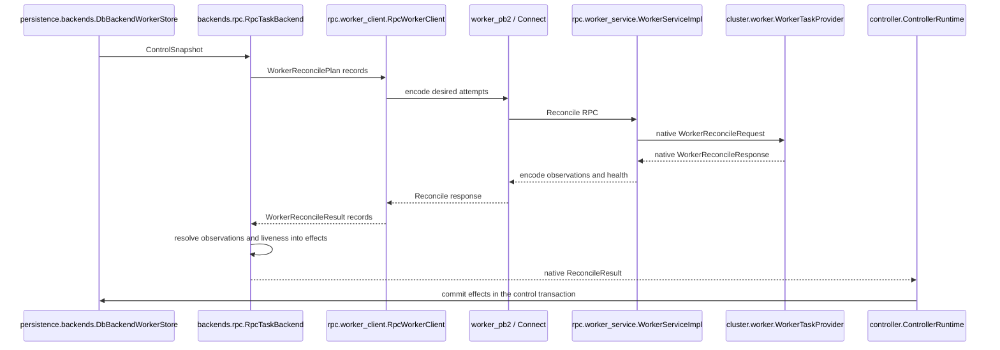
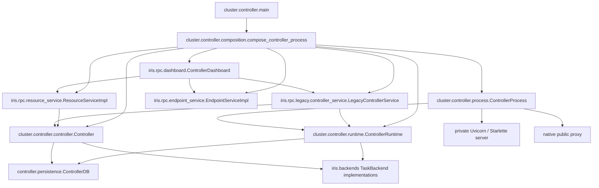

# Iris architecture

Iris has one native resource model and two controller RPC surfaces. New clients
use `ResourceService`. The retained `ControllerService` decodes its old Job and
Task messages at `iris.rpc.legacy` and then calls the same native controller.
Generated protobuf messages do not enter the resource model, controller
behavior, persistence, scheduling, reconciliation, or backend contracts.

For reconcile details, see [`reconcile_rpc.md`](reconcile_rpc.md). For backend
routing, see [`multi_backend.md`](multi_backend.md).

## New resource requests

`iris.resources` records are the public client model and the controller's
application model. Each side of the Connect call translates once.

```mermaid
flowchart LR
    User[User code] --> Client[iris.client.IrisClient]
    Client --> Remote[iris.client.RemoteClusterClient]
    Remote --> RpcClient[iris.rpc.resource_client.ResourceRpcClient]
    RpcClient --> ClientCodec[iris.rpc.resource_client_codec]
    ClientCodec --> Wire[resource_pb2 + generated ResourceService client]
    Wire --> Service[iris.rpc.resource_service.ResourceServiceImpl]
    Service --> Native[iris.resources records]
    Native --> Controller[cluster.controller.controller.Controller]
    Controller --> Nouns[controller job/task/attempt/endpoint/node/slice services]
    Nouns --> DB[controller.persistence]
    Nouns --> Ports[native backend and runtime ports]
```

`ResourceRpcClient` exposes native inputs and results. `resource_client_codec`,
`resource_codec`, and `ResourceServiceImpl` own the protobuf translation.
`Controller` accepts and returns native records and dispatches to the noun
services in `iris.cluster.controller`.

## Retained legacy requests

`ControllerService` remains for old clients and for operational RPCs that do
not yet have resource equivalents. Its handwritten implementation and Job
codecs are confined to `iris.rpc.legacy`.

Legacy Job and Task operations cross `LegacyControllerService` and become
native before reaching `Controller`. Worker registration, checkpoints, raw
queries, budgets, scheduler diagnostics, and federation transport remain
operational methods on `LegacyControllerService`; they use typed
`OperationalServices` or `ControllerRuntime` entry points.

Generated `controller_pb2`, `job_pb2`, and their Connect modules remain at the
`iris.rpc` root. Worker and legacy protocol generation share those generated
modules: `worker.proto` imports the old `job.proto`, and `controller.proto`
defines the retained service. Their generated location does not make them an
internal application model.

## Maintenance cycle

`ControllerRuntime` owns a single control tick. It reads controller-owned state,
calls each `TaskBackend` with native requests, and commits all due decisions and
effects in one transaction.

The tick runs schedule, reconcile, and autoscale phases when their cadences are
due. `TaskBackend` implementations own backend observations and return native
decisions or effects. The controller merges per-backend results, applies timeout
and federation decisions, and persists the batch. Worker or pod identity does
not pass back as an ad hoc controller-side mutation.

## Worker reports and reconciliation

The worker daemon uses a retained wire protocol, with native contracts on both
sides of the transport.

`iris.rpc.worker_client`, `worker_service`, and `worker_codec` own the worker
protobufs. `RpcTaskBackend`, reconciliation kernels, and worker behavior use
records from `iris.resources` and `iris.backends.protocol`. Kubernetes task
execution does not use the worker daemon: `iris.backends.k8s.tasks.K8sTaskProvider`
observes pods and returns the same native `TaskBackend` results.

## Process composition

`compose_controller_process` is the boundary where durable behavior, RPC
adapters, HTTP presentation, and process lifecycle are assembled.

`ControllerProcess` starts the private ASGI server, the native public proxy, and
the control runtime. `ControllerDashboard` mounts ResourceService,
ControllerService, EndpointService, HTTP routes, and the dashboard assets.
`composition.py` is allowed to depend on both native and transport modules;
controller noun services and decision kernels are not.

## Package ownership

| Package | Owns |
|---|---|
| `iris.client` | `IrisClient`, resource handles, client context, bundle creation, and remote-cluster composition |
| `iris.resources` | Native Job, Task, Attempt, Endpoint, Node, Slice, action, activity, log, worker, and system records |
| `iris.rpc` | Protobuf schemas and generated code, Connect clients and services, authentication, and wire/native codecs |
| `iris.rpc.legacy` | The retained ControllerService implementation and old Job/Task wire translation |
| `iris.cluster.controller` | Resource behavior, process composition, control loops, routing, scheduling, reconciliation, and persistence |
| `iris.backends` | Native task-execution adapters, including worker-daemon and Kubernetes implementations |
| `iris.cluster.platforms` | Controller and worker machine lifecycle for GCP, Kubernetes, local, and manual providers |
| `iris.cluster.worker` | Native worker-daemon behavior and task runtime ownership |
| `iris.cluster.runtime` | Docker and subprocess task execution |

Persistence stays in `iris.cluster.controller.persistence`:

- `schema.py` defines current tables and indexes.
- `migrations/` upgrades databases.
- `database.py` owns engines, transactions, and snapshots.
- `reads.py`, `writes.py`, and `operations/` expose typed reads and mutations.
- `projections/` maintains derived state.
- `backends.py` implements the worker-state port used by `RpcTaskBackend`.

## Transport rules and exceptions

- `iris.resources`, controller noun services, scheduling, reconciliation, and
  backend protocols do not import protobuf or Connect modules.
- Handwritten protobuf translation belongs in `iris.rpc`; old ControllerService
  translation belongs in `iris.rpc.legacy`.
- SQLAlchemy belongs in `iris.cluster.controller.persistence`.
- Public user code starts at `iris.client`; low-level Connect clients live in
  `iris.rpc` and use an `RpcClient` suffix.
- External task effects belong in `iris.backends`; machine effects belong in
  `iris.cluster.platforms`.
- `iris.backends.k8s.logship` is a standalone pod-side transport executable. It
  uses `ResourceRpcClient` to discover the log endpoint and Finelog's generated
  protobuf client to publish CRI log batches. It is not imported by
  `K8sTaskProvider` behavior or a controller decision kernel.
