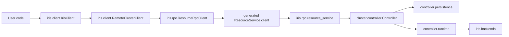
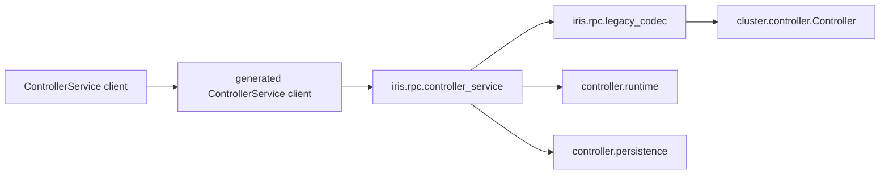

# Iris source layout

Iris has separate packages for the public client, RPC transport, native
resources, controller behavior, persistence, and execution adapters. A resource
request crosses each boundary once. Generated protobuf messages do not enter
the native resource or controller-kernel packages.

For the reconcile kernel, see [`reconcile_rpc.md`](reconcile_rpc.md). For
multi-backend routing, see [`multi_backend.md`](multi_backend.md).

## Request flow

The public resource path is:

`ResourceRpcClient` and `resource_service` translate between protobuf messages
and records from `iris.resources`. `Controller` receives only native values.
SQL and SQLAlchemy stay in `cluster/controller/persistence`.

The retained `ControllerService` wire is an RPC compatibility boundary for old
clients and operational methods:

Old Job and Task messages are decoded into `iris.resources` before calling
`Controller`. Operational and administrative methods still read typed
persistence/runtime surfaces from the adapter and encode their results there.

## Packages

| Package | Owns |
|---|---|
| `iris.client` | `IrisClient`, job handles, client context, bundle creation, job metadata, and the remote cluster client |
| `iris.rpc` | `.proto` files, generated Connect code, transport clients, server adapters, authentication, and protobuf codecs |
| `iris.resources` | Immutable Job, Task, Attempt, Endpoint, Node, Slice, action, activity, and log records |
| `iris.cluster.controller` | Resource behavior, control loops, scheduling, reconciliation, autoscaling, and persistence |
| `iris.backends` | Task execution adapters: `RpcTaskBackend` and `K8sTaskProvider` |
| `iris.cluster.platforms` | Controller and worker machine lifecycle for GCP, Kubernetes, local, and manual providers |
| `iris.cluster.worker` | The worker daemon |
| `iris.cluster.runtime` | Docker and subprocess task execution |

`iris.cluster` still contains configuration and vocabulary shared by the
controller and execution adapters, including constraints, setup scripts,
endpoint configuration, and provider configuration.

## Controller structure

`cluster/controller/controller.py` is the resource-oriented application
surface. It accepts and returns records from `iris.resources`; it does not
accept generated protobuf messages or issue SQL directly.

`cluster/controller/runtime.py` owns control-loop state and coordinates
scheduling, reconciliation, checkpointing, federation, and backend I/O.
`cluster/controller/main.py` resolves configuration and constructs the live
backends and runtime.

Persistence is confined to `cluster/controller/persistence`:

- `schema.py` defines current tables and indexes.
- `migrations/` upgrades older databases.
- `database.py` owns engines, transactions, and snapshots.
- `reads.py` and `operations/` expose typed reads and mutations.
- `projections/` owns write-through derived state.
- `backends.py` implements the database-backed worker view used by an RPC
  backend.

The decision kernels under `reconcile/` and `scheduling/` consume snapshots and
return decisions. They do not import RPC transport or SQLAlchemy.

## Execution boundaries

`TaskBackend` is the controller's task-execution contract. Each implementation
drives one backend and exposes the same phases:

- `schedule` returns placement decisions.
- `reconcile` returns task observations and worker health observations.
- `autoscale` returns capacity changes.
- `get_process_status`, `profile_task`, and `exec_in_container` perform
  explicit operational requests.

`iris.backends.rpc.RpcTaskBackend` uses worker daemons and the Iris autoscaler.
`iris.backends.k8s.K8sTaskProvider` observes and controls Kubernetes directly.
Backends receive plain snapshots and return plain results; they do not access
the controller database.

Machine lifecycle is separate from task execution. Implementations under
`cluster/platforms` start, stop, and inspect controller or worker machines.
They do not decide Job or Task state.

## Dependency rules

- `iris.resources` and the controller persistence, reconcile, and scheduling
  packages do not import protobuf or Connect modules.
- Handwritten protobuf translation belongs in `iris.rpc`.
- SQLAlchemy belongs in `cluster/controller/persistence`.
- Public user code starts at `iris.client`; low-level Connect clients live in
  `iris.rpc` and are named with an `RpcClient` suffix.
- External task effects belong in `iris.backends`; machine effects belong in
  `cluster.platforms`.
- The retained old Job/Task wire is decoded and encoded in
  `iris.rpc.legacy_codec`.

`TaskBackend` is still defined in `cluster/controller/backend.py`, so
`iris.backends` imports its contract from the controller package. Moving that
contract requires separating its scheduler and autoscaler request types; this
branch does not hide that dependency behind forwarding modules.

`iris.rpc.controller_service` still contains operational query assembly in
addition to old-wire translation. The generated wire is contained in
`iris.rpc`, but extracting those operations into typed controller collaborators
is separate from the mechanical package move.
