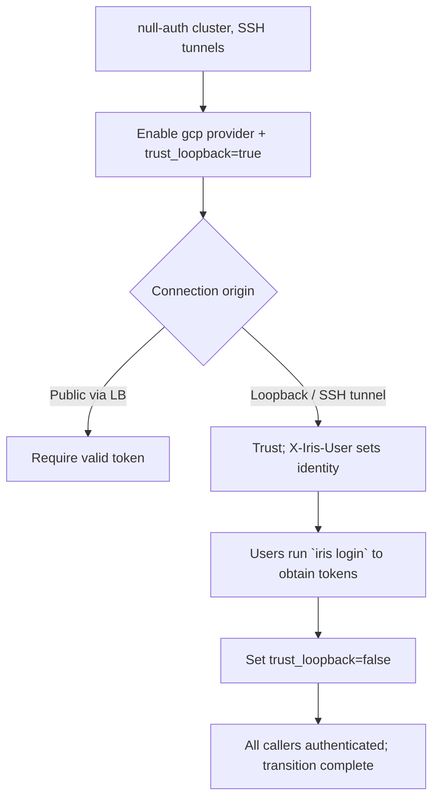

# Loopback-trust auth: the SSH→public transition for Iris

Part of the rollout of a public Iris controller (weaver #132). This documents
the auth transition path for the users who today reach the controller over an
SSH tunnel, and the security reasoning behind it.

## The problem

Today most operators reach the controller by tunnelling:

```bash
ssh -L 10000:localhost:10000 controller-host
iris --controller-url http://localhost:10000 status
```

The controller runs in **null-auth** mode: every request is treated as the
anonymous `admin` user. There are no tokens, and job ownership is meaningless
because everyone is `anonymous`.

We now want the same controller to be reachable on a public IP/DNS name behind
GCP IAP + an HTTPS load balancer, with real per-user authentication (the `gcp`
provider). But we cannot flip auth on for everyone at once: the SSH-tunnel users
have no tokens yet and would be locked out mid-transition.

We need a path where:

- **Public** connections (through the load balancer) require a valid token.
- **Loopback** connections (SSH tunnels, on-host clients) are trusted and may
  declare which user they are acting as, so jobs get correct ownership without a
  token.

## Why "trust loopback" is safe — and the trap that makes it unsafe

A TCP connection whose peer address is `127.0.0.1`/`::1` genuinely originates on
the controller host: the kernel will not complete a handshake for a spoofed
loopback source from off-box. SSH `-L` forwarding terminates on the host's
loopback, so tunnelled clients legitimately appear as loopback. Reaching
loopback already requires SSH access to the box, which is itself privileged.

**The trap:** the controller runs uvicorn with `proxy_headers=True,
forwarded_allow_ips="*"` (required so the load balancer's `X-Forwarded-Proto`
is honoured and redirect URLs don't leak the internal VPC IP). With `"*"`,
uvicorn rewrites `scope["client"]` to the **leftmost** `X-Forwarded-For` entry,
which is fully attacker-controlled. A public client can send:

```
X-Forwarded-For: 127.0.0.1
```

and the GCP load balancer *appends* the real client IP, producing
`127.0.0.1, <real-client>`. uvicorn's `always_trust` path returns the leftmost
hop, so `scope["client"]` becomes `("127.0.0.1", 0)`. **A naive
`client == 127.0.0.1` check is therefore spoofable from the public internet.**

### The discriminator: port 0

When uvicorn derives the client from a forwarded header it cannot recover the
client's port, so it sets the port to **0** (see
`uvicorn/middleware/proxy_headers.py`). A genuine direct TCP peer always has a
**nonzero** ephemeral port. So:

| Connection                              | `scope["client"]`        | `X-Forwarded-For` | Trusted? |
|-----------------------------------------|--------------------------|-------------------|----------|
| SSH tunnel / on-host                    | `("127.0.0.1", 54321)`   | absent            | ✅       |
| Public via LB (normal)                  | `("203.0.113.7", 0)`     | present           | ❌       |
| Public via LB, spoofing `127.0.0.1`     | `("127.0.0.1", 0)`       | present           | ❌       |

The trust rule is therefore:

> A request is **trusted-loopback** iff its transport peer host is a loopback
> address **and** its port is nonzero **and** it carries no `X-Forwarded-For`
> header.

The port and the absent-`X-Forwarded-For` checks are redundant (either alone
closes the spoof) but we require both as defence in depth, so a future change to
either uvicorn's port handling or the proxy config cannot silently open the
hole.

We deliberately keep a single listener rather than binding a separate
loopback-only socket (the alternative floated in #132). A single in-app check is
less deployment surface (no second port to tunnel, no second uvicorn server) and
is provably safe given the discriminator above.

## Behaviour matrix

With auth **enabled** (`provider` set) and `trust_loopback=true`:

| Caller                | Token         | Result                                                       |
|-----------------------|---------------|--------------------------------------------------------------|
| Public                | valid         | authenticated as token identity                              |
| Public                | invalid       | **rejected** (401 / UNAUTHENTICATED)                         |
| Public                | none          | **rejected** (401 / UNAUTHENTICATED)                         |
| Loopback              | valid         | authenticated as token identity (token wins)                 |
| Loopback              | none + `X-Iris-User: alice` | trusted as `alice`, role `admin`               |
| Loopback              | none, no header | trusted as `anonymous`, role `admin`                       |

`trust_loopback` is independent of the older `optional` flag:

- `optional=true` trusts **tokenless requests from anywhere** as anonymous admin
  — fine for a private dev cluster, **unsafe for a public one**.
- `trust_loopback=true` trusts tokenless requests **only from genuine loopback**,
  and lets them declare an identity.

For the public rollout set `optional=false` and `trust_loopback=true`.

## How a user declares their identity

Trusted-loopback callers set the `X-Iris-User` header to the username they want
their jobs owned by. The Iris CLI does this automatically: when no token
provider is configured it attaches `X-Iris-User: $USER`. Because the header is
honoured **only** on trusted-loopback connections, the CLI can always send it —
a public controller ignores it and still demands a token.

Trusted-loopback identities are granted the `admin` role, preserving the
full-control behaviour these operators had under null-auth. The declared
username drives job ownership and audit attribution. This is a transition
affordance, not the end state: once users have real tokens (`iris login`), drop
`trust_loopback` and let the provider assign roles per user.

## Operator workflow



1. **Stand up the public ingress.** Put the controller behind IAP + HTTPS LB.
   Keep `proxy_headers=True, forwarded_allow_ips="*"` (needed for correct
   redirect URLs).
2. **Enable auth in transition mode.** In the cluster `AuthConfig`, set the
   `gcp` provider (with `project_id`) and `trust_loopback=true`, `optional=false`.
   Public users now need tokens; SSH-tunnel users keep working and get correct
   ownership via `X-Iris-User`.
3. **Onboard users.** Each user runs `iris login` once to mint a JWT from their
   GCP identity. They can keep using the SSH tunnel during this window.
4. **Close the transition.** Once everyone has tokens, set `trust_loopback=false`.
   Loopback connections then require tokens like everyone else.

## Config reference

```textproto
auth {
  gcp { project_id: "my-project" }
  admin_users: "alice@example.com"
  optional: false          # do NOT trust tokenless public requests
  trust_loopback: true     # trust tokenless loopback requests (transition)
}
```

## Implementation map

- `lib/iris/src/iris/rpc/config.proto` — `AuthConfig.trust_loopback`.
- `lib/iris/src/iris/rpc/auth.py` — `is_trusted_loopback()`, `IRIS_USER_HEADER`,
  `resolve_auth()` extended with the loopback path.
- `lib/iris/src/iris/cluster/controller/auth.py` — `ControllerAuth.trust_loopback`,
  wired from the proto in `create_controller_auth()`.
- `lib/iris/src/iris/cluster/controller/dashboard.py` — `_DashboardAuthInterceptor`
  and `_enforce_http_auth()` pass the transport peer + headers into the shared
  resolver.
- `lib/iris/src/iris/cli/main.py` — client attaches `X-Iris-User` when no token
  provider is configured.
