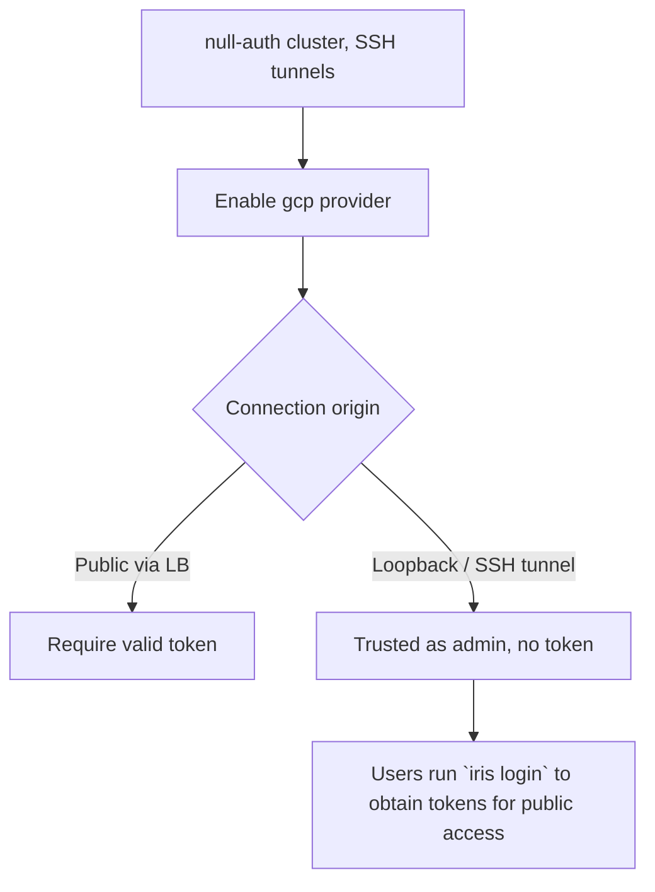

# Loopback-trust auth: the SSH→public transition for Iris

Part of the rollout of a public Iris controller (weaver #132). This documents
the auth transition path for the users who today reach the controller over an
SSH tunnel, and the security reasoning behind it.

## The problem

Today most operators reach the controller by tunnelling:

```bash
ssh -L 10000:localhost:10000 controller-host
iris --controller-url http://localhost:10000 status
```

The controller runs in **null-auth** mode: every request is treated as the
anonymous `admin` user. There are no tokens, and job ownership is meaningless
because everyone is `anonymous`.

We now want the same controller to be reachable on a public IP/DNS name behind
GCP IAP + an HTTPS load balancer, with real per-user authentication (the `gcp`
provider). But we cannot flip auth on for everyone at once: the SSH-tunnel users
have no tokens yet and would be locked out mid-transition.

We need a path where:

- **Public** connections (through the load balancer) require a valid token.
- **Loopback** connections (SSH tunnels, on-host clients) are trusted as the
  admin user without a token, so existing SSH workflows keep working unchanged.

This loopback trust is **always on** — there is no config flag. Reaching the
controller's loopback interface already requires SSH/host access, which is
itself privileged, so a genuine loopback peer is treated as the admin user
regardless of auth configuration. Jobs are still attributed per-user: the
client stamps the job name's owner segment with `$USER`, and an admin's
requested owner is authoritative (see "Job attribution" below).

## Why "trust loopback" is safe — and the trap that makes it unsafe

A TCP connection whose peer address is `127.0.0.1`/`::1` genuinely originates on
the controller host: the kernel will not complete a handshake for a spoofed
loopback source from off-box. SSH `-L` forwarding terminates on the host's
loopback, so tunnelled clients legitimately appear as loopback. Reaching
loopback already requires SSH access to the box, which is itself privileged.

**The trap:** the controller runs uvicorn with `proxy_headers=True,
forwarded_allow_ips="*"` (required so the load balancer's `X-Forwarded-Proto`
is honoured and redirect URLs don't leak the internal VPC IP). With `"*"`,
uvicorn rewrites `scope["client"]` to the **leftmost** `X-Forwarded-For` entry,
which is fully attacker-controlled. A public client can send:

```
X-Forwarded-For: 127.0.0.1
```

and the GCP load balancer *appends* the real client IP, producing
`127.0.0.1, <real-client>`. uvicorn's `always_trust` path returns the leftmost
hop, so `scope["client"]` becomes `("127.0.0.1", 0)`. **A naive
`client == 127.0.0.1` check is therefore spoofable from the public internet.**

### The discriminator: port 0

When uvicorn derives the client from a forwarded header it cannot recover the
client's port, so it sets the port to **0** (see
`uvicorn/middleware/proxy_headers.py`). A genuine direct TCP peer always has a
**nonzero** ephemeral port. So:

| Connection                              | `scope["client"]`        | `X-Forwarded-For` | Trusted? |
|-----------------------------------------|--------------------------|-------------------|----------|
| SSH tunnel / on-host                    | `("127.0.0.1", 54321)`   | absent            | ✅       |
| Public via LB (normal)                  | `("203.0.113.7", 0)`     | present           | ❌       |
| Public via LB, spoofing `127.0.0.1`     | `("127.0.0.1", 0)`       | present           | ❌       |

The trust rule is therefore:

> A request is **trusted-loopback** iff its transport peer host is a loopback
> address **and** its port is nonzero **and** it carries no `X-Forwarded-For`
> header.

The port and the absent-`X-Forwarded-For` checks are redundant (either alone
closes the spoof) but we require both as defence in depth, so a future change to
either uvicorn's port handling or the proxy config cannot silently open the
hole.

We deliberately keep a single listener rather than binding a separate
loopback-only socket (the alternative floated in #132). A single in-app check is
less deployment surface (no second port to tunnel, no second uvicorn server) and
is provably safe given the discriminator above.

## Behaviour matrix

With auth **enabled** (`provider` set):

| Caller    | Token   | Result                                          |
|-----------|---------|-------------------------------------------------|
| Public    | valid   | authenticated as token identity                 |
| Public    | invalid | **rejected** (401 / UNAUTHENTICATED)            |
| Public    | none    | **rejected** (401 / UNAUTHENTICATED)            |
| Loopback  | valid   | authenticated as token identity (token wins)    |
| Loopback  | invalid | **rejected** (a present token is always verified)|
| Loopback  | none    | trusted as `anonymous`, role `admin`            |

A present token is always verified first, so a bad token is rejected even over
loopback; only a **tokenless** loopback request gets the admin fallback.

This is independent of the older `optional` flag, which trusts tokenless
requests from **anywhere** as anonymous admin — fine for a private dev cluster,
**unsafe for a public one**. For the public rollout leave `optional=false`;
loopback trust still applies because it is keyed on the verified transport peer,
not on `optional`.

## Job attribution

Loopback callers resolve to a single principal (`anonymous`, role `admin`), so
how do jobs get the right owner? Through the job name, not the connection
identity:

- The client stamps the job name's owner segment with the local `$USER`
  (`resolve_job_user`), producing names like `/alice/train-run`.
- `LaunchJob` reconciles the requested owner against the caller's role
  (`controller/service.py`): a **non-admin** token caller is pinned to their own
  verified identity (so they cannot submit `/someone-else/job`), while an
  **admin** — including every loopback caller — keeps the requested owner.

So a loopback caller is admin (full control of the cluster) but their jobs are
still attributed to `$USER` via the name — exactly the null-auth behaviour SSH
users have today. `GetCurrentUser` returns the `anonymous`/`admin` principal.

## Operator workflow



1. **Stand up the public ingress.** Put the controller behind IAP + HTTPS LB.
   Keep `proxy_headers=True, forwarded_allow_ips="*"` (needed for correct
   redirect URLs).
2. **Enable auth.** In the cluster `AuthConfig`, set the `gcp` provider (with
   `project_id`) and `optional=false`. Public users now need tokens; SSH-tunnel
   users keep working as admin and jobs stay attributed to `$USER`.
3. **Onboard users.** Each user runs `iris login` once to mint a JWT from their
   GCP identity, then uses the public endpoint. The SSH tunnel keeps working
   throughout — there is no flag-flip cutover.

## Config reference

```textproto
auth {
  gcp { project_id: "my-project" }
  admin_users: "alice@example.com"
  optional: false          # do NOT trust tokenless public requests
}
```

(Loopback trust is unconditional — there is no config field for it.)

## Implementation map

- `lib/iris/src/iris/rpc/auth.py` — `is_trusted_loopback()`, `LOOPBACK_IDENTITY`,
  and `resolve_auth()` (tokenless loopback → admin).
- `lib/iris/src/iris/cluster/controller/dashboard.py` — `_DashboardAuthInterceptor`
  and `_enforce_http_auth()` pass the transport peer + headers into the shared
  resolver.
- `lib/iris/src/iris/cluster/controller/service.py` — `LaunchJob` reconciles the
  principal against the requested owner segment (admins act-as; non-admins pinned).
- `lib/iris/src/iris/cluster/client/job_info.py` — `resolve_job_user()` stamps
  the job name's owner segment with `$USER`.
