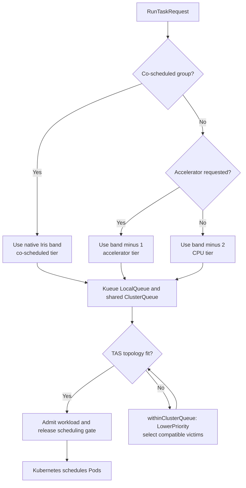

# Iris on CoreWeave

Iris runs CoreWeave jobs directly as Kubernetes Pods. The controller does not
start Iris worker daemons on CoreWeave. This page describes the current
architecture and configuration boundary.

Use the [cloud GPU tutorial](../../../docs/tutorials/cloud-gpu.md) to run a job,
the [federation reference](federation.md) to understand cross-cluster routing,
and the [Iris operations guide](../OPS.md) for live diagnosis and approved
operational changes.

## Quickstart

The `marin` federation config lists three CoreWeave research peers:

| Iris cluster | Accelerator | GPUs per node |
| --- | --- | ---: |
| `cw-rno2a` | H100 | 8 |
| `cw-us-east-02a` | H100 | 8 |
| `cw-us-east-08a` | GB200 | 4 |

The table identifies configured hardware, not live free capacity. The canonical
inventory is [`lib/iris/config/marin.yaml`](../config/marin.yaml); each peer's
hardware and Kubernetes settings live in `lib/iris/config/<cluster>.yaml`.

Use the [reserve-GPU skill](../../../.agents/skills/reserve-gpu/SKILL.md) for a
short development session and the [cloud GPU
tutorial](../../../docs/tutorials/cloud-gpu.md) for a normal Iris job. These
commands give a read-only view of a candidate cluster:

```bash
CLUSTER=cw-rno2a

uv run iris --cluster="$CLUSTER" cluster status
uv run iris --cluster="$CLUSTER" rpc controller list-backends
uv run iris --cluster="$CLUSTER" cluster dashboard
```

`list-backends` reports accelerator groups, nodes, and current availability.
CoreWeave has no Iris worker daemon, so the worker count in `cluster status` is
not a capacity signal. `cluster dashboard` holds a port-forward open until
Ctrl+C.

Controller lifecycle commands and direct Kubernetes writes change a shared
cluster. Use the [deployment
skill](../../../.agents/skills/deploy-iris-controllers/SKILL.md) and obtain
explicit approval before running them.

## Connecting

Operator-side Kubernetes access uses the kubeconfig and context in the selected
cluster file. Current research configs use `~/.kube/coreweave-iris` and pin a
context, so do not switch the file's current context.

For first-time access, follow CoreWeave's [token and kubeconfig
guide](https://docs.coreweave.com/security/authn-authz/manage-api-access-tokens)
for each required CKS cluster. Merge the downloaded cluster, user, and context
entries into `~/.kube/coreweave-iris`; preserve existing entries and set the
file mode to `600`.

If `cluster status` or `cluster dashboard` says the context does not exist,
compare the configured values with the file Iris is actually reading:

```bash
CLUSTER=cw-rno2a

printf 'KUBECONFIG=%s\n' "${KUBECONFIG:-<unset>}"
rg -n 'kubeconfig_path|kube_context|namespace' "lib/iris/config/${CLUSTER}.yaml"
kubectl --kubeconfig ~/.kube/coreweave-iris config get-contexts -o name

env -u KUBECONFIG uv run iris --cluster="$CLUSTER" cluster status
```

An exported `KUBECONFIG` selects the file, while the cluster config still pins
the context. Unset a stale override instead of copying contexts between files.
Iris commands that target CoreWeave use a Kubernetes port-forward and loopback
trust; they do not need `iris login`.

For a live access incident, continue in [CoreWeave GPU
Operations](../OPS.md#coreweave-gpu-operations). It separates the port-forward,
controller Service, Traefik ingress, and public LoadBalancer layers.

## Architecture

The control path is:

1. The Iris controller runs as a Kubernetes Deployment in the cluster.
2. `K8sTaskProvider` applies one Pod for each task attempt and reconciles Pod
   state back into Iris.
3. Kueue admits every task Pod. It gang-admits coscheduled jobs and applies the
   configured topology constraints.
4. Kubernetes places Pods on CoreWeave NodePools. CoreWeave, not Iris, manages
   node provisioning.

There is no Iris worker daemon, synthetic worker row, or Iris-managed slice on
this path. An Iris node-agent DaemonSet publishes same-node host and GPU
measurements to `telemetry_v1`. The cluster view retains Kubernetes readiness,
allocatable capacity, scheduling, and Pod state; hardware history remains in
`telemetry_v1`. `K8sTaskProvider.schedule()` and `autoscale()` are no-ops.
Capacity and task state come from Kubernetes nodes, Pods, and Kueue workloads.

GPU Pods request `nvidia.com/gpu`. On clusters with `host_network: true`, they
also request `rdma/ib` and use `ClusterFirstWithHostNet`. Coscheduled jobs add
Kueue topology annotations derived from
`kubernetes_provider.kueue.topologies`, or from the CoreWeave defaults when the
map is empty.

Task logs are shipped from the node's container log file to Finelog by a
sidecar. Process inspection and profiling run against the task container with
`kubectl exec`; they do not call a worker service.

### Federation ingress, authentication, and DNS

The public controller hostname is only a federation route. DNS points it at the
CoreWeave Traefik LoadBalancer, cert-manager issues its TLS certificate, and the
`iris-federation-ipallowlist` middleware admits only the configured federation
parent egress addresses. The controller then applies a second gate:

- in-cluster private addresses and loopback are trusted by `auth.trusted_cidrs`;
- off-cluster requests must carry a bearer token;
- federation tokens are verified with the public keys in
  `auth.federation_peers`.

The allowlist and controller authentication are independent. Do not weaken one
because the other is working. Pulumi owns Traefik, cert-manager, the Middleware,
and Cloudflare DNS; the cluster config supplies their inputs. See the [network
manifest builders](../src/iris/cluster/platforms/k8s/network_manifests.py), the
[Pulumi Traefik component](../../../infra/pulumi/src/iac/coreweave/traefik.py),
and the [federation reference](federation.md) for the handoff protocol.

### GPU topology and Kueue safety

H100 gangs use preferred InfiniBand leaf-group colocation. GB200 and GB300
NVL72 gangs use stricter rack-aware placement:

- an 18-node rack has 16 nodes guaranteed schedulable at once;
- up to 16 replicas bind to one NVLink domain;
- larger gangs require one node-saturating Pod with all four GPUs per tray, then
  split evenly over the fewest racks with 10 to 16 replicas per rack slice.
  Valid examples include 20, 24, 32, and 48 replicas.

Invalid multi-rack shapes fail before submission rather than silently losing
the one-slice-per-rack guarantee. The canonical arithmetic is in
[`coreweave_topology.py`](../src/iris/cluster/platforms/k8s/coreweave_topology.py).

Kueue's admission webhooks must remain scoped to the Iris task namespace. An
unscoped fail-closed webhook can block CNI and system Pods and deadlock node
delivery before Kueue itself starts. Pulumi pins the chart and applies the
namespace scope in
[`KueueAddon`](../../../infra/pulumi/src/iac/coreweave/kueue.py); do not replace
that release with an ad hoc cluster-wide install.

#### TAS preemption and CPU spillover

All Iris Pods use the topology-aware `cw-tas` ResourceFlavor. Its
`iris.kueue=true` selector covers every Iris-managed NodePool. Accelerator-free
Pods request unconstrained TAS, so Kueue records their per-node CPU reservations
in the same flavor as GPU gangs. `preemption.withinClusterQueue: LowerPriority`
can then remove a lower-priority CPU Workload from the topology snapshot before
retrying a blocked GPU gang's fit.

Each Iris band has three Kueue admission tiers. The controller reconciles the
six explicit CPU and accelerator `WorkloadPriorityClass` objects at startup;
co-scheduled groups inherit the numeric value of their Pod `PriorityClass`.

| Iris band | Ordinary CPU | Standalone accelerator | Co-scheduled group |
| --- | ---: | ---: | ---: |
| batch | -2 | -1 | 0 |
| interactive | 8 | 9 | 10 |
| production | 998 | 999 | 1000 |

The ordering is CPU < accelerator < co-scheduled group within a band. Kueue can
therefore reclaim same-band CPU reservations for one accelerator Pod, or both
lower tiers for a co-scheduled GPU group. A user-selected higher band still
outranks every tier in the band below it. Pod `priorityClassName` remains the
ordinary Iris band, so this ordering affects Kueue admission and preemption but
does not change kube-scheduler priority within an admitted workload.

The highest tier retains the native band value. Workloads created before this
mapping also use that value, so rollout cannot make existing same-band work a
lower-priority victim. Same-band preemption becomes fully effective after old
CPU and standalone-accelerator Workloads finish.



Accelerator-free jobs use any compatible node by default. Iris does not expose
a CPU-only placement constraint; rare jobs that require hard CPU-node placement
must use Kubernetes-native scheduling outside Iris. GPU and RDMA resource
requests exclude CPU nodes without an additional selector.

Kueue requires every node in a TAS flavor to carry every level in the referenced
Topology. CoreWeave supplies the physical hierarchy on accelerator nodes. Iris
labels CPU NodePools with a synthetic `iris-cpu-only` fabric, superpod,
leafgroup, and NVLink domain so unconstrained TAS can assign them at the hostname
level. The synthetic values do not advertise GPU or RDMA resources.

This layout replaces the selectorless, non-TAS `cw-cpu` flavor that caused
[#7916](https://github.com/marin-community/marin/issues/7916). Kueue v0.18 could
not reclaim those Pods during `cw-ib` topology fit; the general upstream case is
tracked by
[kubernetes-sigs/kueue#9992](https://github.com/kubernetes-sigs/kueue/issues/9992).
When migrating from the split flavors, apply the NodePool labels before
switching the ClusterQueue to `cw-tas`, then verify CPU nodes appear in Kueue's
topology cache.

## Resource ownership

| Resource | Owner |
| --- | --- |
| CKS cluster and operator kubeconfig | CoreWeave and the cluster operator |
| Namespace, RBAC, NodePools, Kueue operator, ClusterQueue, ResourceFlavor, ingress, and DNS | `infra/pulumi` |
| Pod and Workload priority classes, Kueue LocalQueue, controller ConfigMap, Deployment, Service, PDB, state volume, and Secrets | `K8sControllerProvider` |
| Task Pods and their lifecycle | `K8sTaskProvider` |
| Node scheduling and provisioning | Kubernetes and CoreWeave |

`K8sControllerProvider.verify_prerequisites()` only checks that the
Pulumi-owned resources exist. It does not create or repair them. Read the
[Pulumi guide](../../../infra/pulumi/README.md) before changing that substrate;
a destructive NodePool plan can deprovision reserved hardware.

## Configuration

`lib/iris/src/iris/cluster/config.py` defines the schema. The checked-in cluster
files are the source of truth for deployed values.

### Platform and controller

| Field | Meaning |
| --- | --- |
| `platform.label_prefix` | Prefix for managed labels and NodePool names. |
| `platform.coreweave.region` | CoreWeave region for this CKS cluster. |
| `platform.coreweave.namespace` | Namespace used by the controller lifecycle; defaults to `iris`. |
| `platform.coreweave.kubeconfig_path` | Operator-side kubeconfig. Current clusters use `~/.kube/coreweave-iris`. |
| `platform.coreweave.kube_context` | Context bound to every operator-side Kubernetes call. Do not rely on the kubeconfig's current context. |
| `platform.coreweave.object_storage_endpoint` | S3 endpoint seen by Pods inside CoreWeave. |
| `platform.coreweave.external_object_storage_endpoint` | Endpoint for the same store when Iris runs outside CoreWeave. It falls back to the internal endpoint when empty. |
| `controller.coreweave.port` | Controller RPC port; defaults to `10000`. |
| `controller.coreweave.service_name` | In-cluster Service name; defaults to `iris-controller-svc`. |
| `controller.coreweave.scale_group` | CPU scale group that hosts the controller. This is required. |
| `controller.coreweave.ingress_class` | Ingress class used by the external federation route. |

The operator kubeconfig path and context are removed before the cluster config
is written to the in-cluster ConfigMap. The controller and task provider use
their Kubernetes service account inside the cluster.

### Kubernetes task provider

| Field | Meaning |
| --- | --- |
| `kubernetes_provider.namespace` | Namespace for task Pods and the LocalQueue. |
| `kubernetes_provider.service_account` | Optional service account assigned to task Pods. |
| `kubernetes_provider.host_network` | Enables host networking and RDMA requests for GPU Pods. |
| `kubernetes_provider.cache_dir` | Node-local cache root. CoreWeave configs use `/mnt/local/iris-cache`. |
| `kubernetes_provider.controller_address` | In-cluster controller address injected into task Pods. |
| `kubernetes_provider.kueue.cluster_queue` | Pulumi-owned ClusterQueue to which Iris binds its LocalQueue. This is required. |
| `kubernetes_provider.kueue.topologies` | Optional `group_by` to CoreWeave node-label mappings. |
| `kubernetes_provider.preempt_namespaces` | Namespaces containing provider health-check Pods that Iris may clear when they block an admitted GPU job. |

An empty `kubernetes_provider.kubeconfig` means in-cluster authentication. That
is the normal CoreWeave controller configuration.

### Scale groups and NodePools

Each CoreWeave scale group becomes one NodePool:

| Field | Effect |
| --- | --- |
| `resources.device_variant` and `resources.device_count` | Accelerator identity and per-node count advertised to Iris. |
| `resources.cpu`, `resources.ram`, and `resources.disk` | Per-node capacity recorded in the scale-group config. |
| `buffer_slices` | Minimum node count for node-based pools. |
| `max_slices` | Maximum node count for node-based pools. |
| `slice_template.num_vms` | Multiplier applied to the node counts. Current CoreWeave groups use one VM per slice. |
| `slice_template.coreweave.instance_type` | CoreWeave node SKU. |

CoreWeave Console display names do not always match the Kubernetes
`spec.instanceType`. Use the value accepted by the live NodePool API.

For rack-based NVL72 SKUs, the NodePool uses `targetRacks` instead of the node
autoscaler fields. `max_slices * num_vms` must be divisible by the 18-node rack
size. `infra/pulumi/src/iac/nodepools.py` and
`lib/iris/src/iris/cluster/platforms/k8s/nodepool_manifests.py` contain the
projection rules.

## CoreWeave AI Object Storage access

The research clusters set `MARIN_PREFIX` to CoreWeave object storage. Use it for
durable inputs, outputs, and caches. Use
[`marin_temp_bucket`](../../../docs/tutorials/cloud-gpu.md#keep-data-on-coreweave)
for disposable data with a lifecycle deadline. Do not read or copy GCS data
from CoreWeave without explicit approval because the transfer incurs egress
cost.

The cluster config carries two endpoints for the same S3-compatible store:

| Caller | Config field | Current endpoint |
| --- | --- | --- |
| Task or controller Pod inside CoreWeave | `platform.coreweave.object_storage_endpoint` | `http://cwlota.com` |
| Operator process outside CoreWeave | `platform.coreweave.external_object_storage_endpoint` | `https://cwobject.com` |

Both domains require virtual-hosted bucket addressing. Let Iris, Rigging, or
[`fsutil`](../../../docs/references/fsutil.md) derive it; do not build endpoint
URLs by hand. For operator-side access, create a CoreWeave object-storage access
key and expose only its expected names:

```bash
export CW_KEY_ID=<key-id>
export CW_KEY_SECRET=<key-secret>
uv run fsutil buckets
```

During a controller deployment, Iris maps these values to the S3 variables in
`iris-task-env`. Normal task submissions then receive cluster-managed storage
access without carrying the operator's shell environment.

Task working directories and caches are node-local:

| Container path | Kubernetes volume | Lifetime |
| --- | --- | --- |
| `/app`, `/tmp` | `emptyDir` | Pod |
| `/uv/cache`, `/hf/cache`, `/cargo`, `/cache` | `hostPath` below `kubernetes_provider.cache_dir` | Node |
| `/dev/shm` | memory-backed `emptyDir` | Pod |

Keep `cache_dir` on `/mnt/local`, the node's NVMe storage. The shared Hugging
Face path is `HF_HUB_CACHE`; Iris deliberately leaves `HF_HOME` private because
it may contain the submitter's token. HostPath caches are not durable and are
not automatically pruned, so they can grow until the node is replaced or an
operator cleans them. Durable outputs belong in object storage.

`/cache` is unclaimed node-local scratch: a task that needs a real directory on
the node rather than a bucket picks its own subdirectory there. Nothing prunes
it, so treat anything written there as recoverable. `iris.runtime.jax_init` uses
`/cache/xla` for XLA's per-fusion autotune results on GPU tasks, because XLA
opens that directory from C++ and cannot read an object-store URL. JAX's own
compilation cache is the opposite case and stays on object storage under the
Marin prefix: JAX writes it only from process 0, so a node-local copy would
leave every other node permanently cold.

`storage.local_state_dir` controls controller SQLite storage. When it is empty,
Iris creates a controller state PVC. `storage.remote_state_dir` stores durable
controller checkpoints in object storage.

## Credentials Summary

Credentials have separate owners and scopes:

| Location | Scope |
| --- | --- |
| `~/.kube/coreweave-iris` | Operator access to CKS. It is not copied into Pods. |
| Checkout-local `.marin.yaml` or explicit job environment | Submitter-provided values such as W&B or Hugging Face credentials. |
| Operator `CW_KEY_ID` and `CW_KEY_SECRET` | Input used when deploying the cluster-managed object-storage Secret. |
| `iris-task-env` Secret | Object-storage credentials and names listed in `defaults.inject_env`; mounted by the controller and task Pods. |
| `iris-controller-env` Secret | Controller-only credentials such as the cluster signing key; task Pods do not mount it. |
| `defaults.task_env` | Non-secret cluster defaults written into task Pod environments. |

The Iris CLI loads `.marin.yaml` only when run from that checkout. SDK
submissions and commands from another directory must pass their task environment
explicitly. The deploy path rejects literal secrets before writing
`iris-cluster-config`: references remain in the ConfigMap, while resolved values
go through the two Secrets above.

Do not dump Pod environments or use `kubectl describe pod` on a task Pod; literal
job environment values can appear in the output. Inspect named keys and
scheduling fields instead, without printing Secret values.

## Troubleshooting

Start with Iris's retained task view. It already joins Pod, scheduler, and Kueue
state and remains available after Kubernetes garbage collection:

```bash
CLUSTER=cw-rno2a
TASK=/<user>/<job>/0

uv run iris --cluster="$CLUSTER" task describe "$TASK"
uv run iris --cluster="$CLUSTER" task events "$TASK"
uv run iris --cluster="$CLUSTER" rpc controller list-backends
```

`task events` records `ImagePullBackOff` and `CrashLoopBackOff` warnings. Pair it
with `iris job logs /<user>/<job>` for task output. An `Evicted` task can
indicate ephemeral-storage pressure. Raise the task's `disk` request only when
its `/app`, `/tmp`, or writable container layer is full; escalate node
`DiskPressure` instead of editing the Pod or NodePool.

For a Pending task, use these read-only Kubernetes checks when the Iris message
is not enough. Read the kubeconfig, context, and namespace from the cluster
config rather than copying the example values:

```bash
KUBECONFIG=~/.kube/coreweave-iris
CONTEXT=<platform.coreweave.kube_context>
NAMESPACE=<kubernetes_provider.namespace>

kubectl --kubeconfig "$KUBECONFIG" --context "$CONTEXT" get nodepool -o wide
kubectl --kubeconfig "$KUBECONFIG" --context "$CONTEXT" -n "$NAMESPACE" \
  get pods,workloads.kueue.x-k8s.io -o wide
kubectl --kubeconfig "$KUBECONFIG" --context "$CONTEXT" -n "$NAMESPACE" \
  get workload <workload-name> \
  -o jsonpath='{range .status.conditions[*]}{.type}{"\t"}{.status}{"\t"}{.reason}{"\t"}{.message}{"\n"}{end}'
```

`SchedulingGated` means Kueue has not admitted the Workload.
`QuotaReserved=False` explains quota or topology-fit failures. A NodePool with
`Valid=False` has a rejected configuration; a target/current mismatch usually
means nodes are still provisioning or unhealthy. Do not work around either by
editing the live objects. Pulumi owns NodePools and cluster-scoped Kueue
resources.

For actor-level Kubernetes API history after ordinary Events expire, use the
Kubernetes Audit Logs dashboard in CoreWeave Observe. `iris task events` is the
Iris-side record of backend observations and controller decisions; it is not an
API audit log.

For context errors, return to [Connecting](#connecting). For public federation
timeouts, controller restarts, kernel-deadlock recovery, or other live faults,
use [CoreWeave GPU Operations](../OPS.md#coreweave-gpu-operations). Kubernetes
`apply`, `delete`, `scale`, `drain`, `cordon`, and `uncordon` require explicit
operator approval.

## Onboarding and source routing

For a new CoreWeave cluster, follow the ownership boundary in order:

1. Obtain the CKS cluster, operator kubeconfig, object-storage bucket, and access
   keys. CKS and object storage are not Pulumi-managed today.
2. Add `lib/iris/config/<cluster>.yaml` from live cluster facts and the schema in
   [`config.py`](../src/iris/cluster/config.py). Do not copy fleet sizes from a
   document.
3. Provision the controller signing key with `iris cluster init-keys` and
   reference its private half from `auth.signing_key`. Add each parent
   controller's public key under `auth.federation_peers` so the CoreWeave
   controller can verify handoffs. Signing keys stay out of Pulumi state. See
   [federation credentials](federation.md#credentials-do-not-travel).
4. Follow the [Pulumi guide](../../../infra/pulumi/README.md) to create or adopt
   RBAC, NodePools, Kueue, Traefik, TLS, and DNS. Stop on any NodePool replacement
   or deletion in the preview.
5. If the cluster names a Finelog config, follow the [Finelog operations
   guide](../../finelog/OPS.md#onboarding-a-cluster-onto-the-forwarding-hub) for
   its separate forwarding key and deploy that service before the Iris
   controller.
6. Register the peer in the parent federation config and deploy the controller
   through the [deployment
   skill](../../../.agents/skills/deploy-iris-controllers/SKILL.md).
7. Verify `cluster status`, `list-backends`, the public federation route, and one
   representative topology-aware smoke before sending normal jobs.

Use this page for CoreWeave architecture and config, the [federation
reference](federation.md) for cross-cluster job semantics, the [Pulumi
guide](../../../infra/pulumi/README.md) for infrastructure, and
[`OPS.md`](../OPS.md) for live diagnosis.

## Source map

- [`backends/k8s/tasks.py`](../src/iris/cluster/backends/k8s/tasks.py) — task Pod
  manifests, Kueue status, profiling, and cleanup.
- [`platforms/k8s/controller.py`](../src/iris/cluster/platforms/k8s/controller.py)
  — controller resources, prerequisite checks, and Secret projection.
- [`platforms/k8s/service.py`](../src/iris/cluster/platforms/k8s/service.py) —
  context-bound Kubernetes calls and port-forwarding.
- [`platforms/k8s/coreweave_topology.py`](../src/iris/cluster/platforms/k8s/coreweave_topology.py)
  — topology labels and NVL72 rack rules.
- [`platforms/k8s/nodepool_manifests.py`](../src/iris/cluster/platforms/k8s/nodepool_manifests.py)
  — NodePool manifests shared by Iris and Pulumi.
- [`composer.py`](../src/iris/cluster/composer.py) — config-to-backend wiring.
- [`infra/pulumi/src/iac/coreweave/cluster.py`](../../../infra/pulumi/src/iac/coreweave/cluster.py)
  — Pulumi ownership of CoreWeave prerequisites.
