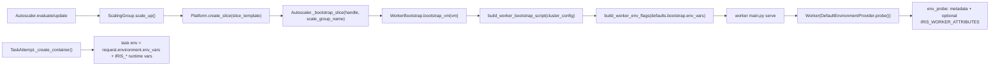

# Design: Multi-Region via Canonical Constraints

N.B. This design doc was machine generated and is primarily used for agent task tracking.
DO NOT use it as a canonical source of information about the project.

## Problem

Iris currently has two partial mechanisms for placement intent:

1. Worker/job constraints (already used by scheduler and partially by autoscaler for `preemptible`) (`/Users/power/code/marin/lib/iris/src/iris/cluster/controller/controller.py:53-127`, `/Users/power/code/marin/lib/iris/src/iris/cluster/controller/autoscaler.py:130-143`).
2. `ResourceSpecProto.regions` (defined in proto and emitted by client), but effectively not a canonical routing signal (`/Users/power/code/marin/lib/iris/src/iris/rpc/cluster.proto:243-254`, `/Users/power/code/marin/lib/iris/src/iris/cluster/types.py:459-470`).

This creates ambiguous ownership of placement semantics. The correct model is one canonical source.

A second gap is inheritance: child jobs inherit env/extras/pip today, but not constraints (`/Users/power/code/marin/lib/iris/src/iris/client/client.py:602-623`, `/Users/power/code/marin/lib/iris/src/iris/cluster/client/job_info.py:17-94`).
For multi-region workflows, users expect child jobs to keep parent placement intent unless explicitly overridden.

## Goals

- Make **constraints** the only canonical placement mechanism.
- Remove `regions` from resource schema and all call sites (no compatibility mode).
- Standardize constraint key names with shared constants in `/Users/power/code/marin/lib/iris/src/iris/cluster/types.py`.
- Add explicit parent->child constraint inheritance via `JobInfo` + `IrisClient.submit()`.
- Route autoscaler demand by canonical constraints (region + preemptible), not ad-hoc per-field extraction.
- Keep scheduler and autoscaler semantics aligned.

## Non-Goals

- Soft-placement preferences (only hard constraints in this design).
- Cross-region cost optimization policy.
- Backward compatibility for `resources.regions`.

## Canonical Model

### Single Source of Truth

Placement intent is encoded only as `Constraint` entries on jobs.

Required canonical keys:

- `PREEMPTIBLE_ATTRIBUTE_KEY = "preemptible"` (existing, already in `types.py`)
- `REGION_ATTRIBUTE_KEY = "region"` (new)

Both scheduler filtering and autoscaler routing consume the same constraint list.

### Key Consistency

Define key constants and helper constructors in `/Users/power/code/marin/lib/iris/src/iris/cluster/types.py`:

```python
PREEMPTIBLE_ATTRIBUTE_KEY = "preemptible"
REGION_ATTRIBUTE_KEY = "region"


def preemptible_constraint(preemptible: bool = True) -> Constraint:
    return Constraint(key=PREEMPTIBLE_ATTRIBUTE_KEY, op=ConstraintOp.EQ, value=str(preemptible).lower())


def region_constraint(regions: Sequence[str]) -> Constraint:
    if not regions:
        raise ValueError("regions must be non-empty")
    for r in regions:
        if not r:
            raise ValueError("region must be non-empty")
    if len(regions) == 1:
        return Constraint(key=REGION_ATTRIBUTE_KEY, op=ConstraintOp.EQ, value=regions[0])
    return Constraint(key=REGION_ATTRIBUTE_KEY, op=ConstraintOp.IN, values=tuple(regions))
```

Rule: all code paths use these constants/helpers; no raw string literals for these keys in controller/autoscaler/client/tests.

Required helper/parsing APIs (exact signatures):

```python
def preemptible_preference_from_constraints(
    constraints: Sequence[cluster_pb2.Constraint],
) -> bool | None: ...

def required_regions_from_constraints(
    constraints: Sequence[cluster_pb2.Constraint],
) -> frozenset[str] | None: ...

def normalize_constraints(
    constraints: Sequence[cluster_pb2.Constraint],
) -> NormalizedConstraints: ...
```

`NormalizedConstraints` (new dataclass in `/Users/power/code/marin/lib/iris/src/iris/cluster/types.py`):

```python
@dataclass(frozen=True)
class NormalizedConstraints:
    preemptible: bool | None
    required_regions: frozenset[str] | None
```

These helpers are the only allowed path for extracting canonical `preemptible`/`region` semantics.

## Schema and API Changes

### 1) Remove `regions` from `ResourceSpecProto`

Delete `repeated string regions` from `/Users/power/code/marin/lib/iris/src/iris/rpc/cluster.proto` and regenerate protobufs.

Also remove `regions` from client-facing resource objects:

- `/Users/power/code/marin/lib/iris/src/iris/cluster/types.py` (`ResourceSpec` dataclass + `to_proto()`)

No fallback parsing, no migration shim.

### 2) Keep constraints as the only placement API

`IrisClient.submit(... constraints=...)` remains the canonical interface (`/Users/power/code/marin/lib/iris/src/iris/client/client.py:549-640`).

## Worker/Group Configuration for Region Identity

Scale groups need stable worker identity so scheduler constraints and autoscaler routing can agree.

Add per-scale-group worker settings in `/Users/power/code/marin/lib/iris/src/iris/rpc/config.proto`:

```protobuf
message WorkerSettings {
  map<string, string> attributes = 1;
  map<string, string> env = 2;
}

message ScaleGroupConfig {
  ...
  SliceConfig slice_template = 50;
  WorkerSettings worker = 60;
}
```

`worker.attributes["region"]` is the canonical group region label.
`worker.attributes["preemptible"]` may be set for observability parity, but must match `slice_template.preemptible` when provided.

## Bootstrap/Worker Attribute and Env Flow

This section makes explicit how `ScaleGroupConfig.worker.attributes` and
`ScaleGroupConfig.worker.env` move through the runtime path.

### Current Flow (Before)



Properties of current flow:

- Bootstrap env is cluster-global (`defaults.bootstrap.env_vars`), not scale-group specific.
- `IRIS_WORKER_ATTRIBUTES` may exist, but not wired from scale-group config.
- There is no per-group default task env injection path.

### Proposed Flow (After)

```mermaid
flowchart LR
  A["Autoscaler.evaluate/update"] --> B["ScalingGroup.scale_up()"]
  B --> C["Platform.create_slice(slice_template)"]
  C --> D["Autoscaler._bootstrap_slice(handle, scale_group_name)"]
  D --> E["lookup group config by scale_group_name"]
  E --> F["WorkerBootstrap.bootstrap_vm(vm, group_worker_settings)"]
  F --> G["build_worker_bootstrap_script(cluster_config, group_worker_settings)"]
  G --> H["build_worker_env_flags(merge global + group attrs/env)"]
  H --> I["docker run worker with env: IRIS_WORKER_ATTRIBUTES, IRIS_TASK_DEFAULT_ENV_JSON, IRIS_SCALE_GROUP"]
  I --> J["worker main.py serve parses bootstrap-provided worker settings into WorkerConfig"]
  J --> K["Worker(DefaultEnvironmentProvider.probe())"]
  K --> L["env_probe merges IRIS_WORKER_ATTRIBUTES into WorkerMetadata.attributes"]
  J --> M["WorkerConfig.default_task_env"]
  M --> N["TaskAttempt._create_container() merges default_task_env + request env + IRIS_* runtime"]
```



### Explicit Hop-by-Hop Contract

1. Autoscaler -> ScalingGroup
- Input: `ScaleGroupConfig` with new `worker` block.
- Behavior: unchanged for slice creation; group identity (`scale_group_name`) is preserved.

2. ScalingGroup -> Slice creation
- Input: `slice_template` unchanged.
- Behavior: platform creates slice as today.

3. Autoscaler -> Bootstrap
- Change: `_bootstrap_slice(handle, scale_group)` resolves the owning group's `worker` settings and passes them into bootstrap generation.

4. Bootstrap script generation
- `build_worker_env_flags(...)` merges:
  - `defaults.bootstrap.env_vars` (cluster-global)
  - serialized `IRIS_WORKER_ATTRIBUTES` from `scale_group.worker.attributes`
  - serialized task defaults, e.g. `IRIS_TASK_DEFAULT_ENV_JSON` from `scale_group.worker.env`
  - infra metadata (optional `IRIS_SCALE_GROUP`)

5. Worker main / WorkerConfig
- `main.py serve` reads bootstrap env payload and threads:
  - worker attribute payload (for probe/registration)
  - `default_task_env` into `WorkerConfig`

6. Worker -> env_probe
- `DefaultEnvironmentProvider.probe()` calls `_get_extra_attributes()` which reads `IRIS_WORKER_ATTRIBUTES`.
- `_build_worker_attributes(...)` merges canonical attributes (`region`, `preemptible`, TPU attrs) into `WorkerMetadata.attributes`.

7. Worker -> TaskAttempt env creation
- `TaskAttempt._create_container()` merges env with explicit precedence:
  1. Iris runtime/system vars (`IRIS_*` core task metadata)
  2. `WorkerConfig.default_task_env` (from `scale_group.worker.env`)
  3. `request.environment.env_vars` (job-level override)

8. Resulting behavior
- Scheduler sees region/preemptible in worker attributes consistently.
- Autoscaler routes by canonical constraints and group labels consistently.
- Tasks get regional env defaults automatically without per-job duplication.

## Constraint Flow (End-to-End)

### Submit Path

1. User submits job with constraints via `IrisClient.submit()`.
2. Constraints are serialized into `LaunchJobRequest.constraints`.
3. Controller stores constraints in job state and passes them to scheduler.
4. Autoscaler receives the same constraints through demand entries.

### Runtime Propagation Path for Child Jobs

To support child inheritance, constraints must be present in `JobInfo` (which is reconstructed from env in job runtime).

Add `constraints` to `JobInfo` in `/Users/power/code/marin/lib/iris/src/iris/cluster/client/job_info.py`.

At task launch (`/Users/power/code/marin/lib/iris/src/iris/cluster/worker/task_attempt.py`), serialize current job constraints into env:

- `IRIS_JOB_CONSTRAINTS=<json>`

At runtime, `get_job_info()` parses `IRIS_JOB_CONSTRAINTS` into structured constraints.

Then `IrisClient.submit()` inheritance logic (`/Users/power/code/marin/lib/iris/src/iris/client/client.py`) merges parent constraints with child constraints.

Required serialization helpers (exact signatures):

```python
def constraints_to_json(constraints: Sequence[cluster_pb2.Constraint]) -> str: ...
def constraints_from_json(raw: str) -> list[cluster_pb2.Constraint]: ...
```

## Parent->Child Constraint Inheritance Semantics

### Merge Rules

1. Parent constraints are inherited by default.
2. Child explicit constraints override inherited constraints for the same `(key, op)` identity.
3. If child passes an explicit empty list, inheritance is disabled for that submission.
4. Duplicate exact constraints are de-duplicated.

Required merge helper (exact signature):

```python
def merge_constraints(
    parent: Sequence[Constraint],
    child: Sequence[Constraint],
) -> list[Constraint]: ...
```

Canonical override identity for this design:

- `region`: override by key only (`key == REGION_ATTRIBUTE_KEY`).
- `preemptible`: override by key only (`key == PREEMPTIBLE_ATTRIBUTE_KEY`).
- Other keys: preserve parent unless child provides the same `(key, op, value)` (dedup exact duplicate only).

For region and preemptible specifically:

- Parent `region=us-west4` + child no region => child runs in `us-west4`.
- Parent `region=us-west4` + child `region=eu-west4` => child uses `eu-west4`.
- Parent `preemptible=true` + child no preemptible => child inherits `true`.

### Why Environment is Used Here

Environment is only a transport for job metadata between controller-launched task runtime and in-process child submissions.
It is not a scheduling source by itself; scheduling still consumes structured constraints from the submitted request.

## Autoscaler and Scheduler Alignment

### Current divergence

Autoscaler currently special-cases preemptible extraction in controller code and does not handle region constraints uniformly.

### New model

Introduce a normalized constraint extraction utility used by `compute_demand_entries()`:

- Parses canonical keys (`region`, `preemptible`) from constraints.
- Keeps raw constraints attached for diagnostics.
- Rejects malformed values (`preemptible` not `true|false`, empty region).

`route_demand()` applies group compatibility checks derived from the same canonical keys.

Scheduler already evaluates constraints directly against worker attributes; no semantic change needed there.

## Validation Rules

### Config Validation

In `/Users/power/code/marin/lib/iris/src/iris/cluster/config.py`:

1. If `worker.attributes.region` is set for GCP groups, it must match `slice_template.gcp.zone` prefix.
2. If both `worker.attributes.preemptible` and `slice_template.preemptible` are set, they must agree.
3. `worker.attributes.region` cannot be empty.
4. Region/preemptible key names must come from constants (enforced in code references and tests).

### Constraint Validation

In controller demand normalization:

1. Region constraint must be `EQ` with non-empty string.
2. Preemptible constraint must be `EQ` with `"true"` or `"false"`.
3. Multiple region EQ constraints with different values => invalid demand entry.

## Key Code

### Snippet 1: canonical key constants

```python
# types.py
PREEMPTIBLE_ATTRIBUTE_KEY = "preemptible"
REGION_ATTRIBUTE_KEY = "region"


def region_constraint(regions: Sequence[str]) -> Constraint:
    ...


@dataclass(frozen=True)
class NormalizedConstraints:
    preemptible: bool | None
    required_regions: frozenset[str] | None


def normalize_constraints(constraints: Sequence[cluster_pb2.Constraint]) -> NormalizedConstraints:
    preemptible = preemptible_preference_from_constraints(constraints)
    regions = required_regions_from_constraints(constraints)
    return NormalizedConstraints(preemptible=preemptible, required_regions=regions)
```

### Snippet 2: parent/child constraint merge

```python
# client.py
parent_constraints = job_info.constraints if (parent_job_id and job_info) else []
child_constraints = constraints or []

if constraints is None:
    merged_constraints = parent_constraints
elif len(constraints) == 0:
    merged_constraints = []
else:
    merged_constraints = merge_constraints(parent_constraints, child_constraints)
```

### Snippet 2b: canonical merge behavior

```python
def merge_constraints(parent: Sequence[Constraint], child: Sequence[Constraint]) -> list[Constraint]:
    by_key: dict[str, list[Constraint]] = {}

    for c in parent:
        by_key.setdefault(c.key, []).append(c)

    # Canonical placement keys: child replaces parent entirely.
    for key in (REGION_ATTRIBUTE_KEY, PREEMPTIBLE_ATTRIBUTE_KEY):
        child_for_key = [c for c in child if c.key == key]
        if child_for_key:
            by_key[key] = child_for_key

    # Non-canonical keys append with exact dedup.
    for c in child:
        if c.key in (REGION_ATTRIBUTE_KEY, PREEMPTIBLE_ATTRIBUTE_KEY):
            continue
        existing = by_key.setdefault(c.key, [])
        if c not in existing:
            existing.append(c)

    merged: list[Constraint] = []
    for constraints_for_key in by_key.values():
        merged.extend(constraints_for_key)
    return merged
```

### Snippet 3: metadata transport via JobInfo env

```python
# task_attempt.py
if task.request.constraints:
    env["IRIS_JOB_CONSTRAINTS"] = constraints_to_json(task.request.constraints)

# job_info.py
raw = os.environ.get("IRIS_JOB_CONSTRAINTS", "[]")
constraints = constraints_from_json(raw)
```

### Snippet 4: controller demand normalization

```python
# controller.py
normalized = normalize_constraints(job.request.constraints)
entry = DemandEntry(
    ...,
    constraints=list(job.request.constraints),
    preemptible=normalized.preemptible,
    required_regions=normalized.required_regions,
)
```

## Implementation Outline (Spiral)

1. Slice A: remove non-canonical schema
- Remove `ResourceSpecProto.regions` from proto and regenerate.
- Remove `regions` from `ResourceSpec` and all call sites/tests.

2. Slice B: canonical key standardization
- Add `REGION_ATTRIBUTE_KEY` and `region_constraint()` in `types.py`.
- Add `normalize_constraints()` and related extraction helpers in `types.py`.
- Replace raw `"preemptible"`/`"region"` strings with constants and helper calls.

3. Slice C: constraint inheritance path
- Extend `JobInfo` with constraints.
- Add `IRIS_JOB_CONSTRAINTS` env transport in worker task launch.
- Add parent->child constraint merge in `IrisClient.submit()`.

4. Slice D: autoscaler routing alignment
- Replace ad-hoc preemptible extraction with `normalize_constraints()`.
- Add region-aware group filtering in `route_demand()`.
- Improve unmet reason diagnostics for region mismatch.

5. Slice E: config worker attributes/env
- Add `ScaleGroupConfig.worker` block.
- Validate region/preemptible consistency against slice template.
- Thread worker attributes through bootstrap (`IRIS_WORKER_ATTRIBUTES`).

6. Slice F: literal-to-constant migration (no compat)
- Remove string literal comparisons for `"preemptible"`/`"region"` in production code.
- Migrate tests to use `PREEMPTIBLE_ATTRIBUTE_KEY` and `REGION_ATTRIBUTE_KEY`.
- Add CI grep assertions that fail on new raw literals in selected directories.

## Testing

### Unit Tests

1. `/Users/power/code/marin/lib/iris/tests/cluster/test_types.py`
- `region_constraint()` construction and validation.
- Constraint merge helper behavior (override/dedup).
- `normalize_constraints()` parsing/validation behavior.

2. `/Users/power/code/marin/lib/iris/tests/cluster/platform/test_config.py`
- `worker.attributes.region` validation vs GCP zone.
- preemptible consistency validation.

3. `/Users/power/code/marin/lib/iris/tests/cluster/controller/test_state.py`
- Demand normalization for canonical region/preemptible keys.
- Invalid multi-region conflicts produce `invalid_reason`.
- No local string-literal extraction helpers remain in controller module.

4. `/Users/power/code/marin/lib/iris/tests/cluster/controller/test_autoscaler.py`
- Region-constrained demand routes only to matching groups.
- Combined region + preemptible matching.
- Mismatch yields unmet demand (no wrong scale-up).

5. `/Users/power/code/marin/lib/iris/tests/cluster/worker/test_env_probe.py`
- `IRIS_WORKER_ATTRIBUTES` region/preemptible parsing produces expected worker attributes.

6. `/Users/power/code/marin/lib/iris/tests/cluster/test_env_propagation.py`
- `IRIS_JOB_CONSTRAINTS` round-trip to `JobInfo`.
- Parent->child constraint inheritance and child override semantics.
- Explicit empty constraints disables inheritance.
- Merge behavior for non-canonical constraint keys remains additive.

7. `/Users/power/code/marin/lib/iris/tests/cluster/controller/test_scheduler.py`
- Constraint keys in test fixtures reference constants, not raw `"preemptible"`/`"region"` literals.

### Integration Tests

1. `/Users/power/code/marin/lib/iris/tests/e2e/`
- Two groups in distinct regions, jobs constrained per region, verify correct scale-up group.
- Parent submits child without explicit constraints, verify inherited region placement.
- Parent submits child overriding region, verify redirected placement.

## Documentation Updates

- Update Iris examples (including `/Users/power/code/marin/lib/iris/examples/marin.yaml`) to show canonical region constraints and `worker.attributes.region`.
- Update user-facing client docs to explain constraint inheritance semantics.
- Update any references to `resources.regions` to constraints-only language.

## String Literal Migration Plan

Production code migration targets:

1. `/Users/power/code/marin/lib/iris/src/iris/cluster/controller/controller.py`
- Remove `_extract_preemptible_preference()` literal checks.
- Replace with `normalize_constraints()` helper usage.

2. `/Users/power/code/marin/lib/iris/src/iris/cluster/worker/env_probe.py`
- Replace direct `PREEMPTIBLE_ATTRIBUTE_KEY` string fallback call sites with shared key constants only.

3. `/Users/power/code/marin/lib/iris/src/iris/cluster/controller/autoscaler.py`
- Ensure any region/preemptible matching references only normalized demand fields and constants.

4. `/Users/power/code/marin/lib/iris/src/iris/client/client.py`
- Constraint merge logic references constants and helper functions, not hardcoded key strings.

Test migration targets:

1. `/Users/power/code/marin/lib/iris/tests/cluster/controller/test_state.py`
2. `/Users/power/code/marin/lib/iris/tests/cluster/controller/test_autoscaler.py`
3. `/Users/power/code/marin/lib/iris/tests/cluster/controller/test_scheduler.py`
4. `/Users/power/code/marin/lib/iris/tests/cluster/worker/test_env_probe.py`

For these tests, replace raw key literals with imported constants or helper constructors (`preemptible_constraint`, `region_constraint`).

Repository guardrail:

- Add a lightweight test that greps selected source directories and fails if new raw literals are introduced for canonical keys where constants/helpers are expected.

## Risks and Mitigations

- Risk: hidden callers still setting `ResourceSpec.regions`.
Mitigation: hard removal with immediate type/proto breakage and targeted test updates.

- Risk: constraint merge surprises in nested job trees.
Mitigation: explicit merge rules and dedicated parent/child tests.

- Risk: key-name drift (`"region"` literals).
Mitigation: constants-only usage and lintable grep checks in tests.

## Future Work

- Add typed placement DSL if needed, but keep it compiled down to canonical constraints.
- Add policy layer for soft preferences and spillover behavior (without changing constraint source of truth).
