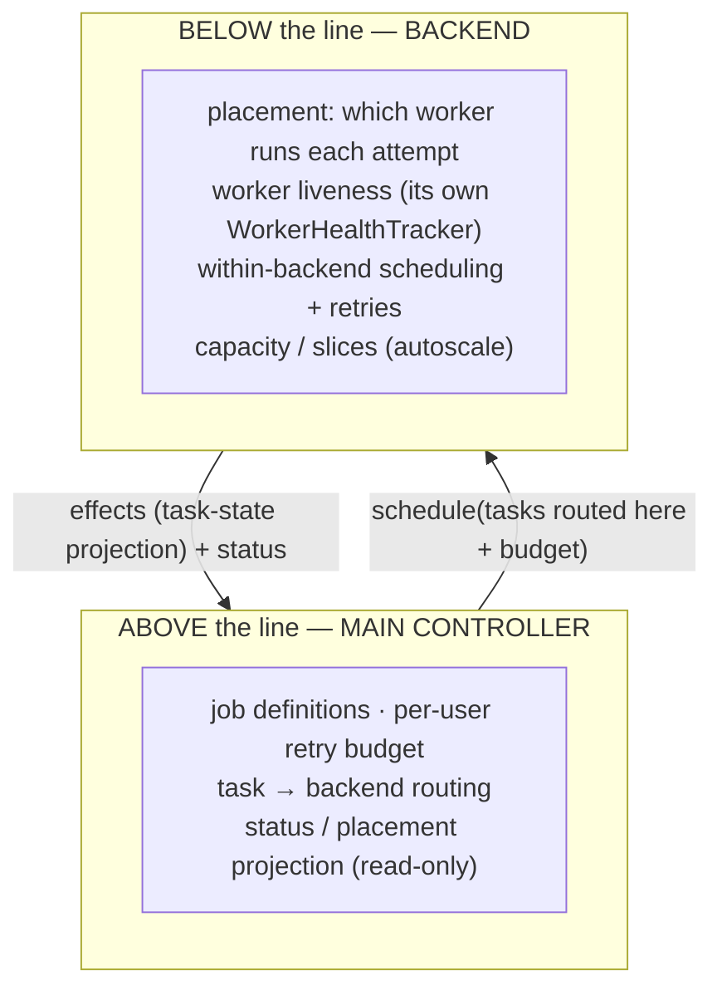
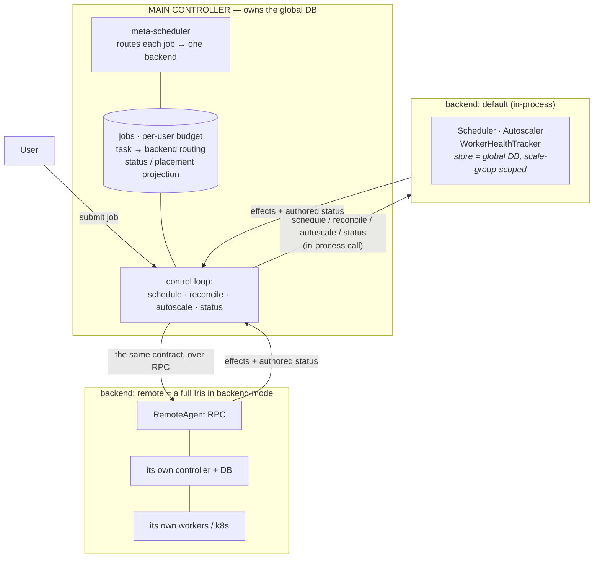
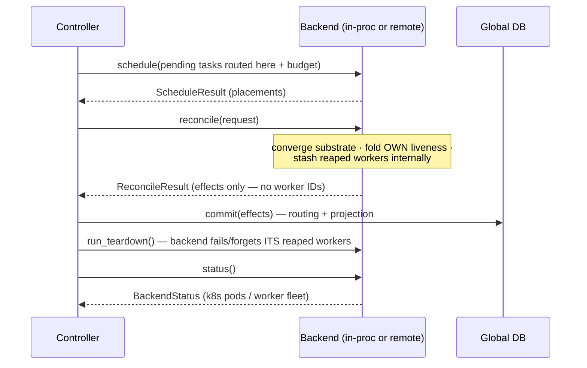

# Multi-backend: a controller of controllers

One Iris controller can front several execution backends at once — an in-process
pool of GCP/TPU workers, a Kubernetes cluster, and (in time) other Iris clusters
reached over RPC — behind a single endpoint. This page describes how authority is
split so that the arrangement stays clean as backends are added.

For the source layout and the `TaskBackend` Protocol's place in it, see
[`architecture.md`](architecture.md). For the reconcile kernel, see
[`reconcile_rpc.md`](reconcile_rpc.md).

## The one idea: partition authority at the assignment line

A job is routed to exactly one backend (the *assignment*). Everything **above**
that line is the main controller's; everything **below** it is the backend's.

The main controller is a *controller of controllers*: it owns the global
database (jobs, the `task → backend` routing, the per-user budget) and a
**read-only projection** of every task's status and placement, kept current so
the dashboard and the cross-backend directory work without round-tripping each
backend. It does **not** know which worker ran a task, whether that worker is
alive, or how the backend scheduled it — those never cross the boundary.

A backend owns everything below its assignment line: its worker inventory, the
attempt→worker placement, worker liveness, within-backend scheduling, and
capacity. It is authoritative there and nowhere else — no job definitions, no
cross-backend budget, no global directory.

## Projection, not state

A backend does not hand its state to the controller to hold. It **authors a
projection** — task-state `effects` plus a `status` snapshot — and the controller
commits/stores that. Where a backend's *operational* state physically lives is an
implementation detail behind the contract:

- The in-process `default` backend has no separate store; its store *is* the
  global DB, read scale-group-scoped. It authors `effects` the controller
  commits, and holds its own `WorkerHealthTracker` in memory.
- A remote backend keeps its operational state in its **own** DB. Only the
  projection crosses the wire.

This is why no `WorkerId` ever crosses the `reconcile` boundary: the controller
commits `effects` without learning any worker identities.

## The contract

Every backend — in-process or remote — implements the same `TaskBackend`
Protocol (`controller/backend.py`). The controller calls these uniformly each
tick; it never branches on the concrete backend type.

| Method | Controller → backend | Backend → controller |
|---|---|---|
| `schedule(ScheduleRequest)` | tasks routed here + per-user budget | `ScheduleResult` (placement decisions) |
| `reconcile(ReconcileRequest)` | (cluster backends only: dispatch-drained pod updates) | `ReconcileResult` — **`effects` only**; the backend folds its own liveness and stashes the workers its fold reaped, internally |
| `run_teardown()` | (no arguments) | fails its reaped workers, terminates their slices and healthy siblings, forgets them from its **own** tracker |
| `autoscale(AutoscaleRequest)` | residual demand | `AutoscaleResult` (capacity changes) |
| `status()` | — | `BackendStatus` (authored k8s pod/node detail or worker-fleet detail, for the dashboard) |

**Owned by the backend:** its `WorkerHealthTracker`, `WorkerSource`, and
`Autoscaler`. A worker-daemon backend constructs its own tracker and seeds it
from its scale-group-scoped worker view; worker registration routes to the owning
backend's tracker by scale group. **Owned by the controller:** the database, the
meta-scheduler, the per-user budget, and the loop cadence; it reaches per-worker
liveness only through the backends (`liveness_for_worker`, `all_liveness`).

## Static layout

## One tick

Teardown runs **after** the reconcile effects are committed, so each backend
reads a fresh snapshot where the just-finalized attempts are already terminal and
skipped. No worker identity passes through the controller at any step.

## In-process and remote are the same contract

The `default` backend is the degenerate, single-process case of the same model:
its store is the global DB and the call is a direct method invocation. A remote
backend is a full Iris controller running in "backend mode" — its own DB,
scheduler, autoscaler, and workers (or k8s) — with the identical `schedule` /
`reconcile` / `autoscale` / `status` surface exposed as RPCs on a `RemoteAgent`.
Because the remote backend is itself a controller, the main controller retains
only the `task → backend` routing and the projection the remote reports; the
remote handles everything below the assignment line. Adding a backend kind means
implementing the Protocol and declaring its
[capabilities](architecture.md#the-taskbackend-contract) — nothing in the control
loop changes.
