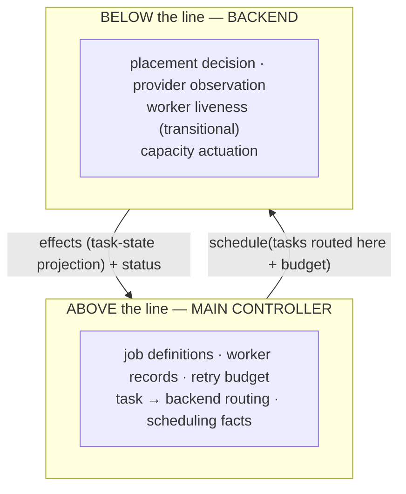
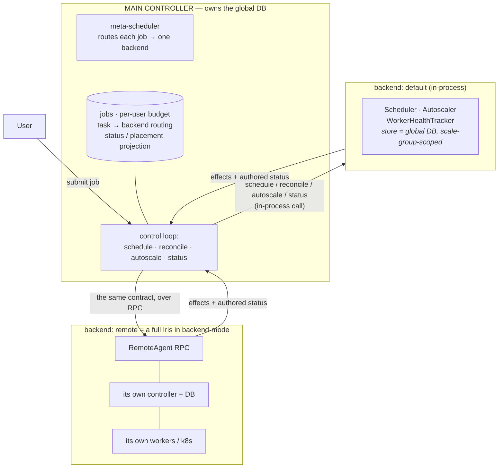
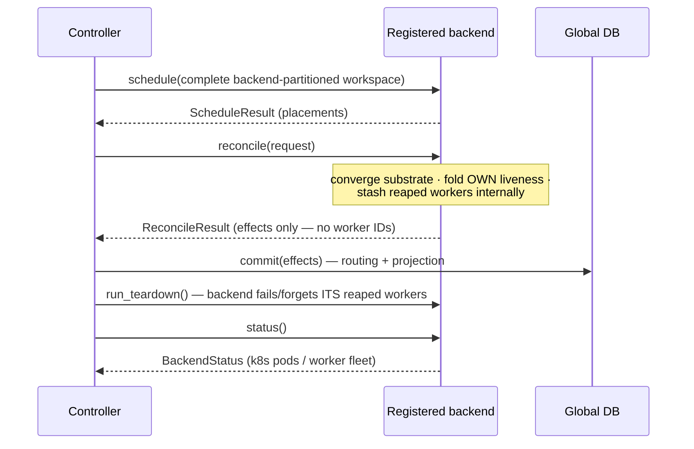

# Multi-backend controller

One Iris controller can front several execution backends at once — an in-process
pool of GCP/TPU workers, a Kubernetes cluster, and (in time) other Iris clusters
reached over RPC — behind a single endpoint. This page describes how authority is
split so that the arrangement stays clean as backends are added.

For the source layout and the `TaskBackend` Protocol's place in it, see
[`architecture.md`](architecture.md). For the reconcile kernel, see
[`reconcile_rpc.md`](reconcile_rpc.md).

## Partition work at the assignment line

A job is routed to exactly one backend (the *assignment*). Everything **above**
that line is the main controller's; everything **below** it is the backend's.

```mermaid
flowchart TB
    subgraph Above["ABOVE the line — MAIN CONTROLLER"]
        a["job definitions · worker records · retry budget<br/>task → backend routing · scheduling facts"]
    end
    Above -- "schedule(tasks routed here + budget)" --> Below
    Below -- "effects (task-state projection) + status" --> Above
    subgraph Below["BELOW the line — BACKEND"]
        b["placement decision · provider observation<br/>worker liveness (transitional)<br/>capacity actuation"]
    end
```

The controller owns the global database, backend routing, worker records, task
assignments, and per-user budget. It builds a complete scheduling workspace for
each backend from one transaction snapshot. The backend decides placement and
performs provider-specific I/O. The controller commits the returned effects.

Worker liveness and teardown still live in worker-daemon backends through a
scale-group-scoped controller-DB store. That is transitional boundary debt, not
part of the final ownership model. Kubernetes backends have no Iris workers and
observe or actuate pods directly.

## Current storage boundary

All current backends run in the controller process and share its database. The
controller supplies scheduling state explicitly. The worker-daemon backend still
uses `DbBackendWorkerStore` for reconcile, status, autoscale, and teardown, and
holds its own `WorkerHealthTracker`. A later stage moves those reads and lifecycle
decisions into controller-owned requests and commits.

## The contract

Every backend — in-process or remote — implements the same `TaskBackend`
Protocol (`controller/backend.py`). The controller calls these uniformly each
tick; it never branches on the concrete backend type.

| Method | Controller → backend | Backend → controller |
|---|---|---|
| `schedule(ScheduleRequest)` | complete controller-built workspace: owned workers, routed tasks, running attempts, per-user budget | `ScheduleResult` (placement decisions) |
| `reconcile(ReconcileRequest)` | (cluster backends only: dispatch-drained pod updates) | `ReconcileResult` — **`effects` only**; the backend folds its own liveness and stashes the workers its fold reaped, internally |
| `run_teardown()` | (no arguments) | fails its reaped workers, terminates their slices and healthy siblings, forgets them from its **own** tracker |
| `autoscale(AutoscaleRequest)` | residual demand | `AutoscaleResult` (capacity changes) |
| `status()` | — | `BackendStatus` (authored k8s pod/node detail or worker-fleet detail, for the dashboard) |

**Registered by the backend:** one immutable `BackendDescriptor` containing its
ID, capabilities, advertised attributes, and scale groups. The composition root
calls `controller.register_backend(backend)` before `start()`; no parallel
backend map or routing config is passed to the controller.

**Owned by the backend today:** its `WorkerHealthTracker`, transitional
`DbBackendWorkerStore`, and `Autoscaler`. A worker-daemon backend constructs its own tracker and seeds it
from its scale-group-scoped worker view; worker registration routes to the owning
backend's tracker by scale group. **Owned by the controller:** the database, the
meta-scheduler, the per-user budget, and the loop cadence; it reaches per-worker
liveness only through the backends (`liveness_for_worker`, `all_liveness`).

## Static layout

```mermaid
flowchart TB
    User -->|submit job| Tick
    subgraph Ctl["MAIN CONTROLLER — owns the global DB"]
        Meta["meta-scheduler<br/>routes each job → one backend"]
        G[("jobs · per-user budget<br/>task → backend routing<br/>status / placement projection")]
        Tick["control loop:<br/>schedule · reconcile · autoscale · status"]
        Meta --- G --- Tick
    end
    subgraph B1["backend: default (in-process)"]
        I1["Scheduler · Autoscaler<br/>WorkerHealthTracker<br/><i>store = global DB, scale-group-scoped</i>"]
    end
    subgraph B2["backend: remote = a full Iris in backend-mode"]
        RA["RemoteAgent RPC"] --- RC["its own controller + DB"] --- RW["its own workers / k8s"]
    end
    Tick -- "schedule / reconcile / autoscale / status<br/>(in-process call)" --> B1
    Tick -- "the same contract, over RPC" --> RA
    B1 -- "effects + authored status" --> Tick
    RA -- "effects + authored status" --> Tick
```

## One tick

```mermaid
sequenceDiagram
    participant C as Controller
    participant B as Registered backend
    participant DB as Global DB
    C->>B: schedule(complete backend-partitioned workspace)
    B-->>C: ScheduleResult (placements)
    C->>B: reconcile(request)
    Note over B: converge substrate · fold OWN liveness ·<br/>stash reaped workers internally
    B-->>C: ReconcileResult (effects only — no worker IDs)
    C->>DB: commit(effects) — routing + projection
    C->>B: run_teardown() — backend fails/forgets ITS reaped workers
    C->>B: status()
    B-->>C: BackendStatus (k8s pods / worker fleet)
```

Teardown runs **after** the reconcile effects are committed, so each backend
reads a fresh snapshot where the just-finalized attempts are already terminal and
skipped.

## Extension boundary

The `default` worker backend and Kubernetes backends are in-process direct method
calls. Adding another backend kind means implementing `TaskBackend`, supplying
one immutable descriptor, and registering the object before controller start.
The phase request/result boundary could support a remote adapter later, but Iris
does not currently implement one.
