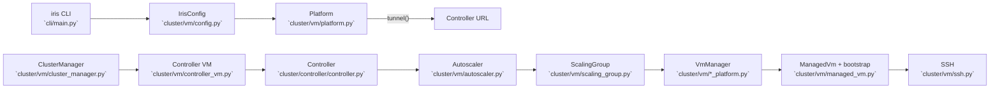

# Iris VM/Platform Refactor

## Background (Pre-Refactor)

Before this change, controller-owned autoscaler logic lived under `cluster/vm/`, which blurred ownership boundaries. The controller owned autoscaling policy, but the code lived alongside platform-specific VM operations and bootstrapping. That made it harder to reason about where controller responsibilities ended and platform responsibilities began.

## Goals

- Move controller-owned functionality (autoscaler, scaling group logic, demand routing) into `cluster/controller/`.
- Consolidate platform responsibilities under `cluster/platform/`.
- Provide platform-generic VM lifecycle APIs for controller bootstrap and CLI cleanup.
- Keep platform-specific details contained to platform modules and opaque overrides.
- Preserve runtime behavior and RPCs while updating paths.

Non-goals:

- Redesigning autoscaler policy or scheduling semantics.
- Adding backward compatibility shims or deprecation layers.

## Historical Flow (Before Refactor)



## Implemented Layout (Current)

```
lib/iris/src/iris/
  config.py                  # top-level IrisConfig + config loading
  cluster/
    controller/
      controller.py
      autoscaler.py
      scaling_group.py
    platform/
      base.py                # shared VM lifecycle types
      platform.py            # platform factory + GCP/manual/local implementations
      gcp_tpu_platform.py    # GCP TPU management
      manual_platform.py     # manual hosts
      local_platform.py      # local platform
      ssh.py                 # SSH + tunneling helpers
      worker_vm.py           # WorkerVm + bootstrap + registry
      controller_runtime.py  # controller lifecycle wrapper
      controller_vm.py       # controller bootstrap helpers + LocalController
```

## Shared Types (Avoiding Leakage)

Shared types live in `cluster/platform/base.py` and are intentionally minimal:

```python
@dataclass(frozen=True)
class VmInfo:
    vm_id: str
    address: str
    zone: str | None
    labels: Mapping[str, str]
    state: VmState
    created_at_ms: int

@dataclass(frozen=True)
class ContainerSpec:
    image: str
    entrypoint: list[str]
    env: Mapping[str, str]
    ports: Mapping[str, int]
    health_port: int | None = None

@dataclass(frozen=True)
class VmBootstrapSpec:
    role: Literal["controller", "worker"]
    container: ContainerSpec
    labels: Mapping[str, str]
    bootstrap_script: str | None = None
    provider_overrides: Mapping[str, object] = field(default_factory=dict)
```

Design rules:

- `VmInfo` contains only identity and connectivity. Provider-specific metadata stays in platform-specific code.
- `VmBootstrapSpec` describes *what to run*. Provisioning details live in `provider_overrides` and are interpreted only by the platform implementation.

## Controller Lifecycle Wrapper

`cluster/platform/controller_runtime.py` is a thin wrapper that composes platform VM APIs with the controller bootstrap recipe:

- Uses `Platform.list_vms/start_vms/stop_vms` for GCP/manual controller VMs.
- Uses `LocalController` from `controller_vm.py` for local mode.
- Keeps controller bootstrap logic (container command, config YAML, health checks) centralized.

This keeps controller ownership intact while letting platform implementations manage infrastructure.

## Zone Handling Decisions

- Platform APIs accept an optional `zone` parameter for operations that can be zoned.
- Platform ops are **zone-scoped** and do not sweep all zones implicitly.
- CLI commands that need global behavior (e.g., `cluster stop`) iterate all configured zones by default. `--zone` is an override.
- Autoscaler status now includes `group_zones` in the routing decision for observability. The value is the first configured zone (single-zone support today).

## Current Control Flow

```mermaid
flowchart LR
  CLI["iris CLI\n`cli/main.py`"] --> IrisConfig["IrisConfig\n`iris/config.py`"]
  IrisConfig --> Platform["Platform\n`cluster/platform/platform.py`"]
  Platform --> ControllerRuntime["ControllerRuntime\n`cluster/platform/controller_runtime.py`"]
  ControllerRuntime --> Controller["Controller\n`cluster/controller/controller.py`"]
  Platform -->|"tunnel()"| Tunnel["Controller URL"]

  Controller --> Autoscaler["Autoscaler\n`cluster/controller/autoscaler.py`"]
  Autoscaler --> ScalingGroup["ScalingGroup\n`cluster/controller/scaling_group.py`"]
  ScalingGroup --> VmManager["VmManager\n`cluster/platform/vm_platform.py`"]
  VmManager --> WorkerVm["WorkerVm + bootstrap\n`cluster/platform/worker_vm.py`"]
  WorkerVm --> SSH["SSH\n`cluster/platform/ssh.py`"]
```



## Change List (Implemented)

- Moved autoscaler and scaling group code to `cluster/controller/`.
- Renamed `ManagedVm` to `WorkerVm` and moved VM/SSH modules under `cluster/platform/`.
- Added platform-generic VM lifecycle APIs (`list_vms/start_vms/stop_vms`) with optional `zone`.
- Added `ControllerRuntime` to manage controller lifecycle via platform APIs.
- Moved config handling to top-level `iris/config.py`.
- Updated CLI to use the platform and controller runtime wrappers.
- Extended autoscaler status with `group_zones` for routing visibility.

## Spiral Plan (Executed)

Stage 1: Top-level config and platform factory
- Add `iris/config.py` with `IrisConfig` and defaults.
- Update imports to use top-level config.

Stage 2: Platform VM lifecycle APIs + controller wrapper
- Add `VmInfo`/`VmBootstrapSpec` shared types in `cluster/platform/base.py`.
- Extend platform implementations with `list_vms/start_vms/stop_vms`.
- Implement `ControllerRuntime` on top of platform APIs.

Stage 3: Move packages, update autoscaler + UI
- Move `cluster/vm/*` to `cluster/platform/*` and rename `ManagedVm` to `WorkerVm`.
- Move autoscaler/scaling group into `cluster/controller/`.
- Update autoscaler status with zone visibility and update dashboard rendering.
