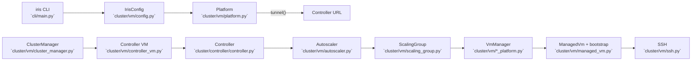
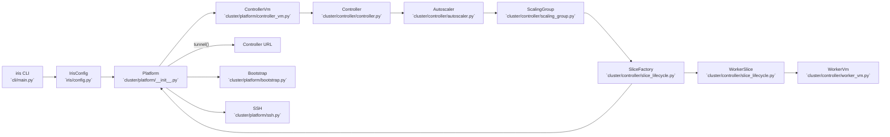

# Iris VM/Platform Refactor

## Background (Pre-Refactor)

Historically, controller-owned autoscaler logic lived under `cluster/vm/`, which blurred ownership boundaries. The controller owned autoscaling policy, but the code lived alongside platform-specific VM operations and bootstrapping. That made it harder to reason about where controller responsibilities ended and platform responsibilities began.

## Goals

- Move controller-owned functionality (autoscaler, scaling group logic, demand routing, worker lifecycle) into `cluster/controller/`.
- Consolidate platform responsibilities under `cluster/platform/`.
- Separate platform concepts (VMs vs slices) while keeping provider-specific details inside platform modules.
- Keep data objects serializable via `vm.proto` (no duplicate dataclasses for VM/slice info).
- Preserve runtime behavior and RPCs while updating paths.

Non-goals:

- Redesigning autoscaler policy or scheduling semantics.
- Adding backward compatibility shims or deprecation layers.

## Historical Flow (Before Refactor)



## Implemented Layout (Current)

```
lib/iris/src/iris/
  config.py                  # top-level IrisConfig + config loading
  cluster/
    controller/
      controller.py
      autoscaler.py
      scaling_group.py
      worker_vm.py           # worker VM lifecycle + registry
      slice_lifecycle.py     # slice factory + controller-owned slice wrapper
    platform/
      base.py                # shared platform types + protocols
      bootstrap.py           # controller/worker bootstrap scripts + health checks
      gcp.py                 # GCP TPU + controller VM management
      manual.py              # manual hosts
      local.py               # local in-process platform
      ssh.py                 # SSH + tunneling helpers
      env_probe.py           # environment discovery (worker)
      controller_vm.py       # controller lifecycle wrapper + LocalController
      cluster_manager.py     # cluster lifecycle wrapper (controller + tunnel)
```

## Key Types and Ownership

Platform owns VMs and slices. Controller owns scaling groups, autoscaler policy, and worker lifecycle.

| Type | Purpose | Location | Notes |
| --- | --- | --- | --- |
| `vm_pb2.VmInfo` | VM state + identity | `iris/rpc/vm.proto` | Serialized RPC data only. |
| `vm_pb2.VmState` | VM state enum | `iris/rpc/vm.proto` | Single source of truth. |
| `vm_pb2.SliceInfo` | Slice state + VM membership | `iris/rpc/vm.proto` | Serialized RPC data only. |
| `ContainerSpec` | Container launch spec | `cluster/platform/base.py` | Platform-agnostic input. |
| `VmBootstrapSpec` | VM bootstrap spec | `cluster/platform/base.py` | Provider overrides live in `provider_overrides`. |
| `SliceVmTarget` | SSH target for VM in a slice | `cluster/platform/base.py` | Platform-provided connection targets. |
| `SliceHandle` | Platform handle for a slice | `cluster/platform/base.py` | `describe()` returns `vm_pb2.SliceInfo`. |
| `WorkerVm` | Worker lifecycle + bootstrap | `cluster/controller/worker_vm.py` | Controller-owned, platform-agnostic. |
| `WorkerSlice` | Controller-owned slice wrapper | `cluster/controller/slice_lifecycle.py` | Wraps a `SliceHandle` + `WorkerVm`s. |
| `SliceFactoryProtocol` | Create/discover controller slices | `cluster/controller/slice_lifecycle.py` | Implemented by platform-backed factories. |
| `ScalingGroup` | Demand/scale logic + slice ownership | `cluster/controller/scaling_group.py` | Owns per-group slice state. |
| `Autoscaler` | Policy evaluation + group coordination | `cluster/controller/autoscaler.py` | Coordinates multiple groups. |
| `ControllerVm` | Controller VM lifecycle wrapper | `cluster/platform/controller_vm.py` | Uses `Platform` for infra actions. |

Design rules:

- **Data objects live in proto** (`VmInfo`, `VmState`, `SliceInfo`), not in Python dataclasses.
- **Platform owns infra** (VMs/slices, SSH, bootstrapping scripts).
- **Controller owns policy + lifecycle** (Worker VM orchestration, scaling group state, autoscaler decisions).
- `SliceHandle.describe()` returns `vm_pb2.SliceInfo` and is the only platform-to-controller slice summary API.

## Current Control Flow



## Zone Handling Decisions

- Platform APIs accept an optional `zone` parameter for operations that can be zoned.
- Platform ops are **zone-scoped** and do not sweep all zones implicitly.
- CLI commands that need global behavior (e.g. `cluster stop`) iterate all configured zones by default. `--zone` is an override.
- We currently support **single-zone** operation; if multiple zones are configured, platform helpers require the caller to pass `zone` explicitly.

## Options Considered

1) Controller runtime wrapper vs controller VM wrapper
- Separate runtime wrapper adds an extra indirection layer but duplicates lifecycle logic.
- Consolidating into `ControllerVm` keeps bootstrap + platform wiring in one place and removes an extra API surface.
- **Chosen:** `ControllerVm` (no separate runtime wrapper).

2) Global `list_slices()` vs zone-scoped `list_slices()`
- Global sweeps are surprising and hard to reason about when zones expand.
- Zone-scoped calls are explicit; the CLI can still iterate zones for global behavior.
- **Chosen:** zone-scoped APIs with CLI-driven iteration.

3) Platform slice handles vs VM group protocol in platform
- Platform owns slices/VMs and should expose handles only.
- Controller owns slice groups and uses `SliceHandle` to construct `WorkerSlice` instances.
- **Chosen:** platform exposes `SliceHandle` + proto data; controller owns `SliceGroupProtocol`.

## Change List (Implemented)

- Consolidated platform code under `cluster/platform/` with a single platform factory in `cluster/platform/__init__.py`.
- Introduced `bootstrap.py` to own controller/worker bootstrap scripts and health checks.
- Renamed platform implementations to `gcp.py`, `manual.py`, `local.py`.
- Added `ControllerVm` wrapper that drives controller lifecycle via platform APIs.
- Moved worker VM lifecycle to `cluster/controller/worker_vm.py`.
- Added controller-owned slice lifecycle in `cluster/controller/slice_lifecycle.py`.
- Updated CLI, cluster manager, tests, and docs to match new module structure.
- Kept all data objects in `vm.proto` (no duplicate dataclasses).

## Spiral Plan (Executed)

Stage 1: Shared types + bootstrap
- Move platform-agnostic types to `cluster/platform/base.py`.
- Extract controller + worker bootstrap scripts into `cluster/platform/bootstrap.py`.
- Update `WorkerVm` to use shared bootstrap helpers.

Stage 2: Platform layout + controller wrapper
- Rename platform modules to `gcp.py`, `manual.py`, `local.py`.
- Add platform factory + `Platform` protocol in `cluster/platform/__init__.py`.
- Implement `ControllerVm` wrapper and remove controller runtime indirection.

Stage 3: Controller lifecycle ownership
- Move worker VM lifecycle to `cluster/controller/worker_vm.py`.
- Add controller-owned slice lifecycle (`SliceHandle` -> `WorkerSlice`).
- Update autoscaler/scaling group to use controller slice factory.

Stage 4: Wire-up + cleanup
- Update CLI and cluster manager imports to new platform layout.
- Update tests and documentation to match new module structure.
- Confirm zone handling is explicit and single-zone-safe.
