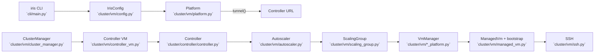
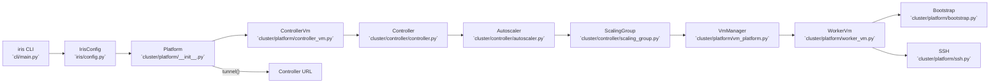

# Iris VM/Platform Refactor

## Background (Pre-Refactor)

Historically, controller-owned autoscaler logic lived under `cluster/vm/`, which blurred ownership boundaries. The controller owned autoscaling policy, but the code lived alongside platform-specific VM operations and bootstrapping. That made it harder to reason about where controller responsibilities ended and platform responsibilities began.

## Goals

- Move controller-owned functionality (autoscaler, scaling group logic, demand routing) into `cluster/controller/`.
- Consolidate platform responsibilities under `cluster/platform/`.
- Provide platform-generic VM lifecycle APIs for controller bootstrap and CLI cleanup.
- Keep platform-specific details contained to platform modules and opaque overrides.
- Preserve runtime behavior and RPCs while updating paths.

Non-goals:

- Redesigning autoscaler policy or scheduling semantics.
- Adding backward compatibility shims or deprecation layers.

## Historical Flow (Before Refactor)



## Implemented Layout (Current)

```
lib/iris/src/iris/
  config.py                  # top-level IrisConfig + config loading
  cluster/
    controller/
      controller.py
      autoscaler.py
      scaling_group.py
    platform/
      base.py                # shared VM lifecycle types
      bootstrap.py           # controller/worker bootstrap scripts + health checks
      gcp.py                 # GCP TPU + controller VM management
      manual.py              # manual hosts
      local.py               # local in-process platform
      ssh.py                 # SSH + tunneling helpers
      env_probe.py           # environment discovery (worker)
      worker_vm.py           # WorkerVm + registry + lifecycle
      controller_vm.py       # controller lifecycle wrapper + LocalController
      vm_platform.py         # VM group protocols/status helpers
```

## Shared Types (Avoiding Leakage)

Shared types live in `cluster/platform/base.py` and are intentionally minimal:

```python
@dataclass(frozen=True)
class VmInfo:
    vm_id: str
    address: str
    zone: str | None
    labels: Mapping[str, str]
    state: VmState
    created_at_ms: int

@dataclass(frozen=True)
class ContainerSpec:
    image: str
    entrypoint: list[str]
    env: Mapping[str, str]
    ports: Mapping[str, int]
    health_port: int | None = None

@dataclass(frozen=True)
class VmBootstrapSpec:
    role: Literal["controller", "worker"]
    container: ContainerSpec
    labels: Mapping[str, str]
    bootstrap_script: str | None = None
    provider_overrides: Mapping[str, object] = field(default_factory=dict)
```

Design rules:

- `VmInfo` contains only identity + connectivity. Provider-specific metadata stays in platform-specific code.
- `VmBootstrapSpec` describes *what to run*. Provisioning details live in `provider_overrides` and are interpreted only by the platform implementation.
- `VmState` is platform-agnostic (booting/running/terminated/failed) and is mapped to platform-specific states in each provider module.

## Controller Lifecycle Wrapper

`cluster/platform/controller_vm.py` is a thin wrapper that composes platform VM APIs with the controller bootstrap recipe:

- Uses `Platform.list_vms/start_vms/stop_vms` for GCP/manual controller VMs.
- Uses `LocalController` for local mode.
- Pulls bootstrap scripts and health checks from `cluster/platform/bootstrap.py`.

This keeps controller ownership intact while letting platform implementations manage infrastructure.

## Zone Handling Decisions

- Platform APIs accept an optional `zone` parameter for operations that can be zoned.
- Platform ops are **zone-scoped** and do not sweep all zones implicitly.
- CLI commands that need global behavior (e.g. `cluster stop`) iterate all configured zones by default. `--zone` is an override.
- We currently support **single-zone** operation; if multiple zones are configured, platform helpers require the caller to pass `zone` explicitly.

## Current Control Flow



## Options Considered

1) Separate `ControllerRuntime` module vs `ControllerVm`
- Separate runtime wrapper adds an extra indirection layer but duplicates controller lifecycle logic.
- Consolidating into `ControllerVm` keeps bootstrap + platform wiring in one place and removes an extra API surface.
- **Chosen:** `ControllerVm` (no separate runtime wrapper).

2) Global `list_slices()` vs zone-scoped `list_slices()`
- Global sweeps are surprising and hard to reason about when zones expand.
- Zone-scoped calls are explicit; the CLI can still iterate zones for global behavior.
- **Chosen:** zone-scoped APIs with CLI-driven iteration.

3) Bootstrap logic in `controller_vm.py` vs separate module
- Keeping scripts in `controller_vm.py` co-locates controller lifecycle and shell templates.
- Extracting to `bootstrap.py` makes both worker + controller bootstrap reusable and testable.
- **Chosen:** `cluster/platform/bootstrap.py`.

## Change List (Implemented)

- Consolidated platform code under `cluster/platform/` with a single platform factory in `cluster/platform/__init__.py`.
- Introduced `bootstrap.py` to own controller/worker bootstrap scripts and health checks.
- Renamed platform implementations to `gcp.py`, `manual.py`, `local.py`.
- Added `ControllerVm` wrapper that drives controller lifecycle via platform APIs.
- Moved environment probing to `cluster/platform/env_probe.py`.
- Updated CLI and cluster manager to use `ControllerVm` and platform APIs.
- Preserved shared type boundaries via `VmInfo`, `VmBootstrapSpec`, and `ContainerSpec`.

## Spiral Plan (Executed)

Stage 1: Shared types + bootstrap
- Move shared VM lifecycle types to `cluster/platform/base.py`.
- Extract controller + worker bootstrap scripts into `cluster/platform/bootstrap.py`.
- Update WorkerVm to use shared bootstrap helpers.

Stage 2: Platform layout + controller wrapper
- Rename platform modules to `gcp.py`, `manual.py`, `local.py`.
- Add platform factory + `Platform` protocol in `cluster/platform/__init__.py`.
- Implement `ControllerVm` wrapper and remove controller runtime indirection.

Stage 3: Wire-up + cleanup
- Update CLI and cluster manager imports to new platform layout.
- Update tests and documentation to match new module structure.
- Confirm zone handling is explicit and single-zone-safe.
