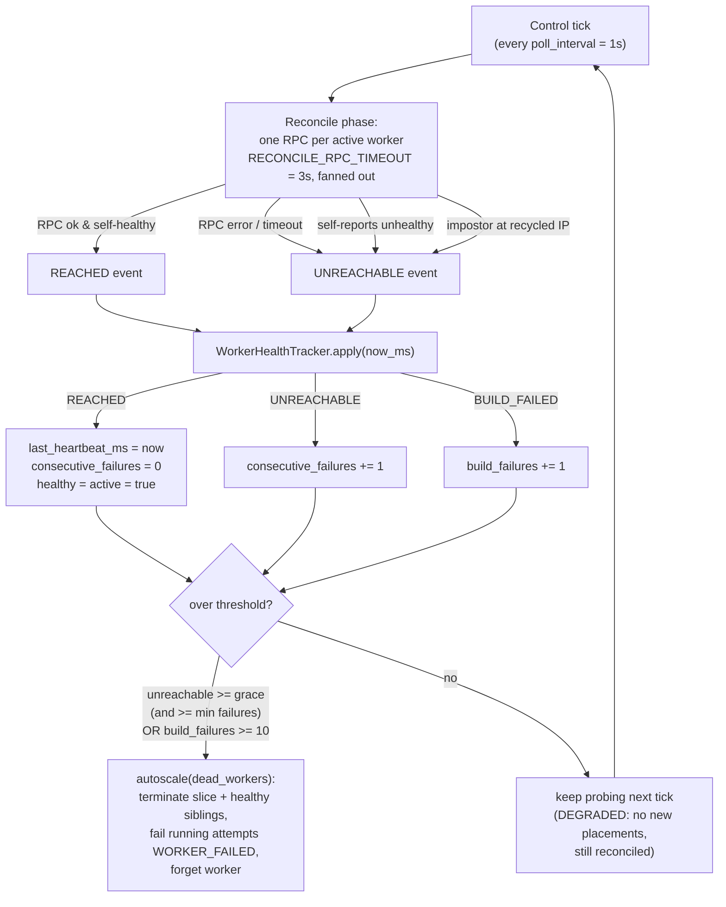

# Worker Health Checking

How the Iris controller decides a worker is dead, how long that takes, and why
the threshold is expressed in wall-clock time.

## The mechanism

Iris has **no ping loop and no separate liveness channel**. The per-tick
reconcile RPC outcome is the *only* liveness signal. Every `poll_interval` the
controller runs one control tick (`schedule → reconcile → autoscale`), and the
reconcile phase issues one RPC to each active worker. The backend only
*observes* the outcome; the controller *owns* the verdict, folding observations
through the single `WorkerHealthTracker.apply` site.



Two independent termination paths feed the `over threshold?` gate:

- **Unreachable** — consecutive failed reconciles. Reset to zero by any REACHED.
- **Build failures** — a monotonic counter (`BUILD_FAILURE_THRESHOLD = 10`),
  not reset by REACHED, for a worker that answers but keeps failing to launch
  attempts.

A worker over a threshold is reaped by `autoscale(dead_workers=...)`, which
tears down its slice (and healthy siblings), fails its running attempts as
`WORKER_FAILED`, and forgets it.

## The problem: detection latency was 3–12× the configured grace

`worker_unreachable_grace` defaults to **50 s** — the intended wall-clock window
a worker may be continuously unreachable before teardown. The old code realized
this as a *count* of consecutive failures:

```
reconcile_failure_threshold = round(grace / poll_interval) = round(50 / 1) = 50
```

This is correct **only if each reconcile pass costs `poll_interval` (1 s)**. It
does not. When a worker is actually down, its reconcile RPC blocks until
`RECONCILE_RPC_TIMEOUT` (3 s), and the single-threaded control tick also runs
the autoscale phase (describing booting slices, health probes), which under
load stretches a tick to 10–12 s. So a *failing* pass costs 3–12 s, not 1 s, and
50 failures took **~150–600 s** to accumulate, not 50 s.

This was visible in production: a worker with 33 consecutive failures and a
last heartbeat 7 minutes old still read **Healthy** (33 < 50), and a task on a
wedged worker churned through dozens of ~9.5-minute attempts (each attempt
runs until the worker finally crosses 50 failures, is reaped as `WORKER_FAILED`,
and the task retries) — a lot of noise for users.

## How other cluster managers do it

Worker/node liveness detection clusters into two regimes:

| System | Liveness signal | Probe interval | Failure threshold | Detection time |
| --- | --- | --- | --- | --- |
| **Ray** | raylet heartbeat | 1 s | `num_heartbeats_timeout` = 30 | **~30 s** |
| **Kubernetes** (node) | kubelet→apiserver | 10 s | `node-monitor-grace-period` = 40 s | **~40 s** (then pod eviction after `tolerationSeconds`, default 300 s) |
| **Kubernetes** (liveness probe) | kubelet→container | 10 s | `failureThreshold` = 3 | **~30 s** → restart |
| **Apache Mesos** | master↔agent ping | 15 s | `max_agent_ping_timeouts` = 5 | **~75 s** |
| **HashiCorp Nomad** | client→server heartbeat | dynamic | `heartbeat_grace` = 10 s | **~10–30 s** |
| Slurm | slurmctld↔slurmd | — | `SlurmdTimeout` = 300 s | ~300 s |
| YARN | NM→RM heartbeat | 1 s | `expiry-interval-ms` = 600000 | ~600 s |
| HDFS | DataNode→NameNode | 3 s | 2×recheck + 10×interval | ~630 s |
| **Iris (before)** | reconcile RPC | 1 s (3 s when down) | 50 consecutive failures | **~150–600 s** |
| **Iris (after)** | reconcile RPC | 1 s | `worker_unreachable_grace` = 50 s, wall-clock | **~50 s** |

The fast band (Ray, Kubernetes, Mesos, Nomad: **30–75 s**) is the interactive,
autoscaled-orchestration regime — worker churn is normal and a stale worker is a
black hole, so detection is aggressive. The slow band (Slurm, YARN, HDFS:
**5–10 min**) is HPC/batch, where nodes are long-lived, churn is rare, and a
false-positive teardown is very expensive.

Iris autoscales preemptible TPU/GPU slices: churn is normal and a wedged worker
both wastes capacity and generates attempt spam. It belongs in the **fast
band**, and its intended 50 s grace already sits squarely there. The defect was
that the grace was not actually realized.

## The fix: time-based reaping

Detection is now measured in wall-clock time, exactly as the config name
implies. A worker is reaped when it has been continuously unreachable for at
least `worker_unreachable_grace`:

```
unreachable = consecutive_failures >= MIN_UNREACHABLE_FAILURES
              and (now_ms - last_heartbeat_ms) >= worker_unreachable_grace
```

- The `now - last_heartbeat` test makes detection latency **independent of tick
  duration** — whether a failing tick costs 3 s or 12 s, the worker is reaped
  ~50 s after its last successful reconcile.
- The `MIN_UNREACHABLE_FAILURES` floor (3) guards against a single anomalously
  long tick (e.g. a GC pause or controller stall that ages every worker's
  heartbeat at once): a worker needs at least three *real* failed reconcile
  attempts before the clock can trip it, so a stall that produces no reconciles
  cannot mass-reap the fleet on resume.

`worker_unreachable_grace` stays at 50 s — conservative within the fast band
(more tolerant of a network blip than Ray's 30 s or Kubernetes' 40 s), but now
honoured. Local/e2e clusters keep their 10 s grace for fast deterministic
teardown.

The autoscaler's separate slice-level health counter
(`CONSECUTIVE_FAILURE_THRESHOLD`, used for empty/no-worker slice teardown on the
10 s autoscale tick) is unchanged.
