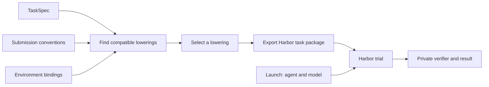

# TaskCompendium

## What problem does it solve?

Training and evaluation tasks arrive with different prompt formats, answer rules, tools, and graders. TaskCompendium separates the problem a model must solve from the way a framework runs and grades it. A caller can choose among compatible presentations of a task while keeping its reference answer private. Additional environment bindings can use the same task definition.

The current implementation is a small direct-chat slice. It accepts a final text or number answer, exports a Harbor task, and grades the answer through a private verifier registry. The task model also names file, workspace-state, and native-action results, but this slice has no environment binding or submission convention for those result types.

## What does it contain?

- **Task specs** describe the source problem, the required capabilities, the kind of result, and how to verify it.
- **Submission conventions** describe how to ask for and extract a result, such as a plain answer or a JSON object.
- **Environment bindings** describe the capabilities and tools exposed during execution. The only binding in this slice is direct chat with no tools.
- **Lowering tools** find compatible convention and binding pairs, select a pair, and export a runnable Harbor task package.
- **A Harbor adapter** runs the exported task with a replay agent or an OpenAI-compatible chat endpoint and records a grading result.



## What is a task spec?

`TaskSpec` is the private definition of one source task. An importer or author creates it before choosing a submission convention or a framework launch.

| Field | Meaning |
| --- | --- |
| `id` | Stable identity for this task. |
| `instructions` | The source problem presented to the model. A submission convention may append an answer instruction. |
| `source` | Dataset, revision, row, and importer revision used to reproduce the spec. |
| `requirements` | Capabilities or named action interfaces the execution environment must provide. |
| `answer_type` | The semantic result: `text`, `number`, `file`, `workspace_state`, or `native_action`. It does not prescribe a wrapper such as JSON. |
| `permitted_submission_conventions` | Optional list of convention IDs allowed by source-specific output rules. Omit it when any compatible convention is valid. |
| `verifier` | A private verifier kind and validated parameters. The built-in `exact_answer` kind holds the expected answer and text-normalization rules. |
| `schema_version` | Version of the serialized spec, checked when the record is loaded. |

For example, a task asking “What is 7 + 5?” can have `answer_type=number` and a private expected answer of `12`. That answer type can be submitted as plain text or as `{"answer":"12"}`. A task whose original instructions require an exact output shape can restrict the allowed conventions. The verifier and expected answer are never added to the model-visible instruction.

## What is a lowering?

A lowering is one runnable presentation of a spec for a target framework. It combines a compatible submission convention with an environment binding, then writes the target's task files. The spec says *what* result is needed; the convention says *how* the model delivers it; the binding says *which capabilities* the environment provides. Agent and model selection happens when the task is launched.

`SubmissionConvention.supports(spec.answer_type)` checks the result kind. `compatible_lowerings` also applies any source-specific convention restriction and checks the environment requirements. The direct-chat binding accepts only tasks with no required capabilities or action interfaces; a task requiring `shell` has no candidate in this slice. `select_lowerings` can keep all candidates, take the first, or sample one with an explicit RNG key. The order of the caller-supplied convention and binding sequences determines the first candidate and the sample order. A training caller should record those ordered inputs, the selection policy and key, and the TaskCompendium code revision.

```python
from pathlib import Path

from taskcompendium.lowering import (
    HarborTaskBinding,
    SelectionPolicy,
    compatible_lowerings,
    lower_to_harbor,
    select_lowerings,
)
from taskcompendium.grading import exact_answer
from taskcompendium.models import AnswerType, Source, TaskRequirements, TaskSpec
from taskcompendium.submission import AnswerFormat, SubmissionConvention

spec = TaskSpec(
    id="arithmetic-7-plus-5",
    instructions="What is 7 + 5?",
    verifier=exact_answer("12"),
    source=Source(dataset="hand-authored", revision="2026-09-16", row="arithmetic-7-plus-5", importer_revision="1"),
    requirements=TaskRequirements(),
    answer_type=AnswerType.NUMBER,
)
conventions = (
    SubmissionConvention(id="plain", answer_format=AnswerFormat.PLAIN),
    SubmissionConvention(id="json", answer_format=AnswerFormat.JSON),
)
candidates = compatible_lowerings(spec, conventions, (HarborTaskBinding(),))
chosen = select_lowerings(candidates, SelectionPolicy.SAMPLE, rng_key=1234)[0]
lower_to_harbor(spec, chosen.convention, chosen.binding, Path("/tmp/arithmetic-task"))
```

## How does Harbor run it?

`lower_to_harbor` writes `instruction.md` and `task.toml` for Harbor, plus `specification.json`, `submission_convention.json`, and `binding.json` for the launcher and custom verifier. The package also has an empty `environment/` directory. The agent receives the instruction but has no tool to read the package files. Harbor's custom verifier can read the spec and private reference answer. The convention file tells it how to extract the submitted answer.

`run_trial` takes the exported directory, its binding, and a launch choice. A replay launch supplies a fixed response without calling a model. It exercises Harbor's agent and verifier path:

```python
import asyncio

from taskcompendium.harbor.runner import HarborLaunch, run_trial

result = asyncio.run(
    run_trial(
        Path("/tmp/arithmetic-task"),
        chosen.binding,
        HarborLaunch("replay", agent_kwargs={"response": "12"}),
        Path("/tmp/arithmetic-trials"),
        "arithmetic-run",
    )
)
assert result.verifier_result.rewards == {"reward": 1.0}
```

For a model run, pass a chat launch to `run_trial` instead. Provide the endpoint's base URL and, if needed, the name of an environment variable containing the API key. The agent reads that variable at request time; the trial configuration retains only its name.

```python
launch = HarborLaunch(
    "chat",
    model="model-id",
    agent_kwargs={"api_base": "https://example.com/v1", "api_key_env": "MODEL_API_KEY"},
)
```

Harbor runs the agent in the direct-chat environment, which exposes no filesystem or shell tools. The custom verifier reads the final response and resolves the private verifier kind to a registered handler. The handler receives its validated Pydantic parameters, the response and convention, and Harbor's verifier-side environment. The built-in exact-answer handler extracts and compares the answer directly, without a temporary answer file. A wrong answer receives reward `0.0`; a malformed submission has no reward; a verifier infrastructure failure has no reward and is recorded separately in `taskcompendium-result.json`. The package requires Harbor's [custom-verifier task loading](https://github.com/marin-community/harbor/pull/155) and does not use `tests/test.sh`.

Run the package tests from the repository root:

```bash
uv run --project lib/taskcompendium --extra harbor --group test pytest lib/taskcompendium/tests -q
```
