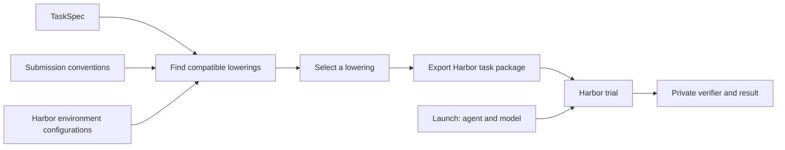

# TaskCompendium

The bounded [task curation pipeline](../../docs/references/task-curation.md)
normalizes pinned HF, generated and snapshot samples, exercises shared graders, applies
dataset-specific review rubrics, and records filtering evidence. Runs
write `audit.parquet` with every input and its reasons, review evidence and cleanup
history, then export the accepted subset to `accepted.parquet`. Dataset recipes
live in `src/taskcompendium/pipeline/datasets/`; the Marin launcher supplies the
existing GLM bulk transport without adding a Marin dependency to this package.
The ten-source exercise reuses TaskTrove converters for executable tasks and
adds actual scheduling, puzzle, Reasoning Gym and open QA contracts. Native
Parquet columns retain normalization edits, sample partitions and source locators.
Filtering ends in keep/reject. Confidence and grader readiness are retained
separately; an unbound open-QA judge does not block static quality assessment.
The next ten sources have individual recipe/rubric files with shared code,
math/QA and ARC/injection normalization helpers.

## What problem does it solve?

Training and evaluation tasks arrive with different prompt formats, answer rules, tools, and graders. TaskCompendium separates the problem a model must solve from the way a framework runs and grades it. A caller can choose among compatible presentations of a task while keeping its reference answer private. Additional Harbor environment configurations can use the same task definition.

The current implementation exports Harbor tasks for final text, number, and native-action results. It grades them through a private verifier registry. The curation pipeline runs file and state tasks through Shellbox and calendar episodes. Harbor export still supports only direct chat; executable episodes use the separate TaskCompendium runtime.

## What does it contain?

- **Task specs** describe the source problem, the required capabilities, the kind of result, and how to verify it.
- **Submission conventions** describe how to ask for and extract a result, such as a plain answer, a JSON object, or a final function call.
- **Harbor environment configurations** describe the capabilities and tools exposed during execution. The only configuration in this slice is direct chat, which records submission calls but does not execute tools.
- **Lowering tools** find compatible convention and environment configuration pairs, select a pair, and export a runnable Harbor task package.
- **A Harbor adapter** runs the exported task against an OpenAI-compatible chat endpoint and records a grading result. Harbor acts as the harness: it orchestrates the model and environment after lowering.


```mermaid
flowchart LR
    S[TaskSpec] --> C[Find compatible lowerings]
    V[Submission conventions] --> C
    E[Harbor environment configurations] --> C
    C --> P[Select a lowering]
    P --> H[Export Harbor task package]
    H --> T[Harbor trial]
    L[Launch: agent and model] --> T
    T --> G[Private verifier and result]
```

## What is a task spec?

`TaskSpec` is the private definition of one source task. An importer or author creates it before choosing a submission convention or a framework launch.

| Field | Meaning |
| --- | --- |
| `id` | Stable identity for this task. |
| `context` | The ordered model-visible conversation: text messages, historical assistant function calls, and tool results. |
| `environment_requirements` | Capabilities or action interfaces needed from the execution environment. |
| `final_tools` | Functions advertised at the decision point, tool choice, and the parallel-call setting. These definitions do not bind functions to an implementation. |
| `interaction_tools` | Executable functions exposed during an episode. |
| `fixture` | Semantic interface revision and initial state, reset for each episode. |
| `resources` | Embedded, hashed files with agent, verifier or control visibility. |
| `output_paths` | Files to capture as grading evidence at episode end. |
| `answer_type` | The semantic result: `text`, `number`, `file`, `state`, or `native_action`. |
| `source` | Dataset, revision, row, and importer revision used to reproduce the spec. |
| `verifier` | Private grading rule and configuration. See [What is a verifier?](#what-is-a-verifier) |
| `schema_version` | Version of the serialized spec, checked when the record is loaded. |

`context.events` is the model-visible conversation prefix. A text event retains its role and content. Historical assistant calls and tool results retain their call IDs and order; the adapter sends them as OpenAI-compatible chat messages without executing them again. `answer_type` does not prescribe a wrapper such as JSON.

`ConversationInput` is not a lossless Responses API transcript. It excludes provider reasoning items. The NeMo importer omits an unencrypted historical reasoning summary only when a visible assistant message or function call follows it. It rejects encrypted reasoning and reasoning left at the decision point. Exact provider continuation from reasoning state is outside this contract.

For example, a task asking “What is 7 + 5?” can have `answer_type=number` and a private expected answer of `12`. The plain, JSON, and `answer_call` conventions carry that answer as `12`, `{"answer":"12"}`, and a final `submit_answer({"answer":"12"})` call, respectively. Each extracts a string for the same numeric verifier, which accepts both `12` and `12.0`. A task asking for a function call has `answer_type=native_action`; its context retains the conversation and its tools describe the source functions. The verifier and expected answer are never added to the model-visible input. Importers must make source output instructions neutral to the supported conventions, or reject rows they cannot safely rewrite. A raw-output requirement in a source message would conflict with a JSON or function-call convention; `answer_type=text` alone cannot detect that conflict in prose.


## What can a task represent?

### Text answers

A text task uses `answer_type=text`. Plain text, a JSON object with an `answer` string, and `submit_answer(answer: string)` can carry its answer. `exact_answer` compares normalized text; `mcq_answer` grades a single option letter. The same verifier grades the extracted answer across these conventions.

### Numeric answers

A numeric task uses `answer_type=number` and can use the same submission conventions as text. `numeric_answer` parses the extracted string as a number and applies the explicitly configured absolute and relative tolerances. For example, both `12` and `12.0` can satisfy an expected value of `12.0`.

### Final function calls

A task whose result is a function call uses `answer_type=native_action`. Its `final_tools` field declares the available functions and call policy. The final-action submission convention captures the assistant's calls, and `predicted_action` compares their function names and decoded argument objects with the private expected calls. Direct chat stops after recording the response; it does not execute the calls.

With the `answer_call` convention, the chat agent advertises only `submit_answer(answer: string)` and records the assistant's final response. It never invokes the function. The convention extracts the call's `answer` argument and passes it to the task's ordinary verifier. A non-call response or a call to another function is an extraction error. The same final-action decoder handles native-action tasks; their verifier compares the recorded call's function name and argument dictionary with the private expected call.

### Files and state

`answer_type=file` names a file result. `answer_type=state` names the resulting environment state, which can include changes outside a filesystem. The curation runtime executes `interaction_tools` against a fresh fixture and grades captured files or final state. Shell tasks use Shellbox machines and the shared TaskTrove capture comparator; calendar tasks use an in-memory tool backend and a postcondition verifier that accepts multiple valid schedules. A final assistant text message completes the episode. Backend selection and execution budgets remain outside TaskSpec. See the [executable-task pilot](../../docs/references/task-curation.md#exercise-executable-tasks) for binding and commands. Harbor export has no executable lowering yet.

## What can we import?

### TaskTrove MCQA

The TaskTrove MCQA importer reads archives from a cleaned release. See the [published TaskTrove Clean dataset](https://huggingface.co/datasets/open-athena/task-trove). Its caller passes the archive bytes, upstream subset, archive path, and release provenance to `read_archive`. The reader checks the subset and path against the archive manifest; the release URI and revision are caller-supplied provenance. The importer checks the source answer-line template before replacing it with a one-letter instruction. Its text answer works with plain and JSON submission conventions. The private `mcq_answer` verifier stores the expected letter and option count. Any author can use that verifier; it currently calls the shared `verifyit` MCQ scorer after extracting the submission. This importer supports only MCQ mode. The agentic curation pilot adapts one nl2bash archive through the existing cleanup converter into public files, private control files and Shellbox episodes. The curation recipes also bind stdin/stdout and Python unit-test tasks to isolated grading through the pinned [verifyit repository](https://github.com/marin-community/verifyit).

### NeMo predicted function calls

`taskcompendium.importers.nemo_predicted_action.import_row` accepts a NeMo predicted-function-call row and a caller-pinned digest of that row. `canonical_sha256(row)` hashes its UTF-8 JSON with sorted keys and compact separators; record the digest with the source revision before importing. The importer returns `(specification, convention)`, with `answer_type=native_action` and `AnswerFormat.FINAL_ACTION`. A hand-authored task can select the same convention with `SubmissionConvention(id="final-call", answer_format=AnswerFormat.FINAL_ACTION)`. The context carries the source conversation; `final_tools` carries advertised functions, tool choice, and the parallel-call setting. The convention describes how Harbor captures the final action and can be reused across tasks. The expected function calls remain in the private `predicted_action` verifier. There is one stored conversation, with no second flattened prompt to keep in sync.

For a chat launch, the Harbor adapter sends the source turns and function definitions to the model, records its final function call, and stops without dispatching the call. The verifier compares function names and JSON arguments. The importer rejects rows whose expected action is an assistant text message because the source comparator gives any message full credit; it also rejects request settings it cannot carry. The pinned fixture records the NeMo Gym repository revision and blob SHA in `tests/fixtures/nemo/predicted-action.provenance.json`. Numeric tolerance is used only when explicitly set in the private verifier.

## What is a verifier?

Each spec selects a private verifier and stores its configuration in `VerifierSpec`. The submission convention extracts a candidate answer, then the verifier grades it. `answer_type` controls which submission conventions can carry the result; the verifier determines how to score it.

The current kinds are `exact_answer` for normalized text, `numeric_answer` for numbers with explicit absolute and relative tolerances, `mcq_answer` for a single option letter, `predicted_action` for final function calls, `capture_output` for shell output records, and `calendar_state` for scheduling postconditions. The expected answer and grading settings stay out of the model-visible instruction.

## What is a lowering?

A lowering is one runnable presentation of a spec for a target framework. It combines a compatible submission convention with a Harbor environment configuration, then writes the target's task files. The spec says *what* result is needed; the convention says *how* the model delivers it; the environment configuration says *which capabilities* the environment provides. Agent and model selection happens when the task is launched.

`SubmissionConvention.supports(spec.answer_type)` checks the result kind. `compatible_lowerings` uses that check and the environment requirements; it does not read convention IDs from the spec. The direct-chat environment configuration accepts only tasks with no required environment capabilities or action interfaces; a task requiring `shell` has no candidate in this slice. `select_lowerings` can keep all candidates, take the first, or sample one with an explicit RNG key. The order of the caller-supplied convention and environment configuration sequences determines the first candidate and the sample order. A training caller should record those ordered inputs, the selection policy and key, and the TaskCompendium code revision.

Submission conventions preserve the task’s advertised functions, tool choice, and parallel-call setting. Plain-text and JSON submissions keep those functions; `submit_answer` submission adds its function alongside them. A task requiring a tool call cannot use a text submission, and a task forbidding tool calls cannot use a call submission. An existing function named `submit_answer` conflicts with that convention and is rejected rather than replaced. When no source functions or settings are supplied, `submit_answer` submission requests one required call. This direct-chat slice captures the final assistant turn without executing advertised functions; executable tool providers are a separate environment concern.

An author can require a particular execution environment without changing the semantic `TaskSpec`. Pass `required_environment="shellsim"` to `select_lowerings`; it keeps only ShellSim candidates and raises if none are compatible. A `shell` capability requests an operation, while ShellSim names a concrete execution choice. This initial slice offers only direct chat, so a ShellSim request fails rather than falling back to chat. The selected environment configuration is recorded in the exported Harbor package.

```python
from pathlib import Path

from taskcompendium.lowering import (
    HarborEnvironmentConfig,
    SelectionPolicy,
    compatible_lowerings,
    lower_to_harbor,
    select_lowerings,
)
from taskcompendium.grading import numeric_answer
from taskcompendium.models import AnswerType, ConversationInput, EnvironmentRequirements, Source, TaskSpec, TextMessage
from taskcompendium.submission import AnswerFormat, SubmissionConvention

spec = TaskSpec(
    id="arithmetic-7-plus-5",
    context=ConversationInput(events=(TextMessage(role="user", content="What is 7 + 5?"),)),
    environment_requirements=EnvironmentRequirements(),
    answer_type=AnswerType.NUMBER,
    verifier=numeric_answer(12.0, tolerance_abs=0.0, tolerance_rel=0.0),
    source=Source(dataset="hand-authored", revision="2026-09-16", row="arithmetic-7-plus-5", importer_revision="1"),
)
conventions = (
    SubmissionConvention(id="plain", answer_format=AnswerFormat.PLAIN),
    SubmissionConvention(id="json", answer_format=AnswerFormat.JSON),
    SubmissionConvention(id="answer-call", answer_format=AnswerFormat.ANSWER_CALL),
)
candidates = compatible_lowerings(spec, conventions, (HarborEnvironmentConfig(),))
chosen = select_lowerings(candidates, SelectionPolicy.SAMPLE, rng_key=1234)[0]
lower_to_harbor(spec, chosen.convention, chosen.environment_config, Path("/tmp/arithmetic-task"))
```

## How does Harbor run it?

`lower_to_harbor` writes `instruction.md` and `task.toml` for Harbor, plus `specification.json`, `submission_convention.json`, and `environment_config.json` for the launcher and custom verifier. The package also has an empty `environment/` directory. A chat launch sends the structured conversation from the spec, then adds the convention's final answer instruction when needed. The agent has no tool to read the package files. Harbor's custom verifier can read the spec and private reference answer. The convention file tells it how to extract the submitted answer.

`run_trial` takes the exported directory, its environment configuration, and a chat launch. The Harbor harness selects and runs the agent and environment; those choices are absent from `TaskSpec`. Provide the endpoint's base URL and, if needed, the name of an environment variable containing the API key. The agent resolves that variable in its process; the trial configuration retains only its name.

```python
import asyncio

from taskcompendium.harbor.runner import ChatLaunch, run_trial

result = asyncio.run(
    run_trial(
        Path("/tmp/arithmetic-task"),
        chosen.environment_config,
        ChatLaunch(model="model-id", api_base="https://example.com/v1", api_key_env="MODEL_API_KEY"),
        Path("/tmp/arithmetic-trials"),
        "arithmetic-run",
    )
)
```

Harbor runs one `ChatAgent` for every submission convention. The lowering prepares the conversation and tool configuration; the agent makes one request, validates the chat protocol, and writes a typed `ConversationTrace` to `submission.json`. This trace contains the complete model-visible conversation, including submission instructions and the final assistant message. Function-call arguments are decoded objects in both source context and grading evidence. The raw provider response is retained separately in `chat-response.json` for diagnostics.

The direct-chat environment exposes no filesystem or shell tools. The custom verifier reads the typed trace and resolves the private verifier kind through an explicit map. The selected verifier receives the conversation, convention, and Harbor's verifier-side environment. Each harness translates its own protocol into these shared conversation types; graders do not assume OpenAI or Terminus wire formats. The exact and numeric verifiers extract the candidate and call the shared scorers directly, without a temporary answer file. A valid but wrong answer receives reward `0.0`. A well-formed message that violates its submission convention is an extraction error with no reward. A malformed provider message or tool-call argument fails at the harness boundary as an infrastructure error, with no reward and the raw response retained. Verifier infrastructure failures are recorded separately in `taskcompendium-result.json`. The package requires Harbor's [custom-verifier task loading](https://github.com/marin-community/harbor/pull/155) and does not use `tests/test.sh`. Install the pinned Harbor fork through the package extra with `uv sync --project lib/taskcompendium --extra harbor`; its revision is declared in `lib/taskcompendium/pyproject.toml`.

The package tests use a test-only `ReplayAgent` in `tests/harbor_replay.py` to write fixed assistant messages to the same artifact and exercise Harbor grading without a model request. Replay is absent from the installed package and public launcher.


Run the package tests from the repository root:

```bash
uv run --project lib/taskcompendium --extra harbor --extra pipeline --group test pytest lib/taskcompendium/tests -q

# Type-check the package from its own project directory after installing its dependencies.
cd lib/taskcompendium
uvx --from 'pyrefly>=1.0.0,<1.1.0' pyrefly check
```

Instruction-following and structured-output snapshot recipes reuse TaskTrove checks.
Quality review can filter bad content before full verification is available.
A separate literal-edit rewriter preserves original tasks and candidate lineage;
protected contracts, schemas, comparison reviews and grader controls gate acceptance.
See [task curation](../../docs/references/task-curation.md) for the recipe and pilot APIs.
