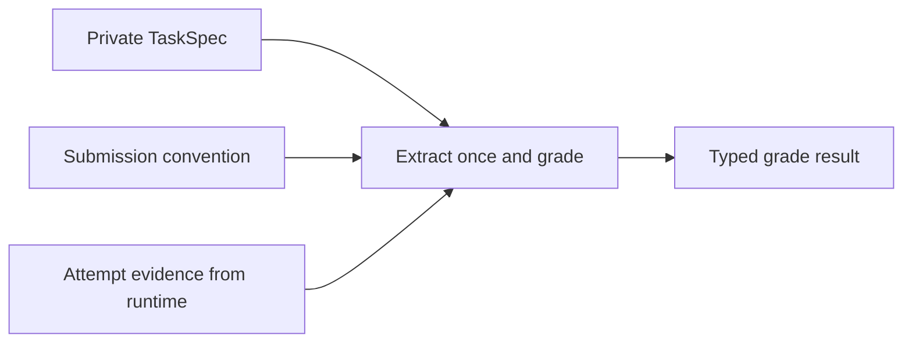

# TaskCompendium

## What problem does it solve?

TaskCompendium stores a task's semantic contract, extracts one final submission, and grades it through the shared verifier library. A caller can choose a submission convention while keeping expected answers and verifier resources private.

Execution, model requests, tool dispatch, environment setup, and lifecycle management belong to the caller’s runtime. Rolloutengine is proposed in [PR #9623](https://github.com/marin-community/marin/pull/9623); TaskCompendium currently has no dependency on it.

## What does it contain?

- **Task specs** describe source problems, required capabilities, final results, and private verification rules.
- **Submission conventions** describe how to request and extract a result, such as plain text, a JSON answer, or a final function call.
- **Typed evidence** records the conversation and an acquired text, JSON, action, or environment-state submission.
- **Shared grading** validates the private verifier configuration and scores the extracted evidence.


```mermaid
flowchart LR
    S[Private TaskSpec] --> G[Extract once and grade]
    C[Submission convention] --> G
    A[Attempt evidence from runtime] --> G
    G --> R[Typed grade result]
```

## What is a task spec?

`TaskSpec` is the private definition of one source task. An importer or author creates it before choosing a submission convention or an execution runtime.

| Field | Meaning |
| --- | --- |
| `id` | Stable identity for this task. |
| `context` | The ordered model-visible conversation: text messages, historical assistant function calls, and tool results. |
| `environment_requirements` | Required capabilities, pinned initial workspace, and named tool-provider contracts. |
| `final_tools` | An ordered list of functions that terminate a chat. They are not backed by a tool provider. |
| `answer_type` | The semantic result: `text`, `number`, `json`, `file`, `state`, `workspace_state`, or `native_action`. |
| `source` | Upstream dataset, revision, row, and importer revision retained as audit provenance. |
| `verifier` | Private grading rule and configuration. See [What is a verifier?](#what-is-a-verifier) |
| `schema_version` | Version of the serialized spec: `0.22`. Readers reject other versions. |
| `resources` | Inline files grouped under `all`, `worker`, `oracle`, and `verifier` visibility. |
| `tags` | Arbitrary descriptive strings, retained in order, including duplicates and empty strings. |

A task has one final result. Ordered steps and reward aggregation are deferred.

`context.events` is the model-visible conversation prefix. A text event retains its role and content. Historical assistant calls and tool results retain their call IDs and order; a runtime preserves this history when presenting the task to the model. `answer_type` does not prescribe a wrapper such as JSON.

`ConversationInput` is not a lossless Responses API transcript. It excludes provider reasoning items. The NeMo importer omits an unencrypted historical reasoning summary only when a visible assistant message or function call follows it. It rejects encrypted reasoning and reasoning left at the decision point. Exact provider continuation from reasoning state is outside this contract.

An **answer** is the task’s semantic result, identified by `answer_type`. A **submission** is the typed value a convention extracts from a completed attempt for grading. Different delivery forms can yield the same submission and carry the same answer.

For example, a task asking “What is 7 + 5?” can have `answer_type=number` and a private expected answer of `12`. The plain, JSON, and `answer_call` conventions carry that answer as `12`, `{"answer":"12"}`, and a final `submit_answer({"answer":"12"})` call, respectively. Each extracts a string for the same numeric verifier, which accepts both `12` and `12.0`. A task asking for a function call has `answer_type=native_action`; its context retains the conversation and its `final_tools` field describes the source functions. The verifier and expected answer are never added to the model-visible input. Importers must make source output instructions neutral to the supported conventions, or reject rows they cannot safely rewrite. A raw-output requirement in a source message would conflict with a JSON or function-call convention; `answer_type=text` alone cannot detect that conflict in prose.

## What can a task represent?

### Text answers

A text task uses `answer_type=text`. Plain text, a JSON object with an `answer` string, and `submit_answer(answer: string)` can carry its answer. The `exact` verifier compares normalized text; `mcq` grades a single option letter. Invalid MCQ option text scores zero through verifyit. Both verifiers grade the extracted answer across these conventions.

### Numeric answers

A numeric task uses `answer_type=number` and can use the same submission conventions as text. Expected values are required numeric literal strings, preserving integers, decimals and fractions exactly. Absolute and relative tolerances are required finite nonnegative floats. The `numeric` verifier reads the last boxed answer, or exactly one numeric literal from the last nonempty line when no box is present. Surrounding prose, including negation, is ignored. Missing, malformed, or ambiguous numeric output is `submission_failure`; a valid wrong number is `graded` with reward `0.0`.

### Final function calls

A task whose result is a function call uses `answer_type=native_action`. Its `final_tools` field declares the available functions. `FinalAction` defines whether a call is required and the maximum call count. The final-action submission convention captures the assistant's calls, and `predicted_action` compares their function names and decoded argument objects with the private expected calls. The scoring boundary compares the submitted calls without dispatching them.

For text and numeric tasks, the `answer_call` convention adds `submit_answer(answer: string)` alongside the task’s final tools. The submitted call carries an answer for extraction. The convention extracts the call's `answer` argument and passes it to the task's ordinary verifier. A non-call response or a call to another function receives `submission_failure` with reward `0.0`. For native-action tasks, `FinalAction` extracts the runtime-decoded calls for comparison with the private expected calls.

### Files and state

`answer_type=file` names a file result. `answer_type=workspace_state` names the final filesystem workspace. `answer_type=state` names arbitrary resulting environment state, including provider state outside a filesystem. Acquiring these results requires a runtime and an appropriate submission convention; this package does not acquire files or environment state. The shared `structured_exact` verifier compares JSON values and ordered arrays. Numbers compare by value by default (`16` equals `16.0`); booleans remain distinct. Set `numeric_types="strict"` to require exact numeric scalar types.

`answer_type=json` is a JSON answer from the model, independent of environment state. `JsonValueAnswer` parses the complete final chat text into a `JsonSubmission` for `structured_exact`. `StateSubmission` is evidence acquired from an environment by its runtime. The shared structured scorer accepts either evidence envelope. The existing `JsonAnswer` convention instead unwraps an `answer` string for text or numeric tasks. Both reject duplicate keys at every nesting level and nonfinite numbers. Tool-call arguments are decoded before entering the conversation evidence. Runtimes own provider-response decoding and may report malformed tool-call arguments as a structural submission failure with reward `0.0`. Both historical and final calls contain typed argument objects.

Public expectations belong in `context`: for example, the columns a CSV must contain or the behavior a repaired project must provide. The private verifier checks those expectations. A submission convention chooses how the result is delivered and extracted. `answer_type` identifies the answer’s semantic kind. TaskSpec stores no submission convention. Callers choose a concrete convention such as `PlainText`, `JsonAnswer`, or `AnswerCall`; custom conventions extend `SubmissionConvention` and declare the submission types they produce. A serialized convention must be loaded through its concrete class.

## Environment requirements

`environment_requirements` declares the initial state and operations needed to solve a task.

| Field | Meaning |
| --- | --- |
| `capabilities` | Unique operation names, such as `shell`, `network`, `filesystem`, `process`, or `browser`. Names are open so future capabilities can be represented. |
| `docker_image` | Optional immutable image reference, such as `registry/project@sha256:<64 lowercase hex digits>`. Tags alone are rejected. |
| `working_directory` | Optional normalized absolute POSIX path for the main workspace. Omission declares no required working directory. |
| `setup_commands` | Ordered commands required to establish the initial workspace. |
| `environment_variables` | String values required in the worker or private verifier environment during task execution. |
| `tool_providers` | Mapping from a task-local provider instance name to a required action interface and initial state. |

Each `ProviderRequirement` contains `action_interface`, a versioned contract name such as `workplace:v1`, and required `initial_state`, a JSON value such as a string, null, or an object. Two named instances can require the same interface with different initial states. No digest is required. The selected runtime owns provider implementation, transport, state initialization, reset, and tool execution. `final_tools` contains only ordered function definitions advertised at the final decision point; it supplies no implementation.

The task's `docker_image` and worker file mounts describe worker initial state. A verifier declares its own capabilities, image, and workspace requirements in private `VerifierSpec.environment_requirements`. A future runtime must keep those requirements and private resources separate from the worker environment.

## Resource mounts

`resources` is a `ResourceGroups` object. Each group contains an ordered list of `TaskResource` mounts.

| Group | Visibility |
| --- | --- |
| `all` | Shared inputs visible to the worker, oracle, and verifier. |
| `worker` | Model-visible inputs. |
| `oracle` | Private reference material. |
| `verifier` | Private evaluation inputs. The verifier is the task's evaluator. |

Private gold and hidden tests belong in `oracle` or `verifier`. An `all` resource is model-visible. A role receives `all` followed by its own mounts in its runtime-owned workspace root. Destinations must be distinct in that combined sequence, including case-folded collisions and file/directory ancestor collisions. Separate role-specific groups can reuse a relative path without sharing their content.

Oracle resources are reserved for trusted reference-solution generation. Verifier resources are used when evaluating a candidate result. These groups declare access; they do not require an oracle or evaluator process to run.

The worker mount root is `environment_requirements.working_directory` when declared; otherwise the selected runtime supplies it. For example, a resource at `project/input.txt` with a working directory of `/app` appears at `/app/project/input.txt`. Worker mounts are established before setup commands run in that working directory. Oracle and verifier mounts use separate private roots supplied by their runtimes.

Each `TaskResource` contains one inline file, with these fields:

| Field | Meaning |
| --- | --- |
| `path` | Normalized relative destination under each receiving role's runtime-owned workspace root. |
| `source` | An `InlineFile` containing the exact file bytes, encoded as canonical base64. |
| `mode` | Optional Unix permission mode as a three- or four-digit octal string, such as `0644` or `0755`. An explicit mode applies to the mounted file. Files default to `0644` when the mode is omitted. |
| `mtime_ns` | Optional integer Unix modification timestamp in nanoseconds for the mounted file. Omission leaves the timestamp unspecified. |

`InlineFile` has `kind="inline_file"` and `content_base64`. UTF-8 text uses the same byte representation as binary files. Resource contents are stored in the task spec; no dataset root or process working directory is used to locate them. Shared external files are deferred until a `TaskSet` contract defines their location and loading.

An archive can be included as ordinary file bytes, but resource mounting does not extract it. Paths may contain directories to locate the file within the workspace. Directory resources and recursive copies are unsupported. Schema decoding performs no filesystem inspection or I/O.

Grouped inline resources can contain:

```json
{
  "resources": {
    "all": [
      {
        "path": "README.txt",
        "source": {"kind": "inline_file", "content_base64": "VXNlIHRoZSBzdXBwbGllZCBwcm9qZWN0Lg=="},
        "mode": "0444",
        "mtime_ns": 1725555600000000000
      }
    ],
    "worker": [
      {"path": "project/input.txt", "source": {"kind": "inline_file", "content_base64": "cHVibGljIGlucHV0"}}
    ],
    "oracle": [
      {"path": "answer.txt", "source": {"kind": "inline_file", "content_base64": "cHJpdmF0ZSByZWZlcmVuY2U="}}
    ],
    "verifier": [
      {"path": "checks/grade.py", "source": {"kind": "inline_file", "content_base64": "cHJpdmF0ZSBjaGVja3M="}}
    ]
  }
}
```

File materializers must reject unsafe destinations and collisions, and enforce byte limits. The schema and pure candidate grading do not materialize resources. Execution runtimes supply mounts and role isolation; the runtime module grades acquired evidence and materializes files for private grading.

## What can we import?

### TaskTrove MCQA

The TaskTrove MCQA importer reads archives from a cleaned release. See the [published TaskTrove Clean dataset](https://huggingface.co/datasets/open-athena/task-trove). Its caller passes the archive bytes, upstream subset, archive path, and release provenance to `read_archive`. The reader checks the subset and path against the archive manifest; the release URI and revision are caller-supplied provenance. The importer checks the source answer-line template before replacing it with a one-letter instruction. Its text answer works with plain and JSON submission conventions. The private `mcq` verifier stores the expected letter and option count. Any author can use that verifier; it currently calls the shared `verifyit` MCQ scorer after extracting the submission. This importer supports only MCQ mode. Executable TaskTrove modes still need private resources and an isolated verifier runtime.

### NeMo predicted function calls

`taskcompendium.importers.nemo_predicted_action.import_row` accepts a NeMo predicted-function-call row and a caller-pinned digest of that row. `canonical_sha256(row)` hashes its UTF-8 JSON with sorted keys and compact separators; record the digest with the source revision before importing. The importer returns `(specification, convention)`, with `answer_type=native_action` and a `FinalAction` convention. A hand-authored task can select the same convention with `FinalAction(id="final-call")`. The context carries the source conversation; `final_tools` carries advertised functions. `FinalAction.require_call` and `FinalAction.max_calls` carry the source call constraints. The convention extracts the final action from typed attempt evidence and can be reused across tasks. The expected function calls remain in the private `predicted_action` verifier. There is one stored conversation, with no second flattened prompt to keep in sync.

The runtime presents the source turns and function definitions and retains the final response as typed evidence. The verifier compares submitted function names and JSON arguments. The importer rejects rows whose expected action is an assistant text message because the source comparator gives any message full credit; it also rejects request settings it cannot carry. The pinned fixture records the NeMo Gym repository revision and blob SHA in `tests/fixtures/nemo/predicted-action.provenance.json`. Numeric tolerance is used only when explicitly set in the private verifier.

## What is a verifier?

Each spec selects a private verifier and stores its configuration in `VerifierSpec`. TaskCompendium uses the submission convention to extract a candidate answer; the selected verifier grades it. `answer_type` controls which submission conventions can carry the result; the verifier determines how to score it.

`VerifierSpec.kind` is an open nonempty string. Its private typed `environment_requirements` defaults to empty and declares the capabilities, image, and workspace needed by the verifier. The execution runtime owns these requirements. `parameters_json` is an opaque private JSON object owned by the shared verifier library (`verifyit`); the execution runtime must not extract structural environment fields such as an image from it.

`verifier` grades one acquired answer. Comparative scoring across several attempts, cohort membership, and grading phase belong to the trainer. The ordinary per-attempt grader can score an already acquired answer regardless of worker workspace requirements.

Schema loading accepts descriptors without a grader implementation. The pure candidate grading boundary validates its supported verifier configuration; an unimplemented kind raises `NotImplementedError`. Runtime file and script grading uses shared verifyit specifications separately, with private entrypoints and resources in the verifier package. The pure grading boundary rejects nonempty verifier environment requirements; an isolated verifier runtime must satisfy them.

Standard verifier contracts and pure candidate scoring live in `verifyit`. Conversion pipelines select a shared spec and store its parameters in the task's private `verifier` slot. Submission conventions acquire evidence; TaskCompendium scores it and returns a typed grading outcome; it has no verifier registry or separate standard verifier schema.

The implemented canonical kinds are `exact` for normalized text, `numeric` for numbers with explicit absolute and relative tolerances, `mcq` for a single option letter, and `predicted_action` for final function calls. `structured_exact` compares JSON evidence with value equality for numbers by default and optional strict numeric types. It accepts a JSON chat answer through `JsonValueAnswer` or a value acquired by another runtime. The expected answer and grading settings stay out of the model-visible instruction.

Private verifier factories include:

```python
from taskcompendium.grading import exact_answer, structured_exact, verifier_descriptor
from taskcompendium.verifiers.multiple_choice import multiple_choice_answer
from verifyit.spec import FunctionCall, PredictedActionSpec

text_verifier = exact_answer("expected text")
mcq_verifier = multiple_choice_answer("C", options=4)
json_verifier = structured_exact({"value": 16})
action_verifier = verifier_descriptor(
    PredictedActionSpec(expected_calls=(FunctionCall(name="lookup", arguments={"city": "Paris"}),))
)
```

## Submission conventions and grading

`convention.supports(spec.answer_type)` checks the result kind. `submission_compatibility(spec, convention)` also checks that the convention produces an evidence type accepted by the private verifier. `grade_answer` validates the private verifier and compatibility before calling the convention's synchronous `extract` method once. A custom convention declares `submission_types` and extracts already acquired evidence. Override `supports` when its result kinds differ from the built-in conventions; the runtime owns its presentation.

Submission conventions preserve the task's advertised functions. `AnswerCall` adds `submit_answer` with an answer string; a task function with that name conflicts with the convention and is rejected. `FinalAction(require_call=True)` requires a call, and `FinalAction(max_calls=1)` limits the submission to one call. Missing required calls and excessive call counts are `submission_failure` with reward `0.0`.

`submission_instruction(convention)` returns the convention's final-answer instruction, and `answer_call_tool()` returns the `submit_answer` tool definition. Both are in `taskcompendium.submission`. The runtime combines these with the spec's public conversation and final tools when presenting the task; these helpers perform no execution.

Create a semantic task and its convention:

```python
from taskcompendium.grading import numeric_answer
from taskcompendium.models import (
    AnswerType,
    ConversationInput,
    EnvironmentRequirements,
    Source,
    TaskSpec,
    TextMessage,
)
from taskcompendium.submission import PlainText

spec = TaskSpec(
    id="arithmetic-7-plus-5",
    context=ConversationInput(events=(TextMessage(role="user", content="What is 7 + 5?"),)),
    environment_requirements=EnvironmentRequirements(),
    answer_type=AnswerType.NUMBER,
    verifier=numeric_answer("12", tolerance_abs=0.0, tolerance_rel=0.0),
    source=Source(dataset="hand-authored", revision="2026-09-16", row="arithmetic-7-plus-5", importer_revision="1"),
)
convention = PlainText(id="plain")
```

After execution, the caller supplies the complete conversation to `GradingAttempt`. Built-in conventions extract only `conversation.events[-1]`, the final assistant message or call batch. Earlier events are validated history; historical calls must have their results before the final submission:

```python
from taskcompendium.grading import grade_answer
from taskcompendium.grading_contract import GradingAttempt
from taskcompendium.models import ConversationTrace

def score_final_response(content: str):
    conversation = ConversationTrace(
        events=(*spec.context.events, TextMessage(role="assistant", content=content))
    )
    return grade_answer(spec, convention, GradingAttempt(conversation))
```

Grading is synchronous. The execution runtime completes file and environment-state acquisition before grading. `GradingAttempt` carries the conversation, captured file bytes keyed by runtime paths, and an optional `StateSubmission`. Custom conventions read those fields without accessing a live workspace. A missing state is `None`; captured JSON null is `StateSubmission(None)`. Private expected values remain in the task specification’s `spec.verifier` and must not be included in the model request.

A valid correct answer produces `GradeResult(status=graded, reward=1.0)`; a valid wrong answer produces `graded` with reward `0.0`. Malformed text, JSON, numeric, or final-action evidence produces `submission_failure` with reward `0.0`. Pure candidate grading raises for invalid private configuration and infrastructure failures; the execution runtime must preserve those errors separately from wrong or invalid submissions.

Execution runtimes decode provider responses into `TextMessage` or `AssistantToolCalls` before constructing a `ConversationTrace`. Tool-call arguments must be decoded JSON objects. A runtime may expose malformed provider output as `submission_failure` with reward `0.0`; network and execution errors remain separate.

## Dataset conversion

TaskSpec defines the serialized task contract. Dataset conversion pipelines own storage layout and streaming I/O, using Zephyr for Parquet processing. The optional `taskcompendium.pipeline` package stores curation outputs through Zephyr. See [pipeline contracts](src/taskcompendium/pipeline/README.md). JSON decoding preserves valid requirements independently of a runtime's support for them.

```python
serialized = spec.model_dump_json()
restored = TaskSpec.model_validate_json(serialized)
```

The serialized spec includes private verifier configuration and private resources. Store it where trusted grading code can read it; construct model-visible requests from public context, expectations, and the selected convention.

Runtime evidence grading lives in `taskcompendium.runtime.task_grading`. Its synchronous `grade_task` entrypoint accepts a conversation and already acquired `RuntimeEvidence`, delegates candidate modes to `grade_answer`, and prepares private resources for file and script graders. Script verdicts retain `invalid_task` and `infra_error` status and details separately from graded rewards. Callers opt into calendar or shell episode controls by selecting a check suite from `taskcompendium.runtime.checks.episode_suite`; the pinned source graph does not run these controls.

## Development

TaskCompendium requires Python 3.12 or 3.13 and uses `marin-rigging` for portable path and mount-collision validation. The validator leaf module performs no storage access.

TaskCompendium uses the root workspace's `uv.lock` and `.venv`. Run the package tests from the repository root:

```bash
uv run --package taskcompendium --extra pipeline --group test pytest lib/taskcompendium/tests -q

# Type-check from the package project directory with its dependencies available.
cd lib/taskcompendium
uvx --from 'pyrefly>=1.0.0,<1.1.0' pyrefly check
```

Schema `0.22` adds the distinct JSON result kind. Decoders reject other schema versions; existing conversion pipelines must emit the current contract.
