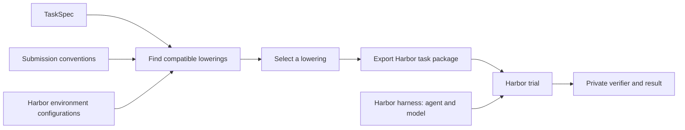

# TaskCompendium

## What problem does it solve?

Training and evaluation tasks arrive with different prompt formats, answer rules, tools, and graders. TaskCompendium separates the problem a model must solve from the way a framework runs and grades it. A caller can choose among compatible presentations of a task while keeping its reference answer private. Additional Harbor environment configurations can use the same task definition.

The current implementation handles direct text and number answers, plus file and workspace-state submissions from a Docker environment. Built-in verifiers grade direct answers. A `script` verifier runs a pinned private grader in a separate Docker container against a copy of the completed workspace. Native-action tasks still need a provider-side snapshot or bridge.

## What does it contain?

- **Task specs** describe the source problem, the required capabilities, the kind of result, and how to verify it.
- **Submission conventions** describe how to ask for and extract a result, such as a plain answer, JSON object, file destination, or final workspace state.
- **Harbor environment configurations** select direct chat or a digest-pinned Docker image with a capturable `/app` workspace.
- **Lowering tools** find compatible convention and environment configuration pairs, select a pair, and export a runnable Harbor task package.
- **A Harbor adapter** runs the exported task with a replay agent or an OpenAI-compatible chat endpoint and records a grading result. Harbor acts as the harness: it orchestrates the model and environment after lowering.


```mermaid
flowchart LR
    S[TaskSpec] --> C[Find compatible lowerings]
    V[Submission conventions] --> C
    E[Harbor environment configurations] --> C
    C --> P[Select a lowering]
    P --> H[Export Harbor task package]
    H --> T[Harbor trial]
    L[Harbor harness: agent and model] --> T
    T --> G[Private verifier and result]
```

## What is a task spec?

`TaskSpec` is the private definition of one source task. An importer or author creates it before choosing a submission convention or a framework launch.

| Field | Meaning |
| --- | --- |
| `id` | Stable identity for this task. |
| `instructions` | The source problem presented to the model. A submission convention may append an answer instruction. |
| `source` | Dataset, revision, row, and importer revision used to reproduce the spec. |
| `requirements` | Capabilities or named action interfaces the execution environment must provide. |
| `answer_type` | The semantic result: `text`, `number`, `file`, `workspace_state`, or `native_action`. It does not prescribe a wrapper such as JSON. |
| `verifier` | A private verifier kind and serialized JSON configuration. `exact_answer` and `mcq_answer` grade direct answers; `script` names pinned private files and a verifier runtime. |
| `schema_version` | Version of the serialized spec, checked when the record is loaded. |

For example, a task asking “What is 7 + 5?” can have `answer_type=number` and a private expected answer of `12`. That answer type can be submitted as plain text or as `{"answer":"12"}`. The verifier and expected answer are never added to the model-visible instruction. Importers must make source output instructions neutral to the supported conventions, or reject rows they cannot safely rewrite. A raw-output requirement left in `instructions` would conflict with a JSON convention; `answer_type=text` alone cannot detect that conflict in prose.

The TaskTrove MCQA importer reads archives from a cleaned release. See the [published TaskTrove Clean dataset](https://huggingface.co/datasets/open-athena/task-trove). Its caller passes the archive bytes, upstream subset, archive path, and release provenance to `read_archive`. The reader checks the subset and path against the archive manifest; the release URI and revision are caller-supplied provenance. The importer checks the source answer-line template before replacing it with a one-letter instruction. Its text answer works with plain and JSON submission conventions. The private `mcq_answer` verifier stores the expected letter and option count. Any author can use that verifier; it currently calls the shared `tasktrove-verify` MCQ scorer after extracting the submission. A separate prompt-injection importer translates one executable TaskTrove family into the generic `script` contract.

## What is a lowering?

A lowering is one runnable presentation of a spec for a target framework. It combines a compatible submission convention with a Harbor environment configuration, then writes the target's task files. The spec says *what* result is needed; the convention says *how* the model delivers it; the environment configuration says *which capabilities* the environment provides. Agent and model selection happens when the task is launched.

`SubmissionConvention.supports(spec.answer_type)` checks the result kind. `compatible_lowerings` uses that check and the environment requirements; it does not read convention IDs from the spec. Direct chat accepts text and number tasks with no required capabilities or action interfaces. The workspace Docker configuration also accepts text and number tasks, and accepts file and workspace-state tasks when they have a `script` verifier. Its declared `tools` must cover the task's required capabilities. `select_lowerings` can keep all candidates, take the first, or sample one with an explicit RNG key. The order of the caller-supplied convention and environment configuration sequences determines the first candidate and the sample order. A training caller should record those ordered inputs, the selection policy and key, and the TaskCompendium code revision.

An author can require a particular execution environment without changing the semantic `TaskSpec`. Pass `required_environment="workspace_docker"` to `select_lowerings`; it keeps only compatible Docker candidates and raises if none exist. The selected environment configuration is recorded in the exported Harbor package.

```python
from pathlib import Path

from taskcompendium.lowering import (
    HarborEnvironmentConfig,
    SelectionPolicy,
    compatible_lowerings,
    lower_to_harbor,
    select_lowerings,
)
from taskcompendium.grading import exact_answer
from taskcompendium.models import AnswerType, Source, TaskRequirements, TaskSpec
from taskcompendium.submission import AnswerFormat, SubmissionConvention

spec = TaskSpec(
    id="arithmetic-7-plus-5",
    instructions="What is 7 + 5?",
    verifier=exact_answer("12"),
    source=Source(dataset="hand-authored", revision="2026-09-16", row="arithmetic-7-plus-5", importer_revision="1"),
    requirements=TaskRequirements(),
    answer_type=AnswerType.NUMBER,
)
conventions = (
    SubmissionConvention(id="plain", answer_format=AnswerFormat.PLAIN),
    SubmissionConvention(id="json", answer_format=AnswerFormat.JSON),
)
candidates = compatible_lowerings(spec, conventions, (HarborEnvironmentConfig(),))
chosen = select_lowerings(candidates, SelectionPolicy.SAMPLE, rng_key=1234)[0]
lower_to_harbor(spec, chosen.convention, chosen.environment_config, Path("/tmp/arithmetic-task"))
```

## How does Harbor run it?

`lower_to_harbor` writes `instruction.md` and `task.toml` for Harbor, plus `specification.json`, `submission_convention.json`, and `environment_config.json` for the launcher and custom verifier. Script tasks also stage digest-checked files under `private_resources/`, outside the agent's `environment/` directory. The convention file tells the verifier how to extract a direct answer or where the agent must leave a file.

`run_trial` takes the exported directory, its environment configuration, and a launch choice. The Harbor harness selects and runs the agent and environment; those choices are absent from `TaskSpec`. A replay launch supplies a fixed response without calling a model. It exercises Harbor's agent and verifier path:

```python
import asyncio

from taskcompendium.harbor.runner import ReplayLaunch, run_trial

result = asyncio.run(
    run_trial(
        Path("/tmp/arithmetic-task"),
        chosen.environment_config,
        ReplayLaunch(response="12"),
        Path("/tmp/arithmetic-trials"),
        "arithmetic-run",
    )
)
assert result.verifier_result.rewards == {"reward": 1.0}
```

For a model run, pass a chat launch to `run_trial` instead. Provide the endpoint's base URL and, if needed, the name of an environment variable containing the API key. The agent reads that variable at request time; the trial configuration retains only its name.

```python
from taskcompendium.harbor.runner import ChatLaunch

launch = ChatLaunch(model="model-id", api_base="https://example.com/v1", api_key_env="MODEL_API_KEY")
```

Harbor runs a direct-chat agent without filesystem or shell tools. The built-in verifiers extract and compare the answer directly. A wrong answer receives reward `0.0`; a malformed submission has no reward. The verifier records unscored failures in `taskcompendium-result.json`. The package requires Harbor's [custom-verifier task loading](https://github.com/marin-community/harbor/pull/155).

## Script verifiers

`ScriptVerifier` requires a `runtime_image` pinned as `name@sha256:<digest>`, an executable `entrypoint`, fixed `args`, a timeout, and private resources. Each resource has a normalized relative path, executable bit, SHA-256 digest, and either embedded base64 bytes or a URI. A URI requires a trusted `Callable[[str], bytes]` passed as `resource_resolver` to `lower_to_harbor`; export checks the bytes and stages them privately. The verifier image is separate from the agent's `HarborEnvironmentConfig.docker_image`. Both images need digest pins; the verifier image must already be loaded in Docker because its runner uses `--pull=never`. The verifier has a bounded process time and memory, and no network by default.

After the agent finishes, the workspace Docker lowering copies `/app` into verifier-only storage. It rejects symlinks, nested mounts, special files, and oversized snapshots. Each script run receives another fresh copy at `/app`, private resources at read-only `/tests`, and `/verifier/submission.json` containing `protocol_version`, `answer_type`, `convention_id`, and the extracted `answer` or `null`. The script writes `/verifier/result.json` with `status="scored"` and a reward in `[0, 1]`, or `status="invalid_task"` or `"infra_error"` without a reward. A script timeout is an infrastructure error. The result file and private process output are not returned to the agent.

For a workspace-state task, an executable private grader can read the copied workspace and write the result with Python's standard library:

```python
#!/usr/bin/env python3
import json
from pathlib import Path

submission = json.loads(Path("/verifier/submission.json").read_text())
assert submission["answer_type"] == "workspace_state"
reward = float((Path("/app/state.txt").read_text() == "ready"))
Path("/verifier/result.json").write_text(json.dumps({"status": "scored", "reward": reward}))
```

Store that file as `grade.py`, then construct and export a task with the grader bytes kept private:

```python
import base64
import hashlib
from pathlib import Path

from taskcompendium.lowering import HarborEnvironmentConfig, lower_to_harbor
from taskcompendium.models import AnswerType, Source, TaskRequirements, TaskSpec
from taskcompendium.submission import AnswerFormat, SubmissionConvention
from taskcompendium.verifiers.script import PrivateResource, ScriptVerifier, script_verifier

image = "python:3.12-slim-bullseye@sha256:411fa4dcfdce7e7a3057c45662beba9dcd4fa36b2e50a2bfcd6c9333e59bf0db"
grader = Path("grade.py").read_bytes()
spec = TaskSpec(
    id="workspace-ready",
    instructions="Write ready to /app/state.txt.",
    source=Source(dataset="hand-authored", revision="1", row="workspace-ready", importer_revision="1"),
    requirements=TaskRequirements(capabilities=("filesystem",)),
    answer_type=AnswerType.WORKSPACE_STATE,
    verifier=script_verifier(ScriptVerifier(
        runtime_image=image,
        entrypoint="grade.py",
        timeout_seconds=30,
        resources=(PrivateResource(
            path="grade.py", sha256=hashlib.sha256(grader).hexdigest(), executable=True,
            embedded_base64=base64.b64encode(grader).decode("ascii"),
        ),),
    )),
)
convention = SubmissionConvention(id="workspace", answer_format=AnswerFormat.WORKSPACE)
environment = HarborEnvironmentConfig(environment="workspace_docker", tools=("filesystem",), docker_image=image)
lower_to_harbor(spec, convention, environment, Path("/tmp/workspace-ready"))
```

The Docker image must be available to Harbor and contain Python for this example. `ReplayLaunch(response="", workspace_command="printf ready > /app/state.txt")` can smoke-test the exported task with `run_trial`. For a model to edit `/app`, launch the package with a Harbor agent that uses its Docker environment; `ChatLaunch` only supports direct chat. Direct-answer script tasks use plain or JSON submissions and can run in direct chat without a workspace. File submissions name a fixed relative `output_path` under `/app`; workspace-state submissions grade the whole final `/app` tree.

The prompt-injection importer at `taskcompendium.importers.tasktrove.prompt_injection.import_task` accepts a cleaned `TaskArchive` and a required digest-pinned `runtime_image`. It rewrites the source answer-file prompt into a direct answer. Its private adapter copies the extracted answer into the verifier's disposable `/app/answer.txt`, runs the source checker, and converts its reward into the generic result file. An empty chat response is an extraction error; the source answer-file checker would score a missing file as zero. The source checker's own timeout remains a scored zero; the outer runtime timeout remains unscored. Stateful external providers have no script snapshot bridge yet.

Run the package tests from the repository root:

```bash
uv run --project lib/taskcompendium --extra harbor --group test pytest lib/taskcompendium/tests -q
```
