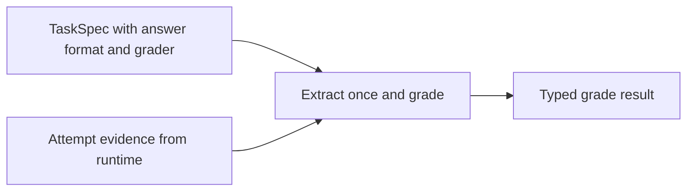

# TaskCompendium

The [task curation pipeline](../../docs/references/task-curation.md) downloads pinned sources, normalizes tasks, runs grading checks and GLM review, then writes final filtering decisions to sharded Parquet. Its audit retains every selected input, source locator, edit and rejection reason. Dataset declarations in the experiment name the pinned source, converter, rubric and grader controls; `taskcompendium.convert` holds the conversion techniques they share.

For ingestion work, start with the [pipeline overview](src/taskcompendium/pipeline/README.md)
and the [experiment flow](../../experiments/post_training/task_curation/README.md).
The sections below describe the task model and its presentation and grading contracts.

## What problem does it solve?

TaskCompendium stores a task's semantic contract, extracts one final submission with the task's answer format, and grades it with the task's grader. Expected answers, grader configuration, and verifier resources stay out of the model request.

Actor execution, model requests, tool dispatch, and actor environment lifecycle belong to the caller’s runtime. `taskcompendium.runtime` grades in a fresh Shellbox machine when the grader needs one. RolloutEngine provides the actor runtime; see [task rollouts](../../docs/references/task-rollouts.md). TaskCompendium does not depend on RolloutEngine.

## What does it contain?

- **Task specs** describe source problems, required capabilities, final results, answer formats, and graders.
- **Answer formats** describe how to request and extract a result, such as plain text, a JSON answer, or a final function call.
- **Typed evidence** records the conversation and an acquired text, JSON, action, or environment-state submission.
- **Grading** scores the extracted evidence in process or in a fresh grading machine, or reports that the task cannot be graded here.


```mermaid
flowchart LR
    S[TaskSpec with answer format and grader] --> G[Extract once and grade]
    A[Attempt evidence from runtime] --> G
    G --> R[Typed grade result]
```

## What is a task spec?

`TaskSpec` defines one source task, including its grader and expected values. An importer or author creates it before choosing an execution runtime.

| Field | Meaning |
| --- | --- |
| `id` | Stable identity for this task. |
| `context` | The ordered model-visible conversation: text messages, historical assistant function calls, and tool results. |
| `environment_requirements` | Required capabilities, pinned initial workspace, and named tool-provider contracts. |
| `final_tools` | An ordered list of functions that terminate a chat. They are not backed by a tool provider. |
| `interaction_tools` | Executable function declarations used by the optional episode runtime. |
| `output_paths` | Absolute output paths captured by the optional episode runtime, outside `/tests` and `/logs/verifier`. |
| `output_directories` | Workspace roots, relative fnmatch patterns and explicit file-count/aggregate-byte capture budgets. |
| `answer_type` | The semantic result: `text`, `number`, `json`, `file`, `state`, `workspace_state`, or `native_action`. |
| `answer_format` | How the final answer is requested from the model and extracted. See [Answer formats](#answer-formats). |
| `grader` | How an attempt is graded. See [What is a grader?](#what-is-a-grader) |
| `source` | Upstream dataset, revision, row, and importer revision retained as audit provenance. |
| `schema_version` | Version of the serialized spec: `0.25`. Readers reject other versions. |
| `resources` | Inline files grouped under `all`, `worker`, `oracle`, and `verifier` visibility. |
| `tags` | Arbitrary descriptive strings, retained in order, including duplicates and empty strings. |

A task has one final result. TaskSpec does not define ordered task stages or stage-reward aggregation.

Directory capture requires the actor's `python3` capability and a real POSIX
Python interpreter; ShellSim does not support it. Selection patterns use
case-sensitive fnmatch semantics, where `*` includes `/` and hidden paths.
Capture preserves unsorted depth-first filesystem order, skips symlinks in
directory selections, and fails the whole capture on file or byte overflow.
Existing named `output_paths` retain their file/symlink behavior. Roots must stay
inside the grader's workspace and outside `/tests`, `/logs/verifier` and
`/solution`. Membership and budgets are checked again before files are staged for grading.

`context.events` is the model-visible conversation prefix. A text event retains its role and content. Historical assistant calls and tool results retain their call IDs and order; a runtime preserves this history when presenting the task to the model. `answer_type` does not prescribe a wrapper such as JSON; `answer_format` does.

`ConversationInput` is not a lossless Responses API transcript. It excludes provider reasoning items. The NeMo importer omits an unencrypted historical reasoning summary only when a visible assistant message or function call follows it. It rejects encrypted reasoning and reasoning left at the decision point. Exact provider continuation from reasoning state is outside this contract.

An **answer** is the task’s semantic result, identified by `answer_type`. A **submission** is the typed value the task's answer format extracts from a completed attempt for grading. Different answer formats can yield the same submission and carry the same answer.

For example, a task asking “What is 7 + 5?” can have `answer_type=number` and a `numeric` grader that expects `12`. The `PlainText`, `JsonAnswer`, and `AnswerCall` formats carry that answer as `12`, `{"answer":"12"}`, and a final `submit_answer({"answer":"12"})` call, respectively. Each extracts the string `12` for the same grader, which accepts both `12` and `12.0`. A task asking for a function call has `answer_type=native_action`; its context retains the conversation and its `final_tools` field describes the source functions. The grader and expected answer are never added to the model-visible input. Importers must make source output instructions agree with the task's answer format, or reject rows they cannot safely rewrite. A raw-output requirement in a source message would conflict with `JsonAnswer` or `AnswerCall`; `answer_type=text` alone cannot detect that conflict in prose.

## What can a task represent?

### Text answers

A text task uses `answer_type=text`. `PlainText`, `Boxed`, `JsonAnswer`, and `AnswerCall` can carry its answer. The `exact` mode compares normalized text; `mcq` grades a single option letter. Invalid MCQ option text scores zero through verifyit. Both modes grade the answer extracted by any of these formats.

### Numeric answers

A numeric task uses `answer_type=number` and can use the same answer formats as text. Expected values are required numeric literal strings, preserving integers, decimals and fractions exactly. Absolute and relative tolerances are required finite nonnegative floats. The `numeric` mode reads the last boxed answer, or exactly one numeric literal from the last nonempty line when no box is present. Surrounding prose, including negation, is ignored. Missing, malformed, or ambiguous numeric output is `submission_failure`; a valid wrong number is `graded` with reward `0.0`.

`taskcompendium.grading.grade_result` maps verifyit rewards to `GradeResult` the same way for in-process grading and for the verdict the verifyit command writes in a grading machine. Malformed numeric text is `submission_failure` with reward `0.0` in both.

### Final function calls

A task whose result is a function call uses `answer_type=native_action` and the `FinalAction` answer format. Its `final_tools` field declares the available functions. `FinalAction` defines whether a call is required and the maximum call count. It extracts the assistant's final message, and the `predicted_action` mode compares the submitted function names and decoded argument objects with the expected calls. Grading compares the submitted calls without dispatching them.

For text and numeric tasks, the `AnswerCall` format adds `submit_answer(answer: string)` alongside the task’s final tools. It extracts the call's `answer` argument and passes it to the task's grader. A non-call response or a call to another function receives `submission_failure` with reward `0.0`.

### Files and state

`answer_type=file` names a file result. `answer_type=workspace_state` names the final filesystem workspace. `answer_type=state` names arbitrary resulting environment state, including provider state outside a filesystem. Acquiring these results requires an actor runtime. These tasks still declare an `answer_format`, but grading does not read it. `file` and `workspace_state` answers require a grader with an environment. In-process grading uses supplied evidence; the optional TaskCompendium episode runtime captures declared output files. The `structured_exact` mode compares JSON values and ordered arrays. Numbers compare by value by default (`16` equals `16.0`); booleans remain distinct. Set `numeric_types="strict"` to require exact numeric scalar types.

`answer_type=json` is a JSON answer from the model, independent of environment state. `JsonValueAnswer` parses the complete final chat text into a `JsonSubmission` for `structured_exact`. `StateSubmission` is evidence acquired from an environment by its runtime. `structured_exact` accepts either. The `JsonAnswer` format instead unwraps an `answer` string for text or numeric tasks. Both formats reject duplicate keys at every nesting level and nonfinite numbers. Tool-call arguments are decoded before entering the conversation evidence. Runtimes own provider-response decoding and may report malformed tool-call arguments as a structural submission failure with reward `0.0`. Both historical and final calls contain typed argument objects.

Public expectations belong in `context`: for example, the columns a CSV must contain or the behavior a repaired project must provide. The grader checks those expectations. The answer format chooses how the result is delivered and extracted. `answer_type` identifies the answer’s semantic kind.

## Environment requirements

`environment_requirements` declares the initial state and operations needed to solve a task.

`compatible_backends` lists the Shellbox backends the source author permits for
this environment, such as `shellsim` or `gvisor`. A grader environment has its own
list. Empty means no Shellbox backend is declared; it is not a wildcard.
TaskCompendium's shell runtime and `grade_task` check the selected factory against
the appropriate list before creating a machine. A required Docker image excludes ShellSim. See the
[source-author rubric](src/taskcompendium/pipeline/README.md) for compatibility
criteria and the distinction between declarations and sampled runtime evidence.

| Field | Meaning |
| --- | --- |
| `capabilities` | Unique operation names, such as `shell`, `network`, `filesystem`, `process`, or `browser`. Names are open so future capabilities can be represented. |
| `compatible_backends` | Unique Shellbox backend names permitted by the source author; empty declares none. |
| `docker_image` | Optional immutable image reference, such as `registry/project@sha256:<64 lowercase hex digits>`. Tags alone are rejected. |
| `docker_build` | Optional `DockerBuildContext(files=...)` containing inline regular files relative to the build-context root, including `Dockerfile`. The recipe is unresolved data. |
| `working_directory` | Optional normalized absolute POSIX path for the main workspace. Omission declares no required working directory. |
| `setup_commands` | Ordered commands required to establish the initial workspace. |
| `environment_variables` | String values required in the worker or grading machine environment. |
| `tool_providers` | Mapping from a task-local provider instance name to a required action interface and initial state. |
| `packages_lock` | Storage URL of a uv-compiled, hash-pinned requirements lock. A `local` environment requires it: the host builds the lock into a Python environment for the commands it runs. Other environments must omit it. |

Each `ProviderRequirement` contains `action_interface`, a versioned contract name such as `workplace:v1`, and required `initial_state`, a JSON value such as a string, null, or an object. Two named instances can require the same interface with different initial states. No digest is required. The selected runtime owns provider implementation, transport, state initialization, reset, and tool execution. `final_tools` contains only ordered function definitions advertised at the final decision point; it supplies no implementation.

The task's environment and worker file mounts describe worker initial state. A grader that runs in its own machine declares that machine's image or build recipe, capabilities, setup commands, and environment variables in `grader.environment`. A grader environment requires a `docker_image`, `docker_build`, or local `packages_lock`, and cannot declare tool providers. Runtimes keep those requirements and verifier resources separate from the worker environment.

`docker_image`, `docker_build`, and `packages_lock` are mutually exclusive.
Build files preserve bytes, modes and timestamps; paths cannot collide. Resource
budgets count actor and grader contexts separately. Execution requires the caller
to build each context and replace it with a digest-pinned image and supported
backends. TaskCompendium supplies no build resolver; runtimes and SAMPLE/FULL
controls reject unresolved contexts. Local and ShellSim backends cannot declare them.

The [Harbor exporter](src/taskcompendium/harbor/export.py) emits build inputs;
see the [campaign quickstart](../../experiments/post_training/task_curation/README.md#harbor-compatibility-view)
for execution limits. The Harbor-to-TaskSpec importer requires a prebuilt image.

## Resource mounts

`resources` is a `ResourceGroups` object. Each group contains an ordered list of `TaskResource` mounts.

| Group | Visibility |
| --- | --- |
| `all` | Shared inputs visible to the worker, oracle, and grader. |
| `worker` | Model-visible inputs. |
| `oracle` | Reference material for oracle controls, hidden from the model. |
| `verifier` | Grader inputs, hidden from the model. |

Gold answers and hidden tests belong in `oracle` or `verifier`. An `all` resource is model-visible. A role receives `all` followed by its own mounts. Destinations must be distinct in that combined sequence and have no file/directory ancestor collisions. Names retain POSIX case distinctions. Separate role-specific groups can reuse a relative path without sharing their content.

Oracle resources are reserved for trusted reference-solution generation. Verifier resources are used when evaluating a candidate result. These groups declare access; they do not require an oracle or evaluator process to run.

The TaskCompendium and RolloutEngine runtimes install shared, worker, and oracle resources at `/<path>`: a resource at `app/project/input.txt` appears at `/app/project/input.txt`. Worker mounts are established before setup commands run. A grading machine receives verifier resources at `/tests/<path>`; in-process modes read them by that relative path.

Each `TaskResource` contains one inline file, with these fields:

| Field | Meaning |
| --- | --- |
| `path` | Normalized relative destination: `/<path>` for shared, worker, and oracle resources, and `/tests/<path>` for verifier resources. |
| `source` | An `InlineFile` containing the exact file bytes, encoded as canonical base64. |
| `mode` | Optional Unix permission mode as a three- or four-digit octal string, such as `0644` or `0755`. An explicit mode applies to the mounted file. Files default to `0644` when the mode is omitted. |
| `mtime_ns` | Optional integer Unix modification timestamp in nanoseconds for the mounted file. Omission leaves the timestamp unspecified. |

`InlineFile` has `kind="inline_file"` and `content_base64`. UTF-8 text uses the same byte representation as binary files. Resource contents are stored in the task spec; no dataset root or process working directory is used to locate them. Shared external files are deferred until a `TaskSet` contract defines their location and loading.

An archive can be included as ordinary file bytes, but resource mounting does not extract it. Paths may contain directories to locate the file within the workspace. Directory resources and recursive copies are unsupported. Schema decoding performs no filesystem inspection or I/O.

Grouped inline resources can contain:

```json
{
  "resources": {
    "all": [
      {
        "path": "README.txt",
        "source": {"kind": "inline_file", "content_base64": "VXNlIHRoZSBzdXBwbGllZCBwcm9qZWN0Lg=="},
        "mode": "0444",
        "mtime_ns": 1725555600000000000
      }
    ],
    "worker": [
      {"path": "project/input.txt", "source": {"kind": "inline_file", "content_base64": "cHVibGljIGlucHV0"}}
    ],
    "oracle": [
      {"path": "answer.txt", "source": {"kind": "inline_file", "content_base64": "cHJpdmF0ZSByZWZlcmVuY2U="}}
    ],
    "verifier": [
      {"path": "checks/grade.py", "source": {"kind": "inline_file", "content_base64": "cHJpdmF0ZSBjaGVja3M="}}
    ]
  }
}
```

File materializers must reject unsafe destinations and collisions, and enforce byte limits. The schema and in-process grading do not materialize resources. Execution runtimes supply mounts and role isolation; `grade_in_sandbox` stages grading inputs into a fresh machine.

## What can we import?

### TaskTrove MCQA

The TaskTrove MCQA importer reads archives from a cleaned release. See the [published TaskTrove Clean dataset](https://huggingface.co/datasets/open-athena/task-trove). Its caller passes the archive bytes, upstream subset, archive path, and release provenance to `read_archive`. The reader checks the subset and path against the archive manifest; the release URI and revision are caller-supplied provenance. The importer checks the source answer-line template before replacing it with a one-letter instruction. Its text answer uses the `PlainText` format. The `mcq` grader stores the expected letter and option count and grades in process with the `verifyit` MCQ scorer. This importer supports only MCQ mode. Executable TaskTrove modes need verifier resources and a grading machine.

### NeMo predicted function calls

`taskcompendium.importers.nemo_predicted_action.import_row` accepts a NeMo predicted-function-call row and a caller-pinned digest of that row. `canonical_sha256(row)` hashes its UTF-8 JSON with sorted keys and compact separators; record the digest with the source revision before importing. The importer returns a TaskSpec with `answer_type=native_action` and a `FinalAction` answer format. The context carries the source conversation; `final_tools` carries advertised functions. `FinalAction.require_call` is set when the source requires a tool call, and `FinalAction.max_calls=1` when the source disables parallel calls. The expected function calls stay in the `predicted_action` grader. There is one stored conversation, with no second flattened prompt to keep in sync.

The runtime presents the source turns and function definitions and retains the final response as typed evidence. The grader compares submitted function names and JSON arguments. The importer rejects rows whose expected action is an assistant text message because the source comparator gives any message full credit; it also rejects request settings it cannot carry. The pinned fixture records the NeMo Gym repository revision and blob SHA in `tests/fixtures/nemo/predicted-action.provenance.json`. Numeric tolerance is used only when explicitly set in the grader's parameters.

## What is a grader?

`TaskSpec.grader` declares how an attempt is graded. Its `kind` field selects one of four classes in `taskcompendium.models`:

| `kind` | Class | Grading |
| --- | --- | --- |
| `verifyit` | `VerifyitGrader` | A stock verifyit `mode` and its `parameters`: the keys of verifyit's `verifier.toml` table other than `mode`. |
| `script` | `ScriptGrader` | A command run after the episode in a fresh machine built from a pinned image. |
| `session` | `SessionGrader` | A registered custom RolloutEngine `TaskSession` grades the task. |
| `none` | `NoGrader` | The task cannot be graded here. `reason` says why; `contract` optionally keeps the source's grading terms. |

A `VerifyitGrader` without an `environment` grades the extracted answer in process. Its mode must be one of `verifyit.candidate.IN_PROCESS_MODES`: `exact`, `numeric`, `mcq`, `math`, `ifeval`, `json-schema`, `xml-elements`, `csv-columns`, `structured_exact`, or `predicted_action`. A `VerifyitGrader` with an `environment` runs the verifyit command in a fresh machine built from that environment, with verifier resources under `/tests` and the verifyit specification at `/tests/verifier.toml`. Modes that execute code or call a model, such as `pytest`, `stdio`, and `judge`, grade only there. Construction validates `parameters` with verifyit.

A `ScriptGrader` declares:

| Field | Meaning |
| --- | --- |
| `argv`, `cwd`, `env` | The grader command, its working directory (default `/app`), and added environment variables. |
| `environment` | The grading machine's requirements. |
| `collect` | Commands run as root on the agent's machine before grading. |
| `artifacts` | Files and directories copied from the agent's machine into the grading machine, with exclusions and a missing-file policy. |
| `answer_path` | Where the extracted answer is written (default `/app/answer.txt`): text as text, JSON as JSON, and a final action as the final assistant message's JSON. |
| `conversation_path` | Where the conversation is written as OpenAI-style chat messages in JSON (default `/tests/conversation.json`). |
| `reward` | `StdoutReward` (default), `ExitCodeReward`, or `FileReward`. |
| `timeout` | Deadline in seconds for each grading command (default 600). |

`StdoutReward` requires exit code 0 and one finite number on standard output; anything else is `infra_error`. `ExitCodeReward` scores 1.0 for exit code 0 and 0.0 otherwise. `FileReward.files` lists candidate reward files in priority order; the first that exists supplies the score. Each `RewardFile` holds a number, or a JSON object whose `key` (default `reward`) holds the score and whose optional `detail` object becomes the grade detail. `FileReward.pass_above` sets `GradeResult.passed`; `ExitCodeReward` sets it from the exit code. A missing, empty, or invalid reward file is `infra_error`. A timed-out command is `infra_error` for every reward source.

TaskSpec validation ties the grader to the answer:

- An in-process `VerifyitGrader` cannot grade `file` or `workspace_state` answers.
- A `VerifyitGrader` with an environment cannot grade `native_action` answers. Its workspace modes (`stdio`, `pytest`, `junit`, and `gotest`) cannot grade `text`, `number`, or `json` answers.
- `ScriptGrader.answer_path` must be `None` for `file`, `state`, and `workspace_state` answers. `conversation_path` must not replace a verifier resource.
- Answer paths, output paths, and output directories must lie outside `/tests` and `/logs/verifier`.

A `SessionGrader` task is graded by the registered custom `TaskSession` that runs it; TaskCompendium cannot grade it. A `NoGrader` task grades as `unavailable`, with no reward and its `reason` as the error. Converters use `NoGrader` when the source evaluator needs a runtime this repository cannot provide; its `contract` records the evaluator, source revision, grading data and runtime requirements. `taskcompendium.grader.grader_config(task)` returns a copy of a `NoGrader`'s contract, or the `config.json` verifier resource of another grader.

`taskcompendium.grader.GraderPackage` pairs a grader with its verifier resources, whose paths are relative to `/tests`. `verifyit_package(spec, resources=(), environment=None)` builds a `VerifyitGrader` from a verifyit `Spec`. Build other packages directly with `GraderPackage(grader, resources)`.

```python
from taskcompendium.grader import verifyit_package
from verifyit.spec import ExactSpec, FunctionCall, McqSpec, PredictedActionSpec, StructuredExactSpec

text_grader = verifyit_package(ExactSpec(expected=("expected text",))).grader
mcq_grader = verifyit_package(McqSpec(expected="C", options=4)).grader
json_grader = verifyit_package(StructuredExactSpec(expected={"value": 16})).grader
action_grader = verifyit_package(
    PredictedActionSpec(expected_calls=(FunctionCall(name="lookup", arguments={"city": "Paris"}),))
).grader
```

A grader scores one acquired answer. Comparative scoring across several attempts, cohort membership, and grading phase belong to the trainer. Standard grading modes and in-process scoring live in `verifyit`; TaskCompendium has no grader registry or separate standard verifier schema.

## Answer formats

`TaskSpec.answer_format` says how the final answer is requested from the model and extracted from `conversation.events[-1]`, the final assistant message or call batch. Earlier events are validated history; historical calls must have their results before the final submission.

| Format | `kind` | Extracts | Answer types |
| --- | --- | --- | --- |
| `PlainText` | `plain_text` | The whole final message | `text`, `number` |
| `Boxed` | `boxed` | The content of the last `\boxed{...}`, else the whole final message | `text`, `number` |
| `JsonAnswer` | `json_answer` | The nonempty string `answer` field of a JSON object | `text`, `number` |
| `JsonValueAnswer` | `json_value` | The whole final message as one JSON value | `json` |
| `AnswerCall` | `answer_call` | The `answer` argument of one `submit_answer` call | `text`, `number` |
| `FinalAction` | `final_action` | The final message: calls to `final_tools`, or text | `native_action` |

A `text`, `number`, `json`, or `native_action` task must use a format that carries its answer type. `submission_compatibility(task)` also checks that the grader's verifyit mode accepts the submission the format extracts (`TextSubmission`, `JsonSubmission`, or `ActionSubmission`), that a `FinalAction` task has final tools, and that no final tool is named `submit_answer` under `AnswerCall`.

Answer formats preserve the task's advertised functions. `AnswerCall` adds `submit_answer` with an answer string. `FinalAction(require_call=True)` requires a call, and `FinalAction(max_calls=1)` limits the submission to one call. Missing required calls and excessive call counts are `submission_failure` with reward `0.0`.

`taskcompendium.submission` builds model requests from the task alone. `submission_instruction(answer_format)` returns the format's final-answer instruction, and `answer_call_tool()` returns the `submit_answer` tool definition. `chat_request(task)` and `render_instruction(task)` combine them with the public conversation and final tools. These helpers perform no execution.

## Grading

Create a task:

```python
from taskcompendium.grader import verifyit_package
from taskcompendium.models import (
    AnswerType,
    ConversationInput,
    EnvironmentRequirements,
    PlainText,
    Source,
    TaskSpec,
    TextMessage,
)
from verifyit.spec import NumericSpec

spec = TaskSpec(
    id="arithmetic-7-plus-5",
    context=ConversationInput(events=(TextMessage(role="user", content="What is 7 + 5?"),)),
    environment_requirements=EnvironmentRequirements(),
    answer_type=AnswerType.NUMBER,
    answer_format=PlainText(),
    grader=verifyit_package(NumericSpec(expected="12", tolerance_abs=0.0, tolerance_rel=0.0)).grader,
    source=Source(dataset="hand-authored", revision="2026-09-16", row="arithmetic-7-plus-5", importer_revision="1"),
)
```

After execution, the caller supplies the complete conversation to `GradingAttempt`:

```python
from taskcompendium.grading import grade_answer
from taskcompendium.models import ConversationTrace, GradingAttempt

def score_final_response(content: str):
    conversation = ConversationTrace(
        events=(*spec.context.events, TextMessage(role="assistant", content=content))
    )
    return grade_answer(spec, GradingAttempt(conversation))
```

Three functions grade an attempt:

- `taskcompendium.grading.grade_answer(task, attempt)` grades with an in-process `VerifyitGrader`. The answer format extracts the submission, or `attempt.state` supplies it for a `state` answer, and `verifyit.candidate.grade_candidate` scores it. It raises `TypeError` for other graders.
- `taskcompendium.runtime.grading.grade_in_sandbox(task, attempt, factory, machine_spec, *, task_machine=None, timeout=None)` is asynchronous. It grades with a `VerifyitGrader` that has an environment, or with a `ScriptGrader`, in a fresh machine from `factory`. `task_machine` is the agent's machine, required for `collect` and `artifacts`. Machine exceptions propagate.
- `taskcompendium.runtime.task_grading.grade_task(task, attempt, *, machine_factory=None, machine_spec=None)` grades any task synchronously. A `NoGrader` task is `unavailable`. An in-process grader uses `grade_answer`. A grader with an environment uses `grade_in_sandbox` after `grade_task` checks the factory's backend against `environment.compatible_backends`. A missing factory or machine specification, and a machine `RuntimeError` or `OSError`, become `infra_error`. A `SessionGrader` raises `TypeError`.

RolloutEngine's Shellbox session calls `grade_answer` or `grade_in_sandbox` after the turn loop; see [task rollouts](../../docs/references/task-rollouts.md).

The execution runtime completes file and environment-state acquisition before grading. `GradingAttempt` carries the conversation, captured file bytes keyed by absolute path, and an optional `StateSubmission`. A missing state is `None`; captured JSON null is `StateSubmission(None)`. `taskcompendium.runtime.models.grading_attempt(conversation, evidence)` builds an attempt from captured `RuntimeEvidence`. A grading machine also receives a conversational answer extracted from the conversation. Expected values remain in `task.grader` and verifier resources and must not be included in the model request.

A valid correct answer produces `GradeResult(status=graded, reward=1.0)`; a valid wrong answer produces `graded` with reward `0.0`. A final message the answer format cannot read, and numeric text the `numeric` mode cannot read, produce `submission_failure` with reward `0.0`. verifyit's `invalid_task` and `infra_error` statuses carry no reward and stay separate from wrong or invalid submissions. `grade_answer` raises when the answer format is incompatible with the grader.

Execution runtimes decode provider responses into `TextMessage` or `AssistantToolCalls` before constructing a `ConversationTrace`. Tool-call arguments must be decoded JSON objects. A runtime may expose malformed provider output as `submission_failure` with reward `0.0`; network and execution errors remain separate.

## Dataset conversion

TaskSpec defines the serialized task contract. Dataset conversion pipelines own storage layout and streaming I/O, using Zephyr for Parquet processing. The optional `taskcompendium.pipeline` package stores curation outputs through Zephyr. See [pipeline contracts](src/taskcompendium/pipeline/README.md). JSON decoding preserves valid requirements independently of a runtime's support for them.

```python
serialized = spec.model_dump_json()
restored = TaskSpec.model_validate_json(serialized)
```

The serialized spec includes the grader configuration and verifier resources. Store it where trusted grading code can read it; build model requests with `chat_request(task)` or `render_instruction(task)`, which read only the public context, final tools, and answer format.

## Development

TaskCompendium requires Python 3.12 or 3.13 and uses `marin-rigging` for relative POSIX path and mount-collision validation. Resource names preserve Linux semantics, including colons, backslashes, trailing spaces, and case distinctions. Absolute paths, traversal, NUL bytes, duplicate files, and file/directory collisions are rejected. The validator leaf module performs no storage access.

TaskCompendium uses the root workspace's `uv.lock` and `.venv`. Run the package tests from the repository root:

```bash
uv run --package taskcompendium --extra pipeline --group test pytest lib/taskcompendium/tests -q

# Type-check from the package project directory with its dependencies available.
cd lib/taskcompendium
uvx --from 'pyrefly>=1.0.0,<1.1.0' pyrefly check
```

Schema `0.25` stores the answer format and the typed grader on each task. Decoders reject other schema versions; existing conversion pipelines must emit the current contract.
