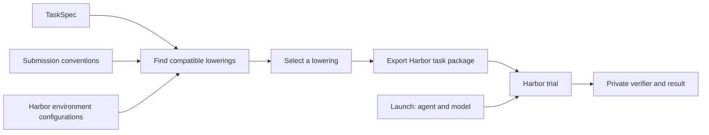

# TaskCompendium

## What problem does it solve?

Training and evaluation tasks arrive with different prompt formats, answer rules, tools, and graders. TaskCompendium separates the problem a model must solve from the way a framework runs and grades it. A caller can choose among compatible presentations of a task while keeping its reference answer private. Additional Harbor environment configurations can use the same task definition.

The current implementation exports Harbor tasks for text, number, native-action, and state results. A task can require several named, versioned action interfaces. File results have no submission convention in this package.

The NeMo Workplace row 0 import supplies the first Python tool provider. State grading is separate from tool selection: a tool-backed task can also submit a text or number answer.

## What does it contain?

- **Task specs** describe the source problem, required capabilities, the kind of result, and how to verify it.
- **Submission conventions** describe how to ask for and extract a result, such as a plain answer, a JSON object, or a final function call.
- **Harbor environment configurations** select direct chat or one or more importable tool providers.
- **Lowering tools** find compatible convention and environment configuration pairs, select a pair, and export a runnable Harbor task package.
- **A Harbor adapter** sends the conversation to an OpenAI-compatible endpoint, dispatches tool calls across turns, and records the result.


```mermaid
flowchart LR
    S[TaskSpec] --> C[Find compatible lowerings]
    V[Submission conventions] --> C
    E[Harbor environment configurations] --> C
    C --> P[Select a lowering]
    P --> H[Export Harbor task package]
    H --> T[Harbor trial]
    L[Launch: agent and model] --> T
    T --> G[Private verifier and result]
```

## What is a task spec?

`TaskSpec` is the private definition of one source task. An importer or author creates it before choosing a submission convention or a framework launch.

| Field | Meaning |
| --- | --- |
| `id` | Stable identity for this task. |
| `context` | The ordered model-visible conversation: text messages, historical assistant function calls, and tool results. |
| `environment_requirements` | General workspace capabilities, such as filesystem and shell access. |
| `tool_providers` | Named tool interfaces and immutable seeds required by the task. |
| `final_tools` | Terminal functions advertised at the decision point, tool choice, and the parallel-call setting. These functions are recorded as the result and are never dispatched to a provider. |
| `answer_type` | The semantic result: `text`, `number`, `file`, `state`, or `native_action`. |
| `source` | Dataset, revision, row, and importer revision used to reproduce the spec. |
| `verifier` | A private verifier kind and serialized JSON configuration. See [What is a verifier?](#what-is-a-verifier). |
| `schema_version` | Version of the serialized spec, checked when the record is loaded. |

`context.events` is the model-visible conversation prefix. A text event retains its role and content. Historical assistant calls and tool results retain their call IDs and order; the adapter sends them as OpenAI-compatible chat messages without executing them again. `answer_type` does not prescribe a wrapper such as JSON.

`ConversationInput` is not a lossless Responses API transcript. It excludes provider reasoning items. The NeMo importer omits an unencrypted historical reasoning summary only when a visible assistant message or function call follows it. It rejects encrypted reasoning and reasoning left at the decision point. Exact provider continuation from reasoning state is outside this contract.

For example, a task asking “What is 7 + 5?” can have `answer_type=number` and a private expected answer of `12`. The plain, JSON, and `answer_call` conventions carry that answer as `12`, `{"answer":"12"}`, and a final `submit_answer({"answer":"12"})` call, respectively. Each extracts a string for the same numeric verifier, which accepts both `12` and `12.0`. A task asking for a function call has `answer_type=native_action`; its context retains the conversation and its `final_tools` describe the source functions. The verifier and expected answer are never added to the model-visible input. Importers must make source output instructions neutral to the supported conventions, or reject rows they cannot safely rewrite. A raw-output requirement in a source message would conflict with a JSON or function-call convention; `answer_type=text` alone cannot detect that conflict in prose.

## What can a task represent?

### Text answers

A text task uses `answer_type=text`. Plain text, a JSON object with an `answer` string, and `submit_answer(answer: string)` can carry its answer. `exact_answer` compares normalized text; `mcq_answer` grades a single option letter. The same verifier grades the extracted answer across these conventions.

### Numeric answers

A numeric task uses `answer_type=number` and can use the same submission conventions as text. `numeric_answer` parses the extracted string as a number and applies the explicitly configured absolute and relative tolerances. For example, both `12` and `12.0` can satisfy an expected value of `12.0`.

### Final function calls

A task whose result is a function call uses `answer_type=native_action`. Its `final_tools` field declares the available functions and call policy. The final-action submission convention captures the assistant's calls, and `predicted_action` compares their function names and decoded argument objects with the private expected calls. The terminal calls are recorded and never executed.

With the `answer_call` convention, the chat agent adds `submit_answer(answer: string)` to any declared final functions and records the assistant's final response. It never invokes that terminal function. The convention extracts the call's `answer` argument and passes it to the task's ordinary verifier. A non-call response or a call to another function is a submission failure with zero reward. The same final-action decoder handles native-action tasks; their verifier compares the recorded call's function name and argument dictionary with the private expected call.

### Tool providers and workspace

`TaskSpec.tool_providers` names the action interfaces and immutable seeds a task needs. `HarborEnvironmentConfig.tool_providers` binds those names to implementations and pinned tool schemas. A trial can use several providers; their function names must be unique and must not collide with terminal submission functions. A provider can use an installed `python:module:Class` import or a pinned external source such as `python+git+https://github.com/marin-community/nemo_workplace@<full-commit-sha>:nemo_workplace.provider:NemoWorkplaceProvider`. The Git commit pin is distinct from the provider's own `provider_revision`. MCP bindings are not implemented yet.

For a Git provider, the trusted export caller supplies its local checkout through `trusted_provider_sources={"workplace": checkout_path}`. TaskCompendium verifies the checkout and packages its tracked source with the exported task. Harbor runs the provider from that snapshot without fetching source during the trial. The provider's Python dependencies must be installed in the runtime.

Tool providers expose callable actions. `environment_requirements` separately describes workspace capabilities such as filesystem and shell access. The host chat runtime cannot satisfy those requirements. A workspace runtime must supply them; declaring a capability on a tool provider does not create a workspace.

### Files and state

`answer_type=file` names a file result; this package has no file submission convention. `answer_type=state` names the resulting environment state, which can include changes outside a filesystem. `ProviderState(provider="workplace")` selects the 'workplace' provider's state via its `canonical_state()` method. This method returns a JSON-compatible value. The grader then compares this to the expected state. The final assistant message ends the interaction.

## What can we import?

### TaskTrove MCQA

The TaskTrove MCQA importer reads archives from a cleaned release. See the [published TaskTrove Clean dataset](https://huggingface.co/datasets/open-athena/task-trove). Its caller passes the archive bytes, upstream subset, archive path, and release provenance to `read_archive`. The reader checks the subset and path against the archive manifest; the release URI and revision are caller-supplied provenance. The importer checks the source answer-line template before replacing it with a one-letter instruction. Its text answer works with plain and JSON submission conventions. The private `mcq_answer` verifier stores the expected letter and option count. Any author can use that verifier; it currently calls the shared `tasktrove-verify` MCQ scorer after extracting the submission. This importer supports only MCQ mode. Executable TaskTrove modes require their own runtime contract.

### NeMo predicted function calls

`taskcompendium.importers.nemo_predicted_action.import_row` accepts a NeMo predicted-function-call row and a caller-pinned digest of that row. `canonical_sha256(row)` hashes its UTF-8 JSON with sorted keys and compact separators; record the digest with the source revision before importing. The importer returns `(specification, convention)`, with `answer_type=native_action` and `FinalAction(id="native-final-action")`. A hand-authored task can select the same convention with `FinalAction(id="final-call")`. The context carries the source conversation; `final_tools` carries advertised terminal functions, tool choice, and the parallel-call setting. The convention describes how Harbor captures the final action and can be reused across tasks. The expected function calls remain in the private `predicted_action` verifier. There is one stored conversation, with no second flattened prompt to keep in sync.

For a chat launch, the Harbor adapter sends the source turns and function definitions to the model, records its final function call, and stops without dispatching the call. The verifier compares function names and JSON arguments. The importer rejects rows whose expected action is an assistant text message because the source comparator gives any message full credit; it also rejects request settings it cannot carry. The pinned fixture records the NeMo Gym repository revision and blob SHA in `tests/fixtures/nemo/predicted-action.provenance.json`. Numeric tolerance is used only when explicitly set in the private verifier.

## What is a verifier?

Each spec selects a private verifier and stores its configuration in `VerifierSpec`. The submission convention extracts once from the complete conversation and environment, without access to the expected answer. The verifier grades the extracted submission and may inspect the complete attempt. `answer_type` controls which submission conventions can carry the result; the verifier determines how to score it. Invalid agent submissions receive zero reward under the current submission-failure policy. An unavailable provider snapshot or malformed harness protocol remains ungraded as an infrastructure failure.

The current kinds are `exact_answer` for normalized text, `numeric_answer` for numbers with explicit absolute and relative tolerances, `mcq_answer` for a single option letter, `predicted_action` for final function calls, and `structured_exact` for type-strict JSON values. Structured matching ignores object-key order and preserves array order. The expected answer and grading settings stay out of the model-visible instruction.

## What is a lowering?

A lowering is one runnable presentation of a spec for a target framework. It combines a compatible submission convention with a Harbor environment configuration, then writes the target's task files. The spec says *what* result is needed; the convention says *how* the model delivers it; the environment configuration selects the tool implementations. Agent and model selection happens when the task is launched.

Each typed convention's `supports(spec.answer_type)` checks the result kind. `submission_compatible` explains policy conflicts, and `compatible_lowerings` keeps only compatible choices. Conventions preserve the task's `final_tools` functions, tool choice, and parallel-call setting. Plain-text and JSON submissions keep those terminal functions; `answer_call` adds `submit_answer` alongside them. A task requiring a terminal call cannot use a text submission, and a task forbidding terminal calls cannot use `answer_call`. An existing terminal function named `submit_answer` conflicts with that convention. With no declared terminal functions or settings, `answer_call` requests one required call. Terminal calls are captured without execution; executable tool providers are bound separately.

The host chat environment accepts zero or more tool providers, but no workspace capabilities. A task requiring `shell` has no host-chat candidate; a workspace runtime must supply that capability.

Each binding selects an ordered subset of a provider's tools and pins those function definitions, including argument schemas. Adding an unselected tool to the provider leaves an existing binding valid. Export checks the selected interface, seed, tool surface, and terminal function names before writing a package.

`select_lowerings` can keep all candidates, take the first, or sample one with an explicit RNG key. The order of the caller-supplied convention and environment configuration sequences determines the first candidate and the sample order. A training caller should record those ordered inputs, the selection policy and key, and the TaskCompendium code revision.

An author can select among compatible sets of tool bindings without changing the semantic `TaskSpec`. Pass the desired environment configurations to `compatible_lowerings`; the selected one is recorded in the exported Harbor package.

ShellSim remains a possible execution environment for tasks requiring `shell`, but this package has no ShellSim binding yet. Workspace capabilities such as `shell` require a runtime that provides them. Tool provider bindings select callable services independently.

```python
from pathlib import Path

from taskcompendium.lowering import (
    HarborEnvironmentConfig,
    SelectionPolicy,
    compatible_lowerings,
    lower_to_harbor,
    select_lowerings,
)
from taskcompendium.grading import numeric_answer
from taskcompendium.models import AnswerType, ConversationInput, EnvironmentRequirements, Source, TaskSpec, TextMessage
from taskcompendium.submission import AnswerCall, JsonAnswer, PlainText

spec = TaskSpec(
    id="arithmetic-7-plus-5",
    context=ConversationInput(events=(TextMessage(role="user", content="What is 7 + 5?"),)),
    environment_requirements=EnvironmentRequirements(),
    answer_type=AnswerType.NUMBER,
    verifier=numeric_answer(12.0, tolerance_abs=0.0, tolerance_rel=0.0),
    source=Source(dataset="hand-authored", revision="2026-09-16", row="arithmetic-7-plus-5", importer_revision="1"),
)
conventions = (
    PlainText(id="plain"),
    JsonAnswer(id="json"),
    AnswerCall(id="answer-call"),
)
candidates = compatible_lowerings(spec, conventions, (HarborEnvironmentConfig(),))
chosen = select_lowerings(candidates, SelectionPolicy.SAMPLE, rng_key=1234)[0]
lower_to_harbor(spec, chosen.convention, chosen.environment_config, Path("/tmp/arithmetic-task"))
```

## How does Harbor run it?

`lower_to_harbor` writes `instruction.md` and `task.toml` for Harbor, plus `specification.json`, `submission_convention.json`, and `environment_config.json` for the launcher and custom verifier. A chat launch sends the structured conversation from the spec, then adds the convention's final answer instruction when needed. The verifier reads the private spec and reference answer.

`run_trial` takes the exported directory, its environment configuration, and a chat launch. The Harbor harness selects and runs the agent and environment; those choices are absent from `TaskSpec`. Provide the endpoint's base URL and, if needed, the name of an environment variable containing the API key. The agent resolves that variable in its process; the trial configuration retains only its name.

```python
import asyncio

from taskcompendium.harbor.runner import ChatLaunch, run_trial

result = asyncio.run(
    run_trial(
        Path("/tmp/arithmetic-task"),
        chosen.environment_config,
        ChatLaunch(model="model-id", api_base="https://example.com/v1", api_key_env="MODEL_API_KEY"),
        Path("/tmp/arithmetic-trials"),
        "arithmetic-run",
    )
)
```

Harbor runs a `ChatAgent` for each exported chat task. Direct chat sends one request; tool-backed chat retains fresh provider state across calls and may use several turns. The agent writes a typed `ConversationTrace` to `submission.json`, containing the full model-visible conversation, including submission instructions and the final assistant message. Function-call arguments are decoded objects in source context and grading evidence. The latest raw model response is retained in `chat-response.json` for diagnostics. Provider call IDs, actions, and observations remain ordered in the trace. Terminal answer and final-action calls end the interaction without dispatch.

The host chat environment exposes no filesystem or shell tools. The custom verifier receives the typed trace, submission convention, and Harbor's verifier-side environment. Each harness translates its own protocol into these shared conversation types; graders do not assume OpenAI or Terminus wire formats. A valid but wrong answer or state receives reward `0.0`. A well-formed message that violates its submission convention receives a `submission_failure` result and reward `0.0`. A malformed model message or tool-call argument fails at the harness boundary as an infrastructure error, with no reward and the raw response retained. Verifier failures are recorded separately in `taskcompendium-result.json`. The package requires Harbor's [custom-verifier task loading](https://github.com/marin-community/harbor/pull/155). Its generated `tests/test.sh` is a Harbor compatibility stub; grading runs in the custom verifier. Install the pinned Harbor fork through the package extra with `uv sync --project lib/taskcompendium --extra harbor`; its revision is declared in `lib/taskcompendium/pyproject.toml`.

The package tests use `tests/harbor_replay.py` to feed fixed HTTP responses through the production `ChatAgent` and Harbor trial path. The public launcher requires a model endpoint.

### NeMo Workplace Assistant

`taskcompendium.importers.nemo_workplace.import_dataset_split(source, split, provider_source)` imports every row from the pinned `train.jsonl` and `validation.jsonl` files in [NVIDIA's NeMo Workplace Assistant dataset](https://huggingface.co/datasets/nvidia/Nemotron-RL-agent-workplace_assistant/tree/c86a908379e0a361a573c395e175d3c1aa128e6c): 1,255 train rows and 545 validation rows, for 1,800 total. A trusted caller supplies the raw split bytes. The importer checks each whole-file SHA256, row count, and split-local ID range, then records the split, row ID, and raw row SHA256 in task provenance. `select_rows` and `import_row` also support all five rows in the [pinned NeMo Gym example file](https://github.com/NVIDIA-NeMo/Gym/blob/1e668906d2e69a9e8ee9aaafc60050a4025d9688/resources_servers/workplace_assistant/data/example.jsonl).

The `workplace` binding pins `NemoWorkplaceProvider` in the [external provider repository](https://github.com/marin-community/nemo_workplace/tree/27b39001312617403021635f0492e120abc2cd34), its 27 tool schemas, and its immutable CSV seed. A trusted caller supplies a clean checkout of that commit and calls `stage_git_provider(PROVIDER, checkout, provider_source)` before importing. The importer loads this verified snapshot through the Git provider loader; no installed `nemo_workplace` package is required. `workplace_environment_config(provider_source)` loads only the tool binding. Pass the clean checkout to `lower_to_harbor` as `trusted_provider_sources={"workplace": checkout}` when exporting. Trials use the exported snapshot without fetching the repository.

For example, after checking out the pinned provider commit and downloading `train.jsonl` from the pinned dataset revision:

```python
from pathlib import Path

from taskcompendium.importers.nemo_workplace import PROVIDER, import_dataset_split
from taskcompendium.lowering import lower_to_harbor
from taskcompendium.provider_sources import stage_git_provider

checkout = Path("/path/to/nemo_workplace")
provider_source = Path("/path/to/new-provider-snapshot")
stage_git_provider(PROVIDER, checkout, provider_source)
imports = import_dataset_split(Path("train.jsonl").read_bytes(), "train", provider_source)
specification, convention, binding = imports[0]
lower_to_harbor(
    specification,
    convention,
    binding,
    Path("/path/to/new-harbor-task"),
    trusted_provider_sources={"workplace": checkout},
)
```

Both destination directories must be new. Install the provider's runtime dependencies in the import and trial environment; the pinned provider requires `pandas>=2.2`, included in this package's test group.

The private `structured_exact` verifier compares final provider state with a target constructed by applying each row's gold action list to a fresh seed. Empty action lists define unchanged-state targets. `ProviderState(provider="workplace")` retrieves canonical state without receiving the expected value. The model sees only the source request and the provider's tools; the final message ends the trial. Tool errors become observations, so a later valid call can recover. To reproduce the source request, set `ChatLaunch(temperature=1.0, parallel_tool_calls=False)`.

The [dataset card at the pinned revision](https://huggingface.co/datasets/nvidia/Nemotron-RL-agent-workplace_assistant/blob/c86a908379e0a361a573c395e175d3c1aa128e6c/README.md) identifies CC BY 4.0 and NVIDIA Corporation as the owner. It reports 1,260 records; the pinned split files contain 1,800 rows. Imports of Hub rows must retain that attribution and license. The external provider repository separately carries NVIDIA's code, seed files, Apache 2.0 license, and attribution from the [pinned NeMo Gym source](https://github.com/NVIDIA-NeMo/Gym/blob/1e668906d2e69a9e8ee9aaafc60050a4025d9688/resources_servers/workplace_assistant/README.md). Source rows and gold action lists are excluded from exported model context; expected state remains private verifier configuration.

### Public alpha candidate

`taskcompendium.public_release` writes an agent-visible Workplace candidate to a local directory. It accepts the two pinned Hugging Face JSONL files through a trusted caller, verifies their digests and row counts, and writes `data/train.jsonl`, `data/validation.jsonl`, `manifest.json`, and `README.md`. Each data record is an explicit projection of the private spec: conversation, answer type, environment and provider requirements, final tool definitions, source provenance, ordered source tags, source category, and the final submission instruction. The verifier, expected state, gold actions, provider binding, and convention configuration stay out of data records. The manifest pins the runtime binding and source checksums. A change to the `TaskSpec` field set fails export until the projection is reviewed.

```bash
hf download nvidia/Nemotron-RL-agent-workplace_assistant \
  train.jsonl validation.jsonl --type dataset \
  --revision c86a908379e0a361a573c395e175d3c1aa128e6c \
  --local-dir /tmp/taskcompendium-alpha-source
uv run --project lib/taskcompendium --extra workplace \
  python -m taskcompendium.public_release \
  --workplace-train /tmp/taskcompendium-alpha-source/train.jsonl \
  --workplace-validation /tmp/taskcompendium-alpha-source/validation.jsonl \
  --output /tmp/taskcompendium-alpha-candidate \
  --builder-revision <full-marin-commit-sha>
```

The candidate is not publication-ready. The mixed release requires measured TaskTrove conversions, per-source license and tag preservation, and a Harbor sample from every included source. Keep source files and output outside the Marin checkout. No Hugging Face repository is created by this command.

Run the package tests from the repository root:

```bash
uv run --project lib/taskcompendium --extra harbor --group test pytest lib/taskcompendium/tests -q

# Type-check the package from its own project directory after installing its dependencies.
cd lib/taskcompendium
uvx --from 'pyrefly>=1.0.0,<1.1.0' pyrefly check
```
