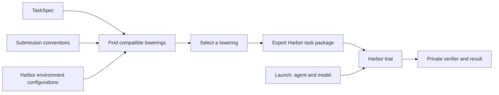

# TaskCompendium

## What problem does it solve?

Training and evaluation tasks arrive with different prompt formats, answer rules, tools, and graders. TaskCompendium separates the problem a model must solve from the way a framework runs and grades it. A caller can choose among compatible presentations of a task while keeping its reference answer private. Additional Harbor environment configurations can use the same task definition.

The current implementation exports Harbor tasks for final text, number, and native-action results. It grades them through a private verifier registry. The task model also names file and workspace-state results, but this slice has no Harbor environment configuration or submission convention for those result types.

## What does it contain?

- **Task specs** describe the source problem, the required capabilities, the kind of result, and how to verify it.
- **Submission conventions** describe how to ask for and extract a result, such as a plain answer, a JSON object, or a final function call.
- **Harbor environment configurations** describe the capabilities and tools exposed during execution. The only configuration in this slice is direct chat with no tools.
- **Lowering tools** find compatible convention and environment configuration pairs, select a pair, and export a runnable Harbor task package.
- **A Harbor adapter** runs the exported task with a replay agent or an OpenAI-compatible chat endpoint and records a grading result. Harbor acts as the harness: it orchestrates the model and environment after lowering.


```mermaid
flowchart LR
    S[TaskSpec] --> C[Find compatible lowerings]
    V[Submission conventions] --> C
    E[Harbor environment configurations] --> C
    C --> P[Select a lowering]
    P --> H[Export Harbor task package]
    H --> T[Harbor trial]
    L[Launch: agent and model] --> T
    T --> G[Private verifier and result]
```

## What is a task spec?

`TaskSpec` is the private definition of one source task. An importer or author creates it before choosing a submission convention or a framework launch.

| Field | Meaning |
| --- | --- |
| `id` | Stable identity for this task. |
| `context` | The ordered model-visible conversation: text messages, historical assistant function calls, and tool results. |
| `requirements` | Capabilities or action interfaces needed from the execution environment. |
| `tools` | Functions advertised at the decision point, tool choice, and the parallel-call setting. These definitions do not bind functions to an implementation. |
| `answer_type` | The semantic result: `text`, `number`, `file`, `state`, or `native_action`. |
| `source` | Dataset, revision, row, and importer revision used to reproduce the spec. |
| `verifier` | A private verifier kind and serialized JSON configuration. `exact_answer` checks text, `mcq_answer` checks a letter, and `predicted_action` checks a final function call. |
| `schema_version` | Version of the serialized spec, checked when the record is loaded. |

`context.events` is the model-visible conversation prefix. A text event retains its role and content. Historical assistant calls and tool results retain their call IDs and order; the adapter sends them as OpenAI-compatible chat messages without executing them again. `answer_type` does not prescribe a wrapper such as JSON.

`ConversationInput` is not a lossless Responses API transcript. It excludes provider reasoning items. The NeMo importer omits an unencrypted historical reasoning summary only when a visible assistant message or function call follows it. It rejects encrypted reasoning and reasoning left at the decision point. Exact provider continuation from reasoning state is outside this contract.

For example, a task asking “What is 7 + 5?” can have `answer_type=number` and a private expected answer of `12`. The plain, JSON, and `answer_call` conventions carry that answer as `12`, `{"answer":"12"}`, and a final `submit_answer({"answer":"12"})` call, respectively. Each extracts the string `12` for the same exact-answer verifier. A task asking for a function call has `answer_type=native_action`; its context retains the conversation and its tools describe the source functions. The verifier and expected answer are never added to the model-visible input. Importers must make source output instructions neutral to the supported conventions, or reject rows they cannot safely rewrite. A raw-output requirement in a source message would conflict with a JSON or function-call convention; `answer_type=text` alone cannot detect that conflict in prose.

The TaskTrove MCQA importer reads archives from a cleaned release. See the [published TaskTrove Clean dataset](https://huggingface.co/datasets/open-athena/task-trove). Its caller passes the archive bytes, upstream subset, archive path, and release provenance to `read_archive`. The reader checks the subset and path against the archive manifest; the release URI and revision are caller-supplied provenance. The importer checks the source answer-line template before replacing it with a one-letter instruction. Its text answer works with plain and JSON submission conventions. The private `mcq_answer` verifier stores the expected letter and option count. Any author can use that verifier; it currently calls the shared `tasktrove-verify` MCQ scorer after extracting the submission. This importer supports only MCQ mode. Executable TaskTrove modes still need private resources and an isolated verifier runtime.

## What is a lowering?

A lowering is one runnable presentation of a spec for a target framework. It combines a compatible submission convention with a Harbor environment configuration, then writes the target's task files. The spec says *what* result is needed; the convention says *how* the model delivers it; the environment configuration says *which capabilities* the environment provides. Agent and model selection happens when the task is launched.

`SubmissionConvention.supports(spec.answer_type)` checks the result kind. `compatible_lowerings` uses that check and the environment requirements; it does not read convention IDs from the spec. A convention that wraps a text or number answer cannot drop advertised functions or source tool-choice settings. The direct-chat environment configuration accepts only tasks with no required environment capabilities or action interfaces; a task requiring `shell` has no candidate in this slice. `select_lowerings` can keep all candidates, take the first, or sample one with an explicit RNG key. The order of the caller-supplied convention and environment configuration sequences determines the first candidate and the sample order. A training caller should record those ordered inputs, the selection policy and key, and the TaskCompendium code revision.

An author can require a particular execution environment without changing the semantic `TaskSpec`. Pass `required_environment="shellsim"` to `select_lowerings`; it keeps only ShellSim candidates and raises if none are compatible. A `shell` capability requests an operation, while ShellSim names a concrete execution choice. This initial slice offers only direct chat, so a ShellSim request fails rather than falling back to chat. The selected environment configuration is recorded in the exported Harbor package.

```python
from pathlib import Path

from taskcompendium.lowering import (
    HarborEnvironmentConfig,
    SelectionPolicy,
    compatible_lowerings,
    lower_to_harbor,
    select_lowerings,
)
from taskcompendium.grading import exact_answer
from taskcompendium.models import AnswerType, ConversationInput, Source, TaskRequirements, TaskSpec, TextMessage
from taskcompendium.submission import AnswerFormat, SubmissionConvention

spec = TaskSpec(
    id="arithmetic-7-plus-5",
    context=ConversationInput(events=(TextMessage(role="user", content="What is 7 + 5?"),)),
    requirements=TaskRequirements(),
    answer_type=AnswerType.NUMBER,
    verifier=exact_answer("12"),
    source=Source(dataset="hand-authored", revision="2026-09-16", row="arithmetic-7-plus-5", importer_revision="1"),
)
conventions = (
    SubmissionConvention(id="plain", answer_format=AnswerFormat.PLAIN),
    SubmissionConvention(id="json", answer_format=AnswerFormat.JSON),
    SubmissionConvention(id="answer-call", answer_format=AnswerFormat.ANSWER_CALL),
)
candidates = compatible_lowerings(spec, conventions, (HarborEnvironmentConfig(),))
chosen = select_lowerings(candidates, SelectionPolicy.SAMPLE, rng_key=1234)[0]
lower_to_harbor(spec, chosen.convention, chosen.environment_config, Path("/tmp/arithmetic-task"))
```

## How does Harbor run it?

`lower_to_harbor` writes `instruction.md` and `task.toml` for Harbor, plus `specification.json`, `submission_convention.json`, and `environment_config.json` for the launcher and custom verifier. The package also has an empty `environment/` directory. A chat launch sends the structured conversation from the spec, then adds the convention's final answer instruction when needed. The agent has no tool to read the package files. Harbor's custom verifier can read the spec and private reference answer. The convention file tells it how to extract the submitted answer.

`run_trial` takes the exported directory, its environment configuration, and a chat launch. The Harbor harness selects and runs the agent and environment; those choices are absent from `TaskSpec`. Provide the endpoint's base URL and, if needed, the name of an environment variable containing the API key. The agent resolves that variable in its process; the trial configuration retains only its name.

```python
import asyncio

from taskcompendium.harbor.runner import ChatLaunch, run_trial

result = asyncio.run(
    run_trial(
        Path("/tmp/arithmetic-task"),
        chosen.environment_config,
        ChatLaunch(model="model-id", api_base="https://example.com/v1", api_key_env="MODEL_API_KEY"),
        Path("/tmp/arithmetic-trials"),
        "arithmetic-run",
    )
)
```

Harbor runs one `ChatAgent` for every submission convention. The lowering prepares the conversation and tool configuration; the agent makes one request and writes the complete assistant message to `submission.json`. The convention extracts textual content or function calls for grading. The direct-chat environment exposes no filesystem or shell tools. The custom verifier reads the final response and resolves the private verifier kind through an explicit map. The selected verifier validates its JSON configuration and receives the response, convention, and Harbor's verifier-side environment. The built-in exact-answer verifier extracts and compares the answer directly, without a temporary answer file. A wrong answer receives reward `0.0`; a malformed submission has no reward; a verifier infrastructure failure has no reward and is recorded separately in `taskcompendium-result.json`. The package requires Harbor's [custom-verifier task loading](https://github.com/marin-community/harbor/pull/155) and does not use `tests/test.sh`.

The package tests use a test-only `ReplayAgent` in `tests/harbor_replay.py` to write fixed assistant messages to the same artifact and exercise Harbor grading without a model request. Replay is absent from the installed package and public launcher.

With the `answer_call` convention, the chat agent advertises only `submit_answer(answer: string)` and records the assistant's final response. It never invokes the function. The convention extracts the call's `answer` argument and passes it to the task's ordinary verifier. A non-call response or a call to another function is an extraction error. The same final-action decoder handles native-action tasks; their verifier compares the recorded call's function name and argument dictionary with the private expected call.

### NeMo final actions

`taskcompendium.importers.nemo_predicted_action.import_row` accepts a NeMo predicted-function-call row and its pinned canonical SHA-256 digest. It produces a `TaskSpec` with `answer_type=native_action` and a final-action convention. The context carries the source conversation; `tools` carries advertised functions, tool choice, and the parallel-call setting. The convention describes how Harbor captures the final action and can be reused across tasks. The expected function calls remain in the private `predicted_action` verifier. There is one stored conversation, with no second flattened prompt to keep in sync.

For a chat launch, the Harbor adapter sends the source turns and function definitions to the model, records its final function call, and stops without dispatching the call. The verifier compares function names and JSON arguments. The importer rejects message targets because the source comparator gives any message full credit; it also rejects request settings it cannot carry. The pinned fixture records the NeMo Gym repository revision and blob SHA in `tests/fixtures/nemo/predicted-action.provenance.json`. Numeric tolerance is used only when explicitly set in the private verifier.

Run the package tests from the repository root:

```bash
uv run --project lib/taskcompendium --extra harbor --group test pytest lib/taskcompendium/tests -q

# Type-check the package from its own project directory after installing its dependencies.
cd lib/taskcompendium
uvx --from 'pyrefly>=1.0.0,<1.1.0' pyrefly check
```
