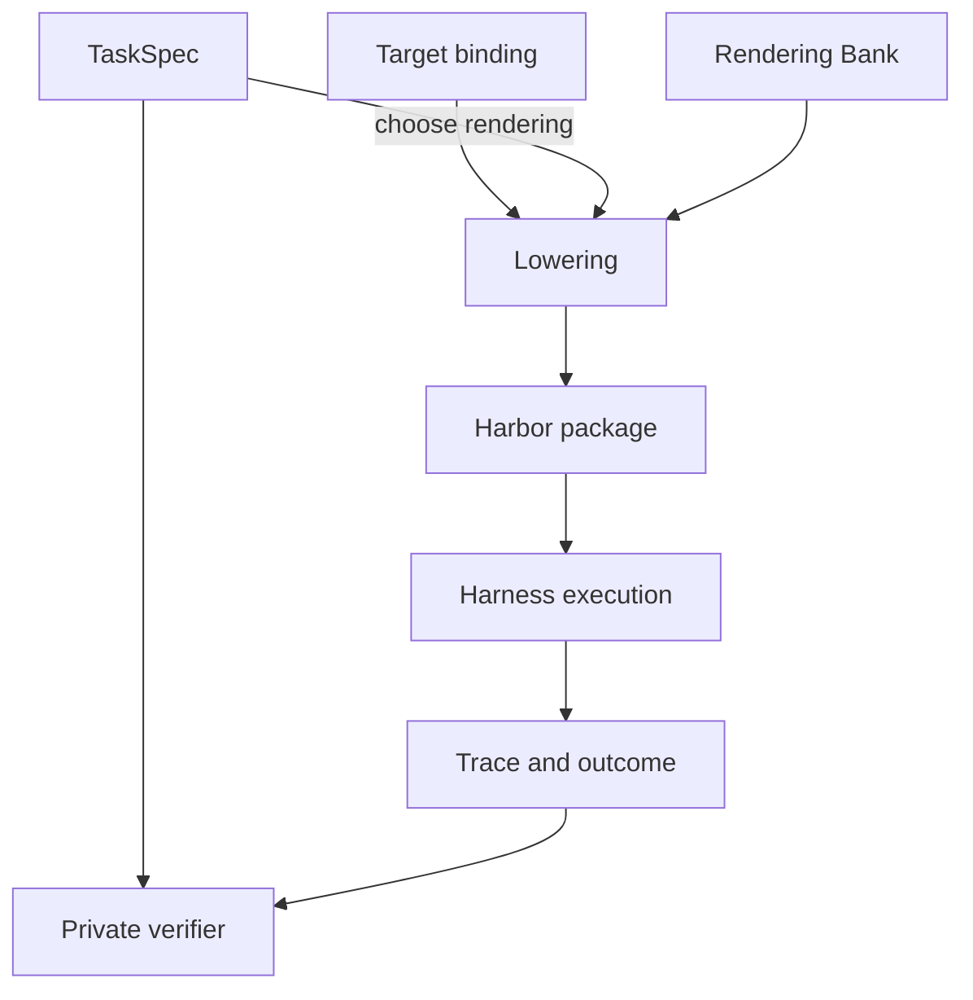

# TaskCompendium spec

The goal of TaskCompendium is to provide a source-agnostic and target-agnostic semantic representation of tasks for model evaluation and training. It should support a wide range of task shapes, including:

- Single-step tasks in a stateless "chat" format.
- Tasks that require a specific initial state, such as a Docker image, a pinned repository, or a provider action surface.
- Multi-step tasks with ordered requests, each with its own submission and correctness check.

TaskCompendium stores reproducible task semantics separately from task presentation and execution. Each record specifies what problem the model needs to solve, what state must exist, what needs to be submitted, and how success is determined. A rendering chooses how that submission is presented. A lowering adapts the rendered task to a runtime such as Harbor or a direct chat rollout.

As of 2026-09-14, Harbor is the only implemented execution target. Supporting non-agentic, "pure chat" rollouts in MarinSkyRL (jointly with Harbor rollouts) should be straightforward.

The MCP, browser, and interactive-environment sections describe planned extensions; they do not describe current schema fields or supported exports.

## Objects and ownership



`TaskSpec` represents a semantic task without a specific rendering or environment. Instead, it declares some instructions, answer requirements, and verifier contracts, and environment requirements.

Importers implement this interface for datasets such as TaskTrove, GSM8K, R2E-Gym, and NeMo Gym. Where possible, these importers are deterministic. However, they are often heavily LLM-assisted and thus non-deterministic. They may reject a source row if it cannot be faithfully represented in TaskCompendium, or if the task is broken, underspecified, or otherwise unsuitable.

`Lowering` is the only public projection. It is a target-specific package derived from a specification, its renderings, and a target binding. It contains the model-visible instructions, declared tools, and agent resources for that target. A launch then selects a compatible harness, model endpoint, and runtime policy.

For instance, a GSM8K row may be imported as a `TaskSpec` with one step, a text answer requirement, and a verifier that checks the answer against the gold. A rendering may choose to extract the answer from `/app/answer.json`, meaning that the environment would need filesystem access. A Harbor lowering may select a Docker image. The launch may then choose a Harbor agent, model endpoint, and retry policy.

## TaskSpec

A semantic instance has these top-level fields.

| Field | Meaning |
| --- | --- |
| `id` | Stable TaskCompendium identifier for the fixed instance. |
| `metadata` | Source provenance plus descriptive labels. |
| `steps` | Ordered requests and their private success criteria. At least one step is required. |
| `requirements` | Capabilities and initial state needed to solve the task. |
| `resources` | Resources shared across steps, each with explicit visibility. |
| `success_policy` | How valid step rewards combine. `mean` averages numeric step rewards. `final` uses the final numeric step reward. `all_required_steps` means every step is required for task completion; the current Harbor adapter rejects this policy for multi-step exports because its pinned runtime cannot preserve that contract. |
| `coverage_tags` | Reviewed labels for analysis and sampling. They do not determine execution. |

### Provenance and metadata

`metadata.source` has `dataset`, `revision`, `row`, and `importer_revision`. All four are required. A source revision identifies the upstream data state; an importer revision identifies the conversion logic that produced the semantic record.

`metadata.competencies` and `metadata.task_shape` describe the source task. `coverage_tags` provide a controlled, sortable taxonomy with `competency`, `shape`, `domain`, `artifact`, `interaction`, `state`, `context`, and exactly one Snowball-calibrated `difficulty` tag where a difficulty judgment is available. [The tagging guide](TAGGING.md) defines the current vocabulary and review process.

A rendering may add a tag to describe the output format being tested: `result:json`, `result:xml`, or `result:file`, etc. These are output encodings, not semantic TaskSpec tags.

### Steps

Each `StepSpecification` has the following fields.

| Field | Meaning |
| --- | --- |
| `instructions` | Model-visible request. It states the work and any public submission location. It never mentions a verifier, judge, reward, hidden test, or reference answer. |
| `answer_requirements` | Intrinsic answer form: `text`, `literal`, `json`, `xml`, `csv`, or `final_state`. A rendering cannot weaken this form. |
| `resources` | Step-local resources. Resource roles control visibility. |
| `verifier` | Private correctness contract for this step. |
| `context_requirement` | `instruction_and_workspace` needs only the current instruction and workspace. `prior_conversation` requires the accumulated visible history from preceding steps. |

For Harbor, every ordered TaskCompendium run retains the full sequence of preceding user, assistant, and tool messages. `prior_conversation` marks a step that depends on this history. `instruction_and_workspace` is a minimum requirement: the history remains available, but the task does not rely on it. Importers should use `prior_conversation` only after a step that can produce the needed history.

An ordered static task can therefore express a workflow whose later request depends on an earlier request and its workspace or conversation. It cannot express an adaptive counterparty that decides the next user message from the model's prior action. That requires the interactive-environment extension described below.

### Requirements and initial state

`TaskRequirements` declares the operations required to solve the task and the state those operations begin with.

| Field | Meaning |
| --- | --- |
| `capabilities` | Semantic requirements currently drawn from `filesystem`, `shell`, and `process`. A capability states what features must be available in the host environment. It does not choose ShellSim, Docker, or an agent. |
| `state` | `WorkspaceState`: optional image digest, working directory, setup commands, and additional non-overlapping workspace roots. |
| `action_interfaces` | Named, versioned stateful action surfaces with a seed digest. The current provider implementation uses this for Workplace. It is separate from shell and filesystem capabilities. |

A Docker image in `state` is an initial-state requirement when task behavior depends on it. A task requiring an answer in `/app/answer.txt` requires a filesystem submission convention; a task requiring command execution declares the shell or process capability separately.

An action interface is a package of tools plus the persistent world they act on. The current Workplace example is pinned from [NVIDIA's Nemotron RL Workplace Assistant dataset](https://huggingface.co/datasets/nvidia/Nemotron-RL-agent-workplace_assistant). It has:

```
Tools: email_reply, create_task, move_task, look_up_employee, ...
State: inboxes, projects, task boards, directory records
Seed: the specific initial company snapshot
Rules: how each tool mutates state and what it returns
```

Action Interfaces are not fully baked. They're meant to cover non-shell, non-filesystem stateful providers. They should be versioned and pinned to a specific seed state.

MCPs are similar to action interfaces, but we haven't yet defined a stable MCP contract.

### Resources and visibility

Every resource has a normalized relative path, content, roles, and an executable bit. Content is embedded bytes or a URI with a SHA256 digest.

| Role | Visibility and purpose |
| --- | --- |
| `agent` | Materialized into the lowering's agent-visible environment. |
| `verifier` | Available only while evaluating a submission. |
| `oracle` | Private reference material. It cannot also be agent-visible. |

Resources can be shared by the whole specification or attached to one step. A path may not have ambiguous placement for the same role. This prevents a later step from silently replacing an earlier verifier input.

### Verifiers and outcomes

Verifier variants preserve source-specific semantics without forcing every source into one universal grader format.
Verifiers can either come from a small taxonomy of TaskTrove-like verifiers or be custom per-task (via an arbitrary script with arbitrary resources). They are private and not agent-visible. A verifier may require a specific environment, such as a pinned Docker image, a provider action interface, etc.

LLM-as-judge is stubbed here.

A verifier returns one of four outcomes.

| Outcome | Reward | Meaning |
| --- | --- | --- |
| `graded` | Number | The verifier produced a semantic score. Zero is a valid incorrect result. |
| `extraction_error` | None | The declared submission could not be recovered, such as invalid JSON or a missing file. |
| `invalid_task` | None | The imported task or verifier contract is malformed. |
| `infra_error` | None | Evaluation infrastructure failed. This is never converted to score zero. |

A malformed source record becomes `Rejected` during import when its semantics cannot be preserved or trusted. Rejection reasons include broken graders, source gold leakage, underspecification, null answers that pass, unsupported environments, and duplicates.

## Renderings

A `Rendering` chooses the submission convention for one step. Its `id` identifies the convention; `submission` is one of:

- `AssistantFinal`, optionally extracted as plain text, boxed LaTeX, JSONPath, or XML path;
- `FileSubmission`, with a required path and extractor;
- `FinalState`, with paths whose final workspace state is submitted;
- `FinalActionSubmission`, with source-advertised function definitions for a native final action.

`render_instruction(specification, rendering, step_index)` produces the model-visible instruction for one step. The lowering then materializes only `agent` resources, exposes the selected tools, and records rendering-added result tags. It adds filesystem capability when public files or a file/final-state submission requires it.

Private verifier inputs, expected actions, judge prompts, source archives, and gold state do not appear in a lowering's agent-visible surface.

A rendering may add a short output instruction, such as “Write your submission to `/app/answer.txt`.” It must not add evaluation instructions. The task request should still read as a natural request from the original domain.

## Lowering

A lowering maps a semantic `TaskSpec` instance and its selected renderings to a runtime package. It selects a compatible environment implementation and tool exposure, then validates that both meet the semantic requirements. It does not select the model or a particular agent strategy.

### Target bindings

A target binding says how one target runs a `TaskSpec`: the environment it uses and the tools it exposes. Several bindings may satisfy the same task requirements.

A target binding includes:

| Field | Meaning |
| --- | --- |
| Target | The lowering implementation and pinned revision that interpret the binding. |
| Environment | The concrete environment implementation, its immutable image or provider identity, workspace roots, and target-specific limits. |
| Tools | The model-visible actions and their target adapter. An empty set means direct assistant response. |
| Target setup | Target-specific materialization and startup data required to realize the declared state. |

A target binding does not define instructions, answer requirements, verifier behavior, source provenance, or semantic capabilities. It also does not select a model, agent, retry policy, or other rollout strategy. Those belong to `TaskSpec` or to a launch.

The current Harbor lowering is `lower_to_harbor(specification, renderings, binding, destination)`. It validates:

- the environment provides every declared capability and preserves the required initial state;
- the interaction mode is compatible with the task, submission contract, and visible resources;
- conversation retention satisfies each step's context requirement;
- final-state and file paths are valid under the selected workspace;
- executable verifiers have an isolated runtime;
- each rendering preserves the intrinsic answer form.

A successful lowering writes these important artifacts.

| File | Contents |
| --- | --- |
| `specification.json` | Canonical private semantic specification. |
| `renderings.json` | Selected per-step output conventions. |
| `binding.json` | Environment and model-visible interaction requirements for this Harbor package. |
| `task.toml` | Harbor task layout, workspace, image, and step configuration. |
| `manifest.json` | Specification hash, source provenance, rendering identity, Harbor revision, lowering version, and verifier-runtime identity. |
| `environment/inputs` and step workdirs | Materialized agent-visible resources. |

### Harbor target bindings and launches

`HarborTaskBinding` is the current target-binding implementation. The binding type and the pinned Harbor revision identify its target. Its environment variant is currently `NoEnvironment`, `ShellSimEnvironment`, `DockerEnvironment`, or `ProviderEnvironment`; the provider variant carries an adapter import path and private configuration. Its `tools` tuple is empty for chat and otherwise declares the explicit model-facing tool binding. The current adapters accept one tool binding. Harbor writes it to `binding.json` alongside the lowering manifest.

A future non-Harbor lowering should use the same semantic specification and rendering. It must define its own binding and launch types instead of embedding Harbor fields in task data.

## Harbor as the first execution target

All currently supported TaskCompendium examples should first lower to Harbor. Harbor gives one integration path for plain chat, tool chat, Docker workspaces, ShellSim, native final actions, provider actions, and ordered multi-step tasks. The Harbor conformance selector runs real Harbor `Trial` lifecycles with deterministic replay or scripted local model endpoints.

```bash
uv run --project lib/taskcompendium --extra harbor --group test \
  pytest -m harbor_conformance lib/taskcompendium/tests
```

The selector is an integration contract, not a measure of model capability. It covers correct, wrong, malformed, and infrastructure-failure attempts for the thin native-action and stateful workflow cells. Docker and the ShellSim bridge are included deliberately.

## SkyRL integration

### First stage: Harbor-backed generation

The pinned MarinSkyRL runtime exposes `entrypoint: terminal_bench_generate` for a non-training rollout-generation run. It loads each item in `data.train_data`, expands it by `generator.n_samples_per_prompt`, runs a Harbor `TrajectoryRunner`, and emits the normalized trajectories. `TrajectoryRunner` is the current generic interface; `GeneratorInterface` is a historical name and should not be reintroduced.

TaskCompendium selects a canonical specification, rendering, and compatible Harbor binding before that run. It materializes each selected lowering as a native Harbor package directory. MarinSkyRL's `TerminalBenchTaskDataset` consumes a directory whose immediate children are these packages, identified by their `instruction.md`; it does not need to know TaskCompendium's private semantic schema. Harbor then executes the rollout and returns its trace and semantic outcome. SkyRL consumes the rollout tokens, tool trajectory, final submission, reward, and failure status from that result.

This keeps one execution implementation for every supported task shape. It also ensures that direct-chat, ShellSim, Docker, provider, and multi-step behavior pass the same conformance gate before a generation or training integration relies on them.

### Later: direct TaskCompendium generation targets

After the Harbor path is stable, add TaskCompendium-owned selection and lowering for two explicit targets:

| Target | Use | Scope |
| --- | --- | --- |
| Harbor | Agentic execution, environments, tools, stateful providers, and ordered workflows. | Reuses the Harbor package and trace. |
| Non-agentic chat | Direct assistant-response rollouts. | Supports renderings with a direct final submission and no required action loop. |

Selection chooses the target from task requirements and the requested training mode; a target adapter owns its executable data format.

The generation boundary should preserve these invariants:

1. Source provenance and the semantic specification hash identify the task independently of the target.
2. Rendering chooses the public prompt and submission convention before target lowering.
3. Environment allocation, model parameters, sampler settings, and retry policy remain execution configuration.
4. A trace preserves model, target, environment, tool, and verifier provenance so training rows can be audited.
5. `graded`, `extraction_error`, `invalid_task`, and `infra_error` remain distinct in training data. Only `graded` carries a numeric reward.

## Planned environment extensions

These extensions should add environment contracts and target adapters. They should not change source task semantics merely to fit one harness.

### MCP service bundles

An MCP-backed task needs a pinned environment bundle. A proposed `McpServiceRequirement` would name the semantic MCP service, immutable image digest, deployment manifest digest, startup and health contract, reset policy, and any public action-interface identity. A task may require several MCP services.

The environment starts the service bundle with Docker Compose or an equivalent allocator. It owns ports, credentials, account fixtures, mutable seed state, and teardown. The harness acts as the MCP client: it initializes each server, calls `tools/list`, and translates the discovered tool schemas into its model provider's tool interface. The model receives normal function/tool definitions and tool-result messages; it does not launch containers or speak MCP JSON-RPC itself.

Record the pinned images, compose manifest, discovered tool schemas and checksum, server revisions, reset result, and every MCP call/result in the trace. Keep credentials, private initial state, and verifier resources out of the agent-visible lowering.

MCP discovery policy belongs to the harness. A small environment can expose every discovered tool at the first model turn. A large environment may expose a constrained discovery tool and reveal schemas incrementally. The task requirement identifies the service behavior; the policy for presenting schemas is a target-level choice.

### Browser environments

A browser task should declare a browser capability and a reproducible initial web state. The environment may use a pinned application image, a browser profile or storage-state digest, a seed database, and a local origin or service bundle. Its target adapter exposes a browser action surface such as navigation, element interaction, screenshot, page text, download, and upload.

The verifier should inspect private final browser/server state or a declared artifact. Browser history, cookies, network rules, and task-local files belong in the trace. A browser capability does not imply shell access, and a browser task should not depend on a public evaluator script.

### Stateful action providers

The current `ActionInterface(name, version, seed_sha256)` is sufficient to bind the Workplace provider. Broader providers need a transport-neutral action-surface contract: versioned tool schemas, observation and error serialization, reset and termination behavior, state checkpointing, and private state predicates. The provider adapter can translate that surface to MCP, OpenAI function calling, a browser controller, or a source-native API.

Avoid a universal canonical tool wire format. The stable contract is the declared action surface and its version. Each target adapter translates it to the wire format required by its harness.

### Reactive user simulations and interactive environments

Harbor AFAICT only supports static ordered steps. A reactive user simulator is a future extension that can adapt to model actions and produce the next user event. It should be a first-class environment, not a fixed list of `StepSpecification` records.

A reactive user simulator is an environment, not a fixed list of `StepSpecification` records. It owns conversational state, observes model actions, produces the next user event, defines termination, and provides a private success check. The task declaration should identify the simulator version, initial state digest, turn and cost budget, and required interaction capability.

A future `InteractiveEnvironment` protocol should expose operations analogous to `reset`, `observe`, `act`, `is_terminal`, `submit`, and `grade`. Its trace must retain the generated user events and environment transitions. Static ordered steps remain useful for fixed workflows; they should not be overloaded to imitate adaptive dialogue.

### Long-running and external-service tasks

Some future environments will need leases, checkpoint/restore, cleanup, and credential injection. These belong to environment allocation. Task records should pin the resource identities and reset semantics needed for reproduction, while a scheduler provides ephemeral credentials and network placement. A failed teardown or unavailable dependency is infrastructure failure, never a task reward of zero.


### LLM-as-judge

This isn't implemented but in principle a verifier could be an LLM that checks the model's submission against a reference answer and/or rubric. The verifier would receive the submission and reference answer, and return a score or pass/fail judgment. Presumably the judge should also declare what capacity of model it requires.
