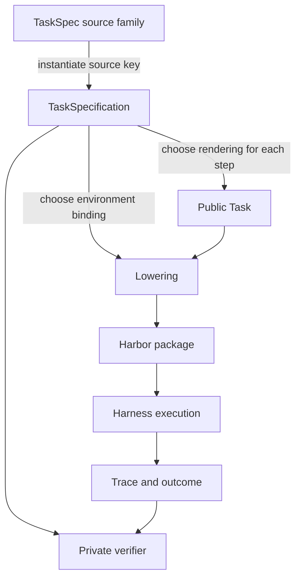

# TaskCompendium specification

TaskCompendium stores reproducible task semantics separately from task presentation and execution. A record says what problem the model must solve, what state must exist, what may be submitted, and how success is determined. A rendering chooses how that submission is presented. A lowering adapts the rendered task to a runtime such as Harbor.

The current schema version is 0.7. Harbor is the only implemented execution target. The MCP, browser, and interactive-environment sections describe planned extensions; they do not describe current schema fields or supported exports.

## Objects and ownership



`TaskSpec` is a source-family interface. Its `instantiate(key)` method converts one pinned source row into either a `TaskSpecification` or a `Rejected` record. Importers implement this interface for datasets such as TaskTrove, GSM8K, R2E-Gym, and NeMo Gym.

`TaskSpecification` is one immutable semantic instance. It includes private verifier data. It is the unit written to the dataset and hashed for provenance.

`Task` is the model-visible projection of one `TaskSpecification` under a chosen set of renderings. It excludes verifier and oracle resources.

A lowering is a target-specific package derived from a specification, its renderings, and an environment binding. It must not recover or alter task semantics. A launch then selects a compatible harness, model endpoint, and runtime policy.

TaskCompendium does not yet define a serialized trace schema. Execution produces traces outside task data. For Harbor, the authoritative record is the Harbor trial tree: its result document, agent and verifier artifacts, and any environment artifacts. A future common trace schema should record messages, tool calls and results, model identity, launch configuration, submission, verifier outcome, and artifact references.

## TaskSpecification

A semantic instance has these top-level fields.

| Field | Meaning |
| --- | --- |
| `schema_version` | Version of the TaskCompendium semantic schema. Current records use `0.7`. |
| `id` | Stable TaskCompendium identifier for the fixed instance. |
| `metadata` | Source provenance plus descriptive labels. |
| `steps` | Ordered requests and their private success criteria. At least one step is required. |
| `requirements` | Capabilities and initial state needed to solve the task. |
| `resources` | Resources shared across steps, each with explicit visibility. |
| `success_policy` | How valid step rewards combine. `mean` averages numeric step rewards. `final` uses the final numeric step reward. `all_required_steps` means every step is required for task completion; the current Harbor adapter rejects this policy for multi-step exports because its pinned runtime cannot preserve that contract. |
| `coverage_tags` | Reviewed labels for analysis and sampling. They do not determine execution. |

### Provenance and metadata

`metadata.source` has `dataset`, `revision`, `row`, and `importer_revision`. All four are required. A source revision identifies the upstream data state; an importer revision identifies the conversion logic that produced the semantic record.

`metadata.competencies` and `metadata.task_shape` describe the source task. `coverage_tags` provide a controlled, sortable taxonomy with `competency`, `shape`, `domain`, `artifact`, `interaction`, `state`, `context`, and exactly one Snowball-calibrated `difficulty` tag where a difficulty judgment is available.

A rendering may add `result:json`, `result:xml`, or `result:file`. These are output encodings. They do not claim that a task requires substantive JSON, XML, or file-manipulation work.

### Steps

Each `StepSpecification` has the following fields.

| Field | Meaning |
| --- | --- |
| `instructions` | Model-visible request. It states the work and any public submission location. It never mentions a verifier, judge, reward, hidden test, or reference answer. |
| `answer_requirements` | Intrinsic answer form: `text`, `literal`, `json`, `xml`, `csv`, or `final_state`. A rendering cannot weaken this form. |
| `resources` | Step-local resources. Resource roles control visibility. |
| `verifier` | Private correctness contract for this step. |
| `context_requirement` | `instruction_and_workspace` needs only the current instruction and workspace. `prior_conversation` requires the accumulated visible history from preceding steps. |

For Harbor, a binding with `context: conversation` retains the full sequence of preceding user, assistant, and tool messages. A step with `prior_conversation` requires that binding. `instruction_and_workspace` is a minimum requirement: a conversation binding may still retain prior turns. Importers should use `prior_conversation` only after a step that can produce the needed history.

An ordered static task can therefore express a workflow whose later request depends on an earlier request and its workspace or conversation. It cannot express an adaptive counterparty that decides the next user message from the model's prior action. That requires the interactive-environment extension described below.

### Requirements and initial state

`TaskRequirements` declares the operations required to solve the task and the state those operations begin with.

| Field | Meaning |
| --- | --- |
| `capabilities` | Semantic requirements currently drawn from `filesystem`, `shell`, and `process`. A capability states what must be available. It does not choose ShellSim, Docker, or an agent. |
| `state` | `WorkspaceState`: optional image digest, working directory, setup commands, and additional non-overlapping workspace roots. An image must be immutable. |
| `action_interfaces` | Named, versioned stateful action surfaces with a seed digest. The current provider implementation uses this for Workplace. It is separate from shell and filesystem capabilities. |

A Docker image in `state` is an initial-state requirement when task behavior depends on it. It does not by itself grant the model a shell or process tool. A task requiring an answer in `/app/answer.txt` requires a filesystem submission convention; a task requiring command execution declares the shell or process capability separately.

### Resources and visibility

Every resource has a normalized relative path, content, roles, and an executable bit. Content is embedded bytes or a URI with a SHA256 digest.

| Role | Visibility and purpose |
| --- | --- |
| `agent` | Materialized into the model's task environment or public task projection. |
| `verifier` | Available only while evaluating a submission. |
| `oracle` | Private reference material. It cannot also be agent-visible. |

Resources can be shared by the whole specification or attached to one step. A path may not have ambiguous placement for the same role. This prevents a later step from silently replacing an earlier verifier input.

### Verifiers and outcomes

Verifier variants preserve source-specific semantics without forcing every source into one universal grader format. Current variants include TaskTrove verifier contracts, instruction constraints, predicted native actions, provider-state checks, and code-answer wrappers around isolated source verifiers.

Executable source verification runs in an isolated container. Model judges carry an explicit model policy and a restricted `JudgeView`; they are not agent-visible. A verifier receives the extracted submission and, when appropriate, final workspace state, provider state, and a retained transcript.

Every verifier receives the declared submission. File and final-state renderings supply the requested workspace evidence. Provider-state verifiers query the authoritative provider state. A transcript is available to verifier implementations, but a judge receives it only when its `JudgeView` permits it. Conversation retention is selected by the execution binding; a step's context requirement constrains which bindings are valid.

A verifier returns one of four outcomes.

| Outcome | Reward | Meaning |
| --- | --- | --- |
| `graded` | Number | The verifier produced a semantic score. Zero is a valid incorrect result. |
| `extraction_error` | None | The declared submission could not be recovered, such as invalid JSON or a missing file. |
| `invalid_task` | None | The imported task or verifier contract is malformed. |
| `infra_error` | None | Evaluation infrastructure failed. This is never converted to score zero. |

A malformed source record becomes `Rejected` during import when its semantics cannot be preserved or trusted. Rejection reasons include broken graders, source gold leakage, underspecification, null answers that pass, unsupported environments, and duplicates.

## Renderings and public Task records

A `Rendering` chooses the submission convention for one step. Its `id` identifies the convention; `submission` is one of:

- `AssistantFinal`, optionally extracted as plain text, boxed LaTeX, JSONPath, or XML path;
- `FileSubmission`, with a required path and extractor;
- `FinalState`, with paths whose final workspace state is submitted;
- `FinalActionSubmission`, with source-advertised function definitions for a native final action.

`render_task(specification, renderings)` requires one rendering per semantic step. It produces a public `Task` containing:

- the specification ID and semantic hash;
- public instructions and only `agent` resources;
- the selected submission contracts and context requirements;
- requirements, including filesystem capability added by a file/final-state submission or public files;
- metadata and coverage tags.

| Task field | Meaning |
| --- | --- |
| `id` | Semantic instance ID. |
| `specification_sha256` | Hash of the complete private semantic specification. |
| `steps` | Public `TaskStep` records with instructions, public resources, submission contract, and context requirement. |
| `requirements` | Semantic requirements after adding filesystem access required by public files or the selected submission convention. |
| `resources` | Public shared resources. |
| `metadata` | Source provenance and source-level labels. |
| `coverage_tags` | Semantic coverage tags plus rendering-added result-encoding tags. |

Private verifier inputs, expected actions, judge prompts, source archives, and gold state do not appear in `Task`.

A rendering may add a short output instruction, such as “Write your submission to `/app/answer.txt`.” It must not add evaluation instructions. The task request should still read as a natural request from the original domain.

## Lowering

A lowering maps a semantic instance and its public rendering to a runtime package. It selects a compatible environment implementation and tool exposure, then validates that both meet the semantic requirements. It does not select the model or a particular agent strategy.

The current Harbor lowering is `lower_to_harbor(specification, renderings, binding, destination)`. It validates:

- the environment provides every declared capability and preserves the required initial state;
- the interaction mode is compatible with the task, submission contract, and visible resources;
- conversation retention satisfies each step's context requirement;
- final-state and file paths are valid under the selected workspace;
- executable verifiers have an isolated runtime;
- each rendering preserves the intrinsic answer form.

A successful lowering writes these important artifacts.

| File | Contents |
| --- | --- |
| `specification.json` | Canonical private semantic specification. |
| `task.json` | Public rendered task. |
| `renderings.json` | Selected per-step output conventions. |
| `binding.json` | Environment and model-visible interaction requirements for this Harbor package. |
| `task.toml` | Harbor task layout, workspace, image, and step configuration. |
| `manifest.json` | Specification hash, source provenance, rendering identity, Harbor revision, lowering version, and verifier-runtime identity. |
| `environment/inputs` and step workdirs | Materialized agent-visible resources. |

A reference execution may additionally write `reference-execution.json`. It is a test or example launch artifact. It is not part of canonical task identity.

### Harbor bindings and launches

`HarborTaskBinding` is the current Harbor-side representation of an environment and interaction requirement. Its environment variant is `NoEnvironment`, `ShellSimEnvironment`, `DockerEnvironment`, or `ProviderEnvironment`; the provider variant carries an adapter import path and private configuration. A binding also contains interaction mode (`chat` or `chat_with_tools`), an explicit tool binding, and conversation retention mode.

`HarborLaunchConfig` chooses a compatible Harbor agent such as `chat`, `tool_chat`, `provider_chat`, or a terminal agent. `HarborExecutionConfig` combines a binding with a launch only when an execution is about to start. Model endpoint, model name, timeouts, retries, and agent-specific arguments are launch policy.

This split is intentional:

- the task says it needs a filesystem, a pinned repository state, or a versioned provider action surface;
- the environment fulfills those requirements;
- the binding exposes a suitable model-facing interface for Harbor;
- the launch selects the agent loop that can use that interface.

A future non-Harbor lowering should use the same semantic specification and rendering. It must define its own binding and launch types instead of embedding Harbor fields in task data.

## Harbor as the first execution target

All currently supported TaskCompendium examples should first lower to Harbor. Harbor gives one integration path for plain chat, tool chat, Docker workspaces, ShellSim, native final actions, provider actions, and ordered multi-step tasks. The Harbor conformance selector runs real Harbor `Trial` lifecycles with deterministic replay or scripted local model endpoints.

```bash
uv run --project lib/taskcompendium --extra harbor --group test \
  pytest -m harbor_conformance lib/taskcompendium/tests
```

The selector is an integration contract, not a measure of model capability. It covers correct, wrong, malformed, and infrastructure-failure attempts for the thin native-action and stateful workflow cells. Docker and the ShellSim bridge are included deliberately.

## SkyRL integration

TaskCompendium should provide semantic task data and execution adapters to MarinSkyRL. It should not make SkyRL or a specific rollout engine part of a `TaskSpecification`.

### First stage: Harbor-backed generation

The first SkyRL integration should lower every supported selected task through Harbor. A SkyRL generator selects a canonical specification, a rendering, and a compatible Harbor binding; it then emits a Harbor package and launch configuration. Harbor executes the rollout and returns its trace and semantic outcome. SkyRL consumes the rollout tokens, tool trajectory, final submission, reward, and failure status from that result.

This stage keeps one execution implementation for every supported task shape. It also ensures that direct-chat, ShellSim, Docker, provider, and multi-step behavior pass the same conformance gate before any training integration relies on them.

### Second stage: TaskCompendium Generator

After the Harbor path is stable, add a TaskCompendium-owned generator with two explicit lowerings:

| Target | Use | Scope |
| --- | --- | --- |
| Harbor | Agentic execution, environments, tools, stateful providers, and ordered workflows. | Reuses the Harbor package and trace. |
| Non-agentic chat | Direct assistant-response rollouts. | Supports tasks whose public Task has a direct final submission and no required action loop. |

The generator should choose the target from the task's requirements and the requested training mode. It should not infer that a Docker image permits a chat-only rollout to execute commands. A direct chat lowering serializes the rendered messages, stop conditions, submission extractor, and private verifier invocation; it does not emulate an agent loop.

The generator boundary should preserve these invariants:

1. Source provenance and the semantic specification hash identify the task independently of the target.
2. Rendering chooses the public prompt and submission convention before target lowering.
3. Environment allocation, model parameters, sampler settings, and retry policy remain execution configuration.
4. A trace preserves model, target, environment, tool, and verifier provenance so training rows can be audited.
5. `graded`, `extraction_error`, `invalid_task`, and `infra_error` remain distinct in training data. Only `graded` carries a numeric reward.

## Planned environment extensions

These extensions should add environment contracts and target adapters. They should not change source task semantics merely to fit one harness.

### MCP service bundles

An MCP-backed task needs a pinned environment bundle. A proposed `McpServiceRequirement` would name the semantic MCP service, immutable image digest, deployment manifest digest, startup and health contract, reset policy, and any public action-interface identity. A task may require several MCP services.

The environment starts the service bundle with Docker Compose or an equivalent allocator. It owns ports, credentials, account fixtures, mutable seed state, and teardown. The harness acts as the MCP client: it initializes each server, calls `tools/list`, and translates the discovered tool schemas into its model provider's tool interface. The model receives normal function/tool definitions and tool-result messages; it does not launch containers or speak MCP JSON-RPC itself.

Record the pinned images, compose manifest, discovered tool schemas and checksum, server revisions, reset result, and every MCP call/result in the trace. Keep credentials, private initial state, and verifier resources out of the public `Task`.

MCP discovery policy belongs to the harness. A small environment can expose every discovered tool at the first model turn. A large environment may expose a constrained discovery tool and reveal schemas incrementally. The task requirement identifies the service behavior; the policy for presenting schemas is a target-level choice.

### Browser environments

A browser task should declare a browser capability and a reproducible initial web state. The environment may use a pinned application image, a browser profile or storage-state digest, a seed database, and a local origin or service bundle. Its target adapter exposes a browser action surface such as navigation, element interaction, screenshot, page text, download, and upload.

The verifier should inspect private final browser/server state or a declared artifact. Browser history, cookies, network rules, and task-local files belong in the trace. A browser capability does not imply shell access, and a browser task should not depend on a public evaluator script.

### Stateful action providers

The current `ActionInterface(name, version, seed_sha256)` is sufficient to bind the Workplace provider. Broader providers need a transport-neutral action-surface contract: versioned tool schemas, observation and error serialization, reset and termination behavior, state checkpointing, and private state predicates. The provider adapter can translate that surface to MCP, OpenAI function calling, a browser controller, or a source-native API.

Avoid a universal canonical tool wire format. The stable contract is the declared action surface and its version. Each target adapter translates it to the wire format required by its harness.

### Reactive user simulations and interactive environments

A reactive user simulator is an environment, not a fixed list of `StepSpecification` records. It owns conversational state, observes model actions, produces the next user event, defines termination, and provides a private success check. The task declaration should identify the simulator version, initial state digest, turn and cost budget, and required interaction capability.

A future `InteractiveEnvironment` protocol should expose operations analogous to `reset`, `observe`, `act`, `is_terminal`, `submit`, and `grade`. Its trace must retain the generated user events and environment transitions. Static ordered steps remain useful for fixed workflows; they should not be overloaded to imitate adaptive dialogue.

### Long-running and external-service tasks

Some future environments will need leases, checkpoint/restore, cleanup, and credential injection. These belong to environment allocation. Task records should pin the resource identities and reset semantics needed for reproduction, while a scheduler provides ephemeral credentials and network placement. A failed teardown or unavailable dependency is infrastructure failure, never a task reward of zero.

## Compatibility rules

A target adapter may reject a task when it cannot preserve the semantic contract. Examples include an interactive protocol lowered to static chat, a process-required task without an isolated process environment, a stateful provider with a mismatched action-interface seed, or an executable source verifier without its pinned runtime.

Rejecting an unsupported task is preferable to exporting a task that appears runnable but changes its environment, success condition, or available actions.
