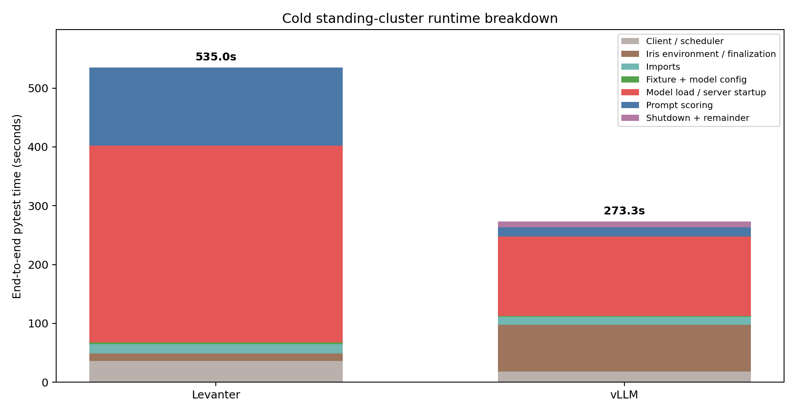
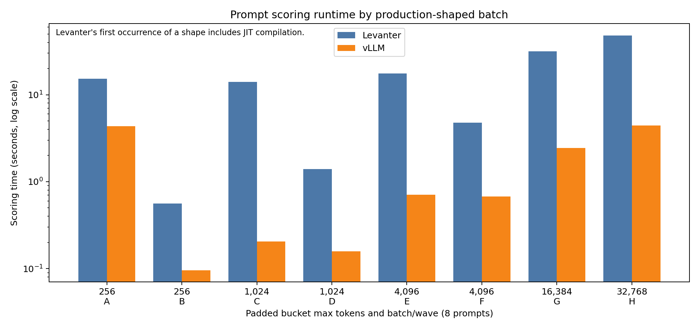
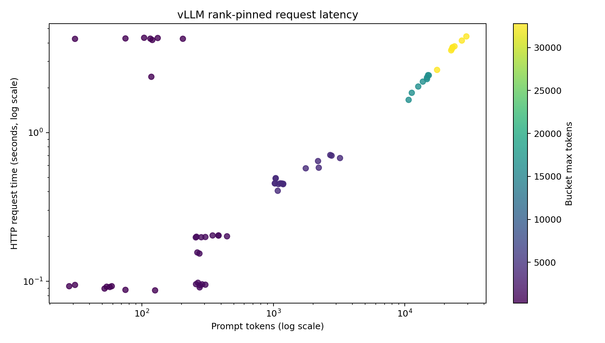
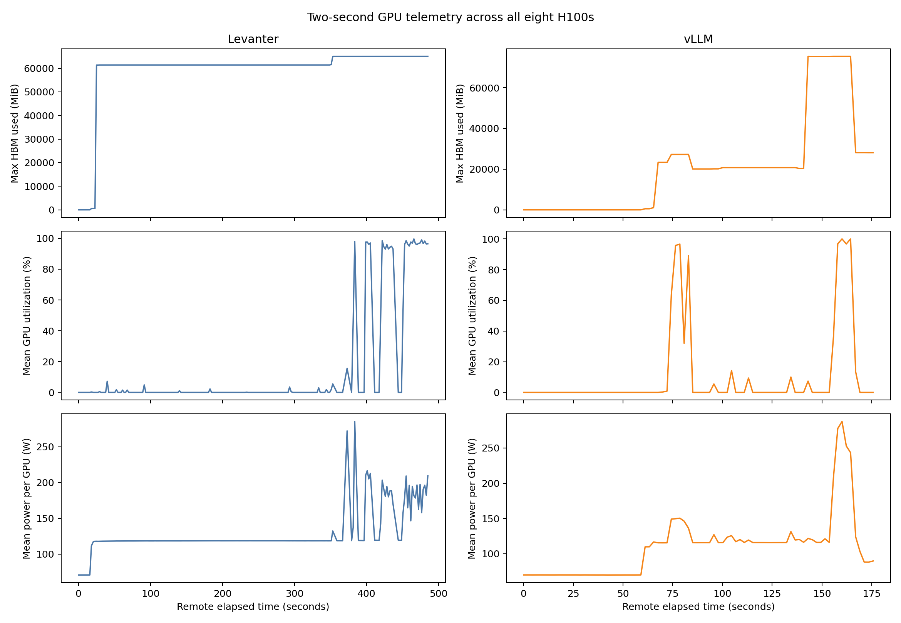
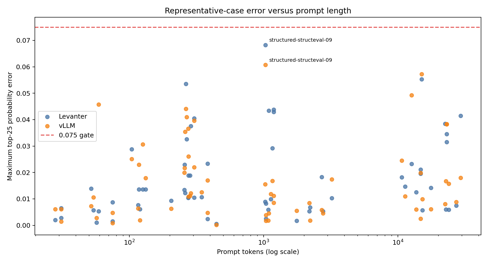
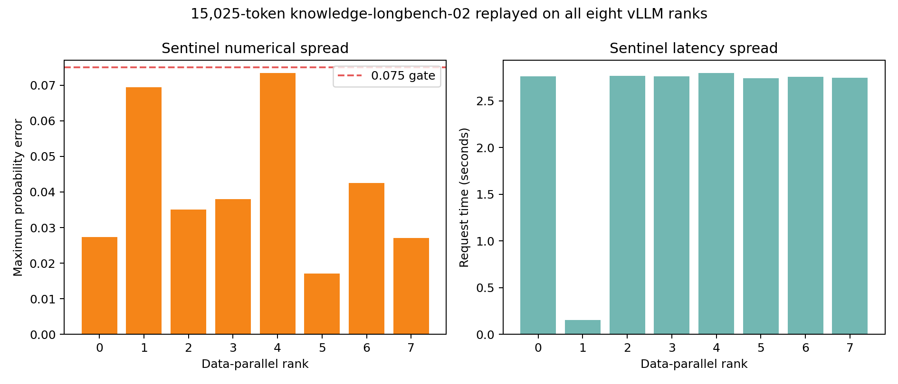
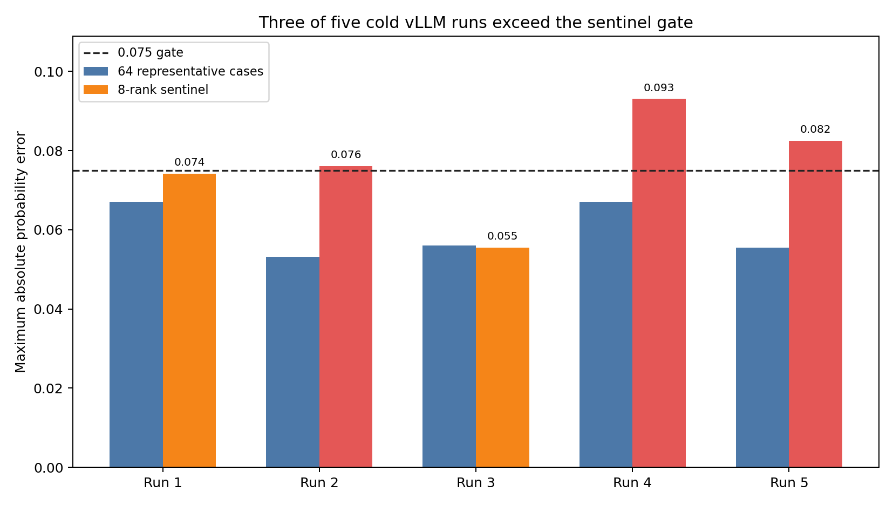
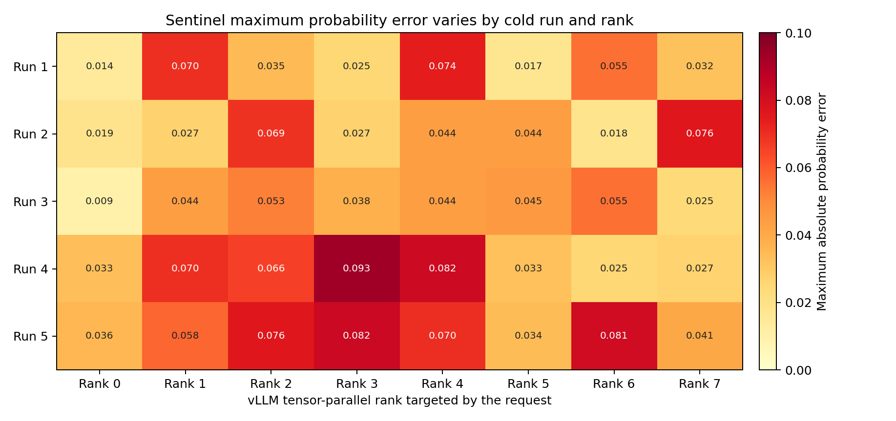
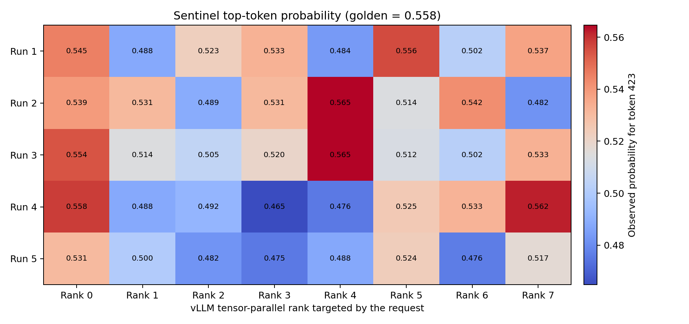
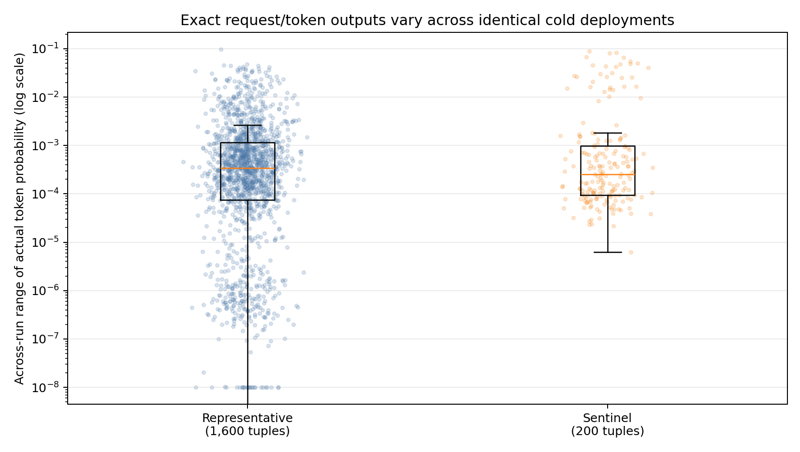

# Snowball parity-test performance on real 8×H100 nodes

**Date:** 2026-07-17 · **Commit:** `4b32fcfb0747dbb83ef4c0e8a13ffa7d4863218d` · **Cluster:** `cw-us-east-02a` · **Attention:** `FLASH_ATTN`

## Summary

> [!IMPORTANT]
> **In this cold test path, vLLM cut end-to-end test-case time by 49% and prompt-scoring time by 8.4× relative to Levanter, while using about 10 GiB more HBM per GPU. Startup and setup—not scoring—dominated elapsed time for both backends.**

| Measurement | Levanter | vLLM | Main takeaway |
|---|---:|---:|---|
| End-to-end test case | 535.05 s | 273.30 s | vLLM was 1.96× faster |
| Model load / server startup | 334.39 s | 135.04 s | Largest phase for both backends |
| Prompt scoring | 133.16 s | 15.85 s¹ | vLLM was 8.4× faster |
| Peak HBM per GPU | 65,049 MiB | 75,425 MiB | vLLM used 10,376 MiB more |

¹ vLLM scoring includes an additional eight-request diagnostic. Its 64 representative requests alone took 13.05 seconds.

### Main learnings

1. **The 30-minute runtime limit has substantial observed headroom.** The slowest backend task took 8m55s, giving 3.6× headroom. The full paired pytest run passed in 13m28s.
2. **Improving cold-run latency means improving initialization.** Model loading consumed 62% of the Levanter test case. vLLM server startup consumed 49%, with another 80 seconds spent in environment setup and finalization.
3. **vLLM's performance advantage is concentrated in scoring.** The production-shaped requests took 15.85 seconds on vLLM versus 133.16 seconds on Levanter. Levanter's first batch at each shape includes JIT compilation, so these are cold test-path measurements—not a general serving benchmark.
4. **HBM is the clearest vLLM resource risk.** Its sampled peak was 92.5% of reported capacity, leaving about 6 GiB per GPU; Levanter peaked at 79.8%.





> [!NOTE]
> **Correctness was stable on the representative set:** all 64 cases passed for both backends in the paired run, and all representative cases passed in five additional cold vLLM runs. A separate rank-consistency diagnostic was not reproducible; details are below.

<details>
<summary><strong>Detailed performance evidence</strong> — phase timing, batching, latency, and timeout headroom</summary>

The exact standing-cluster test passed for both backends on fresh 8×H100 jobs:

```text
2 passed in 808.65s (0:13:28)
```

| Backend | Pytest test case | Iris task | Remote function | Model load/startup | Prompt scoring |
|---|---:|---:|---:|---:|---:|
| Levanter | 535.05 s | 499.11 s | 485.99 s | 334.39 s | 133.16 s |
| vLLM | 273.30 s | 255.38 s | 175.75 s | 135.04 s | 15.85 s¹ |

¹ vLLM scoring includes the eight-request rank diagnostic. The 64 representative requests took 13.05 seconds across eight concurrent waves; the diagnostic wave took 2.80 seconds.

The 30-minute runtime limit is 3.6× the observed Levanter task duration and 7.0× the vLLM task duration. H100 assignment began 4–5 seconds after submission, so this experiment did not exercise the separate 30-minute pending limit.

- The vLLM environment/setup layer took 79.63 seconds, largely from pinned CUDA 13 overlay installation and job finalization.
- Levanter scored 329,514 real prompt tokens as 479,232 padded tokens (68.8% padding efficiency).
- Levanter's first batch at each reused shape included JIT compilation: 15.21 vs 0.56 seconds at 256 tokens, 14.02 vs 1.39 seconds at 1,024, and 17.48 vs 4.75 seconds at 4,096.
- vLLM's first short wave took 4.34 seconds and the second took 0.096 seconds, indicating first-request warmup.
- Representative vLLM request latency was 0.47 seconds at the median and 4.29 seconds at the 95th percentile.



</details>

<details>
<summary><strong>GPU evidence</strong> — HBM, utilization, power, and temperature</summary>

The monitor collected 209 complete eight-GPU samples for Levanter and 81 for vLLM at approximately two-second intervals.

- Levanter peaked at 65,049 MiB per GPU, 100% utilization, 293 W, and 36°C.
- vLLM peaked at 75,425 MiB per GPU, 100% utilization, 293 W, and 33°C.
- Relative to the reported 81,559 MiB capacity, sampled HBM peaks were 79.8% for Levanter and 92.5% for vLLM.



</details>

<details>
<summary><strong>Correctness and reproducibility</strong> — representative parity and the rank diagnostic</summary>

### What is the rank sentinel?

After scoring the normal 64 representative cases, the vLLM test selects one of those same cases—`knowledge-longbench-02`, a 15,025-token prompt—and sends it eight more times, with one request pinned to each vLLM serving-rank endpoint. These eight replays are the **rank sentinel**.

In plain terms, it asks whether the same long prompt produces the same probabilities regardless of which rank serves it. It is not additional golden data and does not add workload coverage.

### Result

| Check | Result | Maximum probability error | Interpretation |
|---|---:|---:|---|
| Levanter representative set, initial paired run | 64/64 passed | `0.068273` | Passed |
| vLLM representative set, five cold runs | 5/5 runs passed | `0.053180–0.067022` | Reproducible in this sample |
| vLLM eight-rank sentinel, five cold runs | **2/5 runs passed** | `0.055488–0.093050` | **Not reproducible at the `0.075` gate** |

The sentinel is useful as a diagnostic, but these results do not support using it as a blocking gate in its current form.

#### Initial paired run

| Metric | Levanter | vLLM representative | vLLM rank sentinel |
|---|---:|---:|---:|
| Observations | 64 | 64 | 8 |
| Maximum probability error | 0.068273 | 0.060728 | **0.073430** |
| Median probability error | 0.012349 | 0.011156 | 0.036522 |
| 95th percentile, representative set | 0.043770 | 0.045501 | — |
| Observations above the old 0.008 bound | 43 | 41 | 8 |
| Supported winner changes | 5 | 5 | 0 |

The sentinel initially passed, but its maximum of `0.073430` left only `0.001570` headroom under the `0.075` gate.





#### Five cold vLLM runs

Five identical tests ran concurrently on fresh 8×H100 allocations with the same commit and configuration (`FLASH_ATTN`, `VLLM_BATCH_INVARIANT=1`, FlashInfer sampler disabled).

| Run | Iris job suffix | Representative maximum | Sentinel maximum | Gate |
|---:|---|---:|---:|---|
| 1 | `7ff3af48` | 0.067022 | 0.074130 | pass |
| 2 | `9af1f63f` | 0.053180 | 0.076045 | **fail** |
| 3 | `c8ab3bb9` | 0.056067 | 0.055488 | pass |
| 4 | `0373bc39` | 0.067022 | 0.093050 | **fail** |
| 5 | `b3e2493b` | 0.055502 | 0.082465 | **fail** |

The representative maximum stayed below the gate in every run. The high sentinel error moved between ranks rather than remaining on one consistently bad rank.





For the same sentinel rank-4/token-423 tuple, observed probability ranged from `0.475533` to `0.564618` (golden `0.557848`), a `0.089085` range. Across exact tuples, the 95th-percentile probability range was `0.010713` for representative requests and `0.043363` for sentinel requests.





The five concurrent jobs measure variation across fresh allocated nodes, not repeated execution on one fixed node. Five observations are too few for a precise failure-rate estimate, but three failures disprove reliable reproducibility at the current threshold.

One original allocation (`f6b61bf9`) failed during vLLM worker initialization before scoring any request. It was replaced by run 5 and excluded from numerical analysis.

</details>

<details>
<summary><strong>Method and limitations</strong> — commands, jobs, and telemetry effects</summary>

The unmodified test contract was executed with temporary telemetry around it:

```sh
uv run pytest tests/cluster/vllm/test_snowball_backend_parity.py \
  -m cluster -o addopts= --import-mode=importlib -vv -s --durations=0
```

Jobs:

- Levanter: `/romain/snowball-representative-parity-levanter-8291831e`
- vLLM: `/romain/snowball-representative-parity-vllm-673370df`

The paired-run telemetry recorded phase, batch/wave, per-request, per-case parity, and per-GPU HBM/utilization/power/temperature. GPU polling and structured logging can perturb runtime, so timings are conservative cold-path measurements rather than a clean benchmark. Median time to emit an eight-GPU sample was below 0.3 ms for both backends; three Levanter samples had logging stalls above 0.1 seconds, with a 3.39-second maximum.

The five-run follow-up used buffered per-request logprob capture and printed nothing during request serving. Records were emitted after the vLLM server stopped and before assertions, so telemetry did not change request scheduling or insert device synchronization between requests.

</details>

<details>
<summary><strong>Local data and artifacts</strong> — CSV, JSON, raw logs, and analysis scripts</summary>

Initial paired run:

- [Machine-readable summary](summary.json)
- [Parity observations](parity-observations.csv)
- [Raw GPU samples](gpu-samples.csv)
- [Aggregated GPU cycles](gpu-cycles.csv)
- [Runtime events](runtime-events.jsonl)
- [All structured telemetry](telemetry.jsonl)
- [Pytest JUnit result](junit.xml)
- [Plot/data generation script](analyze.py)

Five-run variance follow-up:

- [Variance summary](variance-5x8h100/summary.json)
- [Per-run gate summary](variance-5x8h100/run-summary.csv)
- [All 360 request observations](variance-5x8h100/observations.csv)
- [All 9,000 token observations](variance-5x8h100/token-observations.csv)
- [Cross-run exact-token variance](variance-5x8h100/cross-run-token-variance.csv)
- [Cross-run request-metric variance](variance-5x8h100/cross-run-request-variance.csv)
- [Variance analysis and plot script](variance-5x8h100/analyze_variance.py)
- [Parallel-run launcher](variance-5x8h100/run_parallel.sh)

</details>
