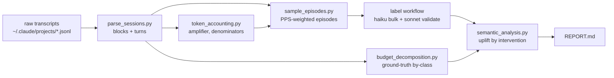
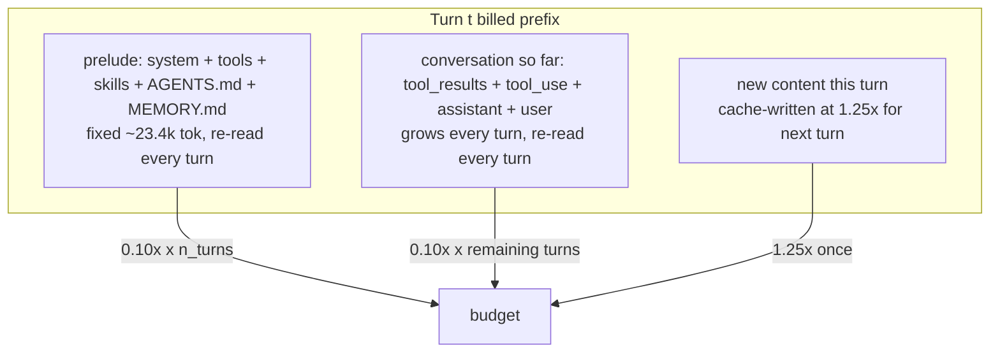

# Where the token budget goes in agentic coding sessions, and what memory/wikis/indexes can save

Analysis of 3,251 Claude Code sessions (174,931 turns) from one engineer's `~/.claude`
transcripts, February–July 2026. Scripts and data schema: `scripts/context_efficiency/`.

## TL;DR

- Under prompt caching, the token budget is dominated by **carrying context, not fetching it**:
  72.3% of the budget is cache-read, 26.5% is cache-write, 1.2% is uncached input. Every token
  parked in the context window is re-read on each later turn, at an aggregate rate of 34× (median
  session 2.15×; the aggregate is pulled up by a few very long sessions).
- **The cost lives in the conversation, and the conversation is mostly tool output.** Conversation
  carry is 58.1% of the budget and tool results are ≥57% of conversation content, so tool output
  touches **≥59% of the whole budget** (a lower bound — tool results are truncated in storage).
  Cutting a tool call shrinks both its one-time surface and its re-read carry.
- **The prelude (system prompt + tool schemas + skills + AGENTS.md + MEMORY.md) is 16.9% of the
  budget**, re-read every turn. Only ~20% of it (AGENTS.md + the MEMORY.md index, ~4.6k tokens) is
  under our control; the rest is harness-fixed. An always-on memory that grows the prelude is taxed
  at the full carry rate, so memory must be retrieval-gated, not concatenated.
- **The budget is concentrated: the top 100 of 3,251 sessions account for 70% of it** (top 1% = 45%).
  The median session is 7 turns; the mean is 54 and the max is 5,983. Any intervention that does not
  help the long sessions cannot move the aggregate.
- We labeled a token-cost-weighted sample of 2,000 tool-call **episodes** with sub-agents to judge,
  per episode, whether a wiki / semantic code index / persistent memory / better tool / result
  compaction would have served the same need with a smaller answer.
  Half of that tool surface is irreducible (git/PR inspection, test runs, reading the agent's own
  scratch output). The realizable saving from all "supermemory" options together is **~6–9% of the
  budget** (Sonnet-calibrated; ~12–17% on more optimistic Haiku labels). About half of it is an
  automatic semantic code index plus better tool defaults plus result compaction (no authoring); the
  rest is maintained subsystem architecture docs, and only at subsystem granularity — a per-fact wiki
  nets ~0.3%, because 556 of 569 proposed article topics never recur across sessions.

The highest-leverage single change is an automatic semantic code index; it serves the one addressable
bucket that matters (code navigation, ~40% of the tool surface). A shared wiki is worth building at
subsystem granularity and for correctness/onboarding, not as a per-fact token play, and any persistent
memory must be retrieval-gated — a memory concatenated into the always-on prelude is re-read every
turn and costs more than it saves. The largest structural lever sits outside the supermemory framing:
the budget is concentrated in a few thousand-turn sessions (top 100 = 70%) where context hygiene acts
on the 58% conversation-carry directly.

---

## 1. Question and approach

We want the token budget a "supermemory"-style system could save: a shared wiki of durable facts, a
persistent per-agent memory, a semantic code index (RAG), better docs/repo-maps, better tools, or
automatic result compaction. The corpus is one engineer's own Claude Code sessions, so the numbers
are specific to this workload (heavy Rust/Python systems work across the `marin`, `iris`, `weaver`,
and `levanter` repos), not a general claim.

The analysis has two halves:

1. **Ground-truth accounting** (§3–§4): where the budget goes, measured from the billed usage
   records, not from a token proxy.
2. **Semantic labeling** (§5–§6): what fraction of the tool surface each intervention could actually
   forestall or compress, measured by sub-agent judgment on a cost-weighted sample of episodes.



## 2. Dataset

| Quantity | Value |
|---|---|
| Sessions | 3,251 |
| Turns (assistant billing events) | 174,931 |
| Turns/session (median / mean / p95 / max) | 7 / 54 / 231 / 5,983 |
| Distinct new input tokens (cache_creation + input) | 858M |
| Cache-read tokens | 27,714M |
| Output tokens | 241M |
| Date range | 2026-02 to 2026-07 |

One session is one transcript file. A "turn" is one assistant response with its usage record
(`cache_creation`, `cache_read`, `input_tokens`, `output_tokens`). A "block" is one content unit
inside a turn (a `tool_result`, `tool_use`, assistant `text`, `thinking`, or `user_text`). Parsing
details and field definitions: `parse_sessions.py`.

## 3. Cost model

### 3.1 Pricing

Anthropic prompt-cache prices, relative to the base input rate (= 1.0):

| Token class | Multiplier | Cached? |
|---|---|---|
| Uncached input | 1.0× | — |
| Cache write (5-min TTL) | 1.25× | written |
| Cache read | 0.10× | read |
| Output | 5.0× | never cached |

The base-price budget (the denominator for every percentage in this report) is:

```
budget = 1.25·cache_creation + 0.10·cache_read + 1.0·input      [input-equivalents]
```

We report input-equivalents rather than dollars so the number is model-price-independent; including
output at 5× adds 1,203M (a separate stream — output is generated, not something a memory system
carries). For this corpus, budget = **3,833M input-equivalents**.

### 3.2 The re-read amplifier

A token written to the cache at turn `t` is re-read on every later turn it survives, at 0.10× each.
Per session we measure the realized amplifier directly:

```
A_S = cache_read_S / cache_creation_S
```

Aggregated over the corpus, `A_S = 34.1×`. Per session the **median is 2.15×**; the aggregate is far
higher because a few thousand-turn sessions re-read their context hundreds of times and dominate the
sum. This heavy tail is why the budget is so concentrated (§4.4) and why we price each saved chunk
with its own session's amplifier rather than a global constant.

### 3.3 Transcript fidelity — why we anchor on usage, not a content proxy

The obvious content proxy is `chars/4`. It fails as an absolute measure: summed over all persisted
blocks it accounts for ~91M tokens against 813M actual `cache_creation`, an **8.6× undercount**.
Three causes, all verified in the transcripts:

- **Tool results are truncated in storage.** Long command/file outputs are stored truncated but were
  billed in full.
- **Thinking is stripped.** The output-token ratio `real_output / est(text+thinking+tool_use)` is
  13.4×, i.e. most generated thinking is billed but absent from the transcript.
- **Images cost tokens with ~0 chars.**

A per-class calibration by non-negative least squares (Appendix B) confirms only `user_text`
(k=0.95) and the prelude (k=1.27) calibrate cleanly; `text` and `tool_use` coefficients are inflated
by multicollinearity with the hidden per-turn thinking volume. So a precise per-class token split is
not recoverable from the transcript. Every headline number in §4 is therefore taken from the exact
billed usage records; the proxy is used only for relative within-episode weighting in §6, where a
roughly-uniform truncation cancels in the ratio.

## 4. Where the budget goes (ground-truth)

Each turn re-reads a prefix that is the fixed prelude plus the entire conversation so far, then
appends new content that is cache-written for the next turn:



### 4.1 Exact price split

| Stream | Share of budget |
|---|---|
| Cache-read (0.10×) | 72.3% |
| Cache-write (1.25×) | 26.5% |
| Uncached input (1.0×) | 1.2% |

### 4.2 Where the cost lives

Splitting the read stream into the fixed prelude (re-read every turn) versus the accumulated
conversation, both taken from usage:

| Component | Share of budget |
|---|---|
| Conversation carry (re-read) | 58.1% |
| New-content write | 23.8% |
| Prelude carry (re-read) | 14.2% |
| Prelude write (once/session) | 2.7% |
| Uncached input | 1.2% |
| **Prelude total** | **16.9%** |
| **Conversation total** | **81.9%** |

The conversation carry (58.1%) is the largest single component, and it is composed of tool output.
Within conversation content, the faithful-proxy mass splits as tool_result 57.2%, user_text 23.7%,
tool_use 15.0%, assistant text 4.2%. Since tool_result is truncated in storage, its true share is
higher. Tool content (result + call) is therefore ≥72% of conversation mass and touches
**≥59% of the whole budget** — this is the surface a memory/index/compaction system can act on. An
earlier version of this analysis put the tool surface at 7.8%; that came from the 8.6× token
undercount times a read multiple capped at the median-2 amplifier, and was wrong by ~6×. Cutting a
tool call reduces the re-read conversation, which is most of the budget.

### 4.3 Prelude decomposition

Median prelude = 23,425 tokens, re-read every turn.

| Prelude component | Tokens | Share of prelude | Controllable? |
|---|---|---|---|
| Harness (system prompt + tool schemas + skill catalog) | 18,839 | 80.4% | no (not in transcript; measured as residual) |
| AGENTS.md (inlined as claudeMd) | 2,102 | 9.0% | yes |
| MEMORY.md index | 2,484 | 10.6% | yes |
| **Marin-controlled total** | **4,586** | **19.6%** | yes |

An always-on token in the prelude costs `1.25 + 0.10·(n_turns−1)` input-equivalents — at the median
7-turn session ~1.9×, and in a 231-turn p95 session ~24×. Growing MEMORY.md by one entry is paid on
every turn of every session thereafter. This is the mechanism that forces retrieval-gating: a memory
concatenated into the prompt is taxed by the amplifier; a memory fetched only when relevant is not.

### 4.4 Concentration

| Slice of sessions (of 3,251) | Share of budget |
|---|---|
| Top 10 | 25% |
| Top 1% (32 sessions) | 45% |
| Top 100 | 70% |

The budget is a long-tail phenomenon. An intervention that saves 20% on a median 7-turn session but
does nothing for a 3,000-turn session barely moves the aggregate.

### 4.5 Cache eviction is small and not a lever we control

The 5-minute cache TTL means a turn that starts >5 minutes after the previous one re-materializes the
prefix at 1.25× instead of reading it at 0.10× (12.5× more per token). We measured it directly: only
0.9% of turns follow a >5-minute gap, and eviction re-creation is **1.1% of the budget**. 96% of
turns are <1 minute apart. The TTL is harness-fixed and we cannot change it. Eviction still matters
for one reason: it makes prefix *size* a lever. A smaller carried prefix costs less on every read and
on every eviction, so any context reduction is priced by at least the read amplifier and occasionally
by the 1.25× rewrite. This makes the §6 savings estimates a conservative floor.

**§4 takeaway.** The addressable surface is large (tool content ≥59% of budget; prelude 16.9%), and
the budget is concentrated in long sessions with high re-read multiples. Whether a memory system can
realize that surface depends on how much of the tool traffic is durable-fact lookup versus volatile
self-inspection — measured next.

## 5. Semantic labeling method

A syntactic classifier (command name + output-hash churn) cannot tell why a call happened or whether
a substitute would answer it. We replace it with sub-agent judgment on tool-call episodes.

### 5.1 Episodes

An **episode** is a contiguous run of information-gathering tool calls (Read, Grep, Glob, Bash,
WebFetch, ...) inside one session serving a single sub-goal, bounded by a human message, a mutating
edit, or a 12-call cap. Each episode carries the governing user request, the assistant's stated
intent before each call, a summary of each call, and a truncated result preview with the true result
token size. Construction: `sample_episodes.py`. The corpus yields 13,274 episodes across 2,237
sessions.

### 5.2 Sampling

We sample 2,000 episodes by **probability proportional to size (PPS)** on each episode's amplified
carry cost, taking the heavy tail as certainty units (226 of 2,000). A sampled episode then
represents a known slice of the tool budget, so a cost-weighted saved fraction estimates the
population directly, with no separate expansion model.

### 5.3 Label schema

Each episode is labeled by a sub-agent (bulk: Haiku 4.5; validation subset: Sonnet 5) with:

| Field | Values |
|---|---|
| `intent_category` | locate-definition, understand-usage, check-repo-state, inspect-git-or-pr, run-build-test, read-docs, verify-hypothesis, explore-structure, read-own-output, fetch-external, environment-setup, other |
| `answer_kind` | stable-repo-fact, volatile-session-state, external, mutating, compute |
| `best_substitute` | none, shared-wiki, semantic-code-index, persistent-memory, better-tool-or-flag, result-compaction, repo-map-or-docs |
| `substitute_sufficient` | full, partial, no (coverage) |
| `substitute_size_ratio` | 0..1: size(substitute + residual) / size(actual results) |
| `wiki_topic_slug` | kebab-case topic, if a durable article would generalize |

The saved fraction per episode is `clip(1 − size_ratio, 0, 1)` when the substitute is not `none` and
is at least partially sufficient, else 0. The size ratio already includes residual lookups and the
substitute's own read, so the saving is net. Population saving per intervention is the cost-weighted
sum, mapped to budget share through the §4 tool-addressable anchor.

### 5.4 Validation and calibration

We re-labeled 150 episodes (10 batches) with Sonnet 5. Sonnet agrees with Haiku on
addressable-versus-irreducible 66.7% of the time and on the exact substitute 54%, but estimates a
systematically lower saved fraction: mean 0.149 versus Haiku's 0.287. The disagreement is in
magnitude, not direction — both models put half the tool surface as irreducible and both put
code-navigation as where the savings are. Sonnet is the stronger judge, so we take
0.519 = 0.149 / 0.287 as a calibration factor, lead with the Sonnet-calibrated numbers, and keep the
raw Haiku labels as an optimistic bound. Neither is a measured replacement; measuring the real saving
requires building the tool and running it.

## 6. Results

All 2,000 sampled episodes were labeled (1,999 usable). The tool surface is ≥59.1% of the budget
(§4.2), and **49.8% of that surface is irreducible** — `none` (volatile session state, compute, or
mutation, where no memory/index/doc forestalls the call).

### 6.1 What is addressable, by answer kind and intent

Saved fraction is the cost-weighted fraction of each bucket's tool cost the labelers judged
forestallable or compressible (Haiku labels).

| Answer kind | Share of tool surface | Saved fraction |
|---|---|---|
| stable-repo-fact | 41.2% | 0.61 |
| volatile-session-state | 39.1% | 0.13 |
| compute (ran code) | 14.3% | 0.04 |
| mutating | 4.4% | 0.00 |

| Intent | Share of tool surface | Saved fraction |
|---|---|---|
| understand-usage | 21.9% | 0.59 |
| inspect-git-or-pr | 21.7% | 0.13 |
| run-build-test | 16.3% | 0.02 |
| explore-structure | 9.0% | 0.63 |
| verify-hypothesis | 6.7% | 0.18 |
| locate-definition | 6.4% | 0.68 |
| read-own-output | 4.3% | 0.14 |
| read-docs | 2.7% | 0.54 |

The savings are concentrated in one place: durable code-navigation (understand-usage,
explore-structure, locate-definition, read-docs) is ~40% of the tool surface and 54–68% of it is
addressable. Everything else — inspecting live git/PR state, running tests, verifying this session's
own changes, reading scratch output the agent just wrote — is mostly irreducible.

### 6.2 Uplift by intervention

Per-episode potential, before accounting for authoring cost or recurrence (Haiku labels, as a
fraction of the whole budget):

| Best substitute | Episodes | Share of tool surface | Saved (% of budget) | Mean size ratio |
|---|---|---|---|---|
| none (irreducible) | 1,048 | 49.8% | 0.00 | 1.00 |
| semantic-code-index | 338 | 18.2% | 6.89 | 0.36 |
| shared-wiki | 249 | 12.8% | 4.93 | 0.35 |
| repo-map-or-docs | 122 | 6.9% | 2.70 | 0.33 |
| persistent-memory | 94 | 5.3% | 1.85 | 0.40 |
| better-tool-or-flag | 96 | 4.6% | 1.24 | 0.55 |
| result-compaction | 51 | 2.4% | 0.83 | 0.42 |

Total per-episode potential: **18.5% of budget (Haiku), 9.6% (Sonnet-calibrated)**.

### 6.3 Realizable savings

Per-episode potential is a ceiling. It is realized only if the substitute exists at low marginal
cost. That depends on the intervention:

- **Automatic** (semantic-code-index, better-tool-or-flag, result-compaction) is generated from the
  code and tooling with no per-item authoring, so its per-episode saving is realizable directly.
- **Authored per-repo** (repo-map-or-docs) is one artifact per repo, amortized over every navigation
  episode in that repo.
- **Authored per-topic** (shared-wiki, persistent-memory) needs the same article/fact to recur
  across sessions to pay back its authoring. Recurrence is the gate.

The recurrence gate is the whole story for the wiki. The labelers proposed 569 distinct topic slugs;
only 13 recur across ≥2 sessions at the raw-slug level. But the slugs are fragmented — many labelers
name one subsystem several ways. A Sonnet pass clustered the 569 slugs into 126
maintainable-doc topics, of which **70 recur across ≥2 sessions** (the top ones appear in 8–17
sessions each: `marin-lazy-execution-architecture`, `iris-controller-architecture`,
`weaver-frontend-architecture`, `iris-federation-architecture`). A per-fact wiki does not clear the
bar; a per-subsystem architecture doc does.

| Intervention | Realizable (% budget), Haiku | Sonnet-calibrated |
|---|---|---|
| Automatic: semantic index + better tools + result compaction | 8.96 | **4.65** |
| Authored per-repo map/docs | 2.70 | 1.40 |
| Authored wiki/memory (per-fact slug → per-subsystem doc) | 0.57 → 5.70 | 0.30 → **2.96** |
| **Realizable total** | **12.2 → 17.4** | **6.4 → 9.0** |

The realizable saving is **~6–9% of the token budget** (Sonnet-calibrated), up to ~12–17% on the
optimistic Haiku labels. Roughly half of it (~4.7% calibrated) is the automatic semantic code index
plus better tool defaults plus result compaction, which need no authoring. The other half is
maintained subsystem architecture docs, and only if written at subsystem granularity. A per-fact
wiki or naive memory contributes ~0.3%.

## 7. Recommendations

Ranked by realizable token saving per unit of effort. All percentages are Sonnet-calibrated shares of
the base-price budget; the Haiku-optimistic figure is ~1.9× higher.

1. **Automatic semantic code index (RAG over the repo).** ~3.5% of budget on its own (the full
   automatic bundle with recs 2–3 is ~4.7%), no authoring, updates with the code. It serves the one
   addressable bucket that matters: understand-usage, explore-structure, locate-definition, and
   read-docs (together ~40% of the tool surface, 54–68% addressable). It is *partial* by nature — the
   agent still reads the regions the index points to — which the size ratios (~0.36) already price in.
   This is the highest-leverage single change.
2. **Result compaction of large tool outputs.** ~0.4% directly, but it also trims the conversation
   carry that is 58% of the budget and is worst in the long sessions that hold 70% of it. Automatic,
   cheap, and it compounds with every re-read. Low risk if the full output stays retrievable.
3. **Better tool defaults.** ~0.6%, nearly free: default to field-narrowed `gh --json`, `rg`/`head`
   over `cat`, and `git log/show` with explicit paths. These shrink results the agent already fetches.
4. **Maintained subsystem architecture docs (repo map + a handful of wiki pages).** ~1.4–3% of budget,
   but only at subsystem granularity — one doc per subsystem that recurs across sessions
   (`iris-controller`, `iris-federation`, `marin-lazy-execution`, `weaver-frontend`, `loom-deployment`,
   ...). These pay for themselves in this corpus because those subsystems are navigated in 8–17
   sessions each. Do not build a per-fact wiki; 556 of 569 proposed article topics never recur.
5. **Persistent per-agent memory.** ~0.3–1% of budget. Worth building for correctness and continuity,
   not for tokens, and only if **retrieval-gated**: a memory concatenated into the always-on prelude
   is re-read every turn (§4.3), so a naive always-on memory costs more in prelude carry than it saves.

What not to do: grow the always-on prelude. AGENTS.md + the MEMORY.md index are already 4.6k tokens
re-read on all 174,931 turns. Every token added there is taxed by the full re-read amplifier.

The largest structural lever is not on this list because it is not a "supermemory" feature: the budget
is concentrated in a few thousand-turn sessions (top 100 = 70%) where accumulated context is re-read
hundreds of times. Context hygiene there (dropping tool results once they are stale) acts on the 58%
conversation-carry directly. We did not quantify its realizable saving: the harness already compacts
long sessions (the realized amplifier is 34×, far below naive full retention), so the remaining
headroom depends on a retention policy we cannot observe from the transcripts. It is the most
promising place to look next.

## 8. Threats to validity

- **Single-user corpus.** One engineer's workload (systems code across four repos, heavy agentic
  orchestration). The intent mix and the durable-fact fraction will differ for other users.
- **Transcript fidelity (§3.3).** Tool results are truncated and thinking is stripped in storage, so
  absolute per-class token splits are not recoverable; we anchor on usage and use the proxy only for
  relative weighting.
- **Labeler optimism.** `substitute_size_ratio` is a sub-agent estimate, not a measured replacement.
  A semantic index that "finds the region in one query" still requires reading the region; the labels
  attempt to price that residual, but the estimate is soft. The Sonnet validation subset bounds the
  disagreement (§5.3).
- **Output-side re-derivation is out of frame.** A memory that saves the model from re-deriving a
  conclusion saves output tokens (5×), which are not persisted and not measured here. The §6 numbers
  are input-side only, a lower bound on total value.
- **Whole-session avoidance is out of frame.** If better docs prevent a session from happening, that
  is not captured by within-session episode substitution.

## 9. Reproduction

```
scripts/context_efficiency/
  parse_sessions.py         # transcripts -> _data/{blocks,turns}.parquet
  token_accounting.py       # denominators, amplifier -> _data/session_amplifier.parquet
  budget_decomposition.py   # ground-truth by-class split, prelude, eviction
  sample_episodes.py        # PPS-weighted episode sample -> _data/episode_batches/
  semantic_analysis.py      # labels -> uplift by intervention
```

Run order: `parse_sessions.py` → `token_accounting.py` → `budget_decomposition.py` →
`sample_episodes.py` → labeling workflow → `semantic_analysis.py`. Data (`_data/`) is gitignored.

## Appendix A — Cost-model derivation

Base-price budget (§3.1) with the three denominators the headline could divide by:

| Denominator | Value | Meaning |
|---|---|---|
| Raw distinct input | 858M | tokens the model saw for the first time |
| Base-price input-equivalents | 3,833M | what caching actually bills (headline) |
| Dollar-equivalent incl. output | 5,035M | base + 5×output |

Per-block carry used for sampling weights and the concentration ablation:

```
carry(block) = tokens · (1.25 + 0.10·min(remaining_turns, A_S))
```

capped at the session amplifier because a chunk cannot be re-read more times than the session's
realized average.

## Appendix B — Proxy calibration (why a clean per-class split is not recoverable)

Session-level NNLS of actual `cache_creation` on per-class proxy tokens gives `user_text` k=0.95 and
`prelude` k=1.27 (both content types are fully persisted, so k≈1 is the correct sanity check), but
`text` k=70 and `tool_use` k=14 — impossible expansion factors that indicate the regression is
absorbing the hidden per-turn thinking volume through the assistant blocks that co-occur with it
(R²=0.96 fit, wrong coefficients). `tool_result` k=4.37 is consistent with genuine storage
truncation. We therefore do not report a calibrated per-class split; §4 uses only quantities taken
directly from usage.

## Appendix C — Top maintainable-doc topics by forestalled tokens

The 569 raw topic slugs proposed by the labelers were clustered (Sonnet) into 126 maintainable-doc
topics; 70 recur across ≥2 sessions. The top 20 by forestalled tool cost, with the number of distinct
sessions each was navigated in (the recurrence that justifies the doc). "Forestalled" is the
cost-weighted, Haiku-labeled saving; divide by ~1.9 for the Sonnet-calibrated figure.

| Doc-cluster topic | Episodes | Sessions | Forestalled (input-equiv) |
|---|---|---|---|
| `marin-lazy-execution-architecture` | 36 | 16 | 2294k |
| `iris-federation-architecture` | 26 | 12 | 1946k |
| `weaver-frontend-architecture` | 25 | 16 | 1852k |
| `weaver-overlooker-and-watch-system` | 16 | 8 | 1671k |
| `iris-controller-architecture` | 23 | 17 | 1659k |
| `grug-moe-architecture` | 25 | 15 | 1542k |
| `loom-deployment-and-rollout` | 21 | 14 | 1466k |
| `iris-multi-backend-abstraction` | 21 | 9 | 1403k |
| `weaver-github-app-integration` | 13 | 8 | 1085k |
| `iris-autoscaler-architecture` | 12 | 8 | 909k |
| `weaver-session-lifecycle` | 11 | 6 | 869k |
| `finelog-architecture` | 13 | 7 | 841k |
| `iris-reservation-system` | 13 | 7 | 802k |
| `iris-scheduler-and-resource-accounting` | 10 | 9 | 733k |
| `iris-auth-and-iap` | 13 | 8 | 730k |
| `weaver-codebase-map` | 7 | 7 | 681k |
| `weaver-agent-lifecycle-and-architecture` | 9 | 4 | 669k |
| `iris-test-conventions` | 9 | 9 | 628k |
| `loom-session-architecture` | 8 | 6 | 603k |
| `iris-endpoint-and-proxy` | 8 | 6 | 531k |

These are the docs worth writing: each is a subsystem navigated across 4–17 sessions, so one
maintained architecture page amortizes across many explorations. The tail (46 singleton clusters) is
the per-fact wiki that does not pay back.
