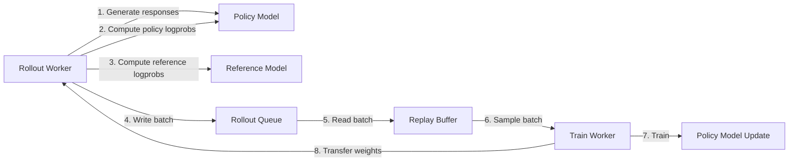
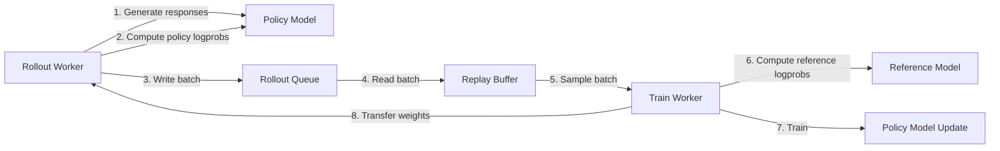

# Post-Training Module Architecture

## Overview

The post-training module implements a distributed reinforcement learning system for fine-tuning language models using policy gradient methods (RLOO/PPO). The system consists of two main worker types that communicate asynchronously through a rollout storage queue.

## Core Components

### 1. Workers

#### Rollout Worker (`rollout_worker.py`)
**Purpose**: Generate rollouts (trajectories) using the current policy model.

**Key Responsibilities**:
- Loads and maintains the policy model
- Receives weight updates from training worker via weight transfer
- Generates responses from environments using the policy model
- Computes policy logprobs during generation
- **Currently computes reference logprobs** (to be moved to train worker)
- Writes rollout batches to storage queue

**Key Classes**:
- `RolloutWorker`: Main worker class
- `LevanterInferenceContext`: Wraps model for inference and logprob computation

#### Train Worker (`train_worker.py`)
**Purpose**: Train the policy model using rollout data.

**Key Responsibilities**:
- Maintains both policy and reference models
- Reads rollout batches from storage queue
- Manages replay buffer for experience replay
- Computes PPO/RLOO loss and trains the model
- Serves updated weights to rollout workers
- Creates checkpoints

**Key Classes**:
- `TrainWorker`: Main training orchestrator
- `StreamingRolloutLoader`: Converts rollout data to training batches

### 2. Data Flow Components

#### Rollout Storage (`rollout_storage.py`)
**Purpose**: Queue system for passing rollout data from inference to training.

**Key Classes**:
- `RolloutBatch`: Core data structure containing:
  - `input_ids`: Input token sequences
  - `attention_mask`: Attention masks
  - `position_ids`: Position IDs
  - `target_ids`: Target tokens for loss
  - `loss_weights`: RLOO advantages
  - `loss_masks`: Masks for loss computation
  - `reference_logprobs`: Reference model logprobs (to be removed)
  - `policy_logprobs`: Policy model logprobs
- `TaggedRolloutBatch`: Adds metadata (env_name, worker_id, timestamp)
- `FileRolloutReader/Writer`: File-based queue implementation
- `InMemoryRolloutReader/Writer`: Memory-based queue for testing

#### Replay Buffer (`replay_buffer.py`)
**Purpose**: Manage rollout data for training with prioritized sampling.

**Key Features**:
- Stores rollouts per environment
- Implements recency-weighted sampling
- Tracks usage count for sample retirement
- Balances sampling across environments

**Key Classes**:
- `ReplayBuffer`: Main buffer implementation
- `ReplayDataLoader`: Background loader that fetches from queue

#### RL Dataset (`rl_dataset.py`)
**Purpose**: Convert environment interactions into training data.

**Key Functions**:
- `create_dataset_from_environment()`: Main entry point for dataset creation
- `RLDataset.from_env_step()`: Converts environment step to dataset
  - Currently computes reference logprobs here (to be removed)
- `prepare_training_batch()`: Formats data for language model training
- `compute_rloo_advantages_for_group()`: Computes RLOO advantages

### 3. Support Systems

#### Weight Transfer (`weight_transfer/`)
**Purpose**: Efficiently transfer model weights between workers.

**Implementations**:
- `ArrowFlightWeightTransfer`: High-performance transfer using Arrow Flight
- `RayWeightTransfer`: Ray-based object store transfer
- `CheckpointWeightTransfer`: File-based transfer via checkpoints

#### Environments (`environments/`)
**Purpose**: Define tasks and compute rewards.

**Base Protocol**:
- `InferenceContext`: Interface for model inference
  - `generate()`: Generate text responses
  - `compute_logprobs()`: Compute log probabilities
- `MarinEnv`: Base environment class
  - `step()`: Generate problems, responses, and rewards

**Implementations**:
- `MockEnv`: Test environment with configurable tasks
- Math environments: `MathEnv`, `NuminaMathEnv`, `OlympiadBenchEnv`, etc.
- Coding environments: `SWEBenchEnv`

## Current Data Flow

## Proposed Data Flow (After Migration)

## Key Interfaces

### RolloutBatch Fields (Current)
- Training inputs: `input_ids`, `attention_mask`, `position_ids`, `target_ids`
- Loss computation: `loss_weights` (advantages), `loss_masks`
- Logprobs: `reference_logprobs`, `policy_logprobs`

### RolloutBatch Fields (After Migration)
- Training inputs: `input_ids`, `attention_mask`, `position_ids`, `target_ids`
- Loss computation: `loss_weights` (advantages), `loss_masks`
- Logprobs: `policy_logprobs` only

## Testing Infrastructure

### Integration Tests (`test_async_train.py`)
- `test_rollout_worker`: Tests rollout generation
- `test_train_worker`: Tests training with manual rollouts
- `test_inference_and_training_workers`: End-to-end test
- `test_train_worker_with_manual_cats_rollout`: Tests with synthetic data
- `test_full_integration_moar_cats`: Long-running integration test

### Test Helpers (`config_helpers.py`)
- `create_rollout_batch()`: Creates test rollout batches with computed logprobs
- `compute_model_logprobs()`: Helper for computing logprobs
- `DummyTokenizer`: Simplified tokenizer for testing

## Migration Impact

### Components Affected
1. **rollout_worker.py**: Remove reference model and logprob computation
2. **train_worker.py**: Add reference logprob computation before training
3. **rollout_storage.py**: Remove reference_logprobs field
4. **rl_dataset.py**: Remove reference logprob computation
5. **replay_buffer.py**: No changes needed (doesn't handle reference logprobs)

### Benefits
- Reduced memory usage in rollout workers (~50% reduction)
- Simpler rollout worker implementation
- Better separation of concerns
- More scalable architecture (can run more rollout workers)